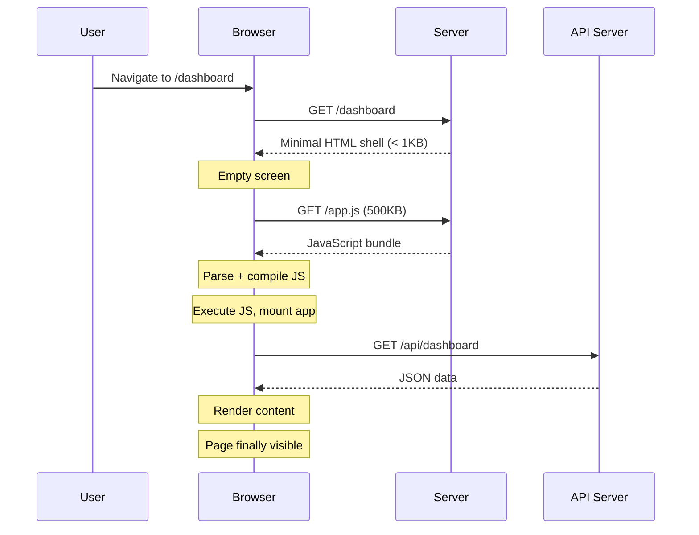
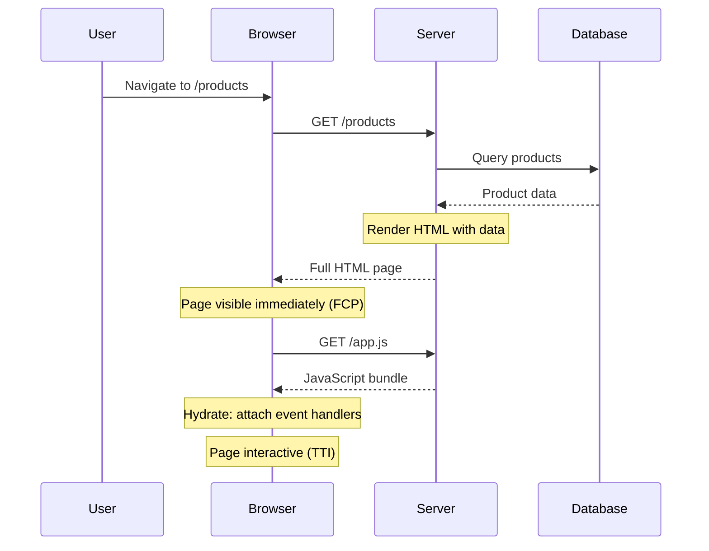
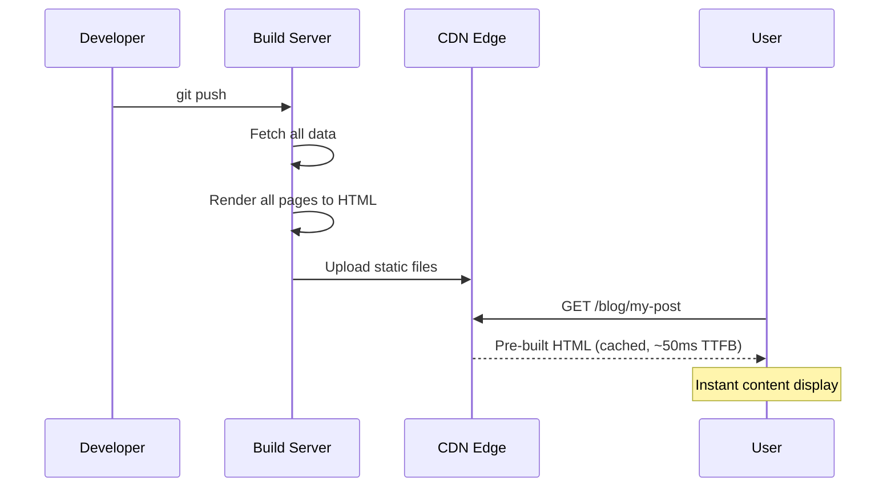
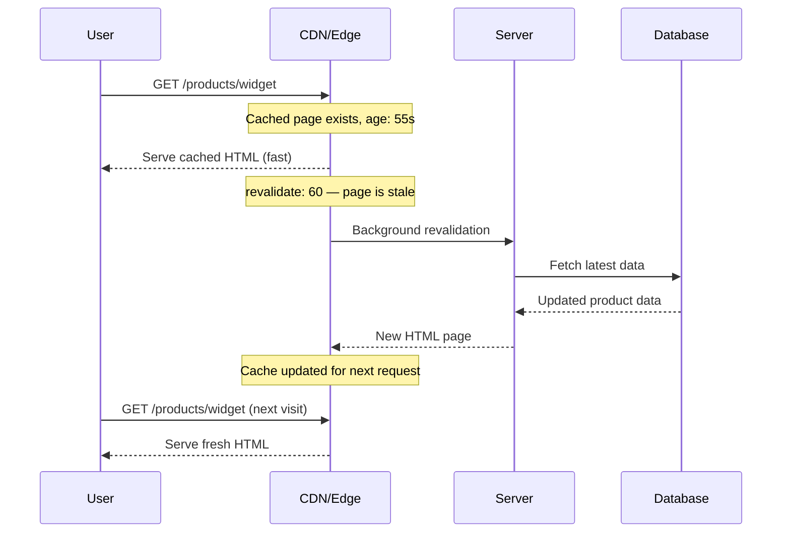
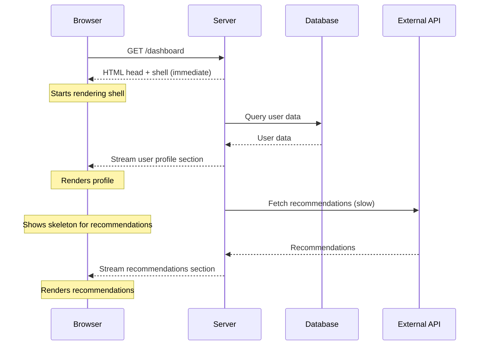
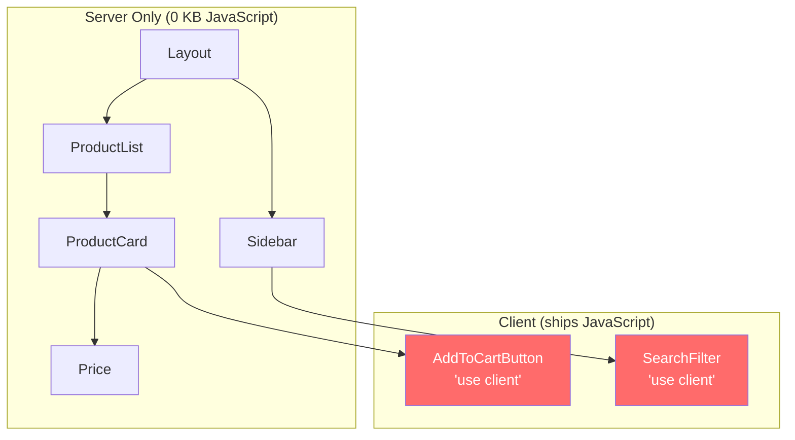
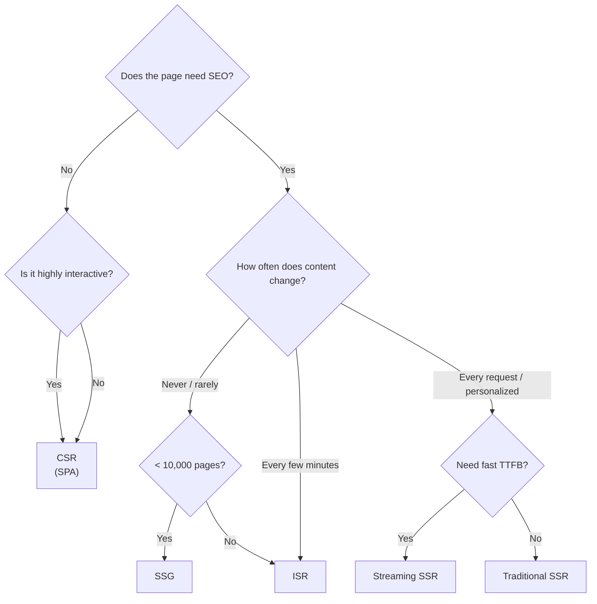

# SSR vs SSG vs ISR vs CSR

Where and when your HTML is generated is the single most consequential architectural decision in frontend engineering. It affects performance, SEO, infrastructure cost, development complexity, and the user experience across every page of your application. There is no universally correct answer — only trade-offs that align (or conflict) with your specific requirements.

This page explains each rendering strategy from first principles, covers their implementation in modern frameworks, and provides a decision matrix to help you choose.

## Client-Side Rendering (CSR)

CSR is the simplest mental model: the server sends an empty HTML shell, the browser downloads JavaScript, and JavaScript renders everything.



### The HTML Shell

```html
<!DOCTYPE html>
<html>
<head>
  <title>Dashboard</title>
  <script defer src="/app.js"></script>
</head>
<body>
  <div id="root"></div>
  <!-- Nothing here. Everything rendered by JavaScript. -->
</body>
</html>
```

### When CSR Works

- **Internal dashboards** where SEO is irrelevant
- **Applications behind authentication** (crawlers cannot access anyway)
- **Highly interactive apps** where the initial load penalty is amortized across a long session (Figma, Google Docs)
- **Offline-first PWAs** using service workers

### When CSR Fails

| Problem | Why It Happens |
|---------|---------------|
| Slow First Contentful Paint | No content until JS downloads, parses, and executes |
| Poor SEO | Search engines see an empty `<div id="root">` (Googlebot executes JS but with caveats) |
| Bad on slow devices | Low-end phones may take 5-10s to parse and execute a 500KB bundle |
| Waterfall requests | HTML -> JS -> API data -> render (serial chain) |

```typescript
// Typical CSR app entry point (React)
import { createRoot } from 'react-dom/client';
import { App } from './App';

const root = createRoot(document.getElementById('root')!);
root.render(<App />);
```

## Server-Side Rendering (SSR)

SSR generates HTML on the server for every request. The browser receives a fully-rendered page, displays it immediately, and then "hydrates" it — attaching JavaScript event handlers to make it interactive.



### How Hydration Works

Hydration is the process of making server-rendered HTML interactive. The browser already has the DOM, so React (or Vue, Svelte, etc.) walks the existing DOM tree and attaches event listeners without rebuilding it:

```typescript
// Server: render to HTML string
import { renderToString } from 'react-dom/server';
import { App } from './App';

app.get('/products', async (req, res) => {
  const products = await db.query('SELECT * FROM products');

  const html = renderToString(<App products={products} />);

  res.send(`
    <!DOCTYPE html>
    <html>
    <head><script defer src="/app.js"></script></head>
    <body>
      <div id="root">${html}</div>
      <script>
        window.__INITIAL_DATA__ = ${JSON.stringify(products)};
      </script>
    </body>
    </html>
  `);
});

// Client: hydrate (don't re-render, just attach listeners)
import { hydrateRoot } from 'react-dom/client';
import { App } from './App';

hydrateRoot(
  document.getElementById('root')!,
  <App products={window.__INITIAL_DATA__} />
);
```

### The Hydration Problem

Hydration is expensive. The browser must:
1. Download the entire JavaScript bundle
2. Parse and compile it
3. Execute it to re-create the component tree in memory
4. Walk the existing DOM to match it against the virtual DOM
5. Attach all event listeners

During steps 1-5, the page is **visible but not interactive** — buttons appear clickable but do not respond. This gap between FCP and TTI is called the "uncanny valley" of SSR.

::: warning The Worst Case
On a slow device, a server-rendered page might be visible in 1 second but not interactive for 5 seconds. The user clicks a button, nothing happens, they click again, and when hydration finally completes, the queued clicks fire out of order. This is worse than CSR, where at least the page is honestly blank until it is ready.
:::

### SSR in Modern Frameworks

```typescript
// Next.js App Router (SSR by default)
// app/products/page.tsx
export default async function ProductsPage() {
  const products = await fetch('https://api.example.com/products');
  const data = await products.json();

  return (
    <main>
      <h1>Products</h1>
      {data.map((product: Product) => (
        <ProductCard key={product.id} product={product} />
      ))}
    </main>
  );
}

// Nuxt 3 (SSR by default)
// pages/products.vue
<script setup lang="ts">
const { data: products } = await useFetch('/api/products');
</script>

<template>
  <main>
    <h1>Products</h1>
    <ProductCard
      v-for="product in products"
      :key="product.id"
      :product="product"
    />
  </main>
</template>
```

## Static Site Generation (SSG)

SSG generates all HTML at **build time**. Every page becomes a static file that can be served from a CDN with no server compute per request.



### When SSG Excels

- **Blogs and documentation** (VitePress, Astro, Hugo)
- **Marketing sites** with infrequently changing content
- **E-commerce product catalogs** (with ISR for updates)
- **Any page where content does not change between requests**

### SSG Limitations

| Limitation | Impact |
|-----------|--------|
| Build time scales with page count | 10,000 pages = 10-30 min builds |
| Stale content until next build | Blog comments, stock prices don't update |
| No per-user personalization | Same HTML for every visitor |
| Dynamic routes need enumeration | Must know all paths at build time |

```typescript
// Next.js static generation
// app/blog/[slug]/page.tsx
export async function generateStaticParams() {
  const posts = await getAllPosts();
  return posts.map((post) => ({ slug: post.slug }));
}

export default async function BlogPost({ params }: { params: { slug: string } }) {
  const post = await getPostBySlug(params.slug);
  return <Article post={post} />;
}

// VitePress (SSG by default - what Archon uses)
// Every .md file becomes a static HTML page at build time
// Data loading via frontmatter + build-time data loaders
```

## Incremental Static Regeneration (ISR)

ISR bridges the gap between SSG and SSR. Pages are statically generated at build time but can be **revalidated** (regenerated) on a timer or on-demand after deployment.



### Time-Based Revalidation

```typescript
// Next.js ISR with time-based revalidation
// app/products/[id]/page.tsx
export const revalidate = 60; // Revalidate at most every 60 seconds

export default async function ProductPage({ params }: { params: { id: string } }) {
  const product = await fetch(`https://api.example.com/products/${params.id}`);
  const data = await product.json();

  return <ProductDetail product={data} />;
}
```

### On-Demand Revalidation

```typescript
// Next.js on-demand revalidation via API route
// app/api/revalidate/route.ts
import { revalidatePath, revalidateTag } from 'next/cache';
import { NextRequest, NextResponse } from 'next/server';

export async function POST(req: NextRequest) {
  const { secret, path, tag } = await req.json();

  if (secret !== process.env.REVALIDATION_SECRET) {
    return NextResponse.json({ error: 'Invalid secret' }, { status: 401 });
  }

  if (path) {
    revalidatePath(path);
  } else if (tag) {
    revalidateTag(tag);
  }

  return NextResponse.json({ revalidated: true });
}

// Called from CMS webhook when content is published:
// POST /api/revalidate { "secret": "...", "path": "/blog/my-post" }
```

### ISR Trade-offs

| Advantage | Limitation |
|-----------|-----------|
| CDN-speed responses | Stale content for up to `revalidate` seconds |
| No full rebuild on content change | Still requires a server (not purely static) |
| Scales to millions of pages | First request after revalidation window is slow (cache miss) |
| Works with existing SSG mental model | Platform-specific (Next.js, Nuxt, etc.) |

## Streaming SSR

Streaming SSR sends HTML to the browser in chunks as it is generated, rather than waiting for the entire page to be rendered. This dramatically improves Time to First Byte (TTFB) and First Contentful Paint (FCP).



### Implementation with React Suspense

```tsx
// app/dashboard/page.tsx
import { Suspense } from 'react';

export default function Dashboard() {
  return (
    <main>
      <h1>Dashboard</h1>

      {/* This renders immediately */}
      <Suspense fallback={<ProfileSkeleton />}>
        <UserProfile /> {/* Async component, streams when ready */}
      </Suspense>

      {/* This renders immediately */}
      <Suspense fallback={<RecommendationsSkeleton />}>
        <Recommendations /> {/* Slower API, streams later */}
      </Suspense>
    </main>
  );
}

// This component is async — it suspends until data is available
async function UserProfile() {
  const user = await fetchUser(); // 100ms
  return <div>{user.name}</div>;
}

async function Recommendations() {
  const recs = await fetchRecommendations(); // 2000ms
  return <RecommendationsList items={recs} />;
}
```

The browser receives the HTML in this order:
1. **Immediately:** `<h1>Dashboard</h1>` + both skeleton fallbacks
2. **After ~100ms:** User profile HTML replaces `ProfileSkeleton`
3. **After ~2000ms:** Recommendations HTML replaces `RecommendationsSkeleton`

## React Server Components (RSC)

RSC is a paradigm shift. Components are divided into **Server Components** (run only on the server, ship zero JavaScript) and **Client Components** (hydrate in the browser, support interactivity):



```tsx
// Server Component (default in Next.js App Router)
// app/products/page.tsx — runs ONLY on the server
import { AddToCartButton } from './AddToCartButton';

export default async function ProductsPage() {
  // Direct database access — this never reaches the browser
  const products = await db.query('SELECT * FROM products WHERE active = true');

  return (
    <main>
      <h1>Products ({products.length})</h1>
      {products.map((product) => (
        <div key={product.id}>
          <h2>{product.name}</h2>
          <p>{product.description}</p>
          {/* Only this component ships JavaScript */}
          <AddToCartButton productId={product.id} />
        </div>
      ))}
    </main>
  );
}

// Client Component — ships JavaScript for interactivity
// app/products/AddToCartButton.tsx
'use client';

import { useState } from 'react';

export function AddToCartButton({ productId }: { productId: string }) {
  const [added, setAdded] = useState(false);

  return (
    <button onClick={() => {
      addToCart(productId);
      setAdded(true);
    }}>
      {added ? 'Added!' : 'Add to Cart'}
    </button>
  );
}
```

### Why RSC Matters

| Benefit | How |
|---------|-----|
| Smaller JS bundle | Server Components ship 0 KB of JavaScript |
| Direct data access | Query databases, read files — no API layer needed |
| Automatic code splitting | Only Client Components are included in the bundle |
| Streaming | Server Components can stream as they resolve |
| Security | Secrets, API keys, SQL queries never reach the browser |

## Decision Matrix



### Comparison Table

| | CSR | SSR | SSG | ISR | Streaming SSR | RSC |
|---|---|---|---|---|---|---|
| **TTFB** | Fast (empty shell) | Slow (compute per request) | Fastest (CDN) | Fast (cached) | Fast (immediate shell) | Fast |
| **FCP** | Slow (JS must execute) | Fast (HTML ready) | Fastest | Fast | Fastest (shell instant) | Fast |
| **TTI** | Slow | Medium (hydration) | Fast (little JS) | Fast | Progressive | Best (less JS) |
| **SEO** | Poor | Excellent | Excellent | Excellent | Excellent | Excellent |
| **Dynamic data** | Excellent | Excellent | Poor | Good | Excellent | Excellent |
| **Infrastructure** | Static hosting | Server required | CDN only | Server + CDN | Server + CDN | Server + CDN |
| **Cost at scale** | Lowest | Highest | Low | Medium | Medium | Medium |
| **Complexity** | Low | Medium | Low | Medium | High | High |

### Framework Mapping

| Framework | CSR | SSR | SSG | ISR | Streaming | RSC |
|-----------|:---:|:---:|:---:|:---:|:---------:|:---:|
| Next.js 15 | Yes | Yes | Yes | Yes | Yes | Yes |
| Nuxt 4 | Yes | Yes | Yes | Yes | Yes | No |
| Remix | Yes | Yes | No | No | Yes | No |
| Astro | Yes | Yes | Yes | No | Yes | No |
| SvelteKit | Yes | Yes | Yes | No | Yes | No |
| VitePress | No | No | Yes | No | No | No |
| Qwik | Yes | Yes | Yes | No | Yes | No |

## Hybrid Approaches

Modern frameworks allow mixing strategies within a single application. This is the correct approach for most production apps:

```typescript
// Next.js App Router — mixing strategies per route

// app/page.tsx — SSG (no dynamic data)
export default function HomePage() {
  return <h1>Welcome</h1>;
}

// app/blog/[slug]/page.tsx — ISR
export const revalidate = 3600; // Revalidate hourly
export default async function BlogPost({ params }) {
  const post = await getPost(params.slug);
  return <Article post={post} />;
}

// app/dashboard/page.tsx — SSR (per-request)
export const dynamic = 'force-dynamic';
export default async function Dashboard() {
  const user = await getCurrentUser();
  return <DashboardView user={user} />;
}

// app/search/page.tsx — CSR (no server rendering)
'use client';
export default function SearchPage() {
  const [query, setQuery] = useState('');
  // Client-only search logic
}
```

## What's Next

- [Web Performance & Core Web Vitals](/frontend-engineering/web-performance) — Measure the impact of your rendering strategy
- [Browser Rendering Pipeline](/frontend-engineering/browser-rendering) — Understand what happens after HTML reaches the browser
- [Bundle Optimization](/frontend-engineering/bundle-optimization) — Minimize the JavaScript penalty for CSR and hydration
- [State Management](/frontend-engineering/state-management) — Handle client and server state across rendering boundaries

---

::: tip Key Takeaway
- There is no universally correct rendering strategy — only trade-offs aligned with your specific requirements for performance, SEO, data freshness, and infrastructure cost.
- The "uncanny valley" of SSR — where the page is visible but not interactive during hydration — can be worse than CSR's honestly blank screen, making streaming SSR and RSC critical for large apps.
- Modern frameworks (Next.js, Nuxt, SvelteKit) support mixing strategies per route, so you do not need to pick one approach for your entire application.
:::

::: warning Common Misconceptions
- **"SSR is always faster than CSR."** SSR improves FCP but can increase TTFB (server compute per request) and create the hydration "uncanny valley" where the page looks interactive but is not. On slow servers, SSR can actually feel slower.
- **"SSG scales infinitely."** Build times scale linearly with page count. A 100,000-page e-commerce catalog could take hours to build statically, which is why ISR exists.
- **"React Server Components replace SSR."** RSC and SSR are complementary. SSR generates HTML for first paint. RSCs are a new component type that runs only on the server and ships zero JavaScript. They work together, not as replacements.
- **"CSR is dead."** CSR is the correct choice for apps behind authentication (dashboards, internal tools, design tools like Figma) where SEO is irrelevant and the initial load is amortized over a long session.
- **"ISR gives you real-time data."** ISR serves stale content for up to the `revalidate` window. For truly real-time data, you need SSR or client-side fetching with WebSockets/polling.
:::

## When NOT to Use Each Strategy

- **SSR for static marketing pages** — If the content changes once a week, SSR adds unnecessary server cost and complexity. Use SSG.
- **SSG for personalized dashboards** — SSG generates the same HTML for every visitor. You cannot show user-specific data with pure SSG.
- **ISR without understanding staleness** — If showing data that is 60 seconds out of date is unacceptable (stock prices, live scores), ISR is the wrong tool. Use SSR or client-side fetching.
- **Streaming SSR for simple pages** — If your page has no slow data dependencies, streaming adds complexity without benefit. A regular SSR or SSG render is simpler and equally fast.
- **RSC everywhere** — Not every component benefits from being a Server Component. If a component is purely presentational with no data fetching, the overhead of the RSC protocol provides no advantage.

::: tip In Production
- **Vercel** (creators of Next.js) pioneered ISR and uses it across their own marketing site, serving pages from the edge CDN with automatic background revalidation.
- **Shopify** uses streaming SSR for their Hydrogen framework (custom storefronts), allowing product data to stream as it resolves while the page shell renders instantly.
- **Netflix** uses CSR for their member experience (the app you use after login) because it is a long-session, highly interactive SPA where the initial load is amortized over hours of use.
- **GitHub** migrated to React Server Components for their file explorer, eliminating client-side JavaScript for rendering repository file trees while keeping interactive elements (search, file actions) as Client Components.
- **Airbnb** adopted a hybrid approach: SSG for listing pages (cached on CDN), SSR for search results (personalized per request), and CSR for the booking flow (highly interactive).
:::

::: details Quiz

**1. What is the fundamental difference between SSR and SSG?**

::: details Answer
SSR generates HTML on the server for every request (dynamic, real-time data possible). SSG generates all HTML at build time (static files served from CDN, no server compute per request). SSR costs server resources per request; SSG costs only CDN bandwidth.
:::

**2. What is hydration, and what is its main performance problem?**

::: details Answer
Hydration is the process of making server-rendered HTML interactive by downloading JavaScript, parsing it, and attaching event listeners to the existing DOM. The main problem is the "uncanny valley" — the page appears interactive (buttons are visible) but does not respond to clicks until hydration completes, creating a frustrating user experience.
:::

**3. How does streaming SSR differ from traditional SSR?**

::: details Answer
Traditional SSR waits for the entire page to render (including all data fetches) before sending any HTML. Streaming SSR sends HTML in chunks as it is generated — the shell renders immediately, and slow data sections stream in later with Suspense fallbacks replaced as data resolves. This dramatically improves TTFB and FCP.
:::

**4. What is the key benefit of React Server Components over traditional SSR?**

::: details Answer
RSCs ship zero JavaScript to the client for Server Components. Traditional SSR sends all component code for hydration. RSCs can also directly access databases and file systems, eliminating the need for an API layer. Only components marked with `'use client'` ship JavaScript.
:::

**5. When is CSR the correct architectural choice?**

::: details Answer
CSR is correct for applications behind authentication (dashboards, internal tools), highly interactive SPAs where initial load is amortized over long sessions (Figma, Google Docs), and offline-first PWAs. In these cases, SEO is irrelevant and the richness of client-side interactivity outweighs the slower initial load.
:::

:::

::: details Exercise
**Rendering Strategy Decision Matrix**

For each of the following products, choose the optimal rendering strategy (or hybrid approach) and justify your choice with specific metrics:

1. A public developer documentation site with 500 pages updated weekly
2. An e-commerce product catalog with 50,000 products, prices changing hourly
3. A real-time stock trading dashboard (authenticated users only)
4. A company blog with 200 posts, updated twice a week, needs SEO
5. A social media feed with personalized content and infinite scroll

::: details Solution
1. **Documentation site** — **SSG** (VitePress, Astro). Content rarely changes, SEO matters, 500 pages builds in <2 minutes. No server needed.

2. **E-commerce catalog** — **ISR with revalidate: 300** (5 minutes). 50,000 pages is too many to rebuild fully, but ISR regenerates on demand. Prices stale by at most 5 minutes. Combine with client-side price check at add-to-cart.

3. **Trading dashboard** — **CSR** with WebSocket for real-time data. Behind auth (no SEO), long session, highly interactive. Initial load penalty is irrelevant for an app used 8+ hours/day.

4. **Company blog** — **SSG with on-demand revalidation**. Content updates are infrequent and triggered by CMS publish. Use a webhook from the CMS to trigger rebuilds. SSG gives fastest possible TTFB.

5. **Social media feed** — **Streaming SSR** for the initial load (personalized, needs SEO for public profiles), then **CSR** for infinite scroll and real-time interactions. Hybrid approach: server renders the first "page" of content, client takes over for subsequent loads.
:::

:::

> **One-Liner Summary:** Where and when your HTML is generated is the most consequential architectural decision in frontend engineering — there is no best strategy, only the right trade-off for your specific constraints.
