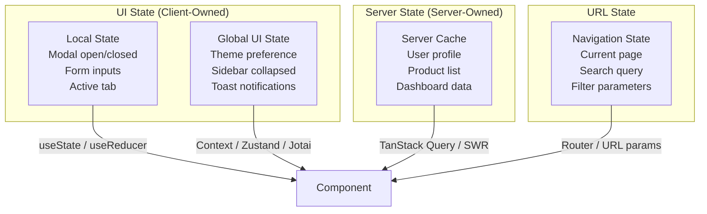
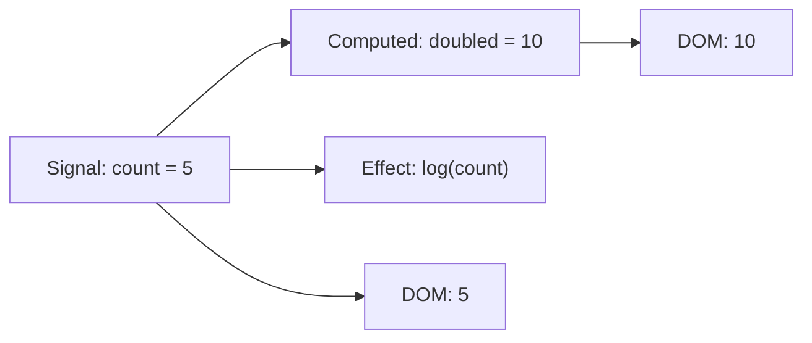
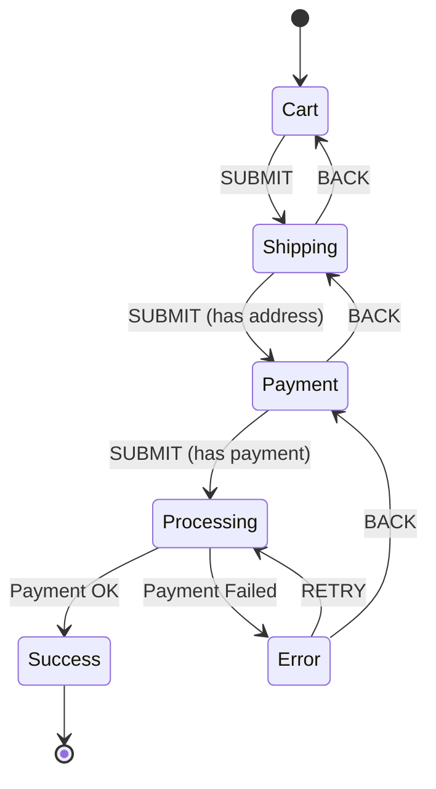

# State Management Patterns

State management is the most over-engineered problem in frontend development. Teams reach for global state libraries on day one, wrap every component in providers, and build elaborate action/reducer hierarchies — then wonder why their app is slow, brittle, and impossible to test.

The first principle of state management is this: **most state is local, most data is server-owned, and what remains is usually small enough to handle without a library.** This page builds up from that principle, covering when each category of state management is appropriate, and providing honest comparisons of the tools available.

## The Three Kinds of State

Before choosing a tool, understand what kind of state you are managing:



| Type | Owned By | Persists Across | Examples | Solution |
|------|----------|----------------|----------|----------|
| **Local UI** | Component | Nothing | Form input, dropdown state | `useState`, `useReducer` |
| **Global UI** | App | Navigation | Theme, auth status, toasts | Context, Zustand, Jotai |
| **Server** | Backend | Refresh (cache) | User data, products, orders | TanStack Query, SWR |
| **URL** | Browser | Bookmarks, sharing | Page, filters, search query | Router, `URLSearchParams` |

::: tip The #1 State Management Mistake
Treating server data as client state. When you `fetch` user data and store it in Redux, you now own two copies of that data — the server's truth and your stale cache. You must handle loading states, errors, cache invalidation, refetching, optimistic updates, and race conditions manually. Server state libraries like TanStack Query handle all of this for you.
:::

## Local State: useState and useReducer

For state that belongs to a single component, React's built-in hooks are the right answer. No library needed.

### useState for Simple State

```typescript
import { useState } from 'react';

function SearchBar() {
  const [query, setQuery] = useState('');
  const [isExpanded, setIsExpanded] = useState(false);

  return (
    <div>
      <button onClick={() => setIsExpanded(!isExpanded)}>
        {isExpanded ? 'Close' : 'Search'}
      </button>
      {isExpanded && (
        <input
          value={query}
          onChange={(e) => setQuery(e.target.value)}
          placeholder="Search..."
        />
      )}
    </div>
  );
}
```

### useReducer for Complex Local State

When state transitions have complex logic or multiple sub-values that change together, `useReducer` provides clarity:

```typescript
import { useReducer } from 'react';

interface FormState {
  values: { name: string; email: string; message: string };
  errors: Record<string, string>;
  status: 'idle' | 'submitting' | 'success' | 'error';
}

type FormAction =
  | { type: 'SET_FIELD'; field: string; value: string }
  | { type: 'SET_ERROR'; field: string; error: string }
  | { type: 'SUBMIT' }
  | { type: 'SUCCESS' }
  | { type: 'FAILURE'; error: string };

function formReducer(state: FormState, action: FormAction): FormState {
  switch (action.type) {
    case 'SET_FIELD':
      return {
        ...state,
        values: { ...state.values, [action.field]: action.value },
        errors: { ...state.errors, [action.field]: '' },
      };
    case 'SET_ERROR':
      return {
        ...state,
        errors: { ...state.errors, [action.field]: action.error },
      };
    case 'SUBMIT':
      return { ...state, status: 'submitting', errors: {} };
    case 'SUCCESS':
      return { ...state, status: 'success' };
    case 'FAILURE':
      return { ...state, status: 'error', errors: { form: action.error } };
    default:
      return state;
  }
}
```

## Global UI State Libraries

When state truly needs to be shared across distant components that are not in a parent-child relationship, you need a global state solution.

### Redux Toolkit (RTK)

Redux Toolkit is the official, opinionated way to use Redux. It eliminates the boilerplate that made Redux infamous:

```typescript
import { configureStore, createSlice, type PayloadAction } from '@reduxjs/toolkit';

interface AuthState {
  user: { id: string; name: string; email: string } | null;
  status: 'idle' | 'loading' | 'authenticated' | 'error';
}

const authSlice = createSlice({
  name: 'auth',
  initialState: { user: null, status: 'idle' } as AuthState,
  reducers: {
    loginStart(state) {
      state.status = 'loading';
    },
    loginSuccess(state, action: PayloadAction<AuthState['user']>) {
      state.status = 'authenticated';
      state.user = action.payload;
    },
    logout(state) {
      state.status = 'idle';
      state.user = null;
    },
  },
});

export const { loginStart, loginSuccess, logout } = authSlice.actions;

const store = configureStore({
  reducer: {
    auth: authSlice.reducer,
  },
});

export type RootState = ReturnType<typeof store.getState>;
export type AppDispatch = typeof store.dispatch;
```

**When to use Redux Toolkit:**
- Large teams that benefit from the enforced action/reducer pattern
- Apps with complex state interactions that need middleware (logging, undo/redo)
- You need Redux DevTools for time-travel debugging
- Existing Redux codebase you are modernizing

### Zustand

Zustand is a minimal global state library. No providers, no boilerplate, no opinions about structure:

```typescript
import { create } from 'zustand';
import { devtools, persist } from 'zustand/middleware';

interface ThemeStore {
  theme: 'light' | 'dark' | 'system';
  setTheme: (theme: ThemeStore['theme']) => void;
  toggleTheme: () => void;
}

export const useThemeStore = create<ThemeStore>()(
  devtools(
    persist(
      (set) => ({
        theme: 'system',
        setTheme: (theme) => set({ theme }),
        toggleTheme: () =>
          set((state) => ({
            theme: state.theme === 'light' ? 'dark' : 'light',
          })),
      }),
      { name: 'theme-storage' }
    )
  )
);

// Usage — no Provider needed
function ThemeToggle() {
  const { theme, toggleTheme } = useThemeStore();
  return <button onClick={toggleTheme}>Current: {theme}</button>;
}

// Select specific state to prevent unnecessary re-renders
function ThemeLabel() {
  const theme = useThemeStore((state) => state.theme);
  return <span>{theme}</span>;
}
```

**When to use Zustand:**
- Small to medium apps that need global state
- You want minimal API surface and zero boilerplate
- You want to avoid Provider nesting
- Teams that prefer simplicity over ceremony

### Jotai (Atomic State)

Jotai takes a bottom-up approach: state is stored in individual atoms, and components subscribe only to the atoms they read. This eliminates the "one store re-renders everything" problem:

```typescript
import { atom, useAtom, useAtomValue, useSetAtom } from 'jotai';
import { atomWithStorage } from 'jotai/utils';

// Primitive atoms
const countAtom = atom(0);
const nameAtom = atom('');

// Derived atom (computed from other atoms)
const greetingAtom = atom((get) => {
  const name = get(nameAtom);
  const count = get(countAtom);
  return `Hello ${name}, you've visited ${count} times`;
});

// Async atom (fetches data)
const userAtom = atom(async () => {
  const response = await fetch('/api/user');
  return response.json();
});

// Persisted atom (survives refresh)
const settingsAtom = atomWithStorage('app-settings', {
  notifications: true,
  language: 'en',
});

// Component reads only what it needs — minimal re-renders
function Counter() {
  const [count, setCount] = useAtom(countAtom);
  return <button onClick={() => setCount((c) => c + 1)}>{count}</button>;
}

function Greeting() {
  const greeting = useAtomValue(greetingAtom); // Read-only
  return <p>{greeting}</p>;
}
```

**When to use Jotai:**
- You need fine-grained reactivity (components should re-render only when their specific data changes)
- State is naturally composed of independent pieces
- You like the mental model of atoms / signals

### Valtio (Proxy-Based)

Valtio uses JavaScript Proxies to make state mutation reactive — you mutate plain objects and the library tracks which components need to re-render:

```typescript
import { proxy, useSnapshot } from 'valtio';

// State is a plain mutable object
const state = proxy({
  count: 0,
  todos: [] as Array<{ id: string; text: string; done: boolean }>,
});

// Mutations are plain assignments
function increment() {
  state.count++;
}

function addTodo(text: string) {
  state.todos.push({ id: crypto.randomUUID(), text, done: false });
}

function toggleTodo(id: string) {
  const todo = state.todos.find((t) => t.id === id);
  if (todo) todo.done = !todo.done;
}

// Components use snapshots for render consistency
function TodoList() {
  const snap = useSnapshot(state);
  return (
    <ul>
      {snap.todos.map((todo) => (
        <li key={todo.id} onClick={() => toggleTodo(todo.id)}>
          {todo.done ? '✓' : '○'} {todo.text}
        </li>
      ))}
    </ul>
  );
}
```

## Signals

Signals are a reactivity primitive that has swept across frameworks — Preact, Solid, Angular, Qwik, and Vue's `ref()` are all signal-based. A signal is a container for a value that automatically tracks which computations depend on it and re-runs them when the value changes.



### Signals vs Virtual DOM

| Aspect | Virtual DOM (React) | Signals (Solid, Preact) |
|--------|-------------------|------------------------|
| **Update granularity** | Component level (re-renders entire component) | DOM node level (updates specific text/attribute) |
| **Tracking** | Manual (`useMemo`, `useCallback`, selectors) | Automatic (dependency tracking) |
| **Re-render cost** | Diffing cost grows with component tree size | Constant — only the affected DOM nodes update |
| **Mental model** | Function re-runs on every state change | Function runs once, sets up subscriptions |

```typescript
// Preact Signals
import { signal, computed, effect } from '@preact/signals';

const count = signal(0);
const doubled = computed(() => count.value * 2);

// This effect re-runs automatically when count changes
effect(() => {
  console.log(`Count is ${count.value}, doubled is ${doubled.value}`);
});

count.value = 5; // Logs: "Count is 5, doubled is 10"

// SolidJS Signals
import { createSignal, createMemo, createEffect } from 'solid-js';

const [count, setCount] = createSignal(0);
const doubled = createMemo(() => count() * 2);

createEffect(() => {
  console.log(`Count is ${count()}, doubled is ${doubled()}`);
});

setCount(5); // Logs: "Count is 5, doubled is 10"
```

### Angular Signals (v16+)

```typescript
import { signal, computed, effect } from '@angular/core';

@Component({
  template: `
    <button (click)="increment()">
      Count: {​{ count() }} | Doubled: {​{ doubled() }}
    </button>
  `,
})
export class CounterComponent {
  count = signal(0);
  doubled = computed(() => this.count() * 2);

  constructor() {
    effect(() => {
      console.log(`Count changed to ${this.count()}`);
    });
  }

  increment() {
    this.count.update((c) => c + 1);
  }
}
```

## Server State: TanStack Query

Server state (data that lives on the server) has fundamentally different requirements than UI state: it needs caching, background refetching, stale-while-revalidate, optimistic updates, and error retry. TanStack Query (formerly React Query) handles all of this:

```typescript
import { useQuery, useMutation, useQueryClient } from '@tanstack/react-query';

// Fetch data with automatic caching, refetching, and error handling
function ProductList() {
  const { data, isLoading, error } = useQuery({
    queryKey: ['products'],
    queryFn: () => fetch('/api/products').then((r) => r.json()),
    staleTime: 5 * 60 * 1000,     // Consider data fresh for 5 minutes
    gcTime: 30 * 60 * 1000,       // Keep in cache for 30 minutes
    refetchOnWindowFocus: true,    // Refetch when user returns to tab
    retry: 3,                      // Retry failed requests 3 times
  });

  if (isLoading) return <Skeleton />;
  if (error) return <Error message={error.message} />;

  return (
    <ul>
      {data.map((product: Product) => (
        <ProductCard key={product.id} product={product} />
      ))}
    </ul>
  );
}

// Mutations with optimistic updates
function AddProductButton() {
  const queryClient = useQueryClient();

  const mutation = useMutation({
    mutationFn: (newProduct: NewProduct) =>
      fetch('/api/products', {
        method: 'POST',
        body: JSON.stringify(newProduct),
        headers: { 'Content-Type': 'application/json' },
      }).then((r) => r.json()),

    // Optimistic update: immediately show the new product
    onMutate: async (newProduct) => {
      // Cancel any outgoing refetches
      await queryClient.cancelQueries({ queryKey: ['products'] });

      // Snapshot previous value
      const previous = queryClient.getQueryData(['products']);

      // Optimistically add to cache
      queryClient.setQueryData(['products'], (old: Product[]) => [
        ...old,
        { ...newProduct, id: 'temp-' + Date.now() },
      ]);

      return { previous };
    },

    // Rollback on error
    onError: (_err, _newProduct, context) => {
      queryClient.setQueryData(['products'], context?.previous);
    },

    // Refetch after success or error to sync with server
    onSettled: () => {
      queryClient.invalidateQueries({ queryKey: ['products'] });
    },
  });

  return (
    <button
      onClick={() => mutation.mutate({ name: 'New Product', price: 29.99 })}
      disabled={mutation.isPending}
    >
      {mutation.isPending ? 'Adding...' : 'Add Product'}
    </button>
  );
}
```

## State Machines: XState

When your state has complex transitions, guards, and side effects — think multi-step forms, checkout flows, or WebSocket connection states — state machines formalize the logic and make impossible states impossible:

```typescript
import { createMachine, assign } from 'xstate';
import { useMachine } from '@xstate/react';

interface CheckoutContext {
  items: CartItem[];
  shippingAddress: Address | null;
  paymentMethod: PaymentMethod | null;
  error: string | null;
}

type CheckoutEvent =
  | { type: 'SET_ADDRESS'; address: Address }
  | { type: 'SET_PAYMENT'; method: PaymentMethod }
  | { type: 'SUBMIT' }
  | { type: 'BACK' }
  | { type: 'RETRY' };

const checkoutMachine = createMachine({
  id: 'checkout',
  initial: 'cart',
  context: {
    items: [],
    shippingAddress: null,
    paymentMethod: null,
    error: null,
  } as CheckoutContext,
  states: {
    cart: {
      on: { SUBMIT: 'shipping' },
    },
    shipping: {
      on: {
        SET_ADDRESS: {
          actions: assign({ shippingAddress: ({ event }) => event.address }),
        },
        SUBMIT: {
          guard: ({ context }) => context.shippingAddress !== null,
          target: 'payment',
        },
        BACK: 'cart',
      },
    },
    payment: {
      on: {
        SET_PAYMENT: {
          actions: assign({ paymentMethod: ({ event }) => event.method }),
        },
        SUBMIT: {
          guard: ({ context }) => context.paymentMethod !== null,
          target: 'processing',
        },
        BACK: 'shipping',
      },
    },
    processing: {
      invoke: {
        src: 'processPayment',
        onDone: 'success',
        onError: {
          target: 'error',
          actions: assign({ error: ({ event }) => event.error.message }),
        },
      },
    },
    success: { type: 'final' },
    error: {
      on: {
        RETRY: 'processing',
        BACK: 'payment',
      },
    },
  },
});
```



## When You Don't Need a State Library

Before adding a dependency, consider:

1. **Can you lift state up?** If two siblings need shared state, move it to their common parent.
2. **Can you use URL state?** Search queries, filters, pagination — these belong in the URL, not in a store.
3. **Can you use React Context?** For truly global, rarely-changing values (theme, locale, auth), Context is sufficient.
4. **Is it server data?** Use TanStack Query or SWR — not a state library.

```typescript
// Context is fine for rarely-changing global state
const AuthContext = createContext<AuthState | null>(null);

function AuthProvider({ children }: { children: React.ReactNode }) {
  const [user, setUser] = useState<User | null>(null);

  // Auth state changes rarely (login/logout), so Context re-renders are fine
  return (
    <AuthContext.Provider value={​{ user, setUser }}>
      {children}
    </AuthContext.Provider>
  );
}

function useAuth() {
  const context = useContext(AuthContext);
  if (!context) throw new Error('useAuth must be within AuthProvider');
  return context;
}
```

::: warning Context Is Not a State Manager
React Context is a dependency injection mechanism, not a state management tool. It re-renders every consumer when any part of the context value changes. If you have 10 values in a context and one changes, all 10 consumers re-render. For frequently changing state, use Zustand or Jotai.
:::

## Comparison Matrix

| Library | Bundle Size | Learning Curve | Re-render Control | DevTools | Best For |
|---------|-----------|---------------|-------------------|----------|----------|
| **useState** | 0 KB | Low | Manual | React DevTools | Local component state |
| **Redux Toolkit** | ~11 KB | Medium | Selectors | Excellent | Large teams, complex state |
| **Zustand** | ~1.2 KB | Low | Selectors | Good | Most apps, simple global state |
| **Jotai** | ~3.5 KB | Low | Automatic (atomic) | Good | Fine-grained reactivity |
| **Valtio** | ~3.8 KB | Low | Automatic (proxy) | Good | Mutable-style API preference |
| **TanStack Query** | ~13 KB | Medium | Automatic | Excellent | Server state / API caching |
| **XState** | ~15 KB | High | N/A | Excellent | Complex state machines |

## Further Reading

- [Rendering Strategies](/frontend-engineering/rendering-strategies) — How state management interacts with SSR, RSC, and hydration
- [Architecture Patterns > Event-Driven](/architecture-patterns/event-driven/) — Event-driven patterns that parallel frontend state management
- [UI & Design Systems > Component Patterns](/ui-design-systems/component-patterns/) — Compound, controlled, and headless component patterns
- [Bundle Optimization](/frontend-engineering/bundle-optimization) — Tree-shake unused state library code
