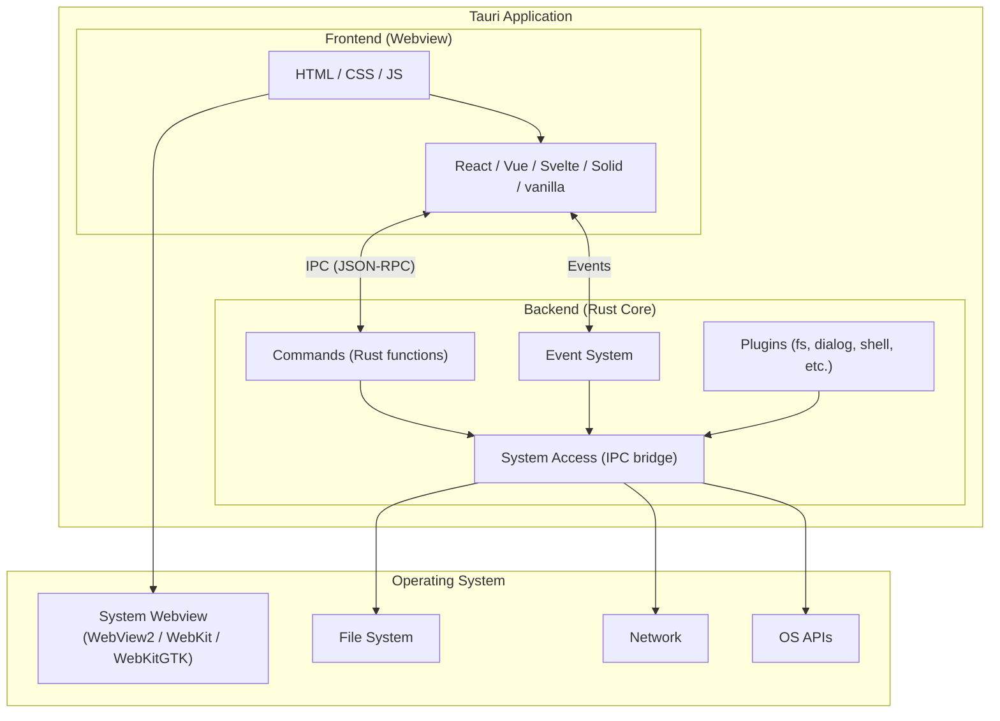
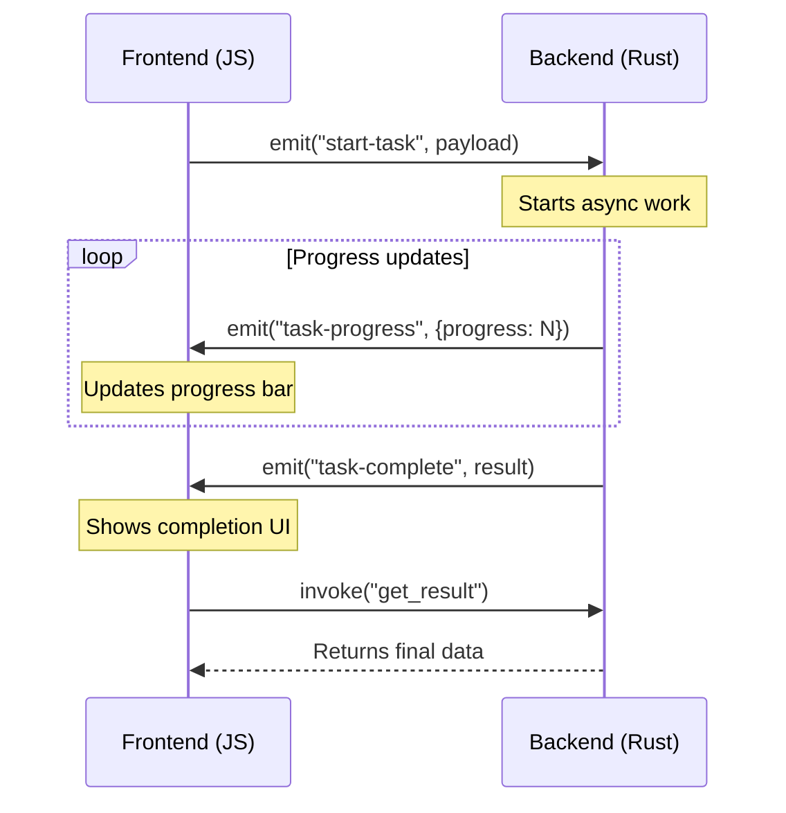
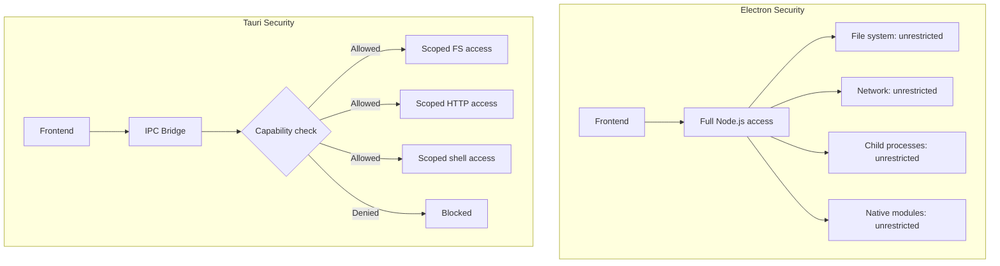
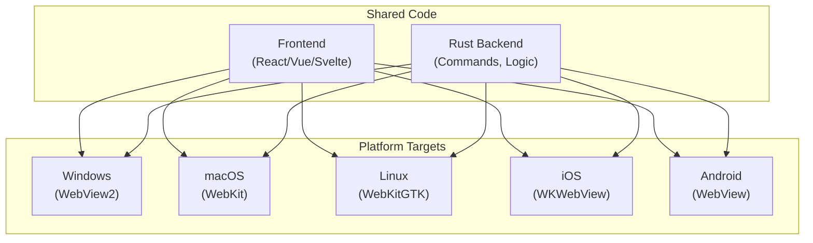
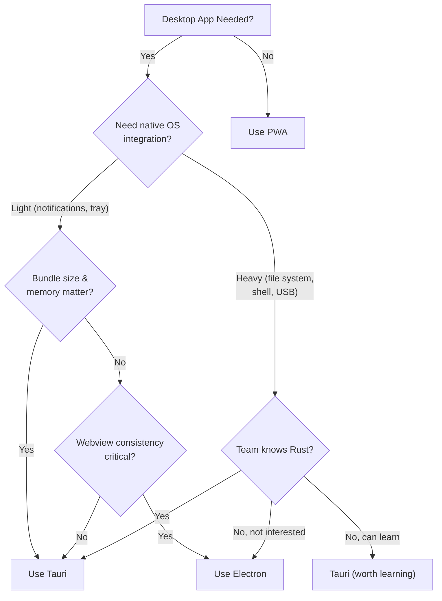

# Tauri

Tauri is a framework for building desktop applications using a Rust backend and a web frontend (HTML/CSS/JS or any framework). Instead of bundling Chromium like Electron does, Tauri uses the operating system's native webview — WebView2 on Windows, WebKit on macOS, and WebKitGTK on Linux. The result is dramatically smaller binaries (600KB vs 150MB), lower memory usage (30MB vs 300MB), and a stronger security model.

Tauri is not just "Electron but smaller." It is a fundamentally different architecture: the backend is Rust (not Node.js), the renderer is a system webview (not Chromium), and the security model is capability-based (opt-in access, not full system access by default). With Tauri 2.0, the same codebase can also target iOS and Android.

Understanding Tauri matters because desktop applications are not dead — developer tools (VS Code, Figma, Slack, Discord) are desktop apps, and Electron's resource consumption has become a significant pain point for users running multiple Electron apps simultaneously.

**Related**: [Bun Runtime](/frontend-engineering/bun-runtime) | [WebAssembly](/frontend-engineering/webassembly) | [Bundle Optimization](/frontend-engineering/bundle-optimization)

---

## Architecture

### How Tauri Works



### Key Architectural Decisions

| Decision | Tauri | Electron | Why It Matters |
|----------|-------|----------|---------------|
| **Renderer** | System webview | Bundled Chromium | Tauri: 600KB binary. Electron: 150MB+ binary. |
| **Backend language** | Rust | Node.js | Rust: memory-safe, no GC, near-native speed. Node.js: familiar, large ecosystem. |
| **IPC** | JSON-RPC over system IPC | Chromium IPC | Tauri's IPC is simpler and explicitly defined. |
| **Security** | Capability-based (opt-in) | Full Node.js access by default | Tauri: frontend cannot access filesystem unless explicitly allowed. |
| **Process model** | One Rust process + webview | Main process + renderer process(es) | Tauri is leaner. Electron can spawn multiple renderers. |

---

## Tauri vs Electron

### Bundle Size Comparison

| Application | Electron | Tauri | Reduction |
|------------|----------|-------|-----------|
| **Hello World** | ~150 MB | ~600 KB | 99.6% |
| **Todo App** | ~165 MB | ~2 MB | 98.8% |
| **Markdown Editor** | ~180 MB | ~5 MB | 97.2% |
| **Full-Featured App** | ~250 MB | ~15 MB | 94% |

### Memory Usage

| Scenario | Electron | Tauri |
|----------|----------|-------|
| **Idle (empty window)** | ~80-120 MB | ~20-30 MB |
| **Active (moderate DOM)** | ~200-400 MB | ~50-100 MB |
| **Multiple windows (3)** | ~500-800 MB | ~80-150 MB |

The memory difference is because Electron bundles an entire Chromium browser instance per window (with its own V8 engine, network stack, and GPU process), while Tauri reuses the OS webview that is already loaded in memory.

### Feature Comparison

| Feature | Electron | Tauri |
|---------|----------|-------|
| **Frontend flexibility** | Any web tech | Any web tech |
| **Backend language** | JavaScript/TypeScript | Rust |
| **Native menus** | Yes | Yes |
| **System tray** | Yes | Yes |
| **Auto-updater** | electron-updater | Built-in |
| **File system access** | Full (unrestricted) | Capability-scoped |
| **Notifications** | Yes | Yes (plugin) |
| **Clipboard** | Yes | Yes (plugin) |
| **Global shortcuts** | Yes | Yes (plugin) |
| **Deep linking** | Community packages | Built-in (v2) |
| **Multi-window** | Yes | Yes |
| **Mobile** | No | Yes (Tauri 2.0) |
| **WebRTC** | Full Chromium support | Depends on system webview |
| **Custom protocol** | Yes | Yes |
| **Splash screen** | Community packages | Built-in |
| **DevTools** | Chromium DevTools | System webview devtools |

::: warning Webview Inconsistencies
The biggest trade-off of Tauri's system-webview approach is cross-platform rendering inconsistencies. WebView2 (Windows, Chromium-based) behaves differently from WebKit (macOS) and WebKitGTK (Linux). CSS features, JavaScript APIs, and rendering quirks can vary. Electron avoids this by shipping the same Chromium everywhere. Test on all target platforms.
:::

---

## Setup and Prerequisites

### Prerequisites

| Platform | Requirements |
|----------|-------------|
| **All** | Rust toolchain (`rustup`), Node.js (for frontend) |
| **Windows** | Microsoft Visual C++ Build Tools, WebView2 (pre-installed on Windows 10/11) |
| **macOS** | Xcode Command Line Tools, Xcode (for iOS targets in v2) |
| **Linux** | `libwebkit2gtk-4.1-dev`, `libappindicator3-dev`, `librsvg2-dev`, `patchelf` |

### Installation

```bash
# Install Rust (if not installed)
curl --proto '=https' --tlsv1.2 -sSf https://sh.rustup.rs | sh

# Install Tauri CLI
cargo install tauri-cli

# Or use npm (most common for web devs)
npm install -g @tauri-apps/cli

# Verify
cargo tauri --version
```

### Creating a New Project

```bash
# Interactive project creation
npm create tauri-app@latest

# Prompts:
# Project name: my-app
# Package manager: npm / yarn / pnpm / bun
# Frontend template: React / Vue / Svelte / Solid / Vanilla / Angular
# TypeScript: Yes / No
```

This creates:

```
my-app/
├── src/                    # Frontend source
│   ├── App.tsx
│   ├── main.tsx
│   └── styles.css
├── src-tauri/              # Rust backend
│   ├── src/
│   │   ├── main.rs         # Entry point
│   │   └── lib.rs          # Commands and setup
│   ├── Cargo.toml          # Rust dependencies
│   ├── tauri.conf.json     # Tauri configuration
│   ├── capabilities/       # Security capabilities
│   │   └── default.json
│   └── icons/              # App icons
├── package.json
└── vite.config.ts          # Frontend build config
```

### Development Workflow

```bash
# Start development (hot-reload for frontend + Rust recompilation)
npm run tauri dev
# or
cargo tauri dev

# Build for production
npm run tauri build
# or
cargo tauri build
```

`tauri dev` provides:
- Hot module replacement for the frontend (via Vite or your chosen bundler)
- Automatic Rust recompilation when `src-tauri/` files change
- System webview with DevTools enabled
- Console output from both frontend and Rust backend

---

## Commands — The Rust-to-JavaScript Bridge

Commands are the primary way the frontend communicates with the Rust backend. You define a Rust function, annotate it with `#[tauri::command]`, and call it from JavaScript.

### Basic Commands

```rust
// src-tauri/src/lib.rs

// A simple command
#[tauri::command]
fn greet(name: &str) -> String {
    format!("Hello, {}! Welcome to Tauri.", name)
}

// Command with multiple parameters
#[tauri::command]
fn calculate(a: f64, b: f64, operation: &str) -> Result<f64, String> {
    match operation {
        "add" => Ok(a + b),
        "subtract" => Ok(a - b),
        "multiply" => Ok(a * b),
        "divide" => {
            if b == 0.0 {
                Err("Division by zero".to_string())
            } else {
                Ok(a / b)
            }
        }
        _ => Err(format!("Unknown operation: {}", operation)),
    }
}

// Register commands
pub fn run() {
    tauri::Builder::default()
        .invoke_handler(tauri::generate_handler![greet, calculate])
        .run(tauri::generate_context!())
        .expect("error while running tauri application");
}
```

### Calling Commands from JavaScript

```typescript
// Frontend (React/Vue/Svelte/etc.)
import { invoke } from "@tauri-apps/api/core";

// Simple invocation
const greeting = await invoke<string>("greet", { name: "Alice" });
console.log(greeting); // "Hello, Alice! Welcome to Tauri."

// With error handling
try {
  const result = await invoke<number>("calculate", {
    a: 10,
    b: 3,
    operation: "divide",
  });
  console.log(result); // 3.333...
} catch (error) {
  console.error("Calculation failed:", error);
}
```

### Async Commands

```rust
// Async commands for I/O operations
#[tauri::command]
async fn read_file(path: String) -> Result<String, String> {
    tokio::fs::read_to_string(&path)
        .await
        .map_err(|e| format!("Failed to read file: {}", e))
}

#[tauri::command]
async fn fetch_data(url: String) -> Result<String, String> {
    let response = reqwest::get(&url)
        .await
        .map_err(|e| format!("Request failed: {}", e))?;

    response
        .text()
        .await
        .map_err(|e| format!("Failed to read body: {}", e))
}
```

### Commands with State

```rust
use std::sync::Mutex;
use tauri::State;

// Application state
struct AppState {
    counter: Mutex<i32>,
    db_path: String,
}

#[tauri::command]
fn increment(state: State<'_, AppState>) -> i32 {
    let mut counter = state.counter.lock().unwrap();
    *counter += 1;
    *counter
}

#[tauri::command]
fn get_count(state: State<'_, AppState>) -> i32 {
    *state.counter.lock().unwrap()
}

pub fn run() {
    tauri::Builder::default()
        .manage(AppState {
            counter: Mutex::new(0),
            db_path: "data.db".to_string(),
        })
        .invoke_handler(tauri::generate_handler![increment, get_count])
        .run(tauri::generate_context!())
        .expect("error while running tauri application");
}
```

### Returning Complex Types

```rust
use serde::{Deserialize, Serialize};

#[derive(Serialize, Deserialize)]
struct User {
    id: u32,
    name: String,
    email: String,
    active: bool,
}

#[tauri::command]
fn get_users() -> Vec<User> {
    vec![
        User {
            id: 1,
            name: "Alice".to_string(),
            email: "alice@example.com".to_string(),
            active: true,
        },
        User {
            id: 2,
            name: "Bob".to_string(),
            email: "bob@example.com".to_string(),
            active: false,
        },
    ]
}
```

```typescript
// Frontend — types are inferred from Rust
interface User {
  id: number;
  name: string;
  email: string;
  active: boolean;
}

const users = await invoke<User[]>("get_users");
```

---

## Event System

The event system enables bidirectional communication between Rust and JavaScript without explicit command calls.

### Frontend to Backend Events

```typescript
// Frontend — emit an event
import { emit, listen } from "@tauri-apps/api/event";

// Emit to backend
await emit("frontend-event", { message: "Hello from JS", count: 42 });

// Listen for events from backend
const unlisten = await listen<{ progress: number }>("download-progress", (event) => {
  console.log(`Progress: ${event.payload.progress}%`);
});

// Clean up listener
unlisten();
```

```rust
// Backend — listen for events from frontend
use tauri::Listener;

pub fn run() {
    tauri::Builder::default()
        .setup(|app| {
            let handle = app.handle().clone();
            app.listen("frontend-event", move |event| {
                println!("Received event: {:?}", event.payload());
            });
            Ok(())
        })
        .run(tauri::generate_context!())
        .expect("error while running tauri application");
}
```

### Backend to Frontend Events

```rust
use tauri::{AppHandle, Emitter};

#[tauri::command]
async fn start_download(app: AppHandle, url: String) -> Result<String, String> {
    // Simulate download with progress updates
    for i in 0..=100 {
        tokio::time::sleep(std::time::Duration::from_millis(50)).await;

        // Emit progress to frontend
        app.emit("download-progress", serde_json::json!({ "progress": i }))
            .map_err(|e| e.to_string())?;
    }

    Ok("Download complete".to_string())
}
```

### Event Flow Diagram



---

## Plugins

Tauri 2.0 uses a plugin system for OS-level functionality. Plugins must be explicitly added — nothing is available by default (security by design).

### Core Plugins

| Plugin | Purpose | Install |
|--------|---------|---------|
| `fs` | File system access | `@tauri-apps/plugin-fs` |
| `dialog` | Open/save file dialogs | `@tauri-apps/plugin-dialog` |
| `shell` | Open URLs, execute commands | `@tauri-apps/plugin-shell` |
| `http` | HTTP client | `@tauri-apps/plugin-http` |
| `store` | Key-value persistent storage | `@tauri-apps/plugin-store` |
| `notification` | System notifications | `@tauri-apps/plugin-notification` |
| `clipboard-manager` | Clipboard read/write | `@tauri-apps/plugin-clipboard-manager` |
| `global-shortcut` | System-wide hotkeys | `@tauri-apps/plugin-global-shortcut` |
| `process` | Process management | `@tauri-apps/plugin-process` |
| `os` | OS information | `@tauri-apps/plugin-os` |
| `updater` | Auto-updater | `@tauri-apps/plugin-updater` |
| `log` | Logging | `@tauri-apps/plugin-log` |
| `deep-link` | Custom URL schemes | `@tauri-apps/plugin-deep-link` |

### Installing and Using Plugins

```bash
# Install a plugin (adds to both npm and Cargo dependencies)
npm run tauri add fs
npm run tauri add dialog
npm run tauri add store
```

### File System Plugin

```typescript
import {
  readTextFile,
  writeTextFile,
  readDir,
  mkdir,
  exists,
  remove,
  BaseDirectory,
} from "@tauri-apps/plugin-fs";

// Read a file
const content = await readTextFile("config.json", {
  baseDir: BaseDirectory.AppData,
});

// Write a file
await writeTextFile("output.txt", "Hello, world!", {
  baseDir: BaseDirectory.Desktop,
});

// List directory contents
const entries = await readDir("documents", {
  baseDir: BaseDirectory.Home,
});
for (const entry of entries) {
  console.log(`${entry.name} — ${entry.isDirectory ? "dir" : "file"}`);
}

// Check existence
if (await exists("config.json", { baseDir: BaseDirectory.AppData })) {
  console.log("Config exists");
}

// Create directory
await mkdir("my-app-data", {
  baseDir: BaseDirectory.AppData,
  recursive: true,
});
```

### Dialog Plugin

```typescript
import { open, save, message, ask, confirm } from "@tauri-apps/plugin-dialog";

// Open file dialog
const selected = await open({
  multiple: false,
  filters: [
    { name: "Images", extensions: ["png", "jpg", "gif"] },
    { name: "Documents", extensions: ["pdf", "doc", "txt"] },
  ],
});
if (selected) {
  console.log(`Selected: ${selected}`);
}

// Save dialog
const savePath = await save({
  defaultPath: "export.json",
  filters: [{ name: "JSON", extensions: ["json"] }],
});

// Confirmation dialog
const confirmed = await confirm("Delete this item?", {
  title: "Confirm Delete",
  kind: "warning",
});

// Message dialog
await message("Operation completed successfully!", {
  title: "Success",
  kind: "info",
});
```

### Store Plugin (Persistent Key-Value Storage)

```typescript
import { Store } from "@tauri-apps/plugin-store";

// Create or load a store
const store = await Store.load("settings.json");

// Set values
await store.set("theme", "dark");
await store.set("windowSize", { width: 1200, height: 800 });
await store.set("recentFiles", ["/path/to/file1", "/path/to/file2"]);

// Get values
const theme = await store.get<string>("theme");       // "dark"
const size = await store.get<{ width: number; height: number }>("windowSize");

// Check existence
const hasTheme = await store.has("theme");  // true

// Delete
await store.delete("recentFiles");

// Save to disk (happens automatically, but can be forced)
await store.save();

// List all keys
const keys = await store.keys();  // ["theme", "windowSize"]
```

### Shell Plugin

```typescript
import { open as shellOpen } from "@tauri-apps/plugin-shell";
import { Command } from "@tauri-apps/plugin-shell";

// Open URL in default browser
await shellOpen("https://tauri.app");

// Open file with default application
await shellOpen("/path/to/document.pdf");

// Execute a command (must be allowed in capabilities)
const output = await Command.create("exec-git", ["status"]).execute();
console.log(output.stdout);
console.log(output.code); // Exit code
```

### HTTP Plugin

```typescript
import { fetch } from "@tauri-apps/plugin-http";

// Tauri's fetch bypasses CORS (runs in Rust, not browser)
const response = await fetch("https://api.example.com/data", {
  method: "GET",
  headers: {
    Authorization: "Bearer token123",
  },
});

const data = await response.json();
```

::: tip CORS-Free Requests
One of Tauri's most useful features: HTTP requests from the Rust side bypass browser CORS restrictions entirely. This means your desktop app can call any API without proxy servers or CORS headers.
:::

---

## Security Model

### Capabilities (Tauri 2.0)

Tauri 2.0 uses a capability-based security model. The frontend has zero system access by default — every permission must be explicitly granted in capability files:

```json
// src-tauri/capabilities/default.json
{
  "$schema": "../gen/schemas/desktop-schema.json",
  "identifier": "default",
  "description": "Default capabilities for the main window",
  "windows": ["main"],
  "permissions": [
    "core:default",
    "fs:default",
    "dialog:default",
    "shell:allow-open",
    {
      "identifier": "fs:allow-read-text-file",
      "allow": [
        { "path": "$APPDATA/**" },
        { "path": "$DOCUMENT/**" }
      ]
    },
    {
      "identifier": "fs:allow-write-text-file",
      "allow": [
        { "path": "$APPDATA/**" }
      ]
    },
    {
      "identifier": "http:default",
      "allow": [
        { "url": "https://api.example.com/**" }
      ]
    }
  ]
}
```

### Security Comparison



| Security Feature | Electron | Tauri |
|-----------------|----------|-------|
| **Default permissions** | Everything (opt-out) | Nothing (opt-in) |
| **File system** | Full access via Node.js | Scoped to allowed paths |
| **Network** | Unrestricted | Scoped to allowed URLs |
| **Shell commands** | `child_process` available | Must be listed in capabilities |
| **Native code** | Node.js native addons | Rust (memory-safe) |
| **Content Security Policy** | Optional | Enforced by default |
| **IPC validation** | Developer responsibility | Built-in serialization and type checking |
| **Supply chain risk** | npm + node_modules | Cargo (audited) + smaller surface |

::: danger Electron's Security Track Record
Electron apps have historically been a major attack vector because of the combination of Node.js access + web content. Remote code execution vulnerabilities in Electron apps have been common. Tauri's architecture makes this class of vulnerability structurally impossible — the frontend cannot execute arbitrary system commands, and all system access goes through typed Rust commands with explicit capabilities.
:::

---

## Auto-Updater

Tauri includes a built-in auto-updater that checks for updates from a static JSON endpoint:

### Update Server Configuration

```json
// tauri.conf.json
{
  "plugins": {
    "updater": {
      "pubkey": "YOUR_PUBLIC_KEY_HERE",
      "endpoints": [
        "https://releases.myapp.com/{{target}}/{{arch}}/{{current_version}}"
      ],
      "windows": {
        "installMode": "passive"
      }
    }
  }
}
```

### Update Endpoint Response

The server returns JSON indicating whether an update is available:

```json
{
  "version": "1.2.0",
  "notes": "Bug fixes and performance improvements",
  "pub_date": "2026-04-01T00:00:00Z",
  "platforms": {
    "windows-x86_64": {
      "signature": "SIGNATURE_HERE",
      "url": "https://releases.myapp.com/my-app_1.2.0_x64-setup.nsis.zip"
    },
    "darwin-aarch64": {
      "signature": "SIGNATURE_HERE",
      "url": "https://releases.myapp.com/my-app_1.2.0_aarch64.app.tar.gz"
    },
    "linux-x86_64": {
      "signature": "SIGNATURE_HERE",
      "url": "https://releases.myapp.com/my-app_1.2.0_amd64.AppImage.tar.gz"
    }
  }
}
```

### Frontend Update Logic

```typescript
import { check } from "@tauri-apps/plugin-updater";
import { relaunch } from "@tauri-apps/plugin-process";

async function checkForUpdates() {
  const update = await check();

  if (update) {
    console.log(`Update available: ${update.version}`);
    console.log(`Release notes: ${update.body}`);

    // Download and install
    await update.downloadAndInstall((event) => {
      switch (event.event) {
        case "Started":
          console.log(`Download started: ${event.data.contentLength} bytes`);
          break;
        case "Progress":
          console.log(`Downloaded: ${event.data.chunkLength} bytes`);
          break;
        case "Finished":
          console.log("Download complete");
          break;
      }
    });

    // Restart the app
    await relaunch();
  } else {
    console.log("No update available");
  }
}
```

---

## Building for Production

### Platform-Specific Builds

```bash
# Build for current platform
npm run tauri build

# Output locations:
# Windows: src-tauri/target/release/bundle/nsis/
# macOS:   src-tauri/target/release/bundle/dmg/
# Linux:   src-tauri/target/release/bundle/appimage/
```

### Build Output Formats

| Platform | Formats |
|----------|---------|
| **Windows** | `.msi` (MSI installer), `.exe` (NSIS installer) |
| **macOS** | `.dmg` (disk image), `.app` (application bundle) |
| **Linux** | `.AppImage`, `.deb`, `.rpm` |

### Configuration

```json
// src-tauri/tauri.conf.json
{
  "productName": "My App",
  "version": "1.0.0",
  "identifier": "com.mycompany.myapp",
  "build": {
    "frontendDist": "../dist",
    "devUrl": "http://localhost:5173",
    "beforeBuildCommand": "npm run build",
    "beforeDevCommand": "npm run dev"
  },
  "app": {
    "windows": [
      {
        "title": "My App",
        "width": 1200,
        "height": 800,
        "minWidth": 800,
        "minHeight": 600,
        "resizable": true,
        "fullscreen": false,
        "decorations": true,
        "transparent": false
      }
    ],
    "security": {
      "csp": "default-src 'self'; script-src 'self'; style-src 'self' 'unsafe-inline'"
    }
  },
  "bundle": {
    "active": true,
    "icon": [
      "icons/32x32.png",
      "icons/128x128.png",
      "icons/128x128@2x.png",
      "icons/icon.icns",
      "icons/icon.ico"
    ],
    "targets": "all",
    "windows": {
      "certificateThumbprint": null,
      "digestAlgorithm": "sha256",
      "timestampUrl": ""
    }
  }
}
```

### Cross-Compilation

Tauri does not natively support cross-compilation (building macOS from Windows, etc.) because system webview libraries are platform-specific. Use CI/CD:

```yaml
# .github/workflows/release.yml
name: Release
on:
  push:
    tags: ['v*']

jobs:
  build:
    strategy:
      matrix:
        include:
          - platform: ubuntu-22.04
            target: x86_64-unknown-linux-gnu
          - platform: macos-latest
            target: aarch64-apple-darwin
          - platform: macos-latest
            target: x86_64-apple-darwin
          - platform: windows-latest
            target: x86_64-pc-windows-msvc

    runs-on: ${{ matrix.platform }}
    steps:
      - uses: actions/checkout@v4

      - name: Setup Node
        uses: actions/setup-node@v4
        with:
          node-version: 20

      - name: Install Rust
        uses: dtolnay/rust-toolchain@stable
        with:
          targets: ${{ matrix.target }}

      - name: Install dependencies (Linux)
        if: matrix.platform == 'ubuntu-22.04'
        run: |
          sudo apt-get update
          sudo apt-get install -y libwebkit2gtk-4.1-dev libappindicator3-dev librsvg2-dev patchelf

      - name: Install frontend deps
        run: npm ci

      - name: Build Tauri
        uses: tauri-apps/tauri-action@v0
        with:
          tagName: ${{ github.ref_name }}
          releaseName: 'v__VERSION__'
          releaseBody: 'See the assets for download links.'
          releaseDraft: true
```

---

## Tauri 2.0 Features

### Mobile Support (iOS and Android)

Tauri 2.0 brings mobile as a first-class target using the same codebase:

```bash
# Initialize mobile targets
npm run tauri android init
npm run tauri ios init

# Develop on mobile
npm run tauri android dev
npm run tauri ios dev

# Build for mobile
npm run tauri android build
npm run tauri ios build
```



### Plugins API (v2)

Tauri 2.0 redesigned the plugin system to be composable and consistent:

```rust
// Creating a custom plugin
use tauri::plugin::{Builder, TauriPlugin};
use tauri::{Manager, Runtime};

#[tauri::command]
fn my_plugin_command() -> String {
    "Hello from plugin".to_string()
}

pub fn init<R: Runtime>() -> TauriPlugin<R> {
    Builder::new("my-plugin")
        .invoke_handler(tauri::generate_handler![my_plugin_command])
        .setup(|app, _api| {
            // Plugin initialization
            println!("My plugin initialized!");
            Ok(())
        })
        .build()
}
```

```rust
// Register the plugin
fn main() {
    tauri::Builder::default()
        .plugin(my_plugin::init())
        .run(tauri::generate_context!())
        .expect("error while running tauri application");
}
```

### Multi-Window Support

```rust
use tauri::{Manager, WebviewUrl, WebviewWindowBuilder};

#[tauri::command]
async fn open_settings(app: tauri::AppHandle) -> Result<(), String> {
    let _settings_window = WebviewWindowBuilder::new(
        &app,
        "settings",
        WebviewUrl::App("settings.html".into()),
    )
    .title("Settings")
    .inner_size(600.0, 400.0)
    .resizable(false)
    .build()
    .map_err(|e| e.to_string())?;

    Ok(())
}
```

### System Tray

```rust
use tauri::{
    menu::{Menu, MenuItem},
    tray::TrayIconBuilder,
    Manager,
};

pub fn run() {
    tauri::Builder::default()
        .setup(|app| {
            let quit = MenuItem::with_id(app, "quit", "Quit", true, None::<&str>)?;
            let show = MenuItem::with_id(app, "show", "Show Window", true, None::<&str>)?;
            let menu = Menu::with_items(app, &[&show, &quit])?;

            let _tray = TrayIconBuilder::new()
                .icon(app.default_window_icon().unwrap().clone())
                .menu(&menu)
                .on_menu_event(|app, event| match event.id.as_ref() {
                    "quit" => app.exit(0),
                    "show" => {
                        if let Some(window) = app.get_webview_window("main") {
                            window.show().unwrap();
                            window.set_focus().unwrap();
                        }
                    }
                    _ => {}
                })
                .build(app)?;

            Ok(())
        })
        .run(tauri::generate_context!())
        .expect("error while running tauri application");
}
```

---

## When to Use Tauri vs Electron vs PWA

### Decision Matrix



### Detailed Comparison

| Factor | Tauri | Electron | PWA |
|--------|-------|----------|-----|
| **Best for** | Resource-efficient desktop apps | Feature-rich desktop apps | Web apps that work offline |
| **Bundle size** | 600KB - 15MB | 150MB - 300MB | 0 (web) |
| **Memory** | 20-100MB | 80-400MB | Browser tab |
| **Install required** | Yes | Yes | No (installable from browser) |
| **Offline** | Full | Full | Service Worker dependent |
| **Auto-update** | Built-in | electron-updater | Service Worker |
| **App store** | macOS, Windows Store | macOS, Windows Store | Play Store, App Store (limited) |
| **File system** | Scoped access | Full access | Limited (File System Access API) |
| **System tray** | Yes | Yes | No |
| **Global shortcuts** | Yes | Yes | No |
| **Rendering consistency** | Varies (system webview) | Consistent (Chromium) | Varies (user's browser) |
| **Learning curve** | Rust + web | JavaScript + web | Web only |
| **Mobile** | Yes (Tauri 2.0) | No | Yes (responsive) |

### Use Tauri When

- **Bundle size and memory matter** — Users complain about Electron apps consuming 300MB+ RAM each. If your users run multiple desktop apps simultaneously, Tauri's 10x smaller footprint is significant.
- **Security is a priority** — Tauri's capability-based model prevents the entire class of "frontend gains shell access" vulnerabilities that plague Electron apps.
- **You want mobile too** — Tauri 2.0's mobile support means one codebase for desktop and mobile.
- **Your team knows or wants to learn Rust** — The Rust backend is an advantage, not just a constraint. Rust gives memory safety, performance, and access to the entire Rust ecosystem (serde, tokio, reqwest, etc.).
- **Auto-update is important** — Tauri's built-in updater with signature verification is simpler than electron-updater.

### Use Electron When

- **Webview consistency is critical** — If your app must look and behave identically on Windows, macOS, and Linux, Electron's bundled Chromium guarantees this. Tauri's system webviews can have rendering differences.
- **You need deep Chromium features** — WebRTC, WebUSB, WebBluetooth, and other Chromium-specific APIs may not be available in system webviews.
- **Your team is JavaScript-only** — If nobody on the team knows or wants to learn Rust, Electron's Node.js backend is more accessible.
- **Mature ecosystem matters** — Electron has 10+ years of ecosystem: electron-builder, electron-forge, extensive documentation, and thousands of shipped applications.
- **Multi-window with complex IPC** — Electron's mature multi-process model handles complex multi-window scenarios better.

### Use a PWA When

- **No native OS features needed** — If you only need offline support and a home screen icon, a PWA avoids the entire desktop packaging story.
- **Zero install friction** — PWAs require no download, no install, no update prompt. Users visit the URL and the app works.
- **Web distribution matters** — PWAs are discoverable via search engines. Desktop apps are not.
- **Mobile-first** — PWAs run on any device with a browser without separate native app development.

---

::: tip Key Takeaway
- Tauri produces desktop apps that are 100x smaller and use 5-10x less memory than Electron equivalents by using the operating system's native webview instead of bundling Chromium.
- The Rust backend is not just a language choice — it provides memory safety, no garbage collector pauses, and a capability-based security model that eliminates entire categories of vulnerabilities possible in Electron.
- Tauri 2.0 extends the model to mobile (iOS and Android), making it a true cross-platform framework from a single codebase — desktop and mobile with shared Rust backend and web frontend.
:::

::: warning Common Misconceptions
- **"Tauri is just a smaller Electron."** Tauri's architecture is fundamentally different: Rust backend instead of Node.js, system webview instead of Chromium, capability-based security instead of unrestricted access. The smaller size is a consequence of the architecture, not the goal.
- **"System webviews are unreliable."** WebView2 on Windows (Chromium-based, auto-updated by Microsoft), WebKit on macOS, and WebKitGTK on Linux are mature, well-maintained engines. The "unreliable webview" reputation comes from the old Internet Explorer WebBrowser control, which is not what Tauri uses.
- **"You need to know Rust to use Tauri."** Basic Tauri apps need minimal Rust — the `#[tauri::command]` boilerplate is straightforward even for Rust beginners. Only complex backend logic (database access, file processing, background tasks) requires deeper Rust knowledge.
- **"Tauri apps look different on each platform."** For standard HTML/CSS/JS, the rendering is nearly identical across platforms. Differences emerge with bleeding-edge CSS features or browser-specific APIs. The same challenge exists with PWAs that run in different browsers.
- **"Tauri is not production-ready."** Tauri 1.0 shipped in June 2022 and 2.0 in October 2024. Production applications include CrabNebula (the company behind Tauri), several developer tools, and numerous indie applications. It is production-grade.
- **"Electron will die because of Tauri."** VS Code, Slack, Discord, Figma (desktop), and hundreds of other major apps use Electron. Electron's ecosystem, maturity, and Chromium consistency guarantee its continued relevance. Tauri is a better choice for new projects with size/memory constraints, not a universal replacement.
:::

## When NOT to Use Tauri

- **WebRTC-heavy applications** — Video conferencing, screen sharing, and peer-to-peer communication depend heavily on Chromium's WebRTC implementation. System webviews have inconsistent or missing WebRTC support.
- **Applications requiring identical cross-platform rendering** — If pixel-perfect rendering consistency across Windows, macOS, and Linux is a hard requirement (design tools, WYSIWYG editors), Electron's bundled Chromium is safer.
- **Teams with zero interest in Rust** — While basic Tauri usage requires minimal Rust, debugging build issues, writing complex commands, and extending the backend requires Rust competency. If the team is unwilling to invest in learning Rust, Electron is more pragmatic.
- **Applications that need mature WebExtension-style plugins** — If your app needs a rich third-party plugin ecosystem where plugins have access to the full web platform (like VS Code extensions), Electron's model is more mature.
- **Legacy Windows support** — WebView2 requires Windows 10 or later. If your users are on Windows 7/8, Electron bundles its own Chromium and works everywhere.

::: tip In Production
- **CrabNebula** — The company behind Tauri uses it for their own cloud deployment platform and developer tools.
- **Cody (Sourcegraph)** — The AI coding assistant built their desktop app with Tauri for a lightweight footprint.
- **Padloc** — An open-source password manager using Tauri, where the security model's capability-based access is especially relevant.
- **Spacedrive** — A cross-platform file manager built with Tauri + Rust, leveraging Rust for high-performance file system operations and database queries.
- **Aptakube** — A Kubernetes desktop client built with Tauri, managing clusters across clouds with minimal resource usage.
:::

::: details Quiz

**1. Why are Tauri app bundles so much smaller than Electron app bundles?**

::: details Answer
Electron bundles an entire Chromium browser (~150MB) with every application. Tauri uses the operating system's native webview (WebView2 on Windows, WebKit on macOS, WebKitGTK on Linux), which is already installed on the user's machine. The Tauri binary only includes the Rust backend and the application's web assets, resulting in bundles of 600KB to 15MB instead of 150-300MB.
:::

**2. How do Tauri commands work, and what makes them different from Electron's IPC?**

::: details Answer
Tauri commands are Rust functions annotated with `#[tauri::command]` that are callable from JavaScript via `invoke("command_name", { args })`. The IPC is JSON-RPC over system IPC. Unlike Electron, where the renderer process can access Node.js APIs directly (via `nodeIntegration` or `contextBridge`), Tauri's frontend has zero system access by default — every command is an explicit, typed Rust function that the developer defines and registers. This provides a clear, auditable boundary between the frontend and system access.
:::

**3. What is the capability-based security model in Tauri 2.0?**

::: details Answer
The capability system requires explicit permission grants for every OS-level feature. Capabilities are defined in JSON files (`src-tauri/capabilities/`) and specify which windows can use which permissions, scoped to specific paths, URLs, or actions. For example, a file system capability can restrict access to only the `$APPDATA` directory, and an HTTP capability can restrict requests to specific domains. This is the opposite of Electron's default model where the backend has unrestricted access to everything.
:::

**4. What are the main trade-offs of using the system webview instead of bundled Chromium?**

::: details Answer
Advantages: dramatically smaller bundle size, lower memory usage, and the webview is updated by the OS (security patches without app updates). Disadvantages: rendering inconsistencies between platforms (WebView2 is Chromium-based, but WebKit on macOS and WebKitGTK on Linux have different feature support and rendering behavior), some Chromium-specific APIs (WebRTC, WebUSB, WebBluetooth) may be unavailable or behave differently, and the developer must test on all platforms rather than relying on a single engine.
:::

**5. When should you choose Tauri over Electron, and vice versa?**

::: details Answer
Choose Tauri when: bundle size and memory matter (users running multiple desktop apps), security is a priority (capability-based access vs unrestricted Node.js), you want mobile support from the same codebase, or your team knows Rust. Choose Electron when: you need identical rendering on all platforms (bundled Chromium), you rely on Chromium-specific APIs (WebRTC, WebUSB), your team is JavaScript-only with no interest in Rust, or you need the mature ecosystem of Electron tooling and community packages.
:::

:::

::: details Exercise
**Build a Markdown Note-Taking App with Tauri**

1. Create a Tauri app with your preferred frontend framework (React, Vue, or Svelte)
2. Implement a split-pane editor: markdown source on the left, rendered preview on the right
3. Use the `fs` plugin to save/load notes from a `$APPDATA/notes/` directory
4. Use the `dialog` plugin for "Open File" and "Save As" dialogs
5. Use the `store` plugin to persist user preferences (font size, theme, last opened file)
6. Add a system tray icon that shows recent notes as menu items
7. Implement the auto-updater to check a static JSON endpoint for updates
8. Build for your current platform and measure the final bundle size vs an equivalent Electron app

::: details Solution Outline
```rust
// src-tauri/src/lib.rs
use tauri::State;
use std::sync::Mutex;

struct AppState {
    current_file: Mutex<Option<String>>,
}

#[tauri::command]
async fn save_note(path: String, content: String) -> Result<(), String> {
    tokio::fs::write(&path, &content)
        .await
        .map_err(|e| format!("Failed to save: {}", e))
}

#[tauri::command]
async fn load_note(path: String) -> Result<String, String> {
    tokio::fs::read_to_string(&path)
        .await
        .map_err(|e| format!("Failed to load: {}", e))
}

#[tauri::command]
async fn list_notes(dir: String) -> Result<Vec<String>, String> {
    let mut entries = Vec::new();
    let mut dir_entries = tokio::fs::read_dir(&dir)
        .await
        .map_err(|e| e.to_string())?;
    while let Some(entry) = dir_entries.next_entry().await.map_err(|e| e.to_string())? {
        if entry.path().extension().map_or(false, |ext| ext == "md") {
            entries.push(entry.path().display().to_string());
        }
    }
    Ok(entries)
}

pub fn run() {
    tauri::Builder::default()
        .manage(AppState {
            current_file: Mutex::new(None),
        })
        .plugin(tauri_plugin_fs::init())
        .plugin(tauri_plugin_dialog::init())
        .plugin(tauri_plugin_store::Builder::new().build())
        .invoke_handler(tauri::generate_handler![save_note, load_note, list_notes])
        .run(tauri::generate_context!())
        .expect("error while running tauri application");
}
```

```typescript
// Frontend — src/App.tsx (React example)
import { invoke } from "@tauri-apps/api/core";
import { open, save } from "@tauri-apps/plugin-dialog";
import { Store } from "@tauri-apps/plugin-store";
import { marked } from "marked";

function App() {
  const [content, setContent] = useState("");
  const [currentFile, setCurrentFile] = useState<string | null>(null);

  const handleOpen = async () => {
    const path = await open({
      filters: [{ name: "Markdown", extensions: ["md"] }],
    });
    if (path) {
      const text = await invoke<string>("load_note", { path });
      setContent(text);
      setCurrentFile(path);
    }
  };

  const handleSave = async () => {
    const path = currentFile || await save({
      filters: [{ name: "Markdown", extensions: ["md"] }],
    });
    if (path) {
      await invoke("save_note", { path, content });
      setCurrentFile(path);
    }
  };

  return (
    <div className="editor">
      <div className="toolbar">
        <button onClick={handleOpen}>Open</button>
        <button onClick={handleSave}>Save</button>
      </div>
      <div className="split-pane">
        <textarea value={content} onChange={(e) => setContent(e.target.value)} />
        <div className="preview"
             dangerouslySetInnerHTML={{ __html: marked(content) }} />
      </div>
    </div>
  );
}
```

Expected bundle sizes: Tauri ~3-5MB vs Electron ~170MB for the equivalent app. Memory usage: Tauri ~40MB vs Electron ~180MB idle.
:::

:::

> **One-Liner Summary:** Tauri builds desktop apps with Rust's speed and safety on the backend and web technologies on the frontend, delivering 100x smaller bundles and 5x less memory usage than Electron by using the OS's native webview instead of shipping Chromium.

*Last updated: 2026-04-04*
