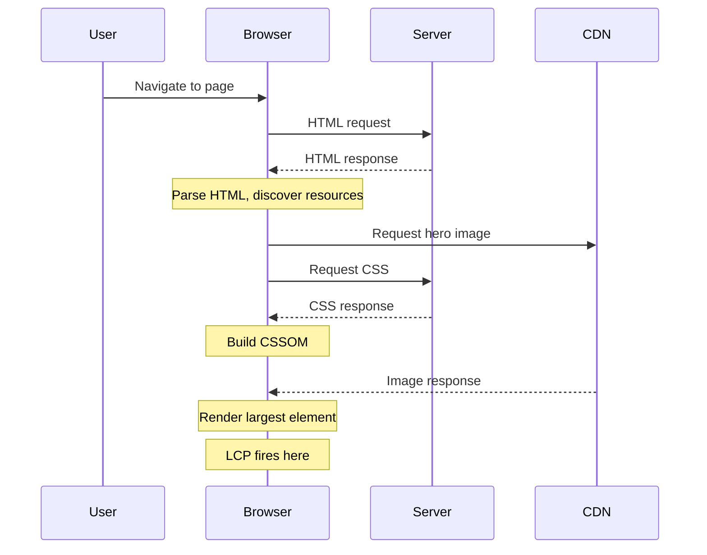
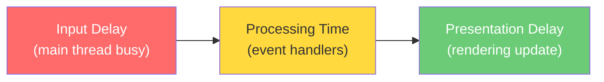

# Web Performance & Core Web Vitals

Web performance is not a feature. It is a constraint that shapes every architectural decision, every dependency you add, and every asset you serve. Google's research consistently shows that a 100ms increase in page load time reduces conversions by 1-2%. Amazon found that every 100ms of latency costs them 1% in sales. These are not hypothetical numbers — they are measured in revenue.

Core Web Vitals are Google's attempt to distill the complex, multi-dimensional problem of "is this page fast?" into three measurable numbers. Understanding what they measure, why they were chosen, and how to optimize for them is foundational to modern frontend engineering.

## Core Web Vitals Explained

### Largest Contentful Paint (LCP)

LCP measures **loading performance** — specifically, the time it takes for the largest content element visible in the viewport to render. This is typically a hero image, a large text block, or a video poster frame.

**Target:** Under 2.5 seconds at the 75th percentile.



**What counts as the LCP element:**
- `` elements
- `<image>` inside `<svg>`
- `<video>` poster images
- Elements with `background-image` loaded via CSS
- Block-level elements containing text nodes

**Common LCP killers:**

| Problem | Impact | Fix |
|---------|--------|-----|
| Render-blocking CSS | Delays entire render tree | Inline critical CSS, defer non-critical |
| Unoptimized hero image | Large download blocks LCP | Use modern formats (AVIF, WebP), proper sizing |
| Slow server response (TTFB) | Delays everything | CDN, edge rendering, caching |
| Client-side rendering | No content until JS executes | SSR or SSG |
| Third-party script blocking | Main thread contention | `async`/`defer`, facade pattern |

```typescript
// Measure LCP programmatically
const observer = new PerformanceObserver((list) => {
  const entries = list.getEntries();
  const lastEntry = entries[entries.length - 1];
  console.log('LCP:', lastEntry.startTime, 'ms');
  console.log('LCP Element:', lastEntry.element);
});

observer.observe({ type: 'largest-contentful-paint', buffered: true });
```

### Interaction to Next Paint (INP)

INP replaced First Input Delay (FID) in March 2024. While FID only measured the delay of the **first** interaction, INP measures the latency of **all** interactions throughout the page's lifecycle and reports the worst one (with outlier adjustment).

**Target:** Under 200 milliseconds at the 75th percentile.

An interaction's latency has three phases:



1. **Input delay** — Time between the user's interaction and when the event handler starts executing. Caused by long tasks blocking the main thread.
2. **Processing time** — Time spent executing event handlers (click, keydown, etc.).
3. **Presentation delay** — Time from event handler completion to the next frame being painted.

**Strategies to improve INP:**

```typescript
// BAD: Long synchronous processing blocks the main thread
button.addEventListener('click', () => {
  const result = expensiveComputation(data); // 500ms blocking
  updateUI(result);
});

// GOOD: Break work into chunks with scheduler.yield()
button.addEventListener('click', async () => {
  // Show immediate feedback
  showLoadingState();

  // Yield to let the browser paint the loading state
  await scheduler.yield();

  const result = expensiveComputation(data);

  await scheduler.yield();

  updateUI(result);
});

// GOOD: Use requestIdleCallback for non-urgent work
button.addEventListener('click', () => {
  // Critical: update UI immediately
  updateUI(quickResult);

  // Non-critical: defer analytics, logging
  requestIdleCallback(() => {
    trackEvent('button_clicked');
    syncToServer(quickResult);
  });
});
```

::: warning Long Tasks
Any task that blocks the main thread for more than 50ms is a "long task." The Performance API lets you detect them:

```typescript
const observer = new PerformanceObserver((list) => {
  for (const entry of list.getEntries()) {
    console.warn(`Long task detected: ${entry.duration}ms`);
  }
});
observer.observe({ type: 'longtask', buffered: true });
```
:::

### Cumulative Layout Shift (CLS)

CLS measures **visual stability** — how much the page layout shifts unexpectedly during its lifetime. Every time a visible element changes position without user interaction, that shift is scored based on the area affected and the distance moved.

**Target:** Under 0.1 at the 75th percentile.

**The CLS formula:**

```
Layout Shift Score = Impact Fraction × Distance Fraction
```

- **Impact fraction:** The percentage of the viewport occupied by the unstable element (before and after the shift combined).
- **Distance fraction:** The distance the element moved, as a percentage of the viewport's largest dimension.

**Common CLS causes and fixes:**

| Cause | CLS Impact | Solution |
|-------|-----------|----------|
| Images without dimensions | High | Always set `width` and `height` attributes |
| Ads/embeds without reserved space | Very High | Use `aspect-ratio` or `min-height` containers |
| Web fonts causing FOUT | Medium | `font-display: optional` or `size-adjust` |
| Dynamic content injection | High | Reserve space with skeleton screens |
| Late-loading CSS | High | Inline critical CSS |

```html
<!-- BAD: No dimensions, causes layout shift when image loads -->


<!-- GOOD: Dimensions reserved, no shift -->


<!-- GOOD: Modern approach with aspect-ratio -->
<div style="aspect-ratio: 16/9; background: #e0e0e0;">
  
</div>
```

## Performance Budgets

A performance budget is a set of constraints you enforce on your application's performance metrics. Without budgets, performance degrades with every feature, dependency, and A/B test.

### Setting Budgets

```typescript
// Example: performance budget configuration (used by bundsize, Lighthouse CI, etc.)
const performanceBudget = {
  // Resource budgets
  resources: {
    javascript: { maxSize: '200kb', compressed: true },
    css: { maxSize: '50kb', compressed: true },
    images: { maxSize: '500kb', perPage: true },
    fonts: { maxSize: '100kb', maxFiles: 2 },
    total: { maxSize: '800kb', compressed: true },
  },

  // Timing budgets
  timing: {
    lcp: { target: 2500, max: 4000 },
    inp: { target: 200, max: 500 },
    cls: { target: 0.1, max: 0.25 },
    ttfb: { target: 800, max: 1800 },
    fcp: { target: 1800, max: 3000 },
  },

  // Count budgets
  counts: {
    requests: { max: 50 },
    thirdPartyRequests: { max: 10 },
    domElements: { max: 1500 },
  },
};
```

::: tip Enforce Budgets in CI
Use tools like [Lighthouse CI](https://github.com/GoogleChrome/lighthouse-ci) or [bundlesize](https://github.com/siddharthkp/bundlesize) to fail builds that exceed your budget. A budget that is not enforced is just a wish.
:::

### The Cost of JavaScript

JavaScript is the most expensive resource on the web, byte for byte. A 200KB image downloads, decodes, and renders. A 200KB JavaScript bundle downloads, parses, compiles, and executes — and it blocks the main thread during execution:

```
200KB of JavaScript (compressed):
├── Download:     ~50ms (4G)
├── Decompress:   ~5ms
├── Parse:        ~50ms
├── Compile:      ~30ms
└── Execute:      ~100ms (varies wildly)
Total:            ~235ms of main thread time

200KB of JPEG image:
├── Download:     ~50ms (4G)
├── Decode:       ~5ms (off main thread)
└── Rasterize:    ~2ms (off main thread)
Total:            ~7ms of main thread time
```

## Image Optimization

Images account for roughly 50% of total page weight on the median website. Optimizing images is the highest-leverage performance improvement you can make.

### Modern Formats

| Format | Compression | Transparency | Animation | Browser Support |
|--------|------------|-------------|-----------|-----------------|
| JPEG | Lossy | No | No | Universal |
| PNG | Lossless | Yes | No | Universal |
| WebP | Both | Yes | Yes | 97%+ |
| AVIF | Both | Yes | Yes | 92%+ |

**Always serve AVIF with WebP and JPEG fallbacks:**

```html
<picture>
  <source srcset="/hero.avif" type="image/avif">
  <source srcset="/hero.webp" type="image/webp">
  
</picture>
```

### Responsive Images with `srcset`

```html
<!-- Serve the right size for each viewport -->

```

### Lazy Loading Strategy

```typescript
// Native lazy loading (simple, good enough for most cases)
// 

// Intersection Observer for fine-grained control
function lazyLoadImages(): void {
  const images = document.querySelectorAll<HTMLImageElement>('img[data-src]');

  const observer = new IntersectionObserver(
    (entries) => {
      for (const entry of entries) {
        if (entry.isIntersecting) {
          const img = entry.target as HTMLImageElement;
          img.src = img.dataset.src!;
          if (img.dataset.srcset) {
            img.srcset = img.dataset.srcset;
          }
          img.removeAttribute('data-src');
          observer.unobserve(img);
        }
      }
    },
    {
      rootMargin: '200px', // Start loading 200px before viewport
    }
  );

  images.forEach((img) => observer.observe(img));
}
```

::: danger Never Lazy Load the LCP Image
The LCP element should load as fast as possible. Add `fetchpriority="high"` and remove `loading="lazy"`:

```html

```
:::

## Font Loading Strategies

Web fonts are a major source of both CLS (layout shifts from font swapping) and LCP delays (text hidden until font loads).

### The Four Font Display Strategies

```css
/* FOUT: Flash of Unstyled Text - shows fallback immediately */
@font-face {
  font-family: 'Brand';
  src: url('/fonts/brand.woff2') format('woff2');
  font-display: swap; /* Shows fallback, swaps when ready */
}

/* FOIT: Flash of Invisible Text - hides text until font loads */
@font-face {
  font-family: 'Brand';
  src: url('/fonts/brand.woff2') format('woff2');
  font-display: block; /* Hides text for up to 3s */
}

/* Best for CLS: don't swap at all if font is slow */
@font-face {
  font-family: 'Brand';
  src: url('/fonts/brand.woff2') format('woff2');
  font-display: optional; /* Uses font if cached, fallback otherwise */
}

/* Reduce CLS with size-adjust (match fallback metrics to web font) */
@font-face {
  font-family: 'Brand Fallback';
  src: local('Arial');
  size-adjust: 105%;
  ascent-override: 90%;
  descent-override: 22%;
  line-gap-override: 0%;
}
```

### Preloading Critical Fonts

```html
<!-- Preload fonts used above the fold -->
<link rel="preload" href="/fonts/brand-regular.woff2"
      as="font" type="font/woff2" crossorigin>
<link rel="preload" href="/fonts/brand-bold.woff2"
      as="font" type="font/woff2" crossorigin>
```

::: warning The crossorigin Attribute
The `crossorigin` attribute is **required** for font preloading, even for same-origin fonts. Without it, the browser will fetch the font twice — once for the preload and once for the actual `@font-face` declaration, because fonts are always fetched with CORS.
:::

### Font Subsetting

If your font supports Latin, Cyrillic, Greek, and CJK but your site is English-only, you're shipping 500KB+ of unused glyphs:

```bash
# Using pyftsubset to create a Latin-only subset
pyftsubset BrandFont.ttf \
  --output-file=BrandFont-latin.woff2 \
  --flavor=woff2 \
  --layout-features='kern,liga,calt' \
  --unicodes='U+0000-007F,U+00A0-00FF,U+2000-206F'
```

## Third-Party Script Management

Third-party scripts (analytics, ads, chat widgets, A/B testing) are the number one performance killer on most websites. They execute on the main thread, compete for bandwidth, and are completely outside your control.

### Loading Strategies

```html
<!-- WORST: Synchronous, blocks parsing -->
<script src="https://analytics.example.com/tracker.js"></script>

<!-- BETTER: Async, downloads in parallel but executes ASAP -->
<script async src="https://analytics.example.com/tracker.js"></script>

<!-- BEST for non-critical: Defer, executes after HTML parsing -->
<script defer src="https://analytics.example.com/tracker.js"></script>
```

### The Facade Pattern

Replace expensive third-party embeds with lightweight placeholders that load the real thing on interaction:

```typescript
// Instead of loading a 500KB chat widget on every page:
class ChatWidgetFacade extends HTMLElement {
  private loaded = false;

  connectedCallback(): void {
    this.innerHTML = `
      <button class="chat-facade" aria-label="Open chat support">
        <svg><!-- chat icon SVG --></svg>
        <span>Chat with us</span>
      </button>
    `;

    this.querySelector('button')!.addEventListener('click', () => {
      this.loadRealWidget();
    });
  }

  private async loadRealWidget(): Promise<void> {
    if (this.loaded) return;
    this.loaded = true;

    // Now load the real 500KB widget
    const script = document.createElement('script');
    script.src = 'https://chat-provider.com/widget.js';
    document.head.appendChild(script);
  }
}

customElements.define('chat-widget', ChatWidgetFacade);
```

### Using a Worker for Analytics

```typescript
// Offload analytics to a Web Worker to keep main thread free
// main.ts
const analyticsWorker = new Worker('/analytics-worker.js');

function trackEvent(name: string, properties: Record<string, unknown>): void {
  analyticsWorker.postMessage({
    type: 'track',
    payload: { name, properties, timestamp: Date.now() },
  });
}

// analytics-worker.js
const eventQueue: unknown[] = [];
let flushTimeout: number | null = null;

self.addEventListener('message', (event) => {
  if (event.data.type === 'track') {
    eventQueue.push(event.data.payload);

    if (!flushTimeout) {
      flushTimeout = self.setTimeout(() => {
        flush();
        flushTimeout = null;
      }, 5000);
    }
  }
});

async function flush(): Promise<void> {
  if (eventQueue.length === 0) return;
  const batch = eventQueue.splice(0);

  await fetch('/api/analytics', {
    method: 'POST',
    body: JSON.stringify(batch),
    headers: { 'Content-Type': 'application/json' },
    keepalive: true,
  });
}
```

## Measurement Tools

### Lab Tools (Synthetic)

| Tool | Best For | Limitations |
|------|----------|-------------|
| **Lighthouse** | CI integration, audits | Single run, simulated throttling |
| **WebPageTest** | Detailed waterfall analysis, filmstrip | Manual testing, slow |
| **Chrome DevTools Performance** | Debugging specific interactions | Developer machine only |
| **Unlighthouse** | Full-site audits (every page) | Resource-intensive |

### Field Tools (Real User Monitoring)

| Tool | Data Source | Cost |
|------|------------|------|
| **Chrome UX Report (CrUX)** | Real Chrome users (28-day rolling) | Free |
| **web-vitals.js** | Your users, your data | Free (library), storage cost |
| **Vercel Analytics** | Real users on Vercel | Free tier available |
| **SpeedCurve** | Synthetic + RUM | Paid |

### Implementing RUM with web-vitals

```typescript
import { onLCP, onINP, onCLS, onFCP, onTTFB, type Metric } from 'web-vitals';

function sendToAnalytics(metric: Metric): void {
  const body = JSON.stringify({
    name: metric.name,
    value: metric.value,
    rating: metric.rating, // 'good' | 'needs-improvement' | 'poor'
    delta: metric.delta,
    id: metric.id,
    navigationType: metric.navigationType,
    url: window.location.href,
    // Attribution data (if using web-vitals/attribution)
    ...(metric.attribution && { attribution: metric.attribution }),
  });

  // Use sendBeacon for reliability (survives page unload)
  if (navigator.sendBeacon) {
    navigator.sendBeacon('/api/vitals', body);
  } else {
    fetch('/api/vitals', { body, method: 'POST', keepalive: true });
  }
}

onLCP(sendToAnalytics);
onINP(sendToAnalytics);
onCLS(sendToAnalytics);
onFCP(sendToAnalytics);
onTTFB(sendToAnalytics);
```

## Performance Optimization Checklist

### Critical Path

- [ ] Inline critical CSS (above-the-fold styles)
- [ ] Defer non-critical CSS with `media` attribute trick
- [ ] Eliminate render-blocking JavaScript
- [ ] Preconnect to critical third-party origins
- [ ] Use `103 Early Hints` for critical resources

### Images

- [ ] Serve AVIF with WebP and JPEG fallbacks
- [ ] Use responsive images with `srcset` and `sizes`
- [ ] Lazy load below-the-fold images
- [ ] Set `fetchpriority="high"` on LCP image
- [ ] Always include `width` and `height` attributes

### Fonts

- [ ] Preload critical font files
- [ ] Use `font-display: optional` or `swap` with `size-adjust`
- [ ] Subset fonts to required character ranges
- [ ] Self-host fonts (avoid Google Fonts CDN for privacy + performance)

### JavaScript

- [ ] Code-split by route (see [Bundle Optimization](/frontend-engineering/bundle-optimization))
- [ ] Use dynamic `import()` for below-the-fold components
- [ ] Defer third-party scripts
- [ ] Use Web Workers for CPU-intensive tasks
- [ ] Set performance budgets and enforce in CI

## Further Reading

- [Browser Rendering Pipeline](/frontend-engineering/browser-rendering) — Understand what happens after resources arrive
- [Bundle Optimization](/frontend-engineering/bundle-optimization) — Reduce JavaScript payload through tree shaking and code splitting
- [Rendering Strategies](/frontend-engineering/rendering-strategies) — Choose the rendering approach that optimizes for your metrics
- [Performance Engineering](/performance/) — Server-side profiling and optimization
- [Performance Profiling > Browser Profiling](/performance/profiling/browser-profiling) — Chrome DevTools deep dive

---

::: tip Key Takeaway
- Core Web Vitals (LCP, INP, CLS) are the three metrics that define whether your page feels fast, responsive, and stable to real users.
- JavaScript is the most expensive resource byte-for-byte — a 200KB JS bundle costs 30x more main-thread time than a 200KB image.
- Performance budgets that are not enforced in CI are just wishes — automate them or they will erode with every sprint.
:::

::: warning Common Misconceptions
- **"Lighthouse score = real user experience."** Lighthouse runs on a powerful machine with simulated throttling. Real user metrics (CrUX, RUM) often tell a very different story. Always prioritize field data over lab data.
- **"Lazy loading everything improves performance."** Lazy loading the LCP image actually *hurts* performance. The hero image should load eagerly with `fetchpriority="high"`.
- **"HTTP/2 means we don't need to bundle."** While HTTP/2 multiplexes requests, each small file still has overhead (headers, TLS records, parse cost). Bundling still matters — just not as aggressively.
- **"A fast TTFB means a fast page."** TTFB measures server response time, not user experience. A page can have a 100ms TTFB but a 5s LCP if render-blocking resources and client-side rendering delay content.
- **"Adding a CDN fixes performance."** A CDN helps with TTFB and asset delivery, but cannot fix render-blocking JavaScript, unoptimized images, or layout shifts caused by missing dimensions.
:::

## When NOT to Use These Optimizations

Not every optimization applies to every project. Avoid over-engineering performance when:

- **Internal tools with <100 users** — Spending weeks optimizing Core Web Vitals for an admin dashboard behind a VPN is wasted effort. Optimize for developer productivity instead.
- **Prototype or MVP stage** — Performance work has diminishing returns on apps that might pivot next month. Ship fast, measure, then optimize.
- **Premature image format migration** — If your CDN does not support AVIF/WebP content negotiation, manually creating multiple formats for a blog with 20 images is not worth the build complexity.
- **Web Worker analytics on simple sites** — A 5-page marketing site does not need a Web Worker-based analytics pipeline. A simple `defer`-ed script tag is sufficient.

::: tip In Production
- **Google** developed Core Web Vitals and uses them as a ranking signal in search results. Sites in the "good" CWV bucket see measurably higher click-through rates.
- **Shopify** invested heavily in Storefront performance, reducing LCP by 45% across their hosted stores by switching to SSR with streaming and AVIF images.
- **Vercel** built their Analytics product around real user Web Vitals data, giving Next.js teams per-page CWV dashboards out of the box.
- **Pinterest** reduced perceived wait time by 40% by implementing progressive image loading and performance budgets that block deploys exceeding 150KB JS per page.
- **The Financial Times** uses performance budgets enforced in CI — any PR that adds more than 5KB gzipped JavaScript triggers a mandatory review from the performance team.
:::

::: details Quiz

**1. What are the three Core Web Vitals and their target thresholds?**

::: details Answer
LCP (Largest Contentful Paint) < 2.5s, INP (Interaction to Next Paint) < 200ms, CLS (Cumulative Layout Shift) < 0.1 — all measured at the 75th percentile.
:::

**2. Why is JavaScript more expensive than an image of the same size?**

::: details Answer
A 200KB image downloads, decodes (off main thread), and rasterizes (~7ms of main thread time). A 200KB JS bundle downloads, decompresses, parses, compiles, and executes — all on the main thread (~235ms). JavaScript blocks interactivity; images do not.
:::

**3. What replaced First Input Delay (FID) in March 2024, and why?**

::: details Answer
Interaction to Next Paint (INP) replaced FID. FID only measured the delay of the first interaction, while INP measures all interactions throughout the page lifecycle and reports the worst (with outlier adjustment), giving a more complete picture of responsiveness.
:::

**4. What is the `crossorigin` attribute required for when preloading fonts, even for same-origin fonts?**

::: details Answer
Fonts are always fetched using CORS (anonymous mode). Without the `crossorigin` attribute on the preload link, the browser fetches the font twice — once for the preload (without CORS) and once for the `@font-face` declaration (with CORS) — because the requests don't match.
:::

**5. What is `font-display: optional` and when should you use it?**

::: details Answer
`font-display: optional` uses the web font only if it is already cached (from a previous visit). On the first visit, it shows the fallback font with no swap, eliminating CLS from font swapping entirely. Use it when visual stability matters more than using the exact brand font on first load.
:::

:::

::: details Exercise
**Performance Audit Challenge**

Pick any public website (e.g., your company's marketing site, a popular e-commerce store, or a news site).

1. Run a Lighthouse audit in Chrome DevTools (Incognito mode, mobile preset)
2. Check the CrUX data via [PageSpeed Insights](https://pagespeed.web.dev/)
3. Identify the LCP element using DevTools Performance tab
4. Document three specific, actionable improvements with estimated impact

**Deliverables:**
- LCP element identified and screenshot taken
- Three improvements ranked by impact (e.g., "Preload hero image: estimated -800ms LCP")
- A `performance-budget.json` file defining JS, CSS, image, and timing budgets for the site

::: details Solution
Example audit for a hypothetical e-commerce site:

```json
{
  "resources": {
    "javascript": { "maxSize": "200kb", "compressed": true },
    "css": { "maxSize": "50kb", "compressed": true },
    "images": { "maxSize": "500kb", "perPage": true },
    "fonts": { "maxSize": "80kb", "maxFiles": 2 }
  },
  "timing": {
    "lcp": { "target": 2500, "max": 4000 },
    "inp": { "target": 200, "max": 500 },
    "cls": { "target": 0.1, "max": 0.25 }
  }
}
```

Common findings:
1. **Hero image not preloaded** — Add `<link rel="preload" as="image" href="/hero.avif">` and `fetchpriority="high"` on the img tag. Estimated LCP improvement: 500-1200ms.
2. **Render-blocking third-party scripts** — Move analytics and chat widget to `defer` or facade pattern. Estimated INP improvement: 100-300ms.
3. **Images without width/height** — Add explicit dimensions to all product images. Estimated CLS improvement: 0.05-0.15.
:::

:::

> **One-Liner Summary:** Web performance is a constraint, not a feature — every architectural decision either pays it forward or creates a debt your users repay in seconds of waiting.
