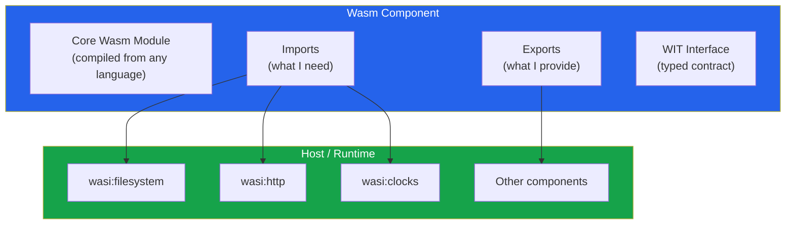
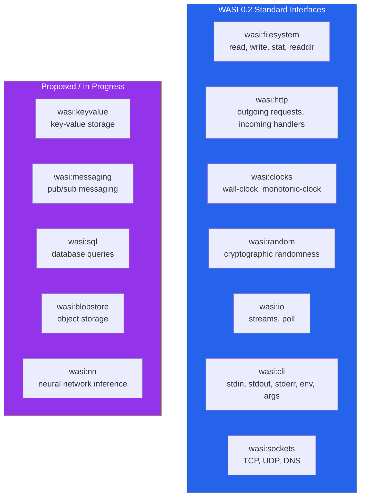
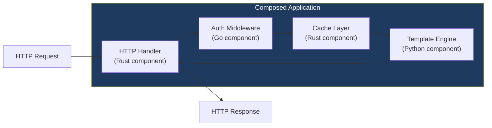
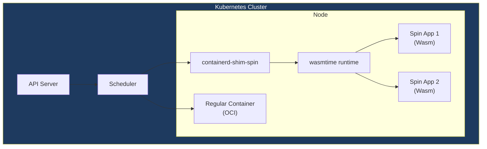

# WebAssembly Components (WASI 0.2)

The [WebAssembly basics page](/frontend-engineering/webassembly) covers what Wasm is, linear memory, compilation from Rust/Go/C++, and performance characteristics. This page covers what comes next: the Component Model, WASI 0.2, WIT interfaces, and the ecosystem that turns WebAssembly from "fast code in the browser" into "universal, composable, language-agnostic modules that run everywhere."

The original Wasm spec solved a narrow problem: run compiled code fast in a sandboxed VM. But it had severe limitations for real-world use. Modules could not talk to the operating system (no file I/O, no networking, no clocks). Modules from different languages could not call each other without manual FFI. There was no standard way to compose modules together. The Component Model and WASI 0.2 fix all of this.

Solomon Hykes (co-founder of Docker) said in 2019: "If WASM+WASI existed in 2008, we wouldn't have needed to create Docker." That quote captures the ambition — Wasm components aim to be the universal unit of software composition, replacing containers for many workloads.

**Related**: [WebAssembly Basics](/frontend-engineering/webassembly) | [Edge Computing](/performance/edge-computing/) | [Micro-Frontends](/frontend-engineering/micro-frontends)

---

## The Component Model

### Why Core Wasm Is Not Enough

Core Wasm (the 1.0 spec) has these limitations:

| Limitation | Impact |
|-----------|--------|
| **Only numeric types** (i32, i64, f32, f64) | Cannot pass strings, records, lists, or variants across module boundaries |
| **No standard ABI** | A Rust module and a Go module cannot call each other without manual serialization |
| **No composition** | Cannot link modules together without a host-level glue layer |
| **No capability model** | A module has access to everything the host gives it — no fine-grained permissions |
| **No standard I/O** | No portable way to read files, make HTTP requests, or get the current time |

The Component Model introduces a higher-level abstraction on top of core Wasm that solves every one of these problems.

### What Is a Component?

A **component** is a Wasm module wrapped with a typed interface. It declares what it imports (capabilities it needs) and what it exports (functionality it provides). The interface is defined in WIT (Wasm Interface Type).



**Key properties of components:**

1. **Language-agnostic**: Written in Rust, Go, Python, JavaScript, C/C++, or any language with a Wasm target
2. **Composable**: Components link together through typed interfaces — no serialization, no FFI
3. **Sandboxed**: A component can only access what it explicitly imports — capability-based security
4. **Portable**: Runs on any runtime that supports the Component Model (wasmtime, wasmer, wazero, browser polyfills)

### Component vs Module

```
Core Wasm Module (.wasm):
  - Exports/imports only functions with numeric params
  - No type system beyond i32/i64/f32/f64
  - No standard way to pass strings or structs
  - Single module, no composition

Wasm Component (.wasm):
  - Exports/imports use WIT-defined rich types
  - Strings, records, variants, lists, options, results
  - Composes with other components via typed interfaces
  - Capability-based security (explicit imports)
```

---

## WIT — WebAssembly Interface Type

WIT is the interface definition language for the Component Model. Think of it as protobuf/IDL for Wasm — it defines the contract between components.

### WIT Syntax

```wit
// A package defines a namespace for interfaces
package my-org:image-processor@1.0.0;

// An interface defines a set of types and functions
interface types {
    // Record (like a struct)
    record image {
        width: u32,
        height: u32,
        pixels: list<u8>,    // RGBA pixel data
        format: image-format,
    }

    // Variant (like an enum with data)
    variant image-format {
        png,
        jpeg(u8),   // quality 0-100
        webp(u8),
    }

    // Flags (bitfield)
    flags filter-options {
        preserve-alpha,
        dither,
        high-quality,
    }

    // Type alias
    type pixel = tuple<u8, u8, u8, u8>;

    // Result type for fallible operations
    variant process-error {
        invalid-dimensions(string),
        unsupported-format(string),
        out-of-memory,
    }
}

// Interface with functions
interface processor {
    use types.{image, image-format, filter-options, process-error};

    // Functions that components can export
    grayscale: func(img: image) -> result<image, process-error>;
    resize: func(img: image, width: u32, height: u32) -> result<image, process-error>;
    convert: func(img: image, target: image-format) -> result<image, process-error>;
    apply-filter: func(img: image, name: string, opts: filter-options) -> result<image, process-error>;
}

// A world defines what a component imports and exports
world image-processing {
    import wasi:filesystem/types@0.2.0;
    import wasi:http/outgoing-handler@0.2.0;
    import wasi:logging/logging;

    export processor;
}
```

### WIT Type System

| WIT Type | Description | Example |
|----------|-------------|---------|
| `bool` | Boolean | `true`, `false` |
| `u8`, `u16`, `u32`, `u64` | Unsigned integers | `255`, `65535` |
| `s8`, `s16`, `s32`, `s64` | Signed integers | `-128`, `32767` |
| `f32`, `f64` | Floating point | `3.14` |
| `char` | Unicode character | `'a'` |
| `string` | UTF-8 string | `"hello"` |
| `list<T>` | Dynamic list | `list<u8>` |
| `option<T>` | Optional value | `option<string>` |
| `result<T, E>` | Success or error | `result<image, error>` |
| `tuple<T...>` | Fixed-size tuple | `tuple<u32, u32>` |
| `record` | Named fields | Like a struct |
| `variant` | Tagged union | Like Rust enum |
| `enum` | Simple enumeration | Named values |
| `flags` | Bitfield | Named bits |

### How WIT Enables Cross-Language Composition

```
Developer writes WIT interface
    ↓
wit-bindgen generates bindings for each language:
    → Rust: trait + types + impl skeleton
    → Go: interface + types + wrapper
    → Python: class + types + decorator
    → JavaScript: class + types + adapter
    ↓
Each language implements the interface
    ↓
wasm-tools component new wraps core module into component
    ↓
wasm-tools compose links components together
    ↓
Result: Rust component calls Go component calls Python component
        — all through typed interfaces, no serialization
```

---

## WASI — WebAssembly System Interface

WASI defines standardized interfaces for operating system functionality. WASI 0.2 (released 2024, current stable) is built on the Component Model and uses WIT for all interface definitions.

### WASI 0.2 Interfaces



### wasi:http — HTTP Handler

The most commonly used WASI interface for server-side Wasm:

```wit
// wasi:http/incoming-handler@0.2.0
interface incoming-handler {
    use types.{incoming-request, response-outparam};

    // The entry point for an HTTP server component
    handle: func(request: incoming-request, response-out: response-outparam);
}

// wasi:http/outgoing-handler@0.2.0
interface outgoing-handler {
    use types.{outgoing-request, request-options, future-incoming-response};

    // Make an outbound HTTP request
    handle: func(request: outgoing-request, options: option<request-options>)
        -> result<future-incoming-response, error-code>;
}
```

### wasi:filesystem — File System Access

```wit
// wasi:filesystem/types@0.2.0 (simplified)
interface types {
    resource descriptor {
        read-via-stream: func(offset: filesize) -> result<input-stream, error-code>;
        write-via-stream: func(offset: filesize) -> result<output-stream, error-code>;
        stat: func() -> result<descriptor-stat, error-code>;
        readdir: func() -> result<directory-entry-stream, error-code>;
    }

    record descriptor-stat {
        type: descriptor-type,
        size: filesize,
        data-access-timestamp: option<datetime>,
        data-modification-timestamp: option<datetime>,
    }
}
```

### Capability-Based Security

WASI uses a capability model: a component can only access resources it is explicitly given. This is fundamentally different from POSIX (where any process can open any file the user has permission to access).

```
POSIX model:
  Process → open("/etc/passwd") → Kernel checks user permissions → Granted/Denied
  Any process can TRY to access anything

WASI capability model:
  Component → only has access to capabilities host provides
  If host doesn't provide filesystem capability → component literally cannot call filesystem functions
  If host provides only /app/data → component cannot see /etc/passwd
```

```bash
# wasmtime: grant specific filesystem directories
wasmtime run --dir /app/data::/data component.wasm
# Component sees /data, which maps to host /app/data
# Component CANNOT access anything outside /app/data

# Grant network access
wasmtime run --dir /app/data::/data \
  --env API_KEY=secret \
  component.wasm

# No --dir means no filesystem access at all
wasmtime run component.wasm
# Component runs in pure compute sandbox — no I/O
```

---

## Building Components

### Rust Component

```toml
# Cargo.toml
[package]
name = "hello-component"
version = "0.1.0"
edition = "2021"

[dependencies]
wit-bindgen = "0.36"

[lib]
crate-type = ["cdylib"]
```

```wit
// wit/world.wit
package my-org:hello@0.1.0;

interface greeter {
    greet: func(name: string) -> string;
}

world hello {
    export greeter;
}
```

```rust
// src/lib.rs
wit_bindgen::generate!({
    world: "hello",
});

struct MyComponent;

impl Guest for MyComponent {
    // Implement the greeter interface
}

impl exports::my_org::hello::greeter::Guest for MyComponent {
    fn greet(name: String) -> String {
        format!("Hello, {}! Greetings from Rust.", name)
    }
}

export!(MyComponent);
```

```bash
# Build the component
cargo build --target wasm32-wasip2 --release

# Or build core module and wrap as component
cargo build --target wasm32-wasip1 --release
wasm-tools component new target/wasm32-wasip1/release/hello_component.wasm \
  -o hello-component.wasm
```

### Go Component (TinyGo)

```go
// main.go
package main

import (
    "fmt"
)

//go:generate wit-bindgen-go generate --world hello ./wit

// Implement the greeter interface
type GreeterImpl struct{}

func (g *GreeterImpl) Greet(name string) string {
    return fmt.Sprintf("Hello, %s! Greetings from Go.", name)
}

func init() {
    // Register implementation
    greeter.SetGreeter(&GreeterImpl{})
}

func main() {}
```

```bash
# Build with TinyGo
tinygo build -target=wasip2 -o hello-go.wasm main.go
```

### Python Component (componentize-py)

```python
# app.py
import hello

class Greeter(hello.exports.Greeter):
    def greet(self, name: str) -> str:
        return f"Hello, {name}! Greetings from Python."
```

```bash
# Build Python component
componentize-py -d wit/world.wit -w hello componentize app -o hello-python.wasm
```

### JavaScript Component (jco)

```javascript
// greeter.js
export const greeter = {
    greet(name) {
        return `Hello, ${name}! Greetings from JavaScript.`;
    }
};
```

```bash
# Transpile JS to a Wasm component using jco
jco componentize greeter.js --wit wit/world.wit --world-name hello -o hello-js.wasm
```

---

## Composing Components

The real power of the Component Model is composing components from different languages into a single application.



### Using wasm-tools compose

```bash
# Compose two components: main app imports auth, auth imports cache
wasm-tools compose main-app.wasm \
  --definitions auth.wasm \
  --definitions cache.wasm \
  -o composed-app.wasm

# The composed output is a single .wasm file that:
# 1. Satisfies main-app's import of "auth" with auth.wasm's export
# 2. Satisfies auth.wasm's import of "cache" with cache.wasm's export
# 3. Only exposes main-app's exports to the outside world
```

### Using WAC (WebAssembly Composition)

WAC is a higher-level composition language:

```wac
// compose.wac
package my-org:composed-app;

let auth = new my-org:auth { ... };
let cache = new my-org:cache { ... };
let app = new my-org:app {
    auth: auth.authenticator,
    cache: cache.store,
};

export app...;
```

```bash
wac plug --plug auth.wasm --plug cache.wasm app.wasm -o composed.wasm
```

---

## Runtimes

### Wasmtime (Bytecode Alliance)

Wasmtime is the reference runtime for Wasm components and WASI 0.2. It is the most compliant and well-tested.

```bash
# Install wasmtime
curl https://wasmtime.dev/install.sh -sSf | bash

# Run a WASI component
wasmtime run component.wasm

# Run an HTTP handler component
wasmtime serve component.wasm --addr 0.0.0.0:8080

# With filesystem and env access
wasmtime run --dir ./data::/data --env DB_URL=postgres://... component.wasm
```

| Feature | Wasmtime | Wasmer | Wazero | V8 (Browser) |
|---------|----------|--------|--------|---------------|
| **Component Model** | Full | Partial | No (core Wasm only) | No (core Wasm only) |
| **WASI 0.2** | Full | Partial | WASI Preview 1 only | No |
| **Language** | Rust | Rust/C | Go (pure, no CGo) | C++ |
| **Embeddable** | Rust, C, Python, Go, .NET | Rust, C, Python, Go, JS | Go only | Many |
| **AOT compilation** | Yes (Cranelift) | Yes (LLVM/Cranelift) | Interpreter + compiler | V8 TurboFan |
| **Cold start** | ~1ms | ~1ms | ~0.5ms | ~5ms |
| **Best for** | Production, standards compliance | Polyglot embedding | Go applications | Browser |

### Wasmer

```bash
# Install wasmer
curl https://get.wasmer.io -sSfL | sh

# Run a module
wasmer run component.wasm

# Publish a package to WAPM (Wasmer package manager)
wasmer publish my-package.wasm

# Wasmer Edge: deploy globally
wasmer deploy
```

### Wazero (Go-native)

```go
// Pure Go Wasm runtime — no CGo, no system dependencies
package main

import (
    "context"
    "fmt"
    "os"

    "github.com/tetratelabs/wazero"
    "github.com/tetratelabs/wazero/imports/wasi_snapshot_preview1"
)

func main() {
    ctx := context.Background()
    r := wazero.NewRuntime(ctx)
    defer r.Close(ctx)

    // Instantiate WASI
    wasi_snapshot_preview1.MustInstantiate(ctx, r)

    // Load and run module
    wasmBytes, _ := os.ReadFile("component.wasm")
    mod, _ := r.Instantiate(ctx, wasmBytes)

    // Call exported function
    fn := mod.ExportedFunction("greet")
    results, _ := fn.Call(ctx, 42)
    fmt.Println(results)
}
```

---

## Wasm Deployment Targets

### Browser vs Server vs Edge

```mermaid
graph TB
    subgraph Browser["Browser"]
        direction TB
        B1["wasm-bindgen / wasm-pack"]
        B2["Web APIs via JS interop"]
        B3["No WASI (browser APIs instead)"]
        B4["Use: compute-heavy UI tasks"]
    end

    subgraph Server["Server (wasmtime, wasmer)"]
        direction TB
        S1["WASI 0.2 full support"]
        S2["Component Model composition"]
        S3["Microservice / plugin host"]
        S4["Use: composable backends, plugins"]
    end

    subgraph Edge["Edge (Spin, Fastly Compute)"]
        direction TB
        E1["WASI + platform-specific APIs"]
        E2["Sub-millisecond cold starts"]
        E3["Request/response model"]
        E4["Use: API handlers, middleware"]
    end

    style Browser fill:#2563eb,color:#fff
    style Server fill:#16a34a,color:#fff
    style Edge fill:#9333ea,color:#fff
```



| Characteristic | Browser | Server | Edge |
|---------------|---------|--------|------|
| **Cold start** | N/A (loaded once) | ~1-5ms | ~0.1-1ms |
| **Memory** | Shared with tab | Configurable, multi-GB | Limited (128MB typical) |
| **I/O** | Web APIs only | WASI filesystem, sockets | HTTP, KV store |
| **Composition** | Not yet (polyfills exist) | Full Component Model | Platform-specific |
| **Security** | Browser sandbox | WASI capability model | Runtime sandbox |
| **Languages** | Rust, C/C++, AssemblyScript | Any with Wasm target | Any with Wasm target |

### Fermyon Spin

Spin is a framework for building Wasm microservices that run on the edge or on your own infrastructure.

```toml
# spin.toml — Spin application manifest
spin_manifest_version = 2

[application]
name = "my-api"
version = "0.1.0"
description = "A Wasm microservice"

[[trigger.http]]
route = "/api/hello/..."
component = "hello-handler"

[component.hello-handler]
source = "target/wasm32-wasip1/release/hello_handler.wasm"
allowed_outbound_hosts = ["https://api.example.com"]
key_value_stores = ["default"]
```

```rust
// Spin HTTP handler in Rust
use spin_sdk::http::{IntoResponse, Request, Response};
use spin_sdk::http_component;
use spin_sdk::key_value::Store;

#[http_component]
fn handle_request(req: Request) -> anyhow::Result<impl IntoResponse> {
    let store = Store::open_default()?;

    let path = req.path();
    let name = path.strip_prefix("/api/hello/").unwrap_or("world");

    // Read from key-value store
    let visit_count: u64 = store
        .get(name)
        .map(|v| u64::from_le_bytes(v.try_into().unwrap_or([0; 8])))
        .unwrap_or(0) + 1;

    store.set(name, &visit_count.to_le_bytes())?;

    Ok(Response::builder()
        .status(200)
        .header("content-type", "application/json")
        .body(format!(r#"{{"message": "Hello, {}!", "visits": {}}}"#,
                       name, visit_count))
        .build())
}
```

```bash
# Build and run locally
spin build
spin up  # serves at http://localhost:3000

# Deploy to Fermyon Cloud
spin deploy
# Deployed at: https://my-api-xyz.fermyon.app

# Deploy to Kubernetes (via SpinKube)
spin kube scaffold --from my-api.wasm | kubectl apply -f -
```

### Fastly Compute

```javascript
// Fastly Compute handler (JavaScript)
addEventListener("fetch", (event) => event.respondWith(handleRequest(event)));

async function handleRequest(event) {
    const req = event.request;
    const url = new URL(req.url);

    // Fetch from origin
    const backend = new Backend({ name: "origin", target: "origin.example.com" });
    const originResp = await fetch(req, { backend });

    // Add edge processing
    const resp = new Response(originResp.body, originResp);
    resp.headers.set("X-Edge-Processed", "true");
    resp.headers.set("X-Edge-Pop", fastly.env.get("FASTLY_POP"));

    return resp;
}
```

---

## Wasm + Kubernetes

### SpinKube

SpinKube runs Wasm components as Kubernetes workloads. Instead of running containers, Kubernetes schedules Spin applications via a custom runtime class.



```yaml
# SpinApp CRD — deploy Wasm to Kubernetes
apiVersion: core.spinoperator.dev/v1alpha1
kind: SpinApp
metadata:
  name: my-wasm-service
spec:
  image: "ghcr.io/my-org/my-wasm-service:v1.0"
  replicas: 3
  executor: containerd-shim-spin
  resources:
    limits:
      memory: "64Mi"    # Wasm apps use far less memory than containers
      cpu: "100m"
```

```bash
# Install SpinKube
helm repo add spinkube https://spinkube.github.io/charts
helm install spin-operator spinkube/spin-operator --namespace spin-operator --create-namespace

# Install the runtime class
kubectl apply -f https://github.com/spinkube/spin-operator/releases/latest/download/spin-operator.runtime-class.yaml

# Deploy a Spin app to Kubernetes
spin kube scaffold --from ghcr.io/my-org/my-service:latest | kubectl apply -f -
```

**Why run Wasm in Kubernetes instead of containers?**

| Metric | Container | Wasm (SpinKube) |
|--------|-----------|-----------------|
| **Cold start** | 100-500ms | 0.5-5ms |
| **Memory per instance** | 50-200MB | 1-10MB |
| **Image size** | 50-500MB | 0.5-5MB |
| **Startup density** | ~50 per node | ~500+ per node |
| **Security isolation** | Linux namespaces + cgroups | Wasm sandbox (no syscall access) |
| **Language support** | Any | Rust, Go, Python, JS, C/C++ (with Wasm target) |

### wasmCloud

wasmCloud is a platform for building distributed applications with Wasm components. It uses a lattice model where components and capability providers can run on any node.

```yaml
# wadm.yaml — wasmCloud application manifest
apiVersion: core.oam.dev/v1beta1
kind: Application
metadata:
  name: my-app
  annotations:
    version: v0.1.0
spec:
  components:
    - name: http-handler
      type: component
      properties:
        image: ghcr.io/my-org/http-handler:0.1.0
      traits:
        - type: spreadscaler
          properties:
            instances: 5
        - type: link
          properties:
            target: keyvalue-provider
            namespace: wasi
            package: keyvalue
            interfaces: [store]
    - name: keyvalue-provider
      type: capability
      properties:
        image: ghcr.io/wasmcloud/keyvalue-redis:0.1.0
        config:
          - name: redis-url
            properties:
              url: redis://redis:6379
```

---

## Production Examples

### Plugin Systems

Wasm components make excellent plugin systems because they run in a sandbox — a plugin cannot crash the host or access data it should not see.

```rust
// Host application: load and run Wasm plugins
use wasmtime::component::*;
use wasmtime::{Config, Engine, Store};

bindgen!({
    world: "plugin",
    path: "wit/plugin.wit",
});

fn run_plugin(plugin_path: &str, input: &str) -> anyhow::Result<String> {
    let mut config = Config::new();
    config.wasm_component_model(true);

    let engine = Engine::new(&config)?;
    let component = Component::from_file(&engine, plugin_path)?;

    let mut linker = Linker::new(&engine);
    // Only provide what the plugin needs — capability-based security
    wasmtime_wasi::add_to_linker_sync(&mut linker)?;

    let mut store = Store::new(&engine, ());
    let instance = Plugin::instantiate(&mut store, &component, &linker)?;

    let result = instance
        .call_process(&mut store, input)?;

    Ok(result)
}
```

**Companies using Wasm for plugins:**

| Company | Use Case |
|---------|----------|
| **Shopify** | Shopify Functions — merchants write custom logic as Wasm modules |
| **Figma** | Plugin system runs in Wasm sandbox |
| **Envoy Proxy** | Wasm filters for custom request/response processing |
| **Zed Editor** | Extensions as Wasm components |
| **Dynatrace** | Custom data processing extensions |

### Edge API Gateway

```
Request → Edge CDN (200+ PoPs)
    → Wasm component handles request (~0.5ms cold start)
    → Reads from KV store
    → Calls origin if needed
    → Returns response

vs

Request → Edge CDN
    → Container cold start (200ms)
    → Process request
    → Return response
```

### Embedded / IoT

Wasm's small footprint and sandboxing make it viable for IoT and embedded applications:

```
Wasm module: 50KB - 5MB
Runtime (wasmtime): ~5MB memory
Total footprint: ~10MB — runs on Raspberry Pi, routers, gateways

Container equivalent: 50-200MB minimum
```

---

## Limitations and Future

### Current Limitations (2026)

| Limitation | Status | Impact |
|-----------|--------|--------|
| **No threads in Component Model** | Proposal in progress (wasi:thread) | Cannot use multi-core parallelism within a component |
| **GC languages are large** | Go/Java/Python Wasm binaries are 5-50MB | TinyGo helps (1-5MB) but lacks full Go stdlib |
| **No browser Component Model** | Polyfills exist, not native | Browser Wasm is still core Wasm + JS glue |
| **Limited async support** | wasi:io/poll for basic async | No async/await across component boundaries yet |
| **Debugging is primitive** | DWARF support improving | No step-through debugging in most runtimes |
| **Ecosystem maturity** | Growing rapidly | Fewer libraries than native, some WASI interfaces still in draft |

### What Is Coming

```
2024: WASI 0.2 stable (done)
2025: wasi:http improvements, wasi:keyvalue stable, wasi:messaging stable
2026: Component Model in browsers (partial), async components, threads proposal
2027+: Full browser support, wasi:nn stable, wasm64 (>4GB memory)
```

### wasm64 — Breaking the 4GB Barrier

Current Wasm uses 32-bit memory addressing (max ~4GB linear memory). wasm64 extends this to 64-bit addressing for workloads that need more memory (databases, ML inference, video processing).

---

## When NOT to Use WebAssembly Components

- **Your app is purely browser JavaScript**: If you are building a standard web app with React/Vue/Svelte, adding Wasm adds complexity for minimal benefit. Wasm is for compute-intensive work, not DOM manipulation.

- **You need direct OS access**: WASI provides a capability-based subset of OS functionality. If you need raw sockets, shared memory IPC, or direct GPU access, native code is more appropriate.

- **Your team only knows JavaScript**: While JS-to-Wasm tools exist (jco, componentize-js), the ecosystem is strongest in Rust. If your team has no Rust experience and no plans to learn it, the friction may outweigh the benefits.

- **You need maximum performance**: Wasm is near-native but not native. For compute where every nanosecond matters (HFT, real-time audio processing, game physics), native compiled code with SIMD intrinsics will be faster.

- **Your deployment target does not support Wasm**: Legacy environments, some FaaS platforms, and some embedded systems do not have Wasm runtimes available. Check runtime support before committing.

- **Startup time does not matter**: If your workload is a long-running server process, the sub-millisecond cold start advantage of Wasm is irrelevant. Containers work fine.

---

::: tip Key Takeaway
- The Component Model transforms Wasm from "fast bytecode format" into "universal, composable software unit" — components from different languages compose through typed WIT interfaces with no serialization overhead.
- WASI 0.2 provides standardized OS interfaces (filesystem, HTTP, clocks, sockets) with a capability-based security model — components can only access what they are explicitly granted.
- The immediate production use cases are edge computing (Fermyon Spin, Fastly Compute), plugin systems (Shopify, Envoy, Figma), and high-density Kubernetes workloads (SpinKube) where sub-millisecond cold starts and 10-100x memory savings justify the ecosystem immaturity.
:::

::: warning Common Misconceptions

**"WebAssembly replaces JavaScript."**
No. In the browser, Wasm handles compute-intensive tasks while JavaScript manages the DOM and application logic. On the server, Wasm competes with containers, not with Node.js — they solve different problems. JavaScript is also a valid source language for Wasm components via jco.

**"WASI makes Wasm a full operating system replacement."**
WASI is deliberately limited. It provides capability-based access to specific OS features, not a full POSIX interface. This is a feature, not a limitation — the restricted interface is what makes Wasm sandboxing secure. You cannot accidentally open `/etc/passwd` from a WASI component.

**"Wasm components are as fast as native code."**
Close but not quite. Wasm achieves 80-95% of native speed for compute-bound workloads. The overhead comes from bounds checking on memory access, indirect function calls, and the abstraction of the linear memory model. For I/O-bound workloads, the difference is negligible.

**"The Component Model is just another module system."**
It is fundamentally different from npm/crates/pip. Components compose at the binary level — a Rust component and a Go component link together without any shared runtime, serialization, or FFI. This enables true language-agnostic software composition, which no existing module system achieves.

**"Wasm is only useful for the browser."**
The server-side and edge use cases are already larger than the browser use case by deployment volume. Cloudflare Workers, Fastly Compute, Fermyon Spin, Shopify Functions, and wasmCloud all run Wasm server-side. The sub-millisecond cold start is the killer feature for serverless/edge.

**"You need Rust to use WebAssembly."**
Rust has the best Wasm tooling, but TinyGo, Python (componentize-py), JavaScript (jco), C/C++ (Emscripten), C# (.NET), and Kotlin all target Wasm. The Component Model's WIT bindings generators support multiple languages, and the list is growing.
:::

---

::: tip In Production

**Shopify Functions** runs merchant-written business logic (discounts, shipping rules, payment customization) as Wasm modules. Millions of Wasm executions per second across their platform with sub-millisecond execution times.

**Cloudflare Workers** (while not Component Model yet) runs JavaScript and Wasm in V8 isolates across 310+ data centers, handling billions of requests daily. Their migration toward the Component Model is underway.

**Fastly Compute** was one of the first production Wasm-at-the-edge platforms. Customers process billions of requests through Wasm modules with cold starts under 50 microseconds.

**Fermyon** offers Spin as both an open-source framework and a cloud platform (Fermyon Cloud) for deploying Wasm microservices. Companies use it for API handlers, data processing, and AI inference at the edge.

**Microsoft** uses Wasm components internally for SpinKube on AKS, and contributes actively to the Bytecode Alliance and WASI standardization.

**Envoy Proxy** supports Wasm filters for custom request/response processing in the service mesh data plane. Istio uses this to allow users to extend proxy behavior without recompiling Envoy.
:::

---

::: details Quiz

**1. What problem does the Component Model solve that core Wasm cannot?**

::: details Answer
Core Wasm only supports numeric types (i32, i64, f32, f64) at module boundaries. This means passing a string, struct, or list between modules requires manual memory management and serialization. The Component Model introduces WIT (WebAssembly Interface Type) which defines rich types (strings, records, variants, lists, options, results) and generates bindings for each language. Components from different languages compose through these typed interfaces without any serialization or FFI.
:::

**2. How does WASI's capability model differ from POSIX file access?**

::: details Answer
In POSIX, any process can attempt to open any file and the kernel checks user-level permissions. In WASI, a component can only access capabilities explicitly granted by the host. If the host does not provide the filesystem capability (or provides it scoped to a specific directory), the component literally cannot call filesystem functions. This is enforced at the Wasm runtime level — there is no syscall to bypass it.
:::

**3. Why are Wasm cold starts 100-1000x faster than container cold starts?**

::: details Answer
Containers require: pulling/extracting an image (MB-GB), creating namespaces and cgroups, mounting filesystems, starting a process, and runtime initialization (JVM warmup, Node.js module loading, etc.). Wasm modules are pre-compiled AOT (or JIT-compiled in <1ms), require no kernel namespace setup, have no filesystem to mount, and start executing immediately. A typical Wasm cold start is 0.1-1ms vs 100-500ms for containers.
:::

**4. What is the role of WIT in cross-language component composition?**

::: details Answer
WIT (WebAssembly Interface Type) is the interface definition language that defines the contract between components. A developer writes a WIT file declaring types and functions. Then wit-bindgen generates language-specific bindings (Rust traits, Go interfaces, Python classes). Each language implements the interface in its native idiom. When compiled to Wasm components, they can call each other through these typed interfaces regardless of source language — Rust calls Go calls Python, all type-safe, no serialization.
:::

**5. When would you choose SpinKube over regular Kubernetes containers?**

::: details Answer
SpinKube is ideal when you need high density (500+ instances per node vs ~50 containers), fast scaling (sub-millisecond cold starts for instant scale-to-zero and scale-up), minimal resource usage (1-10MB per instance vs 50-200MB), or stronger isolation (Wasm sandbox vs Linux namespaces). Use it for request-driven workloads (API handlers, webhooks, event processors) where scale-to-zero matters. Do NOT use it for long-running stateful services, workloads needing GPU/filesystem/threads, or when your team's languages lack mature Wasm tooling.
:::

:::

---

::: details Exercise

**Build a Multi-Language Wasm Component Application**

Create a composed application from components written in three different languages:

1. **Rust component (HTTP handler)**: Accepts HTTP requests, routes them based on path, and calls the other components
2. **Go component (auth middleware)**: Validates JWT tokens from request headers, returns user info or error
3. **Python component (template renderer)**: Takes user data and a template name, returns rendered HTML

**Steps:**

1. Define WIT interfaces for each component's exports:
   ```wit
   // auth.wit
   interface authenticator {
       record user-info {
           id: string,
           name: string,
           role: string,
       }
       authenticate: func(token: string) -> result<user-info, string>;
   }
   ```

2. Implement each component in its respective language
3. Compose them together:
   ```bash
   wasm-tools compose http-handler.wasm \
     --definitions auth.wasm \
     --definitions renderer.wasm \
     -o composed-app.wasm
   ```
4. Run the composed application:
   ```bash
   wasmtime serve composed-app.wasm --addr 0.0.0.0:8080
   ```
5. Test with curl:
   ```bash
   curl -H "Authorization: Bearer <jwt>" http://localhost:8080/dashboard
   # Should: validate JWT (Go) → fetch user data → render template (Python) → return HTML
   ```

**Verification:**
- [ ] Each component builds independently
- [ ] `wasm-tools component wit` shows correct imports/exports for each
- [ ] Composed application runs and handles requests end-to-end
- [ ] A request with an invalid JWT returns 401 (Go auth component rejects it)
- [ ] A request with a valid JWT returns rendered HTML (Python template component)
:::

---

**One-Liner Summary**: The WebAssembly Component Model and WASI 0.2 transform Wasm from a fast bytecode format into a universal, composable, language-agnostic module system with capability-based security — enabling everything from edge computing with sub-millisecond cold starts to plugin systems to high-density Kubernetes workloads.

*Last updated: 2026-04-04*
