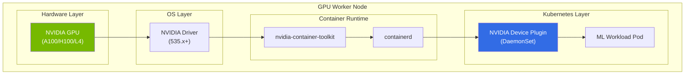
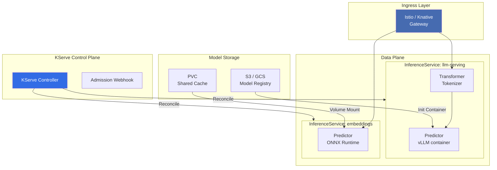
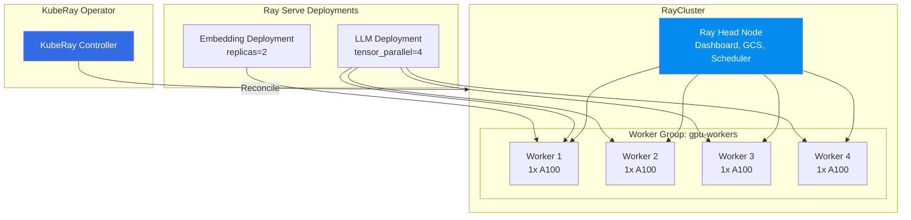
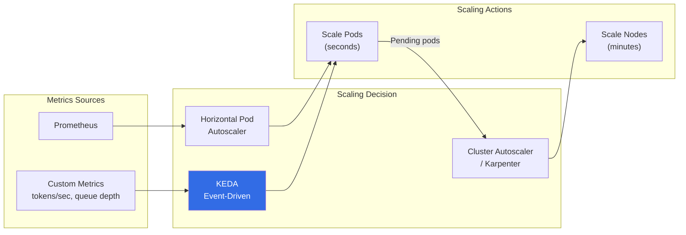

# Kubernetes for ML Workloads

Kubernetes was designed for stateless web services — containers that start in seconds, consume modest CPU and memory, and scale horizontally by adding more replicas. GPU workloads violate every one of these assumptions. They require specialized hardware scheduling, take minutes to start (model loading), consume tens of gigabytes of VRAM that cannot be overcommitted, and have fundamentally different scaling characteristics than HTTP services.

Despite this mismatch, Kubernetes has become the dominant platform for production ML infrastructure. The reason is operational: teams already run their application layer on Kubernetes, and the alternative — managing a separate fleet of GPU VMs — creates an operational burden that scales poorly. The trick is understanding *how* to run GPU workloads on Kubernetes correctly, which requires a different set of primitives than standard deployments.

This page covers the full stack: NVIDIA device plugin for GPU access, KServe for model serving abstraction, Triton Inference Server on K8s, KubeRay for distributed workloads, and GPU autoscaling strategies that balance cost against latency SLAs.

---

## Prerequisites

Before running GPU workloads on Kubernetes, your cluster needs:

1. **GPU nodes** — Worker nodes with NVIDIA GPUs (managed node groups on EKS/GKE, or bare metal)
2. **NVIDIA drivers** — Installed on each GPU node (typically via DaemonSet)
3. **Container runtime with GPU support** — containerd with nvidia-container-toolkit
4. **NVIDIA Device Plugin** — Kubernetes plugin that exposes GPUs as schedulable resources



---

## NVIDIA Device Plugin

The NVIDIA Device Plugin is a DaemonSet that runs on every GPU node and registers GPUs as extended resources (`nvidia.com/gpu`) with the Kubernetes scheduler. Without it, Kubernetes has no awareness that GPUs exist.

### Installation

```yaml
# nvidia-device-plugin.yaml
apiVersion: apps/v1
kind: DaemonSet
metadata:
  name: nvidia-device-plugin-daemonset
  namespace: kube-system
  labels:
    app.kubernetes.io/name: nvidia-device-plugin
spec:
  selector:
    matchLabels:
      app.kubernetes.io/name: nvidia-device-plugin
  updateStrategy:
    type: RollingUpdate
  template:
    metadata:
      labels:
        app.kubernetes.io/name: nvidia-device-plugin
    spec:
      tolerations:
        - key: nvidia.com/gpu
          operator: Exists
          effect: NoSchedule
      priorityClassName: system-node-critical
      containers:
        - name: nvidia-device-plugin
          image: nvcr.io/nvidia/k8s-device-plugin:v0.15.0
          securityContext:
            allowPrivilegeEscalation: false
            capabilities:
              drop: ["ALL"]
          volumeMounts:
            - name: device-plugin
              mountPath: /var/lib/kubelet/device-plugins
          env:
            - name: FAIL_ON_INIT_ERROR
              value: "false"
            - name: DEVICE_SPLIT_COUNT
              value: "1"  # Set >1 for GPU time-slicing
            - name: DEVICE_LIST_STRATEGY
              value: "envvar"
      volumes:
        - name: device-plugin
          hostPath:
            path: /var/lib/kubelet/device-plugins
      nodeSelector:
        accelerator: nvidia-gpu
```

### Requesting GPUs in Pods

Once the device plugin is running, pods can request GPUs through the standard `resources` field:

```yaml
apiVersion: v1
kind: Pod
metadata:
  name: gpu-inference-pod
spec:
  containers:
    - name: model-server
      image: vllm/vllm-openai:v0.5.0
      resources:
        limits:
          nvidia.com/gpu: 1       # Request exactly 1 GPU
          memory: "32Gi"
          cpu: "8"
        requests:
          nvidia.com/gpu: 1       # Must equal limits (GPUs are not overcommitable)
          memory: "24Gi"
          cpu: "4"
      env:
        - name: NVIDIA_VISIBLE_DEVICES
          value: "all"
        - name: CUDA_VISIBLE_DEVICES
          value: "0"
      volumeMounts:
        - name: model-cache
          mountPath: /models
        - name: shm
          mountPath: /dev/shm     # Required for PyTorch multiprocessing
  volumes:
    - name: model-cache
      persistentVolumeClaim:
        claimName: model-weights-pvc
    - name: shm
      emptyDir:
        medium: Memory
        sizeLimit: "16Gi"         # Shared memory for tensor ops
  nodeSelector:
    accelerator: nvidia-gpu
  tolerations:
    - key: nvidia.com/gpu
      operator: Exists
      effect: NoSchedule
```

::: danger GPU Limits Must Equal Requests
Unlike CPU and memory, GPUs cannot be overcommitted. If you set `requests: 1` and `limits: 2`, Kubernetes will fail to schedule the pod. Always set GPU requests equal to limits. This is an NVIDIA device plugin requirement, not a Kubernetes limitation.
:::

### GPU Time-Slicing for Shared Access

When multiple small models need to share a single GPU, time-slicing allows Kubernetes to advertise one physical GPU as multiple virtual GPUs:

```yaml
# gpu-time-slicing-config.yaml
apiVersion: v1
kind: ConfigMap
metadata:
  name: nvidia-device-plugin-config
  namespace: kube-system
data:
  config.yaml: |
    version: v1
    sharing:
      timeSlicing:
        renameByDefault: false
        failRequestsGreaterThanOne: false
        resources:
          - name: nvidia.com/gpu
            replicas: 4    # Each physical GPU appears as 4 virtual GPUs
```

After applying this, a node with 1 physical A100 will report `nvidia.com/gpu: 4` — allowing four pods to each request 1 GPU and share the physical device through time-multiplexing.

::: warning Time-Slicing Limitations
- No memory isolation — one pod can OOM the entire GPU, killing all co-located workloads
- No compute isolation — noisy neighbors cause latency spikes
- No VRAM partitioning — all pods see the full GPU memory (but compete for it)
- Best for: dev/staging environments, small models, embedding workloads
- Not recommended for: production latency-sensitive inference
:::

### Multi-Instance GPU (MIG)

MIG is NVIDIA's hardware-level GPU partitioning, available on A100 and H100. Unlike time-slicing, MIG provides actual memory and compute isolation:

```yaml
# mig-config.yaml — Partition an A100-80GB into multiple instances
apiVersion: v1
kind: ConfigMap
metadata:
  name: nvidia-device-plugin-config
  namespace: kube-system
data:
  config.yaml: |
    version: v1
    sharing:
      mig:
        strategy: "mixed"    # Allow different MIG profiles
        resources:
          - name: nvidia.com/mig-3g.40gb   # 3/7 compute, 40GB VRAM
            replicas: 1
          - name: nvidia.com/mig-2g.20gb   # 2/7 compute, 20GB VRAM
            replicas: 1
          - name: nvidia.com/mig-1g.10gb   # 1/7 compute, 10GB VRAM
            replicas: 2
```

| MIG Profile | Compute Slices | VRAM (A100-80GB) | Best For |
|-------------|---------------|------------------|----------|
| `7g.80gb` | 7/7 | 80 GB | Large model, full GPU |
| `4g.40gb` | 4/7 | 40 GB | Medium model inference |
| `3g.40gb` | 3/7 | 40 GB | Medium model, more memory |
| `2g.20gb` | 2/7 | 20 GB | Small model inference |
| `1g.10gb` | 1/7 | 10 GB | Embeddings, tiny models |

---

## KServe — Model Serving on Kubernetes

KServe (formerly KFServing) is the Kubernetes-native model serving framework. It provides a standardized inference protocol, autoscaling, canary deployments, and model versioning — all through Kubernetes custom resources.

### Architecture



### InferenceService Manifest

```yaml
# kserve-llm.yaml — Deploy a vLLM model with KServe
apiVersion: serving.kserve.io/v1beta1
kind: InferenceService
metadata:
  name: llama-3-8b-serving
  namespace: ml-serving
  annotations:
    serving.kserve.io/deploymentMode: RawDeployment
    sidecar.istio.io/inject: "true"
spec:
  predictor:
    minReplicas: 2
    maxReplicas: 10
    scaleTarget: 70              # Target 70% GPU utilization
    scaleMetric: gpu_utilization # Custom metric for GPU scaling

    containers:
      - name: kserve-container
        image: vllm/vllm-openai:v0.5.0
        args:
          - "--model"
          - "/models/Meta-Llama-3-8B-Instruct"
          - "--tensor-parallel-size"
          - "1"
          - "--max-model-len"
          - "8192"
          - "--gpu-memory-utilization"
          - "0.90"
          - "--enable-prefix-caching"
        resources:
          limits:
            nvidia.com/gpu: 1
            memory: "32Gi"
            cpu: "8"
          requests:
            nvidia.com/gpu: 1
            memory: "24Gi"
            cpu: "4"
        ports:
          - containerPort: 8000
            protocol: TCP
        readinessProbe:
          httpGet:
            path: /health
            port: 8000
          initialDelaySeconds: 120   # Model loading takes time
          periodSeconds: 10
          failureThreshold: 30
        livenessProbe:
          httpGet:
            path: /health
            port: 8000
          initialDelaySeconds: 180
          periodSeconds: 30
          failureThreshold: 5
        volumeMounts:
          - name: model-cache
            mountPath: /models
          - name: shm
            mountPath: /dev/shm
        env:
          - name: HF_TOKEN
            valueFrom:
              secretKeyRef:
                name: huggingface-credentials
                key: token

    volumes:
      - name: model-cache
        persistentVolumeClaim:
          claimName: model-weights-pvc
      - name: shm
        emptyDir:
          medium: Memory
          sizeLimit: "16Gi"

    nodeSelector:
      accelerator: nvidia-gpu
      gpu-type: a100

    tolerations:
      - key: nvidia.com/gpu
        operator: Exists
        effect: NoSchedule

    affinity:
      podAntiAffinity:
        preferredDuringSchedulingIgnoredDuringExecution:
          - weight: 100
            podAffinityTerm:
              labelSelector:
                matchLabels:
                  serving.kserve.io/inferenceservice: llama-3-8b-serving
              topologyKey: kubernetes.io/hostname
```

::: tip Use `initialDelaySeconds` Generously
LLM loading takes 60-300 seconds depending on model size and storage speed. Set `initialDelaySeconds` on readiness probes to at least 2x your expected load time. If Kubernetes kills your pod before the model loads, you get crash loops that waste GPU hours.
:::

### Canary Deployments with KServe

```yaml
# kserve-canary.yaml — Gradual rollout of new model version
apiVersion: serving.kserve.io/v1beta1
kind: InferenceService
metadata:
  name: llama-serving
  namespace: ml-serving
spec:
  predictor:
    # Primary model — receives 90% of traffic
    canaryTrafficPercent: 10

    containers:
      - name: kserve-container
        image: vllm/vllm-openai:v0.5.0
        args:
          - "--model"
          - "/models/Meta-Llama-3-8B-Instruct-v1"
        resources:
          limits:
            nvidia.com/gpu: 1

  # Canary model — receives 10% of traffic
  canary:
    predictor:
      containers:
        - name: kserve-container
          image: vllm/vllm-openai:v0.5.0
          args:
            - "--model"
            - "/models/Meta-Llama-3-8B-Instruct-v2"
          resources:
            limits:
              nvidia.com/gpu: 1
```

---

## Triton Inference Server on Kubernetes

NVIDIA Triton is the highest-performance inference server, supporting multiple model frameworks (PyTorch, TensorFlow, ONNX, TensorRT, vLLM) in a single server with dynamic batching, model ensembles, and concurrent model execution.

### Triton Deployment

```yaml
# triton-deployment.yaml
apiVersion: apps/v1
kind: Deployment
metadata:
  name: triton-inference-server
  namespace: ml-serving
  labels:
    app: triton
spec:
  replicas: 3
  selector:
    matchLabels:
      app: triton
  template:
    metadata:
      labels:
        app: triton
      annotations:
        prometheus.io/scrape: "true"
        prometheus.io/port: "8002"
    spec:
      containers:
        - name: triton
          image: nvcr.io/nvidia/tritonserver:24.03-py3
          args:
            - tritonserver
            - "--model-repository=/models"
            - "--strict-model-config=false"
            - "--log-verbose=1"
            - "--model-control-mode=poll"
            - "--repository-poll-secs=30"
            - "--backend-config=python,shm-default-byte-size=4194304"
            - "--http-thread-count=8"
          ports:
            - containerPort: 8000    # HTTP
              name: http
            - containerPort: 8001    # gRPC
              name: grpc
            - containerPort: 8002    # Metrics
              name: metrics
          resources:
            limits:
              nvidia.com/gpu: 1
              memory: "32Gi"
              cpu: "8"
            requests:
              nvidia.com/gpu: 1
              memory: "24Gi"
              cpu: "4"
          readinessProbe:
            httpGet:
              path: /v2/health/ready
              port: 8000
            initialDelaySeconds: 60
            periodSeconds: 10
          livenessProbe:
            httpGet:
              path: /v2/health/live
              port: 8000
            initialDelaySeconds: 120
            periodSeconds: 30
          volumeMounts:
            - name: model-repo
              mountPath: /models
            - name: shm
              mountPath: /dev/shm
      volumes:
        - name: model-repo
          persistentVolumeClaim:
            claimName: triton-model-repo
        - name: shm
          emptyDir:
            medium: Memory
            sizeLimit: "16Gi"
      nodeSelector:
        accelerator: nvidia-gpu
      tolerations:
        - key: nvidia.com/gpu
          operator: Exists
          effect: NoSchedule
---
apiVersion: v1
kind: Service
metadata:
  name: triton-inference-server
  namespace: ml-serving
spec:
  selector:
    app: triton
  ports:
    - name: http
      port: 8000
      targetPort: 8000
    - name: grpc
      port: 8001
      targetPort: 8001
    - name: metrics
      port: 8002
      targetPort: 8002
  type: ClusterIP
```

### Triton Model Repository Structure

```
models/
├── text-embedding/
│   ├── config.pbtxt
│   └── 1/
│       └── model.onnx
├── reranker/
│   ├── config.pbtxt
│   └── 1/
│       └── model.plan          # TensorRT optimized
├── llm-backend/
│   ├── config.pbtxt
│   └── 1/
│       └── model.py            # Python backend for vLLM
└── ensemble-rag/
    └── config.pbtxt             # Chains: embed → rerank → generate
```

```protobuf
# config.pbtxt — Triton model configuration
name: "text-embedding"
platform: "onnxruntime_onnx"
max_batch_size: 64

input [
  {
    name: "input_ids"
    data_type: TYPE_INT64
    dims: [ -1 ]        # Dynamic sequence length
  },
  {
    name: "attention_mask"
    data_type: TYPE_INT64
    dims: [ -1 ]
  }
]

output [
  {
    name: "embeddings"
    data_type: TYPE_FP32
    dims: [ 1024 ]      # Embedding dimension
  }
]

# Dynamic batching — accumulate requests for GPU efficiency
dynamic_batching {
  max_queue_delay_microseconds: 100000   # Wait up to 100ms for batch
  preferred_batch_size: [ 16, 32, 64 ]
}

# Instance groups — how many model copies per GPU
instance_group [
  {
    count: 2             # 2 instances on 1 GPU
    kind: KIND_GPU
    gpus: [ 0 ]
  }
]
```

---

## KubeRay — Distributed ML on Kubernetes

KubeRay is the Kubernetes operator for Ray, enabling distributed inference, batch processing, and model serving across multiple GPU nodes. It is particularly useful for workloads that need tensor parallelism across nodes or distributed batch inference.

### KubeRay Architecture



### RayCluster Manifest

```yaml
# raycluster.yaml — Multi-GPU Ray cluster for distributed inference
apiVersion: ray.io/v1
kind: RayCluster
metadata:
  name: ml-inference-cluster
  namespace: ml-serving
spec:
  rayVersion: "2.10.0"

  headGroupSpec:
    rayStartParams:
      dashboard-host: "0.0.0.0"
      num-cpus: "0"         # Head node doesn't run GPU tasks
    template:
      spec:
        containers:
          - name: ray-head
            image: rayproject/ray-ml:2.10.0-py310-gpu
            ports:
              - containerPort: 6379    # GCS
              - containerPort: 8265    # Dashboard
              - containerPort: 10001   # Client
              - containerPort: 8000    # Serve
            resources:
              limits:
                cpu: "4"
                memory: "16Gi"
              requests:
                cpu: "2"
                memory: "8Gi"

  workerGroupSpecs:
    - groupName: gpu-workers
      replicas: 4
      minReplicas: 2
      maxReplicas: 8
      rayStartParams:
        num-gpus: "1"
      template:
        spec:
          containers:
            - name: ray-worker
              image: rayproject/ray-ml:2.10.0-py310-gpu
              resources:
                limits:
                  nvidia.com/gpu: 1
                  memory: "64Gi"
                  cpu: "8"
                requests:
                  nvidia.com/gpu: 1
                  memory: "48Gi"
                  cpu: "4"
              volumeMounts:
                - name: model-cache
                  mountPath: /models
                - name: shm
                  mountPath: /dev/shm
          volumes:
            - name: model-cache
              persistentVolumeClaim:
                claimName: model-weights-pvc
            - name: shm
              emptyDir:
                medium: Memory
                sizeLimit: "32Gi"
          nodeSelector:
            accelerator: nvidia-gpu
          tolerations:
            - key: nvidia.com/gpu
              operator: Exists
              effect: NoSchedule
```

### Ray Serve for Multi-Model Serving

```python
# ray_serve_deployment.py — Distributed model serving with Ray Serve
import ray
from ray import serve
from vllm import LLM, SamplingParams
from sentence_transformers import SentenceTransformer


@serve.deployment(
    ray_actor_options={"num_gpus": 1},
    num_replicas=2,
    max_ongoing_requests=32,
)
class EmbeddingModel:
    def __init__(self):
        self.model = SentenceTransformer(
            "BAAI/bge-large-en-v1.5",
            device="cuda"
        )

    async def __call__(self, request):
        data = await request.json()
        embeddings = self.model.encode(
            data["texts"],
            batch_size=32,
            normalize_embeddings=True,
        )
        return {"embeddings": embeddings.tolist()}


@serve.deployment(
    ray_actor_options={"num_gpus": 4},  # Tensor parallel across 4 GPUs
    num_replicas=1,
    max_ongoing_requests=64,
)
class LLMModel:
    def __init__(self):
        self.llm = LLM(
            model="/models/Meta-Llama-3-70B-Instruct",
            tensor_parallel_size=4,
            max_model_len=8192,
            gpu_memory_utilization=0.90,
        )

    async def __call__(self, request):
        data = await request.json()
        params = SamplingParams(
            temperature=data.get("temperature", 0.7),
            max_tokens=data.get("max_tokens", 512),
        )
        outputs = self.llm.generate([data["prompt"]], params)
        return {"text": outputs[0].outputs[0].text}


# Bind deployments
embedding_app = EmbeddingModel.bind()
llm_app = LLMModel.bind()

# Compose into a single application
app = serve.run(
    {
        "/embed": embedding_app,
        "/generate": llm_app,
    },
    host="0.0.0.0",
    port=8000,
)
```

::: tip KubeRay vs KServe — When to Use Which
- **KServe**: Single-model serving, Kubernetes-native, great for standardized inference protocols (V2), autoscaling, canary deployments. Best when each model fits on 1 GPU.
- **KubeRay**: Distributed workloads, tensor parallelism across multiple GPUs/nodes, batch processing, model composition. Best when you need multi-GPU serving or complex serving graphs.
- **Both together**: Use KubeRay for the compute cluster and KServe as the ingress/routing layer in front of it.
:::

---

## GPU Autoscaling

GPU autoscaling is fundamentally different from CPU autoscaling. The cost of each replica is 10-100x higher, and scale-up time is measured in minutes (model loading), not seconds (container start).

### Autoscaling Architecture



### HPA with Custom GPU Metrics

```yaml
# gpu-hpa.yaml — Autoscale based on GPU utilization + queue depth
apiVersion: autoscaling/v2
kind: HorizontalPodAutoscaler
metadata:
  name: llm-serving-hpa
  namespace: ml-serving
spec:
  scaleTargetRef:
    apiVersion: apps/v1
    kind: Deployment
    name: llm-serving
  minReplicas: 2
  maxReplicas: 10

  metrics:
    # Primary: GPU utilization from DCGM exporter
    - type: Pods
      pods:
        metric:
          name: DCGM_FI_DEV_GPU_UTIL
        target:
          type: AverageValue
          averageValue: "70"       # Scale up when GPU > 70%

    # Secondary: request queue depth
    - type: Pods
      pods:
        metric:
          name: vllm_num_requests_waiting
        target:
          type: AverageValue
          averageValue: "10"       # Scale up when queue > 10

  behavior:
    scaleUp:
      stabilizationWindowSeconds: 120   # Wait 2min before scaling up
      policies:
        - type: Pods
          value: 2                       # Add max 2 pods at a time
          periodSeconds: 300             # Every 5 minutes
    scaleDown:
      stabilizationWindowSeconds: 600   # Wait 10min before scaling down
      policies:
        - type: Pods
          value: 1                       # Remove max 1 pod at a time
          periodSeconds: 600             # Every 10 minutes
```

### KEDA for Event-Driven GPU Scaling

```yaml
# keda-scaler.yaml — Scale based on Kafka queue depth
apiVersion: keda.sh/v1alpha1
kind: ScaledObject
metadata:
  name: llm-batch-scaler
  namespace: ml-serving
spec:
  scaleTargetRef:
    name: llm-batch-processor
  minReplicaCount: 0            # Scale to zero when idle
  maxReplicaCount: 20
  cooldownPeriod: 300
  pollingInterval: 30

  triggers:
    - type: kafka
      metadata:
        bootstrapServers: kafka-broker:9092
        consumerGroup: llm-batch-consumer
        topic: inference-requests
        lagThreshold: "100"      # Scale up when lag > 100 messages

    - type: prometheus
      metadata:
        serverAddress: http://prometheus:9090
        metricName: inference_queue_depth
        threshold: "50"
        query: |
          sum(vllm_num_requests_waiting{namespace="ml-serving"})
```

::: warning Scale-Down Is More Dangerous Than Scale-Up
Scaling down a GPU pod kills all in-flight inference requests on that pod. Use `stabilizationWindowSeconds` (at least 600s for GPU workloads) and `maxUnavailable: 0` in your pod disruption budget. Also implement graceful shutdown: stop accepting new requests, drain the queue, then terminate.
:::

### Karpenter for GPU Node Provisioning

```yaml
# karpenter-gpu-provisioner.yaml
apiVersion: karpenter.sh/v1beta1
kind: NodePool
metadata:
  name: gpu-inference
spec:
  template:
    spec:
      requirements:
        - key: node.kubernetes.io/instance-type
          operator: In
          values:
            - g5.2xlarge      # 1x A10G, 24GB
            - g5.4xlarge      # 1x A10G, 24GB, more CPU
            - p4d.24xlarge    # 8x A100, 40GB
        - key: karpenter.sh/capacity-type
          operator: In
          values:
            - on-demand       # Production — no spot for GPU serving
        - key: topology.kubernetes.io/zone
          operator: In
          values:
            - us-east-1a
            - us-east-1b

      nodeClassRef:
        name: gpu-node-class

      taints:
        - key: nvidia.com/gpu
          effect: NoSchedule

  limits:
    nvidia.com/gpu: 40          # Max 40 GPUs total
    cpu: "320"
    memory: "1280Gi"

  disruption:
    consolidationPolicy: WhenUnderutilized
    consolidateAfter: 30m       # Wait 30min of low utilization
---
apiVersion: karpenter.k8s.aws/v1beta1
kind: EC2NodeClass
metadata:
  name: gpu-node-class
spec:
  amiFamily: AL2               # Amazon Linux 2 with GPU drivers
  subnetSelectorTerms:
    - tags:
        karpenter.sh/discovery: ml-cluster
  securityGroupSelectorTerms:
    - tags:
        karpenter.sh/discovery: ml-cluster
  blockDeviceMappings:
    - deviceName: /dev/xvda
      ebs:
        volumeSize: 200Gi
        volumeType: gp3
        iops: 6000
        throughput: 500
```

---

## Production Checklist

Before running GPU workloads in production Kubernetes, verify every item:

| Category | Check | Why |
|----------|-------|-----|
| **Scheduling** | GPU requests = limits | GPUs not overcommitable |
| **Scheduling** | Node taints + tolerations | Prevent non-GPU pods on GPU nodes |
| **Scheduling** | Pod anti-affinity | Spread replicas across nodes |
| **Memory** | `/dev/shm` emptyDir mount | PyTorch shared memory requirement |
| **Storage** | PVC for model weights | Avoid downloading on every restart |
| **Probes** | Generous `initialDelaySeconds` | Model loading takes minutes |
| **Probes** | Separate liveness/readiness | Readiness: model loaded. Liveness: process alive |
| **Scaling** | Long stabilization windows | GPU pods too expensive for thrashing |
| **Scaling** | PodDisruptionBudget | Never evict all inference replicas |
| **Security** | IMDSv2 on AWS nodes | Prevent SSRF credential theft |
| **Security** | Non-root containers | Limit blast radius |
| **Cost** | Resource quotas per namespace | Prevent GPU hoarding |
| **Observability** | DCGM exporter DaemonSet | GPU metrics in Prometheus |

---

## Key Takeaways

1. **NVIDIA Device Plugin is the foundation.** Without it, Kubernetes cannot schedule GPUs. Install it as a DaemonSet before anything else.

2. **GPU requests must equal limits.** Unlike CPU, GPUs cannot be overcommitted. This is the single most common misconfiguration.

3. **Use MIG over time-slicing for production.** Time-slicing has no isolation. MIG provides hardware-level memory and compute partitioning on A100/H100.

4. **KServe for standard serving, KubeRay for distributed workloads.** Choose based on whether your model fits on a single GPU or requires tensor parallelism.

5. **GPU autoscaling requires patience.** Scale-up takes minutes (model loading), and scale-down must be gentle (drain in-flight requests). Set stabilization windows to 5-10 minutes.

6. **Karpenter > Cluster Autoscaler for GPU nodes.** Karpenter provisions the right instance type directly, without node groups. It is faster and more cost-efficient for heterogeneous GPU fleets.

### Related Pages

- [AI Infrastructure Overview](/infrastructure/ai-infrastructure/) — GPU selection, cost optimization, Terraform provisioning
- [Model Serving Deep Dive](/infrastructure/ai-infrastructure/model-serving) — vLLM, TGI, Triton frameworks in detail
- [Kubernetes](/infrastructure/kubernetes) — Core Kubernetes concepts before GPU scheduling
- [AI in Production](/ai-ml-engineering/ai-in-production) — Application-level production AI patterns
