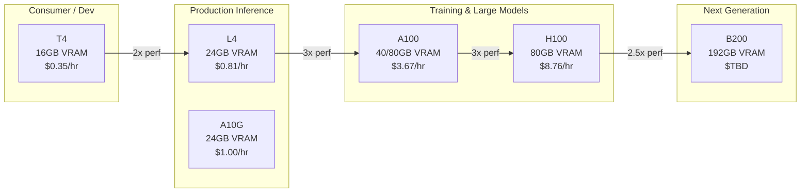
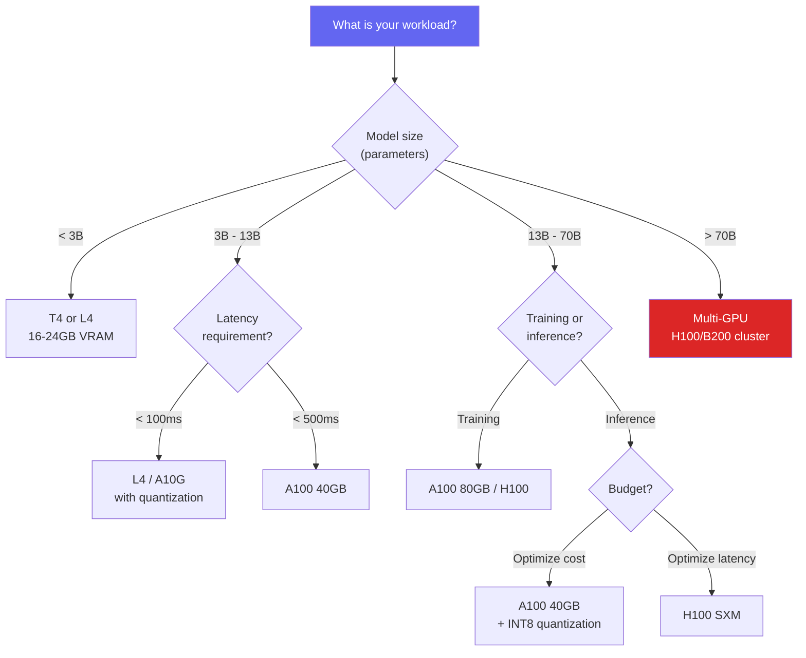
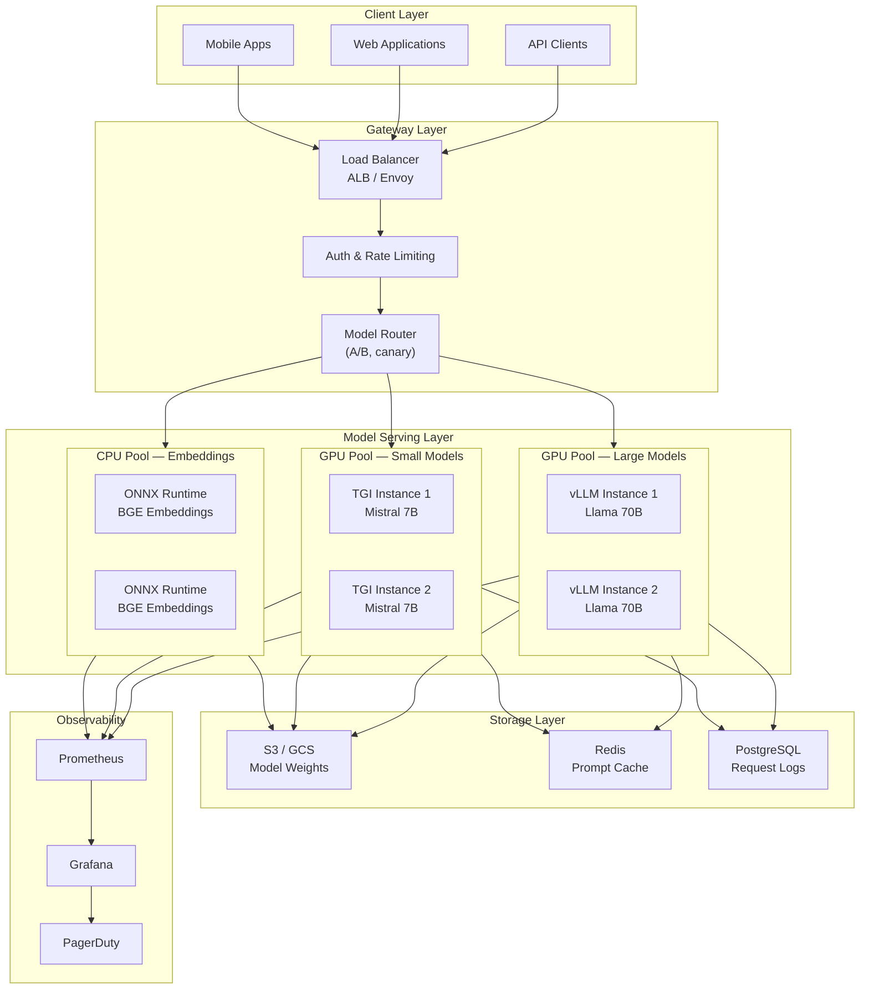
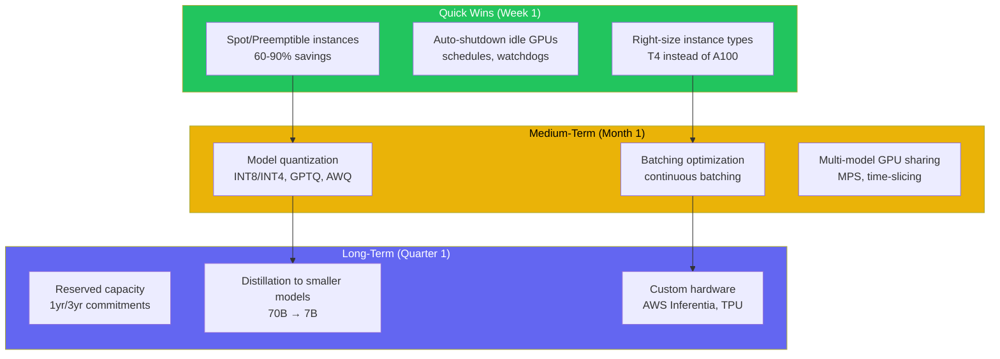
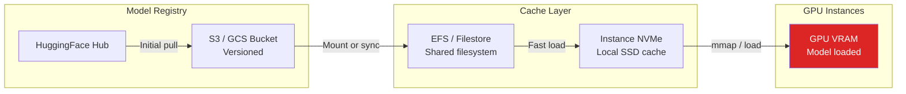

# AI Infrastructure Overview

AI infrastructure is the hardware and software stack that sits between a trained model and a user who receives a response. It encompasses GPU selection and provisioning, cluster orchestration, model serving frameworks, networking for high-bandwidth GPU communication, storage for model weights and datasets, and the cost optimization strategies that determine whether your AI product is profitable or hemorrhaging money.

This is not about training models — most companies do not train foundation models from scratch. This is about the infrastructure you need to **deploy, serve, and scale** AI workloads in production. Whether you are running a single fine-tuned model on a GPU instance or orchestrating hundreds of inference replicas across multiple regions, the infrastructure decisions you make here determine your latency, throughput, cost, and reliability.

---

## Why AI Infrastructure Is Different

Traditional web infrastructure is CPU-bound, memory-bound, or I/O-bound. AI infrastructure is **GPU-bound**, and that single difference cascades into every architectural decision:

| Dimension | Traditional Infrastructure | AI Infrastructure |
|-----------|--------------------------|-------------------|
| **Compute** | CPU (commodity, cheap) | GPU (scarce, expensive) |
| **Cost driver** | Network egress, storage | GPU hours (10-100x CPU cost) |
| **Scaling unit** | vCPU/container | GPU/fractional GPU |
| **Memory pressure** | Application heap | GPU VRAM (model must fit) |
| **Startup time** | Seconds (container) | Minutes (model loading) |
| **Utilization target** | 40-60% (headroom) | 80-95% (GPU too expensive to idle) |
| **Failure blast radius** | One service | Entire model serving pipeline |
| **Networking** | Standard TCP/HTTP | NVLink, InfiniBand for multi-GPU |

::: warning GPU Scarcity Is Real
Unlike CPUs, GPUs cannot be provisioned on-demand during peak hours. Cloud providers frequently have zero availability for A100/H100 instances. AI infrastructure planning must account for reservation strategies, spot instance fallbacks, and multi-cloud GPU sourcing.
:::

---

## GPU Landscape for AI Workloads

Choosing the right GPU is the single highest-impact infrastructure decision. The wrong choice either wastes money (over-provisioning) or creates latency problems (under-provisioning).

### NVIDIA GPU Comparison



### Detailed GPU Specifications

| GPU | VRAM | FP16 TFLOPS | INT8 TOPS | Interconnect | Best For | Cloud Cost/hr |
|-----|------|-------------|-----------|--------------|----------|--------------|
| **T4** | 16 GB | 65 | 130 | PCIe Gen3 | Dev/test, small model inference | $0.35 |
| **L4** | 24 GB | 121 | 242 | PCIe Gen4 | Production inference, video | $0.81 |
| **A10G** | 24 GB | 125 | 250 | PCIe Gen4 | Inference, graphics workloads | $1.00 |
| **A100 40GB** | 40 GB | 312 | 624 | NVLink 600GB/s | Training, large model inference | $3.06 |
| **A100 80GB** | 80 GB | 312 | 624 | NVLink 600GB/s | Large model training/inference | $3.67 |
| **H100 SXM** | 80 GB | 989 | 1979 | NVLink 900GB/s | Foundation model training | $8.76 |
| **H200** | 141 GB | 989 | 1979 | NVLink 900GB/s | Very large models, HBM3e | $12.00+ |
| **B200** | 192 GB | 2250 | 4500 | NVLink 1800GB/s | Next-gen training/inference | TBD |

### GPU Selection Decision Tree



::: tip Model Size to VRAM Rule of Thumb
A model with N billion parameters in FP16 requires approximately **2N GB** of VRAM just for weights. A 7B model needs ~14GB, a 13B model needs ~26GB, a 70B model needs ~140GB. Add 20-40% overhead for KV cache and activations during inference. Quantization (INT8, INT4, GPTQ, AWQ) can reduce this by 2-4x.
:::

---

## GPU Memory Deep Dive

Understanding GPU memory is critical for capacity planning. Model serving is fundamentally a memory management problem.

### Memory Breakdown During Inference

```
┌──────────────────────────────────────────────┐
│                GPU VRAM (80 GB)               │
├──────────────────────────────────────────────┤
│  Model Weights (FP16)          │  ~14 GB     │ ← 7B params × 2 bytes
│  KV Cache (per sequence)       │  ~2-8 GB    │ ← depends on context length
│  Activation Memory             │  ~1-2 GB    │ ← intermediate computations
│  CUDA Kernels / Overhead       │  ~1-2 GB    │ ← framework overhead
│  ─────────────────────────────────────────── │
│  Available for Batching        │  ~52-63 GB  │ ← more sequences in parallel
└──────────────────────────────────────────────┘
```

### KV Cache Sizing Formula

The KV cache grows linearly with sequence length and batch size:

$$
\text{KV Cache (bytes)} = 2 \times L \times H \times D \times S \times B \times \text{bytes\_per\_param}
$$

Where:
- $L$ = number of layers
- $H$ = number of attention heads
- $D$ = head dimension
- $S$ = sequence length
- $B$ = batch size
- Factor of 2 = key + value tensors

**Example: Llama 2 7B with 4096 context length:**

$$
\text{KV Cache} = 2 \times 32 \times 32 \times 128 \times 4096 \times 1 \times 2 = 2.1 \text{ GB per sequence}
$$

::: danger KV Cache Is the Bottleneck
At long context lengths (32K+), the KV cache dominates GPU memory, not the model weights. This is why techniques like PagedAttention (used in vLLM) and GQA (used in Llama 3) are critical — they reduce KV cache memory by 4-8x.
:::

---

## Terraform for GPU Infrastructure

Infrastructure-as-code is non-negotiable for GPU workloads. GPU instances are expensive, and manual provisioning leads to forgotten instances burning thousands of dollars overnight.

### AWS GPU Instance Provisioning

```hcl
# gpu-instances.tf — Production GPU cluster for model serving

terraform {
  required_providers {
    aws = {
      source  = "hashicorp/aws"
      version = "~> 5.0"
    }
  }
}

# GPU-optimized instance with A100
resource "aws_instance" "gpu_inference" {
  count = var.gpu_instance_count

  ami           = data.aws_ami.deep_learning.id
  instance_type = var.gpu_instance_type  # "p4d.24xlarge" for 8x A100

  subnet_id              = var.private_subnet_ids[count.index % length(var.private_subnet_ids)]
  vpc_security_group_ids = [aws_security_group.gpu_inference.id]
  iam_instance_profile   = aws_iam_instance_profile.gpu_instance.name

  # EBS-optimized for fast model loading from S3
  ebs_optimized = true

  root_block_device {
    volume_size = 200
    volume_type = "gp3"
    throughput  = 500
    iops        = 6000
  }

  # Instance store NVMe for model caching
  ephemeral_block_device {
    device_name  = "/dev/sdb"
    virtual_name = "ephemeral0"
  }

  metadata_options {
    http_tokens                 = "required"  # IMDSv2
    http_put_response_hop_limit = 1
  }

  user_data = base64encode(templatefile("${path.module}/scripts/gpu-init.sh", {
    model_bucket = var.model_s3_bucket
    model_path   = var.model_s3_key
    hf_token     = var.huggingface_token
  }))

  tags = {
    Name        = "gpu-inference-${count.index}"
    Environment = var.environment
    CostCenter  = "ai-platform"
    AutoShutdown = var.auto_shutdown_enabled ? "true" : "false"
  }
}

# Deep Learning AMI (Ubuntu, CUDA pre-installed)
data "aws_ami" "deep_learning" {
  most_recent = true
  owners      = ["amazon"]

  filter {
    name   = "name"
    values = ["Deep Learning AMI GPU PyTorch * (Ubuntu 22.04) *"]
  }

  filter {
    name   = "architecture"
    values = ["x86_64"]
  }
}

# Security group — restrict to internal traffic only
resource "aws_security_group" "gpu_inference" {
  name_prefix = "gpu-inference-"
  vpc_id      = var.vpc_id

  ingress {
    from_port       = 8000
    to_port         = 8000
    protocol        = "tcp"
    security_groups = [var.load_balancer_sg_id]
    description     = "Model serving endpoint"
  }

  ingress {
    from_port       = 9090
    to_port         = 9090
    protocol        = "tcp"
    security_groups = [var.monitoring_sg_id]
    description     = "Prometheus metrics"
  }

  egress {
    from_port   = 0
    to_port     = 0
    protocol    = "-1"
    cidr_blocks = ["0.0.0.0/0"]
  }
}

# Spot instances for cost savings on fault-tolerant workloads
resource "aws_spot_instance_request" "gpu_spot" {
  count = var.spot_instance_count

  ami                    = data.aws_ami.deep_learning.id
  instance_type          = "g5.2xlarge"  # 1x A10G, cheaper
  spot_price             = var.max_spot_price
  wait_for_fulfillment   = true
  spot_type              = "persistent"
  instance_interruption_behavior = "stop"

  tags = {
    Name        = "gpu-inference-spot-${count.index}"
    CostCenter  = "ai-platform"
    Tier        = "spot-fallback"
  }
}
```

### GCP GPU Instance with Terraform

```hcl
# gcp-gpu.tf — Google Cloud GPU instances

resource "google_compute_instance" "gpu_inference" {
  count = var.gpu_instance_count

  name         = "gpu-inference-${count.index}"
  machine_type = "a2-highgpu-1g"  # 1x A100 40GB
  zone         = var.zone

  boot_disk {
    initialize_params {
      image = "deeplearning-platform-release/pytorch-latest-gpu"
      size  = 200
      type  = "pd-ssd"
    }
  }

  # Attach NVIDIA A100 GPU
  guest_accelerator {
    type  = "nvidia-tesla-a100"
    count = 1
  }

  scheduling {
    on_host_maintenance = "TERMINATE"  # Required for GPU instances
    automatic_restart   = true
    preemptible         = var.use_preemptible
  }

  network_interface {
    subnetwork = var.subnet_self_link
    # No external IP — access via IAP or internal LB
  }

  metadata_startup_script = templatefile("${path.module}/scripts/gpu-init.sh", {
    model_gcs_path = var.model_gcs_path
  })

  service_account {
    email  = google_service_account.gpu_instance.email
    scopes = ["cloud-platform"]
  }

  labels = {
    environment  = var.environment
    cost-center  = "ai-platform"
    gpu-type     = "a100"
  }
}

# Reserved GPU capacity — critical for production
resource "google_compute_reservation" "gpu_reserved" {
  name = "gpu-inference-reservation"
  zone = var.zone

  specific_reservation {
    count = var.reserved_gpu_count

    instance_properties {
      machine_type = "a2-highgpu-1g"

      guest_accelerators {
        accelerator_type  = "nvidia-tesla-a100"
        accelerator_count = 1
      }
    }
  }
}
```

::: warning Always Use GPU Reservations for Production
On-demand GPU availability is never guaranteed. AWS Capacity Reservations and GCP Reservations let you pre-commit to specific GPU types in specific zones. For production inference that cannot tolerate cold starts, reservations are mandatory — even though they charge whether you use them or not.
:::

---

## Model Serving Infrastructure Architecture

A production model serving stack has multiple layers beyond just "run the model on a GPU."



### Model Router — Traffic Splitting

The model router is the critical intelligence layer that decides which model serves each request:

```python
# model_router.py — Intelligent routing between model pools
import hashlib
import random
from dataclasses import dataclass
from enum import Enum


class ModelTier(Enum):
    LARGE = "large"     # 70B+ models, highest quality
    MEDIUM = "medium"   # 7B-13B models, good balance
    SMALL = "small"     # 3B or embedding models


@dataclass
class RoutingDecision:
    model_pool: str
    model_name: str
    reason: str


class ModelRouter:
    def __init__(self, config: dict):
        self.config = config
        self.canary_percentage = config.get("canary_percentage", 5)
        self.ab_test_splits = config.get("ab_test_splits", {})

    def route(self, request) -> RoutingDecision:
        # 1. Check for explicit model override (internal/testing)
        if request.headers.get("X-Model-Override"):
            return RoutingDecision(
                model_pool=request.headers["X-Model-Override"],
                model_name=request.headers["X-Model-Override"],
                reason="explicit_override"
            )

        # 2. Route by task complexity
        if request.task_type == "embedding":
            return RoutingDecision(
                model_pool="cpu-embeddings",
                model_name="bge-large-en-v1.5",
                reason="embedding_task"
            )

        # 3. Canary deployment — send small % to new model version
        if self._is_canary(request):
            return RoutingDecision(
                model_pool="large-canary",
                model_name="llama-3.1-70b-v2",
                reason="canary_rollout"
            )

        # 4. Route by token budget / latency SLA
        if request.max_latency_ms and request.max_latency_ms < 200:
            return RoutingDecision(
                model_pool="medium-fast",
                model_name="mistral-7b-instruct",
                reason="latency_constraint"
            )

        # 5. Default routing by user tier
        if request.user_tier == "premium":
            return RoutingDecision(
                model_pool="large-primary",
                model_name="llama-3.1-70b",
                reason="premium_user"
            )

        return RoutingDecision(
            model_pool="medium-primary",
            model_name="mistral-7b-instruct",
            reason="default_routing"
        )

    def _is_canary(self, request) -> bool:
        hash_val = int(hashlib.md5(
            request.user_id.encode()
        ).hexdigest(), 16)
        return (hash_val % 100) < self.canary_percentage
```

---

## Cost Optimization Strategies

GPU costs dominate AI infrastructure budgets. A single H100 instance costs $8.76/hour — $6,300/month running 24/7. A cluster of 8 H100s costs $50,400/month. Cost optimization is not a nice-to-have; it is a survival requirement.

### Cost Optimization Framework



### Cost Comparison Table

| Strategy | Savings | Complexity | Risk | Best For |
|----------|---------|------------|------|----------|
| **Spot instances** | 60-90% | Low | Instance interruption | Batch inference, non-critical |
| **Auto-shutdown** | 30-70% | Low | Missed shutdowns | Dev/staging environments |
| **Quantization (INT8)** | 50% (smaller GPU) | Medium | <1% quality loss | All production inference |
| **Quantization (INT4)** | 75% (smaller GPU) | Medium | 1-3% quality loss | Cost-sensitive workloads |
| **Continuous batching** | 2-4x throughput | Medium | Latency variance | High-throughput APIs |
| **GPU time-slicing** | 30-50% | Medium | Noisy neighbors | Multiple small models |
| **Reserved capacity** | 40-60% vs on-demand | Low | Commitment lock-in | Steady-state production |
| **Model distillation** | 80-95% | High | Quality degradation | High-volume, mature products |
| **Inferentia/TPU** | 50-70% | High | Vendor lock-in | Specific model architectures |

### Auto-Shutdown Lambda for Idle GPUs

```python
# lambda_gpu_watchdog.py — Shut down idle GPU instances
import boto3
import datetime

ec2 = boto3.client("ec2")
cloudwatch = boto3.client("cloudwatch")

IDLE_THRESHOLD_MINUTES = 30
GPU_UTILIZATION_THRESHOLD = 5  # percent


def handler(event, context):
    """Triggered by CloudWatch Events every 15 minutes."""
    instances = get_gpu_instances()

    for instance in instances:
        if is_idle(instance["InstanceId"]):
            print(f"Stopping idle GPU instance: {instance['InstanceId']}")
            ec2.stop_instances(InstanceIds=[instance["InstanceId"]])
            notify_slack(instance)


def get_gpu_instances():
    response = ec2.describe_instances(
        Filters=[
            {"Name": "instance-state-name", "Values": ["running"]},
            {"Name": "tag:CostCenter", "Values": ["ai-platform"]},
            {"Name": "tag:AutoShutdown", "Values": ["true"]},
        ]
    )
    instances = []
    for reservation in response["Reservations"]:
        instances.extend(reservation["Instances"])
    return instances


def is_idle(instance_id: str) -> bool:
    end_time = datetime.datetime.utcnow()
    start_time = end_time - datetime.timedelta(
        minutes=IDLE_THRESHOLD_MINUTES
    )

    response = cloudwatch.get_metric_statistics(
        Namespace="Custom/GPU",
        MetricName="GPUUtilization",
        Dimensions=[
            {"Name": "InstanceId", "Value": instance_id}
        ],
        StartTime=start_time,
        EndTime=end_time,
        Period=300,
        Statistics=["Average"],
    )

    if not response["Datapoints"]:
        return True  # No metrics = likely idle

    avg_utilization = sum(
        dp["Average"] for dp in response["Datapoints"]
    ) / len(response["Datapoints"])

    return avg_utilization < GPU_UTILIZATION_THRESHOLD
```

---

## Model Weight Storage & Distribution

Loading model weights is the slowest part of GPU instance startup. A 70B model in FP16 is ~140GB — downloading from S3 at 10Gbps takes over 2 minutes. Optimizing model distribution is critical for autoscaling and cold starts.

### Storage Architecture



### Model Loading Optimization Techniques

| Technique | Cold Start Reduction | Complexity |
|-----------|---------------------|------------|
| **Shared filesystem (EFS/Filestore)** | 80% (no S3 download) | Low |
| **Local NVMe caching** | 90% (SSD speed) | Medium |
| **Safetensors format** | 30% (mmap, no pickle) | Low |
| **Tensor parallelism pre-sharding** | 50% (no runtime split) | Medium |
| **Warm standby instances** | 99% (already loaded) | High (cost) |
| **Model snapshot AMI/image** | 95% (baked into image) | Medium |

::: tip Use Safetensors, Not Pickle
Always store models in [Safetensors](https://huggingface.co/docs/safetensors) format. It supports memory-mapped loading (mmap), which means the OS can load the model directly from disk to GPU without copying through CPU RAM. It is also safe — unlike Python pickle, it cannot execute arbitrary code. This matters for supply-chain security.
:::

---

## Networking for Multi-GPU Workloads

Multi-GPU communication is the hidden bottleneck in AI infrastructure. When a model is split across multiple GPUs (tensor parallelism) or multiple nodes (pipeline parallelism), the GPUs need to exchange activations and gradients at extremely high bandwidth.

### Interconnect Hierarchy

```
┌─────────────────────────────────────────────────────────┐
│  Inter-Node Communication                                │
│  ┌─────────────────────────────────────────────────────┐ │
│  │  InfiniBand / EFA: 400 Gbps - 3.2 Tbps             │ │
│  │  (AWS p5, GCP a3-megagpu)                           │ │
│  └─────────────────────────────────────────────────────┘ │
│                                                          │
│  Intra-Node GPU-to-GPU Communication                     │
│  ┌─────────────────────────────────────────────────────┐ │
│  │  NVLink 4.0 (H100): 900 GB/s bidirectional         │ │
│  │  NVLink 3.0 (A100): 600 GB/s bidirectional         │ │
│  │  NVSwitch: All-to-all GPU fabric                    │ │
│  └─────────────────────────────────────────────────────┘ │
│                                                          │
│  GPU-to-Host Communication                               │
│  ┌─────────────────────────────────────────────────────┐ │
│  │  PCIe Gen5: 128 GB/s (H100 PCIe variant)           │ │
│  │  PCIe Gen4: 64 GB/s (A100 PCIe, L4, A10G)          │ │
│  └─────────────────────────────────────────────────────┘ │
└─────────────────────────────────────────────────────────┘
```

::: danger PCIe vs SXM Matters for Multi-GPU
The H100 comes in two variants: PCIe (128 GB/s) and SXM (900 GB/s via NVLink). For single-GPU inference, the difference is minimal. For multi-GPU tensor parallelism, the SXM variant is **7x faster** at inter-GPU communication. Always use SXM instances (p5.48xlarge on AWS, a3-highgpu on GCP) for multi-GPU workloads.
:::

---

## Observability for GPU Workloads

GPU observability requires specialized metrics beyond standard infrastructure monitoring. You need to track GPU utilization, VRAM usage, inference latency at the model level, and throughput in tokens per second.

### Key GPU Metrics

| Metric | Source | Alert Threshold | Why It Matters |
|--------|--------|----------------|----------------|
| `gpu_utilization_percent` | DCGM/NVML | < 30% (waste), > 95% (saturated) | GPU too expensive to idle |
| `gpu_memory_used_bytes` | DCGM/NVML | > 90% of total | OOM kills crash inference |
| `gpu_temperature_celsius` | DCGM/NVML | > 83C | Thermal throttling starts |
| `inference_latency_p99_ms` | Application | SLA-dependent | User experience |
| `tokens_per_second` | Application | Drops > 20% | Throughput degradation |
| `batch_size_avg` | Application | < 4 (under-utilized) | Batching efficiency |
| `queue_depth` | Application | Growing trend | Capacity insufficient |
| `model_load_time_seconds` | Application | > 120s | Cold start too slow |

### Prometheus + DCGM Exporter Setup

```yaml
# docker-compose.monitoring.yml
services:
  dcgm-exporter:
    image: nvcr.io/nvidia/k8s/dcgm-exporter:3.3.0-3.4.0-ubuntu22.04
    deploy:
      resources:
        reservations:
          devices:
            - driver: nvidia
              count: all
              capabilities: [gpu]
    ports:
      - "9400:9400"

  prometheus:
    image: prom/prometheus:v2.51.0
    volumes:
      - ./prometheus.yml:/etc/prometheus/prometheus.yml
    ports:
      - "9090:9090"

  grafana:
    image: grafana/grafana:10.4.0
    ports:
      - "3000:3000"
    environment:
      - GF_SECURITY_ADMIN_PASSWORD=admin
    volumes:
      - ./dashboards:/var/lib/grafana/dashboards
```

```yaml
# prometheus.yml
global:
  scrape_interval: 15s

scrape_configs:
  - job_name: "dcgm-exporter"
    static_configs:
      - targets: ["dcgm-exporter:9400"]

  - job_name: "vllm"
    static_configs:
      - targets: ["vllm-server:8000"]
    metrics_path: /metrics

  - job_name: "triton"
    static_configs:
      - targets: ["triton-server:8002"]
    metrics_path: /metrics
```

---

## Section Map

This section covers the full stack of AI infrastructure. Start with this overview, then dive into the areas most relevant to your workload.

| Page | Focus | When to Read |
|------|-------|-------------|
| [GPU Kubernetes](/infrastructure/ai-infrastructure/gpu-kubernetes) | NVIDIA device plugin, KServe, KubeRay, GPU autoscaling | You run Kubernetes and need to add GPU workloads |
| [Model Serving Deep Dive](/infrastructure/ai-infrastructure/model-serving) | vLLM, TGI, Triton, Ollama, BentoML comparisons | You need to choose and configure a serving framework |

### Related Pages

- [Terraform](/infrastructure/terraform) — IaC fundamentals before provisioning GPU instances
- [Kubernetes](/infrastructure/kubernetes) — Container orchestration basics before GPU scheduling
- [AI in Production](/ai-ml-engineering/ai-in-production) — Application-level patterns for production AI
- [FinOps](/infrastructure/finops) — Cloud cost management strategies
- [Observability](/infrastructure/observability) — Monitoring and alerting foundations

---

## Key Takeaways

1. **GPU selection is the highest-impact decision.** Match GPU VRAM and compute to your model size and latency requirements. Over-provisioning wastes money; under-provisioning creates bottlenecks.

2. **Quantization is the single best cost optimization.** INT8 quantization gives you 2x memory reduction with <1% quality loss. Always quantize for inference.

3. **Never provision GPUs manually.** Use Terraform with auto-shutdown watchdogs. A forgotten GPU instance costs $210-$6,300/month.

4. **Plan for cold starts.** Model loading takes minutes, not seconds. Use shared filesystems, Safetensors format, and warm standby instances to minimize startup latency.

5. **GPU observability is different from CPU observability.** Track GPU utilization, VRAM pressure, thermal throttling, and tokens-per-second — not just CPU and memory.

6. **Reserve capacity for production.** GPU availability is not guaranteed on-demand. Use reservations for production workloads and spot instances for batch/dev workloads.
