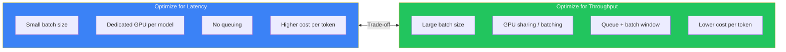
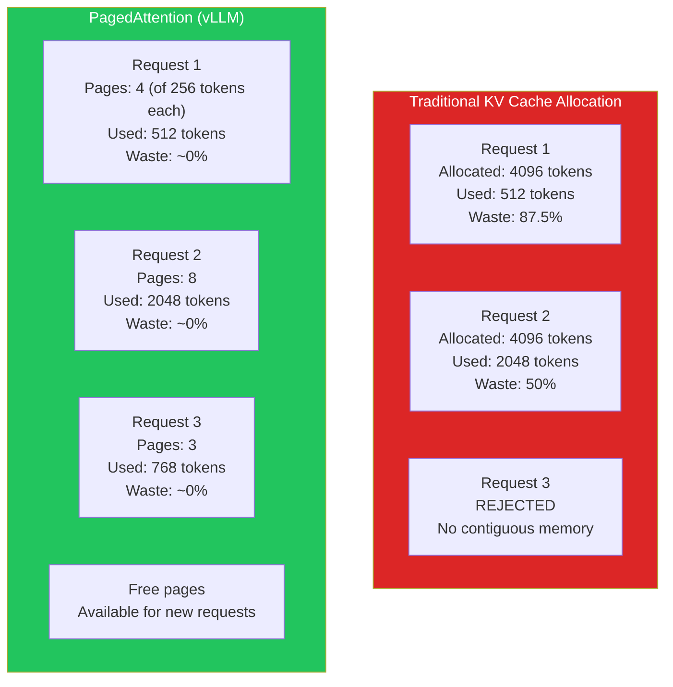
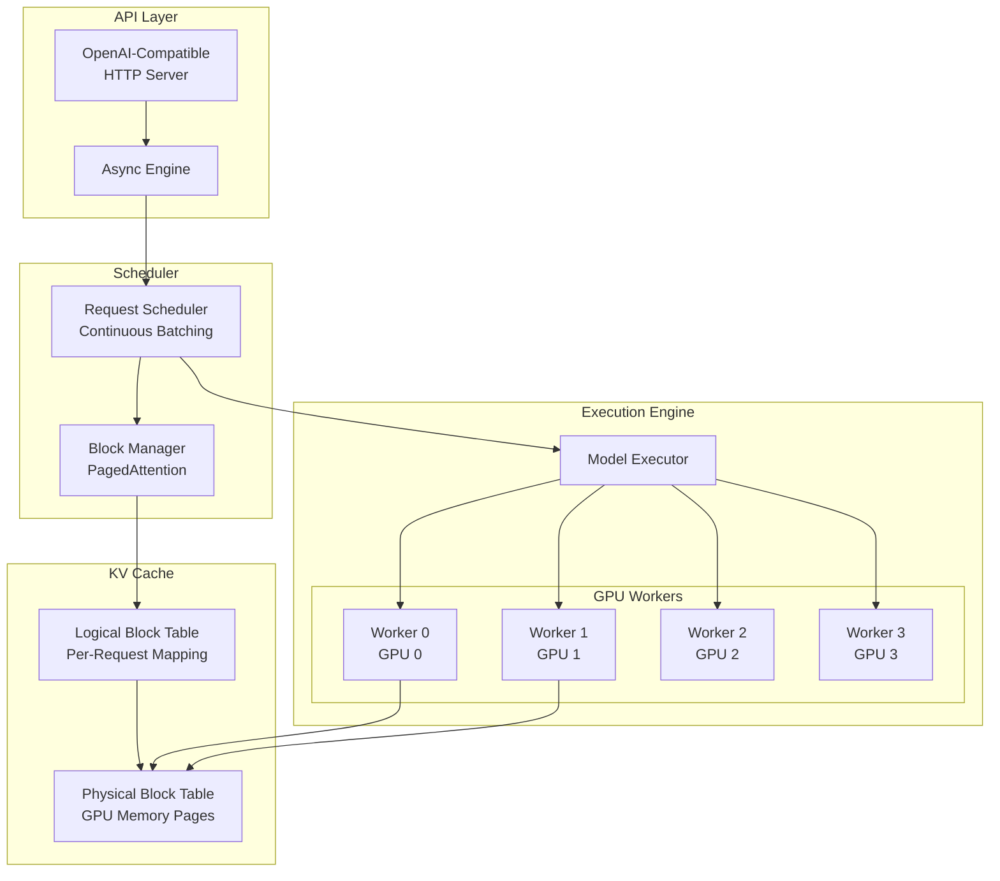
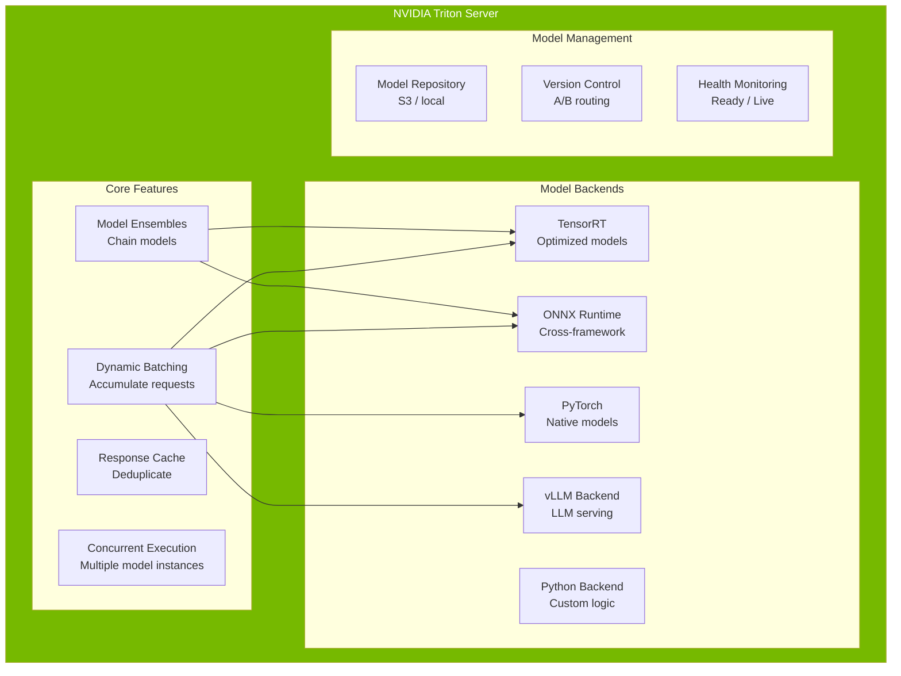
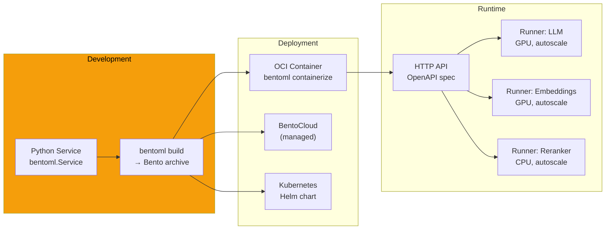
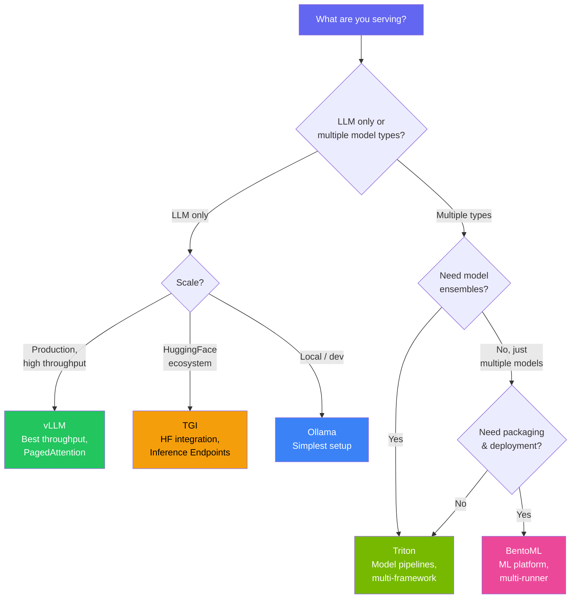

# Model Serving Deep Dive

Model serving is the discipline of running trained models in production to serve inference requests at scale. It sounds simple — load a model, pass inputs, return outputs — but production serving is a systems engineering problem that involves GPU memory management, request batching, quantization, model parallelism, caching, and continuous optimization of the latency-throughput trade-off.

The choice of serving framework determines your inference latency (how fast each request is), throughput (how many requests per second), cost efficiency (GPU utilization), and operational complexity (how much infrastructure you maintain). This page provides a deep comparison of the major frameworks, their architectures, when to use each, and production-ready configurations.

---

## The Fundamental Trade-Off: Latency vs Throughput

Every model serving decision ultimately comes down to this trade-off:



| Metric | Latency-Optimized | Throughput-Optimized |
|--------|-------------------|---------------------|
| **Batch size** | 1-4 | 32-256 |
| **Time to First Token (TTFT)** | 20-50ms | 200-2000ms |
| **Tokens/second (per GPU)** | 50-200 | 500-5000 |
| **GPU utilization** | 20-40% | 70-95% |
| **Cost per 1M tokens** | $2-10 | $0.20-1.00 |
| **Use case** | Chat, real-time | Batch processing, API |

::: tip The Right Answer Is "It Depends"
Interactive chat needs low TTFT (< 100ms). Batch document processing needs high throughput. Most production systems need both — route interactive requests to latency-optimized pools and batch requests to throughput-optimized pools.
:::

---

## Framework Comparison Overview

| Feature | vLLM | TGI | Triton | Ollama | BentoML |
|---------|------|-----|--------|--------|---------|
| **Primary focus** | LLM serving | LLM serving | General inference | Local LLM | ML platform |
| **PagedAttention** | Yes | Yes (v2) | Via vLLM backend | No | Via vLLM |
| **Continuous batching** | Yes | Yes | Yes | No | Yes |
| **Tensor parallelism** | Yes | Yes | Yes | No | Via vLLM |
| **Quantization** | GPTQ, AWQ, SqueezeLLM, FP8 | GPTQ, AWQ, EETQ | TensorRT, ONNX | GGUF (llama.cpp) | Framework-dependent |
| **OpenAI-compatible API** | Yes | Yes | No (custom) | Yes | Custom |
| **Multi-model** | No (1 model/instance) | No (1 model/instance) | Yes | Yes | Yes |
| **Streaming** | Yes (SSE) | Yes (SSE) | Yes (gRPC) | Yes (SSE) | Yes |
| **GPU requirement** | Yes | Yes | Optional | Optional (CPU/GPU) | Optional |
| **Production readiness** | High | High | Very high | Dev/small scale | High |
| **Complexity** | Low | Low | High | Very low | Medium |

---

## vLLM — The LLM Serving Standard

vLLM has become the de facto standard for LLM inference serving. Its key innovation is **PagedAttention**, which solves the GPU memory fragmentation problem that limits concurrent request handling in naive serving approaches.

### PagedAttention Explained

Traditional inference servers allocate a contiguous block of GPU memory for each request's KV cache. Since the maximum sequence length is unknown in advance, they must allocate for the worst case. This wastes 60-80% of GPU memory on reservations that are never used.

PagedAttention borrows the concept of virtual memory paging from operating systems:



**Result:** vLLM serves 2-4x more concurrent requests than naive serving with the same GPU memory.

### vLLM Architecture



### Production vLLM Configuration

```bash
# Start vLLM with production settings
python -m vllm.entrypoints.openai.api_server \
    --model meta-llama/Meta-Llama-3.1-70B-Instruct \
    --tensor-parallel-size 4 \
    --max-model-len 8192 \
    --gpu-memory-utilization 0.90 \
    --enable-prefix-caching \
    --max-num-seqs 256 \
    --max-num-batched-tokens 32768 \
    --quantization awq \
    --dtype float16 \
    --swap-space 16 \
    --disable-log-requests \
    --enforce-eager \
    --port 8000 \
    --host 0.0.0.0 \
    --api-key "${VLLM_API_KEY}"
```

### vLLM Configuration Parameters Explained

| Parameter | Default | Recommended | Why |
|-----------|---------|-------------|-----|
| `--gpu-memory-utilization` | 0.90 | 0.85-0.92 | Leave headroom for CUDA kernels; OOM crashes the server |
| `--max-model-len` | Model default | Actual max needed | Reducing from 128K to 8K saves massive KV cache memory |
| `--enable-prefix-caching` | Off | On | Reuses KV cache for shared prompt prefixes (system prompts) |
| `--max-num-seqs` | 256 | 64-512 | Concurrent sequences; higher = more throughput, more memory |
| `--max-num-batched-tokens` | 2048 | 16384-65536 | Tokens processed per iteration; higher = better GPU utilization |
| `--quantization` | None | awq/gptq | 2x memory reduction, <1% quality loss |
| `--swap-space` | 4 | 16-32 | GB of CPU memory for swapped-out KV cache blocks |
| `--enforce-eager` | Off | On for debugging | Disables CUDA graph capture; slower but easier to debug |
| `--tensor-parallel-size` | 1 | GPUs per model | Split model across GPUs; must evenly divide attention heads |

### vLLM Python Client

```python
# vllm_client.py — Production client with retry and streaming
import httpx
import asyncio
import json
from typing import AsyncIterator


class VLLMClient:
    def __init__(self, base_url: str, api_key: str):
        self.base_url = base_url.rstrip("/")
        self.api_key = api_key
        self.client = httpx.AsyncClient(
            timeout=httpx.Timeout(120.0, connect=5.0),
            limits=httpx.Limits(
                max_connections=100,
                max_keepalive_connections=20
            ),
        )

    async def generate(
        self,
        prompt: str,
        max_tokens: int = 512,
        temperature: float = 0.7,
    ) -> str:
        """Non-streaming generation."""
        response = await self.client.post(
            f"{self.base_url}/v1/completions",
            json={
                "model": "meta-llama/Meta-Llama-3.1-70B-Instruct",
                "prompt": prompt,
                "max_tokens": max_tokens,
                "temperature": temperature,
            },
            headers={"Authorization": f"Bearer {self.api_key}"},
        )
        response.raise_for_status()
        return response.json()["choices"][0]["text"]

    async def stream(
        self,
        messages: list[dict],
        max_tokens: int = 512,
        temperature: float = 0.7,
    ) -> AsyncIterator[str]:
        """Streaming generation with SSE."""
        async with self.client.stream(
            "POST",
            f"{self.base_url}/v1/chat/completions",
            json={
                "model": "meta-llama/Meta-Llama-3.1-70B-Instruct",
                "messages": messages,
                "max_tokens": max_tokens,
                "temperature": temperature,
                "stream": True,
            },
            headers={"Authorization": f"Bearer {self.api_key}"},
        ) as response:
            async for line in response.aiter_lines():
                if line.startswith("data: "):
                    data = line[6:]
                    if data == "[DONE]":
                        break
                    chunk = json.loads(data)
                    delta = chunk["choices"][0]["delta"]
                    if "content" in delta:
                        yield delta["content"]


# Usage
async def main():
    client = VLLMClient(
        base_url="http://vllm-server:8000",
        api_key="your-api-key"
    )

    # Streaming chat
    async for token in client.stream(
        messages=[
            {"role": "system", "content": "You are a helpful assistant."},
            {"role": "user", "content": "Explain PagedAttention."},
        ]
    ):
        print(token, end="", flush=True)
```

::: tip Prefix Caching Is a Superpower
If all your requests share the same system prompt (common in chatbots), `--enable-prefix-caching` lets vLLM compute the KV cache for that prefix once and reuse it across all requests. For a 2000-token system prompt, this saves ~50% of first-token latency.
:::

---

## Text Generation Inference (TGI)

TGI is Hugging Face's inference server, optimized specifically for text generation. It is the engine behind the Hugging Face Inference API and Inference Endpoints.

### TGI vs vLLM

| Dimension | TGI | vLLM |
|-----------|-----|------|
| **Throughput (tokens/s)** | High (Flash Attention 2) | Higher (PagedAttention) |
| **First-token latency** | Low | Very low |
| **Max concurrent requests** | Good | Better (PagedAttention) |
| **Model format support** | HF Transformers | HF + many custom |
| **Quantization** | GPTQ, AWQ, EETQ, bitsandbytes | GPTQ, AWQ, SqueezeLLM, FP8 |
| **Speculative decoding** | Yes | Yes |
| **Watermarking** | Yes | No |
| **Ease of deployment** | Docker-first | Docker or pip |
| **Community** | Hugging Face ecosystem | Rapidly growing OSS |

### TGI Docker Deployment

```bash
# Production TGI deployment
docker run --gpus all \
    -p 8080:80 \
    -v /data/models:/data \
    ghcr.io/huggingface/text-generation-inference:2.0 \
    --model-id meta-llama/Meta-Llama-3.1-8B-Instruct \
    --quantize awq \
    --max-input-tokens 4096 \
    --max-total-tokens 8192 \
    --max-batch-prefill-tokens 16384 \
    --max-concurrent-requests 128 \
    --max-best-of 2 \
    --waiting-served-ratio 0.3 \
    --max-waiting-tokens 20 \
    --port 80 \
    --json-output \
    --otlp-endpoint http://otel-collector:4317
```

### TGI Configuration Parameters

| Parameter | Description | Recommended |
|-----------|-------------|-------------|
| `--max-input-tokens` | Max input length | Set to actual max needed |
| `--max-total-tokens` | Max input + output | Input max + expected output |
| `--max-batch-prefill-tokens` | Prefill budget per batch | 8192-32768 |
| `--max-concurrent-requests` | Request concurrency limit | 64-256 |
| `--waiting-served-ratio` | Balance new vs waiting requests | 0.3-0.5 |
| `--max-waiting-tokens` | Max tokens generated while others wait | 10-30 |
| `--quantize` | Quantization method | awq or gptq |
| `--otlp-endpoint` | OpenTelemetry endpoint | Your OTEL collector |

---

## NVIDIA Triton Inference Server

Triton is NVIDIA's enterprise-grade inference server. Unlike vLLM and TGI which focus exclusively on LLMs, Triton serves any model type — computer vision, NLP, speech, classical ML — with optimized backends for TensorRT, PyTorch, TensorFlow, ONNX, and even vLLM.

### When Triton Wins

Triton is the right choice when you need:

- **Multiple model types** — serving embeddings, classifiers, and LLMs from a single server
- **Model ensembles** — chaining models (e.g., tokenize -> embed -> classify) in a single request
- **TensorRT optimization** — maximum inference speed for fixed-architecture models
- **Multi-framework support** — running PyTorch and ONNX models side by side
- **Enterprise features** — model versioning, A/B testing, response caching



### Triton Model Ensemble for RAG

One of Triton's unique features is model ensembles — define a DAG of models that execute as a single inference request:

```protobuf
# ensemble_rag/config.pbtxt
name: "rag_pipeline"
platform: "ensemble"
max_batch_size: 16

input [
  {
    name: "QUERY"
    data_type: TYPE_STRING
    dims: [ 1 ]
  }
]

output [
  {
    name: "RESPONSE"
    data_type: TYPE_STRING
    dims: [ 1 ]
  }
]

ensemble_scheduling {
  step [
    {
      model_name: "query_encoder"
      model_version: -1
      input_map {
        key: "text"
        value: "QUERY"
      }
      output_map {
        key: "embedding"
        value: "query_embedding"
      }
    },
    {
      model_name: "vector_search"
      model_version: -1
      input_map {
        key: "query_embedding"
        value: "query_embedding"
      }
      output_map {
        key: "documents"
        value: "retrieved_docs"
      }
    },
    {
      model_name: "reranker"
      model_version: -1
      input_map {
        key: "query"
        value: "QUERY"
        key: "documents"
        value: "retrieved_docs"
      }
      output_map {
        key: "ranked_documents"
        value: "reranked_docs"
      }
    },
    {
      model_name: "llm_generator"
      model_version: -1
      input_map {
        key: "context"
        value: "reranked_docs"
        key: "query"
        value: "QUERY"
      }
      output_map {
        key: "response"
        value: "RESPONSE"
      }
    }
  ]
}
```

### Triton Performance Tuning

```protobuf
# High-throughput embedding model configuration
name: "bge-large"
platform: "onnxruntime_onnx"
max_batch_size: 128

dynamic_batching {
  max_queue_delay_microseconds: 50000    # 50ms batch window
  preferred_batch_size: [ 32, 64, 128 ]
  default_queue_policy {
    timeout_action: REJECT
    default_timeout_microseconds: 5000000  # 5s timeout
    allow_timeout_override: true
  }
}

instance_group [
  {
    count: 4          # 4 model instances on 1 GPU
    kind: KIND_GPU
    gpus: [ 0 ]
  }
]

# Rate limiter — prevent GPU OOM
rate_limiter {
  resources [
    {
      name: "gpu_memory"
      global: true
      count: 4        # Max 4 concurrent batches across all instances
    }
  ]
}

optimization {
  execution_accelerators {
    gpu_execution_accelerator : [
      {
        name : "tensorrt"
        parameters {
          key: "precision_mode"
          value: "FP16"
        }
        parameters {
          key: "max_workspace_size_bytes"
          value: "1073741824"    # 1GB workspace
        }
      }
    ]
  }
}
```

---

## Ollama — Local Model Serving

Ollama is the simplest way to run LLMs locally. It wraps llama.cpp with a Docker-like CLI for downloading, running, and managing models. It uses GGUF quantization format, which supports CPU inference (no GPU required) and mixed CPU/GPU inference.

### When to Use Ollama

- **Local development** — test prompts without API costs
- **Edge deployment** — run models on devices without GPUs
- **Privacy-sensitive** — data never leaves the machine
- **Prototyping** — fastest path from zero to running model

### Ollama Quickstart

```bash
# Install and run
curl -fsSL https://ollama.com/install.sh | sh

# Pull and run a model
ollama pull llama3.1:8b
ollama run llama3.1:8b "Explain kubernetes GPU scheduling"

# Serve as an API (OpenAI-compatible)
ollama serve &

# API call
curl http://localhost:11434/v1/chat/completions \
  -H "Content-Type: application/json" \
  -d '{
    "model": "llama3.1:8b",
    "messages": [
      {"role": "user", "content": "Explain PagedAttention"}
    ],
    "stream": true
  }'
```

### Ollama Modelfile — Custom Models

```dockerfile
# Modelfile — Custom model with system prompt and parameters
FROM llama3.1:8b

PARAMETER temperature 0.3
PARAMETER top_p 0.9
PARAMETER num_ctx 8192
PARAMETER repeat_penalty 1.1

SYSTEM """You are a senior infrastructure engineer specializing in
Kubernetes and GPU workloads. Answer concisely with production-ready
code examples. Always mention potential failure modes."""

TEMPLATE """{{ if .System }}<|begin_of_text|><|start_header_id|>system<|end_header_id|>

{​{ .System }}<|eot_id|>{{ end }}{{ if .Prompt }}<|start_header_id|>user<|end_header_id|>

{​{ .Prompt }}<|eot_id|>{{ end }}<|start_header_id|>assistant<|end_header_id|>

{​{ .Response }}<|eot_id|>"""
```

::: warning Ollama Is Not for Production Serving
Ollama lacks continuous batching, tensor parallelism, and PagedAttention. At more than a few concurrent requests, it becomes a bottleneck. Use it for development and prototyping, then deploy with vLLM or TGI for production.
:::

---

## BentoML — ML Platform Framework

BentoML is a framework for building, shipping, and scaling ML services. It is not a model serving engine (it delegates to vLLM, Triton, or custom code) — it is the **packaging and deployment layer** that turns a model into a production service with APIs, containerization, and scaling.

### BentoML Architecture



### BentoML Service Definition

```python
# service.py — Multi-model BentoML service
import bentoml
from bentoml.io import JSON, Text


# Define runners (model execution units)
llm_runner = bentoml.models.get("vllm-llama3-8b:latest").to_runner(
    name="llm",
    runnable_init_params={
        "tensor_parallel_size": 1,
        "gpu_memory_utilization": 0.85,
        "max_model_len": 8192,
    },
)

embedding_runner = bentoml.models.get("bge-large:latest").to_runner(
    name="embedding",
    runnable_init_params={
        "device": "cuda",
        "batch_size": 64,
    },
)

svc = bentoml.Service(
    "ai-inference-service",
    runners=[llm_runner, embedding_runner],
)


@svc.api(
    input=JSON(),
    output=JSON(),
    route="/v1/chat/completions",
)
async def chat(input_data: dict) -> dict:
    """OpenAI-compatible chat endpoint."""
    messages = input_data.get("messages", [])
    max_tokens = input_data.get("max_tokens", 512)
    temperature = input_data.get("temperature", 0.7)

    result = await llm_runner.generate.async_run(
        messages=messages,
        max_tokens=max_tokens,
        temperature=temperature,
    )

    return {
        "choices": [{
            "message": {
                "role": "assistant",
                "content": result.text,
            },
            "finish_reason": result.finish_reason,
        }],
        "usage": {
            "prompt_tokens": result.prompt_tokens,
            "completion_tokens": result.completion_tokens,
        },
    }


@svc.api(
    input=JSON(),
    output=JSON(),
    route="/v1/embeddings",
)
async def embed(input_data: dict) -> dict:
    """Embedding endpoint."""
    texts = input_data.get("input", [])
    embeddings = await embedding_runner.encode.async_run(texts)

    return {
        "data": [
            {"embedding": emb.tolist(), "index": i}
            for i, emb in enumerate(embeddings)
        ],
        "model": "bge-large-en-v1.5",
    }
```

```yaml
# bentofile.yaml — Build configuration
service: "service:svc"
labels:
  team: ai-platform
  environment: production
include:
  - "*.py"
  - "requirements.txt"
python:
  packages:
    - vllm==0.5.0
    - sentence-transformers==3.0.0
    - torch==2.3.0
docker:
  base_image: "nvidia/cuda:12.4.0-runtime-ubuntu22.04"
  env:
    BENTOML_PORT: "3000"
    CUDA_VISIBLE_DEVICES: "0"
```

---

## Performance Benchmarking

### Benchmark Setup

To compare frameworks fairly, test with consistent parameters:

```python
# benchmark.py — Standardized inference benchmark
import asyncio
import time
import httpx
import statistics
from dataclasses import dataclass


@dataclass
class BenchmarkResult:
    framework: str
    total_requests: int
    concurrency: int
    avg_ttft_ms: float
    p50_ttft_ms: float
    p99_ttft_ms: float
    avg_tps: float          # tokens per second
    total_throughput_tps: float
    gpu_utilization_pct: float


async def benchmark_endpoint(
    url: str,
    prompt: str,
    num_requests: int = 100,
    concurrency: int = 16,
    max_tokens: int = 256,
) -> BenchmarkResult:
    """Run benchmark against an inference endpoint."""

    semaphore = asyncio.Semaphore(concurrency)
    ttft_times = []
    tps_values = []

    async def single_request(client: httpx.AsyncClient):
        async with semaphore:
            start = time.perf_counter()
            first_token_time = None
            token_count = 0

            async with client.stream(
                "POST",
                url,
                json={
                    "model": "test-model",
                    "messages": [{"role": "user", "content": prompt}],
                    "max_tokens": max_tokens,
                    "temperature": 0.7,
                    "stream": True,
                },
            ) as response:
                async for line in response.aiter_lines():
                    if line.startswith("data: ") and line != "data: [DONE]":
                        if first_token_time is None:
                            first_token_time = time.perf_counter()
                        token_count += 1

            end = time.perf_counter()

            if first_token_time:
                ttft_ms = (first_token_time - start) * 1000
                total_time = end - start
                tps = token_count / total_time if total_time > 0 else 0
                ttft_times.append(ttft_ms)
                tps_values.append(tps)

    async with httpx.AsyncClient(timeout=120.0) as client:
        tasks = [single_request(client) for _ in range(num_requests)]
        await asyncio.gather(*tasks)

    ttft_sorted = sorted(ttft_times)

    return BenchmarkResult(
        framework="test",
        total_requests=num_requests,
        concurrency=concurrency,
        avg_ttft_ms=statistics.mean(ttft_times),
        p50_ttft_ms=ttft_sorted[len(ttft_sorted) // 2],
        p99_ttft_ms=ttft_sorted[int(len(ttft_sorted) * 0.99)],
        avg_tps=statistics.mean(tps_values),
        total_throughput_tps=sum(tps_values),
        gpu_utilization_pct=0,  # Read from DCGM
    )
```

### Benchmark Results (Llama 3 8B, A100 80GB)

| Metric | vLLM | TGI | Triton (vLLM backend) | Ollama |
|--------|------|-----|-----------------------|--------|
| **TTFT p50 (ms)** | 28 | 35 | 32 | 85 |
| **TTFT p99 (ms)** | 95 | 120 | 105 | 450 |
| **Tokens/sec (single request)** | 145 | 138 | 140 | 92 |
| **Tokens/sec (64 concurrent)** | 4200 | 3800 | 4100 | 180 |
| **Max concurrent requests** | 512 | 256 | 512 | 8 |
| **GPU utilization at peak** | 92% | 88% | 90% | 45% |
| **Memory efficiency** | 95% | 88% | 93% | 60% |

::: tip These Numbers Are Approximate
Benchmark results vary significantly with model architecture, quantization, input/output length, and hardware. Always benchmark with your specific workload. The relative ordering (vLLM > TGI > Triton > Ollama for LLM throughput) is consistent across benchmarks.
:::

---

## Decision Framework



### Quick Decision Matrix

| If you need... | Use... | Because... |
|----------------|--------|-----------|
| Maximum LLM throughput | **vLLM** | PagedAttention, continuous batching |
| HuggingFace integration | **TGI** | Native HF model support, Inference Endpoints |
| Multiple model types | **Triton** | Multi-framework, model ensembles |
| Local development | **Ollama** | One command to run any model |
| ML platform features | **BentoML** | Packaging, versioning, multi-runner |
| Enterprise / NVIDIA support | **Triton** | NVIDIA enterprise license, support |
| OpenAI-compatible API | **vLLM** or **TGI** | Drop-in replacement for OpenAI calls |

---

## Production Serving Checklist

| Category | Item | Why |
|----------|------|-----|
| **Memory** | Set `gpu-memory-utilization` to 0.85-0.90 | Leave headroom for CUDA ops |
| **Memory** | Configure `max-model-len` to actual max | Do not waste KV cache on unused context |
| **Batching** | Enable continuous batching | 2-4x throughput improvement |
| **Batching** | Tune batch window (50-200ms) | Balance latency vs throughput |
| **Quantization** | Use AWQ or GPTQ for production | 2x memory reduction, <1% quality loss |
| **Caching** | Enable prefix caching | Reuse KV cache for shared system prompts |
| **Health** | Configure readiness + liveness probes | Separate model-ready from process-alive |
| **Health** | Set generous startup timeouts | Model loading takes 1-5 minutes |
| **Observability** | Export Prometheus metrics | Tokens/sec, TTFT, queue depth, GPU util |
| **Security** | Set API key authentication | Prevent unauthorized access |
| **Networking** | Use gRPC for internal, HTTP for external | gRPC is 2-5x faster for internal calls |

---

## Key Takeaways

1. **vLLM is the default choice for LLM serving.** PagedAttention gives it the best memory efficiency and throughput. Start here unless you have a specific reason not to.

2. **Triton is the right choice for multi-model serving.** If you serve embeddings, classifiers, and LLMs together, Triton's model ensembles and multi-framework support are unmatched.

3. **Quantization is mandatory for production.** AWQ or GPTQ reduces memory by 2x with negligible quality loss. Never serve unquantized models in production.

4. **Prefix caching is free performance.** If your requests share system prompts, enabling prefix caching reduces TTFT by 30-50% with zero quality impact.

5. **Benchmark with your actual workload.** Published benchmarks use synthetic prompts. Your real traffic has different input/output distributions, concurrency patterns, and latency requirements.

### Related Pages

- [AI Infrastructure Overview](/infrastructure/ai-infrastructure/) — GPU selection, Terraform provisioning, cost optimization
- [GPU Kubernetes](/infrastructure/ai-infrastructure/gpu-kubernetes) — KServe, device plugin, autoscaling on K8s
- [AI in Production](/ai-ml-engineering/ai-in-production) — Application-level production AI patterns
- [RAG Architecture](/ai-ml-engineering/rag-architecture) — Retrieval-Augmented Generation pipelines
