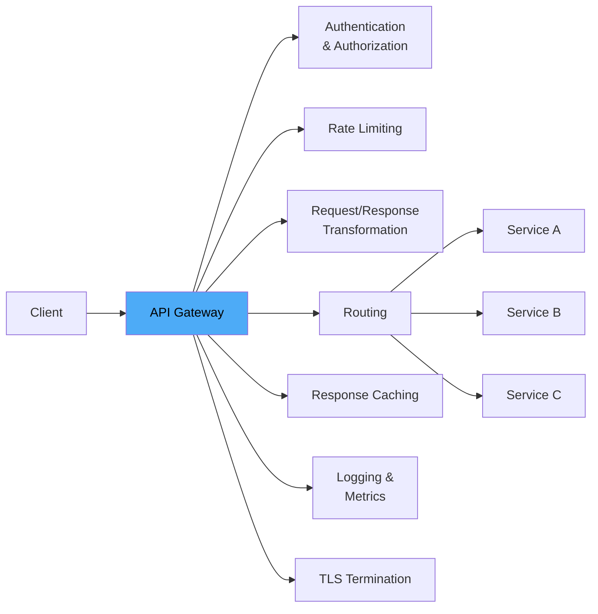
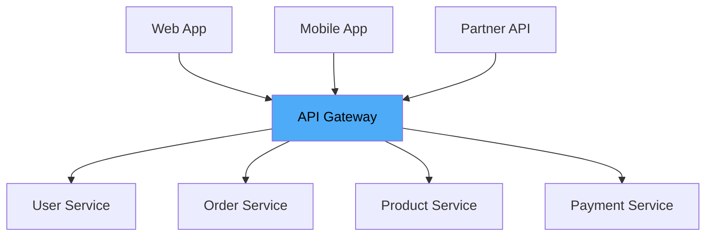
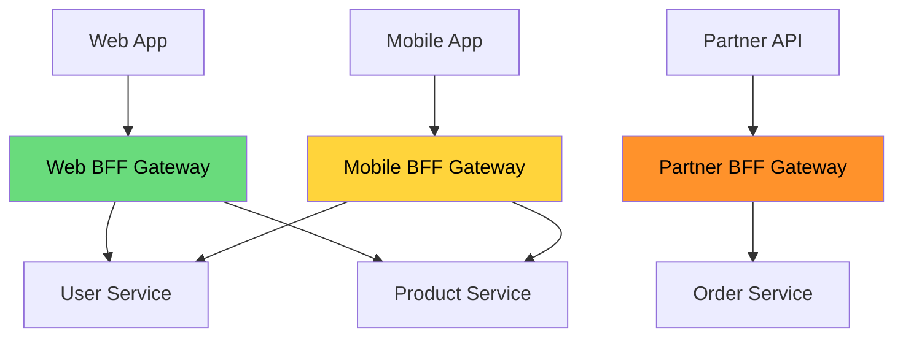
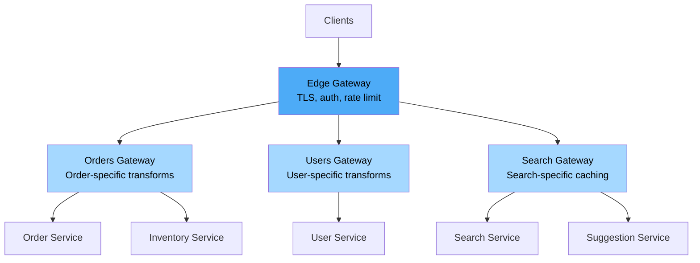
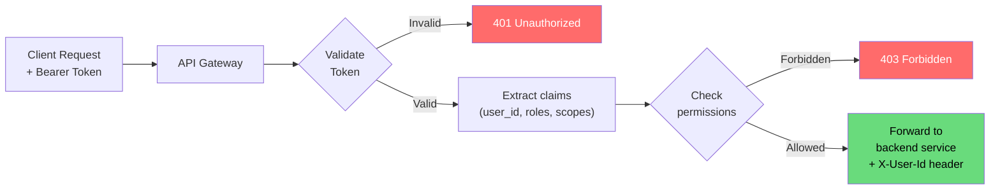
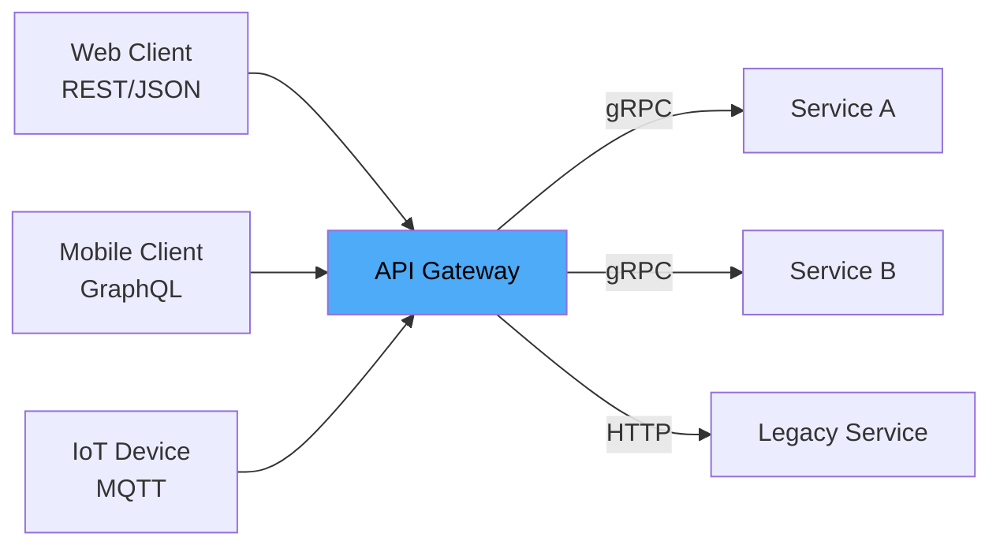
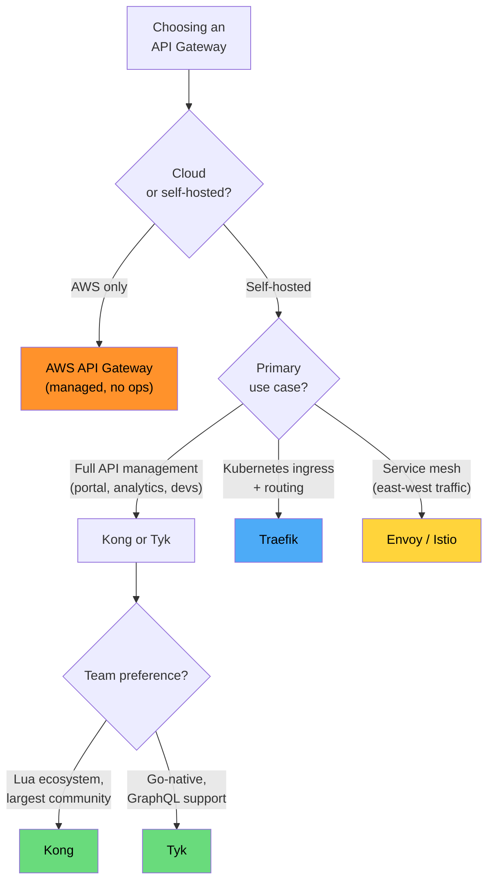
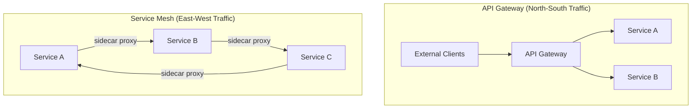

# API Gateway Deep Dive

An API gateway is the single entry point for all client requests into your microservices architecture. Instead of every client knowing the addresses and protocols of every backend service, clients talk to one endpoint — the gateway — which handles authentication, rate limiting, routing, transformation, and observability before forwarding the request to the right service.

Think of it as the front desk of a hotel: guests do not wander the building looking for housekeeping, room service, and the concierge. They talk to the front desk, which routes their requests.

---

## What an API Gateway Does



### Core Responsibilities

| Responsibility | What It Does | Why at the Gateway |
|---------------|-------------|-------------------|
| **Routing** | Forward requests to the correct backend service | Clients need a stable entry point |
| **Authentication** | Validate JWT tokens, API keys, OAuth tokens | Centralized auth avoids duplicating logic in every service |
| **Rate limiting** | Throttle requests per client/IP/API key | Protect backends from abuse and overload |
| **TLS termination** | Handle HTTPS, present certificates | Services communicate via plain HTTP internally |
| **Request transformation** | Header injection, body transformation, protocol translation | Adapt client format to backend format |
| **Response transformation** | Strip internal fields, aggregate responses | Return clean API responses |
| **Load balancing** | Distribute across service instances | Built-in or delegated to service mesh |
| **Circuit breaking** | Stop forwarding to failing services | Prevent cascade failures |
| **Caching** | Cache GET responses | Reduce backend load for repeated queries |
| **Observability** | Access logs, metrics, distributed tracing | Single point for request-level visibility |

---

## Architecture Patterns

### Single Gateway (Monolithic)

The simplest approach — one gateway handles all traffic:



**Pros:** Simple, centralized policy, easy to reason about
**Cons:** Single point of failure, one team owns everything, all traffic through one hop

### Backend for Frontend (BFF) Pattern

Each client type gets its own gateway that tailors the API to its needs:



**Use when:**
- Mobile needs different data shapes than web
- Partner API has different auth requirements
- Different rate limits per client type
- Teams want autonomy over their API surface

### Two-Tier Gateway

An edge gateway handles cross-cutting concerns, while per-service gateways handle service-specific logic:



---

## Gateway Features Deep Dive

### Authentication and Authorization



```yaml
# Kong declarative config: JWT authentication
services:
  - name: orders-service
    url: http://orders:8080
    routes:
      - name: orders-route
        paths:
          - /api/v1/orders
        plugins:
          - name: jwt
            config:
              claims_to_verify:
                - exp
              header_names:
                - Authorization
          - name: acl
            config:
              allow:
                - orders-read
                - orders-write
```

### Rate Limiting Strategies

| Strategy | How It Works | Best For |
|----------|-------------|----------|
| **Fixed window** | Count requests per time window (e.g., 100/minute) | Simple, but allows bursts at window boundaries |
| **Sliding window log** | Track timestamp of each request | Accurate, but memory-intensive |
| **Sliding window counter** | Weighted combination of current + previous window | Good balance of accuracy and efficiency |
| **Token bucket** | Tokens refill at fixed rate, each request costs a token | Allows controlled bursts |
| **Leaky bucket** | Requests queue and drain at fixed rate | Smooth output rate |

```yaml
# Kong rate limiting plugin
plugins:
  - name: rate-limiting
    config:
      minute: 100              # 100 requests per minute
      hour: 5000               # 5000 requests per hour
      policy: redis             # Distributed counter in Redis
      redis_host: redis
      redis_port: 6379
      limit_by: credential     # Per API key
      hide_client_headers: false
      # Response headers:
      # X-RateLimit-Limit-Minute: 100
      # X-RateLimit-Remaining-Minute: 73
```

::: tip
For distributed rate limiting (multiple gateway instances), use Redis or a shared counter. Local in-memory counters are fast but inaccurate when you have multiple gateway pods. See [Rate Limiter design](/system-design-interviews/rate-limiter) for the full system design.
:::

### Request Transformation

Transform requests and responses at the gateway to decouple client and backend formats:

```yaml
# Kong request transformer
plugins:
  - name: request-transformer
    config:
      add:
        headers:
          - "X-Request-Source: api-gateway"
          - "X-Forwarded-Proto: https"
        querystring:
          - "version: v2"
      remove:
        headers:
          - "X-Internal-Debug"
      rename:
        headers:
          - "X-Custom-Auth: Authorization"
      replace:
        body:
          - "user_name: username"  # Rename field

  - name: response-transformer
    config:
      remove:
        headers:
          - "X-Powered-By"
          - "Server"
        json:
          - "internal_id"         # Strip internal field from response
          - "debug_info"
```

### Protocol Translation



The gateway can translate between protocols:
- **REST to gRPC** — clients send JSON, gateway translates to protobuf
- **GraphQL to REST** — gateway resolves GraphQL queries by calling multiple REST services
- **HTTP/1.1 to HTTP/2** — clients on old HTTP, backends on modern HTTP/2
- **WebSocket upgrade** — gateway handles the upgrade handshake

---

## Gateway Comparison

### Feature Matrix

| Feature | Kong | AWS API GW | Tyk | Traefik | Envoy/Istio |
|---------|------|-----------|-----|---------|-------------|
| **Type** | Full API gateway | Managed service | Full API gateway | Reverse proxy + API | Service proxy |
| **Deployment** | Self-hosted / Cloud | AWS only | Self-hosted / Cloud | Self-hosted | Self-hosted (mesh) |
| **Language** | Lua + Nginx (OpenResty) | Managed | Go | Go | C++ |
| **Plugin system** | Lua, Go, Python, JS | Lambda authorizers | Go, Python, JS, gRPC | Middleware (Go) | Wasm, Lua, C++ |
| **Admin API** | REST API + declarative YAML | Console + CloudFormation | REST API + Dashboard | File / Kubernetes CRD | xDS API |
| **Rate limiting** | Built-in (Redis) | Built-in (per stage) | Built-in (Redis) | Via middleware | Built-in |
| **Auth (JWT)** | Built-in | Cognito authorizer | Built-in | Via middleware | Built-in |
| **gRPC support** | Yes | Yes (HTTP/2) | Yes | Yes | Native |
| **WebSocket** | Yes | Yes | Yes | Yes | Yes |
| **Kubernetes native** | Kong Ingress Controller | N/A | Tyk Operator | Ingress/CRD native | Istio/Envoy sidecar |
| **Cost** | Free (OSS) / Enterprise | Pay-per-request | Free (OSS) / Enterprise | Free (OSS) / Enterprise | Free (OSS) |

### When to Choose Each



### Kong

```yaml
# kong.yml — declarative configuration
_format_version: "3.0"

services:
  - name: user-service
    url: http://users.internal:8080
    connect_timeout: 5000
    read_timeout: 30000
    routes:
      - name: users-api
        paths:
          - /api/v1/users
        methods:
          - GET
          - POST
          - PUT
        strip_path: false
    plugins:
      - name: jwt
      - name: rate-limiting
        config:
          minute: 60
          policy: redis
          redis_host: redis
      - name: prometheus
      - name: cors
        config:
          origins:
            - "https://app.example.com"
          methods:
            - GET
            - POST
          headers:
            - Authorization
            - Content-Type
```

### Traefik (Kubernetes)

```yaml
# Traefik IngressRoute (CRD)
apiVersion: traefik.io/v1alpha1
kind: IngressRoute
metadata:
  name: api-routes
spec:
  entryPoints:
    - websecure
  routes:
    - match: Host(`api.example.com`) && PathPrefix(`/users`)
      kind: Rule
      services:
        - name: user-service
          port: 8080
      middlewares:
        - name: rate-limit
        - name: jwt-auth
        - name: strip-prefix

    - match: Host(`api.example.com`) && PathPrefix(`/orders`)
      kind: Rule
      services:
        - name: order-service
          port: 8080
      middlewares:
        - name: rate-limit
        - name: jwt-auth

---
apiVersion: traefik.io/v1alpha1
kind: Middleware
metadata:
  name: rate-limit
spec:
  rateLimit:
    average: 100
    burst: 200
    period: 1m

---
apiVersion: traefik.io/v1alpha1
kind: Middleware
metadata:
  name: jwt-auth
spec:
  forwardAuth:
    address: http://auth-service:8080/verify
    trustForwardHeader: true
    authResponseHeaders:
      - X-User-Id
      - X-User-Role
```

---

## API Gateway vs Service Mesh

This is one of the most confusing architectural decisions. They solve overlapping but different problems:



| Aspect | API Gateway | Service Mesh |
|--------|-----------|-------------|
| **Traffic direction** | North-south (external → internal) | East-west (service → service) |
| **Primary user** | External clients, partners | Internal microservices |
| **Authentication** | API keys, JWT, OAuth | mTLS (mutual TLS) |
| **Rate limiting** | Per-client, per-API key | Per-service, per-endpoint |
| **Routing** | URL path → service | Service name → instances |
| **Deployment** | Centralized proxy | Distributed sidecar per pod |
| **Examples** | Kong, Tyk, AWS API GW | Istio, Linkerd, Consul Connect |
| **Overhead** | Single hop | Per-hop sidecar (~1ms per hop) |

::: tip
You often need both. Use an API gateway for external traffic (authentication, rate limiting, API management) and a service mesh for internal traffic (mTLS, observability, traffic shaping between services). They are complementary, not competing.
:::

---

## Common Anti-Patterns

### 1. Business Logic in the Gateway

```
WRONG: Gateway computes order totals, validates business rules
RIGHT: Gateway authenticates, rate limits, routes — services own business logic
```

The gateway should be a thin infrastructure layer. Putting business logic there creates a coupling bottleneck and makes the gateway a deployment dependency for every team.

### 2. Gateway as the Only Load Balancer

The gateway should route to service endpoints, not individual instances. Let Kubernetes services, internal load balancers, or the service mesh handle instance-level load balancing.

### 3. Unbounded Request Buffering

```yaml
# Set reasonable limits
services:
  - name: upload-service
    plugins:
      - name: request-size-limiting
        config:
          allowed_payload_size: 10  # MB
          require_content_length: true
```

### 4. No Timeout Configuration

::: danger
Default timeouts in most gateways are 60 seconds. If a backend hangs, the gateway holds the connection open, consuming resources. Always configure aggressive timeouts:
- Connect timeout: 3-5 seconds
- Read timeout: 10-30 seconds (adjust per endpoint)
- Write timeout: 10-30 seconds
:::

### 5. Single Gateway for All Environments

Development, staging, and production should not share a gateway. Configuration changes in staging could affect production routing.

---

## Operational Best Practices

### Health Checks

```yaml
# Kong upstream health checks
upstreams:
  - name: user-service
    targets:
      - target: users-1:8080
        weight: 100
      - target: users-2:8080
        weight: 100
    healthchecks:
      active:
        http_path: /health
        healthy:
          interval: 5
          successes: 2
        unhealthy:
          interval: 5
          http_failures: 3
          timeouts: 3
      passive:
        healthy:
          successes: 5
        unhealthy:
          http_failures: 5
          timeouts: 3
```

### Key Metrics to Monitor

| Metric | Target | Alert On |
|--------|--------|----------|
| **Request rate** | Baseline | > 2x baseline (DDoS or traffic spike) |
| **Error rate (5xx)** | < 0.1% | > 1% |
| **Latency P99** | < 200 ms (gateway overhead) | > 500 ms |
| **Backend health** | All healthy | Any backend unhealthy |
| **Rate limit hits** | < 5% of total | > 20% (legitimate clients being throttled) |
| **Auth failures** | < 1% | > 10% (credential leak, brute force) |
| **Connection pool utilization** | < 70% | > 90% |

---

## Key Takeaways

1. **Start with a single gateway** — add BFF pattern or two-tier only when the single gateway becomes a bottleneck for team velocity
2. **Keep the gateway thin** — authentication, rate limiting, routing, and observability belong here; business logic does not
3. **Gateway vs service mesh** — gateways handle north-south (external) traffic; service meshes handle east-west (internal) traffic; you often need both
4. **Kong for full API management** — largest plugin ecosystem, mature, flexible
5. **Traefik for Kubernetes-native** — auto-discovers services, CRD-based configuration, zero-config TLS with Let's Encrypt
6. **AWS API Gateway for serverless** — no infrastructure to manage, pay per request, integrates with Lambda
7. **Always configure timeouts** — default 60-second timeouts cause cascading failures under load
8. **Distributed rate limiting needs Redis** — in-memory counters are inaccurate across multiple gateway instances
