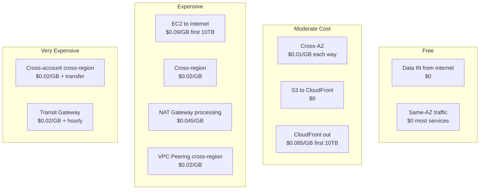
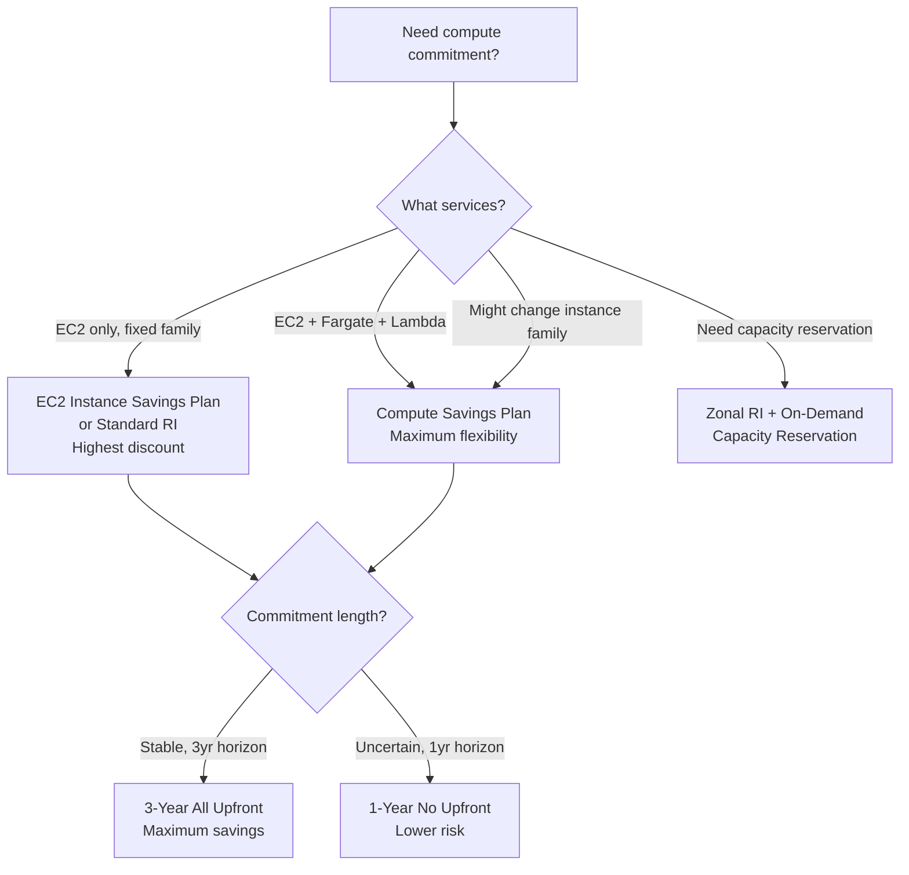
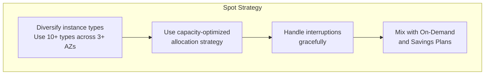
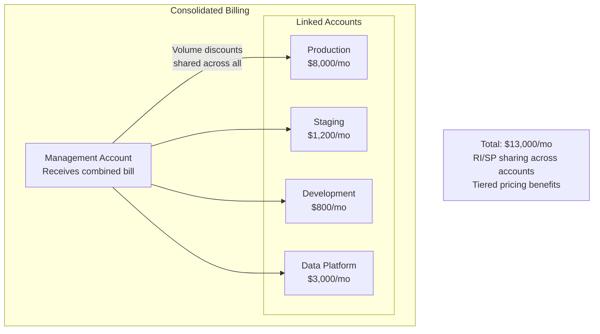

# AWS Cost Optimization

The average enterprise wastes 30-35% of its cloud spend. AWS bills are complex by design — thousands of line items across dozens of services, each with multiple pricing dimensions (compute hours, storage GB, data transfer GB, API calls, provisioned capacity). Without deliberate cost management, your bill grows faster than your business.

This guide covers every major cost optimization lever, from purchasing commitments through architectural changes.

---

## 1. Why Cost Optimization Matters: The Problem

### The Cloud Cost Trap

On-premises infrastructure had a natural brake on spending: procurement cycles. Buying new servers took weeks. In the cloud, an engineer can launch $10,000/month of infrastructure with a single Terraform apply. The ease of provisioning creates a paradox: cloud is cheaper per unit but more expensive in aggregate because consumption is unbounded.

### The Three Pillars of Cloud Cost

$$\text{Total Cost} = \text{Unit Price} \times \text{Quantity} \times \text{Duration}$$

Every optimization targets one of these:
1. **Unit Price** — Commitments (Reserved Instances, Savings Plans), negotiated pricing
2. **Quantity** — Right-sizing, eliminating waste, architectural efficiency
3. **Duration** — Auto-scaling, scheduling, ephemeral environments

---

## 2. Understanding Your AWS Bill

### Cost Dimensions by Service

| Service | Primary Cost Driver | Secondary Cost Driver | Hidden Costs |
|---------|-------------------|-----------------------|-------------|
| EC2 | Instance hours | EBS volumes | Data transfer, EBS snapshots |
| RDS | Instance hours | Storage | Data transfer, backups beyond free tier |
| S3 | Storage (GB/month) | API requests | Data transfer out, lifecycle misconfig |
| Lambda | Invocations + duration | Provisioned concurrency | Data transfer, CloudWatch Logs |
| ECS/Fargate | vCPU + memory hours | — | Data transfer, load balancer |
| CloudFront | Data transfer out | HTTP requests | Origin fetch, SSL certs |
| NAT Gateway | Data processed | Hourly charge | Cross-AZ data transfer |
| DynamoDB | RCU/WCU or on-demand | Storage | Streams, backups, DAX |
| ElastiCache | Node hours | — | Data transfer, snapshots |

### The Data Transfer Cost Iceberg

Data transfer is the most commonly overlooked cost. AWS charges for:



### Real-World Example: NAT Gateway Cost Explosion

::: info War Story
A startup ran 50 ECS tasks in private subnets that pulled container images from ECR and logged to CloudWatch Logs — both through NAT Gateway. Each task pulled a 500MB image at startup, and across daily deployments and autoscaling, they were processing ~2TB/month through NAT Gateway. At $0.045/GB, that was $90/month just for NAT — more than the compute cost.

The fix was threefold:
1. **VPC Endpoints** for ECR and CloudWatch ($7.20/month each for Interface Endpoints vs. $90 for NAT)
2. **S3 Gateway Endpoint** (free) for ECR image layers (stored in S3)
3. **Smaller container images** (multi-stage builds reduced image from 500MB to 80MB)

Monthly NAT cost dropped from $90 to $8.
:::

---

## 3. Reserved Instances (RIs)

### How Reserved Instances Work

An RI is a commitment to use a specific instance type (or family) in a specific region for 1 or 3 years. In exchange, you get a discount of 30-72% compared to On-Demand.

### RI Types

| RI Type | Flexibility | Discount | When to Use |
|---------|-----------|----------|-------------|
| Standard RI | Fixed instance type, AZ | 40-72% | Predictable, stable workloads |
| Convertible RI | Can change instance type/family | 30-54% | Need flexibility to change sizes |
| Scheduled RI | Fixed time windows | ~5-10% | Deprecated as of 2024 |

### RI Payment Options

| Payment | 1-Year Discount | 3-Year Discount | Cash Flow Impact |
|---------|----------------|-----------------|-----------------|
| All Upfront | 40% | 62% | High (pay now) |
| Partial Upfront | 35% | 56% | Medium |
| No Upfront | 30% | 50% | Low (monthly payments) |

### The RI Coverage Formula

$$\text{RI Savings} = \text{On-Demand Cost} \times \text{RI Coverage} \times \text{Discount Rate}$$

For a workload running $10,000/month in On-Demand EC2:

$$\text{Savings}_{1yr,AllUpfront} = \$10{,}000 \times 1.0 \times 0.40 = \$4{,}000/\text{month}$$

$$\text{Annual Savings} = \$48{,}000$$

### RI Scope: Regional vs. Zonal

| Feature | Regional RI | Zonal (AZ-specific) RI |
|---------|------------|----------------------|
| AZ flexibility | Yes — applies to any AZ in region | No — specific AZ only |
| Instance size flexibility | Yes (within family, Linux only) | No — exact size only |
| Capacity reservation | No | Yes — guaranteed capacity |

::: tip
Always buy **Regional RIs** unless you specifically need capacity reservations. Regional RIs automatically apply to the cheapest matching usage across all AZs, and they flex across instance sizes within the family (e.g., an `m5.2xlarge` RI covers two `m5.xlarge` instances).
:::

### RI Marketplace

You can sell unused RIs on the AWS Marketplace:
- Only Standard RIs (not Convertible)
- Minimum 1 month remaining
- AWS takes a 12% fee
- Buyer gets the remaining term at a custom price

---

## 4. Savings Plans

### Why Savings Plans Replaced RIs for Most Use Cases

Savings Plans (launched November 2019) offer the same discounts as RIs but with more flexibility. Instead of committing to a specific instance type, you commit to a **dollar amount per hour** of compute usage.

### Savings Plan Types

| Type | Flexibility | Discount | Applies To |
|------|-----------|----------|-----------|
| **Compute** | Any instance family, region, OS, tenancy | 20-66% | EC2, Fargate, Lambda |
| **EC2 Instance** | Specific instance family + region | 30-72% | EC2 only |
| **SageMaker** | SageMaker instance families | Up to 64% | SageMaker only |

### Decision Framework: RI vs. Savings Plan



### Optimal Savings Plan Coverage

Do not commit 100% of your usage. The optimal coverage follows:

$$\text{Optimal Commitment} = P_{base} \times (1 - \text{Buffer})$$

Where $P_{base}$ is your **baseline** (minimum) hourly spend and Buffer is typically 10-20%:

| Scenario | Recommended Coverage | Why |
|----------|---------------------|-----|
| Stable production | 80-90% of baseline | Small buffer for optimization |
| Growing startup | 60-70% of baseline | Leave room for architecture changes |
| Seasonal workload | 50-60% of minimum | Large on-demand portion for peaks |

### Calculating the Break-Even Point

For a 1-year No Upfront Compute Savings Plan at 30% discount:

$$\text{Break-Even Utilization} = \frac{1}{1 + \text{Discount}} = \frac{1}{1.3} = 76.9\%$$

If your committed spend is utilized more than 76.9% of the time, the Savings Plan saves money. Below that, you overpaid.

---

## 5. Spot Instances

### How Spot Works

Spot Instances are spare EC2 capacity that AWS sells at up to 90% discount. The catch: AWS can reclaim them with a **2-minute warning** when capacity is needed.

### Spot Pricing Model

Spot pricing is now relatively stable (unlike the old auction model). Prices vary by:
- Instance type
- Availability Zone
- Time of day/week

$$\text{Spot Savings} = 1 - \frac{\text{Spot Price}}{\text{On-Demand Price}}$$

Typical savings by instance family:

| Instance Family | Typical Spot Discount | Interruption Frequency |
|----------------|----------------------|----------------------|
| m5/m6i (general) | 60-70% | Low (2-5%) |
| c5/c6i (compute) | 60-75% | Low (2-5%) |
| r5/r6i (memory) | 55-70% | Moderate (5-10%) |
| g4/g5 (GPU) | 50-70% | High (10-20%) |
| p3/p4 (GPU training) | 60-80% | High (10-20%) |

### Spot Best Practices



### Spot Fleet Configuration (Terraform)

```hcl
resource "aws_ec2_fleet" "worker_fleet" {
  type = "maintain"

  target_capacity_specification {
    default_target_capacity_type = "spot"
    total_target_capacity        = 20
    on_demand_target_capacity    = 4  # 20% On-Demand baseline
    spot_target_capacity         = 16
  }

  spot_options {
    allocation_strategy                 = "capacity-optimized"
    instance_interruption_behavior      = "terminate"
    maintenance_strategies {
      capacity_rebalance {
        replacement_strategy = "launch-before-terminate"
        termination_delay    = 120
      }
    }
  }

  launch_template_config {
    launch_template_specification {
      launch_template_id = aws_launch_template.worker.id
      version            = "$Latest"
    }

    # Diversify across instance types
    override { instance_type = "m5.xlarge" }
    override { instance_type = "m5a.xlarge" }
    override { instance_type = "m5d.xlarge" }
    override { instance_type = "m6i.xlarge" }
    override { instance_type = "m6a.xlarge" }
    override { instance_type = "c5.xlarge" }
    override { instance_type = "c5a.xlarge" }
    override { instance_type = "c6i.xlarge" }
    override { instance_type = "r5.xlarge" }
    override { instance_type = "r5a.xlarge" }
  }
}
```

### Handling Spot Interruptions

```typescript
// spot-interruption-handler.ts
import { EventBridgeEvent } from 'aws-lambda';

interface SpotInterruptionDetail {
  'instance-id': string;
  'instance-action': 'terminate' | 'stop' | 'hibernate';
}

export const handler = async (
  event: EventBridgeEvent<'EC2 Spot Instance Interruption Warning', SpotInterruptionDetail>,
): Promise<void> => {
  const instanceId = event.detail['instance-id'];
  const action = event.detail['instance-action'];

  console.log(`Spot interruption: ${instanceId} will be ${action} in ~2 minutes`);

  // 1. Drain the instance from the load balancer
  await deregisterFromTargetGroup(instanceId);

  // 2. Signal the application to finish current work
  await sendGracefulShutdownSignal(instanceId);

  // 3. Save any in-progress work to durable storage
  await checkpointWorkInProgress(instanceId);

  // 4. Update monitoring/alerting
  await notifyOpsChannel(`Spot instance ${instanceId} being reclaimed`);
};
```

::: info War Story
A data processing company ran their batch ETL pipeline on Spot Instances to save money. They used a single instance type (`r5.2xlarge`) in a single AZ. One Sunday night, AWS reclaimed 80% of their Spot fleet simultaneously (a large customer launched a workload in that AZ). The pipeline failed, and Monday morning data was 12 hours stale.

The fix:
1. Diversified across 12 instance types and 3 AZs
2. Added checkpointing — each job saved progress every 5 minutes to S3
3. On interruption, jobs resumed from the last checkpoint on a new instance
4. Added a 20% On-Demand baseline for guaranteed capacity

Interruption rate dropped from "catastrophic" to "invisible" — individual instances still got interrupted, but the workload was never disrupted.
:::

---

## 6. Right-Sizing

### The Right-Sizing Process

Most EC2 instances and RDS databases are over-provisioned. AWS Cost Explorer and Compute Optimizer can identify right-sizing opportunities.

$$\text{Right-Sizing Savings} = \sum_{i=1}^{N} (\text{Current Cost}_i - \text{Optimal Cost}_i)$$

### CPU and Memory Utilization Thresholds

| Metric | Over-Provisioned | Right-Sized | Under-Provisioned |
|--------|-----------------|-------------|-------------------|
| CPU avg | < 20% | 40-60% | > 80% |
| CPU P99 | < 40% | 60-80% | > 90% |
| Memory avg | < 30% | 50-70% | > 85% |
| Network | < 20% of capacity | 40-60% | > 80% |

### Automated Right-Sizing Analysis

```typescript
// right-sizing/analyzer.ts
import {
  CostExplorerClient,
  GetRightsizingRecommendationCommand,
  RightsizingRecommendation,
} from '@aws-sdk/client-cost-explorer';
import {
  ComputeOptimizerClient,
  GetEC2InstanceRecommendationsCommand,
} from '@aws-sdk/client-compute-optimizer';

interface RightSizingReport {
  instanceId: string;
  currentType: string;
  recommendedType: string;
  currentMonthlyCost: number;
  projectedMonthlyCost: number;
  monthlySavings: number;
  confidence: string;
}

async function generateRightSizingReport(): Promise<RightSizingReport[]> {
  const ceClient = new CostExplorerClient({ region: 'us-east-1' });

  const response = await ceClient.send(new GetRightsizingRecommendationCommand({
    Service: 'AmazonEC2',
    Configuration: {
      RecommendationTarget: 'SAME_INSTANCE_FAMILY',
      BenefitsConsidered: true,
    },
  }));

  return (response.RightsizingRecommendations ?? [])
    .filter((r): r is RightsizingRecommendation => r.RightsizingType === 'Modify')
    .map(rec => {
      const current = rec.CurrentInstance;
      const target = rec.ModifyRecommendationDetail?.TargetInstances?.[0];

      return {
        instanceId: current?.ResourceId ?? 'unknown',
        currentType: current?.InstanceType ?? 'unknown',
        recommendedType: target?.ExpectedResourceUtilization?.EC2ResourceUtilization?.MaxCpuUtilizationPercentage
          ? target.ResourceDetails?.EC2ResourceDetails?.InstanceType ?? 'unknown'
          : 'unknown',
        currentMonthlyCost: parseFloat(current?.MonthlyCost ?? '0'),
        projectedMonthlyCost: parseFloat(target?.EstimatedMonthlyCost ?? '0'),
        monthlySavings: parseFloat(current?.MonthlyCost ?? '0') - parseFloat(target?.EstimatedMonthlyCost ?? '0'),
        confidence: target?.DefaultTargetInstance ? 'high' : 'medium',
      };
    })
    .sort((a, b) => b.monthlySavings - a.monthlySavings);
}
```

---

## 7. Storage Optimization

### S3 Storage Classes

| Storage Class | Cost (us-east-1) | Retrieval Cost | Min Duration | Use Case |
|--------------|------------------|----------------|-------------|----------|
| Standard | $0.023/GB | None | None | Frequently accessed |
| Intelligent-Tiering | $0.023/GB + monitoring | None | 30 days | Unknown access pattern |
| Standard-IA | $0.0125/GB | $0.01/GB | 30 days | Infrequent access |
| One Zone-IA | $0.01/GB | $0.01/GB | 30 days | Non-critical, reproducible |
| Glacier Instant | $0.004/GB | $0.03/GB | 90 days | Archive with instant access |
| Glacier Flexible | $0.0036/GB | $0.01-0.03/GB + time | 90 days | Archive, hours retrieval |
| Glacier Deep Archive | $0.00099/GB | $0.02/GB + 12-48hr | 180 days | Long-term archive |

### S3 Lifecycle Policy

```json
{
  "Rules": [
    {
      "ID": "LogRetention",
      "Status": "Enabled",
      "Filter": { "Prefix": "logs/" },
      "Transitions": [
        {
          "Days": 30,
          "StorageClass": "STANDARD_IA"
        },
        {
          "Days": 90,
          "StorageClass": "GLACIER_IR"
        },
        {
          "Days": 365,
          "StorageClass": "DEEP_ARCHIVE"
        }
      ],
      "Expiration": {
        "Days": 2555
      }
    },
    {
      "ID": "CleanupIncompleteUploads",
      "Status": "Enabled",
      "Filter": {},
      "AbortIncompleteMultipartUpload": {
        "DaysAfterInitiation": 7
      }
    }
  ]
}
```

### EBS Optimization

| Volume Type | Cost/GB/month | IOPS | Throughput | When to Use |
|------------|--------------|------|-----------|-------------|
| gp3 | $0.08 | 3,000 (free) + $0.005/IOPS | 125 MB/s (free) | Default choice |
| gp2 | $0.10 | 3 per GB (burst) | 250 MB/s max | Legacy, migrate to gp3 |
| io2 | $0.125 + $0.065/IOPS | Up to 64,000 | 1,000 MB/s | High-perf databases |
| st1 | $0.045 | N/A | 500 MB/s max | Sequential, big data |
| sc1 | $0.015 | N/A | 250 MB/s max | Cold storage |

::: tip
**Migrate all gp2 volumes to gp3 immediately.** gp3 is 20% cheaper per GB and provides 3,000 IOPS baseline for free (gp2 only gives 100 IOPS per GB). For a 100GB volume: gp2 costs $10/month with 300 IOPS; gp3 costs $8/month with 3,000 IOPS. It is cheaper AND 10x faster.
:::

---

## 8. Compute Optimization Patterns

### Graviton Instances

AWS Graviton (ARM-based) processors offer 20-40% better price-performance than x86 equivalents:

| x86 Instance | Graviton Equivalent | Price Reduction | Performance |
|-------------|-------------------|-----------------|-------------|
| m5.xlarge | m6g.xlarge | -20% | +20% |
| c5.xlarge | c7g.xlarge | -25% | +25% |
| r5.xlarge | r7g.xlarge | -20% | +20% |

$$\text{Graviton Value} = \frac{\text{Performance}_{graviton}}{\text{Price}_{graviton}} \div \frac{\text{Performance}_{x86}}{\text{Price}_{x86}} \approx 1.4\text{x}$$

### Container Right-Sizing

For Fargate tasks, you pay exactly for the vCPU and memory you configure. Over-provisioning is pure waste:

```typescript
// container-right-sizing.ts
interface ContainerMetrics {
  cpuP99: number;     // percentage (0-100)
  memoryP99: number;  // MB
  cpuAllocated: number; // vCPU
  memoryAllocated: number; // MB
}

function recommendFargateSize(metrics: ContainerMetrics): {
  cpu: number;
  memory: number;
  savings: number;
} {
  // Add 30% headroom to P99
  const neededCpu = metrics.cpuP99 * metrics.cpuAllocated / 100 * 1.3;
  const neededMemory = metrics.memoryP99 * 1.3;

  // Fargate vCPU options: 0.25, 0.5, 1, 2, 4, 8, 16
  const cpuOptions = [0.25, 0.5, 1, 2, 4, 8, 16];
  const recommendedCpu = cpuOptions.find(c => c >= neededCpu) ?? 16;

  // Memory depends on CPU (Fargate has valid combinations)
  const memoryOptions = getFargateMemoryOptions(recommendedCpu);
  const recommendedMemory = memoryOptions.find(m => m >= neededMemory) ?? memoryOptions[memoryOptions.length - 1];

  const currentCostPerHour = metrics.cpuAllocated * 0.04048 + metrics.memoryAllocated / 1024 * 0.004445;
  const newCostPerHour = recommendedCpu * 0.04048 + recommendedMemory / 1024 * 0.004445;

  return {
    cpu: recommendedCpu,
    memory: recommendedMemory,
    savings: (1 - newCostPerHour / currentCostPerHour) * 100,
  };
}
```

---

## 9. Architectural Cost Optimization

### Replace NAT Gateway with VPC Endpoints

| Configuration | Monthly Cost (1TB data) |
|--------------|------------------------|
| NAT Gateway | $32 (hourly) + $45 (data) = $77 |
| S3 Gateway Endpoint | $0 |
| Interface Endpoint (each) | $7.20 (hourly) + $1 (data) = $8.20 |

For S3 and DynamoDB, always use **Gateway Endpoints** (free). For other services (SQS, SNS, ECR, CloudWatch), use **Interface Endpoints** when the data transfer cost through NAT exceeds the endpoint cost.

### Replace ALB with API Gateway (for Lambda)

If your Lambda functions are behind an ALB just for routing:

| Component | Monthly Cost (10M requests) |
|-----------|----------------------------|
| ALB | $16.20 (hourly) + $5.60 (LCUs) = ~$22 |
| API Gateway HTTP API | $10.00 |
| Lambda Function URLs | $0 (just Lambda invocation cost) |

### Database Cost Patterns

| Pattern | Cost | When |
|---------|------|------|
| RDS Single-AZ | $X | Dev/test only |
| RDS Multi-AZ | $2X | Production |
| Aurora | $1.5-2X | High availability + read scaling |
| Aurora Serverless v2 | Variable | Unpredictable workloads |
| DynamoDB On-Demand | $1.25/WCU, $0.25/RCU | Spiky, unpredictable |
| DynamoDB Provisioned | ~5x cheaper than on-demand at steady state | Predictable |

---

## 10. FinOps Practices

### Tagging Strategy

Without tags, cost allocation is impossible. Enforce these tags on every resource:

| Tag | Purpose | Example |
|-----|---------|---------|
| `team` | Cost center | `platform`, `payments` |
| `environment` | Env isolation | `prod`, `staging`, `dev` |
| `service` | Application name | `order-api`, `user-service` |
| `cost-center` | Finance mapping | `eng-001`, `data-002` |
| `managed-by` | Provisioning tool | `terraform`, `manual` |

### Tag Enforcement with SCP

```json
{
  "Version": "2012-10-17",
  "Statement": [
    {
      "Sid": "RequireTags",
      "Effect": "Deny",
      "Action": [
        "ec2:RunInstances",
        "rds:CreateDBInstance",
        "elasticache:CreateCacheCluster",
        "lambda:CreateFunction",
        "ecs:CreateService"
      ],
      "Resource": "*",
      "Condition": {
        "Null": {
          "aws:RequestTag/team": "true",
          "aws:RequestTag/environment": "true",
          "aws:RequestTag/service": "true"
        }
      }
    }
  ]
}
```

### Cost Anomaly Detection

```typescript
// cost-monitoring/anomaly-detector.ts
import {
  CostExplorerClient,
  GetCostAndUsageCommand,
  Granularity,
} from '@aws-sdk/client-cost-explorer';

interface CostAnomaly {
  service: string;
  currentDailyCost: number;
  averageDailyCost: number;
  percentageIncrease: number;
  absoluteIncrease: number;
}

async function detectCostAnomalies(
  thresholdPercent: number = 30,
  thresholdAbsolute: number = 50,
): Promise<CostAnomaly[]> {
  const client = new CostExplorerClient({ region: 'us-east-1' });

  const now = new Date();
  const yesterday = new Date(now);
  yesterday.setDate(yesterday.getDate() - 1);
  const thirtyDaysAgo = new Date(now);
  thirtyDaysAgo.setDate(thirtyDaysAgo.getDate() - 30);

  const format = (d: Date) => d.toISOString().split('T')[0];

  // Get last 30 days of daily costs by service
  const response = await client.send(new GetCostAndUsageCommand({
    TimePeriod: { Start: format(thirtyDaysAgo), End: format(now) },
    Granularity: 'DAILY' as Granularity,
    Metrics: ['UnblendedCost'],
    GroupBy: [{ Type: 'DIMENSION', Key: 'SERVICE' }],
  }));

  // Calculate average daily cost per service (excluding yesterday)
  const serviceCosts = new Map<string, number[]>();

  for (const result of response.ResultsByTime ?? []) {
    for (const group of result.Groups ?? []) {
      const service = group.Keys?.[0] ?? 'unknown';
      const cost = parseFloat(group.Metrics?.UnblendedCost?.Amount ?? '0');

      if (!serviceCosts.has(service)) serviceCosts.set(service, []);
      serviceCosts.get(service)!.push(cost);
    }
  }

  const anomalies: CostAnomaly[] = [];

  for (const [service, costs] of serviceCosts) {
    if (costs.length < 7) continue; // Need enough data

    const latestCost = costs[costs.length - 1];
    const historicalCosts = costs.slice(0, -1);
    const average = historicalCosts.reduce((a, b) => a + b, 0) / historicalCosts.length;

    const percentIncrease = ((latestCost - average) / average) * 100;
    const absoluteIncrease = latestCost - average;

    if (percentIncrease > thresholdPercent && absoluteIncrease > thresholdAbsolute) {
      anomalies.push({
        service,
        currentDailyCost: latestCost,
        averageDailyCost: average,
        percentageIncrease: percentIncrease,
        absoluteIncrease,
      });
    }
  }

  return anomalies.sort((a, b) => b.absoluteIncrease - a.absoluteIncrease);
}
```

### Monthly Cost Review Checklist

| Check | Tool | Frequency |
|-------|------|-----------|
| Unused resources (unattached EBS, idle ELBs) | AWS Trusted Advisor | Weekly |
| Right-sizing recommendations | Compute Optimizer | Monthly |
| RI/SP coverage and utilization | Cost Explorer | Weekly |
| Data transfer costs by service | Cost Explorer | Monthly |
| Tag compliance | AWS Config | Daily (automated) |
| Anomaly detection | Cost Anomaly Detection | Daily (automated) |
| Savings Plan recommendations | Cost Explorer | Quarterly |

---

## 11. Cost Optimization by Company Stage

### Startup (< $10K/month)

| Priority | Action | Savings |
|----------|--------|---------|
| 1 | Use gp3 instead of gp2 | 20% on EBS |
| 2 | Graviton instances | 20-40% on compute |
| 3 | S3 lifecycle policies | 60-90% on storage |
| 4 | VPC Endpoints for S3/DynamoDB | Variable |
| 5 | 1-year No Upfront Savings Plan (60% coverage) | 25% on compute |

### Growth ($10K-100K/month)

| Priority | Action | Savings |
|----------|--------|---------|
| 1 | Right-sizing analysis | 20-30% on compute |
| 2 | 1-year Compute Savings Plan (75% coverage) | 30% on compute |
| 3 | Spot for stateless workloads | 60-70% on batch |
| 4 | Data transfer audit | Variable |
| 5 | Dev/staging environment scheduling | 60% on non-prod |

### Enterprise ($100K+/month)

| Priority | Action | Savings |
|----------|--------|---------|
| 1 | 3-year Savings Plans (tiered) | 50-60% on compute |
| 2 | Enterprise Discount Program (EDP) | 5-15% on everything |
| 3 | Reserved capacity for databases | 40-60% on RDS |
| 4 | Dedicated FinOps team/tooling | Ongoing optimization |
| 5 | Multi-account cost allocation | Accountability drives savings |

---

## 12. Advanced Topics

### Enterprise Discount Program (EDP)

For organizations spending $1M+/year on AWS, the Enterprise Discount Program offers:
- Volume discounts on all AWS services (typically 5-15%)
- Commitment is total spend, not specific services
- Usually 1-3 year terms
- Stacks with Savings Plans and RIs

### Compute Optimizer Machine Learning

AWS Compute Optimizer uses ML to analyze 14 days of CloudWatch metrics and recommends:
- EC2 right-sizing (instance type + size)
- EBS volume type changes
- Lambda memory tuning
- ECS Fargate size recommendations

The recommendations account for burstable workloads and avoid recommendations that would cause performance degradation at P99.

### Cost Allocation with AWS Organizations



### The Unit Economics Framework

Instead of tracking absolute cost, track cost per business unit:

$$\text{Unit Cost} = \frac{\text{Total Infrastructure Cost}}{\text{Business Metric}}$$

Examples:
- **Cost per request**: $0.0001/API call
- **Cost per customer**: $0.50/active user/month
- **Cost per GB processed**: $0.05/GB
- **Cost per order**: $0.02/order

Track these over time. If your unit cost increases while your scale increases, you have an architectural problem.

---

## 13. Performance Characteristics of Cost Tools

| Tool | Data Freshness | Granularity | Cost |
|------|---------------|-------------|------|
| Cost Explorer | 24-48 hours | Daily or monthly | Free (basic), $0.01/API call |
| Cost & Usage Report | 24 hours | Hourly | Free (storage costs for S3) |
| Compute Optimizer | 14 days lookback | Per-resource | Free |
| Trusted Advisor | Real-time | Per-check | Business/Enterprise support |
| Cost Anomaly Detection | Near real-time | Daily | Free |
| Budgets | Daily | Monthly | Free (first 2), $0.02/day after |

---

## See Also

- [Lambda Deep Dive](./lambda.md) — Lambda cost optimization with memory tuning
- [VPC Networking Deep Dive](./vpc-networking.md) — VPC Endpoints to reduce NAT costs
- [ECS vs EKS](./ecs-vs-eks.md) — Container cost comparison
- [Well-Architected Framework](./well-architected.md) — Cost Optimization pillar
