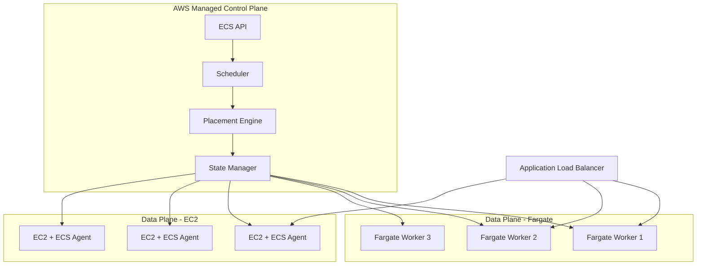
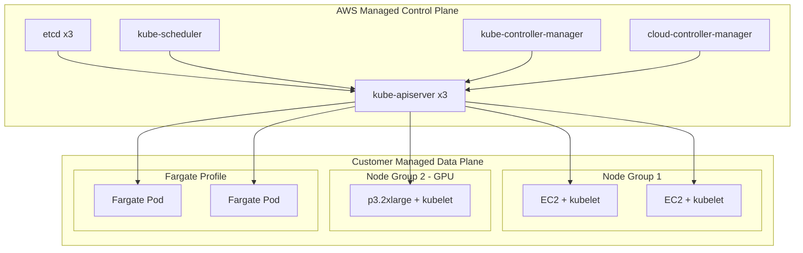
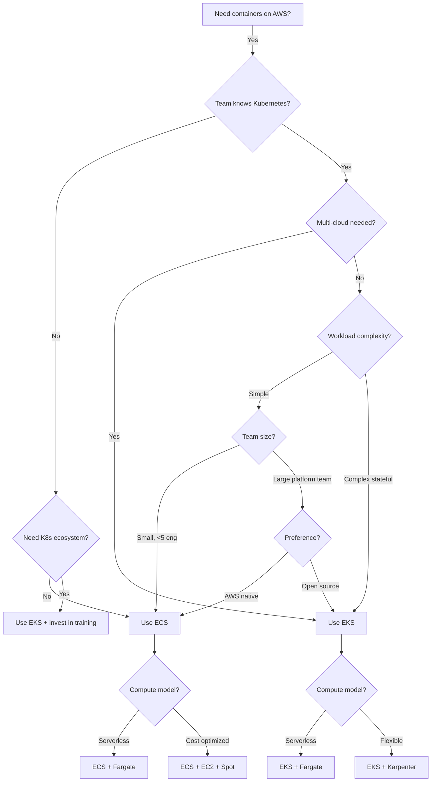
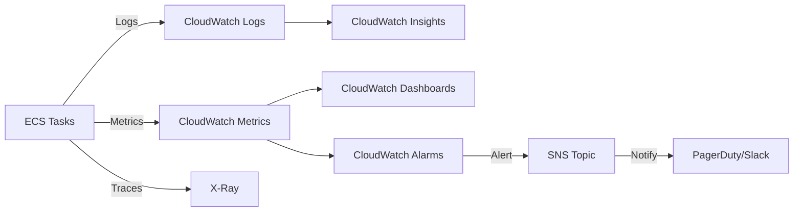
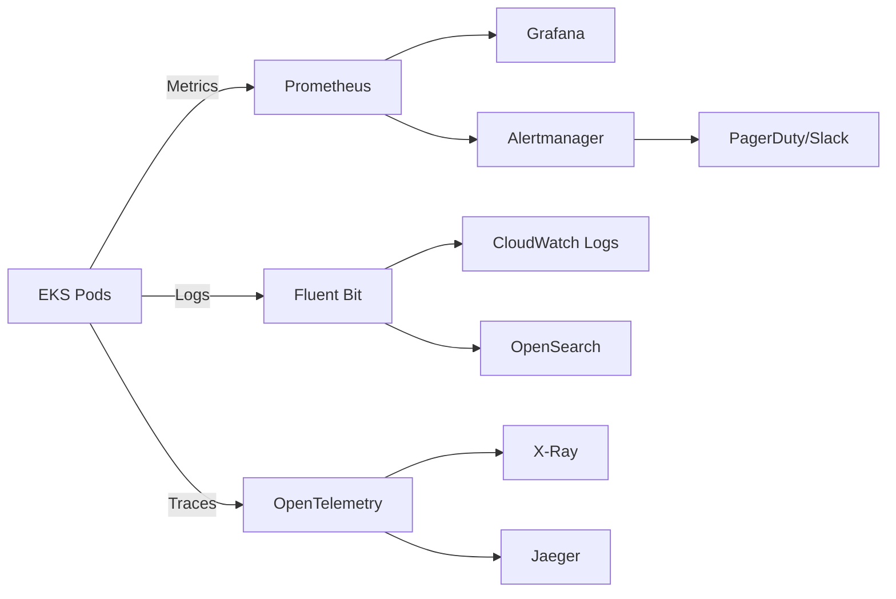

# ECS vs EKS: Container Orchestration on AWS

Running containers in production means choosing an orchestrator. On AWS, the choice comes down to two services: **Elastic Container Service (ECS)** — AWS's proprietary orchestrator — and **Elastic Kubernetes Service (EKS)** — managed Kubernetes. This page tears apart both from first principles, so you can make the right call for your team, workload, and budget.

---

## 1. Why Container Orchestration Exists

A single container is easy. You pull an image, run it, expose a port. But production workloads are not a single container. They are fleets of containers that need:

- **Scheduling** — deciding which host runs which container based on CPU, memory, GPU, affinity
- **Service discovery** — containers finding each other without hardcoded IPs
- **Health checks and self-healing** — killing unhealthy containers and replacing them
- **Rolling deployments** — updating without downtime
- **Autoscaling** — adding and removing containers based on load
- **Secret injection** — mounting credentials without baking them into images
- **Networking** — routing traffic between containers and to the internet
- **Storage** — attaching persistent volumes to stateful workloads

Without an orchestrator, you are writing bash scripts, manually SSH-ing into instances, and praying nothing dies at 3 AM.

### Historical Context

Docker launched in 2013 and made containers mainstream. By 2014, the "container orchestration wars" began:

- **Docker Swarm** — Docker's built-in orchestrator (simple but limited)
- **Apache Mesos / Marathon** — Twitter and Airbnb scale (complex but powerful)
- **Kubernetes** — Google's open-source system based on Borg (eventually won)
- **Amazon ECS** — AWS's proprietary answer, launched November 2014

Kubernetes won the open-source war by 2018. But ECS survived — and thrived — because AWS made it the lowest-friction path to running containers on their platform. AWS launched EKS in June 2018 for teams that needed Kubernetes specifically.

---

## 2. First Principles: The Two Models

### ECS: Task-Centric Model

ECS thinks in **tasks** and **services**. A task is a group of one or more containers that are scheduled together (like a Kubernetes pod). A service maintains a desired count of running tasks.

The ECS control plane is fully managed by AWS. You never see the etcd cluster, the scheduler process, or the API server. You interact through the AWS API.

**Key abstractions:**

| Concept | Description |
|---------|-------------|
| **Task Definition** | Blueprint: image, CPU, memory, ports, env vars, volumes |
| **Task** | Running instance of a task definition |
| **Service** | Ensures N tasks are always running, handles deployments |
| **Cluster** | Logical grouping of tasks/services |
| **Capacity Provider** | Where tasks run — Fargate, EC2, or External |

### EKS: Kubernetes-Native Model

EKS runs a conformant Kubernetes control plane. The mental model is Kubernetes itself: pods, deployments, services, ingress, namespaces, RBAC, CRDs, operators.

AWS manages the control plane (API server, etcd, scheduler, controller-manager). You manage the data plane (worker nodes) unless you use EKS with Fargate.

**Key abstractions:**

| Concept | Description |
|---------|-------------|
| **Pod** | Smallest deployable unit — one or more containers |
| **Deployment** | Manages ReplicaSets, handles rolling updates |
| **Service** | Stable network endpoint for a set of pods |
| **Ingress** | HTTP routing to services (ALB Ingress Controller) |
| **Namespace** | Logical isolation within a cluster |
| **Node Group** | Set of EC2 instances running kubelet |

---

## 3. Architecture Internals

### ECS Architecture



**ECS Agent**: On EC2 launch type, each instance runs the ECS agent — a Go process that polls the ECS API for task assignments, pulls images, starts containers via Docker/containerd, and reports health back. On Fargate, AWS manages the agent.

**Placement Engine**: When you run a task, ECS evaluates placement constraints (instance type, AZ, custom attributes) and placement strategies (spread, binpack, random):

- **spread** — distributes tasks evenly across AZs or instances (high availability)
- **binpack** — packs tasks onto fewest instances (cost efficiency)
- **random** — uniform random selection

**Networking modes:**

| Mode | Description | Use Case |
|------|-------------|----------|
| **awsvpc** | Each task gets its own ENI with a private IP | Fargate required, EC2 recommended |
| **bridge** | Docker bridge networking on the host | Legacy EC2 workloads |
| **host** | Shares the host network namespace | Performance-sensitive, single task per port |
| **none** | No external networking | Batch jobs with no network needs |

### EKS Architecture



**Control Plane**: EKS runs three API server replicas across three AZs with an NLB in front. etcd is also triple-replicated. AWS handles patching, upgrades, and scaling of the control plane. You pay $0.10/hour ($73/month) for this.

**Data Plane Options:**

1. **Managed Node Groups** — AWS manages the EC2 instances, AMI updates, and draining during upgrades
2. **Self-Managed Nodes** — you manage EC2 instances with your own AMI and launch templates
3. **Fargate** — serverless pods, no nodes to manage (subset of Kubernetes features)
4. **Karpenter** — open-source node autoscaler that provisions right-sized EC2 instances on demand

**Networking (VPC CNI)**: EKS uses the AWS VPC CNI plugin by default. Each pod gets a real VPC IP address from the subnet. This means:

- Pods are directly addressable from anywhere in the VPC
- Security groups can be applied per-pod (security groups for pods feature)
- IP address consumption can be significant — a c5.large supports ~29 pods due to ENI/IP limits

---

## 4. ECS Deep Dive: Fargate vs EC2 Launch Types

### Fargate

Fargate is serverless containers. You specify CPU and memory in your task definition, and AWS provisions the underlying infrastructure. You never see an EC2 instance.

**How Fargate works internally:**

1. You submit a task with CPU/memory requirements
2. AWS provisions a microVM (based on Firecracker) with exactly that capacity
3. Your container image is pulled and started inside the microVM
4. Each task is fully isolated — separate kernel, separate network namespace
5. When the task stops, the microVM is destroyed

**Fargate pricing (us-east-1, 2026):**

| Resource | Price per hour |
|----------|---------------|
| 1 vCPU | $0.04048 |
| 1 GB memory | $0.004445 |

Example: a task with 0.5 vCPU and 1 GB memory costs roughly $0.02469/hour = $17.78/month.

**Fargate CPU/memory combinations:**

| vCPU | Memory Range |
|------|-------------|
| 0.25 | 0.5 GB, 1 GB, 2 GB |
| 0.5 | 1 – 4 GB (1 GB increments) |
| 1 | 2 – 8 GB (1 GB increments) |
| 2 | 4 – 16 GB (1 GB increments) |
| 4 | 8 – 30 GB (1 GB increments) |
| 8 | 16 – 60 GB (4 GB increments) |
| 16 | 32 – 120 GB (8 GB increments) |

### EC2 Launch Type

With EC2, you manage a cluster of EC2 instances. The ECS agent on each instance registers with your cluster and accepts task placements.

**Advantages over Fargate:**
- GPU support (p3, p4, g4, g5 instance families)
- Persistent local storage (instance store NVMe)
- Lower cost at steady-state high utilization (especially with Reserved Instances or Savings Plans)
- Full control over instance configuration (kernel tuning, custom AMIs)
- Docker-in-Docker and privileged containers

**Disadvantages:**
- You must manage instance patching, scaling, and AMI updates
- Capacity planning — if the cluster runs out of CPU/memory, tasks fail to place
- Auto Scaling group management and scaling policies

---

## 5. Implementation: ECS Service with Fargate

### Task Definition (TypeScript CDK)

```typescript
import * as cdk from 'aws-cdk-lib';
import * as ecs from 'aws-cdk-lib/aws-ecs';
import * as ec2 from 'aws-cdk-lib/aws-ec2';
import * as elbv2 from 'aws-cdk-lib/aws-elasticloadbalancingv2';
import * as logs from 'aws-cdk-lib/aws-logs';
import * as secretsmanager from 'aws-cdk-lib/aws-secretsmanager';
import { Construct } from 'constructs';

interface ApiServiceProps {
  vpc: ec2.IVpc;
  cluster: ecs.ICluster;
  imageTag: string;
  desiredCount: number;
  cpu: number;
  memoryLimitMiB: number;
  environment: Record<string, string>;
  secretArns: string[];
}

export class ApiService extends Construct {
  public readonly service: ecs.FargateService;
  public readonly targetGroup: elbv2.ApplicationTargetGroup;

  constructor(scope: Construct, id: string, props: ApiServiceProps) {
    super(scope, id);

    const logGroup = new logs.LogGroup(this, 'LogGroup', {
      retention: logs.RetentionDays.THIRTY_DAYS,
      removalPolicy: cdk.RemovalPolicy.DESTROY,
    });

    const taskDefinition = new ecs.FargateTaskDefinition(this, 'TaskDef', {
      cpu: props.cpu,
      memoryLimitMiB: props.memoryLimitMiB,
      runtimePlatform: {
        operatingSystemFamily: ecs.OperatingSystemFamily.LINUX,
        cpuArchitecture: ecs.CpuArchitecture.ARM64,
      },
    });

    // Build secrets map from ARNs
    const secrets: Record<string, ecs.Secret> = {};
    for (const arn of props.secretArns) {
      const secret = secretsmanager.Secret.fromSecretCompleteArn(this, `Secret-${arn.slice(-8)}`, arn);
      const name = secret.secretName.toUpperCase().replace(/[^A-Z0-9]/g, '_');
      secrets[name] = ecs.Secret.fromSecretsManager(secret);
    }

    const container = taskDefinition.addContainer('api', {
      image: ecs.ContainerImage.fromRegistry(
        `123456789012.dkr.ecr.us-east-1.amazonaws.com/api:${props.imageTag}`
      ),
      logging: ecs.LogDrivers.awsLogs({
        logGroup,
        streamPrefix: 'api',
      }),
      environment: {
        NODE_ENV: 'production',
        PORT: '8080',
        ...props.environment,
      },
      secrets,
      healthCheck: {
        command: ['CMD-SHELL', 'curl -f http://localhost:8080/health || exit 1'],
        interval: cdk.Duration.seconds(15),
        timeout: cdk.Duration.seconds(5),
        retries: 3,
        startPeriod: cdk.Duration.seconds(30),
      },
    });

    container.addPortMappings({
      containerPort: 8080,
      protocol: ecs.Protocol.TCP,
    });

    // Security group for the service
    const serviceSg = new ec2.SecurityGroup(this, 'ServiceSG', {
      vpc: props.vpc,
      description: 'API service security group',
      allowAllOutbound: true,
    });

    this.service = new ecs.FargateService(this, 'Service', {
      cluster: props.cluster,
      taskDefinition,
      desiredCount: props.desiredCount,
      securityGroups: [serviceSg],
      assignPublicIp: false,
      vpcSubnets: { subnetType: ec2.SubnetType.PRIVATE_WITH_EGRESS },
      circuitBreaker: { enable: true, rollback: true },
      deploymentController: {
        type: ecs.DeploymentControllerType.ECS,
      },
      minHealthyPercent: 100,
      maxHealthyPercent: 200,
      enableExecuteCommand: true, // ECS Exec for debugging
    });

    // Auto-scaling
    const scaling = this.service.autoScaleTaskCount({
      minCapacity: props.desiredCount,
      maxCapacity: props.desiredCount * 4,
    });

    scaling.scaleOnCpuUtilization('CpuScaling', {
      targetUtilizationPercent: 65,
      scaleInCooldown: cdk.Duration.seconds(300),
      scaleOutCooldown: cdk.Duration.seconds(60),
    });

    scaling.scaleOnRequestCount('RequestScaling', {
      requestsPerTarget: 1000,
      targetGroup: this.targetGroup,
      scaleInCooldown: cdk.Duration.seconds(300),
      scaleOutCooldown: cdk.Duration.seconds(60),
    });
  }
}
```

### ECS Exec for Debugging

```typescript
// Enable interactive debugging into running containers
// Requires SSM plugin installed locally
import { ECSClient, ExecuteCommandCommand } from '@aws-sdk/client-ecs';

async function execIntoTask(
  cluster: string,
  taskId: string,
  container: string,
  command: string = '/bin/sh'
): Promise<void> {
  const client = new ECSClient({ region: 'us-east-1' });

  const response = await client.send(new ExecuteCommandCommand({
    cluster,
    task: taskId,
    container,
    command,
    interactive: true,
  }));

  console.log('Session:', response.session);
}
```

---

## 6. Implementation: EKS Cluster

### Cluster with Karpenter (TypeScript CDK)

```typescript
import * as cdk from 'aws-cdk-lib';
import * as eks from 'aws-cdk-lib/aws-eks';
import * as ec2 from 'aws-cdk-lib/aws-ec2';
import * as iam from 'aws-cdk-lib/aws-iam';
import { Construct } from 'constructs';
import { KubectlV31Layer } from '@aws-cdk/lambda-layer-kubectl-v31';

interface EksClusterProps {
  vpc: ec2.IVpc;
  clusterName: string;
  kubernetesVersion: eks.KubernetesVersion;
}

export class EksCluster extends Construct {
  public readonly cluster: eks.Cluster;

  constructor(scope: Construct, id: string, props: EksClusterProps) {
    super(scope, id);

    this.cluster = new eks.Cluster(this, 'Cluster', {
      clusterName: props.clusterName,
      vpc: props.vpc,
      version: props.kubernetesVersion,
      kubectlLayer: new KubectlV31Layer(this, 'KubectlLayer'),
      defaultCapacity: 0, // We use Karpenter instead
      endpointAccess: eks.EndpointAccess.PRIVATE,
      clusterLogging: [
        eks.ClusterLoggingTypes.API,
        eks.ClusterLoggingTypes.AUDIT,
        eks.ClusterLoggingTypes.AUTHENTICATOR,
        eks.ClusterLoggingTypes.CONTROLLER_MANAGER,
        eks.ClusterLoggingTypes.SCHEDULER,
      ],
      ipFamily: eks.IpFamily.IP_V4,
      serviceIpv4Cidr: '172.20.0.0/16',
    });

    // Install AWS Load Balancer Controller
    this.installAlbController();

    // Install Karpenter
    this.installKarpenter(props.vpc);

    // Install metrics-server
    this.cluster.addHelmChart('MetricsServer', {
      chart: 'metrics-server',
      repository: 'https://kubernetes-sigs.github.io/metrics-server/',
      namespace: 'kube-system',
      values: {
        replicas: 2,
      },
    });
  }

  private installAlbController(): void {
    const albServiceAccount = this.cluster.addServiceAccount('AlbController', {
      name: 'aws-load-balancer-controller',
      namespace: 'kube-system',
    });

    // ALB controller needs permissions to manage ALBs, target groups, etc.
    albServiceAccount.role.addManagedPolicy(
      iam.ManagedPolicy.fromAwsManagedPolicyName('ElasticLoadBalancingFullAccess')
    );

    this.cluster.addHelmChart('AlbController', {
      chart: 'aws-load-balancer-controller',
      repository: 'https://aws.github.io/eks-charts',
      namespace: 'kube-system',
      values: {
        clusterName: this.cluster.clusterName,
        serviceAccount: {
          create: false,
          name: 'aws-load-balancer-controller',
        },
        region: cdk.Stack.of(this).region,
        vpcId: this.cluster.vpc.vpcId,
      },
    });
  }

  private installKarpenter(vpc: ec2.IVpc): void {
    const karpenterNamespace = 'karpenter';

    const karpenterServiceAccount = this.cluster.addServiceAccount('Karpenter', {
      name: 'karpenter',
      namespace: karpenterNamespace,
    });

    karpenterServiceAccount.role.addManagedPolicy(
      iam.ManagedPolicy.fromAwsManagedPolicyName('AmazonSSMManagedInstanceCore')
    );

    karpenterServiceAccount.role.addToPrincipalPolicy(new iam.PolicyStatement({
      actions: [
        'ec2:CreateLaunchTemplate',
        'ec2:CreateFleet',
        'ec2:RunInstances',
        'ec2:CreateTags',
        'ec2:TerminateInstances',
        'ec2:DescribeLaunchTemplates',
        'ec2:DescribeInstances',
        'ec2:DescribeSecurityGroups',
        'ec2:DescribeSubnets',
        'ec2:DescribeImages',
        'ec2:DescribeInstanceTypes',
        'ec2:DescribeInstanceTypeOfferings',
        'ec2:DescribeAvailabilityZones',
        'iam:PassRole',
        'ssm:GetParameter',
        'pricing:GetProducts',
      ],
      resources: ['*'],
    }));

    this.cluster.addHelmChart('Karpenter', {
      chart: 'karpenter',
      repository: 'oci://public.ecr.aws/karpenter',
      namespace: karpenterNamespace,
      createNamespace: true,
      version: 'v0.37.0',
      values: {
        serviceAccount: {
          create: false,
          name: 'karpenter',
        },
        settings: {
          clusterName: this.cluster.clusterName,
          clusterEndpoint: this.cluster.clusterEndpoint,
        },
      },
    });

    // NodePool manifest — tells Karpenter what instances to provision
    this.cluster.addManifest('KarpenterNodePool', {
      apiVersion: 'karpenter.sh/v1beta1',
      kind: 'NodePool',
      metadata: { name: 'default' },
      spec: {
        template: {
          spec: {
            requirements: [
              { key: 'kubernetes.io/arch', operator: 'In', values: ['amd64', 'arm64'] },
              { key: 'karpenter.sh/capacity-type', operator: 'In', values: ['spot', 'on-demand'] },
              { key: 'karpenter.k8s.aws/instance-family', operator: 'In', values: ['c6g', 'c7g', 'm6g', 'm7g', 'r6g', 'r7g'] },
              { key: 'karpenter.k8s.aws/instance-size', operator: 'In', values: ['medium', 'large', 'xlarge', '2xlarge'] },
            ],
            nodeClassRef: { name: 'default' },
          },
        },
        limits: {
          cpu: '100',
          memory: '400Gi',
        },
        disruption: {
          consolidationPolicy: 'WhenUnderutilized',
          expireAfter: '720h',
        },
      },
    });
  }
}
```

---

## 7. Edge Cases and Failure Modes

### ECS Failure Modes

| Failure | Symptom | Root Cause | Mitigation |
|---------|---------|------------|------------|
| Task fails to start | `STOPPED` reason: `CannotPullContainerError` | ECR endpoint unreachable, missing IAM permissions | VPC endpoints for ECR, verify task execution role |
| Task stuck in `PROVISIONING` | Fargate tasks pending indefinitely | IP address exhaustion in subnet | Use larger subnets (/20+), check ENI limits |
| Service stuck at 0 healthy tasks | Deployment circuit breaker triggers rollback | Health check failing, app crash loop | Check CloudWatch logs, verify health endpoint |
| Tasks placed unevenly across AZs | One AZ gets most tasks | Placement strategy not set to `spread` | Set `spread` across `attribute:ecs.availability-zone` |
| OOM kill | Task exits with code 137 | Container exceeds hard memory limit | Increase memory in task definition, check for memory leaks |
| ENI trunking limit | Cannot place more tasks on EC2 | Default ENI limit per instance | Enable `ECS_AWSVPC_TRUNK_ENI` account setting |

### EKS Failure Modes

| Failure | Symptom | Root Cause | Mitigation |
|---------|---------|------------|------------|
| Pods stuck in `Pending` | `0/3 nodes are available` | No nodes with sufficient resources | Check Karpenter/Cluster Autoscaler, node affinity |
| `ImagePullBackOff` | Pod cannot start | ECR auth expired, image not found | Verify `imagePullSecrets`, ECR IAM role |
| `CrashLoopBackOff` | Pod restarts repeatedly | Application error, OOM, misconfiguration | Check `kubectl logs`, increase resource limits |
| DNS resolution failures | Services cannot find each other | CoreDNS pods crashed or overloaded | Scale CoreDNS replicas, check memory limits |
| API server throttling | `429 Too Many Requests` | Too many Kubernetes API calls | Implement client-side rate limiting, use informers |
| Node NotReady | Workloads evicted | Kubelet lost contact with control plane | Check node security groups, VPC CNI health |
| IP address exhaustion | New pods cannot schedule | VPC CNI uses real IPs, subnet exhausted | Use prefix delegation, larger subnets, or alternate CNIs |

::: danger Critical: EKS Upgrade Failures
EKS version upgrades (e.g., 1.29 to 1.30) can break workloads if deprecated APIs are used. Before upgrading:
1. Run `kubectl api-resources` to check API versions
2. Use `pluto detect-all-in-cluster` to find deprecated APIs
3. Test in a staging cluster first
4. Upgrade node groups AFTER the control plane
:::

---

## 8. Performance Characteristics

### Container Startup Time

| Scenario | ECS Fargate | ECS EC2 | EKS EC2 | EKS Fargate |
|----------|------------|---------|---------|-------------|
| Small image (50 MB) | 15-25s | 3-8s | 3-8s | 20-35s |
| Medium image (200 MB) | 25-45s | 5-15s | 5-15s | 30-50s |
| Large image (1 GB) | 45-90s | 10-30s | 10-30s | 60-120s |
| Cached image | 10-15s | 1-3s | 1-3s | 15-25s |

Fargate is slower because it must provision a microVM and pull the image fresh (unless SOCI — Seekable OCI — index is available).

**SOCI (Seekable OCI)**: Fargate supports lazy-loading container images using SOCI indices. Instead of downloading the entire image, Fargate downloads only the layers needed at startup, reducing cold start time by 40-70% for large images.

### Scaling Speed

$$
T_{scale} = T_{detect} + T_{provision} + T_{pull} + T_{health}
$$

| Component | ECS Fargate | EKS + Karpenter |
|-----------|-------------|-----------------|
| $T_{detect}$ (metric alarm) | 60-120s | 15-30s (HPA) |
| $T_{provision}$ (compute) | 15-30s | 60-120s (new node) |
| $T_{pull}$ (image) | 10-60s | 5-30s |
| $T_{health}$ (health check) | 15-30s | 10-30s |
| **Total** | **100-240s** | **90-210s** |

EKS can be faster if nodes have spare capacity (pods schedule in seconds). ECS Fargate always provisions new microVMs.

### Networking Throughput

ECS and EKS both use the VPC CNI plugin for awsvpc networking. The performance ceiling is the EC2 instance network bandwidth:

| Instance Type | Network Bandwidth | Pods Supported |
|---------------|-------------------|----------------|
| c5.large | Up to 10 Gbps | ~29 |
| c5.xlarge | Up to 10 Gbps | ~58 |
| c5.2xlarge | Up to 10 Gbps | ~58 |
| c5.4xlarge | Up to 10 Gbps | ~234 |
| c5.9xlarge | 10 Gbps | ~234 |
| c5.18xlarge | 25 Gbps | ~737 |

For Fargate, each task gets its own ENI with bandwidth proportional to the vCPU allocation (roughly 5 Gbps per vCPU).

---

## 9. Cost Analysis

### Monthly Cost Comparison (Web API, 10 tasks/pods, 1 vCPU, 2 GB each)

| Component | ECS Fargate | ECS EC2 (On-Demand) | EKS EC2 (On-Demand) | EKS Fargate |
|-----------|-------------|---------------------|---------------------|-------------|
| Control plane | $0 | $0 | $73 | $73 |
| Compute | $351 | ~$280 (2x c5.xlarge) | ~$280 (2x c5.xlarge) | $351 |
| Load balancer | $22 | $22 | $22 | $22 |
| Data transfer | ~$50 | ~$50 | ~$50 | ~$50 |
| **Total** | **~$423** | **~$352** | **~$425** | **~$496** |

### At Scale (100 tasks/pods)

| Component | ECS Fargate | ECS EC2 (RI) | EKS EC2 (RI + Spot) |
|-----------|-------------|--------------|----------------------|
| Control plane | $0 | $0 | $73 |
| Compute | $3,510 | ~$1,200 | ~$900 |
| Load balancer | $45 | $45 | $45 |
| **Total** | **~$3,555** | **~$1,245** | **~$1,018** |

::: tip Key Insight
Fargate costs 2-3x more than EC2 at steady-state. The savings come from operational costs — no patching, no capacity planning, no AMI management. For small teams (under 5 engineers), Fargate's premium pays for itself in reduced ops burden.
:::

### Break-Even Analysis

$$
C_{fargate} = n \cdot (cpu_{price} \cdot cpu + mem_{price} \cdot mem) \cdot hours
$$

$$
C_{ec2} = \lceil \frac{n \cdot cpu}{cpu_{instance}} \rceil \cdot instance_{price} \cdot hours + ops_{cost}
$$

Where $ops_{cost}$ is the fully loaded cost of engineering time spent managing EC2 instances. At a fully loaded engineering cost of $150/hour, even 4 hours/week of EC2 management costs $2,600/month — often exceeding the Fargate premium.

---

## 10. Decision Framework

### When to Choose ECS

| Factor | Choose ECS When |
|--------|----------------|
| Team Kubernetes experience | Low — team does not know or want to learn Kubernetes |
| AWS integration depth | Deep — heavily using AWS-native services (Step Functions, EventBridge, App Mesh) |
| Workload complexity | Simple — web APIs, workers, scheduled tasks |
| Multi-cloud requirement | None — committed to AWS |
| Control plane cost | Matters — ECS control plane is free |
| Operational overhead | Minimal — small team, no dedicated platform engineers |

### When to Choose EKS

| Factor | Choose EKS When |
|--------|----------------|
| Team Kubernetes experience | High — team already knows Kubernetes |
| Ecosystem requirements | Need Kubernetes ecosystem (Helm charts, operators, service meshes) |
| Multi-cloud / hybrid | Required — Kubernetes abstracts the cloud provider |
| Workload complexity | Complex — stateful sets, CRDs, custom schedulers |
| Compliance | Requires Kubernetes-specific tooling (OPA/Gatekeeper, Falco) |
| Portability | Important — ability to migrate to GKE, AKS, or on-prem |

### Decision Tree



---

## 11. War Stories

::: info War Story: The ECS Task That Wouldn't Die
A fintech team deployed a payment processing service on ECS Fargate. During a deployment, old tasks refused to drain — they kept processing in-flight requests for 10+ minutes. The root cause: the application did not handle SIGTERM. ECS sends SIGTERM, waits `stopTimeout` seconds (default 30), then sends SIGKILL.

The fix was two-fold:
1. Added a SIGTERM handler that stopped accepting new connections and drained in-flight requests
2. Set `stopTimeout` to 120 seconds in the task definition to allow long-running payment processing to complete

```typescript
process.on('SIGTERM', async () => {
  console.log('SIGTERM received, draining connections...');
  server.close(); // stop accepting new connections
  await drainInFlightRequests(); // wait for existing requests
  process.exit(0);
});
```
:::

::: info War Story: EKS IP Address Exhaustion
A SaaS platform ran 500+ pods on EKS with the default VPC CNI plugin. Each pod consumed a real VPC IP address. They used /24 subnets (254 usable IPs) across 3 AZs, giving them ~762 IPs. With system pods (CoreDNS, kube-proxy, CNI daemonsets), they had room for about 700 application pods.

During a traffic spike, the autoscaler tried to scale to 800 pods. New pods stuck in `Pending` with the error: `failed to assign an IP address to pod`. The fix:

1. **Immediate**: enabled VPC CNI prefix delegation (`ENABLE_PREFIX_DELEGATION=true`), which assigns /28 prefixes instead of individual IPs — giving 16 IPs per slot instead of 1
2. **Long-term**: migrated to /19 subnets (8,190 usable IPs per AZ)
:::

::: info War Story: Fargate Spot Termination During Deploy
A team used Fargate Spot for cost savings on their staging environment. During a deployment, AWS reclaimed spot capacity, killing tasks mid-deploy. The deployment appeared to succeed (new tasks launched), but the circuit breaker triggered because healthy task count dropped below the minimum.

Lesson: Never use Fargate Spot for services with strict availability requirements. Use it for batch jobs, dev/staging environments, and workloads that can tolerate interruption. For production services, use on-demand Fargate with Savings Plans for discounts.
:::

---

## 12. Advanced Topics

### Service Mesh: ECS Service Connect vs Istio on EKS

**ECS Service Connect** (built on Envoy): AWS's managed service mesh for ECS. It provides:
- Service-to-service communication with automatic DNS
- Load balancing with outlier detection
- Metrics and tracing via CloudWatch
- No sidecar management — AWS injects and manages the Envoy proxy

**Istio on EKS**: Full-featured service mesh with:
- mTLS between all pods
- Advanced traffic management (canary, fault injection, circuit breaking)
- Distributed tracing with Jaeger/Zipkin
- Policy enforcement with OPA

**Comparison:**

| Feature | ECS Service Connect | Istio on EKS |
|---------|---------------------|---------------|
| Setup complexity | Low (2 lines in CDK) | High (Helm charts, CRDs, operator) |
| mTLS | Automatic | Configurable |
| Traffic splitting | Basic | Advanced (canary, fault injection) |
| Observability | CloudWatch | Prometheus, Grafana, Jaeger |
| Resource overhead | ~32 MB per sidecar | ~128 MB per sidecar |
| Multi-cluster | Via Cloud Map | Native federation |

### Graviton (ARM64) Workloads

Both ECS and EKS support Graviton (ARM64) instances, which offer 20-40% better price-performance than x86:

```dockerfile
# Multi-architecture build
FROM --platform=$BUILDPLATFORM node:20-alpine AS builder
WORKDIR /app
COPY package*.json ./
RUN npm ci --production
COPY . .
RUN npm run build

FROM --platform=$TARGETPLATFORM node:20-alpine
WORKDIR /app
COPY --from=builder /app/dist ./dist
COPY --from=builder /app/node_modules ./node_modules
CMD ["node", "dist/server.js"]
```

Build for both architectures:
```bash
docker buildx build --platform linux/amd64,linux/arm64 -t myapp:latest --push .
```

### GitOps with EKS (ArgoCD)

```yaml
# argocd-application.yaml
apiVersion: argoproj.io/v1alpha1
kind: Application
metadata:
  name: api-production
  namespace: argocd
spec:
  project: default
  source:
    repoURL: https://github.com/myorg/k8s-manifests.git
    targetRevision: main
    path: production/api
  destination:
    server: https://kubernetes.default.svc
    namespace: production
  syncPolicy:
    automated:
      prune: true
      selfHeal: true
    syncOptions:
      - CreateNamespace=true
    retry:
      limit: 5
      backoff:
        duration: 5s
        factor: 2
        maxDuration: 3m
```

### ECS with AWS Copilot (Rapid Deployment)

For teams that want ECS without CDK complexity, AWS Copilot provides an opinionated CLI:

```bash
# Initialize app
copilot app init myapp

# Create a Load Balanced Web Service
copilot svc init --name api --svc-type "Load Balanced Web Service" --dockerfile ./Dockerfile

# Deploy to a new environment
copilot env init --name production --profile prod-account
copilot svc deploy --name api --env production
```

Copilot generates CloudFormation under the hood with best practices: private subnets, NAT gateways, ALB, auto-scaling, CI/CD pipeline.

---

## 13. Migration Paths

### Docker Compose to ECS

AWS provides the `ecs-cli` and Docker Compose integration:

```bash
# Convert docker-compose.yml to ECS task definitions
ecs-cli compose --file docker-compose.yml create --launch-type FARGATE
```

However, production migrations require more thought:

1. **Extract environment variables** into SSM Parameter Store or Secrets Manager
2. **Replace local volumes** with EFS or S3
3. **Replace localhost networking** with service discovery (Cloud Map)
4. **Add health checks** to every service
5. **Configure autoscaling** for each service independently

### ECS to EKS Migration

If you outgrow ECS:

1. **Containerize already done** — images work on both
2. **Convert task definitions to Kubernetes manifests** — map CPU/memory, ports, env vars
3. **Replace ALB target groups with Kubernetes Services + Ingress**
4. **Replace Cloud Map with CoreDNS service discovery**
5. **Replace ECS Exec with `kubectl exec`**
6. **Replace ECS auto-scaling with HPA + Karpenter**
7. **Run both in parallel** during migration, shift traffic gradually

---

## 14. Monitoring and Observability

### ECS Monitoring Stack



Key ECS metrics to monitor:
- `CPUUtilization` and `MemoryUtilization` — per service
- `RunningTaskCount` — vs desired count (mismatch = problem)
- `DesiredTaskCount` — indicates scaling activity
- ALB `TargetResponseTime` — end-to-end latency
- ALB `HTTPCode_Target_5XX_Count` — error rate

### EKS Monitoring Stack



Key Kubernetes metrics:
- `container_cpu_usage_seconds_total` — actual CPU usage
- `container_memory_working_set_bytes` — actual memory usage
- `kube_pod_status_phase` — pod lifecycle state
- `kube_deployment_status_replicas_available` — healthy replicas
- `apiserver_request_total` — API server load
- `scheduler_pending_pods` — scheduling backlog

---

## 15. Summary Comparison Table

| Dimension | ECS Fargate | ECS EC2 | EKS + Managed Nodes | EKS + Karpenter |
|-----------|-------------|---------|---------------------|-----------------|
| Control plane cost | Free | Free | $73/mo | $73/mo |
| Compute cost | High | Medium | Medium | Low (Spot) |
| Ops complexity | Very Low | Medium | High | Medium-High |
| Startup time | 15-45s | 3-15s | 3-15s | 60-120s (new node) |
| Max pods/tasks | Unlimited | Instance-limited | Instance-limited | Flexible |
| GPU support | No | Yes | Yes | Yes |
| Kubernetes ecosystem | No | No | Full | Full |
| Multi-cloud portable | No | No | Yes | Yes |
| Service mesh | Service Connect | Service Connect | Istio/Linkerd | Istio/Linkerd |
| GitOps | CodePipeline | CodePipeline | ArgoCD/Flux | ArgoCD/Flux |
| Learning curve | Low | Low-Medium | High | Medium-High |
| Best for | Small teams, simple apps | Cost-sensitive steady-state | K8s-experienced teams | Dynamic, mixed workloads |

The right choice is not about which technology is "better" — it is about which technology your team can operate reliably, at the scale you need, within your budget and staffing constraints. Start simple, and graduate to complexity only when you have the operational muscle to handle it.
