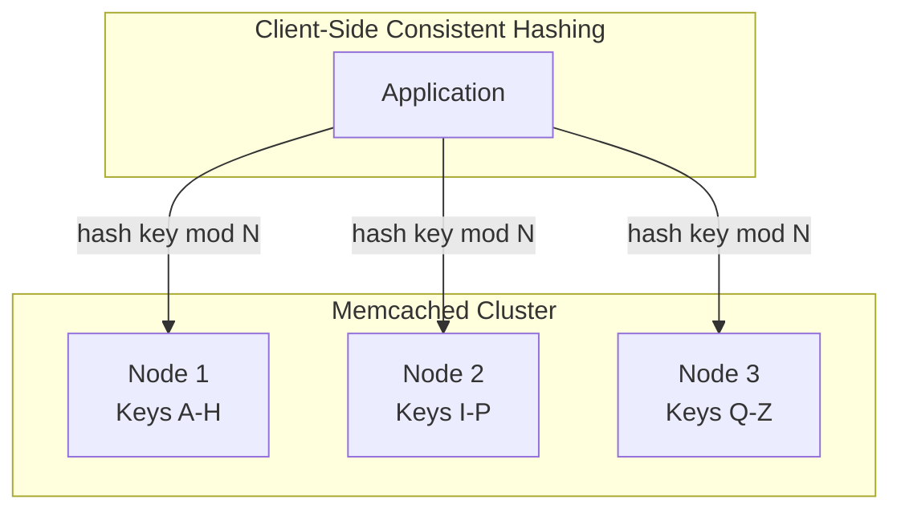
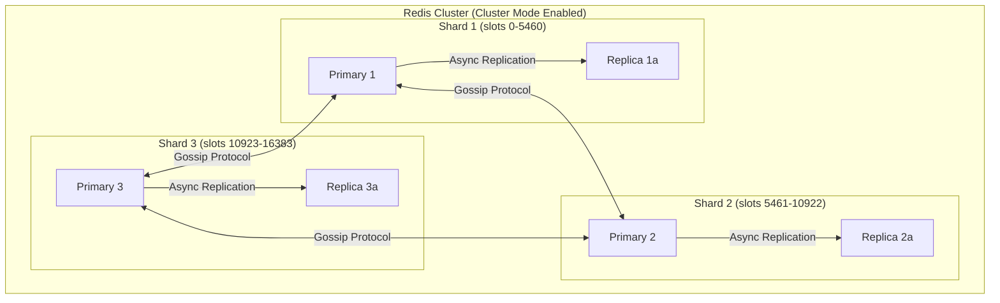
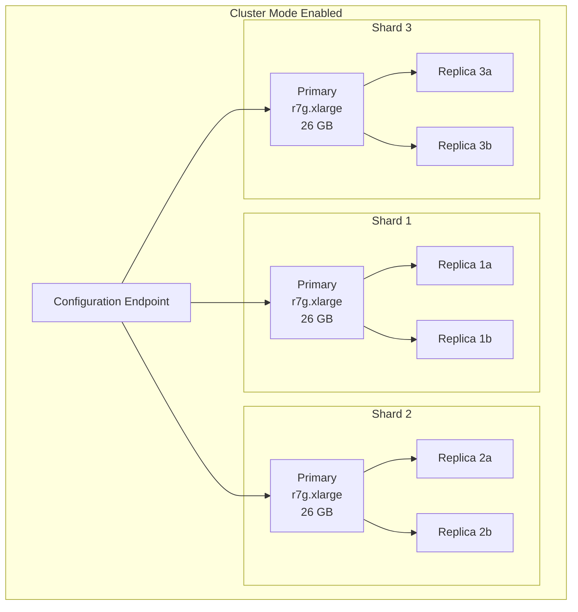
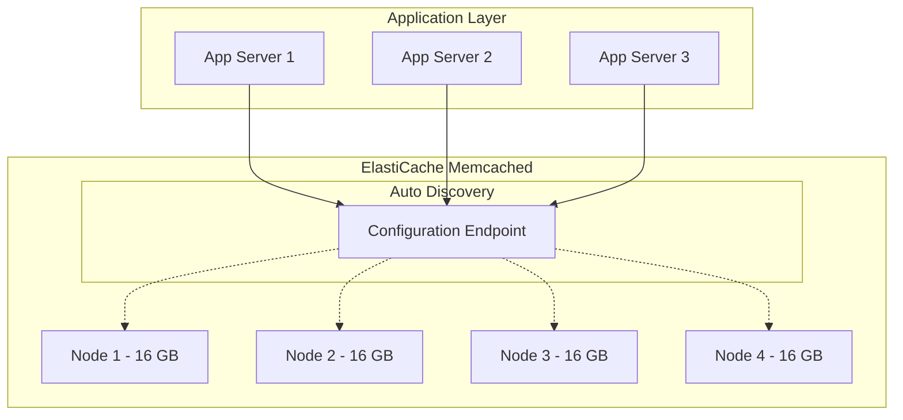
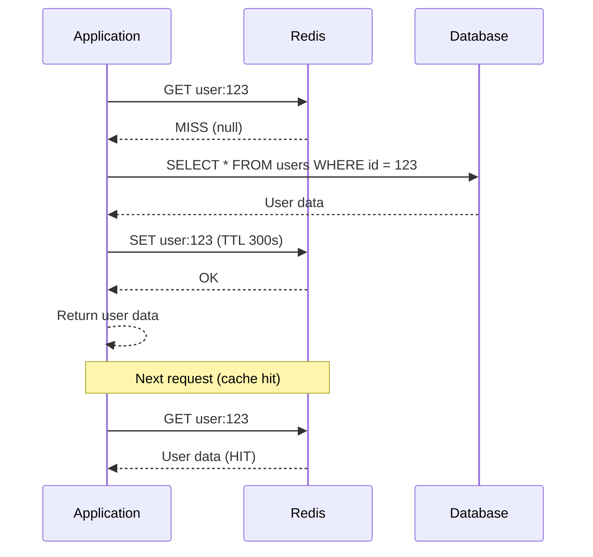

# ElastiCache: Redis & Memcached on AWS

Caching is the single most impactful performance optimization in distributed systems. A well-placed cache turns a 50ms database query into a 0.5ms memory lookup — a 100x improvement. AWS ElastiCache provides managed Redis and Memcached clusters, handling the operational burden of replication, failover, patching, and monitoring.

This page covers both engines from the data structure level up through production operational patterns.

---

## 1. Why Caching Exists

Every web request that hits a database pays a cost:

- **Network round trip**: 1-5ms within the same AZ
- **Query parsing and planning**: 0.1-1ms
- **Disk I/O**: 1-50ms for uncached data (SSD), 5-500ms (HDD)
- **Lock contention**: variable, can be seconds under load

At 1,000 requests/second, a 50ms database query means 50 seconds of cumulative database time per second — your database needs 50 vCPUs just for this one query pattern.

A cache intercepts repeated reads and serves them from memory:

$$
\text{Effective latency} = (1 - h) \cdot L_{db} + h \cdot L_{cache}
$$

Where $h$ is the cache hit ratio, $L_{db}$ is database latency, and $L_{cache}$ is cache latency.

At 95% hit ratio:
$$
\text{Effective latency} = 0.05 \times 50\text{ms} + 0.95 \times 0.5\text{ms} = 2.975\text{ms}
$$

That is a 17x improvement in average latency and a 20x reduction in database load.

### Amdahl's Law Applied to Caching

$$
S = \frac{1}{(1 - p) + \frac{p}{s}}
$$

Where $p$ is the fraction of work that is cacheable and $s$ is the speedup from caching. If 80% of your workload is cacheable reads and caching provides 100x speedup:

$$
S = \frac{1}{0.2 + \frac{0.8}{100}} = \frac{1}{0.208} = 4.81\times
$$

Even with 100x faster cache, overall speedup is limited to ~5x because 20% of work is uncacheable. This means caching is most effective when the cacheable fraction is high.

---

## 2. Redis vs Memcached: First Principles

### Memcached

Memcached is a distributed key-value store designed for simplicity. It stores blobs of data identified by string keys.

**Data model**: `string key -> byte[] value`

**Architecture**: multi-threaded, single-node. Each node is independent. Distribution is handled by the client using consistent hashing.



**Key properties**:
- Multi-threaded — utilizes all CPU cores on a single node
- No persistence — data is lost on restart
- No replication — a node failure loses its data partition
- LRU eviction — when memory is full, least recently used keys are evicted
- Simple protocol — GET, SET, DELETE, INCR, DECR
- Maximum value size: 1 MB (configurable up to 128 MB in ElastiCache)

### Redis

Redis is a data structure server. It stores not just strings, but lists, sets, sorted sets, hashes, streams, bitmaps, and HyperLogLogs — with atomic operations on each.

**Data model**: `string key -> typed value (string | list | set | sorted_set | hash | stream | ...)`

**Architecture**: single-threaded event loop for command processing (I/O threads added in Redis 6 for network I/O only). Replication is built-in.



**Key properties**:
- Single-threaded command processing (predictable latency)
- Rich data structures with atomic operations
- Persistence: RDB snapshots + AOF (Append Only File)
- Built-in replication (async by default, synchronous optional)
- Pub/Sub messaging
- Lua scripting for atomic multi-operation transactions
- Cluster mode for horizontal scaling (hash slots)
- Streams for event sourcing / message queue patterns

### Head-to-Head Comparison

| Feature | Redis | Memcached |
|---------|-------|-----------|
| Data structures | Strings, Lists, Sets, Sorted Sets, Hashes, Streams, HyperLogLog, Bitmaps, Geospatial | Strings only |
| Threading | Single-threaded (I/O threads in 6.x+) | Multi-threaded |
| Max value size | 512 MB | 1 MB (128 MB in ElastiCache) |
| Persistence | RDB + AOF | None |
| Replication | Built-in primary-replica | None |
| Clustering | Hash slot partitioning (16,384 slots) | Client-side consistent hashing |
| Pub/Sub | Yes | No |
| Scripting | Lua | No |
| Transactions | MULTI/EXEC | CAS (Check-and-Set) |
| Eviction policies | 8 policies | LRU only |
| Typical latency | 0.1-0.5ms | 0.1-0.3ms |

---

## 3. ElastiCache Architecture

### Redis Deployment Modes

**Single Node (Non-Clustered)**
- One primary node
- No replication, no failover
- Use only for development/testing

**Replication Group (Cluster Mode Disabled)**
- One primary + up to 5 replicas
- All nodes hold the entire dataset
- Replicas serve read traffic
- Automatic failover promotes a replica on primary failure
- Maximum dataset size: limited by single node memory (up to 635 GB on r7g.16xlarge)

**Cluster Mode Enabled**
- Data is partitioned across 1-500 shards
- Each shard has 1 primary + up to 5 replicas
- Dataset can exceed single node memory (up to 500 shards * 635 GB = 317 TB theoretical)
- Supports online resharding (add/remove shards without downtime)



### Failover Mechanics

When ElastiCache Redis detects a primary failure:

1. **Detection**: health checks fail for 15-30 seconds (configurable)
2. **Election**: the replica with the least replication lag is chosen
3. **Promotion**: the chosen replica is promoted to primary
4. **DNS update**: the primary endpoint CNAME is updated
5. **Sync**: other replicas begin replicating from the new primary

$$
T_{failover} \approx 15\text{-}30s\text{ (detection)} + 5\text{-}10s\text{ (promotion)} + 10\text{-}30s\text{ (DNS)} = 30\text{-}70s
$$

::: warning Data Loss During Failover
Redis replication is asynchronous by default. Writes acknowledged by the primary but not yet replicated to the chosen replica are lost during failover. The amount of lost data depends on replication lag, typically 0-100ms worth of writes.

For applications that cannot tolerate any data loss, consider:
1. Using Redis with `WAIT` command (synchronous replication, higher latency)
2. Writing to both cache and database, using the database as the source of truth
3. Using cache-aside pattern where the cache is always rebuildable from the database
:::

### Memcached Deployment

ElastiCache Memcached is simpler — it is a pool of independent nodes:



**Auto Discovery**: ElastiCache Memcached provides a configuration endpoint that returns the list of all nodes. The client library (e.g., `elasticache-cluster-config`) periodically polls this endpoint to discover node additions/removals.

---

## 4. Data Structures and Use Cases

### Redis Strings — Session Store

```typescript
import { Redis } from 'ioredis';

const redis = new Redis({
  host: 'my-cluster.abc123.use1.cache.amazonaws.com',
  port: 6379,
  tls: {},
  retryStrategy: (times: number) => Math.min(times * 50, 2000),
  maxRetriesPerRequest: 3,
});

interface Session {
  userId: string;
  email: string;
  roles: string[];
  createdAt: number;
  lastActivity: number;
}

const SESSION_TTL = 3600; // 1 hour

async function setSession(sessionId: string, session: Session): Promise<void> {
  await redis.set(
    `session:${sessionId}`,
    JSON.stringify(session),
    'EX', SESSION_TTL
  );
}

async function getSession(sessionId: string): Promise<Session | null> {
  const data = await redis.get(`session:${sessionId}`);
  if (!data) return null;

  const session: Session = JSON.parse(data);

  // Slide the expiration on each access
  await redis.expire(`session:${sessionId}`, SESSION_TTL);

  return session;
}

async function deleteSession(sessionId: string): Promise<void> {
  await redis.del(`session:${sessionId}`);
}
```

### Redis Sorted Sets — Leaderboard

```typescript
async function updateScore(userId: string, score: number): Promise<void> {
  await redis.zadd('leaderboard:daily', score, userId);
}

async function getTopPlayers(count: number): Promise<Array<{ userId: string; score: number }>> {
  // ZREVRANGE returns highest scores first
  const results = await redis.zrevrange('leaderboard:daily', 0, count - 1, 'WITHSCORES');

  const players: Array<{ userId: string; score: number }> = [];
  for (let i = 0; i < results.length; i += 2) {
    players.push({
      userId: results[i],
      score: parseFloat(results[i + 1]),
    });
  }
  return players;
}

async function getPlayerRank(userId: string): Promise<number | null> {
  // ZREVRANK returns 0-based rank (highest score = rank 0)
  const rank = await redis.zrevrank('leaderboard:daily', userId);
  return rank !== null ? rank + 1 : null; // Convert to 1-based
}
```

### Redis Hashes — Rate Limiting (Sliding Window)

```typescript
async function isRateLimited(
  userId: string,
  windowSeconds: number = 60,
  maxRequests: number = 100
): Promise<{ limited: boolean; remaining: number; retryAfterMs: number }> {
  const key = `ratelimit:${userId}`;
  const now = Date.now();
  const windowStart = now - windowSeconds * 1000;

  const pipeline = redis.pipeline();

  // Remove old entries outside the window
  pipeline.zremrangebyscore(key, 0, windowStart);

  // Add current request
  pipeline.zadd(key, now, `${now}:${Math.random()}`);

  // Count requests in window
  pipeline.zcard(key);

  // Set expiry on the key
  pipeline.expire(key, windowSeconds);

  const results = await pipeline.exec();
  const requestCount = results![2][1] as number;

  if (requestCount > maxRequests) {
    // Find the oldest entry to determine retry-after
    const oldest = await redis.zrange(key, 0, 0, 'WITHSCORES');
    const oldestTimestamp = oldest.length > 1 ? parseFloat(oldest[1]) : now;
    const retryAfterMs = Math.max(0, oldestTimestamp + windowSeconds * 1000 - now);

    return { limited: true, remaining: 0, retryAfterMs };
  }

  return {
    limited: false,
    remaining: maxRequests - requestCount,
    retryAfterMs: 0,
  };
}
```

### Redis Streams — Event Log

```typescript
interface OrderEvent {
  orderId: string;
  type: 'created' | 'paid' | 'shipped' | 'delivered';
  timestamp: number;
  payload: Record<string, string>;
}

async function publishOrderEvent(event: OrderEvent): Promise<string> {
  const id = await redis.xadd(
    'stream:orders',
    '*', // Auto-generate ID (timestamp-based)
    'orderId', event.orderId,
    'type', event.type,
    'timestamp', String(event.timestamp),
    'payload', JSON.stringify(event.payload)
  );
  return id;
}

async function consumeOrderEvents(
  consumerGroup: string,
  consumerId: string,
  count: number = 10
): Promise<OrderEvent[]> {
  // Create consumer group if it doesn't exist
  try {
    await redis.xgroup('CREATE', 'stream:orders', consumerGroup, '0', 'MKSTREAM');
  } catch {
    // Group already exists, ignore
  }

  const results = await redis.xreadgroup(
    'GROUP', consumerGroup, consumerId,
    'COUNT', count,
    'BLOCK', 5000, // Block for up to 5 seconds
    'STREAMS', 'stream:orders', '>'
  );

  if (!results) return [];

  const events: OrderEvent[] = [];
  for (const [, messages] of results) {
    for (const [id, fields] of messages) {
      const fieldMap: Record<string, string> = {};
      for (let i = 0; i < fields.length; i += 2) {
        fieldMap[fields[i]] = fields[i + 1];
      }
      events.push({
        orderId: fieldMap.orderId,
        type: fieldMap.type as OrderEvent['type'],
        timestamp: parseInt(fieldMap.timestamp),
        payload: JSON.parse(fieldMap.payload),
      });

      // Acknowledge message
      await redis.xack('stream:orders', consumerGroup, id);
    }
  }

  return events;
}
```

---

## 5. Caching Patterns

### Cache-Aside (Lazy Loading)

The application checks the cache first. On a miss, it reads from the database and populates the cache.



**Pros**: only caches data that is actually requested; cache failures do not break the application
**Cons**: cache miss penalty (three network round trips); stale data between writes and TTL expiry

### Write-Through

Every write goes to both the cache and the database.

```typescript
async function updateUser(userId: string, updates: Partial<User>): Promise<User> {
  // Write to database first (source of truth)
  const user = await db.query(
    'UPDATE users SET name = $1, email = $2 WHERE id = $3 RETURNING *',
    [updates.name, updates.email, userId]
  );

  // Write to cache
  await redis.set(`user:${userId}`, JSON.stringify(user.rows[0]), 'EX', 300);

  return user.rows[0];
}
```

**Pros**: cache is always consistent with the database; no stale reads
**Cons**: write latency increases (two writes per operation); cache may contain data that is never read

### Write-Behind (Write-Back)

Writes go to the cache first, then are asynchronously flushed to the database.

```typescript
async function updateUserWriteBehind(userId: string, updates: Partial<User>): Promise<void> {
  // Write to cache immediately
  const cacheKey = `user:${userId}`;
  const current = await redis.get(cacheKey);
  const user = current ? { ...JSON.parse(current), ...updates } : updates;
  await redis.set(cacheKey, JSON.stringify(user), 'EX', 300);

  // Queue async write to database
  await redis.xadd('stream:db-writes', '*',
    'table', 'users',
    'operation', 'UPDATE',
    'key', userId,
    'data', JSON.stringify(updates)
  );
}

// Background worker processes the write-behind queue
async function processWriteBehindQueue(): Promise<void> {
  while (true) {
    const results = await redis.xreadgroup(
      'GROUP', 'db-writers', 'worker-1',
      'COUNT', 100, 'BLOCK', 5000,
      'STREAMS', 'stream:db-writes', '>'
    );

    if (!results) continue;

    for (const [, messages] of results) {
      for (const [id, fields] of messages) {
        const fieldMap: Record<string, string> = {};
        for (let i = 0; i < fields.length; i += 2) {
          fieldMap[fields[i]] = fields[i + 1];
        }

        await db.query(
          `UPDATE ${fieldMap.table} SET data = $1 WHERE id = $2`,
          [fieldMap.data, fieldMap.key]
        );

        await redis.xack('stream:db-writes', 'db-writers', id);
      }
    }
  }
}
```

**Pros**: very low write latency; batching reduces database load
**Cons**: data loss risk if cache fails before flush; complex to implement correctly

---

## 6. Eviction Policies

When Redis runs out of memory, it must evict keys to make room. The eviction policy determines which keys to remove.

| Policy | Description | Use Case |
|--------|-------------|----------|
| `noeviction` | Return error on writes when memory full | When data loss is unacceptable |
| `allkeys-lru` | Evict least recently used key from all keys | General-purpose caching |
| `allkeys-lfu` | Evict least frequently used key from all keys | Hot data that should persist |
| `allkeys-random` | Evict random key | When access patterns are uniform |
| `volatile-lru` | LRU only among keys with TTL set | Mix of cached and persistent data |
| `volatile-lfu` | LFU only among keys with TTL set | Similar mix, frequency-based |
| `volatile-random` | Random eviction among keys with TTL | Similar mix, random selection |
| `volatile-ttl` | Evict keys with shortest TTL first | When TTL indicates importance |

### LRU vs LFU

**LRU (Least Recently Used)**: evicts the key that was accessed least recently. Good for temporal locality but vulnerable to scan pollution — a one-time scan of many keys pushes out frequently used keys.

**LFU (Least Frequently Used)**: evicts the key accessed least often. Redis implements an approximate LFU using a logarithmic counter (Morris counter) stored in 8 bits per key:

$$
\text{counter} = \min(255, \text{counter} + \frac{1}{(\text{counter} \times \text{lfu-log-factor}) + 1})
$$

With `lfu-log-factor = 10` (default), a counter of 255 requires approximately 1 million accesses. The counter also decays over time based on `lfu-decay-time` (minutes since last decrement).

::: tip
For most caching workloads, `allkeys-lfu` is the best choice. It naturally keeps hot keys and evicts cold keys, even if the cold keys were recently accessed in a scan operation.
:::

---

## 7. Performance Characteristics

### Latency

| Operation | p50 | p99 | p99.9 |
|-----------|-----|-----|-------|
| GET (string, < 1 KB) | 0.1ms | 0.5ms | 1.5ms |
| SET (string, < 1 KB) | 0.1ms | 0.5ms | 1.5ms |
| HGET (hash field) | 0.1ms | 0.5ms | 1.5ms |
| ZADD (sorted set) | 0.15ms | 0.6ms | 2.0ms |
| ZRANGEBYSCORE (100 results) | 0.3ms | 1.0ms | 3.0ms |
| XADD (stream) | 0.15ms | 0.6ms | 2.0ms |
| Pipeline (10 commands) | 0.2ms | 0.8ms | 2.5ms |
| Lua script (5 commands) | 0.15ms | 0.7ms | 2.0ms |

### Throughput by Instance Type

| Instance | vCPU | Memory | Network | Max Ops/sec |
|----------|------|--------|---------|-------------|
| cache.t3.medium | 2 | 3.09 GB | Up to 5 Gbps | ~25,000 |
| cache.r7g.large | 2 | 13.07 GB | Up to 12.5 Gbps | ~100,000 |
| cache.r7g.xlarge | 4 | 26.32 GB | Up to 12.5 Gbps | ~200,000 |
| cache.r7g.4xlarge | 16 | 105.81 GB | Up to 25 Gbps | ~500,000 |
| cache.r7g.16xlarge | 64 | 635.61 GB | 25 Gbps | ~1,000,000+ |

::: warning Single-Threaded Bottleneck
Redis processes commands on a single thread. Even on a 64-vCPU instance, a single shard maxes out around 150,000-200,000 commands/second. To scale beyond this, use Cluster Mode with multiple shards.

The effective throughput of a cluster with $n$ shards:
$$
\text{Cluster Throughput} \approx n \times \text{Single Shard Throughput}
$$
:::

### Memory Overhead

Redis stores metadata for each key: type, encoding, TTL, LRU/LFU counters, and pointers. The overhead per key is approximately:

| Component | Bytes |
|-----------|-------|
| dictEntry (hash table entry) | 24 |
| redisObject header | 16 |
| SDS string header (key) | 9+ |
| Pointer alignment | 8 |
| **Total overhead per key** | **~57+ bytes** |

For a key with a 10-byte name and 100-byte value, actual memory usage is ~167 bytes, not 110 bytes. At 10 million keys, the overhead alone consumes ~570 MB.

$$
\text{Total Memory} = N_{keys} \times (\text{overhead} + \text{key\_size} + \text{value\_size})
$$

---

## 8. Cluster Mode: Hash Slots

Redis Cluster divides the key space into **16,384 hash slots**. Each key is mapped to a slot using:

$$
\text{slot} = \text{CRC16}(\text{key}) \mod 16384
$$

Each shard owns a range of slots. When you add a shard, slots are redistributed (online resharding).

### Hash Tags

Multi-key operations (MGET, MSET, Lua scripts operating on multiple keys) require all keys to be on the same shard. Redis Cluster uses **hash tags** — the substring between `{` and `}` determines the slot:

```typescript
// These keys hash to different slots — MGET will fail in cluster mode
await redis.mget('user:123', 'user:456', 'user:789');

// Use hash tags to force keys to the same slot
await redis.mget('{user}:123', '{user}:456', '{user}:789');
// All hash to CRC16("user") mod 16384 = same slot
```

::: danger Hash Tag Pitfall
If you use a common hash tag like `{user}` for all user keys, every user key lands on the same shard. This creates a hot shard that cannot be scaled by adding more shards. Use specific hash tags:

```typescript
// BAD: all users on one shard
`{user}:123:profile`
`{user}:456:profile`

// GOOD: users distributed across shards
`{user:123}:profile`
`{user:123}:sessions`
// user:123's data is co-located, but different users are on different shards
```
:::

---

## 9. Implementation: Production Redis Client

```typescript
import Redis, { Cluster } from 'ioredis';

interface CacheConfig {
  mode: 'standalone' | 'cluster';
  endpoints: Array<{ host: string; port: number }>;
  password?: string;
  tls: boolean;
  keyPrefix: string;
  defaultTtlSeconds: number;
}

export class CacheClient {
  private client: Redis | Cluster;
  private config: CacheConfig;

  constructor(config: CacheConfig) {
    this.config = config;

    if (config.mode === 'cluster') {
      this.client = new Cluster(config.endpoints, {
        redisOptions: {
          password: config.password,
          tls: config.tls ? {} : undefined,
          keyPrefix: config.keyPrefix,
          connectTimeout: 5000,
          commandTimeout: 3000,
          maxRetriesPerRequest: 3,
        },
        clusterRetryStrategy: (times: number) => Math.min(times * 100, 3000),
        slotsRefreshTimeout: 2000,
        enableReadyCheck: true,
        scaleReads: 'slave', // Read from replicas
        natMap: undefined,
      });
    } else {
      this.client = new Redis({
        host: config.endpoints[0].host,
        port: config.endpoints[0].port,
        password: config.password,
        tls: config.tls ? {} : undefined,
        keyPrefix: config.keyPrefix,
        connectTimeout: 5000,
        commandTimeout: 3000,
        maxRetriesPerRequest: 3,
        retryStrategy: (times: number) => Math.min(times * 50, 2000),
        enableReadyCheck: true,
        lazyConnect: true,
      });
    }

    this.client.on('error', (err) => {
      console.error('[Redis] Connection error:', err.message);
    });

    this.client.on('connect', () => {
      console.log('[Redis] Connected');
    });

    this.client.on('ready', () => {
      console.log('[Redis] Ready to accept commands');
    });
  }

  async get<T>(key: string): Promise<T | null> {
    try {
      const data = await this.client.get(key);
      if (data === null) return null;
      return JSON.parse(data) as T;
    } catch (error) {
      console.error(`[Redis] GET error for key ${key}:`, error);
      return null; // Graceful degradation
    }
  }

  async set<T>(key: string, value: T, ttlSeconds?: number): Promise<void> {
    try {
      const ttl = ttlSeconds ?? this.config.defaultTtlSeconds;
      await this.client.set(key, JSON.stringify(value), 'EX', ttl);
    } catch (error) {
      console.error(`[Redis] SET error for key ${key}:`, error);
      // Do not throw — cache write failure should not break the application
    }
  }

  async getOrSet<T>(
    key: string,
    fetchFn: () => Promise<T>,
    ttlSeconds?: number
  ): Promise<T> {
    const cached = await this.get<T>(key);
    if (cached !== null) return cached;

    const value = await fetchFn();
    await this.set(key, value, ttlSeconds);
    return value;
  }

  async invalidate(key: string): Promise<void> {
    try {
      await this.client.del(key);
    } catch (error) {
      console.error(`[Redis] DEL error for key ${key}:`, error);
    }
  }

  async invalidatePattern(pattern: string): Promise<void> {
    // WARNING: SCAN is safe for production; KEYS is not (blocks event loop)
    let cursor = '0';
    do {
      const [nextCursor, keys] = await this.client.scan(
        cursor, 'MATCH', pattern, 'COUNT', 100
      );
      cursor = nextCursor;
      if (keys.length > 0) {
        await this.client.del(...keys);
      }
    } while (cursor !== '0');
  }

  async healthCheck(): Promise<boolean> {
    try {
      const result = await this.client.ping();
      return result === 'PONG';
    } catch {
      return false;
    }
  }

  async disconnect(): Promise<void> {
    await this.client.quit();
  }
}
```

---

## 10. Edge Cases and Failure Modes

| Failure | Symptom | Root Cause | Mitigation |
|---------|---------|------------|------------|
| Cache stampede | Database overloaded after cache miss | Many requests hit same expired key simultaneously | Use locking (SETNX) or probabilistic early expiration |
| Hot key | Single shard overloaded | One key receives disproportionate traffic | Replicate hot keys across shards with random suffixes |
| Memory fragmentation | Used memory much higher than data size | Many small allocations and deallocations | Monitor `mem_fragmentation_ratio`, restart if > 1.5 |
| Maxmemory reached with noeviction | Write errors (`OOM command not allowed`) | Data grows beyond node capacity | Set `allkeys-lfu` policy, add shards, or increase instance size |
| Network partition | Split-brain, data divergence | AZ network failure | Multi-AZ deployment, proper failure detection |
| Slow log entries | Increased latency | Large key operations (KEYS *, HGETALL on huge hash) | Use SCAN instead of KEYS, paginate large collections |
| Connection exhaustion | `ERR max number of clients reached` | Connection leak in application | Use connection pooling, set `maxclients`, monitor connections |

### Cache Stampede Prevention

```typescript
async function getWithStampedeProtection<T>(
  redis: Redis,
  key: string,
  fetchFn: () => Promise<T>,
  ttlSeconds: number
): Promise<T> {
  const cached = await redis.get(key);

  if (cached !== null) {
    const parsed = JSON.parse(cached);
    // Probabilistic early expiration (XFetch algorithm)
    const ttl = await redis.ttl(key);
    const delta = ttlSeconds * 0.1; // 10% of TTL
    const beta = 1.0;

    // Recompute before expiry with probability increasing as TTL decreases
    if (ttl > 0 && ttl < delta * beta * Math.log(Math.random()) * -1) {
      // Do not await — let one request refresh while others use stale data
      refreshCache(redis, key, fetchFn, ttlSeconds).catch(() => {});
    }

    return parsed;
  }

  // Cache miss — use distributed lock to prevent stampede
  const lockKey = `lock:${key}`;
  const lockAcquired = await redis.set(lockKey, '1', 'EX', 30, 'NX');

  if (lockAcquired) {
    try {
      const value = await fetchFn();
      await redis.set(key, JSON.stringify(value), 'EX', ttlSeconds);
      return value;
    } finally {
      await redis.del(lockKey);
    }
  }

  // Another request is refreshing — wait and retry
  await new Promise(resolve => setTimeout(resolve, 100));
  return getWithStampedeProtection(redis, key, fetchFn, ttlSeconds);
}

async function refreshCache<T>(
  redis: Redis,
  key: string,
  fetchFn: () => Promise<T>,
  ttlSeconds: number
): Promise<void> {
  const value = await fetchFn();
  await redis.set(key, JSON.stringify(value), 'EX', ttlSeconds);
}
```

---

## 11. War Stories

::: info War Story: The Hot Key That Killed a Shard
A social media platform cached user profile data in Redis Cluster. A celebrity with 50 million followers posted a photo. Every follower's feed rendering required fetching the celebrity's profile from cache — all hitting the same hash slot on the same shard.

The shard hit 200,000 ops/sec (its limit), latency spiked to 500ms, and connection timeouts cascaded through the application. The entire feed rendering pipeline broke for 15 minutes.

The fix:
1. **Immediate**: added read replicas and enabled `scaleReads: 'slave'` in ioredis
2. **Short-term**: replicated hot keys with random suffixes:
   ```typescript
   async function getHotKey(key: string, replicas: number = 10): Promise<string | null> {
     const replicaIndex = Math.floor(Math.random() * replicas);
     return redis.get(`${key}:r${replicaIndex}`);
   }
   ```
3. **Long-term**: implemented local in-memory caching (LRU with 5-second TTL) for the hottest 1,000 keys, eliminating Redis calls entirely for hot data
:::

::: info War Story: The KEYS Command in Production
A developer added a cache invalidation function that used `KEYS user:*` to find and delete all user-related keys. In development with 100 keys, this took 0.1ms. In production with 50 million keys, `KEYS` blocked the Redis event loop for 3 seconds.

During those 3 seconds, all other Redis commands queued up. The application's connection pool exhausted its timeouts, health checks failed, and the load balancer started routing traffic away from healthy instances that were simply waiting on Redis.

The fix: replaced `KEYS` with `SCAN`, which iterates incrementally without blocking:
```typescript
// NEVER: await redis.keys('user:*');
// ALWAYS: use SCAN
let cursor = '0';
do {
  const [next, keys] = await redis.scan(cursor, 'MATCH', 'user:*', 'COUNT', 100);
  cursor = next;
  if (keys.length) await redis.del(...keys);
} while (cursor !== '0');
```
:::

---

## 12. Monitoring

### Key Metrics

| Metric | Alarm Threshold | Why |
|--------|----------------|-----|
| `EngineCPUUtilization` | > 70% | Single-threaded — high CPU means commands are queuing |
| `CurrConnections` | > 80% of maxclients | Approaching connection limit |
| `CacheHitRate` | < 90% | Low hit rate means cache is not effective |
| `Evictions` | > 0 (unexpected) | Cache is too small or TTLs are not set |
| `ReplicationLag` | > 1 second | Replicas falling behind, reads may be stale |
| `DatabaseMemoryUsagePercentage` | > 80% | Approaching OOM |
| `NetworkBytesIn/Out` | Near instance limit | Network bandwidth saturation |
| `SwapUsage` | > 0 | Instance is swapping to disk — severe performance degradation |

### CloudWatch Dashboard (CDK)

```typescript
import * as cloudwatch from 'aws-cdk-lib/aws-cloudwatch';

function createElastiCacheDashboard(
  scope: Construct,
  clusterName: string
): cloudwatch.Dashboard {
  const dashboard = new cloudwatch.Dashboard(scope, 'RedisDashboard', {
    dashboardName: `Redis-${clusterName}`,
  });

  dashboard.addWidgets(
    new cloudwatch.GraphWidget({
      title: 'Engine CPU Utilization',
      left: [new cloudwatch.Metric({
        namespace: 'AWS/ElastiCache',
        metricName: 'EngineCPUUtilization',
        dimensionsMap: { CacheClusterId: clusterName },
        statistic: 'Average',
        period: cdk.Duration.minutes(1),
      })],
      leftYAxis: { max: 100, label: 'Percent' },
    }),
    new cloudwatch.GraphWidget({
      title: 'Cache Hit Rate',
      left: [new cloudwatch.MathExpression({
        expression: 'hits / (hits + misses) * 100',
        usingMetrics: {
          hits: new cloudwatch.Metric({
            namespace: 'AWS/ElastiCache',
            metricName: 'CacheHits',
            dimensionsMap: { CacheClusterId: clusterName },
            statistic: 'Sum',
            period: cdk.Duration.minutes(5),
          }),
          misses: new cloudwatch.Metric({
            namespace: 'AWS/ElastiCache',
            metricName: 'CacheMisses',
            dimensionsMap: { CacheClusterId: clusterName },
            statistic: 'Sum',
            period: cdk.Duration.minutes(5),
          }),
        },
        period: cdk.Duration.minutes(5),
      })],
      leftYAxis: { max: 100, label: 'Percent' },
    })
  );

  return dashboard;
}
```

---

## 13. Decision Framework

### Redis vs Memcached

| Factor | Choose Redis | Choose Memcached |
|--------|-------------|-----------------|
| Data structures needed | Yes (sorted sets, lists, streams) | No (simple key-value only) |
| Persistence needed | Yes (survive restarts) | No (purely ephemeral) |
| Replication/failover | Yes (high availability) | No (can tolerate cache loss) |
| Pub/Sub needed | Yes | No |
| Multi-threaded performance | Not critical | Need max single-node throughput |
| Protocol | Redis protocol | Memcached protocol (existing ecosystem) |
| Complexity tolerance | Higher | Lower |

**In practice**: choose Redis unless you have a specific reason to choose Memcached. Redis does everything Memcached does and more, with minimal performance difference for string operations.

### Cluster Mode Decision

| Factor | Cluster Mode Disabled | Cluster Mode Enabled |
|--------|----------------------|---------------------|
| Dataset size | Fits in single node (< 100 GB) | Exceeds single node memory |
| Write throughput | < 150K ops/sec | Need horizontal write scaling |
| Multi-key operations | Freely used (MGET, MSET, Lua) | Must use hash tags |
| Operational complexity | Lower | Higher (resharding, hash tags) |
| Online scaling | Vertical only (instance resize) | Horizontal (add/remove shards) |

---

## 14. Advanced: Redis as a Primary Database

ElastiCache for Redis supports **data tiering** — automatically moving infrequently accessed data from memory to SSD. This extends the effective dataset size to 500 GB per node (20% in memory, 80% on SSD) at lower cost.

For use cases like session stores, leaderboards, and real-time analytics, Redis can serve as the primary database when combined with:

1. **AOF persistence**: append every write to disk (fsync options: always, everysec, no)
2. **Multi-AZ replication**: synchronous replication to a standby
3. **Automated backups**: daily RDB snapshots with 35-day retention

::: warning
Redis as a primary database is viable for specific use cases (sessions, counters, leaderboards) but not for general-purpose OLTP. It lacks:
- ACID transactions (MULTI/EXEC is not serializable isolation)
- Complex queries (no JOINs, no aggregations beyond sorted set operations)
- Schema enforcement
- Fine-grained access control (ACLs exist but are basic compared to PostgreSQL)
:::

---

## 15. Cost Optimization

### Pricing (us-east-1, on-demand)

| Instance | vCPU | Memory | Price/hour | Price/month |
|----------|------|--------|-----------|-------------|
| cache.t3.micro | 2 | 0.5 GB | $0.017 | $12 |
| cache.t3.medium | 2 | 3.09 GB | $0.068 | $49 |
| cache.r7g.large | 2 | 13.07 GB | $0.252 | $184 |
| cache.r7g.xlarge | 4 | 26.32 GB | $0.503 | $367 |
| cache.r7g.2xlarge | 8 | 52.82 GB | $1.006 | $734 |

### Cost Savings Strategies

1. **Reserved Nodes**: 1-year commitment saves ~30%, 3-year saves ~50%
2. **Right-sizing**: monitor `DatabaseMemoryUsagePercentage` — if consistently < 50%, downsize
3. **Data tiering**: use SSD tier for large datasets instead of all-memory instances
4. **TTL everything**: prevent unbounded growth by setting TTL on all cached data
5. **Compression**: compress large values before caching (zstd/gzip)
6. **Graviton instances**: r7g instances are ~20% cheaper than r6g with same performance

$$
\text{Annual savings (reserved)} = 12 \times \text{monthly on-demand} \times (1 - \text{discount rate})
$$

For a `cache.r7g.xlarge` with 1-year reserved: $367 \times 12 \times 0.30 = \$1,321/\text{year saved}$

The key to ElastiCache success is treating the cache as an optimization layer, not a data store. Design your application to work (slowly) without the cache, use the cache to make it fast, and monitor hit rates to ensure it stays effective.
