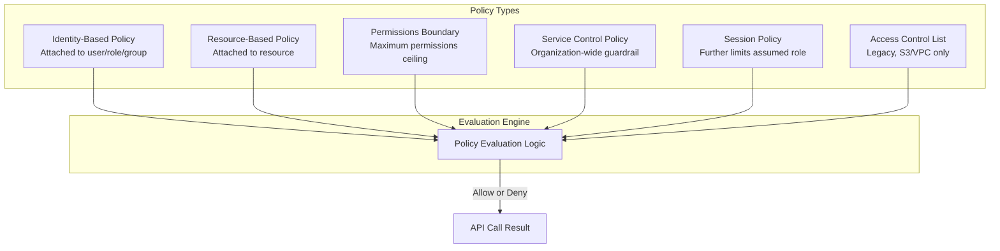
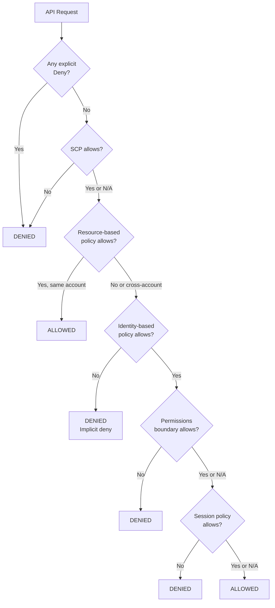
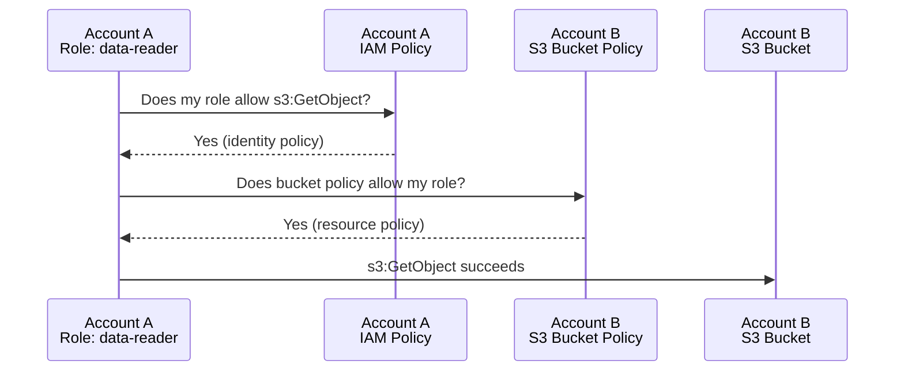
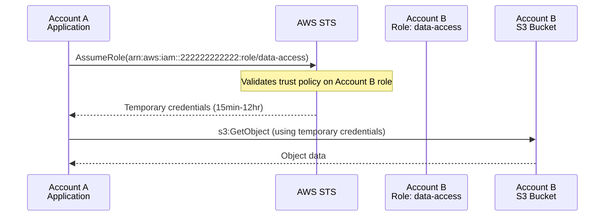
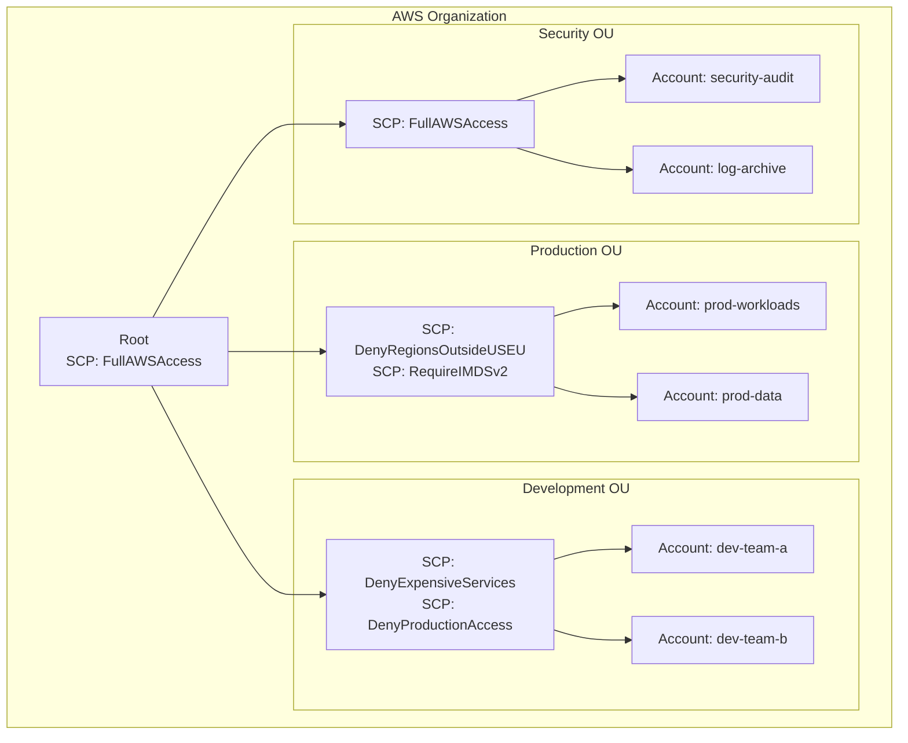
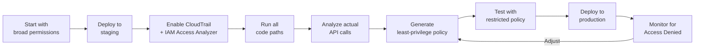
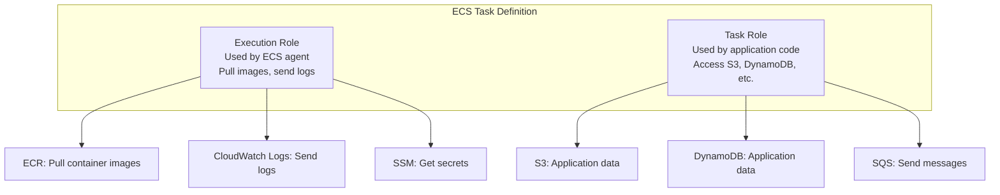
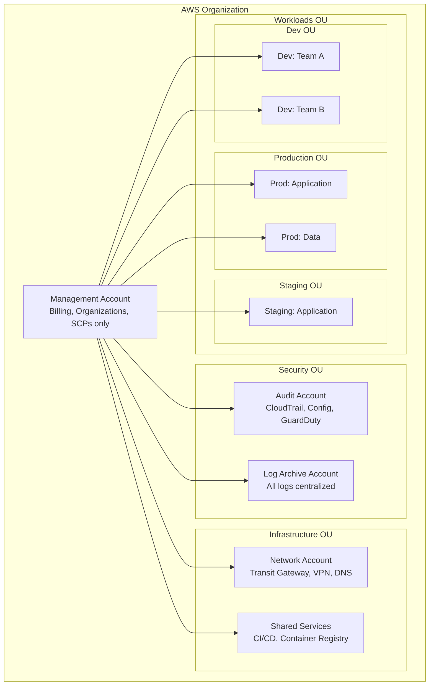
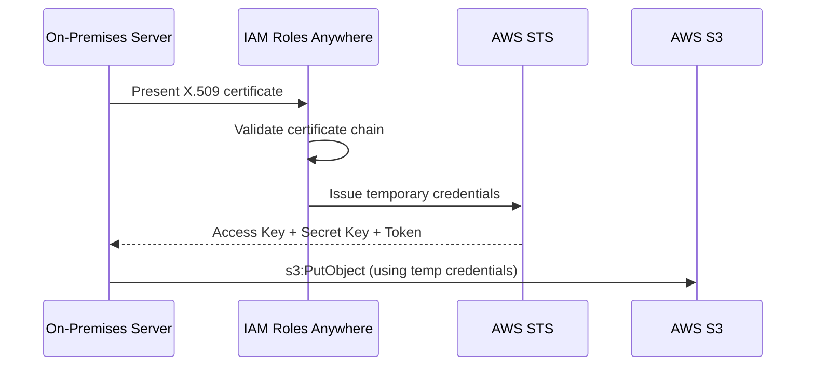

# AWS IAM Deep Dive

IAM is the single most important AWS service. Every API call to any AWS service passes through the IAM policy evaluation engine. A misconfigured IAM policy can expose your entire infrastructure to the internet or lock your team out of production. Yet most teams treat IAM as copy-paste boilerplate — "just give it admin and we'll fix it later." They never fix it later.

This guide covers IAM from the policy evaluation algorithm through production-grade patterns for multi-account organizations.

---

## 1. Why IAM Exists: The Problem It Solves

In the early days of AWS (2006), you had a single root account with a single access key. Anyone with that key could do anything — launch instances, delete S3 buckets, access billing. There was no concept of limited permissions.

IAM (launched 2011) introduced:
- **Multiple identities** (users, roles) within a single account
- **Fine-grained permissions** (allow PutObject on one S3 bucket, deny DeleteTable on DynamoDB)
- **Temporary credentials** (assume a role, get time-limited keys)
- **Federation** (use your corporate directory instead of managing IAM users)

Every modern AWS security practice — least privilege, zero trust, audit logging — is built on IAM.

---

## 2. First Principles: The IAM Data Model

### Principals

A principal is an entity that can make API calls to AWS:

| Principal Type | What It Is | When to Use |
|---------------|-----------|-------------|
| Root user | The account itself | Never (except billing, account closure) |
| IAM User | Long-lived identity with credentials | CI/CD pipelines (being deprecated in favor of roles) |
| IAM Role | Assumable identity with temporary credentials | Everything else |
| Federated user | External identity (SSO, SAML, OIDC) | Human access |
| Service | AWS service acting on your behalf | Lambda, ECS, EC2 |

### Policies

A policy is a JSON document that defines permissions. There are six types:



### Policy Structure

Every IAM policy follows this structure:

```json
{
  "Version": "2012-10-17",
  "Statement": [
    {
      "Sid": "AllowS3ReadAccess",
      "Effect": "Allow",
      "Action": [
        "s3:GetObject",
        "s3:ListBucket"
      ],
      "Resource": [
        "arn:aws:s3:::my-bucket",
        "arn:aws:s3:::my-bucket/*"
      ],
      "Condition": {
        "StringEquals": {
          "s3:prefix": ["home/", "shared/"]
        }
      }
    }
  ]
}
```

The five elements:
1. **Effect** — `Allow` or `Deny`
2. **Action** — API actions (`s3:GetObject`, `ec2:RunInstances`)
3. **Resource** — ARNs the actions apply to
4. **Condition** — When the statement applies (IP range, time, tags, etc.)
5. **Principal** — Who the statement applies to (resource-based policies only)

---

## 3. The Policy Evaluation Algorithm

This is the most misunderstood aspect of IAM. The evaluation follows a strict algorithm:



### Key Rules

1. **Explicit deny always wins** — A single `Deny` statement overrides any number of `Allow` statements
2. **Default deny** — If no policy explicitly allows an action, it is denied
3. **SCPs are guardrails** — They cannot grant permissions, only restrict them
4. **Resource-based policies can grant cross-account access** — But only if the identity policy also allows it (or the resource policy specifies the exact role ARN)
5. **Permissions boundaries are ceilings** — The effective permission is the intersection of the identity policy and the boundary

### Mathematical Model

The effective permissions for a principal $P$ on resource $R$ can be expressed as:

$$\text{Effective}(P, R) = \begin{cases} \text{Deny} & \text{if } \exists \text{ explicit Deny in any policy} \\ \text{Allow} & \text{if } \text{Allow}_{IDP}(P) \cap \text{Allow}_{SCP} \cap \text{Allow}_{PB}(P) \cap \text{Allow}_{SP} \\ & \text{or } \text{Allow}_{RBP}(R) \text{ (same account)} \\ \text{Deny} & \text{otherwise (implicit deny)} \end{cases}$$

Where:
- $\text{Allow}_{IDP}(P)$ = identity-based policies attached to principal $P$
- $\text{Allow}_{SCP}$ = service control policies in the organizational path
- $\text{Allow}_{PB}(P)$ = permissions boundary attached to principal $P$
- $\text{Allow}_{SP}$ = session policies (if using assumed role with session policy)
- $\text{Allow}_{RBP}(R)$ = resource-based policy on resource $R$

---

## 4. Cross-Account Access

### The Two-Policy Requirement

For cross-account access, **both** accounts must grant permission:



**Account A — Identity Policy (on the role):**
```json
{
  "Version": "2012-10-17",
  "Statement": [
    {
      "Effect": "Allow",
      "Action": ["s3:GetObject", "s3:ListBucket"],
      "Resource": [
        "arn:aws:s3:::account-b-data-bucket",
        "arn:aws:s3:::account-b-data-bucket/*"
      ]
    }
  ]
}
```

**Account B — Resource Policy (on the S3 bucket):**
```json
{
  "Version": "2012-10-17",
  "Statement": [
    {
      "Effect": "Allow",
      "Principal": {
        "AWS": "arn:aws:iam::111111111111:role/data-reader"
      },
      "Action": ["s3:GetObject", "s3:ListBucket"],
      "Resource": [
        "arn:aws:s3:::account-b-data-bucket",
        "arn:aws:s3:::account-b-data-bucket/*"
      ]
    }
  ]
}
```

### Cross-Account Role Assumption

The more common (and preferred) pattern is cross-account role assumption:



**Account B — Trust Policy (on the role):**
```json
{
  "Version": "2012-10-17",
  "Statement": [
    {
      "Effect": "Allow",
      "Principal": {
        "AWS": "arn:aws:iam::111111111111:root"
      },
      "Action": "sts:AssumeRole",
      "Condition": {
        "StringEquals": {
          "sts:ExternalId": "unique-external-id-12345"
        }
      }
    }
  ]
}
```

::: warning
Always use an **External ID** for cross-account role assumption. Without it, you are vulnerable to the **confused deputy problem** — a malicious third party could trick your service into assuming a role in their account.
:::

---

## 5. Service Control Policies (SCPs)

### What SCPs Are

SCPs are the most powerful guardrails in AWS Organizations. They define the **maximum permissions** for all accounts in an organizational unit (OU). SCPs do not grant permissions — they only restrict what identity policies can do.



### Essential SCPs for Production

```json
// SCP: Deny access outside approved regions
{
  "Version": "2012-10-17",
  "Statement": [
    {
      "Sid": "DenyUnapprovedRegions",
      "Effect": "Deny",
      "NotAction": [
        "iam:*",
        "organizations:*",
        "sts:*",
        "support:*",
        "budgets:*",
        "cloudfront:*",
        "route53:*",
        "wafv2:*",
        "globalaccelerator:*"
      ],
      "Resource": "*",
      "Condition": {
        "StringNotEquals": {
          "aws:RequestedRegion": [
            "us-east-1",
            "us-west-2",
            "eu-west-1"
          ]
        }
      }
    }
  ]
}
```

```json
// SCP: Prevent disabling CloudTrail and GuardDuty
{
  "Version": "2012-10-17",
  "Statement": [
    {
      "Sid": "ProtectSecurityServices",
      "Effect": "Deny",
      "Action": [
        "cloudtrail:DeleteTrail",
        "cloudtrail:StopLogging",
        "cloudtrail:UpdateTrail",
        "guardduty:DeleteDetector",
        "guardduty:DisassociateFromMasterAccount",
        "guardduty:UpdateDetector",
        "config:DeleteConfigRule",
        "config:DeleteConfigurationRecorder",
        "config:DeleteDeliveryChannel",
        "config:StopConfigurationRecorder"
      ],
      "Resource": "*"
    }
  ]
}
```

```json
// SCP: Require IMDSv2 for EC2 instances
{
  "Version": "2012-10-17",
  "Statement": [
    {
      "Sid": "RequireIMDSv2",
      "Effect": "Deny",
      "Action": "ec2:RunInstances",
      "Resource": "arn:aws:ec2:*:*:instance/*",
      "Condition": {
        "StringNotEquals": {
          "ec2:MetadataHttpTokens": "required"
        }
      }
    }
  ]
}
```

---

## 6. Least Privilege: Practical Implementation

### The Problem with Least Privilege

In theory: give each identity only the permissions it needs. In practice: you do not know what permissions it needs until the code is written, tested, and running in production. This creates a chicken-and-egg problem.

### The Iterative Approach



### Step 1: Start with a Scoped Policy (Not Admin)

```json
{
  "Version": "2012-10-17",
  "Statement": [
    {
      "Sid": "AllowDynamoDBAccess",
      "Effect": "Allow",
      "Action": "dynamodb:*",
      "Resource": "arn:aws:dynamodb:us-east-1:123456789012:table/orders*"
    },
    {
      "Sid": "AllowS3Access",
      "Effect": "Allow",
      "Action": "s3:*",
      "Resource": [
        "arn:aws:s3:::order-uploads",
        "arn:aws:s3:::order-uploads/*"
      ]
    },
    {
      "Sid": "AllowSQSAccess",
      "Effect": "Allow",
      "Action": "sqs:*",
      "Resource": "arn:aws:sqs:us-east-1:123456789012:order-*"
    }
  ]
}
```

### Step 2: Use IAM Access Analyzer to Generate Policy

```typescript
// scripts/generate-least-privilege.ts
import {
  AccessAnalyzerClient,
  StartPolicyGenerationCommand,
  GetGeneratedPolicyCommand,
} from '@aws-sdk/client-accessanalyzer';
import {
  CloudTrailClient,
  LookupEventsCommand,
} from '@aws-sdk/client-cloudtrail';

async function generateLeastPrivilegePolicy(
  roleArn: string,
  trailArn: string,
  startDate: Date,
  endDate: Date,
): Promise<string> {
  const client = new AccessAnalyzerClient({ region: 'us-east-1' });

  // Start policy generation from CloudTrail data
  const startResponse = await client.send(new StartPolicyGenerationCommand({
    policyGenerationDetails: {
      principalArn: roleArn,
    },
    cloudTrailDetails: {
      trails: [{ cloudTrailArn: trailArn, allRegions: true }],
      accessRole: 'arn:aws:iam::123456789012:role/AccessAnalyzerRole',
      startTime: startDate,
      endTime: endDate,
    },
  }));

  const jobId = startResponse.jobId!;

  // Poll until complete
  let status = 'IN_PROGRESS';
  while (status === 'IN_PROGRESS') {
    await new Promise(resolve => setTimeout(resolve, 10000));

    const result = await client.send(new GetGeneratedPolicyCommand({ jobId }));
    status = result.jobDetails?.status ?? 'FAILED';

    if (status === 'SUCCEEDED') {
      return JSON.stringify(result.generatedPolicyResult?.generatedPolicies, null, 2);
    }
  }

  throw new Error('Policy generation failed: ' + status);
}
```

### Step 3: Refine to Minimal Actions

Replace wildcards with specific actions:

```json
{
  "Version": "2012-10-17",
  "Statement": [
    {
      "Sid": "DynamoDBOrdersTable",
      "Effect": "Allow",
      "Action": [
        "dynamodb:GetItem",
        "dynamodb:PutItem",
        "dynamodb:UpdateItem",
        "dynamodb:Query"
      ],
      "Resource": [
        "arn:aws:dynamodb:us-east-1:123456789012:table/orders",
        "arn:aws:dynamodb:us-east-1:123456789012:table/orders/index/*"
      ]
    },
    {
      "Sid": "S3OrderUploads",
      "Effect": "Allow",
      "Action": [
        "s3:GetObject",
        "s3:PutObject"
      ],
      "Resource": "arn:aws:s3:::order-uploads/*",
      "Condition": {
        "StringLike": {
          "s3:prefix": "uploads/*"
        }
      }
    },
    {
      "Sid": "SQSOrderProcessing",
      "Effect": "Allow",
      "Action": [
        "sqs:SendMessage",
        "sqs:ReceiveMessage",
        "sqs:DeleteMessage",
        "sqs:GetQueueAttributes"
      ],
      "Resource": "arn:aws:sqs:us-east-1:123456789012:order-processing"
    }
  ]
}
```

---

## 7. Permissions Boundaries

### What They Are

A permissions boundary is an IAM policy attached to a user or role that sets the **maximum permissions** that identity-based policies can grant. Think of it as a ceiling:

$$\text{Effective Permissions} = \text{Identity Policy} \cap \text{Permissions Boundary}$$

### Use Case: Delegated Administration

Allow developers to create IAM roles for their Lambda functions, but only with permissions they themselves have:

```json
// Permissions boundary — the maximum a developer-created role can have
{
  "Version": "2012-10-17",
  "Statement": [
    {
      "Sid": "AllowedServices",
      "Effect": "Allow",
      "Action": [
        "dynamodb:*",
        "s3:*",
        "sqs:*",
        "sns:*",
        "lambda:*",
        "logs:*",
        "xray:*",
        "cloudwatch:*"
      ],
      "Resource": "*"
    },
    {
      "Sid": "DenyIAMEscalation",
      "Effect": "Deny",
      "Action": [
        "iam:CreateUser",
        "iam:CreateRole",
        "iam:AttachRolePolicy",
        "iam:PutRolePolicy",
        "iam:DeleteRolePolicy",
        "iam:DetachRolePolicy"
      ],
      "Resource": "*",
      "Condition": {
        "StringNotEquals": {
          "iam:PermissionsBoundary": "arn:aws:iam::123456789012:policy/DeveloperBoundary"
        }
      }
    }
  ]
}
```

```json
// Developer's policy — allows creating roles with the boundary
{
  "Version": "2012-10-17",
  "Statement": [
    {
      "Sid": "CreateRolesWithBoundary",
      "Effect": "Allow",
      "Action": [
        "iam:CreateRole",
        "iam:AttachRolePolicy",
        "iam:PutRolePolicy"
      ],
      "Resource": "arn:aws:iam::123456789012:role/app-*",
      "Condition": {
        "StringEquals": {
          "iam:PermissionsBoundary": "arn:aws:iam::123456789012:policy/DeveloperBoundary"
        }
      }
    }
  ]
}
```

---

## 8. IAM Roles for Services

### Lambda Execution Role

```hcl
# Minimal Lambda execution role
resource "aws_iam_role" "lambda_exec" {
  name = "order-api-lambda-role"

  assume_role_policy = jsonencode({
    Version = "2012-10-17"
    Statement = [
      {
        Action = "sts:AssumeRole"
        Effect = "Allow"
        Principal = {
          Service = "lambda.amazonaws.com"
        }
      }
    ]
  })
}

# Basic execution — CloudWatch Logs
resource "aws_iam_role_policy_attachment" "lambda_basic" {
  role       = aws_iam_role.lambda_exec.name
  policy_arn = "arn:aws:iam::aws:policy/service-role/AWSLambdaBasicExecutionRole"
}

# VPC access (if Lambda is in VPC)
resource "aws_iam_role_policy_attachment" "lambda_vpc" {
  role       = aws_iam_role.lambda_exec.name
  policy_arn = "arn:aws:iam::aws:policy/service-role/AWSLambdaVPCAccessExecutionRole"
}

# Application-specific permissions
resource "aws_iam_role_policy" "lambda_app" {
  name = "order-api-app-policy"
  role = aws_iam_role.lambda_exec.id

  policy = jsonencode({
    Version = "2012-10-17"
    Statement = [
      {
        Sid    = "DynamoDBAccess"
        Effect = "Allow"
        Action = [
          "dynamodb:GetItem",
          "dynamodb:PutItem",
          "dynamodb:UpdateItem",
          "dynamodb:Query",
        ]
        Resource = [
          aws_dynamodb_table.orders.arn,
          "${aws_dynamodb_table.orders.arn}/index/*",
        ]
      },
      {
        Sid    = "SQSSendMessages"
        Effect = "Allow"
        Action = [
          "sqs:SendMessage",
        ]
        Resource = aws_sqs_queue.order_processing.arn
      },
    ]
  })
}
```

### ECS Task Role vs. Execution Role



```hcl
# ECS execution role — for the ECS agent
resource "aws_iam_role" "ecs_execution" {
  name = "ecs-execution-role"

  assume_role_policy = jsonencode({
    Version = "2012-10-17"
    Statement = [{
      Action = "sts:AssumeRole"
      Effect = "Allow"
      Principal = { Service = "ecs-tasks.amazonaws.com" }
    }]
  })
}

resource "aws_iam_role_policy_attachment" "ecs_execution_default" {
  role       = aws_iam_role.ecs_execution.name
  policy_arn = "arn:aws:iam::aws:policy/service-role/AmazonECSTaskExecutionRolePolicy"
}

# ECS task role — for your application code
resource "aws_iam_role" "ecs_task" {
  name = "order-service-task-role"

  assume_role_policy = jsonencode({
    Version = "2012-10-17"
    Statement = [{
      Action = "sts:AssumeRole"
      Effect = "Allow"
      Principal = { Service = "ecs-tasks.amazonaws.com" }
    }]
  })
}
```

---

## 9. Condition Keys: The Power Feature

IAM conditions are where policies go from "broad" to "surgical." Conditions let you restrict actions based on request context.

### Common Condition Keys

| Condition Key | Use Case | Example |
|--------------|----------|---------|
| `aws:SourceIp` | Restrict to corporate IP | `"aws:SourceIp": "203.0.113.0/24"` |
| `aws:PrincipalOrgID` | Restrict to organization | `"aws:PrincipalOrgID": "o-abc123"` |
| `aws:RequestedRegion` | Region restriction | `"aws:RequestedRegion": "us-east-1"` |
| `aws:PrincipalTag/*` | ABAC (attribute-based) | `"aws:PrincipalTag/team": "platform"` |
| `aws:ResourceTag/*` | Tag-based access | `"aws:ResourceTag/env": "prod"` |
| `s3:prefix` | S3 path restriction | `"s3:prefix": ["home/user1/*"]` |
| `ec2:ResourceTag/*` | EC2 tag-based access | `"ec2:ResourceTag/Project": "web"` |
| `aws:MultiFactorAuthPresent` | Require MFA | `"aws:MultiFactorAuthPresent": "true"` |
| `aws:SecureTransport` | Require HTTPS | `"aws:SecureTransport": "true"` |

### Attribute-Based Access Control (ABAC)

ABAC uses tags on both principals and resources to determine access. Instead of managing separate policies for each team, you write one policy that uses tags:

```json
{
  "Version": "2012-10-17",
  "Statement": [
    {
      "Sid": "ABACAccessToTeamResources",
      "Effect": "Allow",
      "Action": [
        "ec2:StartInstances",
        "ec2:StopInstances",
        "ec2:TerminateInstances",
        "rds:StartDBInstance",
        "rds:StopDBInstance"
      ],
      "Resource": "*",
      "Condition": {
        "StringEquals": {
          "aws:ResourceTag/team": "${aws:PrincipalTag/team}"
        }
      }
    }
  ]
}
```

This single policy lets:
- Team "platform" manage resources tagged `team=platform`
- Team "payments" manage resources tagged `team=payments`
- Team "search" manage resources tagged `team=search`

No policy changes needed when you add a new team — just tag the principal and resources correctly.

---

## 10. Common Privilege Escalation Paths

Understanding how attackers escalate privileges in AWS is critical for defense.

### Path 1: iam:PassRole + Service Creation

If a user can pass a high-privilege role to a service (Lambda, EC2, ECS), they effectively have that role's permissions:

```
User has: iam:PassRole + lambda:CreateFunction + lambda:InvokeFunction
High-privilege role exists: AdminRole
Attack: Create Lambda with AdminRole, invoke it to do anything
```

**Mitigation:**
```json
{
  "Sid": "RestrictPassRole",
  "Effect": "Allow",
  "Action": "iam:PassRole",
  "Resource": "arn:aws:iam::123456789012:role/app-*",
  "Condition": {
    "StringEquals": {
      "iam:PassedToService": "lambda.amazonaws.com"
    }
  }
}
```

### Path 2: iam:CreatePolicyVersion

A user who can create a new version of a managed policy can modify any policy to grant themselves admin:

```
User has: iam:CreatePolicyVersion
Attack: Create new version of their attached policy with Action: "*", Resource: "*"
```

**Mitigation:** Never grant `iam:CreatePolicyVersion` without strict resource constraints.

### Path 3: iam:AttachUserPolicy / iam:AttachRolePolicy

A user who can attach policies to themselves can attach `AdministratorAccess`:

**Mitigation:** Use permissions boundaries to cap the maximum permissions.

### Path 4: sts:AssumeRole on Wildcard

```json
// DANGEROUS
{
  "Effect": "Allow",
  "Action": "sts:AssumeRole",
  "Resource": "*"
}
```

This lets the user assume ANY role in the account (and potentially cross-account roles). Always restrict to specific role ARNs.

::: danger
Run regular privilege escalation audits using tools like [Cloudsplaining](https://github.com/salesforce/cloudsplaining), [PMapper](https://github.com/nccgroup/PMapper), or [IAM Vulnerable](https://github.com/BishopFox/iam-vulnerable). These tools map the graph of all possible escalation paths in your account.
:::

---

## 11. Production IAM Architecture

### Multi-Account Strategy



### Identity Center (SSO) Configuration

```hcl
# AWS Identity Center (formerly SSO) with Terraform
resource "aws_ssoadmin_permission_set" "admin" {
  name             = "AdministratorAccess"
  instance_arn     = data.aws_ssoadmin_instances.this.arns[0]
  session_duration = "PT4H"  # 4 hours max session

  tags = {
    ManagedBy = "terraform"
  }
}

resource "aws_ssoadmin_managed_policy_attachment" "admin" {
  instance_arn       = data.aws_ssoadmin_instances.this.arns[0]
  permission_set_arn = aws_ssoadmin_permission_set.admin.arn
  managed_policy_arn = "arn:aws:iam::aws:policy/AdministratorAccess"
}

resource "aws_ssoadmin_permission_set" "readonly" {
  name             = "ReadOnlyAccess"
  instance_arn     = data.aws_ssoadmin_instances.this.arns[0]
  session_duration = "PT8H"

  tags = {
    ManagedBy = "terraform"
  }
}

resource "aws_ssoadmin_permission_set" "developer" {
  name             = "DeveloperAccess"
  instance_arn     = data.aws_ssoadmin_instances.this.arns[0]
  session_duration = "PT8H"

  tags = {
    ManagedBy = "terraform"
  }
}

resource "aws_ssoadmin_permission_set_inline_policy" "developer" {
  instance_arn       = data.aws_ssoadmin_instances.this.arns[0]
  permission_set_arn = aws_ssoadmin_permission_set.developer.arn

  inline_policy = jsonencode({
    Version = "2012-10-17"
    Statement = [
      {
        Effect = "Allow"
        Action = [
          "lambda:*",
          "dynamodb:*",
          "s3:*",
          "sqs:*",
          "sns:*",
          "logs:*",
          "cloudwatch:*",
          "xray:*",
          "apigateway:*",
          "ecs:*",
          "ecr:*",
        ]
        Resource = "*"
      },
      {
        Effect   = "Deny"
        Action   = ["iam:*", "organizations:*", "account:*"]
        Resource = "*"
      },
    ]
  })
}
```

---

## 12. Edge Cases and Failure Modes

### The NotAction Trap

`NotAction` is **not** a deny — it is an allow for everything **except** the listed actions:

```json
// This ALLOWS everything except IAM actions — including billing, organizations, etc.
{
  "Effect": "Allow",
  "NotAction": "iam:*",
  "Resource": "*"
}
```

### The Resource: * with Conditions Pitfall

Some actions do not support resource-level restrictions. If you use `Resource: *` with conditions, and the action does not support the condition key, the condition is **ignored** and the action is unrestricted.

### Policy Size Limits

| Policy Type | Size Limit |
|-------------|-----------|
| Managed policy | 6,144 characters |
| Inline policy (per role) | 10,240 characters |
| Trust policy | 2,048 characters |
| Total managed policies per role | 10 (default, can request increase to 20) |
| Total inline policies per role | Unlimited (but size limit applies) |

::: info War Story
A fintech company had a Lambda function that needed access to 200+ DynamoDB tables (multi-tenant architecture, one table per customer). Their IAM policy listing all 200 table ARNs exceeded the 6,144 character limit for managed policies. They switched to tag-based access control (ABAC) — tagging all tables with `service=payment-processor` and using a condition `"aws:ResourceTag/service": "payment-processor"` — reducing the policy to 15 lines regardless of how many tables existed.
:::

---

## 13. Performance Characteristics

### Policy Evaluation Latency

IAM policy evaluation adds latency to every AWS API call:

| Factor | Impact |
|--------|--------|
| Number of policies | ~0.1-0.5ms per additional policy |
| Policy complexity | Negligible (string matching) |
| Cross-account | +10-50ms (STS overhead for AssumeRole) |
| Condition evaluation | +0.1ms per condition |
| Total typical overhead | 1-5ms |

### IAM API Throttling

| API | Rate Limit | Notes |
|-----|-----------|-------|
| `sts:AssumeRole` | 500/sec (account level) | Can request increase |
| `iam:GetRole` | 15/sec | Shared across all IAM read APIs |
| `iam:CreateRole` | 5/sec | Shared with write APIs |
| `iam:SimulatePrincipalPolicy` | 5/sec | Useful for testing |

---

## 14. Decision Framework

### When to Use Each Policy Type

| Scenario | Policy Type | Why |
|----------|------------|-----|
| Lambda needs S3 access | Identity-based (on role) | Standard service permissions |
| S3 bucket shared cross-account | Resource-based (bucket policy) | Grant access without role assumption |
| Block all users from deleting trails | SCP | Organization-wide guardrail |
| Developers can create roles but not admin | Permissions boundary | Cap maximum delegation |
| Temporary elevated access | Session policy + AssumeRole | Time-limited escalation |

### IAM Anti-Patterns

| Anti-Pattern | Why It Is Bad | What to Do Instead |
|-------------|--------------|-------------------|
| `"Action": "*"` | Grants all actions | List specific actions |
| `"Resource": "*"` | Applies to all resources | Use ARNs or conditions |
| Long-lived access keys | Keys do not rotate, can be leaked | Use roles + temporary credentials |
| Sharing IAM users | No audit trail per person | One user per human, or use SSO |
| Inline policies everywhere | Hard to audit, cannot reuse | Use managed policies |
| No MFA on console users | Credential theft risk | Require MFA via condition key |

---

## 15. Advanced Topics

### IAM Roles Anywhere (Hybrid/On-Premises)

For workloads running outside AWS that need AWS credentials, IAM Roles Anywhere uses X.509 certificates to issue temporary credentials:



### Policy Simulation API

Test policies before deploying them:

```typescript
import { IAMClient, SimulatePrincipalPolicyCommand } from '@aws-sdk/client-iam';

async function testPolicy(
  principalArn: string,
  actions: string[],
  resources: string[],
): Promise<Map<string, string>> {
  const client = new IAMClient({ region: 'us-east-1' });

  const response = await client.send(new SimulatePrincipalPolicyCommand({
    PolicySourceArn: principalArn,
    ActionNames: actions,
    ResourceArns: resources,
  }));

  const results = new Map<string, string>();
  for (const result of response.EvaluationResults ?? []) {
    results.set(result.EvalActionName!, result.EvalDecision!);
  }
  return results;
}

// Usage
const results = await testPolicy(
  'arn:aws:iam::123456789012:role/order-api-lambda-role',
  ['dynamodb:PutItem', 'dynamodb:DeleteTable', 's3:DeleteBucket'],
  [
    'arn:aws:dynamodb:us-east-1:123456789012:table/orders',
    'arn:aws:s3:::order-uploads',
  ]
);

// Expected output:
// dynamodb:PutItem -> allowed
// dynamodb:DeleteTable -> implicitDeny
// s3:DeleteBucket -> implicitDeny
```

### Automated Compliance Checking

```typescript
// compliance/iam-audit.ts — Automated IAM compliance checks
import { IAMClient, ListRolesCommand, ListAttachedRolePoliciesCommand,
         GetPolicyVersionCommand, GetPolicyCommand } from '@aws-sdk/client-iam';

interface ComplianceViolation {
  roleArn: string;
  policyArn: string;
  violation: string;
  severity: 'critical' | 'high' | 'medium' | 'low';
}

async function auditIAMPolicies(): Promise<ComplianceViolation[]> {
  const client = new IAMClient({ region: 'us-east-1' });
  const violations: ComplianceViolation[] = [];

  const rolesResponse = await client.send(new ListRolesCommand({}));

  for (const role of rolesResponse.Roles ?? []) {
    const policiesResponse = await client.send(new ListAttachedRolePoliciesCommand({
      RoleName: role.RoleName,
    }));

    for (const attachedPolicy of policiesResponse.AttachedPolicies ?? []) {
      // Skip AWS managed policies
      if (attachedPolicy.PolicyArn?.startsWith('arn:aws:iam::aws:policy/')) continue;

      const policyResponse = await client.send(new GetPolicyCommand({
        PolicyArn: attachedPolicy.PolicyArn,
      }));

      const versionResponse = await client.send(new GetPolicyVersionCommand({
        PolicyArn: attachedPolicy.PolicyArn,
        VersionId: policyResponse.Policy?.DefaultVersionId,
      }));

      const policyDoc = JSON.parse(
        decodeURIComponent(versionResponse.PolicyVersion?.Document ?? '{}')
      );

      for (const statement of policyDoc.Statement ?? []) {
        if (statement.Effect !== 'Allow') continue;

        // Check for wildcard actions
        const actions = Array.isArray(statement.Action) ? statement.Action : [statement.Action];
        if (actions.includes('*')) {
          violations.push({
            roleArn: role.Arn!,
            policyArn: attachedPolicy.PolicyArn!,
            violation: 'Wildcard action (*) in Allow statement',
            severity: 'critical',
          });
        }

        // Check for wildcard resources with sensitive actions
        const resources = Array.isArray(statement.Resource) ? statement.Resource : [statement.Resource];
        if (resources.includes('*')) {
          const sensitiveActions = actions.filter((a: string) =>
            a.startsWith('iam:') || a.startsWith('sts:') || a.startsWith('organizations:')
          );
          if (sensitiveActions.length > 0) {
            violations.push({
              roleArn: role.Arn!,
              policyArn: attachedPolicy.PolicyArn!,
              violation: `Sensitive actions with wildcard resource: ${sensitiveActions.join(', ')}`,
              severity: 'high',
            });
          }
        }

        // Check for missing conditions on sensitive actions
        if (!statement.Condition && actions.some((a: string) => a.includes('Delete') || a.includes('Terminate'))) {
          violations.push({
            roleArn: role.Arn!,
            policyArn: attachedPolicy.PolicyArn!,
            violation: 'Destructive actions without conditions',
            severity: 'medium',
          });
        }
      }
    }
  }

  return violations;
}
```

---

## See Also

- [VPC Networking Deep Dive](./vpc-networking.md) — Network security complements IAM
- [Lambda Deep Dive](./lambda.md) — Lambda execution roles and permissions
- [Well-Architected Framework](./well-architected.md) — Security pillar covers IAM best practices
- [Cost Optimization](./cost-optimization.md) — IAM and billing account separation
