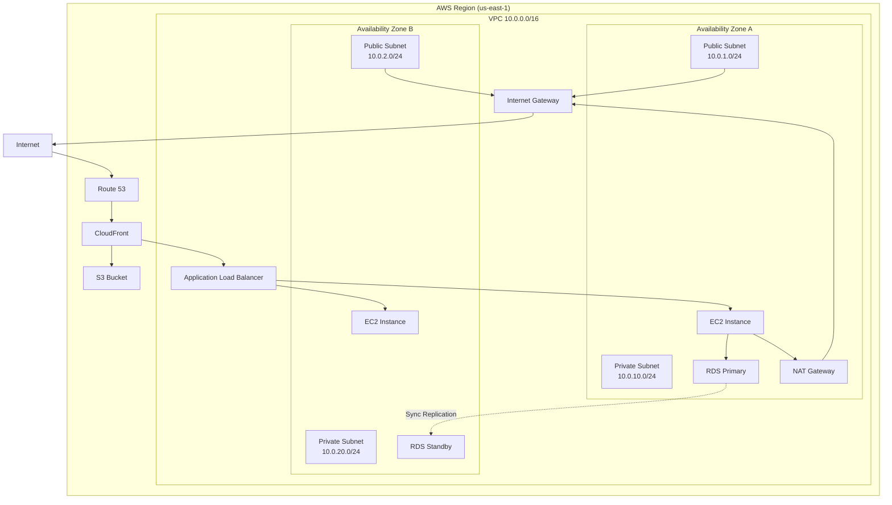

# AWS for Engineers: Complete Overview

Amazon Web Services launched in 2006 with S3 and EC2. By 2026 it hosts over 200 services across 36 geographic regions, serving the majority of the internet's infrastructure. Understanding AWS is not about memorizing a service catalog — it is about internalizing the mental models that make distributed systems on AWS composable, reliable, and cost-efficient.

This page gives you the map. The nine pages linked below are the territory.

---

## 1. Why AWS Exists: The Problem It Solves

Before cloud computing, engineering teams had to:

- **Buy physical hardware** — capital expenditure, 6-12 week lead times
- **Provision capacity for peak load** — paying for servers that sat idle 90% of the time
- **Build and maintain data centers** — power, cooling, physical security, networking
- **Staff operations teams** — 24/7 on-call for hardware failures
- **Plan for redundancy manually** — buy twice the hardware for half the failure risk

AWS flipped this model. Instead of buying capacity, you rent it. Instead of provisioning for peak, you autoscale to meet demand. Instead of running data centers, you consume managed infrastructure that AWS maintains.

The economic model is profound: a startup can access the same quality of infrastructure as a Fortune 500 company, paying only for what it uses, starting from hour one.

---

## 2. AWS Global Infrastructure

AWS infrastructure exists at four levels: **Regions**, **Availability Zones**, **Edge Locations**, and **Local Zones**. Each level serves a different architectural purpose.

### Regions

A Region is a discrete geographic area — "us-east-1" (Northern Virginia), "eu-west-1" (Ireland), "ap-southeast-1" (Singapore). As of early 2026, AWS operates 36 regions with more announced.

Each Region is:
- **Independent** — an outage in us-east-1 does not affect eu-west-1
- **Legally distinct** — data you store in eu-west-1 stays in the EU by default (GDPR compliance)
- **Separately priced** — spot prices, data transfer rates, and service availability vary by region
- **Independently operated** — separate physical power, cooling, and network infrastructure

**Key decision: which Region to use?**

1. **Latency** — choose the region closest to your users
2. **Service availability** — not every service is available in every region (new services launch in us-east-1 first)
3. **Compliance** — data sovereignty laws may require specific regions (GDPR → eu-*, Australian Privacy Act → ap-southeast-2)
4. **Pricing** — us-east-1 is often cheapest for compute

### Availability Zones

Within each Region are 2-6 Availability Zones (AZs). Each AZ is one or more discrete data centers with independent:
- Power feeds and backup generators
- Cooling systems
- Physical security
- Networking connections to other AZs

AZs within a region are connected by private, high-bandwidth fiber — typically <2ms latency between them. This is fast enough to run synchronous database replication, which is the foundation of Multi-AZ deployments.

**The fundamental reliability rule:** deploy across at least two AZs. If one AZ fails (rare, but it happens), your application stays up.

AZ names are randomized per account. When AWS says "us-east-1a" in your account, it may map to a different physical AZ than "us-east-1a" in someone else's account. This prevents everyone from defaulting to AZ "a" and overloading it.

### Edge Locations

Edge Locations are Points of Presence (PoPs) distributed globally — over 550 as of 2026. They run:
- **CloudFront** — CDN caching
- **Route 53** — DNS resolution
- **AWS Shield** — DDoS protection at the edge
- **Lambda@Edge** / **CloudFront Functions** — edge compute

Edge Locations do not run general-purpose AWS services. You cannot launch an EC2 instance at an edge location. Their purpose is to reduce latency for globally distributed users by caching content and resolving DNS close to end users.

### Local Zones

Local Zones are extensions of AWS Regions placed closer to large population centers that are geographically distant from the nearest full Region. For example, AWS has Local Zones in Los Angeles, Chicago, Dallas, and several other cities.

Local Zones support a subset of AWS services (EC2, EBS, ECS, VPC) and are connected to the parent Region. They are designed for workloads requiring <10ms latency to specific metros — game streaming, media rendering, real-time analytics.

**When to use Local Zones:** your users are concentrated in a specific city that is far from the nearest Region, and latency is a primary concern.

---

## 3. Shared Responsibility Model

The most important conceptual model in cloud security. AWS and the customer share security responsibility — but the boundary is often misunderstood.

| Layer | AWS Responsible | You Responsible |
|-------|----------------|-----------------|
| Physical data centers | Yes | No |
| Hardware (servers, switches) | Yes | No |
| Virtualization layer | Yes | No |
| Host operating system | Yes | No |
| Network infrastructure | Yes | No |
| Managed service internals (RDS engine patches) | Yes | No |
| Guest OS (EC2 instances) | No | Yes |
| Application code | No | Yes |
| IAM configurations and access policies | No | Yes |
| Data encryption (you hold the keys) | No | Yes |
| Network traffic rules (Security Groups, NACLs) | No | Yes |
| Patching your EC2 OS | No | Yes |

The key insight: **as you move up the abstraction stack (EC2 → ECS Fargate → Lambda → managed services), you cede more control but AWS assumes more responsibility**.

With EC2, you patch the OS, secure SSH, manage the runtime. With Lambda, AWS manages all of that — you only manage your function code and IAM roles.

This trade-off is not purely about security. It is also about operational burden. Choosing a higher-level service reduces your attack surface and your on-call burden simultaneously.

---

## 4. AWS Account Structure

### Root Account

Every AWS account has a root user — the email and password used to sign up. The root user has unconditional access to everything in the account and **cannot be restricted by IAM policies**.

**Best practice:** Lock up the root account.
1. Enable MFA on root — hardware MFA key preferred
2. Delete root access keys immediately
3. Never use root for daily operations
4. Store root credentials in a password manager accessible only to specific individuals

The root account is only needed for a small set of tasks: closing the account, changing account contact info, changing support plan, removing MFA after lockout.

### IAM Users, Groups, and Roles

Within an account, you create **IAM Users** for human access and **IAM Roles** for programmatic/service access.

- **IAM User:** has long-lived credentials (password + access keys). Should have MFA enabled.
- **IAM Group:** collection of users. Attach policies to groups, not individual users.
- **IAM Role:** has no credentials — entities assume roles temporarily. EC2 instances, Lambda functions, ECS tasks, and cross-account access all use roles.

**Modern recommendation:** Do not create IAM Users for human access. Use AWS IAM Identity Center (SSO) instead. Employees authenticate via your identity provider (Okta, Active Directory, Google Workspace) and get temporary credentials scoped to specific accounts.

### AWS Organizations

At production scale, you run multiple AWS accounts — not one large one. Reasons:

1. **Blast radius** — a misconfiguration in the dev account cannot affect production
2. **Billing separation** — charge teams or products to specific accounts
3. **Service quotas** — each account gets its own quotas (avoiding noisy neighbor issues)
4. **Security isolation** — compromise of one account does not mean access to all

AWS Organizations is the service that manages multiple accounts centrally:

- **Management account** (formerly "master account") — pays the bills, manages organization
- **Member accounts** — workload accounts: dev, staging, production, security, logging, shared-services
- **Organizational Units (OUs)** — hierarchical groupings of accounts (e.g., Production OU, Sandbox OU)

### Service Control Policies (SCPs)

SCPs are IAM-like policies attached to OUs or individual accounts. They define the **maximum permissions** any principal in that account can have. Even if a user in the account has AdministratorAccess, an SCP can prevent them from using certain services or regions.

Common SCP examples:
```json
{
  "Effect": "Deny",
  "Action": "*",
  "Resource": "*",
  "Condition": {
    "StringNotEquals": {
      "aws:RequestedRegion": ["us-east-1", "us-west-2", "eu-west-1"]
    }
  }
}
```

This SCP denies all API calls to regions outside the approved list — a powerful guardrail preventing accidental resource creation in unexpected regions.

---

## 5. AWS Infrastructure Architecture: VPC and Core Services



This diagram represents the canonical multi-AZ web application architecture on AWS. Nearly everything you build will resemble some variation of this pattern.

---

## 6. Key Services Engineers Use Daily

### VPC — Virtual Private Cloud

Your private network within AWS. Every resource you deploy lives in a VPC. You define the IP range, create subnets, control routing, and set firewall rules.

Every engineer needs to understand VPC deeply — it is the foundation everything else sits on.

→ [VPC Networking Deep Dive](./vpc-networking.md)

### EC2 — Elastic Compute Cloud

Virtual machines in the cloud. EC2 is the lowest-level compute primitive on AWS. You choose the operating system, instance type (CPU/memory/storage/network profile), and networking configuration.

EC2 instance families:
- **General purpose (m7g, m7i):** balanced CPU/memory — application servers
- **Compute optimized (c7g, c7i):** high CPU-to-memory — web frontends, media encoding
- **Memory optimized (r7g, r8g):** high memory — caches, in-memory databases
- **Storage optimized (i4i, d3):** local NVMe SSDs — databases, analytics
- **Accelerated (p4, g5):** GPU — ML training, graphics

EC2 is often replaced by higher-level services (ECS, EKS, Lambda) for application workloads. Direct EC2 usage remains appropriate for databases, specialized software, and lift-and-shift migrations.

### ECS and EKS — Container Orchestration

Run Docker containers at scale. ECS is the AWS-native orchestrator; EKS runs Kubernetes managed by AWS.

→ [ECS vs EKS Decision Guide](./ecs-vs-eks.md)

### RDS and Aurora — Managed Relational Databases

RDS runs PostgreSQL, MySQL, MariaDB, Oracle, and SQL Server with automated backups, Multi-AZ failover, and read replicas. Aurora is AWS's cloud-native database engine compatible with PostgreSQL and MySQL but with significantly higher throughput.

→ [RDS and Aurora Deep Dive](./rds-aurora.md)

### ElastiCache — Managed Redis and Memcached

Managed in-memory caching. ElastiCache handles cluster management, failover, backups, and scaling for Redis and Memcached.

→ [ElastiCache Deep Dive](./elasticache.md)

### S3 — Simple Storage Service

Object storage. S3 is not a filesystem — it stores objects (files) addressed by a key. It is infinitely scalable, extremely durable (11 nines — 99.999999999%), and the foundation of countless AWS architectures.

→ [S3 and CloudFront Deep Dive](./s3-cloudfront.md)

### CloudFront — Content Delivery Network

AWS's CDN. Caches content at 550+ edge locations globally. Works with S3, load balancers, and custom origins. Reduces latency, reduces origin load, and reduces egress costs.

→ [S3 and CloudFront Deep Dive](./s3-cloudfront.md)

### Lambda — Serverless Compute

Event-driven, stateless function execution. You write a function handler; Lambda handles provisioning, scaling, and the underlying compute. Pay per millisecond of execution.

→ [AWS Lambda Deep Dive](./lambda.md)

### IAM — Identity and Access Management

Controls who can do what to which AWS resources. Every API call in AWS is authenticated via IAM. Getting IAM wrong is how companies get breached.

→ [IAM Deep Dive](./iam-deep-dive.md)

---

## 7. The AWS Mental Model

### Build in Regions, Redundancy Across AZs

The fundamental architectural principle: deploy your application in a single Region (chosen for latency + compliance), but spread it across multiple AZs within that Region.

Multi-Region architectures exist and are appropriate for specific requirements (global latency < 50ms, compliance, extreme availability targets), but they add significant complexity. Start with multi-AZ, move to multi-Region when you have a concrete requirement.

### Managed Services Over DIY

Every hour your team spends managing infrastructure is an hour not spent building product. AWS offers managed versions of nearly every common infrastructure component: databases (RDS), caches (ElastiCache), message queues (SQS), search (OpenSearch), streaming (Kinesis). The managed version is typically more reliable, more secure, and requires less operational work than running the same software yourself.

The trade-off is cost (managed services carry a premium) and flexibility (you cannot tune every parameter). This trade-off is almost always worth making.

### Everything is API-driven

Every AWS action — creating a VPC, launching an EC2 instance, configuring an S3 bucket — is an API call. This means:
- Everything can be automated (Terraform, CloudFormation, AWS CDK)
- Everything is auditable (CloudTrail logs every API call)
- Permissions can be controlled at a granular level (IAM)

**Never click through the console to configure production infrastructure.** Use Infrastructure as Code. The console is for exploration and debugging only.

### Pay for What You Use

The pricing model rewards efficiency. An idle EC2 instance costs the same as a busy one. Oversized databases cost money. Data transfer adds up quickly. Understanding AWS pricing is a core engineering skill — see the cost optimization guide.

→ [AWS Cost Optimization](./cost-optimization.md)

---

## 8. AWS CLI and SDK Fundamentals

### AWS CLI

The AWS CLI is the primary interface for scripting and exploration.

```bash
# Install
pip install awscli

# Configure credentials (interactive)
aws configure

# Or set environment variables (preferred in CI/CD)
export AWS_ACCESS_KEY_ID=AKIA...
export AWS_SECRET_ACCESS_KEY=...
export AWS_DEFAULT_REGION=us-east-1

# Common patterns
aws s3 ls s3://my-bucket/
aws ec2 describe-instances --filters "Name=tag:Environment,Values=production"
aws ecs list-clusters
aws rds describe-db-instances
aws logs tail /aws/lambda/my-function --follow

# Use --output for different formats
aws ec2 describe-instances --output json
aws ec2 describe-instances --output table
aws ec2 describe-instances --output text
aws ec2 describe-instances --query 'Reservations[*].Instances[*].InstanceId' --output text

# Use profiles for multiple accounts
aws configure --profile staging
aws s3 ls --profile staging

# Assume a role
aws sts assume-role \
  --role-arn arn:aws:iam::123456789012:role/MyRole \
  --role-session-name mysession
```

### AWS SDK

AWS provides SDKs for all major languages. The JavaScript/TypeScript SDK v3 is the most common for Node.js applications:

```typescript
import { S3Client, GetObjectCommand } from "@aws-sdk/client-s3";

const client = new S3Client({ region: "us-east-1" });

const response = await client.send(
  new GetObjectCommand({
    Bucket: "my-bucket",
    Key: "path/to/object.json",
  })
);
```

Key SDK concepts:
- **Client per service** — instantiate `S3Client`, `DynamoDBClient`, etc.
- **Command pattern** — each operation is a `Command` object
- **Credential chain** — SDK looks for credentials in order: environment variables → shared credentials file → EC2 instance metadata → ECS task role → process credentials
- **Pagination** — use paginators for operations that return multiple pages

### Infrastructure as Code

For production infrastructure, use Terraform (or AWS CDK if your team prefers TypeScript/Python for IaC).

```hcl
# Minimal Terraform provider configuration
terraform {
  required_providers {
    aws = {
      source  = "hashicorp/aws"
      version = "~> 5.0"
    }
  }
  backend "s3" {
    bucket = "my-terraform-state"
    key    = "production/terraform.tfstate"
    region = "us-east-1"
  }
}

provider "aws" {
  region = var.aws_region
  default_tags {
    tags = {
      Environment = var.environment
      ManagedBy   = "terraform"
      Project     = var.project_name
    }
  }
}
```

---

## 9. AWS Service Quotas

Every AWS account has default limits (quotas) on resource usage. Common limits that engineers hit:

| Service | Default Quota | Notes |
|---------|--------------|-------|
| EC2 vCPUs (on-demand) | 32-1152 depending on family | Request increase proactively |
| VPCs per region | 5 | Easy to increase to 100+ |
| Elastic IPs | 5 | Each NAT GW needs one |
| RDS instances | 40 | Per region |
| Lambda concurrent executions | 1,000 | Regional, shared across functions |
| SQS queues | Unlimited | No practical limit |
| S3 buckets | 100 | Increase to 1,000 |

Always request quota increases **before** you need them. Quota increase requests can take days to process, and you do not want to be blocked on a quota during an incident or launch.

```bash
# Check current quotas
aws service-quotas list-service-quotas --service-code ec2

# Request increase
aws service-quotas request-service-quota-increase \
  --service-code ec2 \
  --quota-code L-1216C47A \
  --desired-value 256
```

---

## 10. Learning Path: AWS Deep Dives

| Topic | Page | Difficulty | Key Concepts |
|-------|------|------------|--------------|
| VPC Networking | [VPC Deep Dive](./vpc-networking.md) | Intermediate | Subnets, routing, NAT, peering, Transit Gateway |
| Container Orchestration | [ECS vs EKS](./ecs-vs-eks.md) | Intermediate | Fargate, task definitions, Kubernetes |
| Managed Databases | [RDS and Aurora](./rds-aurora.md) | Intermediate | Multi-AZ, read replicas, Aurora architecture |
| In-Memory Caching | [ElastiCache](./elasticache.md) | Intermediate | Redis cluster modes, eviction, failover |
| Object Storage + CDN | [S3 and CloudFront](./s3-cloudfront.md) | Beginner-Intermediate | Storage classes, lifecycle, CDN caching |
| Serverless Compute | [Lambda](./lambda.md) | Intermediate | Cold starts, concurrency, VPC, triggers |
| Access Control | [IAM Deep Dive](./iam-deep-dive.md) | Advanced | Policy evaluation, IRSA, OIDC federation |
| Cost Control | [Cost Optimization](./cost-optimization.md) | Intermediate | Savings Plans, Spot, right-sizing, data transfer |
| Architecture Principles | [Well-Architected](./well-architected.md) | Advanced | Six pillars, trade-offs, practical guidance |

---

## 11. Common Architecture Patterns

### Pattern 1: Standard Web Application

```
Route 53 → CloudFront → ALB → ECS Fargate → RDS Aurora + ElastiCache Redis
                    ↘ S3 (static assets)
```

This pattern handles the majority of web application workloads. Fargate removes EC2 management. Aurora handles the database. ElastiCache adds a caching layer. CloudFront offloads static assets and provides global distribution.

### Pattern 2: Event-Driven Processing

```
S3 Event / SQS / EventBridge → Lambda → DynamoDB / S3 / SNS
```

Serverless event processing. No servers to manage. Scales automatically. Pay only for invocations.

### Pattern 3: Microservices

```
Route 53 → ALB → EKS (multiple services) → RDS (per service) + ElastiCache
                                          → SQS (async communication)
```

Kubernetes-based microservices with separate data stores per service.

### Pattern 4: Data Pipeline

```
Kinesis Data Streams → Lambda / Firehose → S3 → Athena / Redshift
```

Real-time data ingestion and analytics.

---

## 12. What AWS Does Not Solve for You

AWS is not magic. It provides reliable, scalable infrastructure — but you still must:

1. **Design for failure** — services fail; your application must handle it gracefully
2. **Understand your data model** — a slow query on RDS is slow whether it is managed or not
3. **Secure your application** — IAM and VPC protect infrastructure; your code must protect application data
4. **Manage costs** — AWS bills grow unless you actively manage them
5. **Plan for capacity** — autoscaling has limits; provision adequate quotas
6. **Test disaster recovery** — backups and Multi-AZ are only valuable if recovery works when tested

The companies that fail on AWS typically fail not because AWS is unreliable, but because they did not design their applications to tolerate infrastructure failures that do occur (network blips, AZ outages, API throttling, cold starts).

---

## 13. Further Resources

- [AWS Documentation](https://docs.aws.amazon.com) — authoritative, thorough
- [AWS Architecture Center](https://aws.amazon.com/architecture/) — reference architectures
- [AWS Well-Architected Labs](https://wellarchitectedlabs.com) — hands-on exercises
- [The Amazon Builders' Library](https://aws.amazon.com/builders-library/) — how Amazon builds reliable distributed systems (highly recommended)
- [AWS re:Invent talks on YouTube](https://www.youtube.com/c/amazonwebservices) — deep technical content
- [Last Week in AWS newsletter](https://www.lastweekinaws.com) — curated AWS news

The Builders' Library is particularly valuable — it describes patterns like exponential backoff, cell-based architecture, shuffle sharding, and avoiding thundering herds. These are the patterns Amazon uses internally, explained at depth.
