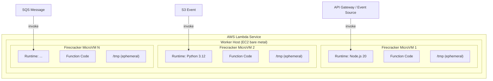
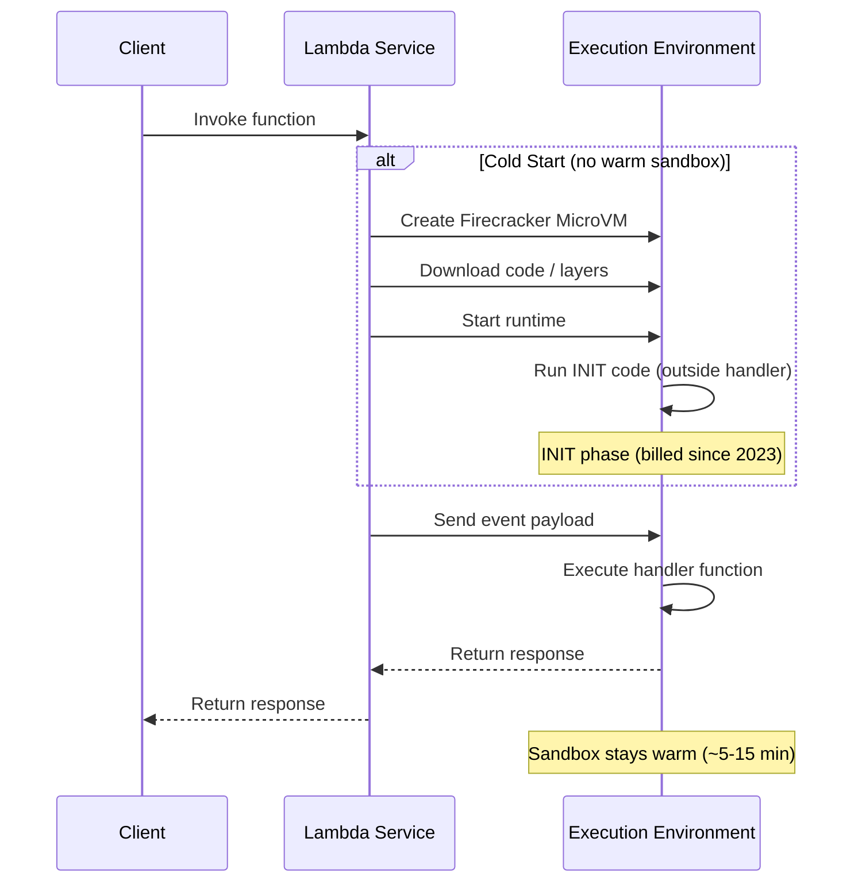
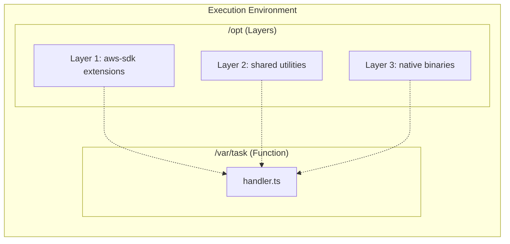
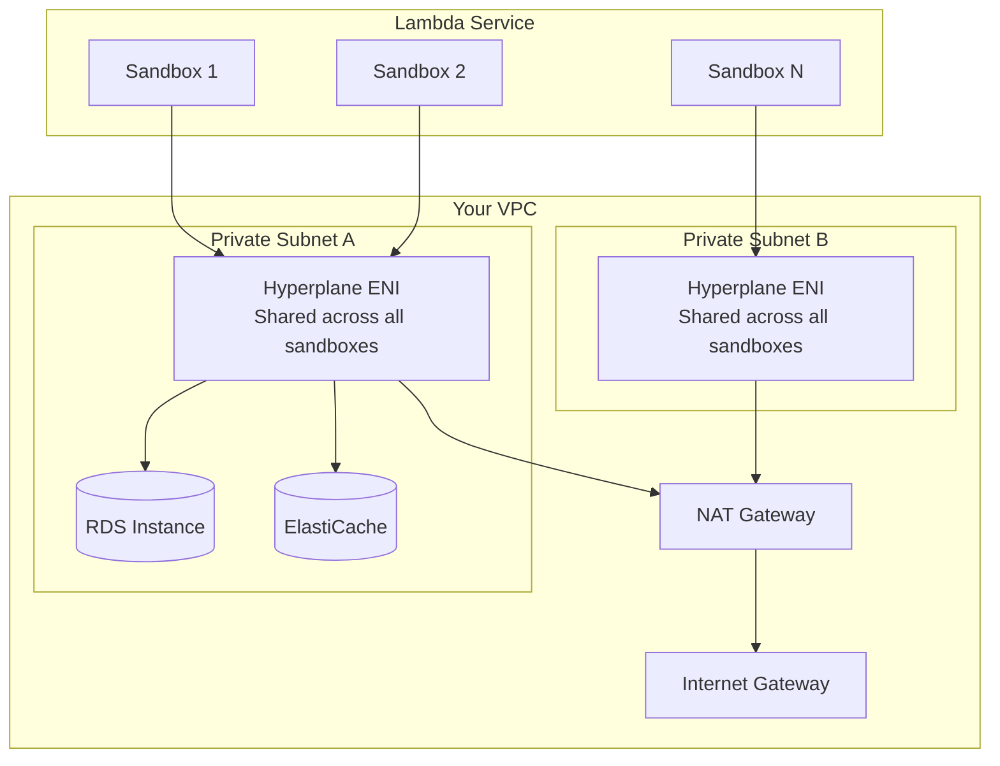
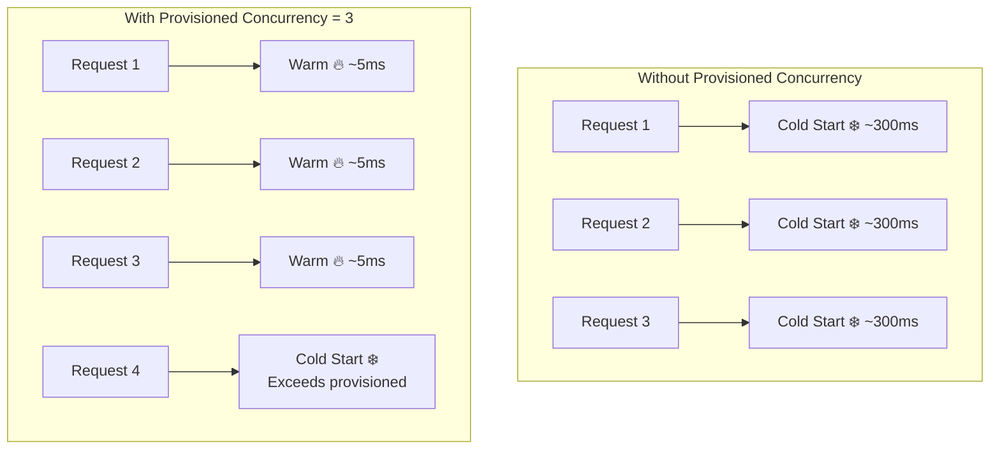
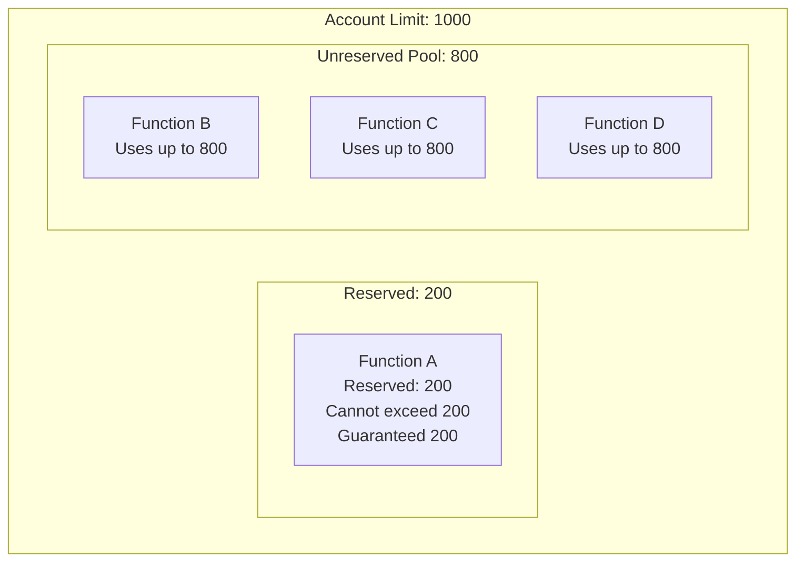
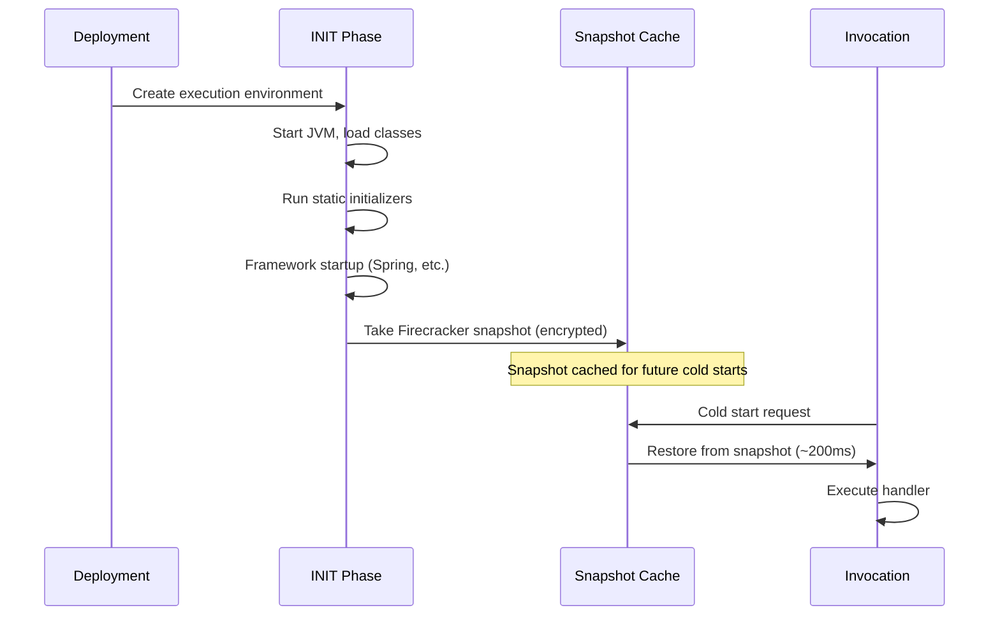
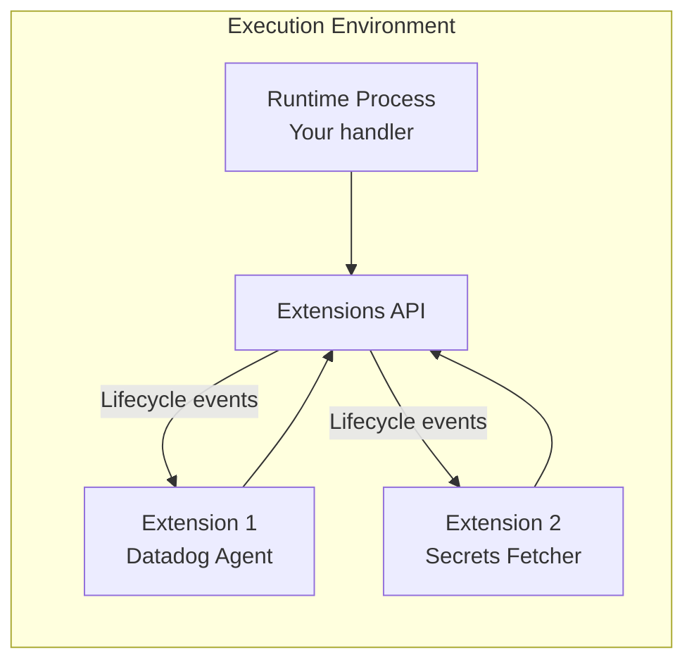

# AWS Lambda Deep Dive

AWS Lambda is the canonical serverless compute service — upload a function, and AWS handles provisioning, scaling, patching, and availability. But the devil is in the details. Cold starts, memory tuning, VPC latency, payload limits, timeout ceilings, and concurrency throttling are all production realities that catch teams off guard.

This guide goes from the execution model internals through production-hardened patterns. You will understand not just how to deploy Lambda functions, but how the runtime works under the hood and where it breaks.

---

## 1. Why Lambda Exists: The Problem It Solves

Before Lambda (launched November 2014), running a short-lived task on AWS required:

1. Provisioning an EC2 instance (or ECS task)
2. Installing a runtime
3. Writing the request handler
4. Managing auto-scaling policies
5. Patching the OS
6. Paying for idle time

For event-driven workloads — an image upload triggers a resize, an API Gateway request runs business logic, a DynamoDB stream triggers downstream processing — the operational overhead of managing servers dominated the actual business logic.

Lambda's promise: **pay only for the compute time consumed, and never manage a server.** The pricing model (per-invocation + per-millisecond of execution) made sub-second tasks economically viable in ways that EC2 or ECS never could.

### Historical Context

- **2014**: Lambda launches with Node.js support only, 60s max timeout
- **2015**: Python, Java support; API Gateway integration
- **2016**: C#, VPC support, dead letter queues
- **2017**: Go, step functions
- **2018**: Layers, custom runtimes, ALB integration
- **2019**: Provisioned concurrency, EFS support
- **2020**: Container image support (up to 10GB), 10GB memory
- **2022**: Lambda SnapStart (Java), function URLs
- **2023**: Response streaming, advanced logging controls
- **2024**: Recursive loop detection, SnapStart for Python/.NET

---

## 2. First Principles: The Execution Model

### The Firecracker MicroVM

Lambda functions run inside **Firecracker** micro-VMs — lightweight virtual machines that boot in ~125ms. Each execution environment is a dedicated Firecracker instance with:

- A Linux kernel (Amazon Linux 2 or AL2023)
- The language runtime (Node.js, Python, Java, etc.)
- Your function code and dependencies
- A writable `/tmp` directory (up to 10GB, ephemeral)



### Invocation Lifecycle

Every Lambda invocation follows this lifecycle:



### The Three Phases

| Phase | What Happens | Duration | Billed? |
|-------|-------------|----------|---------|
| **INIT** | Download code, start runtime, run top-level code | 100ms - 10s | Yes (since Dec 2023) |
| **INVOKE** | Execute the handler function | Your code's runtime | Yes |
| **SHUTDOWN** | Runtime extension hooks fire, sandbox may freeze | Up to 2s | No |

### Execution Environment Reuse

After an invocation completes, the execution environment is **frozen** — not destroyed. If another invocation arrives within ~5-15 minutes (exact time varies, not guaranteed), Lambda **thaws** the existing environment rather than creating a new one. This is why:

- Database connections persist between invocations
- Global/module-level variables retain their values
- `/tmp` contents survive across warm invocations
- Memory leaks accumulate across warm invocations

::: warning
Never rely on execution environment reuse for correctness. Treat each invocation as potentially running in a fresh sandbox. Use reuse only for **performance optimization** (connection pooling, caching).
:::

---

## 3. Cold Starts: The Core Challenge

### Anatomy of a Cold Start

A cold start occurs when Lambda must create a new execution environment. The total cold start latency is:

$$T_{cold} = T_{microvm} + T_{download} + T_{runtime} + T_{init}$$

Where:
- $T_{microvm}$: Firecracker VM creation (~50-100ms, internal to AWS)
- $T_{download}$: Code and layers download (proportional to package size)
- $T_{runtime}$: Language runtime startup
- $T_{init}$: Your initialization code (top-level / constructor)

### Cold Start Benchmarks by Runtime

| Runtime | Median Cold Start | P99 Cold Start | Package Size Impact |
|---------|------------------|----------------|---------------------|
| Python 3.12 | 150-300ms | 500-800ms | Low |
| Node.js 20 | 150-250ms | 400-700ms | Low |
| Go (AL2023) | 80-150ms | 200-400ms | Minimal (compiled) |
| Rust (AL2023) | 50-120ms | 150-300ms | Minimal (compiled) |
| Java 21 | 800-3000ms | 3-8s | Very High |
| Java 21 + SnapStart | 150-300ms | 400-800ms | Low (after snapshot) |
| .NET 8 | 400-800ms | 1-3s | Moderate |
| .NET 8 (NativeAOT) | 100-200ms | 300-500ms | Low |

### The Math of Cold Start Frequency

For a function with steady traffic at $\lambda$ requests/second and $N$ concurrent execution environments, the probability of a cold start for any given request is approximately:

$$P_{cold} \approx \frac{1}{N} \cdot \frac{1}{\lambda \cdot T_{warm}}$$

Where $T_{warm}$ is the average time an environment stays warm (typically 5-15 minutes). In practice, cold starts are most frequent for:

1. **Low-traffic functions** (minutes between invocations)
2. **Bursty functions** (sudden spike from 0 to 1000 concurrent)
3. **After deployments** (all existing environments are replaced)

### Minimizing Cold Starts

```typescript
// BAD: Heavy imports at top level that you might not need
import { S3Client, PutObjectCommand, GetObjectCommand,
         ListObjectsV2Command, DeleteObjectCommand } from '@aws-sdk/client-s3';
import { DynamoDBClient } from '@aws-sdk/client-dynamodb';
import { DynamoDBDocumentClient, PutCommand, GetCommand,
         QueryCommand, ScanCommand } from '@aws-sdk/lib-dynamodb';
import { SQSClient, SendMessageCommand } from '@aws-sdk/client-sqs';
import sharp from 'sharp';
import Joi from 'joi';

// GOOD: Lazy imports — only load what this invocation needs
const getS3Client = (() => {
  let client: S3Client | null = null;
  return () => {
    if (!client) {
      client = new S3Client({
        region: process.env.AWS_REGION,
        // Use keep-alive to reuse TCP connections
        requestHandler: new NodeHttpHandler({
          connectionTimeout: 3000,
          socketTimeout: 3000,
        }),
      });
    }
    return client;
  };
})();

const getDynamoClient = (() => {
  let client: DynamoDBDocumentClient | null = null;
  return () => {
    if (!client) {
      const ddb = new DynamoDBClient({ region: process.env.AWS_REGION });
      client = DynamoDBDocumentClient.from(ddb, {
        marshallOptions: { removeUndefinedValues: true },
      });
    }
    return client;
  };
})();
```

::: tip
For Node.js, use `@aws-sdk/client-*` (v3) instead of `aws-sdk` (v2). V3 is tree-shakeable — import only the commands you need, which reduces bundle size and cold start time significantly.
:::

---

## 4. Lambda Layers

### What Layers Are

A Lambda Layer is a ZIP archive of code/data (up to 50MB compressed, 250MB uncompressed) that is extracted into the `/opt` directory of the execution environment. Layers serve several purposes:

1. **Shared dependencies** — common libraries across multiple functions
2. **Custom runtimes** — provide a runtime not natively supported
3. **Separation of concerns** — keep function code small, dependencies in layers
4. **Independent versioning** — update dependencies without redeploying function code



### Layer Structure by Runtime

| Runtime | Layer Path | Include Path |
|---------|-----------|-------------|
| Node.js | `/opt/nodejs/node_modules` | Auto-included |
| Python | `/opt/python/lib/python3.x/site-packages` | Auto-included |
| Java | `/opt/java/lib` | Classpath |
| Go / Rust | `/opt/lib` or `/opt/bin` | LD_LIBRARY_PATH |

### Creating a Production Layer

```typescript
// scripts/build-layer.ts — Build a shared utilities layer
import { execSync } from 'child_process';
import { mkdirSync, cpSync, rmSync, writeFileSync } from 'fs';
import { join } from 'path';

const LAYER_DIR = join(__dirname, '../.layer');
const NODEJS_DIR = join(LAYER_DIR, 'nodejs');

// Clean previous build
rmSync(LAYER_DIR, { recursive: true, force: true });
mkdirSync(join(NODEJS_DIR, 'node_modules'), { recursive: true });

// Install only production dependencies
writeFileSync(
  join(NODEJS_DIR, 'package.json'),
  JSON.stringify({
    name: 'shared-layer',
    version: '1.0.0',
    dependencies: {
      '@aws-sdk/client-s3': '^3.500.0',
      '@aws-sdk/client-dynamodb': '^3.500.0',
      '@aws-sdk/lib-dynamodb': '^3.500.0',
      'zod': '^3.22.0',
      'pino': '^8.17.0',
    },
  })
);

execSync('npm install --omit=dev --prefix ' + NODEJS_DIR, { stdio: 'inherit' });

// Package the layer
execSync(`cd ${LAYER_DIR} && zip -r ../shared-layer.zip .`, { stdio: 'inherit' });

console.log('Layer built successfully.');
```

### Layer Limits

| Limit | Value |
|-------|-------|
| Max layers per function | 5 |
| Max uncompressed layer size | 250 MB (total for all layers + function code) |
| Max compressed layer size | 50 MB per layer |
| Max layer versions | Unlimited |
| Layer download time | Proportional to size (impacts cold start) |

::: danger
Layers are cached per execution environment. When you publish a new layer version, existing warm environments still use the old version until they are recycled. This means a deployment can have mixed versions running simultaneously for minutes.
:::

---

## 5. VPC Integration

### The Original Problem

When Lambda launched VPC support (2016), putting a function in a VPC added **10-15 seconds** to cold starts because Lambda had to create an Elastic Network Interface (ENI) in your VPC for each execution environment.

### The 2019 Fix: Hyperplane ENI

AWS re-architected VPC networking for Lambda using **Hyperplane** — the same technology behind NAT Gateway, Network Load Balancer, and EFS. Instead of creating one ENI per execution environment:

1. Lambda creates a shared **Hyperplane ENI** in each subnet
2. All execution environments in that subnet share the ENI via NAT
3. ENI creation happens at function create/update time, not at invocation time
4. Cold start penalty dropped from 10-15s to **<1s additional**



### When to Use VPC

| Scenario | VPC Required? | Why |
|----------|--------------|-----|
| Access RDS/Aurora | Yes | RDS is VPC-only |
| Access ElastiCache | Yes | ElastiCache is VPC-only |
| Access internal services | Yes | Private subnet resources |
| Access DynamoDB | No | Use VPC Gateway Endpoint |
| Access S3 | No | Use VPC Gateway Endpoint |
| Access SQS/SNS | No | Public endpoints (or Interface Endpoint) |
| Access third-party APIs | No | Unless security policy requires |

### VPC Configuration in Terraform

```hcl
resource "aws_lambda_function" "api" {
  function_name = "api-handler"
  role          = aws_iam_role.lambda_exec.arn
  handler       = "index.handler"
  runtime       = "nodejs20.x"
  timeout       = 30
  memory_size   = 512

  vpc_config {
    subnet_ids         = var.private_subnet_ids
    security_group_ids = [aws_security_group.lambda_sg.id]
  }

  environment {
    variables = {
      DB_HOST     = var.rds_endpoint
      REDIS_HOST  = var.elasticache_endpoint
    }
  }
}

resource "aws_security_group" "lambda_sg" {
  name_prefix = "lambda-api-"
  vpc_id      = var.vpc_id

  # Outbound: allow all (Lambda needs to reach AWS services)
  egress {
    from_port   = 0
    to_port     = 0
    protocol    = "-1"
    cidr_blocks = ["0.0.0.0/0"]
  }

  # No inbound rules needed — Lambda is invoked by AWS, not by inbound traffic
  tags = {
    Name = "lambda-api-sg"
  }
}

# Allow Lambda to access RDS
resource "aws_security_group_rule" "rds_from_lambda" {
  type                     = "ingress"
  from_port                = 5432
  to_port                  = 5432
  protocol                 = "tcp"
  security_group_id        = var.rds_security_group_id
  source_security_group_id = aws_security_group.lambda_sg.id
}
```

::: warning
VPC Lambda functions need a **NAT Gateway** to access the internet (including AWS service endpoints not available via VPC Endpoints). NAT Gateway costs ~$32/month + $0.045/GB processed. For high-throughput Lambda functions, this cost can be significant.
:::

---

## 6. Provisioned Concurrency

### The Problem It Solves

For latency-sensitive workloads (APIs, real-time processing), cold starts are unacceptable. Provisioned Concurrency keeps a specified number of execution environments **pre-initialized and warm** at all times.

### How It Works



### Provisioned Concurrency Cost Model

The cost has two components:

$$C_{provisioned} = C_{provision} + C_{execution}$$

Where:
- $C_{provision} = N_{provisioned} \times T_{hours} \times \$0.000004646/\text{GB-second}$
- $C_{execution}$ = normal invocation pricing (but at reduced rate)

For a 512MB function with 100 provisioned concurrency running 24/7:

$$C_{monthly} = 100 \times 0.5\text{GB} \times 86400 \times 30 \times \$0.000004646 = \$601.57/\text{month}$$

Compare this to the cost of an equivalent Fargate task or EC2 instance. Provisioned concurrency makes sense when:

1. Cold starts exceed SLA requirements
2. Traffic is predictable enough to set the right number
3. The function is invoked frequently enough to justify the cost

### Auto-Scaling Provisioned Concurrency

```hcl
resource "aws_lambda_provisioned_concurrency_config" "api" {
  function_name                  = aws_lambda_function.api.function_name
  provisioned_concurrent_executions = 50
  qualifier                      = aws_lambda_alias.live.name
}

resource "aws_appautoscaling_target" "lambda" {
  max_capacity       = 200
  min_capacity       = 50
  resource_id        = "function:${aws_lambda_function.api.function_name}:${aws_lambda_alias.live.name}"
  scalable_dimension = "lambda:function:ProvisionedConcurrency"
  service_namespace  = "lambda"
}

resource "aws_appautoscaling_policy" "lambda" {
  name               = "lambda-provisioned-scaling"
  policy_type        = "TargetTrackingScaling"
  resource_id        = aws_appautoscaling_target.lambda.resource_id
  scalable_dimension = aws_appautoscaling_target.lambda.scalable_dimension
  service_namespace  = aws_appautoscaling_target.lambda.service_namespace

  target_tracking_scaling_policy_configuration {
    predefined_metric_specification {
      predefined_metric_type = "LambdaProvisionedConcurrencyUtilization"
    }
    target_value = 0.7  # Scale up when 70% of provisioned is in use
  }
}
```

---

## 7. Memory and CPU Tuning

### The CPU-Memory Proportionality

Lambda allocates CPU proportionally to memory. At 1,769 MB, you get one full vCPU. At 10,240 MB (max), you get ~6 vCPUs.

| Memory | vCPU | Network Bandwidth |
|--------|------|------------------|
| 128 MB | 0.07 | Low |
| 512 MB | 0.29 | Low |
| 1,024 MB | 0.58 | Moderate |
| 1,769 MB | 1.0 | Moderate |
| 3,538 MB | 2.0 | High |
| 10,240 MB | 6.0 | Up to 10 Gbps |

### The Cost Optimization Paradox

Increasing memory often **reduces cost** because the function runs faster. A 128MB function that takes 3 seconds costs more than a 512MB function that takes 0.5 seconds:

$$C_{128} = \frac{128}{1024} \times 3000\text{ms} \times \$0.0000166667 = \$0.00000625$$

$$C_{512} = \frac{512}{1024} \times 500\text{ms} \times \$0.0000166667 = \$0.00000417$$

The 512MB function is **33% cheaper** and 6x faster.

### Power Tuning with AWS Lambda Power Tuning

Use the [AWS Lambda Power Tuning](https://github.com/alexcasalboni/aws-lambda-power-tuning) tool to find the optimal memory setting:

```json
{
  "lambdaARN": "arn:aws:lambda:us-east-1:123456789:function:my-function",
  "powerValues": [128, 256, 512, 1024, 1536, 2048, 3008],
  "num": 50,
  "payload": "{\"test\": true}",
  "parallelInvocation": true,
  "strategy": "cost"
}
```

This invokes your function at each memory level 50 times and produces a cost-vs-duration chart showing the optimal configuration.

---

## 8. Concurrency Model and Throttling

### Concurrency Limits

| Limit | Default | Adjustable |
|-------|---------|-----------|
| Account concurrency (per region) | 1,000 | Yes (up to tens of thousands) |
| Reserved concurrency (per function) | 0 (unreserved) | Yes |
| Burst concurrency | 500-3,000 (region-dependent) | No |
| Burst rate | 500/minute after initial burst | No |

### Reserved vs. Unreserved Concurrency



::: danger
If a single function consumes all unreserved concurrency, **every other function in the account gets throttled**. Always set reserved concurrency for critical functions and use a separate AWS account for production workloads.
:::

### Throttling Behavior by Invocation Type

| Invocation Type | Throttle Behavior | Retry |
|----------------|-------------------|-------|
| Synchronous (API GW) | Returns 429 to caller | No auto-retry |
| Asynchronous (S3, SNS) | Retries up to 6 hours | Yes, with backoff |
| Stream (Kinesis, DynamoDB) | Retries entire batch | Yes, blocks shard |
| SQS | Returns to queue | Yes, visibility timeout |

### Production Concurrency Configuration

```typescript
// middleware/concurrency-protection.ts
import { Logger } from '@aws-lambda-powertools/logger';

const logger = new Logger({ serviceName: 'api' });

interface ConcurrencyMetrics {
  activeInvocations: number;
  throttledCount: number;
  timestamp: number;
}

/**
 * Monitor concurrency usage and emit metrics for alarming.
 * CloudWatch does not expose per-function concurrency as a metric —
 * you must calculate it from ConcurrentExecutions.
 */
export async function emitConcurrencyMetrics(
  functionName: string,
  cloudwatch: CloudWatchClient,
): Promise<void> {
  const now = new Date();
  const fiveMinutesAgo = new Date(now.getTime() - 5 * 60 * 1000);

  const response = await cloudwatch.send(new GetMetricStatisticsCommand({
    Namespace: 'AWS/Lambda',
    MetricName: 'ConcurrentExecutions',
    Dimensions: [{ Name: 'FunctionName', Value: functionName }],
    StartTime: fiveMinutesAgo,
    EndTime: now,
    Period: 60,
    Statistics: ['Maximum'],
  }));

  const maxConcurrency = response.Datapoints
    ?.sort((a, b) => (b.Timestamp?.getTime() ?? 0) - (a.Timestamp?.getTime() ?? 0))
    ?.[0]?.Maximum ?? 0;

  logger.info('Concurrency metrics', {
    functionName,
    maxConcurrency,
    timestamp: now.toISOString(),
  });
}
```

---

## 9. Event Source Mappings and Invocation Patterns

### Synchronous Invocation

The caller waits for the response. Used by API Gateway, ALB, and direct SDK calls.

```typescript
// handler.ts — API Gateway Lambda handler with proper error handling
import { APIGatewayProxyEventV2, APIGatewayProxyResultV2 } from 'aws-lambda';
import { Logger, injectLambdaContext } from '@aws-lambda-powertools/logger';
import { Tracer, captureLambdaHandler } from '@aws-lambda-powertools/tracer';
import { Metrics, logMetrics, MetricUnit } from '@aws-lambda-powertools/metrics';
import middy from '@middy/core';
import httpErrorHandler from '@middy/http-error-handler';
import httpJsonBodyParser from '@middy/http-json-body-parser';

const logger = new Logger({ serviceName: 'order-api' });
const tracer = new Tracer({ serviceName: 'order-api' });
const metrics = new Metrics({ namespace: 'OrderService', serviceName: 'order-api' });

interface CreateOrderRequest {
  customerId: string;
  items: Array<{ productId: string; quantity: number }>;
}

const baseHandler = async (
  event: APIGatewayProxyEventV2 & { body: CreateOrderRequest },
): Promise<APIGatewayProxyResultV2> => {
  const { customerId, items } = event.body;

  // Validate input
  if (!customerId || !items?.length) {
    return {
      statusCode: 400,
      body: JSON.stringify({ error: 'customerId and items are required' }),
    };
  }

  try {
    const order = await createOrder(customerId, items);

    metrics.addMetric('OrderCreated', MetricUnit.Count, 1);
    metrics.addMetadata('orderId', order.id);

    return {
      statusCode: 201,
      body: JSON.stringify(order),
      headers: { 'Content-Type': 'application/json' },
    };
  } catch (error) {
    logger.error('Failed to create order', { error, customerId });
    metrics.addMetric('OrderCreationFailed', MetricUnit.Count, 1);

    return {
      statusCode: 500,
      body: JSON.stringify({ error: 'Internal server error' }),
    };
  }
};

export const handler = middy(baseHandler)
  .use(httpJsonBodyParser())
  .use(httpErrorHandler())
  .use(injectLambdaContext(logger, { logEvent: true }))
  .use(captureLambdaHandler(tracer))
  .use(logMetrics(metrics));
```

### Asynchronous Invocation

The caller gets a 202 immediately. Lambda handles retries (2 retries with backoff) and dead letter queues.

```typescript
// async-handler.ts — S3 event handler with idempotency
import { S3Event } from 'aws-lambda';
import { IdempotencyConfig, makeIdempotent } from '@aws-lambda-powertools/idempotency';
import { DynamoDBPersistenceLayer } from '@aws-lambda-powertools/idempotency/dynamodb';

const persistenceStore = new DynamoDBPersistenceLayer({
  tableName: process.env.IDEMPOTENCY_TABLE!,
});

const processS3Event = async (event: S3Event): Promise<void> => {
  for (const record of event.Records) {
    const bucket = record.s3.bucket.name;
    const key = decodeURIComponent(record.s3.object.key.replace(/\+/g, ' '));
    const size = record.s3.object.size;

    logger.info('Processing S3 object', { bucket, key, size });

    // Process the object (e.g., generate thumbnail)
    await processImage(bucket, key);
  }
};

// Wrap with idempotency to handle Lambda retries safely
export const handler = makeIdempotent(processS3Event, {
  persistenceStore,
  config: new IdempotencyConfig({
    eventKeyJmesPath: 'Records[0].s3.object.key',
    expiresAfterSeconds: 3600,
  }),
});
```

### Stream-Based (Kinesis, DynamoDB Streams)

Lambda polls the stream, batches records, and invokes your function. If processing fails, the entire batch is retried, blocking the shard.

```typescript
// stream-handler.ts — DynamoDB Stream processor with partial batch failure
import { DynamoDBStreamEvent, DynamoDBRecord, SQSBatchResponse } from 'aws-lambda';

export const handler = async (event: DynamoDBStreamEvent): Promise<SQSBatchResponse> => {
  const batchItemFailures: SQSBatchResponse['batchItemFailures'] = [];

  for (const record of event.Records) {
    try {
      await processRecord(record);
    } catch (error) {
      logger.error('Failed to process record', {
        error,
        eventID: record.eventID,
        eventName: record.eventName,
      });

      // Report this specific record as failed
      // Lambda will retry ONLY this record (with ReportBatchItemFailures enabled)
      batchItemFailures.push({
        itemIdentifier: record.eventID!,
      });
    }
  }

  return { batchItemFailures };
};

async function processRecord(record: DynamoDBRecord): Promise<void> {
  if (record.eventName === 'INSERT' || record.eventName === 'MODIFY') {
    const newImage = record.dynamodb?.NewImage;
    if (!newImage) return;

    // Process the change...
    await indexToElasticsearch(newImage);
  }
}
```

---

## 10. Lambda SnapStart (Java / Python / .NET)

### The Problem with JVM Cold Starts

Java Lambda cold starts are brutal — 3-8 seconds is common due to:

1. JVM startup and class loading
2. JIT compilation warmup
3. Framework initialization (Spring Boot: 5-10s)
4. Dependency injection container setup

### How SnapStart Works

SnapStart takes a **Firecracker snapshot** of the initialized execution environment (after the INIT phase) and stores it encrypted in a cache. On cold start, instead of running INIT from scratch, Lambda **restores from the snapshot** — like resuming from hibernation.



### SnapStart Caveats

::: warning
SnapStart restores from a frozen point in time. This means:
1. **Random number generators** may produce the same sequence across environments — use `CryptoRandom` or re-seed after restore
2. **Network connections** are stale — re-establish in the handler, not in INIT
3. **Timestamps** from INIT are frozen — always use `System.currentTimeMillis()` in the handler
4. **Uniqueness assumptions** (UUIDs generated in INIT) are violated — generate per-invocation
:::

---

## 11. Production Patterns

### The Middy Middleware Pattern (Node.js)

```typescript
// middleware/index.ts — Reusable middleware stack
import middy from '@middy/core';
import httpJsonBodyParser from '@middy/http-json-body-parser';
import httpErrorHandler from '@middy/http-error-handler';
import httpHeaderNormalizer from '@middy/http-header-normalizer';
import httpCors from '@middy/http-cors';
import validator from '@middy/validator';
import warmup from '@middy/warmup';
import { transpileSchema } from '@middy/validator/transpile';
import { injectLambdaContext } from '@aws-lambda-powertools/logger';
import { captureLambdaHandler } from '@aws-lambda-powertools/tracer';
import { logMetrics } from '@aws-lambda-powertools/metrics';
import { logger, tracer, metrics } from './powertools';

export function createApiHandler<TEvent, TResult>(
  handler: (event: TEvent) => Promise<TResult>,
  options?: {
    inputSchema?: Record<string, unknown>;
    cors?: boolean;
  },
) {
  let middified = middy(handler)
    .use(warmup({ isWarmingUp: (e: any) => e?.source === 'serverless-warming' }))
    .use(httpHeaderNormalizer())
    .use(httpJsonBodyParser())
    .use(injectLambdaContext(logger, { logEvent: true }))
    .use(captureLambdaHandler(tracer))
    .use(logMetrics(metrics, { captureColdStartMetric: true }));

  if (options?.inputSchema) {
    middified = middified.use(
      validator({ eventSchema: transpileSchema(options.inputSchema) })
    );
  }

  if (options?.cors !== false) {
    middified = middified.use(httpCors({
      origins: [process.env.ALLOWED_ORIGIN ?? '*'],
      credentials: true,
    }));
  }

  return middified.use(httpErrorHandler({ logger: (error) => logger.error('Unhandled error', { error }) }));
}
```

### Connection Pooling Pattern

```typescript
// db/connection.ts — Reuse connections across warm invocations
import { Pool } from 'pg';
import { Signer } from '@aws-sdk/rds-signer';

let pool: Pool | null = null;

async function getPool(): Promise<Pool> {
  if (pool) {
    // Validate the pool is still healthy
    try {
      await pool.query('SELECT 1');
      return pool;
    } catch {
      // Pool is stale, recreate
      await pool.end().catch(() => {});
      pool = null;
    }
  }

  const signer = new Signer({
    hostname: process.env.DB_HOST!,
    port: 5432,
    username: process.env.DB_USER!,
    region: process.env.AWS_REGION!,
  });

  const token = await signer.getAuthToken();

  pool = new Pool({
    host: process.env.DB_HOST,
    port: 5432,
    user: process.env.DB_USER,
    password: token,
    database: process.env.DB_NAME,
    ssl: { rejectUnauthorized: true },
    max: 1, // Lambda runs one invocation at a time — one connection is enough
    idleTimeoutMillis: 120000, // Close idle connections after 2 min
    connectionTimeoutMillis: 5000,
  });

  return pool;
}

export { getPool };
```

::: info War Story
A startup migrated their Express.js API to Lambda without changing the connection pool size. Each Lambda instance opened 10 database connections (the default `max` in `pg`). At 500 concurrent Lambda invocations, they had 5,000 open database connections to a `db.r5.large` (max 1,000 connections). The database OOMed, cascading into a full outage. The fix: set `max: 1` in the pool configuration (since Lambda processes one request at a time) and use RDS Proxy for connection pooling across instances.
:::

---

## 12. Observability

### Structured Logging

```typescript
// powertools.ts — Centralized observability setup
import { Logger } from '@aws-lambda-powertools/logger';
import { Tracer } from '@aws-lambda-powertools/tracer';
import { Metrics } from '@aws-lambda-powertools/metrics';

export const logger = new Logger({
  serviceName: process.env.SERVICE_NAME ?? 'unknown',
  logLevel: process.env.LOG_LEVEL ?? 'INFO',
  persistentLogAttributes: {
    environment: process.env.ENVIRONMENT ?? 'unknown',
    version: process.env.APP_VERSION ?? 'unknown',
  },
});

export const tracer = new Tracer({
  serviceName: process.env.SERVICE_NAME ?? 'unknown',
  captureHTTPsRequests: true,
});

export const metrics = new Metrics({
  namespace: process.env.METRICS_NAMESPACE ?? 'Application',
  serviceName: process.env.SERVICE_NAME ?? 'unknown',
  defaultDimensions: {
    environment: process.env.ENVIRONMENT ?? 'unknown',
  },
});
```

### Key CloudWatch Metrics to Monitor

| Metric | Alarm Threshold | Why |
|--------|----------------|-----|
| `Errors` | > 1% of invocations | Function failures |
| `Throttles` | > 0 sustained | Hitting concurrency limits |
| `Duration` (P99) | > 80% of timeout | Approaching timeout |
| `ConcurrentExecutions` | > 80% of account limit | Approaching throttle |
| `IteratorAge` (streams) | > 60s | Processing falling behind |
| `DeadLetterErrors` | > 0 | DLQ delivery failures |

---

## 13. Edge Cases and Failure Modes

### Timeout Cascading

If Function A (timeout: 30s) calls Function B (timeout: 30s) synchronously, Function A can timeout waiting for B. Always set:

$$T_{caller} > T_{callee} + T_{network\_overhead}$$

### Payload Size Limits

| Invocation Type | Request Payload | Response Payload |
|----------------|-----------------|------------------|
| Synchronous | 6 MB | 6 MB |
| Asynchronous | 256 KB | N/A |
| Stream | 6 MB (batch) | N/A |
| Response Streaming | 6 MB request | 20 MB response |

### The /tmp Trap

The `/tmp` directory persists across warm invocations and has a 10GB limit. If you write files to `/tmp` without cleaning up, disk space accumulates until:

```typescript
// DANGER: /tmp fills up across warm invocations
export const handler = async (event: S3Event) => {
  const tmpFile = `/tmp/${Date.now()}.json`;
  await downloadS3Object(event, tmpFile);
  const result = await processFile(tmpFile);
  // Missing: fs.unlinkSync(tmpFile);
  return result;
};

// SAFE: Always clean up /tmp
export const handler = async (event: S3Event) => {
  const tmpFile = `/tmp/${Date.now()}.json`;
  try {
    await downloadS3Object(event, tmpFile);
    return await processFile(tmpFile);
  } finally {
    try { fs.unlinkSync(tmpFile); } catch { /* ignore */ }
  }
};
```

### Recursive Invocations

A Lambda writing to S3, which triggers the same Lambda, creates an infinite loop. AWS added recursive loop detection in 2024, but you should still guard against it:

```typescript
// Guard against recursive invocations
const MAX_RECURSION_DEPTH = 3;

export const handler = async (event: any, context: any) => {
  const depth = parseInt(event.headers?.['x-recursion-depth'] ?? '0');

  if (depth >= MAX_RECURSION_DEPTH) {
    logger.error('Max recursion depth exceeded', { depth });
    throw new Error('Recursive invocation detected');
  }

  // Pass incremented depth to downstream calls
  // ...
};
```

---

## 14. Performance Characteristics

### Latency Breakdown (Typical API Gateway + Lambda)

| Component | Latency | Notes |
|-----------|---------|-------|
| API Gateway overhead | 10-30ms | REST API; HTTP API is faster (~5-15ms) |
| Cold start (Node.js) | 150-300ms | First invocation only |
| Warm invocation | 1-5ms | Lambda service overhead |
| Handler execution | Varies | Your code |
| Response serialization | <1ms | JSON.stringify |
| **Total (warm)** | **15-50ms** | Excluding your code |
| **Total (cold)** | **200-500ms** | Excluding your code |

### Throughput Limits

$$\text{Max RPS} = \frac{\text{Account Concurrency Limit}}{\text{Avg Duration (seconds)}}$$

For 1,000 concurrent with 100ms average duration:

$$\text{Max RPS} = \frac{1000}{0.1} = 10,000 \text{ RPS}$$

---

## 15. Decision Framework: When to Use Lambda

| Factor | Lambda Wins | Containers Win |
|--------|-------------|---------------|
| Traffic pattern | Sporadic, bursty | Steady, predictable |
| Duration | < 15 minutes | Long-running |
| Startup latency | Acceptable cold starts | Sub-ms required |
| State | Stateless | Stateful (WebSockets, caches) |
| Cost at scale | < ~1M requests/day | > ~1M requests/day (usually) |
| Team size | Small (< 5) | Large with platform team |
| Vendor lock-in | Acceptable | Must be portable |

### Cost Comparison at Scale

| Monthly Invocations | Avg Duration | Lambda Cost | Fargate (equivalent) |
|--------------------:|-------------|-------------|---------------------|
| 1 million | 200ms | $3.54 | $36.50 |
| 10 million | 200ms | $35.40 | $73.00 |
| 100 million | 200ms | $354.00 | $146.00 |
| 1 billion | 200ms | $3,540.00 | $292.00 |

::: tip
Lambda has a generous free tier (1M requests + 400,000 GB-seconds/month). For low-traffic services, Lambda is essentially free.
:::

---

## 16. Advanced Topics

### Lambda Extensions

Extensions run as separate processes in the execution environment, enabling:
- Custom monitoring agents
- Configuration management
- Secret rotation
- Log processing



### Response Streaming

Introduced in 2023, response streaming lets you send partial responses as they become available — critical for LLM/AI workloads:

```typescript
import { streamifyResponse, ResponseStream } from 'lambda-stream';

export const handler = streamifyResponse(
  async (event: any, responseStream: ResponseStream) => {
    responseStream.setContentType('text/plain');

    // Stream data as it becomes available
    for (let i = 0; i < 100; i++) {
      const chunk = await processChunk(i);
      responseStream.write(chunk);
    }

    responseStream.end();
  }
);
```

### Lambda@Edge vs CloudFront Functions

| Feature | Lambda@Edge | CloudFront Functions |
|---------|------------|---------------------|
| Runtime | Node.js, Python | JavaScript only |
| Duration | Up to 30s (origin) / 5s (viewer) | < 1ms |
| Memory | Up to 10GB | 2 MB |
| Network | Yes | No |
| Pricing | Lambda pricing | 1/6 of Lambda@Edge |
| Use case | Auth, A/B testing, dynamic routing | Header manipulation, URL rewrites |

---

## 17. Terraform Module: Production Lambda

```hcl
# modules/lambda/main.tf — Reusable Lambda module
variable "function_name" { type = string }
variable "handler" { type = string }
variable "runtime" { type = string }
variable "memory_size" { type = number; default = 512 }
variable "timeout" { type = number; default = 30 }
variable "environment_variables" { type = map(string); default = {} }
variable "vpc_config" {
  type = object({
    subnet_ids         = list(string)
    security_group_ids = list(string)
  })
  default = null
}
variable "reserved_concurrency" { type = number; default = -1 }
variable "layers" { type = list(string); default = [] }
variable "tracing_mode" { type = string; default = "Active" }

resource "aws_lambda_function" "this" {
  function_name = var.function_name
  role          = aws_iam_role.this.arn
  handler       = var.handler
  runtime       = var.runtime
  memory_size   = var.memory_size
  timeout       = var.timeout
  layers        = var.layers

  filename         = data.archive_file.function.output_path
  source_code_hash = data.archive_file.function.output_base64sha256

  reserved_concurrent_executions = var.reserved_concurrency

  tracing_config {
    mode = var.tracing_mode
  }

  dynamic "vpc_config" {
    for_each = var.vpc_config != null ? [var.vpc_config] : []
    content {
      subnet_ids         = vpc_config.value.subnet_ids
      security_group_ids = vpc_config.value.security_group_ids
    }
  }

  environment {
    variables = merge(var.environment_variables, {
      POWERTOOLS_SERVICE_NAME = var.function_name
      LOG_LEVEL               = "INFO"
    })
  }

  tags = {
    Service     = var.function_name
    ManagedBy   = "terraform"
  }
}

resource "aws_lambda_function_event_invoke_config" "this" {
  function_name          = aws_lambda_function.this.function_name
  maximum_retry_attempts = 2
  maximum_event_age_in_seconds = 3600

  destination_configuration {
    on_failure {
      destination = aws_sqs_queue.dlq.arn
    }
  }
}

resource "aws_sqs_queue" "dlq" {
  name                      = "${var.function_name}-dlq"
  message_retention_seconds = 1209600  # 14 days

  tags = {
    Service   = var.function_name
    ManagedBy = "terraform"
  }
}

resource "aws_cloudwatch_metric_alarm" "errors" {
  alarm_name          = "${var.function_name}-errors"
  comparison_operator = "GreaterThanThreshold"
  evaluation_periods  = 2
  metric_name         = "Errors"
  namespace           = "AWS/Lambda"
  period              = 300
  statistic           = "Sum"
  threshold           = 5
  alarm_description   = "Lambda function error rate exceeded threshold"

  dimensions = {
    FunctionName = aws_lambda_function.this.function_name
  }

  alarm_actions = [var.sns_alarm_topic_arn]
  ok_actions    = [var.sns_alarm_topic_arn]
}

resource "aws_cloudwatch_metric_alarm" "throttles" {
  alarm_name          = "${var.function_name}-throttles"
  comparison_operator = "GreaterThanThreshold"
  evaluation_periods  = 1
  metric_name         = "Throttles"
  namespace           = "AWS/Lambda"
  period              = 60
  statistic           = "Sum"
  threshold           = 0
  alarm_description   = "Lambda function is being throttled"

  dimensions = {
    FunctionName = aws_lambda_function.this.function_name
  }

  alarm_actions = [var.sns_alarm_topic_arn]
}
```

---

## See Also

- [VPC Networking Deep Dive](./vpc-networking.md) — Understanding VPC for Lambda VPC integration
- [ECS vs EKS](./ecs-vs-eks.md) — When containers are better than Lambda
- [IAM Deep Dive](./iam-deep-dive.md) — Crafting least-privilege Lambda execution roles
- [Cost Optimization](./cost-optimization.md) — Lambda cost strategies at scale
