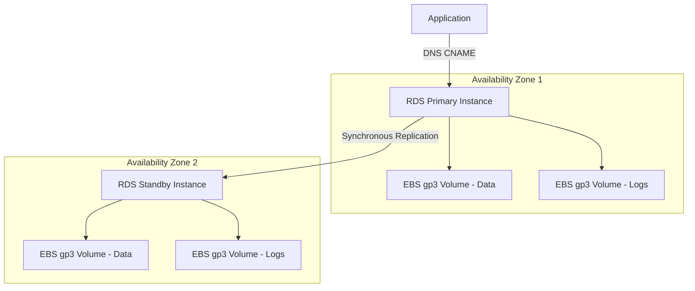
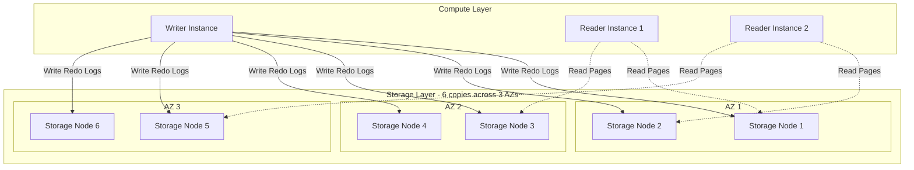
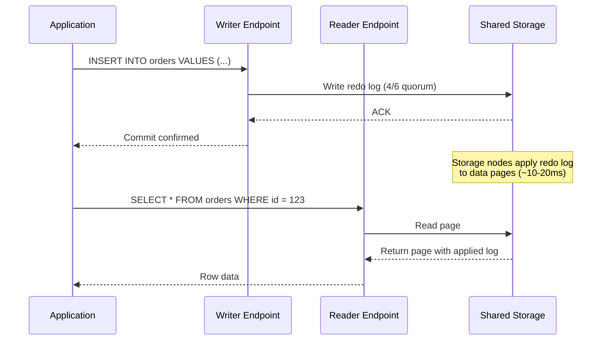
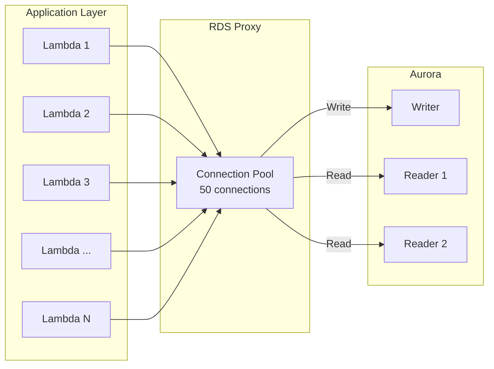
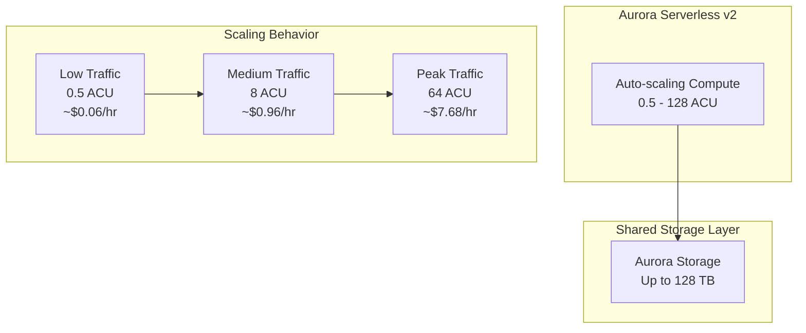
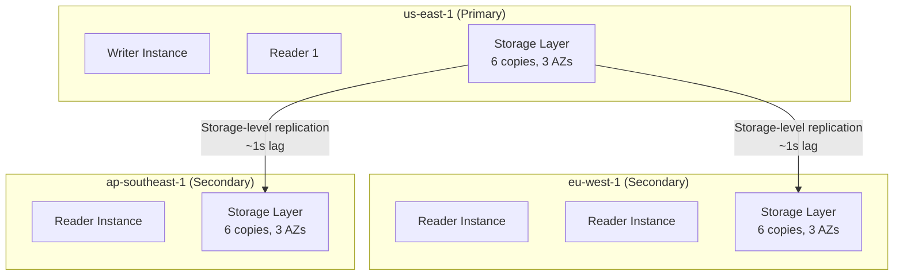
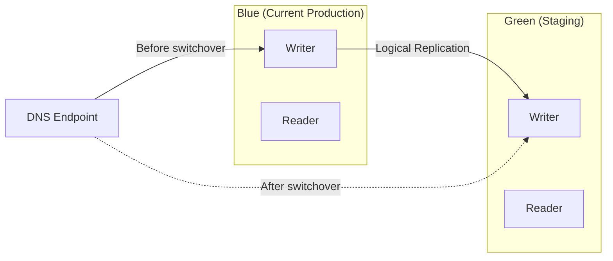

# RDS & Aurora: Relational Databases on AWS

Running relational databases in production requires solving hard problems: replication, failover, backup, patching, scaling, monitoring, and security. AWS Relational Database Service (RDS) handles the undifferentiated heavy lifting. Aurora goes further — reimagining the storage layer to deliver up to 5x the throughput of standard MySQL and 3x the throughput of standard PostgreSQL.

This page covers both from the storage engine up.

---

## 1. Why Managed Databases Exist

Self-managing a database on EC2 means:

- **Patching**: applying security patches within hours of CVE disclosure, testing for regressions
- **Backups**: configuring automated snapshots, testing restore procedures, managing retention
- **Replication**: setting up streaming replication, monitoring lag, handling split-brain
- **Failover**: building health checks, DNS failover, connection draining
- **Monitoring**: installing exporters, building dashboards, setting up alerting
- **Storage**: managing EBS volumes, IOPS provisioning, handling storage full events
- **Security**: managing certificates, encryption at rest and in transit, audit logging

A senior DBA costs $180k+/year. RDS and Aurora eliminate most of this work for $0.10-$0.50/hour depending on instance size.

### Historical Context

RDS launched in October 2009 with MySQL support. PostgreSQL support came in 2013. Aurora launched in 2014 (MySQL-compatible) and 2017 (PostgreSQL-compatible). Aurora was born from Amazon's observation that the bottleneck in cloud databases was not compute — it was the network I/O between compute and storage.

---

## 2. First Principles: How RDS Works

### Standard RDS Architecture

Standard RDS runs a database engine (PostgreSQL, MySQL, MariaDB, Oracle, SQL Server) on an EC2 instance with EBS volumes attached.



**Key properties:**
- **Compute and storage are coupled** — if you need more IOPS, you might need a bigger instance
- **EBS is the storage layer** — limited to 256,000 IOPS (io2 Block Express) and 64 TB
- **Synchronous replication** for Multi-AZ uses Amazon's mirroring technology (not native DB replication)
- **Failover** takes 60-120 seconds (DNS propagation + recovery)

### Storage Types

| Storage Type | IOPS | Throughput | Use Case |
|-------------|------|------------|----------|
| gp3 | 3,000 baseline, up to 16,000 | 125 MB/s baseline, up to 1,000 MB/s | General purpose |
| io2 | Up to 256,000 | Up to 4,000 MB/s | I/O-intensive OLTP |
| io2 Block Express | Up to 256,000 | Up to 4,000 MB/s | Largest databases |
| Magnetic (deprecated) | Variable | Variable | Legacy only |

### Multi-AZ Deployment

Multi-AZ creates a synchronous standby replica in a different Availability Zone. This is not a read replica — it serves no read traffic. It exists solely for failover.

**Failover triggers:**
- Primary instance failure (hardware or OS crash)
- AZ outage
- Instance type change (manual failover during maintenance)
- Manual reboot with failover
- Storage failure on primary

**Failover process:**
1. AWS detects primary failure (health checks every 5 seconds)
2. Standby is promoted to primary
3. DNS CNAME record is updated to point to the new primary
4. Application connections are dropped and must reconnect

$$
T_{failover} = T_{detect} + T_{promote} + T_{dns} \approx 5s + 30s + 30s = 60\text{-}120s
$$

::: warning Connection Handling During Failover
Your application MUST handle dropped connections gracefully. Use connection pooling (PgBouncer, RDS Proxy) and implement retry logic with exponential backoff:

```typescript
async function executeWithRetry<T>(
  fn: () => Promise<T>,
  maxRetries: number = 3,
  baseDelayMs: number = 1000
): Promise<T> {
  for (let attempt = 0; attempt <= maxRetries; attempt++) {
    try {
      return await fn();
    } catch (error: any) {
      const isTransient =
        error.code === 'ECONNRESET' ||
        error.code === 'ECONNREFUSED' ||
        error.code === 'ETIMEDOUT' ||
        error.message?.includes('Connection terminated unexpectedly');

      if (!isTransient || attempt === maxRetries) throw error;

      const delay = baseDelayMs * Math.pow(2, attempt) + Math.random() * 1000;
      await new Promise(resolve => setTimeout(resolve, delay));
    }
  }
  throw new Error('Unreachable');
}
```
:::

---

## 3. Aurora Architecture: The Storage Revolution

Aurora's key innovation is **decoupling compute from storage**. Instead of writing to local EBS volumes, Aurora writes to a distributed, shared storage layer that spans three Availability Zones.

### Aurora Storage Layer



**How writes work in Aurora:**

1. The writer instance generates **redo log records** (not full data pages)
2. Log records are sent to all 6 storage nodes in parallel
3. A write is acknowledged when **4 of 6** storage nodes confirm (quorum)
4. Storage nodes apply redo logs to data pages asynchronously in the background

**Why this is revolutionary:**

In traditional databases, the write path is:

$$
\text{Traditional: } \text{Write to WAL} \rightarrow \text{Write dirty pages} \rightarrow \text{Replicate full pages to standby}
$$

In Aurora:

$$
\text{Aurora: } \text{Write redo log records only} \rightarrow \text{Storage nodes apply locally}
$$

Aurora writes **only redo log records across the network** — typically 1/6th the data volume of a traditional database. This eliminates:
- Checkpointing (storage nodes handle it independently)
- Double-write buffer (not needed with log-structured storage)
- Synchronous replication of data pages (log records are sufficient)

### Quorum Model

Aurora uses a **4/6 write quorum** and a **3/6 read quorum**. This tolerates:

- **Loss of an entire AZ** (2 nodes) without losing write availability
- **Loss of an AZ + 1 additional node** (3 nodes) without losing read availability

$$
\text{Write quorum: } W = 4, \quad \text{Read quorum: } R = 3
$$
$$
W + R > N \implies 4 + 3 > 6 \implies 7 > 6 \quad \checkmark
$$

This guarantees that every read quorum overlaps with every write quorum, ensuring read consistency.

### Storage Auto-Scaling

Aurora storage automatically grows in **10 GB increments** up to **128 TB** (as of 2026). You never provision storage — it grows as you write data and shrinks when you delete it (with Aurora I/O-Optimized).

---

## 4. Aurora Read Replicas

Aurora supports up to **15 read replicas** in the same region, sharing the same storage volume. Because readers access the same physical storage, replica lag is typically under 20 milliseconds — compared to seconds or minutes with standard RDS read replicas that use asynchronous streaming replication.



### Reader Endpoint Load Balancing

Aurora provides a **reader endpoint** that load-balances connections across all read replicas using DNS round-robin. However, this has a flaw — DNS TTL means connections are not evenly distributed after scaling events.

**Better approach: RDS Proxy for read replicas**

```typescript
import { Pool } from 'pg';

// Writer pool — connects to cluster endpoint
const writerPool = new Pool({
  host: 'mydb.cluster-abc123.us-east-1.rds.amazonaws.com',
  port: 5432,
  database: 'myapp',
  user: 'app_writer',
  password: process.env.DB_WRITER_PASSWORD,
  max: 20,
  idleTimeoutMillis: 30000,
  connectionTimeoutMillis: 5000,
});

// Reader pool — connects to reader endpoint (or RDS Proxy reader endpoint)
const readerPool = new Pool({
  host: 'mydb.cluster-ro-abc123.us-east-1.rds.amazonaws.com',
  port: 5432,
  database: 'myapp',
  user: 'app_reader',
  password: process.env.DB_READER_PASSWORD,
  max: 50, // Higher limit for read-heavy workloads
  idleTimeoutMillis: 30000,
  connectionTimeoutMillis: 5000,
});

// Route queries to the appropriate pool
async function query(sql: string, params: unknown[], options?: { readonly?: boolean }) {
  const pool = options?.readonly ? readerPool : writerPool;
  const client = await pool.connect();
  try {
    return await client.query(sql, params);
  } finally {
    client.release();
  }
}
```

---

## 5. RDS Proxy

RDS Proxy sits between your application and the database, pooling and sharing connections. This is critical for:

- **Lambda functions** — each invocation opens a connection; without pooling, you exhaust `max_connections`
- **Failover** — RDS Proxy maintains connections and transparently redirects to the new primary
- **Connection management** — reduces database connection overhead



**Key benefit**: 1,000 Lambda functions might try to open 1,000 database connections simultaneously. RDS Proxy multiplexes these into 50-100 actual database connections. Without Proxy, the database would reject connections above `max_connections` (typically 83-5,000 depending on instance size).

### RDS Proxy Configuration (CDK)

```typescript
import * as rds from 'aws-cdk-lib/aws-rds';
import * as secretsmanager from 'aws-cdk-lib/aws-secretsmanager';
import * as ec2 from 'aws-cdk-lib/aws-ec2';

const proxy = new rds.DatabaseProxy(this, 'Proxy', {
  proxyTarget: rds.ProxyTarget.fromCluster(auroraCluster),
  secrets: [auroraCluster.secret!],
  vpc,
  vpcSubnets: { subnetType: ec2.SubnetType.PRIVATE_WITH_EGRESS },
  requireTLS: true,
  idleClientTimeout: cdk.Duration.minutes(30),
  maxConnectionsPercent: 90,
  maxIdleConnectionsPercent: 50,
  borrowTimeout: cdk.Duration.seconds(30),
  dbProxyName: 'myapp-proxy',
});

// Grant the Lambda function access to the proxy
proxy.grantConnect(lambdaFunction, 'app_user');
```

---

## 6. Performance Insights

Performance Insights is RDS's built-in performance monitoring tool. It answers the question: **"What is the database waiting on?"**

### Key Concepts

**Active Sessions**: The number of database sessions that are either running on CPU or waiting. This is the fundamental metric.

$$
\text{DB Load} = \text{Active Sessions} = \text{Sessions on CPU} + \text{Sessions Waiting on I/O} + \text{Sessions Waiting on Locks} + \ldots
$$

If DB Load exceeds the number of vCPUs, sessions are contending for CPU — the database is overloaded.

**Wait Events**: When a session is not running on CPU, it is waiting. Wait events tell you what it is waiting for:

| Wait Event | Category | Meaning |
|-----------|----------|---------|
| `CPU` | CPU | Query is actively running |
| `io/DataFileRead` | I/O | Reading data pages from storage |
| `io/BufFileRead` | I/O | Reading temp files (sort/hash spill) |
| `Lock:Relation` | Lock | Waiting for a table-level lock |
| `Lock:transactionid` | Lock | Waiting for a row-level lock |
| `LWLock:BufferMapping` | LWLock | Contention on shared buffer pool |
| `Client:ClientRead` | Client | Waiting for the application to send data |
| `IPC:ClogGroupUpdate` | IPC | Transaction commit log contention |

### Using Performance Insights Programmatically

```typescript
import {
  PIClient,
  GetResourceMetricsCommand,
  type MetricQuery,
} from '@aws-sdk/client-pi';

const piClient = new PIClient({ region: 'us-east-1' });

async function getDbLoad(resourceId: string): Promise<void> {
  const endTime = new Date();
  const startTime = new Date(endTime.getTime() - 3600 * 1000); // Last hour

  const metricQueries: MetricQuery[] = [
    {
      Metric: 'db.load.avg',
      GroupBy: {
        Group: 'db.wait_event',
        Limit: 10,
      },
    },
  ];

  const response = await piClient.send(new GetResourceMetricsCommand({
    ServiceType: 'RDS',
    Identifier: resourceId,
    MetricQueries: metricQueries,
    StartTime: startTime,
    EndTime: endTime,
    PeriodInSeconds: 60,
  }));

  for (const result of response.MetricList ?? []) {
    console.log(`Metric: ${result.Key?.Metric}`);
    for (const dp of result.DataPoints ?? []) {
      console.log(`  ${dp.Timestamp}: ${dp.Value?.toFixed(2)} active sessions`);
    }
  }
}
```

### Common Performance Patterns

**Pattern 1: CPU-Bound Workload**
- DB Load dominated by `CPU` wait event
- Fix: optimize slow queries, add indexes, upgrade instance size
- Query: `SELECT * FROM pg_stat_statements ORDER BY total_exec_time DESC LIMIT 20;`

**Pattern 2: I/O-Bound Workload**
- DB Load dominated by `io/DataFileRead`
- Fix: add missing indexes, increase `shared_buffers`, upgrade to io2/Aurora I/O-Optimized
- The buffer cache hit ratio should be > 99%:

$$
\text{Hit Ratio} = \frac{\text{blks\_hit}}{\text{blks\_hit} + \text{blks\_read}} \times 100
$$

**Pattern 3: Lock Contention**
- DB Load dominated by `Lock:transactionid` or `Lock:Relation`
- Fix: reduce transaction duration, use `SELECT ... FOR UPDATE SKIP LOCKED`, batch updates

---

## 7. Aurora Serverless v2

Aurora Serverless v2 scales compute capacity automatically based on demand, measured in **Aurora Capacity Units (ACUs)**. Each ACU provides approximately 2 GB of memory and corresponding CPU.



**Pricing (us-east-1):**

$$
\text{Cost} = \text{ACU-hours consumed} \times \$0.12/\text{ACU-hour}
$$

A Serverless v2 instance at 4 ACUs for 24 hours costs: $4 \times 24 \times 0.12 = \$11.52/\text{day}$

**When to use Serverless v2:**
- Unpredictable or spiky workloads
- Dev/staging environments that are idle most of the time
- Mixed reader/writer workloads where readers can be Serverless v2

**When NOT to use:**
- Steady-state, predictable workloads (provisioned instances are cheaper)
- Latency-sensitive applications during scale-up (scaling takes 5-15 seconds)

---

## 8. Backup and Recovery

### Automated Backups

RDS and Aurora take automated backups with these differences:

| Feature | Standard RDS | Aurora |
|---------|-------------|--------|
| Backup window | Daily, user-defined window | Continuous, no window needed |
| Backup mechanism | EBS snapshot | Incremental, from storage layer |
| Point-in-time recovery | 5-minute granularity | 1-second granularity |
| Retention | 1-35 days | 1-35 days |
| Cross-region backup | Supported | Supported (via cross-region replication) |
| Impact on performance | Brief I/O suspension (single-AZ) | No impact |

### Point-in-Time Recovery (PITR)

PITR creates a new database instance restored to a specific timestamp:

```typescript
import { RDSClient, RestoreDBClusterToPointInTimeCommand } from '@aws-sdk/client-rds';

const rds = new RDSClient({ region: 'us-east-1' });

async function restoreToPointInTime(
  sourceClusterId: string,
  targetClusterId: string,
  restoreTime: Date
): Promise<string> {
  const response = await rds.send(new RestoreDBClusterToPointInTimeCommand({
    SourceDBClusterIdentifier: sourceClusterId,
    DBClusterIdentifier: targetClusterId,
    RestoreToTime: restoreTime,
    UseLatestRestorableTime: false,
    DBSubnetGroupName: 'my-subnet-group',
    VpcSecurityGroupIds: ['sg-abc123'],
    // Restore to a new cluster — does NOT overwrite the source
  }));

  return response.DBCluster?.DBClusterIdentifier ?? '';
}

// Restore to 5 minutes before the incident
const incidentTime = new Date('2026-03-18T14:30:00Z');
const restoreTime = new Date(incidentTime.getTime() - 5 * 60 * 1000);
await restoreToPointInTime('prod-cluster', 'prod-cluster-restored', restoreTime);
```

::: danger PITR Creates a NEW Instance
PITR does not restore in-place. It creates a new cluster with a new endpoint. You must update your application's connection string or DNS to point to the restored cluster. Plan and practice this procedure before you need it.
:::

---

## 9. Aurora Global Database

Aurora Global Database replicates an entire cluster to up to 5 secondary regions with sub-second replication lag. The primary use cases are:

1. **Disaster recovery** — if an entire region fails, promote a secondary to primary (RPO < 1s, RTO < 1 minute)
2. **Low-latency reads** — serve read traffic from the nearest region



**Replication mechanism**: Aurora Global Database replicates at the **storage layer**, not at the SQL layer. Redo log records are shipped from the primary region's storage to secondary regions. This is more efficient and reliable than logical replication.

**Cross-region failover process:**
1. Stop writes to the primary region
2. Detach the secondary region (`--remove-from-global-cluster`)
3. Promote the secondary cluster to standalone
4. Update application DNS to point to the new primary
5. Recreate Global Database with new primary and add other secondaries

---

## 10. Parameter Tuning

### PostgreSQL Parameters (Aurora)

| Parameter | Default | Recommended | Why |
|-----------|---------|-------------|-----|
| `shared_buffers` | 75% of memory | 75% (Aurora manages) | Aurora handles this well by default |
| `max_connections` | Based on instance | 200-500 (use RDS Proxy) | Too many connections waste memory |
| `work_mem` | 4 MB | 16-64 MB | Larger allows in-memory sorts/hashes |
| `maintenance_work_mem` | 64 MB | 512 MB-2 GB | Speeds up VACUUM and CREATE INDEX |
| `effective_cache_size` | 75% of memory | 75% of memory | Query planner hint, not allocation |
| `random_page_cost` | 4.0 | 1.1 (Aurora) | Aurora storage is fast, closer to sequential |
| `checkpoint_timeout` | 5 min | N/A (Aurora) | Aurora does not checkpoint traditionally |
| `wal_buffers` | -1 (auto) | N/A (Aurora) | Aurora manages WAL differently |
| `log_min_duration_statement` | -1 (disabled) | 1000 (1 second) | Log slow queries |
| `pg_stat_statements.max` | 5000 | 10000 | Track more query patterns |
| `idle_in_transaction_session_timeout` | 0 (disabled) | 300000 (5 min) | Kill idle transactions holding locks |

### Connection Limits by Instance Size

| Instance | vCPU | Memory | Default max_connections | Recommended |
|----------|------|--------|------------------------|-------------|
| db.t3.medium | 2 | 4 GB | 83 | 80 |
| db.r6g.large | 2 | 16 GB | 1,000 | 200 (with Proxy) |
| db.r6g.xlarge | 4 | 32 GB | 2,000 | 500 (with Proxy) |
| db.r6g.2xlarge | 8 | 64 GB | 3,000 | 1,000 (with Proxy) |
| db.r6g.4xlarge | 16 | 128 GB | 5,000 | 2,000 (with Proxy) |

Each connection consumes approximately 5-10 MB of memory. At 5,000 connections, that is 25-50 GB just for connection overhead.

---

## 11. Edge Cases and Failure Modes

| Failure | Symptom | Root Cause | Mitigation |
|---------|---------|------------|------------|
| Storage full | Writes fail, `SQLSTATE 53100` | Database growth exceeded provisioned storage | Enable storage auto-scaling, monitor `FreeStorageSpace` |
| max_connections exceeded | `FATAL: too many connections` | Connection leak or burst traffic | Use RDS Proxy, fix connection leaks, increase limit |
| Replication lag on reader | Stale reads | Heavy write workload, reader instance too small | Monitor `AuroraReplicaLag`, size readers appropriately |
| Long-running queries blocking vacuum | Table bloat, degraded performance | Queries holding `xmin` horizon | Set `idle_in_transaction_session_timeout`, monitor `pg_stat_activity` |
| Failover causes connection errors | Application errors for 60-120 seconds | DNS TTL, connection pool holding dead connections | Use RDS Proxy, reduce DNS TTL, implement retry logic |
| Parameter group changes require reboot | `pending-reboot` status | Static parameters changed | Plan maintenance window, apply changes during low traffic |
| Cross-region replication lag spike | Reads in secondary region return stale data | Network congestion, large transactions | Monitor `AuroraGlobalDBReplicationLag`, avoid large batch writes |

::: info War Story: The Vacuum That Never Finished
A team running Aurora PostgreSQL noticed their largest table (2 TB, 500M rows) had not been vacuumed in 3 weeks. Autovacuum kept starting and getting cancelled by long-running analytics queries.

The consequence: table bloat grew to 4 TB (50% dead tuples), query performance degraded 3x, and the `xid` wraparound counter was at 80% — approaching the hard limit that would force the database into read-only mode.

The fix:
1. Killed all long-running queries: `SELECT pg_terminate_backend(pid) FROM pg_stat_activity WHERE duration > interval '1 hour'`
2. Ran manual vacuum with increased `maintenance_work_mem`: `SET maintenance_work_mem = '2GB'; VACUUM (VERBOSE) large_table;`
3. Set `idle_in_transaction_session_timeout = 300000` to prevent future holding of `xmin`
4. Configured autovacuum more aggressively for large tables:
   ```sql
   ALTER TABLE large_table SET (
     autovacuum_vacuum_scale_factor = 0.01,
     autovacuum_vacuum_cost_delay = 2,
     autovacuum_vacuum_cost_limit = 2000
   );
   ```
:::

::: info War Story: The DNS TTL That Cost $50k
After an RDS failover, an e-commerce platform's checkout service continued sending writes to the old primary (which was now a reader) for 5 minutes. The application used a connection pool with `min: 10` connections that stayed open even after failover. The DNS CNAME updated, but existing connections did not resolve DNS again.

Result: 5 minutes of lost orders during peak Black Friday traffic.

The fix:
1. Migrated to RDS Proxy, which handles failover transparently
2. Set connection pool `maxLifetimeMillis: 300000` (5 minutes) to force periodic reconnection
3. Added connection validation: `SELECT 1` before reusing pooled connections
4. Implemented application-level health checks that verified write capability:
   ```typescript
   async function verifyWriteCapability(pool: Pool): Promise<boolean> {
     try {
       await pool.query('SELECT pg_is_in_recovery()').then(r => {
         if (r.rows[0].pg_is_in_recovery) throw new Error('Connected to read-only replica');
       });
       return true;
     } catch {
       return false;
     }
   }
   ```
:::

---

## 12. Aurora I/O-Optimized vs Standard

Aurora offers two pricing models as of 2023:

### Standard
- Pay per I/O operation: $0.20 per million requests
- Lower instance price
- Best for: low-to-moderate I/O workloads

### I/O-Optimized
- Zero I/O charges
- 30% higher instance price
- Best for: I/O-intensive workloads

**Break-even analysis:**

$$
\text{Break-even I/O} = \frac{0.30 \times \text{Instance Price per hour}}{\$0.20 / \text{million I/Os}}
$$

For a `db.r6g.xlarge` at $0.579/hr (standard):

$$
\text{Break-even} = \frac{0.30 \times 0.579}{0.20 \times 10^{-6}} = 868,500 \text{ I/Os per hour} \approx 241 \text{ I/Os per second}
$$

If your database does more than ~241 IOPS (most production databases do), I/O-Optimized saves money.

::: tip
Most production workloads benefit from I/O-Optimized. Check your CloudWatch `VolumeReadIOPs` and `VolumeWriteIOPs` metrics. If total IOPS consistently exceeds 200-300, switch to I/O-Optimized.
:::

---

## 13. Monitoring and Alerting

### Essential CloudWatch Alarms

```typescript
import * as cloudwatch from 'aws-cdk-lib/aws-cloudwatch';
import * as actions from 'aws-cdk-lib/aws-cloudwatch-actions';
import * as sns from 'aws-cdk-lib/aws-sns';

function createRdsAlarms(
  scope: Construct,
  cluster: rds.DatabaseCluster,
  alertTopic: sns.ITopic
): void {
  // CPU utilization > 80% for 5 minutes
  const cpuAlarm = new cloudwatch.Alarm(scope, 'CpuAlarm', {
    metric: cluster.metricCPUUtilization({ period: cdk.Duration.minutes(1) }),
    threshold: 80,
    evaluationPeriods: 5,
    comparisonOperator: cloudwatch.ComparisonOperator.GREATER_THAN_THRESHOLD,
    alarmDescription: 'Aurora CPU > 80% for 5 minutes',
    treatMissingData: cloudwatch.TreatMissingData.BREACHING,
  });
  cpuAlarm.addAlarmAction(new actions.SnsAction(alertTopic));

  // Freeable memory < 500 MB
  const memoryAlarm = new cloudwatch.Alarm(scope, 'MemoryAlarm', {
    metric: cluster.metricFreeableMemory({ period: cdk.Duration.minutes(1) }),
    threshold: 500 * 1024 * 1024, // 500 MB in bytes
    evaluationPeriods: 3,
    comparisonOperator: cloudwatch.ComparisonOperator.LESS_THAN_THRESHOLD,
    alarmDescription: 'Aurora freeable memory < 500 MB',
  });
  memoryAlarm.addAlarmAction(new actions.SnsAction(alertTopic));

  // Database connections > 80% of max
  const connectionsAlarm = new cloudwatch.Alarm(scope, 'ConnectionsAlarm', {
    metric: cluster.metricDatabaseConnections({ period: cdk.Duration.minutes(1) }),
    threshold: 400, // 80% of max_connections=500
    evaluationPeriods: 3,
    comparisonOperator: cloudwatch.ComparisonOperator.GREATER_THAN_THRESHOLD,
    alarmDescription: 'Aurora connections approaching limit',
  });
  connectionsAlarm.addAlarmAction(new actions.SnsAction(alertTopic));

  // Replica lag > 100ms
  const replicaLagAlarm = new cloudwatch.Alarm(scope, 'ReplicaLagAlarm', {
    metric: new cloudwatch.Metric({
      namespace: 'AWS/RDS',
      metricName: 'AuroraReplicaLag',
      dimensionsMap: { DBClusterIdentifier: cluster.clusterIdentifier },
      period: cdk.Duration.minutes(1),
      statistic: 'Maximum',
    }),
    threshold: 100, // milliseconds
    evaluationPeriods: 5,
    comparisonOperator: cloudwatch.ComparisonOperator.GREATER_THAN_THRESHOLD,
    alarmDescription: 'Aurora replica lag > 100ms',
  });
  replicaLagAlarm.addAlarmAction(new actions.SnsAction(alertTopic));

  // Deadlocks detected
  const deadlockAlarm = new cloudwatch.Alarm(scope, 'DeadlockAlarm', {
    metric: new cloudwatch.Metric({
      namespace: 'AWS/RDS',
      metricName: 'Deadlocks',
      dimensionsMap: { DBClusterIdentifier: cluster.clusterIdentifier },
      period: cdk.Duration.minutes(5),
      statistic: 'Sum',
    }),
    threshold: 1,
    evaluationPeriods: 1,
    comparisonOperator: cloudwatch.ComparisonOperator.GREATER_THAN_OR_EQUAL_TO_THRESHOLD,
    alarmDescription: 'Deadlock detected in Aurora',
  });
  deadlockAlarm.addAlarmAction(new actions.SnsAction(alertTopic));
}
```

---

## 14. Mathematical Model: Read Replica Scaling

Given a workload with $W$ writes/second and $R$ reads/second, and a single instance can handle $C$ operations/second:

$$
\text{Writer load} = \frac{W}{C_w}
$$

$$
\text{Total read capacity} = n \cdot C_r \quad \text{where } n = \text{number of readers}
$$

$$
n_{min} = \lceil \frac{R}{C_r} \rceil
$$

With Aurora's shared storage, adding a read replica costs only the compute instance — no storage duplication. The marginal cost of adding read capacity:

$$
C_{marginal} = \text{instance\_price} \quad \text{(no storage cost)}
$$

Versus standard RDS where adding a replica also copies storage:

$$
C_{marginal} = \text{instance\_price} + \text{storage\_price} + \text{replication\_bandwidth}
$$

---

## 15. Decision Framework

### RDS vs Aurora

| Factor | Choose Standard RDS | Choose Aurora |
|--------|-------------------|---------------|
| Budget | Tight, steady workload | Willing to pay premium for performance |
| Database size | < 500 GB | Any size, especially > 1 TB |
| Read replicas needed | 0-5 | 1-15 |
| Failover time tolerance | 60-120 seconds | < 30 seconds |
| Point-in-time recovery | 5-minute granularity sufficient | Need 1-second granularity |
| Engine | Oracle, SQL Server, MariaDB | PostgreSQL, MySQL only |
| Multi-region | Cross-region read replicas | Aurora Global Database |
| Serverless compute | Not available | Aurora Serverless v2 |

### Instance Sizing Guide

$$
\text{Required Memory} \geq \text{Working Set Size} + \text{Connection Overhead} + \text{OS/Engine Overhead}
$$

Where:
- **Working Set Size** = frequently accessed data + indexes (often 10-20% of total DB size)
- **Connection Overhead** = `max_connections` * 5-10 MB
- **OS/Engine Overhead** = ~1-2 GB

Example: 100 GB database, 15 GB working set, 200 connections:

$$
\text{Memory} \geq 15\text{ GB} + (200 \times 10\text{ MB}) + 2\text{ GB} = 19\text{ GB}
$$

Choose `db.r6g.xlarge` (32 GB) for headroom.

---

## 16. Advanced: Blue-Green Deployments

RDS Blue-Green Deployments allow you to make major changes (engine version upgrade, parameter changes, schema changes) with minimal downtime:



**Process:**
1. Create a green environment (automatic copy + replication setup)
2. Apply changes to the green environment (version upgrade, parameter changes)
3. Test the green environment
4. Switchover (typically < 1 minute of downtime)
5. Old blue environment becomes the new green (rollback target)

::: warning
Blue-Green does NOT support Aurora Global Database or Aurora Serverless v1. It works with Aurora provisioned instances and standard RDS.
:::

This page covered the architecture, operational patterns, and decision framework for running relational databases on AWS. The choice between standard RDS and Aurora depends on your performance requirements, budget, and operational maturity. For most new projects using PostgreSQL or MySQL, Aurora with I/O-Optimized pricing and RDS Proxy is the recommended starting point.
