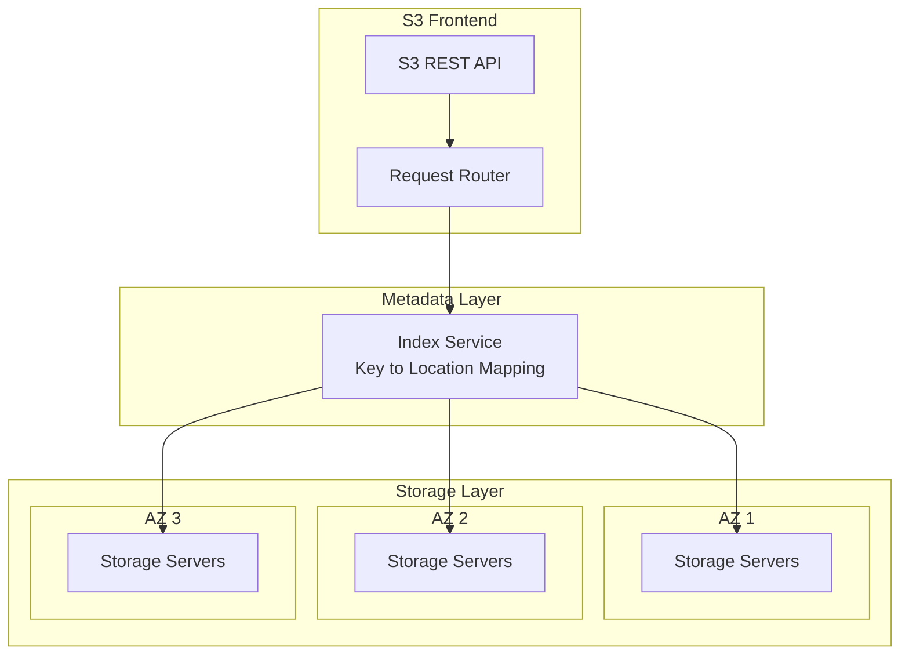
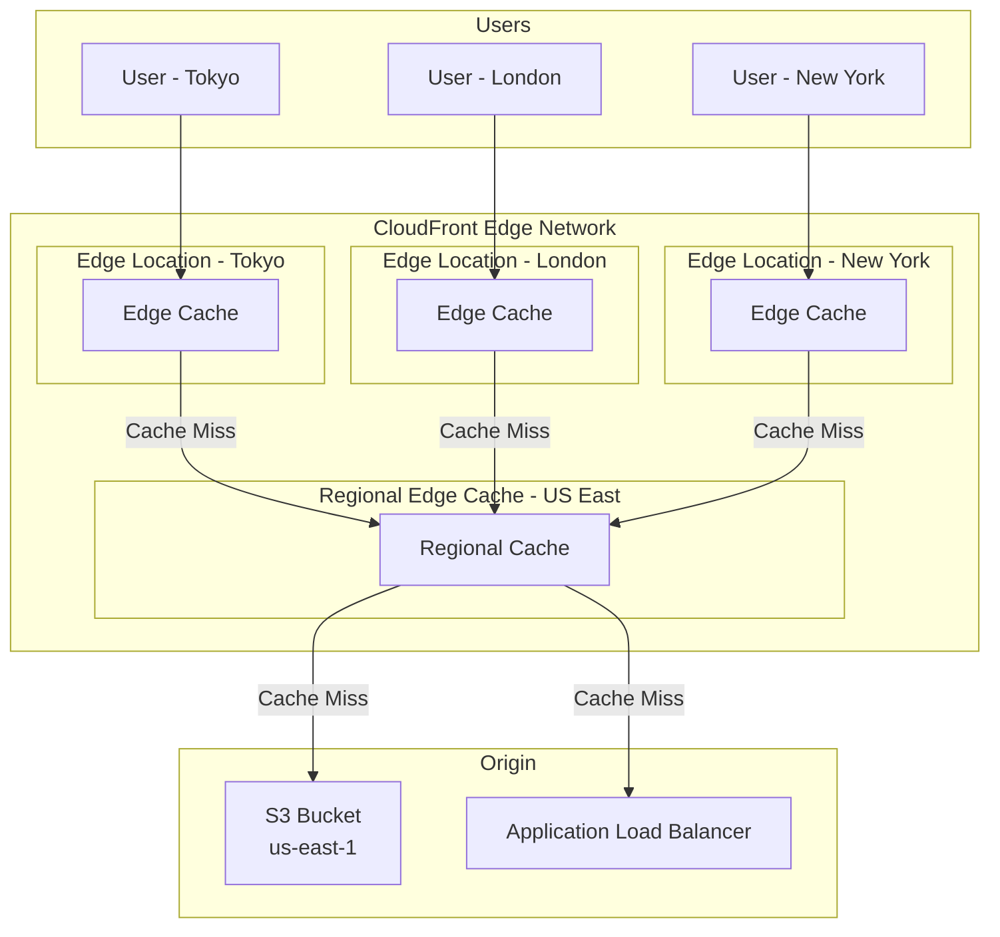

# S3 & CloudFront: Storage and CDN on AWS

Amazon S3 (Simple Storage Service) is the foundation of AWS storage — 100+ trillion objects stored as of 2026, with 99.999999999% (eleven 9s) durability. CloudFront is AWS's content delivery network with 600+ edge locations worldwide. Together, they form the backbone of static asset delivery, media streaming, data lakes, and backup infrastructure.

This page covers both services from the storage architecture through production CDN patterns.

---

## 1. Why Object Storage Exists

Traditional file systems (ext4, NTFS, ZFS) were designed for a single machine with attached disks. They use:
- **Hierarchical directories** — tree structure with inodes
- **Block-level access** — read/write arbitrary byte ranges
- **POSIX semantics** — atomic rename, file locking, hard links

These properties do not scale across thousands of machines. Object storage trades POSIX semantics for:

- **Flat namespace** — objects are identified by a key (path-like string), no true directories
- **HTTP API** — GET, PUT, DELETE via REST
- **Eventual consistency** (historically) — S3 became strongly consistent for reads-after-writes in December 2020
- **Unlimited scale** — no capacity planning, no volume management
- **11 nines durability** — data replicated across 3+ AZs automatically

### The Math Behind Eleven 9s

S3 stores each object across at least 3 Availability Zones. Within each AZ, data is replicated across multiple disks. The probability of losing all copies simultaneously:

$$
P(\text{data loss}) = P(\text{AZ1 failure}) \times P(\text{AZ2 failure}) \times P(\text{AZ3 failure})
$$

If each AZ has an annual failure probability of $10^{-4}$ (0.01%):

$$
P(\text{data loss}) = (10^{-4})^3 = 10^{-12}
$$

That is $99.9999999999\%$ durability — in a petabyte of data, you might lose 1 byte per year.

---

## 2. S3 Architecture Internals

### How S3 Stores Objects



When you PUT an object:
1. The request hits the S3 frontend (load-balanced across multiple endpoints)
2. S3 determines the partition based on the key's hash prefix
3. The object is written to storage servers in at least 3 AZs
4. The metadata index is updated with the key-to-location mapping
5. S3 returns HTTP 200 only after the object is durably stored

### Key Naming and Performance

S3 partitions data by key prefix. The internal partition rate per prefix is at least **5,500 GET/HEAD requests per second** and **3,500 PUT/COPY/POST/DELETE requests per second**.

S3 automatically re-partitions as traffic increases — no manual sharding needed. However, understanding the partition model helps with:

```
# Good key design — natural distribution
s3://bucket/uploads/2026/03/18/user-123/photo.jpg
s3://bucket/logs/2026/03/18/14/server-web01.log.gz

# Previously problematic (before 2018 auto-partitioning)
# S3 now handles this well, but good key design still matters
s3://bucket/2026-03-18-14-00-00-web01.log
```

### Consistency Model

Since December 2020, S3 provides **strong read-after-write consistency** for all operations:
- PUT a new object → immediately readable (GET returns the new object)
- Overwrite an existing object → immediately readable (GET returns the new version)
- DELETE an object → immediately visible (GET returns 404)
- LIST reflects all recent PUTs and DELETEs

This eliminated the need for workarounds like conditional writes, read retries, and "wait after write" patterns.

---

## 3. Storage Classes

S3 offers multiple storage classes with different cost, availability, and retrieval characteristics:

| Storage Class | Durability | Availability | Min Storage Duration | Retrieval Fee | Use Case |
|--------------|-----------|--------------|---------------------|---------------|----------|
| **S3 Standard** | 99.999999999% | 99.99% | None | None | Frequently accessed data |
| **S3 Intelligent-Tiering** | 99.999999999% | 99.9% | None | None (monitoring fee) | Unknown access patterns |
| **S3 Standard-IA** | 99.999999999% | 99.9% | 30 days | Per-GB retrieval | Infrequent access, rapid retrieval |
| **S3 One Zone-IA** | 99.999999999% | 99.5% | 30 days | Per-GB retrieval | Re-creatable data, infrequent access |
| **S3 Glacier Instant** | 99.999999999% | 99.9% | 90 days | Per-GB retrieval | Archive with millisecond access |
| **S3 Glacier Flexible** | 99.999999999% | 99.99% | 90 days | Per-GB + per-request | Archive, 1-12 hour retrieval |
| **S3 Glacier Deep Archive** | 99.999999999% | 99.99% | 180 days | Per-GB + per-request | Long-term archive, 12-48 hour retrieval |

### Pricing Comparison (us-east-1, per GB/month)

| Storage Class | Storage | PUT (per 1000) | GET (per 1000) | Retrieval (per GB) |
|--------------|---------|---------------|---------------|-------------------|
| Standard | $0.023 | $0.005 | $0.0004 | $0 |
| Standard-IA | $0.0125 | $0.01 | $0.001 | $0.01 |
| One Zone-IA | $0.01 | $0.01 | $0.001 | $0.01 |
| Glacier Instant | $0.004 | $0.02 | $0.01 | $0.03 |
| Glacier Flexible | $0.0036 | $0.03 | $0.0004 | $0.01-$0.03 |
| Deep Archive | $0.00099 | $0.05 | $0.0004 | $0.02 |

### Break-Even Analysis: Standard vs Standard-IA

Standard-IA is cheaper for storage but has retrieval fees. The break-even depends on access frequency:

$$
C_{standard} = 0.023 \times S
$$

$$
C_{ia} = 0.0125 \times S + 0.01 \times R
$$

Where $S$ is storage in GB and $R$ is retrieval in GB. Break-even when $C_{standard} = C_{ia}$:

$$
0.023S = 0.0125S + 0.01R \implies R = 1.05S
$$

If you retrieve more than 1.05x your stored data per month, Standard is cheaper. For most archival data (accessed < 1x/month), Standard-IA saves 45%.

---

## 4. Lifecycle Policies

Lifecycle policies automate transitioning objects between storage classes and deleting expired objects.

```typescript
import * as s3 from 'aws-cdk-lib/aws-s3';

const bucket = new s3.Bucket(this, 'DataBucket', {
  bucketName: 'myapp-data-production',
  versioned: true,
  encryption: s3.BucketEncryption.S3_MANAGED,
  blockPublicAccess: s3.BlockPublicAccess.BLOCK_ALL,
  enforceSSL: true,
  intelligentTieringConfigurations: [{
    name: 'default',
    archiveAccessTierTime: cdk.Duration.days(90),
    deepArchiveAccessTierTime: cdk.Duration.days(180),
  }],
  lifecycleRules: [
    {
      id: 'TransitionToIA',
      enabled: true,
      transitions: [
        {
          storageClass: s3.StorageClass.INFREQUENT_ACCESS,
          transitionAfter: cdk.Duration.days(30),
        },
        {
          storageClass: s3.StorageClass.GLACIER_INSTANT_RETRIEVAL,
          transitionAfter: cdk.Duration.days(90),
        },
        {
          storageClass: s3.StorageClass.GLACIER,
          transitionAfter: cdk.Duration.days(180),
        },
        {
          storageClass: s3.StorageClass.DEEP_ARCHIVE,
          transitionAfter: cdk.Duration.days(365),
        },
      ],
    },
    {
      id: 'DeleteOldVersions',
      enabled: true,
      noncurrentVersionExpiration: cdk.Duration.days(90),
      noncurrentVersionsToRetain: 3,
    },
    {
      id: 'CleanupIncompleteUploads',
      enabled: true,
      abortIncompleteMultipartUploadAfter: cdk.Duration.days(7),
    },
    {
      id: 'ExpireLogs',
      enabled: true,
      prefix: 'logs/',
      expiration: cdk.Duration.days(90),
    },
  ],
});
```

::: warning Incomplete Multipart Upload Cleanup
When a multipart upload is started but never completed, the parts remain in S3 and you are charged for storage. Without a lifecycle rule to abort incomplete uploads, these orphaned parts can accumulate significant costs. Always add an `abortIncompleteMultipartUploadAfter` rule.
:::

---

## 5. Multipart Upload

For objects larger than 100 MB, S3 recommends multipart upload. For objects larger than 5 GB, it is required.

```typescript
import {
  S3Client,
  CreateMultipartUploadCommand,
  UploadPartCommand,
  CompleteMultipartUploadCommand,
  AbortMultipartUploadCommand,
} from '@aws-sdk/client-s3';
import { createReadStream, statSync } from 'fs';

const s3 = new S3Client({ region: 'us-east-1' });

interface UploadProgress {
  part: number;
  totalParts: number;
  bytesUploaded: number;
  totalBytes: number;
}

async function multipartUpload(
  bucket: string,
  key: string,
  filePath: string,
  partSizeMB: number = 100,
  onProgress?: (progress: UploadProgress) => void
): Promise<string> {
  const fileSize = statSync(filePath).size;
  const partSize = partSizeMB * 1024 * 1024;
  const totalParts = Math.ceil(fileSize / partSize);

  // Step 1: Create multipart upload
  const createResponse = await s3.send(new CreateMultipartUploadCommand({
    Bucket: bucket,
    Key: key,
    ContentType: 'application/octet-stream',
    ServerSideEncryption: 'AES256',
  }));

  const uploadId = createResponse.UploadId!;
  const parts: Array<{ ETag: string; PartNumber: number }> = [];

  try {
    // Step 2: Upload parts (can be parallelized)
    const concurrency = 5;
    for (let batch = 0; batch < totalParts; batch += concurrency) {
      const promises = [];
      for (let i = batch; i < Math.min(batch + concurrency, totalParts); i++) {
        const start = i * partSize;
        const end = Math.min(start + partSize, fileSize);
        const partNumber = i + 1;

        const stream = createReadStream(filePath, { start, end: end - 1 });

        const promise = s3.send(new UploadPartCommand({
          Bucket: bucket,
          Key: key,
          UploadId: uploadId,
          PartNumber: partNumber,
          Body: stream,
          ContentLength: end - start,
        })).then(response => {
          parts.push({ ETag: response.ETag!, PartNumber: partNumber });
          onProgress?.({
            part: partNumber,
            totalParts,
            bytesUploaded: end,
            totalBytes: fileSize,
          });
        });

        promises.push(promise);
      }
      await Promise.all(promises);
    }

    // Step 3: Complete multipart upload
    parts.sort((a, b) => a.PartNumber - b.PartNumber);

    const completeResponse = await s3.send(new CompleteMultipartUploadCommand({
      Bucket: bucket,
      Key: key,
      UploadId: uploadId,
      MultipartUpload: { Parts: parts },
    }));

    return completeResponse.ETag!;
  } catch (error) {
    // Abort on failure to avoid orphaned parts
    await s3.send(new AbortMultipartUploadCommand({
      Bucket: bucket,
      Key: key,
      UploadId: uploadId,
    }));
    throw error;
  }
}
```

### Multipart Upload Limits

| Parameter | Limit |
|-----------|-------|
| Maximum object size | 5 TB |
| Maximum parts per upload | 10,000 |
| Part size range | 5 MB to 5 GB |
| Maximum concurrent uploads per bucket | No limit |
| Recommended part size | 100 MB for gigabyte files |

---

## 6. Presigned URLs

Presigned URLs allow temporary, controlled access to S3 objects without making them public:

```typescript
import { S3Client, GetObjectCommand, PutObjectCommand } from '@aws-sdk/client-s3';
import { getSignedUrl } from '@aws-sdk/s3-request-presigner';

const s3 = new S3Client({ region: 'us-east-1' });

// Generate a presigned URL for downloading (GET)
async function getDownloadUrl(bucket: string, key: string, expiresInSeconds: number = 3600): Promise<string> {
  return getSignedUrl(s3, new GetObjectCommand({
    Bucket: bucket,
    Key: key,
  }), { expiresIn: expiresInSeconds });
}

// Generate a presigned URL for uploading (PUT) with constraints
async function getUploadUrl(
  bucket: string,
  key: string,
  contentType: string,
  maxSizeBytes: number,
  expiresInSeconds: number = 300
): Promise<string> {
  return getSignedUrl(s3, new PutObjectCommand({
    Bucket: bucket,
    Key: key,
    ContentType: contentType,
    // Content-Length cannot be enforced via presigned URL alone
    // Use bucket policy with condition for size limits
  }), { expiresIn: expiresInSeconds });
}
```

::: tip Presigned URL Security
- Keep expiration short (5-15 minutes for uploads, 1 hour for downloads)
- Include `Content-Type` to prevent type confusion attacks
- Use bucket policy conditions to enforce maximum upload size
- Never log presigned URLs — they contain credentials
- Consider using presigned POST policies for browser-based uploads with additional constraints
:::

---

## 7. CloudFront Architecture

CloudFront is a CDN with 600+ Points of Presence (PoPs) globally. Each PoP contains edge caches that serve content close to users.



### Request Flow

1. User in Tokyo requests `https://cdn.example.com/images/logo.png`
2. DNS resolves to the nearest CloudFront edge location (Tokyo)
3. Edge checks its local cache:
   - **HIT**: return cached response immediately (~1-5ms)
   - **MISS**: forward request to Regional Edge Cache
4. Regional Edge Cache checks:
   - **HIT**: return to edge, edge caches it
   - **MISS**: forward request to origin (S3 or ALB)
5. Origin returns response → Regional Edge caches it → Edge caches it → User receives response

### Cache Key

The cache key determines what makes a request "unique" in the cache:

$$
\text{Cache Key} = f(\text{URL path}, \text{query strings}, \text{headers}, \text{cookies})
$$

By default, the cache key includes only the URL path and the domain. You can include:
- **Query strings**: `?version=2&size=large` — useful for versioned assets
- **Headers**: `Accept-Encoding`, `Accept-Language` — for content negotiation
- **Cookies**: specific cookie names — for personalized content (use sparingly)

::: danger Cache Key Explosion
Including too many dimensions in the cache key reduces hit ratio. Every unique combination is a separate cache entry:

```
# 3 Accept-Encoding * 10 languages * 5 device types = 150 cache entries per URL
# vs. 1 cache entry per URL with only path in cache key
```

Only include dimensions that actually change the response content.
:::

---

## 8. CloudFront with S3: Origin Access Control (OAC)

Origin Access Control (OAC) replaces the older Origin Access Identity (OAI). It ensures S3 objects can only be accessed through CloudFront — not directly via S3 URLs.

```typescript
import * as cloudfront from 'aws-cdk-lib/aws-cloudfront';
import * as origins from 'aws-cdk-lib/aws-cloudfront-origins';
import * as s3 from 'aws-cdk-lib/aws-s3';
import * as acm from 'aws-cdk-lib/aws-certificatemanager';

const assetsBucket = new s3.Bucket(this, 'AssetsBucket', {
  bucketName: 'myapp-static-assets',
  blockPublicAccess: s3.BlockPublicAccess.BLOCK_ALL,
  encryption: s3.BucketEncryption.S3_MANAGED,
  enforceSSL: true,
  cors: [{
    allowedOrigins: ['https://app.example.com'],
    allowedMethods: [s3.HttpMethods.GET, s3.HttpMethods.HEAD],
    allowedHeaders: ['*'],
    maxAge: 86400,
  }],
});

const certificate = acm.Certificate.fromCertificateArn(
  this, 'Cert',
  'arn:aws:acm:us-east-1:123456789012:certificate/abc-123'
);

const distribution = new cloudfront.Distribution(this, 'Distribution', {
  defaultBehavior: {
    origin: origins.S3BucketOrigin.withOriginAccessControl(assetsBucket),
    viewerProtocolPolicy: cloudfront.ViewerProtocolPolicy.REDIRECT_TO_HTTPS,
    cachePolicy: cloudfront.CachePolicy.CACHING_OPTIMIZED,
    responseHeadersPolicy: cloudfront.ResponseHeadersPolicy.SECURITY_HEADERS,
    compress: true,
  },
  domainNames: ['cdn.example.com'],
  certificate,
  minimumProtocolVersion: cloudfront.SecurityPolicyProtocol.TLS_V1_2_2021,
  httpVersion: cloudfront.HttpVersion.HTTP2_AND_3,
  priceClass: cloudfront.PriceClass.PRICE_CLASS_100, // US, Canada, Europe only
  defaultRootObject: 'index.html',
  errorResponses: [
    {
      httpStatus: 404,
      responsePagePath: '/404.html',
      responseHttpStatus: 404,
      ttl: cdk.Duration.minutes(5),
    },
    {
      httpStatus: 403,
      responsePagePath: '/404.html',
      responseHttpStatus: 404,
      ttl: cdk.Duration.minutes(5),
    },
  ],
});

// Output the distribution URL
new cdk.CfnOutput(this, 'DistributionUrl', {
  value: `https://${distribution.distributionDomainName}`,
});
```

---

## 9. Lambda@Edge and CloudFront Functions

CloudFront supports running code at the edge in two ways:

### CloudFront Functions

- **Runtime**: JavaScript (ES 5.1 compatible, limited API surface)
- **Execution location**: Edge locations (600+)
- **Max execution time**: 1ms
- **Max memory**: 2 MB
- **Triggers**: Viewer Request, Viewer Response only
- **Use cases**: URL rewriting, header manipulation, redirects, simple auth

```javascript
// CloudFront Function: URL rewrite for SPA
function handler(event) {
  var request = event.request;
  var uri = request.uri;

  // If the URI doesn't have an extension, serve index.html (SPA routing)
  if (!uri.includes('.')) {
    request.uri = '/index.html';
  }

  // Add security headers
  // (handled by ResponseHeadersPolicy in CDK, but shown here for reference)

  return request;
}
```

### Lambda@Edge

- **Runtime**: Node.js, Python
- **Execution location**: Regional Edge Caches (13 regions)
- **Max execution time**: 5s (viewer triggers), 30s (origin triggers)
- **Max memory**: 128-3008 MB
- **Triggers**: Viewer Request, Viewer Response, Origin Request, Origin Response
- **Use cases**: Authentication, dynamic content generation, A/B testing, image transformation

```typescript
// Lambda@Edge: Image resizing on the fly
import { CloudFrontRequestEvent, CloudFrontRequestResult } from 'aws-lambda';
import sharp from 'sharp';
import { S3Client, GetObjectCommand } from '@aws-sdk/client-s3';

const s3 = new S3Client({ region: 'us-east-1' });

export async function handler(event: CloudFrontRequestEvent): Promise<CloudFrontRequestResult> {
  const request = event.Records[0].cf.request;
  const params = new URLSearchParams(request.querystring);

  const width = parseInt(params.get('w') || '0');
  const height = parseInt(params.get('h') || '0');
  const quality = parseInt(params.get('q') || '80');
  const format = params.get('f') || 'webp';

  if (!width && !height) {
    return request; // No resizing requested, pass through to origin
  }

  try {
    // Fetch original image from S3
    const s3Response = await s3.send(new GetObjectCommand({
      Bucket: 'myapp-images',
      Key: request.uri.replace(/^\//, ''),
    }));

    const imageBuffer = Buffer.from(await s3Response.Body!.transformToByteArray());

    // Resize with sharp
    let transformer = sharp(imageBuffer);

    if (width || height) {
      transformer = transformer.resize(width || undefined, height || undefined, {
        fit: 'inside',
        withoutEnlargement: true,
      });
    }

    let outputBuffer: Buffer;
    let contentType: string;

    switch (format) {
      case 'webp':
        outputBuffer = await transformer.webp({ quality }).toBuffer();
        contentType = 'image/webp';
        break;
      case 'avif':
        outputBuffer = await transformer.avif({ quality }).toBuffer();
        contentType = 'image/avif';
        break;
      default:
        outputBuffer = await transformer.jpeg({ quality }).toBuffer();
        contentType = 'image/jpeg';
    }

    return {
      status: '200',
      statusDescription: 'OK',
      headers: {
        'content-type': [{ key: 'Content-Type', value: contentType }],
        'cache-control': [{ key: 'Cache-Control', value: 'public, max-age=31536000, immutable' }],
      },
      body: outputBuffer.toString('base64'),
      bodyEncoding: 'base64',
    };
  } catch (error) {
    console.error('Image processing error:', error);
    return request; // Fall through to origin on error
  }
}
```

### Comparison

| Feature | CloudFront Functions | Lambda@Edge |
|---------|---------------------|-------------|
| Execution location | Edge (600+) | Regional Edge (13) |
| Latency added | < 1ms | 5-50ms |
| Max execution time | 1ms | 5-30s |
| Network access | No | Yes |
| File system access | No | Yes (/tmp, 512 MB) |
| External libraries | No | Yes (deployment package) |
| Pricing (per million) | $0.10 | $0.60 + compute |
| Use case | Simple transforms | Complex logic, API calls |

---

## 10. Cache Invalidation

When you update content at the origin, CloudFront continues serving the cached version until TTL expires. To force an update:

### Invalidation (Purge)

```typescript
import { CloudFrontClient, CreateInvalidationCommand } from '@aws-sdk/client-cloudfront';

const cf = new CloudFrontClient({ region: 'us-east-1' });

async function invalidateCache(distributionId: string, paths: string[]): Promise<string> {
  const response = await cf.send(new CreateInvalidationCommand({
    DistributionId: distributionId,
    InvalidationBatch: {
      CallerReference: `invalidation-${Date.now()}`,
      Paths: {
        Quantity: paths.length,
        Items: paths, // e.g., ['/index.html', '/css/*', '/js/*']
      },
    },
  }));

  return response.Invalidation?.Id ?? '';
}

// Invalidate specific files
await invalidateCache('E1ABC2DEF3GH4I', ['/index.html', '/manifest.json']);

// Invalidate everything (use sparingly — first 1000/month free, $0.005 each after)
await invalidateCache('E1ABC2DEF3GH4I', ['/*']);
```

### Cache Busting (Better Approach)

Instead of invalidating, use content-addressable URLs:

```typescript
// Build step: hash file contents and include in filename
// styles.css → styles.a1b2c3d4.css
// app.js → app.e5f6g7h8.js

// index.html references hashed filenames — only index.html needs short TTL
// <link rel="stylesheet" href="/css/styles.a1b2c3d4.css">
// <script src="/js/app.e5f6g7h8.js"></script>

// CloudFront behavior:
// /index.html → Cache-Control: public, max-age=60 (1 minute)
// /css/*, /js/*, /images/* → Cache-Control: public, max-age=31536000, immutable (1 year)
```

This approach is superior because:
- No invalidation needed — new content gets a new URL
- Higher cache hit ratio — immutable assets are cached forever
- No cost — invalidations cost money after the free tier
- Instant update — new index.html references new asset URLs immediately

---

## 11. Performance Characteristics

### S3 Performance

| Operation | Throughput per Prefix | Latency |
|-----------|----------------------|---------|
| GET/HEAD | 5,500 requests/second | 100-200ms first byte |
| PUT/COPY/POST/DELETE | 3,500 requests/second | 100-200ms |
| LIST | 5,500 requests/second | 100-500ms |
| Multipart upload | Parallelizable | Depends on part size |

S3 Transfer Acceleration uses CloudFront edge locations to speed up uploads:

$$
\text{Speedup} = \frac{L_{public\_internet}}{L_{aws\_backbone}} \approx 1.5\text{-}4\times
$$

Uploads from distant locations (e.g., Australia to us-east-1) see the biggest improvement because AWS's backbone network has lower latency than the public internet.

### CloudFront Performance

| Metric | Value |
|--------|-------|
| Edge locations | 600+ globally |
| Cache hit ratio (well-configured) | 95-99% |
| Time-to-first-byte (cache hit) | 1-20ms |
| Time-to-first-byte (cache miss) | 50-200ms (depends on origin) |
| HTTP/2 multiplexing | Yes (default) |
| HTTP/3 (QUIC) | Yes (opt-in) |
| Brotli compression | Yes (auto) |
| WebSocket support | Yes |
| Maximum file size | 30 GB (via origin) |

---

## 12. Edge Cases and Failure Modes

| Failure | Symptom | Root Cause | Mitigation |
|---------|---------|------------|------------|
| S3 503 SlowDown | Requests throttled | Exceeding per-prefix limits | Distribute keys across prefixes, add retry with backoff |
| CloudFront 502 | Bad Gateway | Origin unreachable or slow | Configure origin timeout, add origin failover |
| Stale cache after deploy | Users see old content | Long TTL, no invalidation | Use cache busting with hashed filenames |
| CORS errors | Browser blocks requests | Missing CORS headers from origin | Configure S3 CORS, forward `Origin` header in CloudFront |
| Large bill from data transfer | Unexpected egress charges | CloudFront data transfer costs | Use Price Class 100, monitor `BytesDownloaded` metric |
| S3 Access Denied | 403 errors | Incorrect bucket policy, missing OAC | Verify bucket policy allows CloudFront OAC principal |
| Presigned URL expired | Users cannot download | URL generated too long ago | Generate URLs just-in-time, increase expiration |

::: info War Story: The $30,000 Data Transfer Bill
A startup stored 2 TB of video files in S3 and served them through CloudFront. During a viral marketing campaign, they served 500 TB of data transfer in one month. CloudFront data transfer to the internet costs $0.085/GB for the first 10 TB, then $0.080/GB.

Total bill: approximately $40,000 — $30,000 more than expected.

Lessons:
1. Set up **CloudWatch billing alarms** before going viral
2. Use **CloudFront Price Class 100** (US/Canada/Europe only) if your audience is regional
3. Consider **CloudFront Savings Bundle** (commit to a monthly minimum for up to 30% discount)
4. For video, use **adaptive bitrate streaming** (HLS/DASH) to reduce bandwidth — serve 720p to mobile, 1080p to desktop
5. Enable **Brotli compression** for text assets (15-25% smaller than gzip)
:::

::: info War Story: The S3 Bucket That Became a Data Lake Sinkhole
A team used a single S3 bucket for their data lake, ingesting 1 TB/day. After 2 years, the bucket contained 730 TB and 50 billion objects. LIST operations became painfully slow, and monthly storage costs exceeded $16,000.

They realized 90% of the data was older than 6 months and never accessed. The fix:
1. Added lifecycle rules to transition to Glacier after 90 days and Deep Archive after 365 days
2. Implemented S3 Inventory to audit objects instead of LIST operations
3. Separated hot and cold data into different prefixes with different lifecycle rules
4. Cost dropped from $16,000/month to $3,200/month — an 80% reduction
:::

---

## 13. S3 Event Notifications

S3 can trigger actions when objects are created, deleted, or restored:

```typescript
import * as s3 from 'aws-cdk-lib/aws-s3';
import * as s3n from 'aws-cdk-lib/aws-s3-notifications';
import * as lambda from 'aws-cdk-lib/aws-lambda';
import * as sqs from 'aws-cdk-lib/aws-sqs';

// Process uploaded images
const imageProcessor = new lambda.Function(this, 'ImageProcessor', {
  runtime: lambda.Runtime.NODEJS_20_X,
  handler: 'index.handler',
  code: lambda.Code.fromAsset('lambda/image-processor'),
  timeout: cdk.Duration.minutes(5),
  memorySize: 1024,
});

// Dead letter queue for failed processing
const dlq = new sqs.Queue(this, 'ImageDLQ', {
  retentionPeriod: cdk.Duration.days(14),
});

const processingQueue = new sqs.Queue(this, 'ImageQueue', {
  visibilityTimeout: cdk.Duration.minutes(6),
  deadLetterQueue: {
    queue: dlq,
    maxReceiveCount: 3,
  },
});

bucket.addEventNotification(
  s3.EventType.OBJECT_CREATED,
  new s3n.SqsDestination(processingQueue),
  {
    prefix: 'uploads/',
    suffix: '.jpg',
  }
);

bucket.addEventNotification(
  s3.EventType.OBJECT_CREATED,
  new s3n.SqsDestination(processingQueue),
  {
    prefix: 'uploads/',
    suffix: '.png',
  }
);
```

---

## 14. Decision Framework

### When to Use S3 vs EBS vs EFS

| Factor | S3 | EBS | EFS |
|--------|-----|-----|-----|
| Access pattern | Object (GET/PUT) | Block (random I/O) | File (NFS/POSIX) |
| Max size | Unlimited | 64 TB per volume | Unlimited |
| Durability | 11 nines | 99.999% | 11 nines |
| Concurrent access | Unlimited | One EC2 instance (io2 multi-attach limited) | Thousands of instances |
| Latency | 50-200ms | < 1ms | 1-10ms |
| Cost (GB/month) | $0.023 | $0.08 (gp3) | $0.30 (Standard) |
| Use case | Objects, assets, backups, data lakes | Databases, OS volumes | Shared filesystems, CMS |

### CloudFront Pricing Strategy

| Price Class | Regions Included | Cost (per GB) | Use When |
|-------------|-----------------|---------------|----------|
| All | All 600+ PoPs | $0.085+ | Global audience |
| 200 | US, Canada, Europe, Asia, Middle East, Africa | $0.085+ | Most audiences |
| 100 | US, Canada, Europe | $0.085 | US/EU only |

$$
\text{Monthly CDN Cost} = \text{Data Transfer Out} + \text{Requests} + \text{Invalidations} + \text{Functions}
$$

For 10 TB/month data transfer with Price Class 100:

$$
10,000 \text{ GB} \times \$0.085/\text{GB} = \$850/\text{month}
$$

With CloudFront Security Savings Bundle (1-year commitment):

$$
\$850 \times 0.70 = \$595/\text{month} \quad (\text{30\% savings})
$$

---

## 15. Advanced: S3 Object Lock and Compliance

For regulatory compliance (SEC 17a-4, FINRA, HIPAA), S3 Object Lock prevents object deletion or overwrite for a specified period:

```typescript
const complianceBucket = new s3.Bucket(this, 'ComplianceBucket', {
  bucketName: 'myapp-compliance-records',
  versioned: true, // Required for Object Lock
  objectLockEnabled: true,
  objectLockDefaultRetention: new s3.ObjectLockRetention({
    mode: s3.ObjectLockMode.COMPLIANCE,
    duration: cdk.Duration.days(2555), // 7 years
  }),
  blockPublicAccess: s3.BlockPublicAccess.BLOCK_ALL,
  encryption: s3.BucketEncryption.KMS,
});
```

**Governance mode**: can be bypassed by users with `s3:BypassGovernanceRetention` permission
**Compliance mode**: cannot be bypassed by any user, including the root account

::: danger
In Compliance mode, once an object is locked, it CANNOT be deleted or overwritten until the retention period expires. Not even the AWS root account can remove it. Ensure your retention period is correct before enabling — mistakes are permanent.
:::

S3 and CloudFront together form the most cost-effective and scalable content delivery platform available. The key principles are: store everything in S3, serve everything through CloudFront, use cache-busting for zero-downtime deployments, and implement lifecycle policies to control costs as data grows.
