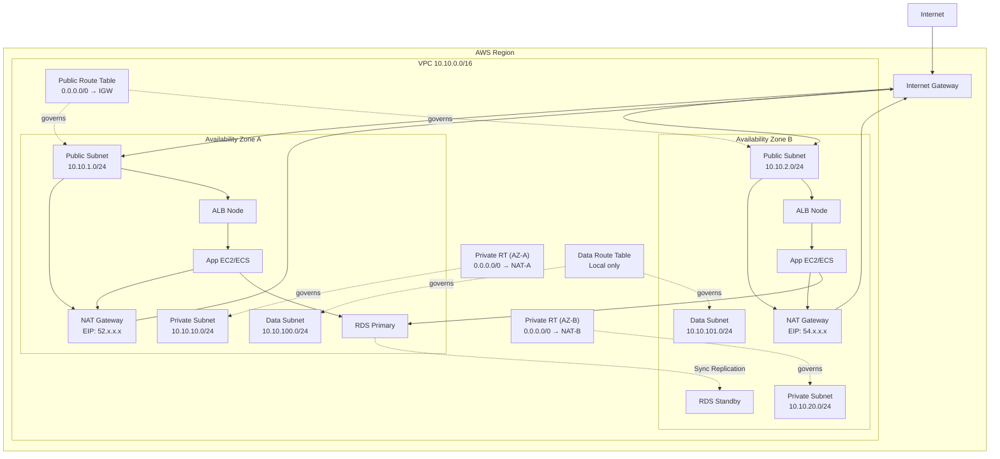
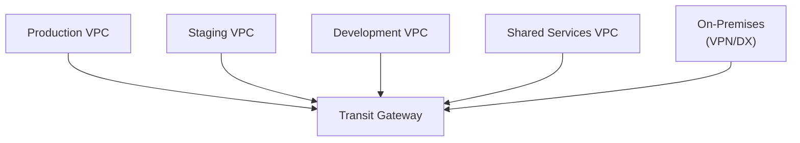

# VPC Networking Deep Dive

The Virtual Private Cloud is the foundational network layer for everything you run in AWS. Every EC2 instance, every ECS task, every RDS database lives inside a VPC. Getting VPC design right from the start is critical — re-addressing a live VPC with production traffic is one of the most painful operations in AWS.

This guide goes from first principles through production-grade Terraform. By the end you will understand not just how to configure VPC components, but why each exists and when to use each option.

---

## 1. Why VPC Exists: The Problem It Solves

In AWS's earliest days (2006-2009), EC2 instances launched into a flat "EC2-Classic" network shared with all other AWS customers. Your instances got public IP addresses by default and could communicate with any other EC2 instance in the same region — including other customers' instances if you guessed their IP.

VPC, launched in 2009, gave customers a private, logically isolated network within AWS. You define:
- Your own IP address space (CIDR block)
- Your own subnets
- Your own routing tables
- Your own firewall rules

EC2-Classic was deprecated in 2022. Every AWS workload today runs in a VPC. Understanding VPC is therefore not optional — it is foundational.

---

## 2. CIDR Blocks: Sizing Your VPC

### IP Address Fundamentals

CIDR (Classless Inter-Domain Routing) notation expresses a range of IP addresses as a base address plus a prefix length. `10.0.0.0/16` means the first 16 bits are fixed (10.0), leaving 16 bits variable — that is 65,536 addresses (2^16).

| CIDR | Addresses | Typical Use |
|------|-----------|-------------|
| /8 | 16,777,216 | Entire RFC 1918 block |
| /16 | 65,536 | VPC |
| /17 | 32,768 | Large VPC |
| /20 | 4,096 | Medium subnet |
| /24 | 256 | Standard subnet |
| /27 | 32 | Small subnet |
| /28 | 16 | Tiny subnet (minimum for AWS) |

AWS reserves 5 addresses in every subnet:
- x.x.x.0 — Network address
- x.x.x.1 — VPC router
- x.x.x.2 — DNS resolver
- x.x.x.3 — Reserved for future use
- x.x.x.255 — Broadcast (AWS does not support broadcast, but still reserved)

So a /24 subnet gives you 256 - 5 = **251 usable addresses**.

### RFC 1918 Private Ranges

Use only private IP ranges for VPCs:
- `10.0.0.0/8` — 16 million addresses (most common for VPCs)
- `172.16.0.0/12` — 1 million addresses
- `192.168.0.0/16` — 65,536 addresses

### CIDR Planning: The Critical Design Decision

**Start with a /16 VPC.** Here is why: once you create a VPC, you cannot shrink the CIDR block. You can add secondary CIDR blocks (up to 5 total), but you cannot remove or modify the primary. If you start with a /24 (256 addresses), you will run out of IP space before your subnets even have meaningful numbers of resources.

```
VPC: 10.10.0.0/16  (65,531 usable addresses)

AZ-A:
  Public subnet:   10.10.1.0/24   (251 usable)
  Private subnet:  10.10.10.0/24  (251 usable)
  Database subnet: 10.10.100.0/24 (251 usable)

AZ-B:
  Public subnet:   10.10.2.0/24
  Private subnet:  10.10.20.0/24
  Database subnet: 10.10.101.0/24

AZ-C:
  Public subnet:   10.10.3.0/24
  Private subnet:  10.10.30.0/24
  Database subnet: 10.10.102.0/24
```

This layout:
- Puts public subnets in the 1.x, 2.x, 3.x range — easy to identify
- Puts private subnets in the 10.x, 20.x, 30.x range
- Puts database subnets in the 100.x, 101.x, 102.x range
- Leaves most of the /16 space for future subnets
- Uses /24 subnets (251 addresses each) — adequate for most use cases

### Avoiding RFC 1918 Conflicts

If you have on-premises networks or you are connecting multiple VPCs, plan CIDR blocks to avoid overlap. VPC peering and VPN connections cannot function when the IP ranges overlap.

A practical allocation strategy for organizations with multiple environments:

| Environment | VPC CIDR |
|------------|---------|
| Production | 10.0.0.0/16 |
| Staging | 10.1.0.0/16 |
| Development | 10.2.0.0/16 |
| Shared Services | 10.3.0.0/16 |
| On-premises | 172.16.0.0/16 |

Document this table in a network IPAM (IP Address Management) spreadsheet or tool. AWS has an integrated IPAM service (VPC IPAM) that can manage CIDR allocation across accounts.

---

## 3. Subnets: Public vs Private

A **subnet** is a range of IP addresses within your VPC. Subnets exist in exactly one AZ — they cannot span AZs.

### What Makes a Subnet "Public"

A public subnet is one where resources can have public IP addresses directly reachable from the internet. This requires two things:
1. The subnet has a route to an **Internet Gateway** (0.0.0.0/0 → igw-xxx)
2. The resource in the subnet has a public IP address (either elastic IP or auto-assigned)

Without both, traffic cannot flow. The internet gateway is the door; the public IP is the address on the mailbox.

### What Makes a Subnet "Private"

A private subnet has **no route to an internet gateway**. Resources in private subnets cannot receive inbound traffic from the internet and cannot initiate direct outbound connections to the internet.

For outbound internet access from private subnets (OS patches, API calls, container image pulls), you need a NAT Gateway or NAT instance.

### Subnet Tiers

Production VPCs typically have three subnet tiers per AZ:

**Public tier:** Application Load Balancers, NAT Gateways, bastion hosts. The only resources that need public IP addresses.

**Private (application) tier:** EC2 instances, ECS tasks, EKS nodes, Lambda functions. These need outbound internet access (for package downloads, API calls) but should not be directly reachable from the internet.

**Private (data) tier:** RDS instances, ElastiCache clusters. These should only be reachable from the application tier — not from the internet, and not even from the NAT Gateway.

---

## 4. Route Tables

Every subnet is associated with a route table. The route table determines where traffic is sent based on destination IP address.

AWS always processes routes longest-prefix-first (most specific route wins). The local route (VPC CIDR → local) is always present and cannot be deleted.

### Public Subnet Route Table

```
Destination       Target
10.10.0.0/16      local          (traffic within VPC stays local)
0.0.0.0/0         igw-xxxxxxxx   (everything else → internet gateway)
```

### Private Subnet Route Table

```
Destination       Target
10.10.0.0/16      local
0.0.0.0/0         nat-xxxxxxxx   (outbound internet via NAT Gateway)
```

### Database Subnet Route Table

```
Destination       Target
10.10.0.0/16      local
(no 0.0.0.0/0 route — no internet access)
```

Database subnets do not need internet access. The database is accessed by your application servers within the VPC. Removing the internet route is a defense-in-depth measure.

---

## 5. Internet Gateway

The Internet Gateway (IGW) is a horizontally scaled, redundant, highly available AWS-managed component that enables communication between your VPC and the internet. There is no bandwidth bottleneck — it scales automatically.

Key facts:
- One IGW per VPC
- No cost for the IGW itself (you pay for data transfer)
- Provides both inbound and outbound internet access for resources with public IPs
- Performs NAT for instances with public IPs (mapping between public and private IP)
- Created separately from VPC, then attached

```hcl
resource "aws_internet_gateway" "main" {
  vpc_id = aws_vpc.main.id

  tags = {
    Name = "main-igw"
  }
}
```

---

## 6. NAT Gateway

NAT Gateway provides outbound internet access for resources in private subnets. It performs Network Address Translation — replacing the private source IP with the NAT Gateway's elastic IP for outbound traffic.

### NAT Gateway vs NAT Instance

| Feature | NAT Gateway | NAT Instance |
|---------|------------|--------------|
| Managed by | AWS | You |
| Availability | Highly available within AZ | Single EC2 instance |
| Bandwidth | Up to 100 Gbps | Limited by instance size |
| Failover | Automatic | Manual / custom script |
| Cost | $0.045/hr + $0.045/GB | EC2 instance + data |
| Security Groups | Not applicable | Applicable |
| Maintenance | None | OS patches, updates |

**Use NAT Gateway unless you have extreme cost sensitivity and can tolerate operational complexity.**

### Cost Warning

NAT Gateway pricing as of 2026:
- **$0.045/hr per gateway** — ~$32.40/month regardless of traffic
- **$0.045/GB** of data processed

For three AZs (recommended), you pay ~$97/month in gateway fees alone, plus data processing fees. For applications with high egress to the internet, this adds up quickly.

A common cost optimization: if your private subnet resources are primarily accessing AWS services (S3, DynamoDB, SQS), use **VPC Gateway Endpoints** for those services instead of routing through NAT Gateway. Gateway endpoints are free.

### High Availability: One NAT Gateway Per AZ

Deploy one NAT Gateway per AZ. Each NAT Gateway is bound to a specific AZ. If you put one NAT Gateway in AZ-A and route all private subnets through it, an AZ-A failure takes out internet access for your AZ-B and AZ-C private subnets.

```
AZ-A private subnet → NAT GW in AZ-A → IGW
AZ-B private subnet → NAT GW in AZ-B → IGW
AZ-C private subnet → NAT GW in AZ-C → IGW
```

```hcl
resource "aws_eip" "nat" {
  for_each = var.azs
  domain   = "vpc"
}

resource "aws_nat_gateway" "main" {
  for_each      = var.azs
  allocation_id = aws_eip.nat[each.key].id
  subnet_id     = aws_subnet.public[each.key].id
}
```

---

## 7. Security Groups

Security Groups are **stateful**, **virtual firewalls** applied at the network interface level (ENI). They control inbound and outbound traffic for individual AWS resources.

### Stateful Behavior

Stateful means: if you allow inbound traffic on port 443, the response traffic is automatically allowed outbound, regardless of outbound rules. You do not need to explicitly allow the return traffic.

This simplifies rule management significantly compared to traditional firewalls.

### Inbound and Outbound Rules

Each rule specifies:
- **Protocol:** TCP, UDP, ICMP, or All
- **Port range:** single port or range
- **Source/Destination:** CIDR block, another security group, or a prefix list

By default, a new security group allows all outbound traffic and no inbound traffic.

### Self-Referencing Security Groups

A powerful pattern: allow a security group to reference itself as a source. This allows any resource in the group to communicate with any other resource in the same group without specifying IP addresses.

```hcl
resource "aws_security_group" "ecs_cluster" {
  name   = "ecs-cluster"
  vpc_id = aws_vpc.main.id
}

resource "aws_security_group_rule" "self_ingress" {
  type                     = "ingress"
  from_port                = 0
  to_port                  = 65535
  protocol                 = "tcp"
  source_security_group_id = aws_security_group.ecs_cluster.id
  security_group_id        = aws_security_group.ecs_cluster.id
  description              = "Allow intra-cluster communication"
}
```

This is used for ECS clusters (containers talking to each other), EKS pods, and application tier instances that need to communicate without hardcoding IPs.

### Security Group Chains

Reference security groups in rules instead of CIDR blocks. This is more secure and easier to manage:

```hcl
# ALB security group
resource "aws_security_group" "alb" {
  name   = "alb"
  vpc_id = aws_vpc.main.id

  ingress {
    from_port   = 443
    to_port     = 443
    protocol    = "tcp"
    cidr_blocks = ["0.0.0.0/0"]
  }
}

# Application security group — only allow from ALB
resource "aws_security_group" "app" {
  name   = "app"
  vpc_id = aws_vpc.main.id

  ingress {
    from_port       = 8080
    to_port         = 8080
    protocol        = "tcp"
    security_groups = [aws_security_group.alb.id]
  }
}

# RDS security group — only allow from app
resource "aws_security_group" "rds" {
  name   = "rds"
  vpc_id = aws_vpc.main.id

  ingress {
    from_port       = 5432
    to_port         = 5432
    protocol        = "tcp"
    security_groups = [aws_security_group.app.id]
  }
}
```

This creates a clear chain: Internet → ALB → App → RDS. Nothing bypasses the chain because no security group allows direct access.

### Security Group Limits

- 60 inbound rules + 60 outbound rules per security group (default)
- 5 security groups per network interface (default)
- Total rules across all SGs on an ENI = 300 (inbound) + 300 (outbound)

Exceeding these limits requires quota increases and is a sign your security group architecture may need redesign.

---

## 8. Network ACLs

Network Access Control Lists (NACLs) operate at the **subnet level** and are **stateless**. Unlike security groups, you must explicitly allow both inbound and outbound traffic, including return traffic.

### NACLs vs Security Groups

| Feature | Security Groups | Network ACLs |
|---------|----------------|--------------|
| Stateful | Yes | No |
| Applies to | Resource (ENI) | Subnet |
| Default behavior | Deny all in, allow all out | Allow all |
| Rule evaluation | All rules evaluated | Rules processed in number order |
| Allow and Deny | Allow only | Allow and Deny |
| Supports | TCP, UDP, ICMP | TCP, UDP, ICMP |

### When to Use NACLs

NACLs are useful for:
1. **Blocking specific IP ranges** — blocking known malicious IPs at the subnet level before they even reach your instances
2. **Compliance requirements** — some frameworks require subnet-level access controls
3. **Additional defense layer** — belt-and-suspenders with security groups

For most applications, security groups alone are sufficient. NACLs add complexity (stateless rule management is error-prone) with limited benefit unless you have a specific use case.

### NACL Rules

Rules are numbered 1-32766, evaluated in ascending order. The first matching rule applies.

```
Rule # | Type        | Protocol | Port Range | Source      | Allow/Deny
100    | HTTP        | TCP      | 80         | 0.0.0.0/0   | Allow
110    | HTTPS       | TCP      | 443        | 0.0.0.0/0   | Allow
120    | Custom TCP  | TCP      | 1024-65535 | 0.0.0.0/0   | Allow  (return traffic)
*      | All traffic | All      | All        | 0.0.0.0/0   | Deny   (default)
```

Note the return traffic rule (1024-65535) — this is necessary because NACLs are stateless. The return traffic for a client's HTTPS request comes back on an ephemeral port (1024-65535).

---

## 9. Complete VPC Architecture



---

## 10. VPC Peering

VPC Peering creates a direct private network connection between two VPCs. Traffic stays within the AWS network backbone — it never traverses the internet.

### Characteristics

- Works across accounts (cross-account peering)
- Works across regions (inter-region peering, latency applies)
- No bandwidth bottleneck — limited only by the resources on each end
- No additional cost for data transfer within the same AZ; $0.01/GB for cross-AZ; inter-region rates apply for cross-region

### Limitations

**The critical limitation: no transitive peering.**

If VPC-A peers with VPC-B, and VPC-B peers with VPC-C:
- VPC-A can talk to VPC-B ✓
- VPC-B can talk to VPC-C ✓
- VPC-A **cannot** talk to VPC-C via VPC-B ✗

For more than a handful of VPCs that need full mesh connectivity, peering becomes unmaintainable. The quadratic growth of connections (N VPCs = N*(N-1)/2 peering connections) is why Transit Gateway exists.

### When to Use VPC Peering

- 2-5 VPCs that need connectivity
- Simple hub-and-spoke patterns (shared services VPC peered with workload VPCs)
- Low-cost option for limited connectivity requirements

```hcl
resource "aws_vpc_peering_connection" "prod_to_shared" {
  vpc_id        = aws_vpc.production.id
  peer_vpc_id   = aws_vpc.shared_services.id
  peer_owner_id = var.shared_services_account_id
  auto_accept   = false  # Must be accepted in the peer account

  tags = {
    Name = "prod-to-shared-services"
  }
}

# In the peer account
resource "aws_vpc_peering_connection_accepter" "shared" {
  vpc_peering_connection_id = var.peering_connection_id
  auto_accept               = true
}
```

---

## 11. Transit Gateway

Transit Gateway (TGW) is a fully managed network transit hub. Instead of peering VPCs directly with each other, all VPCs connect to the TGW. TGW routes traffic between them.



Instead of 6 peering connections for 4 VPCs, you have 4 TGW attachments.

### TGW Concepts

**Attachments:** VPCs, VPNs, Direct Connect gateways, and other TGWs connect via attachments.

**Route tables:** TGW has its own route tables (separate from VPC route tables). You associate attachments with route tables and propagate routes from attachments into route tables.

**Route propagation:** VPC routes are automatically propagated from the VPC attachment into the TGW route table, or you can configure static routes.

**Bandwidth:** Up to 50 Gbps per TGW attachment. No limit on number of attachments.

### TGW Pricing (2026)

- **$0.05/hr per TGW attachment** — a VPC with 2 subnets in 2 AZs uses 1 attachment but ENIs in each AZ
- **$0.02/GB** processed through TGW
- TGW itself: no charge (you pay for attachments and data)

For 10 VPCs: ~$36/month just for attachments, plus data transfer.

### When to Use Transit Gateway

- 5+ VPCs requiring interconnection
- Hybrid connectivity (VPN or Direct Connect to multiple VPCs)
- Centralized egress architecture (route all outbound internet traffic through a shared inspection VPC)
- Multi-account architectures

---

## 12. VPC Endpoints

VPC Endpoints allow you to connect to AWS services without routing traffic through NAT Gateway or the internet. Traffic stays within the AWS network.

### Gateway Endpoints (Free)

Gateway endpoints are route table entries that route traffic to S3 or DynamoDB directly within the AWS network.

**Supported services:** S3, DynamoDB only

```hcl
resource "aws_vpc_endpoint" "s3" {
  vpc_id            = aws_vpc.main.id
  service_name      = "com.amazonaws.${var.region}.s3"
  vpc_endpoint_type = "Gateway"
  route_table_ids   = [aws_route_table.private.id]

  tags = {
    Name = "s3-gateway-endpoint"
  }
}
```

Once configured, traffic from private subnets to S3 routes through the endpoint instead of NAT Gateway. This is **free** and reduces NAT Gateway data processing fees — a meaningful cost savings for applications that read/write large amounts of S3 data.

### Interface Endpoints (PrivateLink)

Interface endpoints create an ENI in your subnet with a private IP address. Traffic to the AWS service goes through this ENI, staying on the AWS private network.

Supported services: Almost all AWS services — ECR, CloudWatch, SSM, Secrets Manager, STS, KMS, and many more.

```hcl
resource "aws_vpc_endpoint" "ecr_api" {
  vpc_id              = aws_vpc.main.id
  service_name        = "com.amazonaws.${var.region}.ecr.api"
  vpc_endpoint_type   = "Interface"
  subnet_ids          = [for s in aws_subnet.private : s.id]
  security_group_ids  = [aws_security_group.vpc_endpoints.id]
  private_dns_enabled = true  # Resolves ecr.amazonaws.com to private IP

  tags = {
    Name = "ecr-api-endpoint"
  }
}
```

**Cost:** ~$0.01/hr per AZ per endpoint + $0.01/GB. For 3 AZs and 5 common endpoints (ECR, CloudWatch, SSM, Secrets Manager, STS): ~$108/month.

**When interface endpoints are worth it:**
- ECS/EKS pulling images from ECR in VPCs without NAT Gateway
- Lambda in VPC accessing AWS services without NAT Gateway
- Sensitive environments where all traffic must stay off the internet
- High data transfer to/from AWS services (cost savings vs NAT Gateway)

---

## 13. VPN: Site-to-Site and Client VPN

### Site-to-Site VPN

Connects your on-premises network to your VPC over IPsec tunnels through the internet. Each VPN connection has two tunnels for redundancy.

- **Bandwidth:** Up to 1.25 Gbps per tunnel
- **Cost:** $0.05/hr per VPN connection + $0.05/GB
- **Latency:** Depends on your internet connection — typically 20-100ms additional latency
- **Use case:** Hybrid connectivity when Direct Connect is not yet set up or too expensive

### Client VPN

AWS-managed VPN service for remote users to connect to VPC resources.

- **Cost:** $0.10/hr per association (per subnet) + $0.05/hr per client connection
- **Authentication:** Active Directory, SAML (Okta, etc.), certificate-based
- **Use case:** Remote access to private resources without bastion host

```hcl
resource "aws_ec2_client_vpn_endpoint" "main" {
  description            = "Client VPN for engineers"
  server_certificate_arn = aws_acm_certificate.vpn.arn
  client_cidr_block      = "10.200.0.0/16"

  authentication_options {
    type                = "federated-authentication"
    saml_provider_arn   = aws_iam_saml_provider.okta.arn
  }

  connection_log_options {
    enabled               = true
    cloudwatch_log_group  = aws_cloudwatch_log_group.vpn.name
    cloudwatch_log_stream = aws_cloudwatch_log_stream.vpn.name
  }

  split_tunnel = true  # Only route VPC traffic through VPN; internet goes direct
}
```

---

## 14. Direct Connect

Direct Connect provides dedicated private network connectivity from your data center to AWS — no internet involved. Bandwidths from 50 Mbps to 100 Gbps.

### When to Use Direct Connect

- High bandwidth requirements (>1 Gbps sustained)
- Consistent, predictable latency requirements (<10ms to AWS)
- Large data transfer volumes (cheaper than internet egress at scale)
- Regulatory requirements for private connectivity

### Direct Connect vs VPN

| Feature | Site-to-Site VPN | Direct Connect |
|---------|-----------------|---------------|
| Path | Internet (encrypted) | Dedicated private circuit |
| Bandwidth | Up to 1.25 Gbps | 1, 10, or 100 Gbps |
| Latency | 20-100ms (variable) | 2-20ms (consistent) |
| Cost | $0.05/hr + data | $0.3-2.25/hr (port) + data + colocation |
| Setup time | Hours | Weeks to months |

Direct Connect has significant setup complexity — you need a colocation facility or work with an AWS Direct Connect partner. The cost savings on data transfer can be substantial at high volumes ($0.02/GB vs $0.09/GB for internet egress).

---

## 15. VPC Flow Logs

VPC Flow Logs capture information about IP traffic going to and from network interfaces in your VPC. They are the foundation of network visibility and security analysis.

### What Flow Logs Capture

```
version account-id interface-id srcaddr dstaddr srcport dstport protocol packets bytes windowstart windowend action log-status
2 123456789012 eni-abc12345 10.10.10.5 10.10.100.10 45678 5432 6 20 2000 1620000000 1620000060 ACCEPT OK
2 123456789012 eni-abc12345 203.0.113.5 10.10.1.50 54321 443 6 10 1500 1620000000 1620000060 REJECT OK
```

Fields include: source/destination IP, ports, protocol, packet count, byte count, action (ACCEPT/REJECT), and timestamps.

### Enabling Flow Logs

```hcl
resource "aws_cloudwatch_log_group" "flow_logs" {
  name              = "/aws/vpc/flow-logs"
  retention_in_days = 30
}

resource "aws_flow_log" "main" {
  vpc_id          = aws_vpc.main.id
  traffic_type    = "ALL"  # ACCEPT, REJECT, or ALL
  iam_role_arn    = aws_iam_role.flow_logs.arn
  log_destination = aws_cloudwatch_log_group.flow_logs.arn

  tags = {
    Name = "vpc-flow-logs"
  }
}
```

For cost efficiency, send flow logs to S3 instead of CloudWatch Logs. CloudWatch Logs charges $0.50/GB ingested; S3 charges $0.023/GB stored. Use Athena to query S3-stored flow logs.

### Analyzing Flow Logs with Athena

```sql
CREATE EXTERNAL TABLE vpc_flow_logs (
  version string,
  account string,
  interfaceid string,
  sourceaddress string,
  destinationaddress string,
  sourceport int,
  destinationport int,
  protocol int,
  numpackets bigint,
  numbytes bigint,
  starttime int,
  endtime int,
  action string,
  logstatus string
)
PARTITIONED BY (dt string)
ROW FORMAT DELIMITED
FIELDS TERMINATED BY ' '
STORED AS TEXTFILE
LOCATION 's3://my-flow-logs-bucket/AWSLogs/123456789012/vpcflowlogs/us-east-1/'
TBLPROPERTIES ("skip.header.line.count"="1");

-- Find rejected traffic (potential attacks or misconfigured SGs)
SELECT sourceaddress, destinationaddress, destinationport, count(*) as attempts
FROM vpc_flow_logs
WHERE action = 'REJECT'
  AND dt = '2026-03-17'
GROUP BY 1, 2, 3
ORDER BY 4 DESC
LIMIT 50;
```

---

## 16. Complete Terraform VPC Module

```hcl
# variables.tf
variable "vpc_cidr" {
  description = "CIDR block for the VPC"
  type        = string
  default     = "10.10.0.0/16"
}

variable "azs" {
  description = "Availability zones to use"
  type        = list(string)
  default     = ["us-east-1a", "us-east-1b", "us-east-1c"]
}

variable "public_subnet_cidrs" {
  type    = list(string)
  default = ["10.10.1.0/24", "10.10.2.0/24", "10.10.3.0/24"]
}

variable "private_subnet_cidrs" {
  type    = list(string)
  default = ["10.10.10.0/24", "10.10.20.0/24", "10.10.30.0/24"]
}

variable "database_subnet_cidrs" {
  type    = list(string)
  default = ["10.10.100.0/24", "10.10.101.0/24", "10.10.102.0/24"]
}

variable "enable_nat_gateway" {
  type    = bool
  default = true
}

variable "single_nat_gateway" {
  description = "Use single NAT GW for cost savings (not HA)"
  type        = bool
  default     = false
}

variable "environment" {
  type = string
}

variable "project" {
  type = string
}

# main.tf
resource "aws_vpc" "main" {
  cidr_block           = var.vpc_cidr
  enable_dns_hostnames = true
  enable_dns_support   = true

  tags = {
    Name        = "${var.project}-${var.environment}-vpc"
    Environment = var.environment
  }
}

# Internet Gateway
resource "aws_internet_gateway" "main" {
  vpc_id = aws_vpc.main.id

  tags = {
    Name = "${var.project}-${var.environment}-igw"
  }
}

# Public Subnets
resource "aws_subnet" "public" {
  count = length(var.azs)

  vpc_id                  = aws_vpc.main.id
  cidr_block              = var.public_subnet_cidrs[count.index]
  availability_zone       = var.azs[count.index]
  map_public_ip_on_launch = true

  tags = {
    Name = "${var.project}-${var.environment}-public-${var.azs[count.index]}"
    Tier = "public"
  }
}

# Private Subnets
resource "aws_subnet" "private" {
  count = length(var.azs)

  vpc_id            = aws_vpc.main.id
  cidr_block        = var.private_subnet_cidrs[count.index]
  availability_zone = var.azs[count.index]

  tags = {
    Name = "${var.project}-${var.environment}-private-${var.azs[count.index]}"
    Tier = "private"
    # For EKS — tags required for subnet discovery
    "kubernetes.io/role/internal-elb" = "1"
  }
}

# Database Subnets
resource "aws_subnet" "database" {
  count = length(var.azs)

  vpc_id            = aws_vpc.main.id
  cidr_block        = var.database_subnet_cidrs[count.index]
  availability_zone = var.azs[count.index]

  tags = {
    Name = "${var.project}-${var.environment}-database-${var.azs[count.index]}"
    Tier = "database"
  }
}

# Elastic IPs for NAT Gateways
resource "aws_eip" "nat" {
  count  = var.enable_nat_gateway ? (var.single_nat_gateway ? 1 : length(var.azs)) : 0
  domain = "vpc"

  tags = {
    Name = "${var.project}-${var.environment}-nat-eip-${count.index}"
  }

  depends_on = [aws_internet_gateway.main]
}

# NAT Gateways
resource "aws_nat_gateway" "main" {
  count = var.enable_nat_gateway ? (var.single_nat_gateway ? 1 : length(var.azs)) : 0

  allocation_id = aws_eip.nat[count.index].id
  subnet_id     = aws_subnet.public[count.index].id

  tags = {
    Name = "${var.project}-${var.environment}-nat-${count.index}"
  }

  depends_on = [aws_internet_gateway.main]
}

# Public Route Table
resource "aws_route_table" "public" {
  vpc_id = aws_vpc.main.id

  route {
    cidr_block = "0.0.0.0/0"
    gateway_id = aws_internet_gateway.main.id
  }

  tags = {
    Name = "${var.project}-${var.environment}-public-rt"
  }
}

resource "aws_route_table_association" "public" {
  count          = length(var.azs)
  subnet_id      = aws_subnet.public[count.index].id
  route_table_id = aws_route_table.public.id
}

# Private Route Tables (one per AZ for HA)
resource "aws_route_table" "private" {
  count  = length(var.azs)
  vpc_id = aws_vpc.main.id

  dynamic "route" {
    for_each = var.enable_nat_gateway ? [1] : []
    content {
      cidr_block     = "0.0.0.0/0"
      nat_gateway_id = var.single_nat_gateway ? aws_nat_gateway.main[0].id : aws_nat_gateway.main[count.index].id
    }
  }

  tags = {
    Name = "${var.project}-${var.environment}-private-rt-${var.azs[count.index]}"
  }
}

resource "aws_route_table_association" "private" {
  count          = length(var.azs)
  subnet_id      = aws_subnet.private[count.index].id
  route_table_id = aws_route_table.private[count.index].id
}

# Database Route Table (no internet access)
resource "aws_route_table" "database" {
  vpc_id = aws_vpc.main.id

  tags = {
    Name = "${var.project}-${var.environment}-database-rt"
  }
}

resource "aws_route_table_association" "database" {
  count          = length(var.azs)
  subnet_id      = aws_subnet.database[count.index].id
  route_table_id = aws_route_table.database.id
}

# S3 Gateway Endpoint (free — bypasses NAT for S3 traffic)
resource "aws_vpc_endpoint" "s3" {
  vpc_id            = aws_vpc.main.id
  service_name      = "com.amazonaws.${data.aws_region.current.name}.s3"
  vpc_endpoint_type = "Gateway"

  route_table_ids = concat(
    [aws_route_table.public.id],
    aws_route_table.private[*].id,
    [aws_route_table.database.id]
  )

  tags = {
    Name = "${var.project}-${var.environment}-s3-endpoint"
  }
}

# DynamoDB Gateway Endpoint (free)
resource "aws_vpc_endpoint" "dynamodb" {
  vpc_id            = aws_vpc.main.id
  service_name      = "com.amazonaws.${data.aws_region.current.name}.dynamodb"
  vpc_endpoint_type = "Gateway"

  route_table_ids = concat(
    [aws_route_table.public.id],
    aws_route_table.private[*].id
  )

  tags = {
    Name = "${var.project}-${var.environment}-dynamodb-endpoint"
  }
}

# VPC Flow Logs
resource "aws_flow_log" "main" {
  vpc_id          = aws_vpc.main.id
  traffic_type    = "ALL"
  iam_role_arn    = aws_iam_role.flow_logs.arn
  log_destination = aws_cloudwatch_log_group.flow_logs.arn
}

resource "aws_cloudwatch_log_group" "flow_logs" {
  name              = "/aws/vpc/${var.project}-${var.environment}/flow-logs"
  retention_in_days = 30
}

resource "aws_iam_role" "flow_logs" {
  name = "${var.project}-${var.environment}-flow-logs"

  assume_role_policy = jsonencode({
    Version = "2012-10-17"
    Statement = [{
      Effect    = "Allow"
      Principal = { Service = "vpc-flow-logs.amazonaws.com" }
      Action    = "sts:AssumeRole"
    }]
  })
}

resource "aws_iam_role_policy" "flow_logs" {
  name = "flow-logs-policy"
  role = aws_iam_role.flow_logs.id

  policy = jsonencode({
    Version = "2012-10-17"
    Statement = [{
      Effect = "Allow"
      Action = [
        "logs:CreateLogGroup",
        "logs:CreateLogStream",
        "logs:PutLogEvents",
        "logs:DescribeLogGroups",
        "logs:DescribeLogStreams"
      ]
      Resource = "*"
    }]
  })
}

data "aws_region" "current" {}

# outputs.tf
output "vpc_id" {
  value = aws_vpc.main.id
}

output "public_subnet_ids" {
  value = aws_subnet.public[*].id
}

output "private_subnet_ids" {
  value = aws_subnet.private[*].id
}

output "database_subnet_ids" {
  value = aws_subnet.database[*].id
}

output "nat_gateway_ips" {
  value = aws_eip.nat[*].public_ip
}
```

---

## 17. Edge Cases and Failure Modes

### Failure: AZ Down, Single NAT Gateway

**Scenario:** You have one NAT Gateway in AZ-A to save cost. AZ-A experiences an outage.

**Result:** All private subnets in AZ-B and AZ-C lose internet access. Your AZ-B and AZ-C application instances cannot reach external APIs, pull container images, or send logs.

**Lesson:** In production, always deploy one NAT Gateway per AZ. The cost (~$32.40/month per AZ) is negligible compared to the cost of an outage.

### Failure: VPC CIDR Exhaustion

**Scenario:** You created a VPC with a /24 CIDR (256 addresses). After running for a year, EKS node groups have consumed the available IPs.

**Result:** New pods cannot get IP addresses. EKS nodes become NotReady. Scaling fails.

**Resolution:** AWS allows you to add secondary CIDR blocks to an existing VPC. You can add up to 4 additional blocks. However, you cannot remove the original CIDR, and the overlapping block restriction applies.

**Lesson:** Plan for 10x your current needs. Use /16 VPCs.

### Failure: Security Group Rule Limit

**Scenario:** Your application has a complex web of security group rules. Terraform apply fails with "the maximum number of rules per security group has been reached."

**Resolution:** Consolidate rules. Use security group references instead of individual CIDR rules. Consider using AWS-managed prefix lists.

### Failure: DNS Resolution Fails in VPC

**Scenario:** EC2 instances in your VPC cannot resolve internal Route 53 private hosted zone names.

**Common causes:**
1. `enableDnsSupport` set to false on the VPC
2. `enableDnsHostnames` set to false (affects EC2 hostname resolution)
3. Instance is querying 8.8.8.8 instead of the VPC DNS resolver (169.254.169.253 or the VPC CIDR +2)

---

## 18. Performance Characteristics

- **VPC routing:** No measurable latency — routing is performed in hardware
- **Security group evaluation:** Negligible — evaluated in hardware by hypervisor
- **NAT Gateway throughput:** Scales to 100 Gbps automatically, no burst limits
- **NAT Gateway latency:** ~0.5-1ms additional per packet
- **Interface endpoints:** Adds ~0.5ms vs direct NAT Gateway routing
- **VPC Peering:** No bandwidth limitation, no additional latency beyond physical distance
- **Transit Gateway:** Up to 50 Gbps per attachment, ~1ms processing overhead

**Cross-AZ latency:** Typically 1-2ms within a region. This is fast enough for synchronous database replication (PostgreSQL streaming replication has typical lag <100ms even under load).

**Cross-AZ data transfer cost:** $0.01/GB in each direction = $0.02/GB round trip. For applications moving gigabytes of data between AZs (e.g., cross-AZ ElasticSearch), this cost is significant. Design to minimize cross-AZ traffic.

---

::: info War Story: VPC CIDR Conflict After Acquisition

In 2023, our company acquired a startup and began the process of merging their infrastructure into our AWS organization. The startup had been running on `10.0.0.0/16` — the same CIDR block as our production VPC.

The merger plan called for connecting the two VPCs via Transit Gateway so our systems could communicate during the migration period. We discovered the conflict one week before the scheduled cutover.

Our options:
1. Re-CIDR one of the VPCs (requires re-IP of every resource — weeks of work, high risk)
2. Use a NAT-based solution with overlapping CIDRs (AWS supports this but it is complex and brittle)
3. Connect via Application Load Balancers as a proxy layer (higher latency, limited protocol support)

We chose option 3 as a temporary measure and spent three months properly re-CIDRing the acquired company's VPC using secondary CIDR blocks, gradually migrating resources.

The lesson: before any M&A technical due diligence, check VPC CIDRs. Add it to your acquisition checklist. The startup had used `10.0.0.0/16` because it was the AWS default — nobody thought about future connectivity.

We now have an organization-wide IPAM policy that assigns unique CIDR ranges to every VPC via AWS VPC IPAM, preventing this situation entirely.

:::

---

## 19. Decision Framework: VPC Connectivity Options

```
Do you need to connect VPCs?
├── 2-3 VPCs, same account
│   └── VPC Peering (simple, cheap)
├── 4+ VPCs or multiple accounts
│   └── Transit Gateway (hub-and-spoke)
└── Need to connect to on-premises?
    ├── <1 Gbps, variable requirement
    │   └── Site-to-Site VPN (fast setup)
    └── >1 Gbps, consistent latency needed
        └── Direct Connect (dedicated circuit)

Do you need to access AWS services from private subnets?
├── S3 or DynamoDB
│   └── Gateway Endpoint (free!)
├── ECR, CloudWatch, SSM, etc.
│   └── Interface Endpoint (if cost justified)
└── Everything else
    └── NAT Gateway (general-purpose outbound)
```

---

## 20. Advanced Topics

### Shared VPC (Resource Access Manager)

AWS RAM (Resource Access Manager) allows sharing VPC subnets across accounts. Instead of peering, multiple accounts can deploy resources into subnets owned by a central networking account. This reduces the number of VPCs and Transit Gateway attachments while maintaining account-level billing separation.

### IPv6 in VPC

AWS supports IPv6 for VPCs. IPv6 addresses are publicly routable by design — there is no NAT for IPv6. Use Egress-Only Internet Gateways to allow outbound IPv6 without allowing inbound connections.

IPv6 adoption in private VPCs is low because most internal systems are IPv4. Consider IPv6 if you are building services that serve global internet traffic directly or have IPv6 requirements.

### AWS Network Firewall

A managed stateful firewall service that can inspect traffic at the packet level, perform deep packet inspection, and block based on domain names and protocols. Deployed in a dedicated inspection subnet, traffic is routed through it via route table manipulation.

Use Network Firewall for:
- Centralized egress filtering (block specific domains from your entire VPC)
- Intrusion detection and prevention (IDS/IPS)
- Compliance requirements for packet-level inspection

### Routing Traffic Through Inspection VPCs

A centralized egress architecture routes all internet-bound traffic from workload VPCs through a dedicated inspection VPC containing Network Firewall or a third-party NVA (Network Virtual Appliance). This provides a single point of control for egress policies.

This pattern uses Transit Gateway appliance mode to enable symmetric routing (traffic follows the same path in both directions), which is required for stateful inspection.
