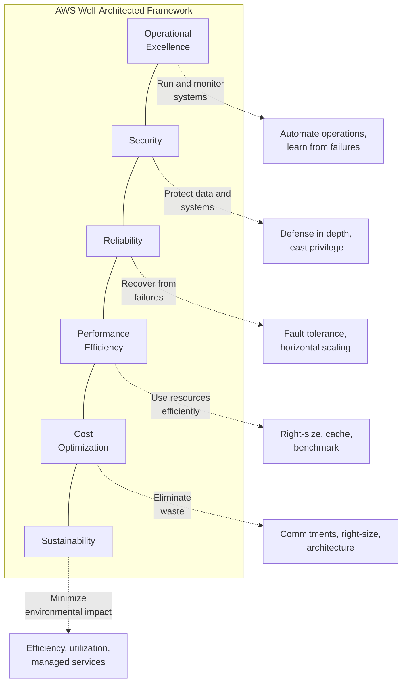
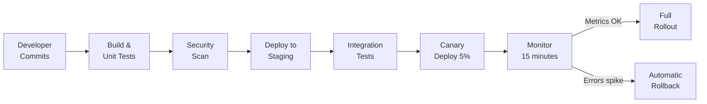
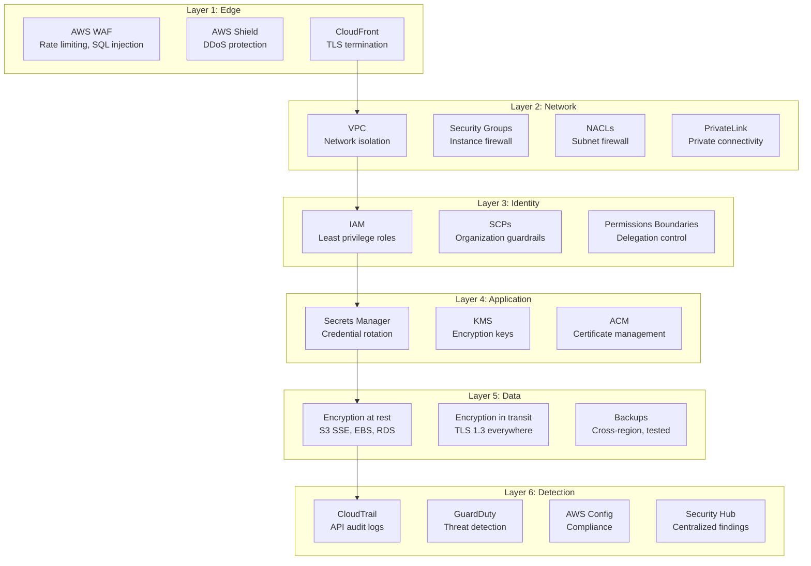
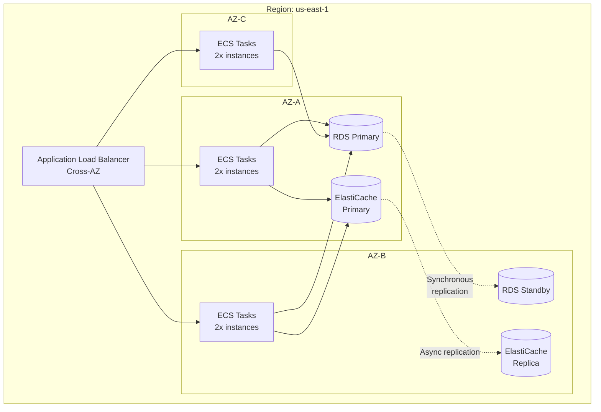
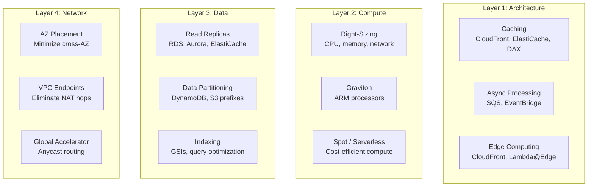
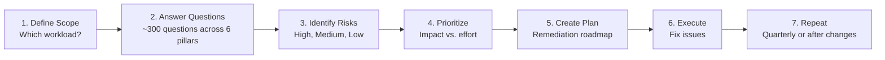

# AWS Well-Architected Framework

The Well-Architected Framework is AWS's codified set of architectural best practices, distilled from reviewing tens of thousands of customer workloads. It is not abstract theory — each recommendation comes from real production failures, outages, and cost overruns observed at scale.

The framework has evolved from five pillars (2015) to six pillars (2021, adding Sustainability). Understanding it deeply transforms how you evaluate architectural decisions, conduct design reviews, and prioritize technical debt.

---

## 1. Why the Framework Exists

### The Problem

Without a structured evaluation framework, architecture reviews devolve into bikeshedding. Teams argue about technology choices while ignoring fundamental questions: "What happens when this component fails?" "How will we know if this is performing poorly?" "What does this cost per request?"

AWS built the Well-Architected Framework because they noticed the same categories of mistakes across thousands of customers:

1. **No disaster recovery plan** until the first outage
2. **Security as an afterthought** — open S3 buckets, root credentials in code
3. **Over-provisioned infrastructure** — paying for 10x what they needed
4. **No observability** — learning about outages from customer complaints
5. **Monolithic everything** — single points of failure everywhere

### The Six Pillars



---

## 2. Pillar 1: Operational Excellence

### Core Question

> "How do you run, monitor, and improve your systems?"

### Design Principles

1. **Perform operations as code** — Infrastructure as Code, runbooks as code, deployment as code
2. **Make frequent, small, reversible changes** — Small deployments reduce blast radius
3. **Refine operations procedures frequently** — Regularly update runbooks
4. **Anticipate failure** — Game days, chaos engineering
5. **Learn from all operational failures** — Blameless post-mortems

### Key Practices

#### Infrastructure as Code

Every piece of infrastructure must be reproducible from code:

```hcl
# Operational excellence: everything is code
# main.tf — Complete environment definition
module "vpc" {
  source  = "./modules/vpc"
  cidr    = "10.0.0.0/16"
  azs     = ["us-east-1a", "us-east-1b", "us-east-1c"]
  environment = var.environment
}

module "ecs_cluster" {
  source       = "./modules/ecs-cluster"
  vpc_id       = module.vpc.vpc_id
  subnet_ids   = module.vpc.private_subnet_ids
  environment  = var.environment
}

module "monitoring" {
  source       = "./modules/monitoring"
  cluster_name = module.ecs_cluster.cluster_name
  environment  = var.environment
  alarm_sns_topic = module.alerting.sns_topic_arn
}
```

#### Deployment Pipeline



#### Runbook Automation

```typescript
// runbooks/restart-service.ts — Automated runbook
import { ECSClient, UpdateServiceCommand } from '@aws-sdk/client-ecs';
import { Logger } from '@aws-lambda-powertools/logger';

const logger = new Logger({ serviceName: 'runbook-restart' });

interface RestartServiceParams {
  cluster: string;
  service: string;
  reason: string;
  requestedBy: string;
}

export async function restartService(params: RestartServiceParams): Promise<{
  success: boolean;
  previousDesiredCount: number;
  deploymentId: string;
}> {
  const { cluster, service, reason, requestedBy } = params;

  logger.info('Service restart initiated', {
    cluster,
    service,
    reason,
    requestedBy,
    timestamp: new Date().toISOString(),
  });

  const ecs = new ECSClient({ region: process.env.AWS_REGION });

  // Force new deployment (replaces all tasks with new ones)
  const response = await ecs.send(new UpdateServiceCommand({
    cluster,
    service,
    forceNewDeployment: true,
  }));

  const deployment = response.service?.deployments?.find(d => d.status === 'PRIMARY');

  logger.info('Service restart deployment created', {
    deploymentId: deployment?.id,
    desiredCount: deployment?.desiredCount,
    runningCount: deployment?.runningCount,
  });

  return {
    success: true,
    previousDesiredCount: deployment?.desiredCount ?? 0,
    deploymentId: deployment?.id ?? 'unknown',
  };
}
```

### Operational Maturity Model

| Level | Characteristic | Examples |
|-------|---------------|----------|
| 1 - Manual | Everything done by hand | SSH into servers, manual deploys |
| 2 - Repeatable | Documented procedures | Written runbooks, basic CI/CD |
| 3 - Defined | Standardized processes | IaC, automated testing, monitoring |
| 4 - Managed | Measured and controlled | SLOs, error budgets, capacity planning |
| 5 - Optimizing | Continuous improvement | Chaos engineering, automated remediation |

---

## 3. Pillar 2: Security

### Core Question

> "How do you protect your data, systems, and assets?"

### Design Principles

1. **Implement a strong identity foundation** — Least privilege, centralized identity
2. **Enable traceability** — Log everything, monitor everything
3. **Apply security at all layers** — Network, application, data
4. **Automate security best practices** — Security as code
5. **Protect data in transit and at rest** — Encryption everywhere
6. **Keep people away from data** — Eliminate direct access need
7. **Prepare for security events** — Incident response plans

### Defense in Depth Architecture



### Security Checklist

| Category | Requirement | Implementation |
|----------|------------|----------------|
| Identity | No root account usage | SCP denying root actions |
| Identity | MFA on all human access | IAM condition key |
| Identity | No long-lived credentials | IAM Roles + Identity Center |
| Network | Private subnets for data | VPC architecture |
| Network | No public RDS/ElastiCache | Security groups + no public IP |
| Data | Encryption at rest | KMS CMKs, default encryption |
| Data | Encryption in transit | TLS 1.2+ enforced |
| Logging | All API calls logged | CloudTrail, all regions |
| Logging | Logs centralized | S3 + CloudWatch cross-account |
| Detection | Automated threat detection | GuardDuty enabled |
| Detection | Configuration compliance | AWS Config rules |
| Response | Incident response plan | Documented and tested |

### Encryption Decision Framework

| Data Type | At Rest | In Transit | Key Management |
|-----------|---------|-----------|----------------|
| PII | AES-256 (KMS CMK) | TLS 1.3 | Customer-managed key, auto-rotation |
| Financial | AES-256 (KMS CMK) | TLS 1.3 | Customer-managed key, HSM-backed |
| Application config | SSE-S3 | TLS 1.2+ | AWS-managed key |
| Logs | SSE-S3 | TLS 1.2+ | AWS-managed key |
| Backups | AES-256 (KMS CMK) | TLS 1.2+ | Customer-managed key |

---

## 4. Pillar 3: Reliability

### Core Question

> "How do you ensure your system operates correctly and consistently?"

### Design Principles

1. **Automatically recover from failure** — Self-healing systems
2. **Test recovery procedures** — Game days, chaos engineering
3. **Scale horizontally** — Multiple small resources, not one large
4. **Stop guessing capacity** — Auto-scaling
5. **Manage change in automation** — Infrastructure as Code

### Reliability Math

#### Availability Targets

| SLA | Annual Downtime | Monthly Downtime | Weekly Downtime |
|-----|----------------|-----------------|-----------------|
| 99% (two nines) | 3.65 days | 7.31 hours | 1.68 hours |
| 99.9% (three nines) | 8.77 hours | 43.83 minutes | 10.08 minutes |
| 99.95% | 4.38 hours | 21.92 minutes | 5.04 minutes |
| 99.99% (four nines) | 52.60 minutes | 4.38 minutes | 1.01 minutes |
| 99.999% (five nines) | 5.26 minutes | 26.30 seconds | 6.05 seconds |

#### Composite Availability

For components in **series** (all must work):

$$A_{total} = \prod_{i=1}^{n} A_i$$

For a system with API Gateway (99.95%) → Lambda (99.95%) → DynamoDB (99.999%):

$$A_{total} = 0.9995 \times 0.9995 \times 0.99999 = 0.99899 \approx 99.9\%$$

For components in **parallel** (any one must work):

$$A_{total} = 1 - \prod_{i=1}^{n} (1 - A_i)$$

Two independent instances at 99.9% each:

$$A_{total} = 1 - (1 - 0.999)^2 = 1 - 0.000001 = 0.999999 \approx 99.9999\%$$

### Multi-AZ Architecture Pattern



### Failure Mode Analysis

| Component | Failure Mode | Detection | Recovery | RTO |
|-----------|-------------|-----------|----------|-----|
| EC2/ECS task | Instance crash | Health check | Auto-replacement | 30-60s |
| RDS Primary | AZ failure | Multi-AZ heartbeat | Auto-failover | 60-120s |
| ElastiCache | Node failure | Health check | Auto-replacement | 60s |
| ALB | AZ failure | Built-in | Automatic rerouting | 0s |
| S3 | Never (11 nines) | N/A | N/A | N/A |
| Lambda | Throttling | CloudWatch | Increase concurrency | 1-5min |
| DynamoDB | Throttling | CloudWatch | Auto-scaling | 1-5min |

### Circuit Breaker Implementation

```typescript
// reliability/circuit-breaker.ts
enum CircuitState {
  CLOSED = 'CLOSED',       // Normal operation
  OPEN = 'OPEN',           // Failing, reject requests
  HALF_OPEN = 'HALF_OPEN', // Testing recovery
}

interface CircuitBreakerOptions {
  failureThreshold: number;    // Number of failures before opening
  recoveryTimeout: number;     // Milliseconds before trying half-open
  successThreshold: number;    // Successes needed to close from half-open
  monitoringWindow: number;    // Window to count failures
}

class CircuitBreaker {
  private state: CircuitState = CircuitState.CLOSED;
  private failureCount = 0;
  private successCount = 0;
  private lastFailureTime = 0;
  private readonly options: CircuitBreakerOptions;

  constructor(options: Partial<CircuitBreakerOptions> = {}) {
    this.options = {
      failureThreshold: 5,
      recoveryTimeout: 30000,
      successThreshold: 3,
      monitoringWindow: 60000,
      ...options,
    };
  }

  async execute<T>(fn: () => Promise<T>): Promise<T> {
    if (this.state === CircuitState.OPEN) {
      if (Date.now() - this.lastFailureTime >= this.options.recoveryTimeout) {
        this.state = CircuitState.HALF_OPEN;
        this.successCount = 0;
      } else {
        throw new Error('Circuit breaker is OPEN');
      }
    }

    try {
      const result = await fn();
      this.onSuccess();
      return result;
    } catch (error) {
      this.onFailure();
      throw error;
    }
  }

  private onSuccess(): void {
    if (this.state === CircuitState.HALF_OPEN) {
      this.successCount++;
      if (this.successCount >= this.options.successThreshold) {
        this.state = CircuitState.CLOSED;
        this.failureCount = 0;
      }
    } else {
      this.failureCount = 0;
    }
  }

  private onFailure(): void {
    this.failureCount++;
    this.lastFailureTime = Date.now();

    if (this.failureCount >= this.options.failureThreshold) {
      this.state = CircuitState.OPEN;
    }
  }

  getState(): CircuitState {
    return this.state;
  }
}
```

::: info War Story
An e-commerce company had a product recommendation service that called a third-party ML API. The ML API went down for 45 minutes. Without a circuit breaker, every product page waited 30 seconds for the API timeout, then failed. Page load times went from 200ms to 30 seconds. Bounce rate hit 95%.

After implementing a circuit breaker (5 failures = open, 30s recovery timeout), the recommendation service failed fast when the ML API was down. Product pages loaded in 200ms with a "no recommendations" fallback. Customer impact: zero.
:::

---

## 5. Pillar 4: Performance Efficiency

### Core Question

> "How do you use computing resources efficiently?"

### Design Principles

1. **Democratize advanced technologies** — Use managed services instead of building
2. **Go global in minutes** — Multi-region deployment
3. **Use serverless architectures** — Eliminate operational burden
4. **Experiment more often** — A/B test infrastructure choices
5. **Consider mechanical sympathy** — Understand how services work to use them well

### Performance Optimization Layers



### Caching Strategy

| Cache Layer | Latency | Hit Rate Target | What to Cache |
|------------|---------|-----------------|---------------|
| Browser cache | 0ms | 80%+ static | Static assets, API responses |
| CloudFront | 1-50ms | 90%+ static | Static + dynamic content |
| API Gateway cache | 1-5ms | 70%+ | API responses |
| Application cache (ElastiCache) | 0.5-2ms | 85%+ | Database queries, sessions |
| DAX (DynamoDB) | 0.1-0.5ms | 90%+ | DynamoDB reads |
| Database query cache | 1-5ms | Varies | Repeated queries |

### Performance Budget

Define performance budgets and alarm when they are exceeded:

$$\text{Error Budget} = 1 - \text{SLO}$$

For a 99.9% availability SLO:

$$\text{Error Budget} = 0.1\% = 43.8 \text{ minutes/month}$$

| Metric | Budget | Alarm Threshold |
|--------|--------|----------------|
| P50 latency | 100ms | 150ms |
| P95 latency | 300ms | 500ms |
| P99 latency | 1000ms | 2000ms |
| Error rate | 0.1% | 0.05% (warn at 50% of budget) |
| Availability | 99.9% | 99.95% (warn at 50% of budget) |

---

## 6. Pillar 5: Cost Optimization

### Core Question

> "How do you avoid unnecessary costs?"

### Design Principles

1. **Implement cloud financial management** — Dedicated team/role
2. **Adopt a consumption model** — Pay for what you use
3. **Measure overall efficiency** — Cost per business outcome
4. **Stop spending money on undifferentiated heavy lifting** — Managed services
5. **Analyze and attribute expenditure** — Tagging, cost allocation

### Cost Optimization Maturity

| Level | Practice | Tooling |
|-------|----------|---------|
| 1 - Visibility | See your costs | Cost Explorer, CUR |
| 2 - Accountability | Attribute costs to teams | Tags, linked accounts |
| 3 - Optimization | Reduce waste | Right-sizing, commitments |
| 4 - Operations | Ongoing management | Automation, anomaly detection |
| 5 - Culture | Everyone owns costs | FinOps team, unit economics |

### The Cost-Performance Trade-off

Not all cost optimization is good. Cutting costs that increases latency or reduces availability can cost more in lost revenue:

$$\text{Net Savings} = \text{Infrastructure Savings} - \text{Revenue Impact}$$

| Optimization | Infrastructure Savings | Revenue Impact | Net Savings |
|-------------|----------------------|---------------|-------------|
| Right-size API servers | $2,000/mo | $0 (capacity maintained) | $2,000/mo |
| Remove caching layer | $500/mo | -$5,000/mo (higher latency) | -$4,500/mo |
| Spot for batch jobs | $3,000/mo | $0 (same throughput) | $3,000/mo |
| Single-AZ database | $800/mo | -$50,000 (outage cost) | -$49,200/mo |

For detailed AWS cost optimization strategies, see the [dedicated cost optimization page](./cost-optimization.md).

---

## 7. Pillar 6: Sustainability

### Core Question

> "How do you minimize the environmental impact of your workloads?"

### Design Principles

1. **Understand your impact** — Measure carbon footprint
2. **Establish sustainability goals** — Set targets
3. **Maximize utilization** — Higher utilization = less waste
4. **Anticipate and adopt new, more efficient offerings** — Graviton, managed services
5. **Use managed services** — AWS optimizes at scale better than you can
6. **Reduce the downstream impact** — Minimize data transfer, optimize client-side

### Sustainability Metrics

AWS provides the **Customer Carbon Footprint Tool** in the billing console, showing:
- Total carbon emissions (metric tons CO2e)
- Breakdown by service
- Trend over time
- Comparison to on-premises equivalent

### Practical Sustainability Actions

| Action | Environmental Impact | Business Impact |
|--------|---------------------|----------------|
| Graviton instances | 60% less energy per unit | 20-40% cost savings |
| Right-sizing | Proportional to over-provisioning | Direct cost savings |
| Spot instances | Uses spare capacity (already running) | 60-90% cost savings |
| S3 lifecycle policies | Less storage = less energy | Cost savings |
| Region selection | Some regions use more renewable energy | Varies |
| Serverless | Near-perfect utilization | Pay-per-use |

### AWS Region Sustainability

AWS commits to powering operations with 100% renewable energy by 2025. Some regions already achieve this:

| Region | Renewable Energy Status | Carbon Intensity |
|--------|------------------------|-----------------|
| eu-west-1 (Ireland) | 100% renewable | Very low |
| eu-north-1 (Stockholm) | 100% renewable | Very low |
| ca-central-1 (Canada) | 95%+ renewable | Low |
| us-west-2 (Oregon) | 100% renewable | Very low |
| us-east-1 (Virginia) | Mixed grid | Moderate |
| ap-southeast-1 (Singapore) | Mixed grid | Higher |

---

## 8. The Well-Architected Review Process

### How to Conduct a Review



### Risk Classification

| Risk Level | Definition | Action Required |
|-----------|-----------|----------------|
| **HRI (High Risk Issue)** | Could cause significant business impact | Fix within 30 days |
| **MRI (Medium Risk Issue)** | Could cause moderate impact | Fix within 90 days |
| **LRI (Low Risk Issue)** | Minor improvement opportunity | Plan in backlog |

### Sample Review Questions

#### Operational Excellence
- How do you determine what your priorities are?
- How do you design your workload to understand its state?
- How do you reduce defects, ease remediation, and improve flow into production?
- How do you mitigate deployment risks?
- How do you know that you are ready to support a workload?

#### Security
- How do you manage identities for people and machines?
- How do you manage permissions for people and machines?
- How do you detect and investigate security events?
- How do you protect your network resources?
- How do you protect your compute resources?

#### Reliability
- How do you manage service quotas and constraints?
- How do you plan your network topology?
- How do you design your workload service architecture?
- How do you design interactions in a distributed system to prevent failures?
- How do you design interactions in a distributed system to mitigate or withstand failures?

---

## 9. Well-Architected Tool

AWS provides the **Well-Architected Tool** in the console for structured reviews:

```typescript
// well-architected/review-automation.ts
import {
  WellArchitectedClient,
  CreateWorkloadCommand,
  ListLensesCommand,
  GetAnswerCommand,
  UpdateAnswerCommand,
} from '@aws-sdk/client-wellarchitected';

interface WorkloadReview {
  workloadName: string;
  environment: string;
  regions: string[];
  lenses: string[];
}

async function createWorkloadReview(review: WorkloadReview): Promise<string> {
  const client = new WellArchitectedClient({ region: 'us-east-1' });

  const response = await client.send(new CreateWorkloadCommand({
    WorkloadName: review.workloadName,
    Environment: review.environment === 'production' ? 'PRODUCTION' : 'PREPRODUCTION',
    AwsRegions: review.regions,
    Lenses: review.lenses,
    Description: `Well-Architected review for ${review.workloadName}`,
    ReviewOwner: 'platform-team@company.com',
    NonAwsRegions: [],
    PillarPriorities: [
      'security',
      'reliability',
      'operationalExcellence',
      'performanceEfficiency',
      'costOptimization',
      'sustainability',
    ],
  }));

  return response.WorkloadId!;
}

async function getHighRiskItems(workloadId: string): Promise<Array<{
  pillar: string;
  question: string;
  risk: string;
}>> {
  const client = new WellArchitectedClient({ region: 'us-east-1' });
  const highRiskItems: Array<{ pillar: string; question: string; risk: string }> = [];

  const pillars = [
    'operationalExcellence', 'security', 'reliability',
    'performanceEfficiency', 'costOptimization', 'sustainability',
  ];

  for (const pillar of pillars) {
    // Get all answers for this pillar
    // Note: simplified — real implementation would paginate
    const answers = await client.send(new GetAnswerCommand({
      WorkloadId: workloadId,
      LensAlias: 'wellarchitected',
      QuestionId: pillar, // Simplified
    }));

    if (answers.Answer?.Risk === 'HIGH') {
      highRiskItems.push({
        pillar,
        question: answers.Answer.QuestionTitle ?? 'unknown',
        risk: 'HIGH',
      });
    }
  }

  return highRiskItems;
}
```

---

## 10. Anti-Patterns by Pillar

### Common Mistakes

| Pillar | Anti-Pattern | Why It Is Bad | What to Do |
|--------|------------|--------------|------------|
| Ops Excellence | Manual deployments | Error-prone, slow | CI/CD pipeline |
| Ops Excellence | No runbooks | Ad-hoc incident response | Documented, automated runbooks |
| Security | Root account for daily use | Maximum blast radius | IAM users + SSO |
| Security | Secrets in code/env vars | Exposed in logs, repos | Secrets Manager |
| Reliability | Single-AZ deployment | AZ failure = total outage | Multi-AZ |
| Reliability | No backups | Data loss is permanent | Automated cross-region backups |
| Performance | No caching | Every request hits DB | CloudFront + ElastiCache |
| Performance | Over-provisioned instances | Paying for idle | Auto-scaling + right-sizing |
| Cost | No tagging | Cannot attribute costs | Mandatory tagging policy |
| Cost | On-Demand everything | 30-70% overpaying | Savings Plans + Spot |
| Sustainability | Running 24/7 dev envs | Wasting energy | Scheduled scaling |
| Sustainability | x86 when ARM works | Higher energy per unit | Graviton migration |

---

## 11. Architecture Review Template

### Pre-Review Checklist

```typescript
// well-architected/review-checklist.ts
interface ArchitectureReviewChecklist {
  operationalExcellence: {
    infraAsCode: boolean;
    cicdPipeline: boolean;
    monitoring: boolean;
    alerting: boolean;
    runbooks: boolean;
    incidentProcess: boolean;
    postMortems: boolean;
  };
  security: {
    noRootAccess: boolean;
    leastPrivilege: boolean;
    encryptionAtRest: boolean;
    encryptionInTransit: boolean;
    cloudTrail: boolean;
    guardDuty: boolean;
    waf: boolean;
    secretsManager: boolean;
  };
  reliability: {
    multiAz: boolean;
    autoScaling: boolean;
    healthChecks: boolean;
    backups: boolean;
    disasterRecovery: boolean;
    circuitBreakers: boolean;
    retryWithBackoff: boolean;
    loadTesting: boolean;
  };
  performanceEfficiency: {
    caching: boolean;
    cdnEnabled: boolean;
    rightSized: boolean;
    asyncProcessing: boolean;
    readReplicas: boolean;
    connectionPooling: boolean;
    compressionEnabled: boolean;
  };
  costOptimization: {
    tagged: boolean;
    savingsPlans: boolean;
    spotInstances: boolean;
    rightSized: boolean;
    lifecyclePolicies: boolean;
    unusedResourceCleanup: boolean;
    costAlerts: boolean;
  };
  sustainability: {
    graviton: boolean;
    serverless: boolean;
    highUtilization: boolean;
    scheduledScaling: boolean;
    efficientDataStorage: boolean;
  };
}

function calculateReviewScore(checklist: ArchitectureReviewChecklist): {
  overall: number;
  byPillar: Record<string, number>;
} {
  const pillarScores: Record<string, number> = {};

  for (const [pillar, checks] of Object.entries(checklist)) {
    const values = Object.values(checks);
    const score = values.filter(v => v).length / values.length;
    pillarScores[pillar] = Math.round(score * 100);
  }

  const overall = Math.round(
    Object.values(pillarScores).reduce((a, b) => a + b, 0) / Object.keys(pillarScores).length
  );

  return { overall, byPillar: pillarScores };
}
```

---

## 12. Decision Framework: Prioritizing Pillars

Different business contexts prioritize pillars differently:

| Business Context | Priority Order | Rationale |
|-----------------|---------------|-----------|
| Healthcare/Finance | Security > Reliability > Compliance | Regulatory requirements |
| E-commerce | Reliability > Performance > Cost | Revenue depends on uptime |
| Startup MVP | Cost > Ops Excellence > Performance | Burn rate matters most |
| Media/Content | Performance > Cost > Reliability | User experience drives growth |
| IoT/Industrial | Reliability > Security > Performance | Physical safety implications |

### The Well-Architected Trade-off Matrix

| Decision | Improves | Worsens | Neutral |
|----------|----------|---------|---------|
| Add caching layer | Performance | Cost (slightly), Ops complexity | Security, Reliability |
| Move to serverless | Cost, Sustainability, Ops | Performance (cold starts) | Security |
| Multi-region | Reliability, Performance | Cost (2x+), Ops complexity | Security |
| Add WAF | Security | Cost, Latency (slightly) | Reliability |
| Graviton migration | Cost, Sustainability | — | Performance (usually better) |
| Spot instances | Cost, Sustainability | Reliability (if not architected) | Security |

---

## 13. Advanced: Well-Architected Lenses

Beyond the six pillars, AWS offers specialized lenses for specific workloads:

| Lens | Focus Area | Key Considerations |
|------|-----------|-------------------|
| Serverless | Lambda, API GW, DynamoDB | Cold starts, throttling, event-driven design |
| SaaS | Multi-tenancy | Tenant isolation, noisy neighbor, billing |
| Machine Learning | SageMaker, training, inference | Data pipelines, model versioning, GPU utilization |
| Data Analytics | EMR, Redshift, Glue | Data quality, query optimization, partitioning |
| IoT | IoT Core, Greengrass | Edge computing, connectivity, device management |
| Financial Services | Compliance, resilience | Regulatory requirements, audit trails |
| Gaming | Real-time, global | Latency, matchmaking, session management |

### Custom Lenses

You can create custom lenses for your organization's specific standards:

```json
{
  "schemaVersion": "2021-11-01",
  "name": "Company Platform Standards",
  "description": "Internal architecture standards for platform team",
  "pillars": [
    {
      "id": "observability",
      "name": "Observability",
      "questions": [
        {
          "id": "obs-01",
          "title": "How do you implement structured logging?",
          "description": "All services must use structured JSON logging with correlation IDs",
          "choices": [
            {
              "id": "obs-01-a",
              "title": "Using centralized logging library with correlation IDs",
              "helpfulResource": { "displayText": "Logging Standards", "url": "https://wiki.internal/logging" },
              "improvementPlan": { "displayText": "Adopt the platform logging library" }
            }
          ],
          "riskRules": [
            { "condition": "obs-01-a NOT selected", "risk": "HIGH" }
          ]
        }
      ]
    }
  ]
}
```

---

## See Also

- [IAM Deep Dive](./iam-deep-dive.md) — Security pillar implementation
- [Cost Optimization](./cost-optimization.md) — Detailed cost strategies
- [Lambda Deep Dive](./lambda.md) — Serverless lens considerations
- [VPC Networking](./vpc-networking.md) — Reliability and security networking
