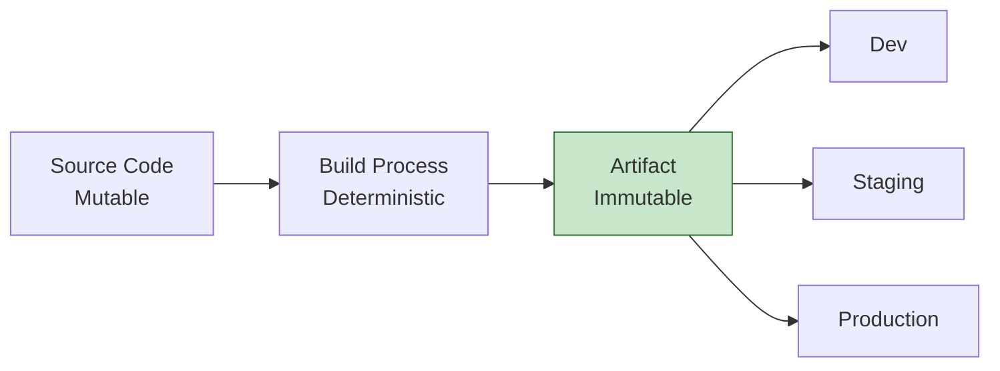
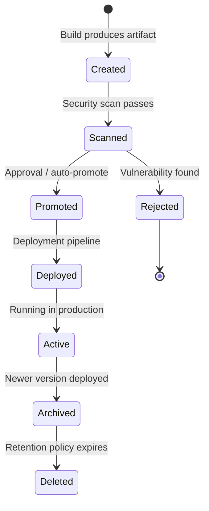
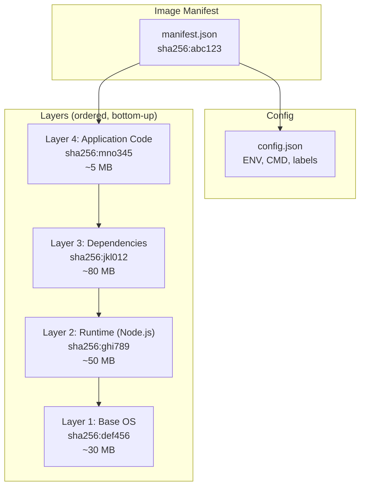
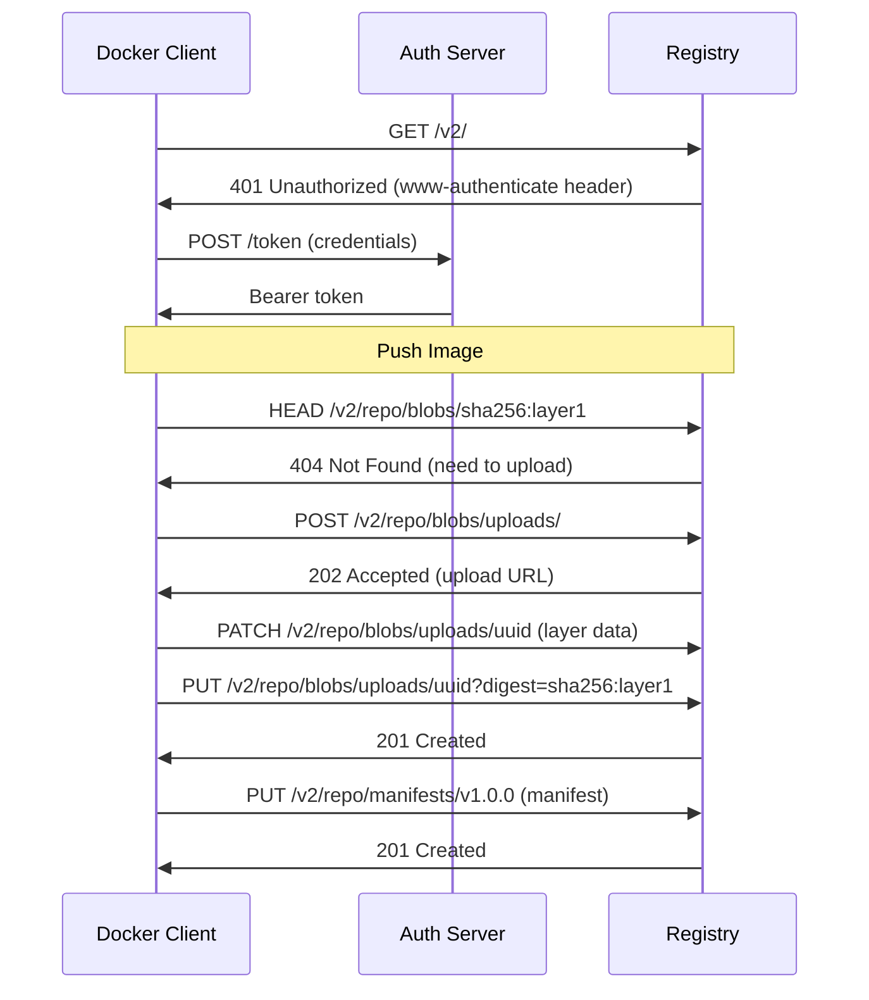
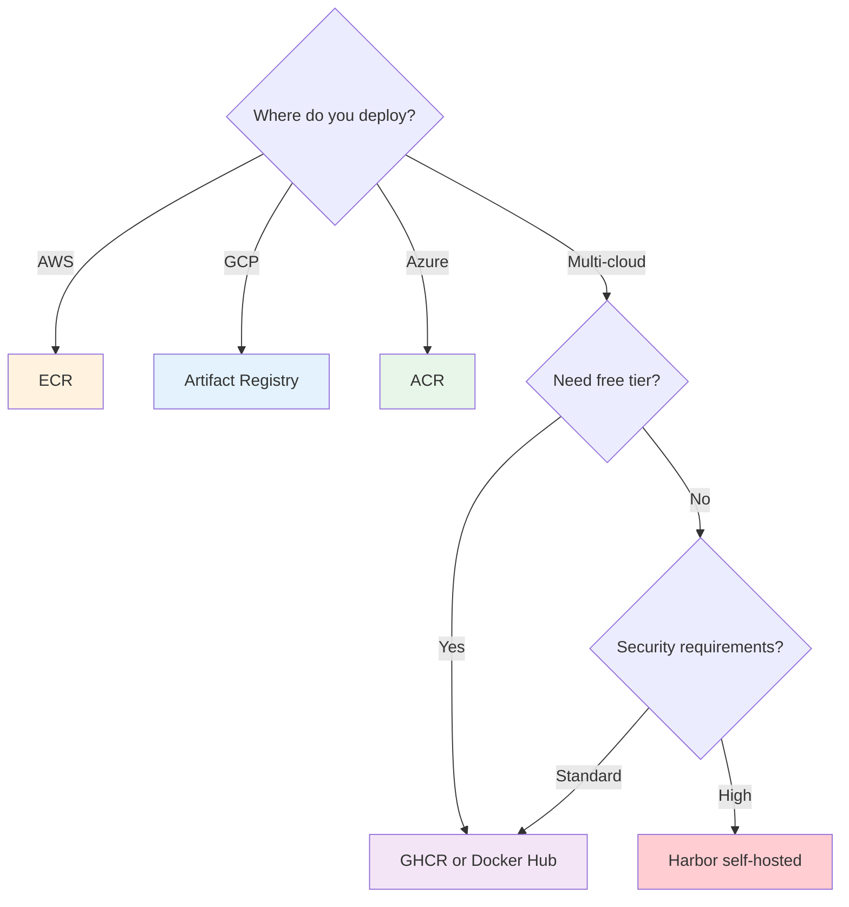

# Artifact Management

## Why Artifact Management Matters

An artifact is the immutable, versioned output of a build process — a container image, an npm package, a compiled binary, a Helm chart. Artifact management is the discipline of producing, storing, versioning, distributing, and eventually garbage-collecting these outputs.

Without disciplined artifact management, teams face:

- **"Works on my machine"**: Builds that produce different outputs depending on when and where they run
- **Supply chain attacks**: Malicious packages substituted for legitimate ones
- **Storage explosion**: Terabytes of unused images accumulating in registries
- **Deployment confusion**: "Which version is deployed in production?" becomes unanswerable
- **Rollback failure**: The artifact from 3 weeks ago has been garbage collected

### Historical Context

Early software shipped on physical media — floppy disks, CDs. Version management was trivial: each physical copy was distinct. The shift to continuous delivery created a new problem: hundreds of builds per day, each producing artifacts that might need to be deployed or rolled back.

The container revolution (Docker, 2013) standardized the artifact format: an OCI image is a portable, immutable, layered filesystem. This solved the "works on my machine" problem but created new challenges around image size, layer caching, and registry management.

## First Principles

### The Immutability Principle

The most important property of a build artifact is **immutability**: once created, it must never be modified. The artifact deployed to staging must be byte-for-byte identical to what reaches production.



Violating immutability — by rebuilding for each environment, injecting environment-specific config into images, or modifying artifacts post-build — is the root cause of most deployment discrepancies.

### The Artifact Lifecycle

Every artifact follows a lifecycle:

$$
\text{Create} \rightarrow \text{Store} \rightarrow \text{Scan} \rightarrow \text{Promote} \rightarrow \text{Deploy} \rightarrow \text{Archive} \rightarrow \text{Delete}
$$



### Content-Addressable Storage

Modern artifact registries use **content-addressable storage** (CAS) — artifacts are identified by the hash of their content, not by a mutable name or tag.

$$
\text{digest} = \text{SHA256}(\text{artifact content})
$$

This provides:
- **Deduplication**: Identical content is stored once
- **Integrity verification**: Download corruption is detected
- **Immutability guarantee**: Changing content changes the address

A container image tag like `v1.2.3` is a **mutable pointer** to an immutable digest like `sha256:a3ed95caeb02ffe...`. Tags can be moved; digests cannot.

## Core Mechanics

### Container Image Architecture

An OCI container image is a stack of filesystem layers, each identified by its content hash:



**Key insight**: Layers are shared across images. If 50 images use the same Node.js base layer, that layer is stored once in the registry.

### Registry Protocol

Container registries implement the OCI Distribution Specification:



### npm Package Structure

npm packages are tarballs with a standardized structure:

```
package.tgz
├── package/
│   ├── package.json    # Metadata, dependencies, scripts
│   ├── dist/           # Compiled output (for TypeScript)
│   │   ├── index.js
│   │   ├── index.d.ts  # Type declarations
│   │   └── index.js.map
│   ├── README.md
│   └── LICENSE
```

The `package.json` defines what gets published:

```json
{
  "name": "@myorg/shared-utils",
  "version": "2.3.1",
  "main": "dist/index.js",
  "types": "dist/index.d.ts",
  "exports": {
    ".": {
      "import": "./dist/index.mjs",
      "require": "./dist/index.js",
      "types": "./dist/index.d.ts"
    },
    "./crypto": {
      "import": "./dist/crypto.mjs",
      "require": "./dist/crypto.js",
      "types": "./dist/crypto.d.ts"
    }
  },
  "files": ["dist/", "README.md", "LICENSE"],
  "publishConfig": {
    "access": "restricted",
    "registry": "https://npm.pkg.github.com"
  },
  "engines": {
    "node": ">=18"
  }
}
```

## Implementation

### Production Container Image Build

```dockerfile
# Dockerfile — Multi-stage production build
# Stage 1: Dependencies (cached unless package-lock changes)
FROM node:20-alpine AS deps
WORKDIR /app
COPY package.json package-lock.json ./
RUN npm ci --production=false

# Stage 2: Build
FROM node:20-alpine AS build
WORKDIR /app
COPY --from=deps /app/node_modules ./node_modules
COPY . .
RUN npm run build
RUN npm prune --production

# Stage 3: Production image
FROM node:20-alpine AS production

# Security: non-root user
RUN addgroup -g 1001 -S nodejs && \
    adduser -S nextjs -u 1001

# Install only production dependencies + built output
WORKDIR /app
COPY --from=build --chown=nextjs:nodejs /app/dist ./dist
COPY --from=build --chown=nextjs:nodejs /app/node_modules ./node_modules
COPY --from=build --chown=nextjs:nodejs /app/package.json ./

# Security: read-only filesystem
RUN mkdir -p /app/tmp && chown nextjs:nodejs /app/tmp

USER nextjs

# Health check
HEALTHCHECK --interval=30s --timeout=3s --start-period=10s --retries=3 \
  CMD wget --no-verbose --tries=1 --spider http://localhost:3000/health || exit 1

EXPOSE 3000

# Labels for traceability
ARG BUILD_DATE
ARG VCS_REF
ARG VERSION
LABEL org.opencontainers.image.created="${BUILD_DATE}" \
      org.opencontainers.image.revision="${VCS_REF}" \
      org.opencontainers.image.version="${VERSION}" \
      org.opencontainers.image.source="https://github.com/myorg/myapp"

CMD ["node", "dist/server.js"]
```

### Versioning Strategy Implementation

```typescript
// scripts/version.ts — Semantic versioning with conventional commits
import { execSync } from 'child_process';
import * as fs from 'fs';

type BumpType = 'major' | 'minor' | 'patch' | 'none';

interface ConventionalCommit {
  type: string;
  scope?: string;
  breaking: boolean;
  description: string;
  hash: string;
}

function parseConventionalCommits(since: string): ConventionalCommit[] {
  const log = execSync(
    `git log ${since}..HEAD --format="%H|%s"`,
    { encoding: 'utf-8' }
  );

  return log.trim().split('\n').filter(Boolean).map(line => {
    const [hash, ...rest] = line.split('|');
    const subject = rest.join('|');

    // Parse conventional commit format: type(scope)!: description
    const match = subject.match(
      /^(\w+)(?:\(([^)]+)\))?(!)?:\s*(.+)$/
    );

    if (!match) {
      return {
        type: 'other',
        breaking: false,
        description: subject,
        hash: hash.substring(0, 8),
      };
    }

    return {
      type: match[1],
      scope: match[2],
      breaking: !!match[3],
      description: match[4],
      hash: hash.substring(0, 8),
    };
  });
}

function determineBump(commits: ConventionalCommit[]): BumpType {
  if (commits.length === 0) return 'none';

  // Breaking changes -> major
  if (commits.some(c => c.breaking)) return 'major';

  // Features -> minor
  if (commits.some(c => c.type === 'feat')) return 'minor';

  // Fixes, perf, refactor -> patch
  if (commits.some(c =>
    ['fix', 'perf', 'refactor'].includes(c.type)
  )) return 'patch';

  return 'none';
}

function bumpVersion(current: string, bump: BumpType): string {
  const [major, minor, patch] = current.split('.').map(Number);

  switch (bump) {
    case 'major': return `${major + 1}.0.0`;
    case 'minor': return `${major}.${minor + 1}.0`;
    case 'patch': return `${major}.${minor}.${patch + 1}`;
    case 'none': return current;
  }
}

function generateChangelog(
  commits: ConventionalCommit[],
  version: string
): string {
  const sections: Record<string, ConventionalCommit[]> = {};

  for (const commit of commits) {
    const section = {
      feat: 'Features',
      fix: 'Bug Fixes',
      perf: 'Performance',
      refactor: 'Refactoring',
      docs: 'Documentation',
      test: 'Tests',
      chore: 'Maintenance',
    }[commit.type] ?? 'Other';

    if (!sections[section]) sections[section] = [];
    sections[section].push(commit);
  }

  let changelog = `## v${version}\n\n`;

  // Breaking changes first
  const breaking = commits.filter(c => c.breaking);
  if (breaking.length > 0) {
    changelog += '### BREAKING CHANGES\n\n';
    for (const c of breaking) {
      changelog += `- ${c.description} (${c.hash})\n`;
    }
    changelog += '\n';
  }

  for (const [section, sectionCommits] of Object.entries(sections)) {
    changelog += `### ${section}\n\n`;
    for (const c of sectionCommits) {
      const scope = c.scope ? `**${c.scope}**: ` : '';
      changelog += `- ${scope}${c.description} (${c.hash})\n`;
    }
    changelog += '\n';
  }

  return changelog;
}

// Main execution
const lastTag = execSync(
  'git describe --tags --abbrev=0 2>/dev/null || echo "v0.0.0"',
  { encoding: 'utf-8' }
).trim();

const commits = parseConventionalCommits(lastTag);
const bump = determineBump(commits);

if (bump === 'none') {
  console.log('No version bump needed');
  process.exit(0);
}

const pkgJson = JSON.parse(fs.readFileSync('package.json', 'utf-8'));
const newVersion = bumpVersion(pkgJson.version, bump);

console.log(`Bumping ${pkgJson.version} -> ${newVersion} (${bump})`);

// Update package.json
pkgJson.version = newVersion;
fs.writeFileSync('package.json', JSON.stringify(pkgJson, null, 2) + '\n');

// Generate changelog
const changelog = generateChangelog(commits, newVersion);
console.log(changelog);
```

### Container Registry Management

```typescript
// scripts/registry-cleanup.ts — Garbage collection for container registries
interface ImageManifest {
  digest: string;
  tags: string[];
  createdAt: Date;
  size: number;
  layers: string[];
}

interface CleanupPolicy {
  keepLatestN: number;
  keepTagPatterns: RegExp[];
  maxAgedays: number;
  keepDigests: Set<string>;  // Digests currently deployed
}

class RegistryCleanup {
  constructor(
    private registry: RegistryClient,
    private policy: CleanupPolicy
  ) {}

  async getCleanupCandidates(
    repository: string
  ): Promise<ImageManifest[]> {
    const manifests = await this.registry.listManifests(repository);

    // Sort by creation date, newest first
    manifests.sort((a, b) =>
      b.createdAt.getTime() - a.createdAt.getTime()
    );

    const candidates: ImageManifest[] = [];

    for (let i = 0; i < manifests.length; i++) {
      const manifest = manifests[i];

      // Never delete currently deployed images
      if (this.policy.keepDigests.has(manifest.digest)) {
        continue;
      }

      // Keep latest N images
      if (i < this.policy.keepLatestN) {
        continue;
      }

      // Keep images matching protected tag patterns
      if (manifest.tags.some(tag =>
        this.policy.keepTagPatterns.some(p => p.test(tag))
      )) {
        continue;
      }

      // Check age
      const ageDays = (Date.now() - manifest.createdAt.getTime())
        / (1000 * 60 * 60 * 24);

      if (ageDays > this.policy.maxAgedays) {
        candidates.push(manifest);
      }
    }

    return candidates;
  }

  async cleanup(repository: string, dryRun: boolean = true): Promise<{
    deleted: number;
    freedBytes: number;
  }> {
    const candidates = await this.getCleanupCandidates(repository);

    let freedBytes = 0;
    let deleted = 0;

    for (const manifest of candidates) {
      if (dryRun) {
        console.log(
          `[DRY RUN] Would delete ${manifest.digest} ` +
          `(tags: ${manifest.tags.join(', ')}, ` +
          `size: ${(manifest.size / 1024 / 1024).toFixed(1)} MB)`
        );
      } else {
        await this.registry.deleteManifest(repository, manifest.digest);
        deleted++;
      }
      freedBytes += manifest.size;
    }

    return { deleted, freedBytes };
  }
}

// Usage
const cleanup = new RegistryCleanup(registryClient, {
  keepLatestN: 10,
  keepTagPatterns: [/^v\d+\.\d+\.\d+$/, /^main$/, /^latest$/],
  maxAgedays: 30,
  keepDigests: new Set([
    'sha256:abc123...', // Currently deployed in production
    'sha256:def456...', // Currently deployed in staging
  ]),
});
```

### npm Package Publishing Pipeline

```yaml
# .github/workflows/publish-package.yml
name: Publish Package

on:
  push:
    branches: [main]
    paths:
      - 'packages/shared-utils/**'
      - '!packages/shared-utils/**/*.md'

jobs:
  check-version:
    runs-on: ubuntu-latest
    outputs:
      changed: ${{ steps.check.outputs.changed }}
      version: ${{ steps.check.outputs.version }}
    steps:
      - uses: actions/checkout@v4
        with:
          fetch-depth: 0

      - id: check
        run: |
          cd packages/shared-utils
          CURRENT=$(node -p "require('./package.json').version")
          PUBLISHED=$(npm view @myorg/shared-utils version 2>/dev/null || echo "0.0.0")
          if [ "$CURRENT" != "$PUBLISHED" ]; then
            echo "changed=true" >> "$GITHUB_OUTPUT"
            echo "version=$CURRENT" >> "$GITHUB_OUTPUT"
          else
            echo "changed=false" >> "$GITHUB_OUTPUT"
          fi

  test:
    needs: check-version
    if: needs.check-version.outputs.changed == 'true'
    runs-on: ubuntu-latest
    steps:
      - uses: actions/checkout@v4
      - uses: actions/setup-node@v4
        with:
          node-version: '20'
          cache: 'npm'
      - run: npm ci
      - run: npm run test --workspace=packages/shared-utils
      - run: npm run typecheck --workspace=packages/shared-utils

  publish:
    needs: [check-version, test]
    runs-on: ubuntu-latest
    permissions:
      contents: write
      packages: write
      id-token: write
    steps:
      - uses: actions/checkout@v4
      - uses: actions/setup-node@v4
        with:
          node-version: '20'
          cache: 'npm'
          registry-url: 'https://npm.pkg.github.com'

      - run: npm ci
      - run: npm run build --workspace=packages/shared-utils

      # Verify package contents before publishing
      - name: Verify package
        run: |
          cd packages/shared-utils
          npm pack --dry-run 2>&1 | tee /tmp/pack-output.txt

          # Check package size
          SIZE=$(du -sk *.tgz 2>/dev/null | cut -f1 || echo "0")
          if [ "$SIZE" -gt "1024" ]; then
            echo "WARNING: Package size ${SIZE}KB exceeds 1MB"
          fi

      - name: Publish
        run: npm publish --workspace=packages/shared-utils
        env:
          NODE_AUTH_TOKEN: ${{ secrets.GITHUB_TOKEN }}

      - name: Create Git tag
        run: |
          VERSION=${{ needs.check-version.outputs.version }}
          git tag "shared-utils-v${VERSION}"
          git push origin "shared-utils-v${VERSION}"

      # Generate SLSA provenance
      - name: Generate provenance
        uses: slsa-framework/slsa-github-generator/.github/workflows/generator_generic_slsa3.yml@v2.0.0
        with:
          base64-subjects: |
            $(cd packages/shared-utils && npm pack 2>/dev/null && sha256sum *.tgz | base64 -w0)
```

## Edge Cases & Failure Modes

### Common Artifact Problems

| Problem | Impact | Solution |
|---------|--------|---------|
| Tag mutability | `latest` tag points to different image | Use digest references for deployments |
| Layer bloat | 2 GB images, slow pulls | Multi-stage builds, `.dockerignore` |
| Dependency confusion | Public package shadows private | Scoped registries, namespace policies |
| Registry outage | Can't pull images, deployments fail | Multi-region registry, local cache |
| Stale cache layers | Old dependencies used in builds | Cache busting with `--no-cache` periodically |
| Secret in layers | Credentials baked into image | Multi-stage builds, BuildKit secrets |
| Manifest list issues | Wrong architecture pulled | Multi-arch builds with `docker buildx` |

### Dependency Confusion Attack

In 2021, Alex Birsan demonstrated that many organizations were vulnerable to **dependency confusion** — where a public package with the same name as an internal package gets installed instead.

```
// package.json
{
  "dependencies": {
    "@myorg/auth-utils": "^2.0.0"  // Internal package
  }
}

// If an attacker publishes "@myorg/auth-utils" to public npm...
// npm might install the public version instead!
```

**Mitigations**:

```
# .npmrc — Lock internal packages to private registry
@myorg:registry=https://npm.pkg.github.com
//npm.pkg.github.com/:_authToken=${NPM_TOKEN}

# Always use exact versions in lockfile
package-lock=true
```

```typescript
// scripts/verify-dependencies.ts
import * as fs from 'fs';

interface PackageLock {
  packages: Record<string, {
    resolved: string;
    integrity: string;
  }>;
}

function verifyDependencyOrigins(lockfilePath: string): void {
  const lockfile: PackageLock = JSON.parse(
    fs.readFileSync(lockfilePath, 'utf-8')
  );

  const violations: string[] = [];

  for (const [pkg, info] of Object.entries(lockfile.packages)) {
    if (!pkg.includes('@myorg/')) continue;

    // Internal packages must resolve to private registry
    if (info.resolved && !info.resolved.includes('npm.pkg.github.com')) {
      violations.push(
        `${pkg} resolves to ${info.resolved} (expected private registry)`
      );
    }
  }

  if (violations.length > 0) {
    console.error('DEPENDENCY CONFUSION DETECTED:');
    violations.forEach(v => console.error(`  - ${v}`));
    process.exit(1);
  }

  console.log('All internal packages resolve to private registry');
}

verifyDependencyOrigins('package-lock.json');
```

### Image Signing and Verification

```yaml
# Sign images with Sigstore/cosign
jobs:
  build-and-sign:
    runs-on: ubuntu-latest
    permissions:
      contents: read
      packages: write
      id-token: write  # OIDC for keyless signing
    steps:
      - uses: actions/checkout@v4
      - uses: sigstore/cosign-installer@v3

      - name: Build and push
        id: build
        uses: docker/build-push-action@v5
        with:
          push: true
          tags: ghcr.io/myorg/app:${{ github.sha }}

      - name: Sign image (keyless)
        run: |
          cosign sign \
            --yes \
            ghcr.io/myorg/app@${{ steps.build.outputs.digest }}

      - name: Attach SBOM
        run: |
          # Generate SBOM
          syft ghcr.io/myorg/app@${{ steps.build.outputs.digest }} \
            -o spdx-json > sbom.spdx.json

          # Attach to image
          cosign attach sbom \
            --sbom sbom.spdx.json \
            ghcr.io/myorg/app@${{ steps.build.outputs.digest }}

      - name: Verify signature
        run: |
          cosign verify \
            --certificate-identity-regexp="https://github.com/myorg/.*" \
            --certificate-oidc-issuer="https://token.actions.githubusercontent.com" \
            ghcr.io/myorg/app@${{ steps.build.outputs.digest }}
```

## Performance Characteristics

### Container Image Size Benchmarks

| Base Image | Size | Security Surface | Use Case |
|-----------|------|-----------------|----------|
| `ubuntu:22.04` | 77 MB | Large | Development, debugging |
| `debian:bookworm-slim` | 74 MB | Medium | General purpose |
| `node:20` | 350 MB | Large | Node.js (full) |
| `node:20-slim` | 170 MB | Medium | Node.js (production) |
| `node:20-alpine` | 50 MB | Small | Node.js (minimal) |
| `gcr.io/distroless/nodejs20` | 120 MB | Minimal | Node.js (hardened) |
| `scratch` | 0 MB | None | Go binaries |
| `chainguard/node` | 70 MB | Minimal | Node.js (SLSA) |

### Registry Performance

| Registry | Pull Latency (same region) | Pull Latency (cross region) | Push Throughput | Free Storage |
|----------|---------------------------|----------------------------|----------------|--------------|
| Docker Hub | 50-200 ms | 100-500 ms | 100 MB/s | 1 public repo |
| GitHub Packages (GHCR) | 30-100 ms | 100-300 ms | 150 MB/s | 500 MB |
| AWS ECR | 20-50 ms | 80-200 ms | 200 MB/s | None (pay per GB) |
| Google Artifact Registry | 20-50 ms | 50-150 ms | 200 MB/s | 500 MB |
| Azure ACR | 20-50 ms | 80-200 ms | 150 MB/s | None |

### Image Pull Cost Model

$$
T_{\text{pull}} = T_{\text{auth}} + \sum_{l \in \text{new layers}} \frac{S_l}{B} + T_{\text{extract}}
$$

Where:
- $T_{\text{auth}}$ = authentication + manifest fetch (~100-500 ms)
- $S_l$ = compressed size of layer $l$
- $B$ = network bandwidth (bytes/second)
- $T_{\text{extract}}$ = decompression time

For a 200 MB image on a 1 Gbps network:
$$
T_{\text{pull}} = 0.3 + \frac{200 \times 10^6}{125 \times 10^6} + 2.0 \approx 3.9 \text{ seconds}
$$

With layer caching (80% cache hit rate):
$$
T_{\text{pull}} = 0.3 + \frac{0.2 \times 200 \times 10^6}{125 \times 10^6} + 0.5 \approx 1.1 \text{ seconds}
$$

## Mathematical Foundations

### Semantic Versioning Algebra

Semantic Versioning (SemVer) defines a partial ordering on versions:

$$
a.b.c < a.b.(c+1) < a.(b+1).0 < (a+1).0.0
$$

The compatibility relation for dependency ranges:

$$
\text{compatible}(\hat{a}.b.c, x.y.z) \iff x = a \land (y > b \lor (y = b \land z \geq c))
$$

Where $\hat{a}.b.c$ denotes the caret range `^a.b.c`.

For tilde ranges:

$$
\text{compatible}(\sim a.b.c, x.y.z) \iff x = a \land y = b \land z \geq c
$$

### Storage Deduplication Ratio

With content-addressable storage and $N$ images sharing base layers:

$$
\text{Dedup Ratio} = 1 - \frac{S_{\text{unique}}}{S_{\text{total}}} = 1 - \frac{\sum_{l \in L_{\text{unique}}} S_l}{\sum_{i=1}^{N} \sum_{l \in L_i} S_l}
$$

For a typical microservices organization with 50 services all using `node:20-alpine`:

- Shared base layer: 50 MB (stored once)
- Shared runtime dependencies: 80 MB (stored once, if lockfiles match)
- Unique application code: 5 MB per service

$$
\text{Dedup Ratio} = 1 - \frac{50 + 80 + 50 \times 5}{50 \times (50 + 80 + 5)} = 1 - \frac{380}{6750} \approx 94.4\%
$$

Without deduplication, storage would be 6.75 GB. With deduplication, actual storage is ~380 MB.

## Real-World War Stories

::: info War Story — The 4 GB Docker Image
A data science team was building Docker images for their ML pipeline. The images grew to 4 GB because they included the entire training dataset, multiple Python environments, and debug tools. Pulling these images took 5+ minutes on fast networks, and the CI pipeline spent 15 minutes just on image operations.

**Investigation**: Running `docker history` revealed that a single `RUN pip install -r requirements.txt` command created a 2 GB layer because pip's cache was included. Another 1 GB came from CUDA toolkit files not needed at runtime.

**Fix**:
1. Multi-stage build: install dependencies in a builder stage, copy only the installed packages
2. `.dockerignore`: excluded training data, notebooks, and test fixtures
3. Separate base image: CUDA runtime (not full toolkit) as a pre-built base
4. Layer ordering: put rarely-changing layers first (OS, CUDA, Python), frequently-changing layers last (application code)

**Result**: 4 GB -> 800 MB. Pull time: 5 min -> 40 seconds. CI pipeline: 30 min -> 12 min.
:::

::: info War Story — The npm Registry Outage
In March 2022, npm's registry experienced a 2-hour outage. During this time, any CI pipeline that ran `npm install` against the public registry failed. A major e-commerce company had 200 deployments queued, all blocked by the outage.

**Immediate impact**: All deployments halted for 2 hours during a sale event.

**Root cause**: The company had no private registry mirror. Every `npm ci` hit the public registry directly.

**Fix**:
1. Deployed Verdaccio as a private npm proxy/cache
2. Configured `.npmrc` to use the private registry as the primary source
3. Private registry caches all packages on first access
4. Added health check monitoring for the registry proxy
5. CI pipelines now tolerate 24+ hours of public registry outage

**Lesson**: Any external dependency is a single point of failure. Cache or mirror everything your build depends on.
:::

## Decision Framework

### Choosing a Versioning Strategy

| Strategy | Use Case | Pros | Cons |
|----------|----------|------|------|
| SemVer | Libraries, packages | Clear compatibility signals | Requires discipline |
| CalVer (2024.03.15) | Applications, services | Obvious age/freshness | No compatibility info |
| Git SHA | Container images (internal) | Exact traceability | Not human-readable |
| SemVer + Build metadata (1.2.3+abc123) | Hybrid | Best of both worlds | More complex |

### Choosing a Container Registry



### Registry Retention Policy

| Artifact Type | Keep Latest | Keep Tags | Max Age | Size Budget |
|--------------|-------------|-----------|---------|-------------|
| Production images | 20 | `v*` (all releases) | 1 year | 50 GB |
| Staging images | 10 | None | 30 days | 20 GB |
| PR preview images | 2 | None | 7 days | 10 GB |
| npm packages | All versions | All | Forever | Unlimited |
| Helm charts | 10 | `v*` (all releases) | 1 year | 5 GB |

## Advanced Topics

### OCI Artifacts Beyond Containers

The OCI specification supports storing any type of artifact — not just container images:

```bash
# Push a Helm chart as an OCI artifact
helm push mychart-0.1.0.tgz oci://ghcr.io/myorg/charts

# Push a WASM module
oras push ghcr.io/myorg/wasm/mymodule:v1 \
  module.wasm:application/vnd.module.wasm.content.layer.v1+wasm

# Push a Terraform module
oras push ghcr.io/myorg/terraform/vpc:v1 \
  main.tf:application/vnd.terraform.module.layer.v1+hcl \
  variables.tf:application/vnd.terraform.module.layer.v1+hcl
```

### Software Bill of Materials (SBOM)

```yaml
# Generate and attach SBOM in CI
jobs:
  build:
    steps:
      - name: Build image
        id: build
        uses: docker/build-push-action@v5
        with:
          push: true
          tags: ghcr.io/myorg/app:${{ github.sha }}
          sbom: true     # BuildKit SBOM generation
          provenance: true  # SLSA provenance attestation

      # Alternatively, use Syft for more control
      - name: Generate SBOM
        run: |
          syft ghcr.io/myorg/app@${{ steps.build.outputs.digest }} \
            -o spdx-json=sbom.spdx.json \
            -o cyclonedx-json=sbom.cdx.json

      - name: Upload SBOM to Dependency Track
        run: |
          curl -X POST "https://dtrack.example.com/api/v1/bom" \
            -H "X-Api-Key: ${{ secrets.DTRACK_API_KEY }}" \
            -H "Content-Type: multipart/form-data" \
            -F "project=${{ vars.DTRACK_PROJECT_UUID }}" \
            -F "bom=@sbom.cdx.json"
```

### Multi-Architecture Images

```yaml
# Build for multiple architectures
jobs:
  build-multi-arch:
    runs-on: ubuntu-latest
    steps:
      - uses: actions/checkout@v4
      - uses: docker/setup-qemu-action@v3
      - uses: docker/setup-buildx-action@v3
      - uses: docker/login-action@v3
        with:
          registry: ghcr.io
          username: ${{ github.actor }}
          password: ${{ secrets.GITHUB_TOKEN }}

      - uses: docker/build-push-action@v5
        with:
          platforms: linux/amd64,linux/arm64
          push: true
          tags: ghcr.io/myorg/app:${{ github.sha }}
          cache-from: type=gha
          cache-to: type=gha,mode=max
```

This creates a **manifest list** — a single tag that resolves to the correct architecture-specific image based on the pulling platform. When an Arm-based Graviton instance pulls `ghcr.io/myorg/app:v1`, it automatically gets the `linux/arm64` variant.

For further details on how artifacts flow through promotion environments, see [Environment Promotion](./environment-promotion). For security scanning of artifacts, see [Security Scanning](./security-scanning).
