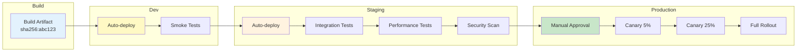
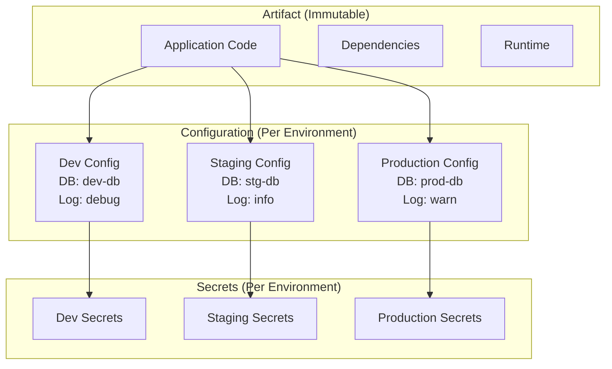
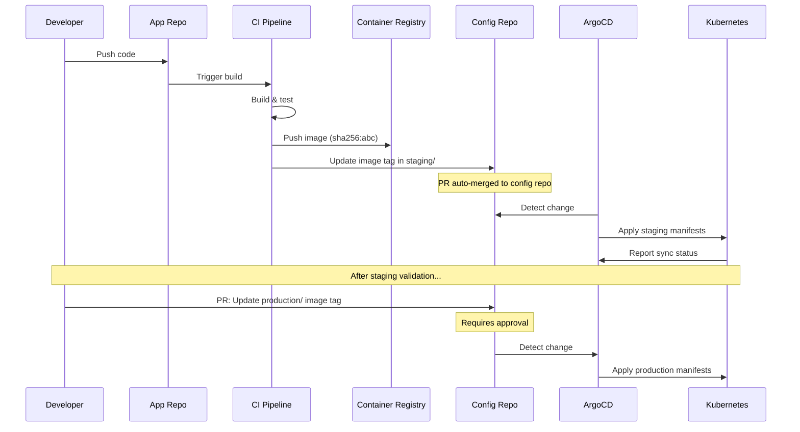
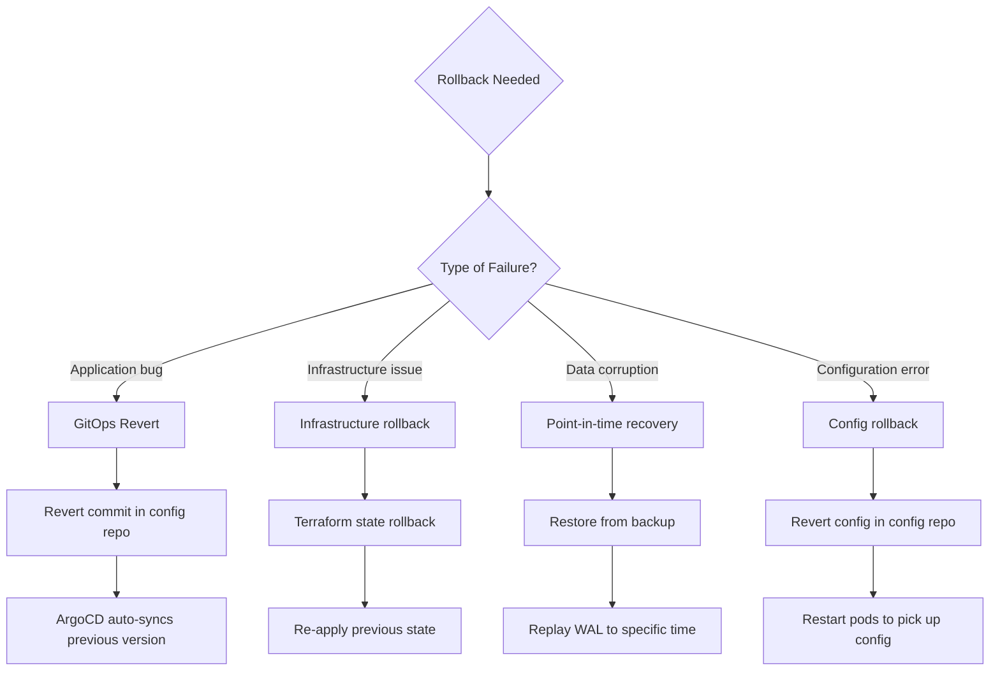
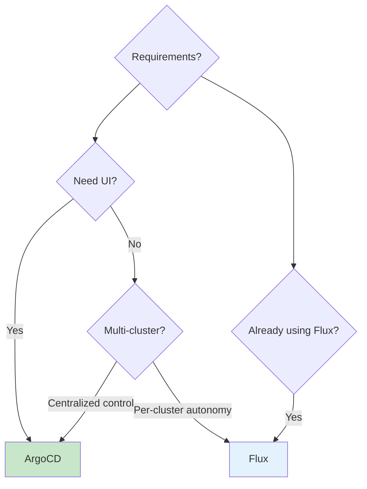

# Environment Promotion

## Why Environment Promotion Exists

In 2005, deploying to production typically meant an engineer SSHing into a server and running a script. Configuration was hand-crafted. Each environment was a snowflake. Deployments failed because staging didn't match production, because a config file was different, because someone forgot to run a migration.

Environment promotion is the practice of moving an **immutable artifact** through a series of increasingly production-like environments, validating at each stage. The artifact doesn't change — only the environment-specific configuration does. This simple principle eliminates entire classes of deployment failures.

### The Core Problem

| Without Promotion | With Promotion |
|------------------|----------------|
| Rebuild for each environment | Build once, deploy everywhere |
| Manual configuration | Configuration as code |
| "It worked in staging" | Identical artifact in all environments |
| No approval trail | Auditable promotion history |
| Rollback = redeploy old code | Rollback = point to previous artifact |
| Hours to deploy | Minutes to deploy |

## First Principles

### The Promotion Pipeline

An environment promotion pipeline moves an artifact through gates of increasing confidence:



### Configuration Separation

The fundamental principle: **artifacts are immutable; configuration is environment-specific**.



**Configuration hierarchy** (from least to most dynamic):

1. **Build-time config**: Compiled into the artifact (framework version, feature flags defaults)
2. **Deploy-time config**: Injected at deployment (environment variables, ConfigMaps)
3. **Runtime config**: Fetched from config service (feature flags, A/B test parameters)
4. **Secrets**: Injected from vault at runtime (database passwords, API keys)

### The Twelve-Factor App Config Principle

Factor III of the Twelve-Factor App methodology states: **Store config in the environment**. Configuration that varies between deployments (credentials, resource handles, backing service URLs) should be strict environment variables, not files checked into source control.

$$
\text{Artifact} + \text{Environment Config} + \text{Secrets} = \text{Running Application}
$$

## Core Mechanics

### GitOps Model

GitOps is the modern standard for environment promotion. It uses Git as the single source of truth for both application code and deployment configuration:



### Repository Structure for GitOps

```
config-repo/
├── base/                        # Shared Kubernetes manifests
│   ├── deployment.yaml
│   ├── service.yaml
│   ├── ingress.yaml
│   └── kustomization.yaml
├── environments/
│   ├── dev/
│   │   ├── kustomization.yaml   # Patches for dev
│   │   ├── replicas-patch.yaml
│   │   └── env-config.yaml
│   ├── staging/
│   │   ├── kustomization.yaml   # Patches for staging
│   │   ├── replicas-patch.yaml
│   │   └── env-config.yaml
│   └── production/
│       ├── kustomization.yaml   # Patches for production
│       ├── replicas-patch.yaml
│       ├── hpa.yaml
│       └── env-config.yaml
└── apps/                        # ArgoCD Application definitions
    ├── dev.yaml
    ├── staging.yaml
    └── production.yaml
```

**Base Kustomization**:

```yaml
# base/kustomization.yaml
apiVersion: kustomize.config.k8s.io/v1beta1
kind: Kustomization

resources:
  - deployment.yaml
  - service.yaml
  - ingress.yaml

commonLabels:
  app.kubernetes.io/name: myapp
  app.kubernetes.io/managed-by: kustomize
```

```yaml
# base/deployment.yaml
apiVersion: apps/v1
kind: Deployment
metadata:
  name: myapp
spec:
  replicas: 1  # Overridden per environment
  selector:
    matchLabels:
      app: myapp
  template:
    metadata:
      labels:
        app: myapp
    spec:
      containers:
        - name: app
          image: ghcr.io/myorg/myapp:latest  # Overridden per environment
          ports:
            - containerPort: 3000
          envFrom:
            - configMapRef:
                name: myapp-config
          resources:
            requests:
              cpu: 100m
              memory: 128Mi
            limits:
              cpu: 500m
              memory: 512Mi
          readinessProbe:
            httpGet:
              path: /health
              port: 3000
            initialDelaySeconds: 5
            periodSeconds: 10
          livenessProbe:
            httpGet:
              path: /health
              port: 3000
            initialDelaySeconds: 15
            periodSeconds: 20
```

**Production overlay**:

```yaml
# environments/production/kustomization.yaml
apiVersion: kustomize.config.k8s.io/v1beta1
kind: Kustomization

namespace: production

resources:
  - ../../base
  - hpa.yaml

patches:
  - path: replicas-patch.yaml
  - target:
      kind: Deployment
      name: myapp
    patch: |
      - op: replace
        path: /spec/template/spec/containers/0/image
        value: ghcr.io/myorg/myapp:abc123def

configMapGenerator:
  - name: myapp-config
    behavior: replace
    literals:
      - NODE_ENV=production
      - LOG_LEVEL=warn
      - ENABLE_METRICS=true
      - DB_HOST=prod-db.internal
      - REDIS_HOST=prod-redis.internal
```

```yaml
# environments/production/replicas-patch.yaml
apiVersion: apps/v1
kind: Deployment
metadata:
  name: myapp
spec:
  replicas: 6
  template:
    spec:
      containers:
        - name: app
          resources:
            requests:
              cpu: 500m
              memory: 512Mi
            limits:
              cpu: 2000m
              memory: 2Gi
```

### ArgoCD Application Definition

```yaml
# apps/production.yaml
apiVersion: argoproj.io/v1alpha1
kind: Application
metadata:
  name: myapp-production
  namespace: argocd
  annotations:
    notifications.argoproj.io/subscribe.on-sync-succeeded.slack: deployments
    notifications.argoproj.io/subscribe.on-sync-failed.slack: alerts
spec:
  project: default
  source:
    repoURL: https://github.com/myorg/config-repo.git
    targetRevision: main
    path: environments/production
  destination:
    server: https://kubernetes.default.svc
    namespace: production
  syncPolicy:
    automated:
      prune: true
      selfHeal: true
      allowEmpty: false
    syncOptions:
      - CreateNamespace=true
      - PrunePropagationPolicy=foreground
      - PruneLast=true
    retry:
      limit: 3
      backoff:
        duration: 5s
        factor: 2
        maxDuration: 3m
  revisionHistoryLimit: 10
```

## Implementation: Complete Promotion Pipeline

### CI Pipeline That Triggers Promotion

```yaml
# .github/workflows/promote.yml
name: Build and Promote

on:
  push:
    branches: [main]

env:
  REGISTRY: ghcr.io
  IMAGE_NAME: myorg/myapp

jobs:
  build:
    runs-on: ubuntu-latest
    permissions:
      contents: read
      packages: write
    outputs:
      image-digest: ${​{ steps.build.outputs.digest }}
      image-tag: ${​{ env.REGISTRY }}/${​{ env.IMAGE_NAME }}@${​{ steps.build.outputs.digest }}
    steps:
      - uses: actions/checkout@v4
      - uses: docker/setup-buildx-action@v3
      - uses: docker/login-action@v3
        with:
          registry: ${​{ env.REGISTRY }}
          username: ${​{ github.actor }}
          password: ${​{ secrets.GITHUB_TOKEN }}
      - id: build
        uses: docker/build-push-action@v5
        with:
          push: true
          tags: |
            ${​{ env.REGISTRY }}/${​{ env.IMAGE_NAME }}:${​{ github.sha }}
            ${​{ env.REGISTRY }}/${​{ env.IMAGE_NAME }}:latest
          cache-from: type=gha
          cache-to: type=gha,mode=max

  promote-to-dev:
    needs: build
    runs-on: ubuntu-latest
    steps:
      - uses: actions/checkout@v4
        with:
          repository: myorg/config-repo
          token: ${​{ secrets.CONFIG_REPO_TOKEN }}
      - name: Update dev image
        run: |
          cd environments/dev
          kustomize edit set image \
            ghcr.io/myorg/myapp=ghcr.io/myorg/myapp@${​{ needs.build.outputs.image-digest }}
      - name: Commit and push
        run: |
          git config user.name "CI Bot"
          git config user.email "ci@myorg.com"
          git add .
          git commit -m "chore(dev): update myapp to ${​{ github.sha }}"
          git push

  test-dev:
    needs: promote-to-dev
    runs-on: ubuntu-latest
    steps:
      - name: Wait for ArgoCD sync
        run: |
          for i in $(seq 1 30); do
            STATUS=$(argocd app get myapp-dev -o json | jq -r '.status.sync.status')
            HEALTH=$(argocd app get myapp-dev -o json | jq -r '.status.health.status')
            if [ "$STATUS" = "Synced" ] && [ "$HEALTH" = "Healthy" ]; then
              echo "Dev environment synced and healthy"
              exit 0
            fi
            echo "Waiting for sync... Status: $STATUS, Health: $HEALTH"
            sleep 10
          done
          echo "Timed out waiting for dev sync"
          exit 1

      - name: Run smoke tests
        run: |
          curl --fail --retry 5 --retry-delay 5 https://dev.myapp.example.com/health

  promote-to-staging:
    needs: [build, test-dev]
    runs-on: ubuntu-latest
    steps:
      - uses: actions/checkout@v4
        with:
          repository: myorg/config-repo
          token: ${​{ secrets.CONFIG_REPO_TOKEN }}
      - name: Update staging image
        run: |
          cd environments/staging
          kustomize edit set image \
            ghcr.io/myorg/myapp=ghcr.io/myorg/myapp@${​{ needs.build.outputs.image-digest }}
      - name: Commit and push
        run: |
          git config user.name "CI Bot"
          git config user.email "ci@myorg.com"
          git add .
          git commit -m "chore(staging): promote myapp ${​{ github.sha }}"
          git push

  test-staging:
    needs: promote-to-staging
    runs-on: ubuntu-latest
    steps:
      - name: Wait for sync
        run: |
          for i in $(seq 1 30); do
            STATUS=$(argocd app get myapp-staging -o json | jq -r '.status.sync.status')
            HEALTH=$(argocd app get myapp-staging -o json | jq -r '.status.health.status')
            if [ "$STATUS" = "Synced" ] && [ "$HEALTH" = "Healthy" ]; then
              exit 0
            fi
            sleep 10
          done
          exit 1

      - name: Run integration tests
        run: npm run test:staging

      - name: Run performance test
        run: |
          k6 run --out json=perf-results.json \
            --env BASE_URL=https://staging.myapp.example.com \
            tests/load-test.js

      - name: Validate performance
        run: |
          P95=$(jq '.metrics.http_req_duration.values["p(95)"]' perf-results.json)
          if (( $(echo "$P95 > 500" | bc -l) )); then
            echo "P95 latency ${P95}ms exceeds 500ms threshold"
            exit 1
          fi

  create-production-pr:
    needs: [build, test-staging]
    runs-on: ubuntu-latest
    steps:
      - uses: actions/checkout@v4
        with:
          repository: myorg/config-repo
          token: ${​{ secrets.CONFIG_REPO_TOKEN }}

      - name: Create promotion branch
        run: |
          BRANCH="promote/myapp-${​{ github.sha }}"
          git checkout -b "$BRANCH"
          cd environments/production
          kustomize edit set image \
            ghcr.io/myorg/myapp=ghcr.io/myorg/myapp@${​{ needs.build.outputs.image-digest }}
          git add .
          git commit -m "chore(production): promote myapp ${​{ github.sha }}"
          git push origin "$BRANCH"

      - name: Create PR
        env:
          GH_TOKEN: ${​{ secrets.CONFIG_REPO_TOKEN }}
        run: |
          gh pr create \
            --repo myorg/config-repo \
            --title "Promote myapp to production (${​{ github.sha }})" \
            --body "$(cat <<'BODY'
          ## Production Promotion

          **Application**: myapp
          **Commit**: ${​{ github.sha }}
          **Image**: ghcr.io/myorg/myapp@${​{ needs.build.outputs.image-digest }}

          ### Validation Results
          - Dev smoke tests: PASSED
          - Staging integration tests: PASSED
          - Staging performance tests: PASSED
          - Security scan: PASSED

          ### Rollback
          To rollback, revert this PR.
          BODY
          )" \
            --reviewer "platform-team" \
            --label "production-deploy"
```

### Progressive Delivery with Argo Rollouts

```yaml
# environments/production/rollout.yaml
apiVersion: argoproj.io/v1alpha1
kind: Rollout
metadata:
  name: myapp
  namespace: production
spec:
  replicas: 10
  selector:
    matchLabels:
      app: myapp
  template:
    metadata:
      labels:
        app: myapp
    spec:
      containers:
        - name: app
          image: ghcr.io/myorg/myapp:abc123
          ports:
            - containerPort: 3000
  strategy:
    canary:
      canaryService: myapp-canary
      stableService: myapp-stable
      trafficRouting:
        istio:
          virtualServices:
            - name: myapp-vsvc
              routes:
                - primary
      steps:
        # Step 1: 5% canary
        - setWeight: 5
        - pause: { duration: 5m }

        # Step 2: Analyze metrics
        - analysis:
            templates:
              - templateName: success-rate
            args:
              - name: service
                value: myapp-canary

        # Step 3: 25% canary
        - setWeight: 25
        - pause: { duration: 10m }

        # Step 4: Re-analyze
        - analysis:
            templates:
              - templateName: success-rate
              - templateName: latency-check

        # Step 5: 50% canary
        - setWeight: 50
        - pause: { duration: 10m }

        # Step 6: Final analysis
        - analysis:
            templates:
              - templateName: success-rate
              - templateName: latency-check
              - templateName: error-rate

        # Step 7: Full rollout
        - setWeight: 100
```

```yaml
# Analysis template
apiVersion: argoproj.io/v1alpha1
kind: AnalysisTemplate
metadata:
  name: success-rate
spec:
  args:
    - name: service
  metrics:
    - name: success-rate
      interval: 1m
      count: 5
      successCondition: result[0] >= 0.99
      failureLimit: 2
      provider:
        prometheus:
          address: http://prometheus:9090
          query: |
            sum(rate(http_requests_total{service="{​{args.service}}",status=~"2.."}[2m]))
            /
            sum(rate(http_requests_total{service="{​{args.service}}"}[2m]))
```

## Edge Cases & Failure Modes

### Environment Drift

Even with GitOps, environments can drift:

| Drift Cause | Detection | Prevention |
|------------|-----------|------------|
| Manual kubectl changes | ArgoCD drift detection | Enable self-heal, restrict kubectl |
| ConfigMap/Secret changes outside Git | Periodic reconciliation | Sealed Secrets, External Secrets |
| Node-level configuration | Configuration audits | Immutable infrastructure |
| Third-party operator changes | Operator version pinning | Pin operator versions in Git |
| CRD schema changes | ArgoCD sync failures | Test CRD compatibility in staging |

### Database Migration Challenges

Database migrations are the hardest part of environment promotion because they are **not immutable** — you can't easily roll back a destructive migration:

```typescript
// src/migrations/migration-manager.ts
interface Migration {
  version: string;
  up: string;    // SQL to apply
  down: string;  // SQL to rollback
  destructive: boolean;
  requiresLock: boolean;
}

class SafeMigrationManager {
  async applyMigration(
    migration: Migration,
    environment: string
  ): Promise<void> {
    // Safety checks
    if (migration.destructive && environment === 'production') {
      // Destructive migrations in production require explicit approval
      const approved = await this.checkApproval(migration.version);
      if (!approved) {
        throw new Error(
          `Destructive migration ${migration.version} requires explicit approval`
        );
      }
    }

    // Acquire advisory lock to prevent concurrent migrations
    if (migration.requiresLock) {
      await this.acquireAdvisoryLock();
    }

    try {
      // Apply within a transaction
      await this.db.transaction(async (tx) => {
        await tx.query(migration.up);
        await tx.query(
          `INSERT INTO migration_history (version, applied_at, environment)
           VALUES ($1, NOW(), $2)`,
          [migration.version, environment]
        );
      });

      console.log(`Migration ${migration.version} applied successfully`);
    } finally {
      if (migration.requiresLock) {
        await this.releaseAdvisoryLock();
      }
    }
  }

  // Expand-contract pattern for zero-downtime migrations
  async expandContractMigration(steps: {
    expand: string;     // Add new column/table (backward compatible)
    migrate: string;    // Copy data to new structure
    contract: string;   // Remove old column/table (breaking)
  }): Promise<void> {
    // Step 1: Expand (deploy with new code that handles both schemas)
    await this.db.query(steps.expand);

    // Step 2: Migrate data (can run in background)
    await this.db.query(steps.migrate);

    // Step 3: Contract (deploy code that only uses new schema, then drop old)
    // This happens in a SEPARATE deployment cycle
    console.log('Expand phase complete. Contract phase requires separate deploy.');
  }
}
```

### Rollback Strategies



## Performance Characteristics

### Promotion Speed Benchmarks

| Stage | Auto/Manual | Typical Duration | Gate |
|-------|------------|-----------------|------|
| Build | Auto | 3-5 min | Tests pass |
| Dev deploy | Auto | 1-2 min | Build succeeds |
| Dev validation | Auto | 2-3 min | Smoke tests pass |
| Staging deploy | Auto | 1-2 min | Dev validated |
| Staging validation | Auto | 10-20 min | Full test suite |
| Production approval | Manual | 5 min - 24 hours | Team lead sign-off |
| Production canary | Auto | 15-30 min | Metrics healthy |
| Production full | Auto | 5-10 min | Canary approved |
| **Total (best case)** | | **~45 min** | |
| **Total (with approval)** | | **~2-24 hours** | |

### ArgoCD Sync Performance

| Metric | Value | Notes |
|--------|-------|-------|
| Git poll interval | 3 min (default) | Configurable, or use webhooks for instant |
| Sync time (small app) | 5-15 sec | 10 resources |
| Sync time (large app) | 30-120 sec | 100+ resources |
| Drift detection | Continuous | Compares live vs. desired state |
| Self-heal latency | < 10 sec | When enabled |
| History retention | 10 revisions | Configurable |

## Mathematical Foundations

### Deployment Risk Model

The risk of a deployment can be modeled as:

$$
R = P(\text{failure}) \times I(\text{failure})
$$

Where $P$ is the probability of failure and $I$ is the impact.

With progressive delivery:

$$
R_{\text{canary}} = P(\text{failure}) \times I(\text{failure}) \times w_{\text{canary}}
$$

Where $w_{\text{canary}}$ is the fraction of traffic receiving the canary. At 5% canary:

$$
R_{\text{canary}} = R_{\text{full}} \times 0.05
$$

This is why canary deployments reduce risk by 95% compared to big-bang deployments.

### Optimal Canary Duration

The time needed to detect a regression with confidence level $\alpha$ depends on the traffic rate and expected failure rate:

$$
n = \frac{z_{\alpha/2}^2 \cdot p(1-p)}{\epsilon^2}
$$

Where:
- $n$ = required number of canary requests
- $z_{\alpha/2}$ = z-score for confidence level (1.96 for 95%)
- $p$ = expected baseline error rate
- $\epsilon$ = minimum detectable difference

For baseline error rate $p = 0.01$ (1%) and minimum detectable increase $\epsilon = 0.005$ (0.5%):

$$
n = \frac{1.96^2 \times 0.01 \times 0.99}{0.005^2} = \frac{0.0380}{0.000025} \approx 1,521 \text{ requests}
$$

At 5% canary traffic with 1000 requests/sec total:

$$
T_{\text{canary}} = \frac{n}{r_{\text{canary}}} = \frac{1521}{50} \approx 30 \text{ seconds}
$$

But in practice, you want multiple observation windows, so 5-10 minutes is standard.

## Real-World War Stories

::: info War Story — The Config Repo Merge Conflict
A platform team using GitOps had 12 microservices deploying to the same config repo. During a busy deployment day, three services tried to promote to staging simultaneously. The CI bots created three PRs against the config repo, and two of them had merge conflicts in the shared Kustomization file.

**Impact**: Two services were stuck in a promotion deadlock for 2 hours while engineers manually resolved conflicts.

**Fix**:
1. Restructured the config repo so each service has its own directory with no shared files
2. Implemented a promotion queue — a lightweight service that serializes config repo updates
3. Used auto-merge with conflict retry: if a git push fails due to conflicts, pull and retry (up to 3 times)
4. Moved shared configuration (like namespace-level resources) to a separate ArgoCD Application

**Lesson**: GitOps repos with multiple writers need conflict resolution strategies. Treat the config repo like a database — serialize writes to avoid conflicts.
:::

::: info War Story — The Staging-Production Gap
An e-commerce company had "identical" staging and production environments — except staging used 2 replicas while production used 20. A new feature worked fine in staging but caused a thundering herd problem in production when 20 replicas simultaneously tried to acquire the same database lock at startup.

**Root cause**: The feature used a startup migration that acquired an exclusive lock. With 2 replicas, the second waited briefly. With 20 replicas, the lock contention caused cascading timeouts.

**Fix**:
1. Staging now runs with production-like replica counts (at least 5)
2. Added a pre-deployment step that tests with concurrent replicas
3. Replaced exclusive startup locks with advisory locks and exponential backoff
4. Added a "scale test" stage in the promotion pipeline that briefly scales staging to production replica count

**Lesson**: Environment fidelity isn't just about code — it's about scale, topology, and timing. The differences you think don't matter are exactly the ones that cause production incidents.
:::

## Decision Framework

### Choosing a Promotion Strategy

| Strategy | Speed | Risk | Complexity | Best For |
|----------|-------|------|-----------|----------|
| Direct push (no gates) | Fastest | Highest | Lowest | Internal tools, dev environments |
| Manual approval | Slow | Low | Low | Regulated industries, low-frequency deploys |
| Auto-promote + canary | Fast | Low | Medium | High-traffic services, continuous delivery |
| GitOps + PR approval | Medium | Low | Medium | Multi-team organizations |
| Full progressive delivery | Medium | Lowest | High | Critical services, zero-downtime requirements |

### GitOps Tool Comparison

| Feature | ArgoCD | Flux | Jenkins X |
|---------|--------|------|-----------|
| UI | Excellent | Basic (Weave GitOps) | Good |
| Multi-cluster | Yes (centralized) | Yes (per-cluster) | Limited |
| Health checks | Built-in | Basic | Limited |
| Rollback | Easy (revision history) | Git revert | Manual |
| Notification | Extensive | Webhook-based | Plugin-based |
| SSO/RBAC | Built-in | Kubernetes-native | Limited |
| Adoption | High (CNCF graduated) | High (CNCF graduated) | Declining |
| Learning curve | Medium | Low | High |



## Advanced Topics

### Multi-Environment Secret Management

```yaml
# Using External Secrets Operator
apiVersion: external-secrets.io/v1beta1
kind: ExternalSecret
metadata:
  name: myapp-secrets
  namespace: production
spec:
  refreshInterval: 1h
  secretStoreRef:
    name: aws-secrets-manager
    kind: ClusterSecretStore
  target:
    name: myapp-secrets
    creationPolicy: Owner
  data:
    - secretKey: DATABASE_URL
      remoteRef:
        key: production/myapp/database
        property: url
    - secretKey: API_KEY
      remoteRef:
        key: production/myapp/api-keys
        property: primary
    - secretKey: JWT_SECRET
      remoteRef:
        key: production/myapp/jwt
        property: secret
```

### Environment Parity Validation

```typescript
// scripts/validate-environment-parity.ts
interface EnvironmentConfig {
  name: string;
  replicas: number;
  resources: {
    cpuRequest: string;
    memoryRequest: string;
    cpuLimit: string;
    memoryLimit: string;
  };
  envVars: Record<string, string>;
  imageTag: string;
}

interface ParityViolation {
  field: string;
  staging: string;
  production: string;
  severity: 'warning' | 'error';
}

function validateParity(
  staging: EnvironmentConfig,
  production: EnvironmentConfig
): ParityViolation[] {
  const violations: ParityViolation[] = [];

  // Image must be identical
  if (staging.imageTag !== production.imageTag) {
    violations.push({
      field: 'imageTag',
      staging: staging.imageTag,
      production: production.imageTag,
      severity: 'error',
    });
  }

  // Resource ratios should be similar
  const cpuRatio = parseResource(production.resources.cpuRequest)
    / parseResource(staging.resources.cpuRequest);
  if (cpuRatio < 0.5 || cpuRatio > 10) {
    violations.push({
      field: 'cpuRequest ratio',
      staging: staging.resources.cpuRequest,
      production: production.resources.cpuRequest,
      severity: 'warning',
    });
  }

  // Environment variables should have the same keys
  const stagingKeys = new Set(Object.keys(staging.envVars));
  const prodKeys = new Set(Object.keys(production.envVars));

  for (const key of prodKeys) {
    if (!stagingKeys.has(key)) {
      violations.push({
        field: `envVar: ${key}`,
        staging: 'MISSING',
        production: 'SET',
        severity: 'error',
      });
    }
  }

  return violations;
}

function parseResource(value: string): number {
  if (value.endsWith('m')) return parseInt(value) / 1000;
  if (value.endsWith('Mi')) return parseInt(value);
  if (value.endsWith('Gi')) return parseInt(value) * 1024;
  return parseInt(value);
}
```

### Compliance and Audit Trail

For regulated environments, every promotion must be auditable:

```typescript
interface PromotionEvent {
  id: string;
  timestamp: Date;
  artifact: {
    image: string;
    digest: string;
    buildId: string;
    commitSha: string;
  };
  source: {
    environment: string;
    validationResults: ValidationResult[];
  };
  target: {
    environment: string;
  };
  approver: {
    identity: string;
    method: 'automatic' | 'manual';
    timestamp: Date;
  };
  result: 'success' | 'failure' | 'rollback';
}

class PromotionAuditLog {
  async record(event: PromotionEvent): Promise<void> {
    // Write to immutable audit log (e.g., append-only table, S3 with Object Lock)
    await this.auditStore.append({
      ...event,
      signature: await this.sign(event), // Tamper-proof
    });

    // Emit to SIEM for compliance monitoring
    await this.siem.emit('deployment.promotion', event);
  }

  async getPromotionHistory(
    environment: string,
    since: Date
  ): Promise<PromotionEvent[]> {
    return this.auditStore.query({
      'target.environment': environment,
      timestamp: { $gte: since },
    });
  }
}
```

Environment promotion is the bridge between "code that works" and "code running in production." Combined with [Pipeline Patterns](./pipeline-patterns) for the CI side and [Security Scanning](./security-scanning) for validation, it forms the backbone of a reliable software delivery system.
