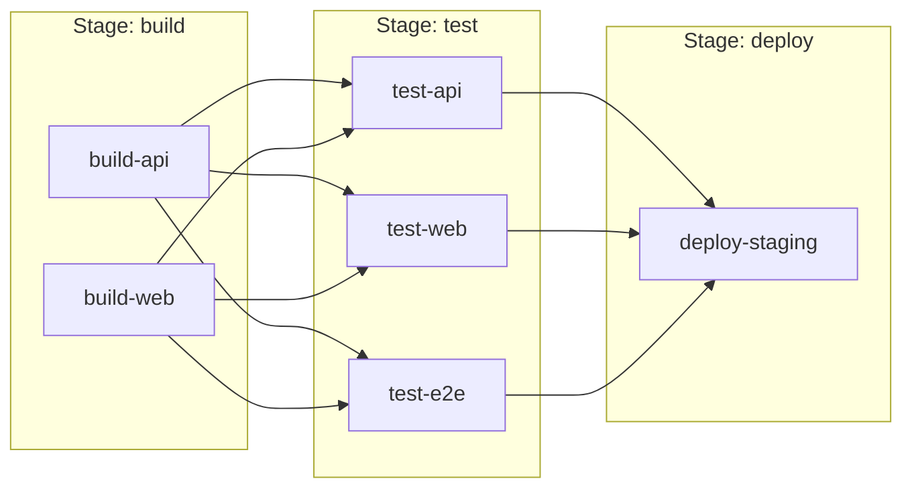
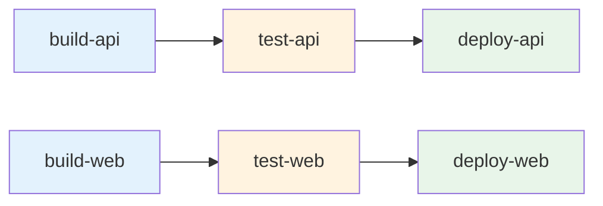
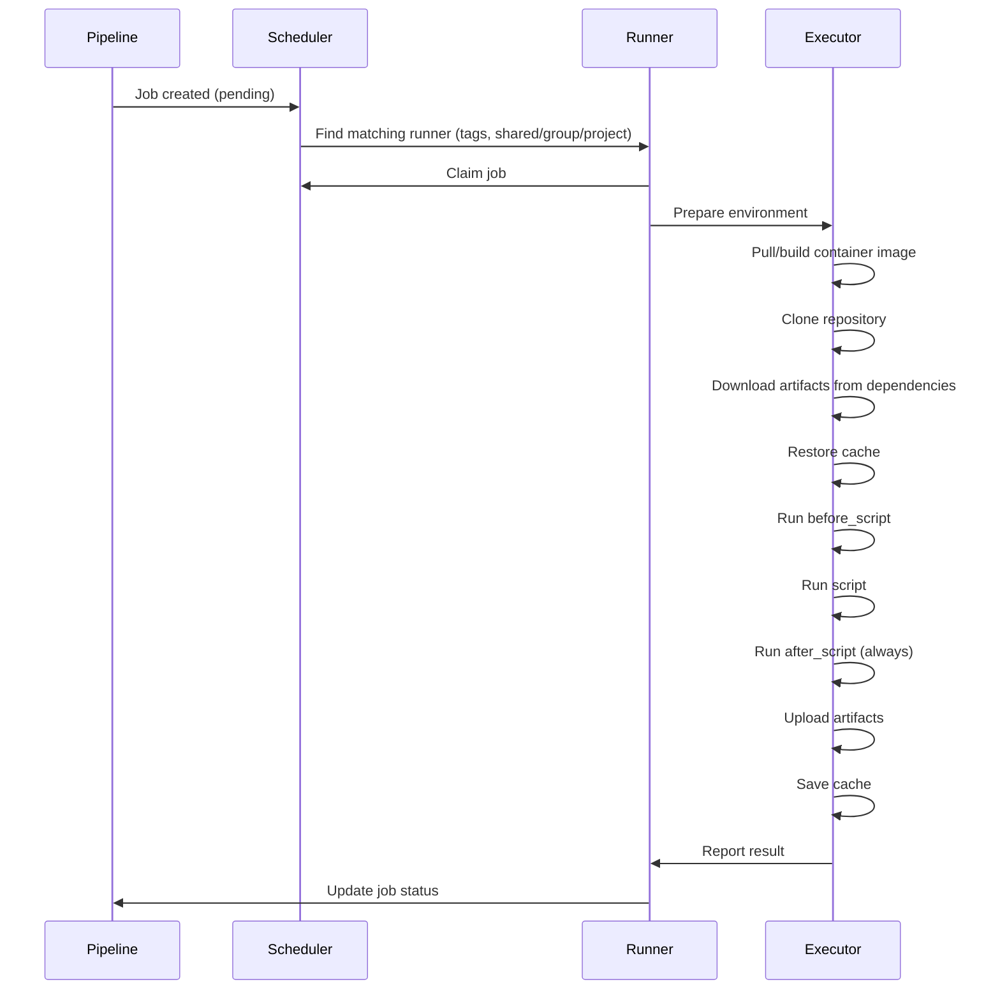
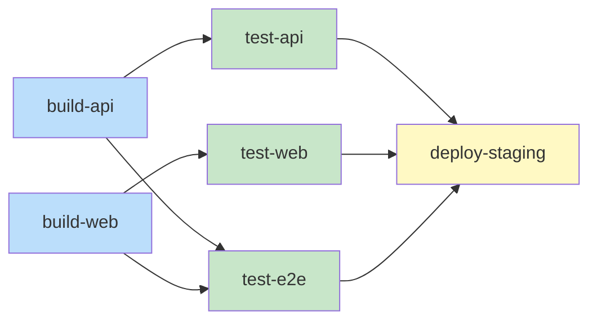
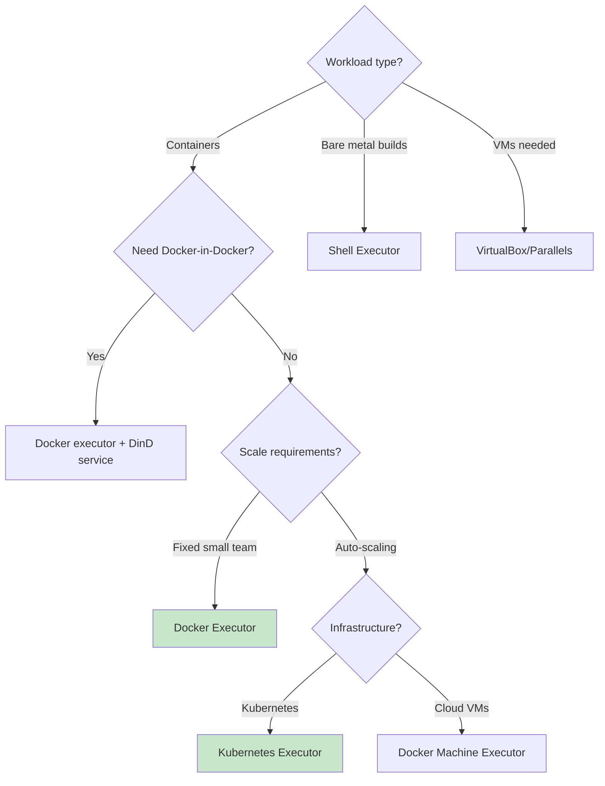

# GitLab CI

## Why GitLab CI Exists

GitLab CI emerged from a fundamental belief: CI/CD should not be a bolt-on service but an integral part of the development platform. When Kamil Trzciński built the first version in 2012 (initially as a separate project called `gitlab-ci`), most teams relied on Jenkins — a powerful but operationally heavy Java application that required dedicated maintenance.

GitLab CI was merged into GitLab core in version 8.0 (September 2015), making it the first major platform to offer integrated CI/CD as a first-class feature. This decision shaped the modern DevOps landscape: today, every major code hosting platform offers integrated CI/CD.

### GitLab CI vs. Other CI Systems

| Feature | GitLab CI | GitHub Actions | Jenkins |
|---------|-----------|---------------|---------|
| Configuration | `.gitlab-ci.yml` | `.github/workflows/*.yml` | `Jenkinsfile` (Groovy) |
| Pipeline model | Stage-based + DAG | Job dependency graph | Declarative/Scripted |
| Runner model | Self-hosted + SaaS | Self-hosted + SaaS | Self-hosted only |
| Container registry | Built-in | GitHub Packages | Plugin |
| Environments | Built-in with review apps | Environment protection rules | Plugin |
| Security scanning | Built-in (Ultimate) | Marketplace actions | Plugin |
| Auto DevOps | Yes (full auto-pipeline) | No | No |
| Pipeline editor | Built-in visual editor | No (third-party) | Blue Ocean (deprecated) |

## First Principles

### The Pipeline Model

GitLab CI uses a **stage-based execution model** with optional **Directed Acyclic Graph (DAG)** overrides. Understanding this duality is key to writing efficient pipelines.

**Stage-based (default)**: Jobs within the same stage run in parallel. Stages run sequentially. A stage only starts when all jobs in the previous stage succeed.



**DAG mode (`needs:`)**: Jobs can declare explicit dependencies, breaking free of stage ordering. A job starts as soon as its dependencies finish, regardless of other jobs in earlier stages.



In DAG mode, `deploy-api` starts immediately after `test-api` passes — it doesn't wait for `test-web`.

### The `.gitlab-ci.yml` Anatomy

```yaml
# Global configuration
default:
  image: node:20-alpine
  tags: [docker]
  retry:
    max: 2
    when: [runner_system_failure, stuck_or_timeout_failure]
  interruptible: true
  before_script:
    - npm ci --cache .npm --prefer-offline

# Variable definitions
variables:
  NODE_ENV: "test"
  FF_USE_FASTZIP: "true"    # Feature flag for faster artifact compression
  ARTIFACT_COMPRESSION_LEVEL: "fast"

# Cache configuration
cache:
  key:
    files:
      - package-lock.json
  paths:
    - .npm/
    - node_modules/
  policy: pull-push

# Stage definitions (execution order)
stages:
  - build
  - test
  - security
  - staging
  - production

# Include external configurations
include:
  - template: Security/SAST.gitlab-ci.yml
  - template: Security/Dependency-Scanning.gitlab-ci.yml
  - local: '.gitlab/ci/deploy.yml'
  - project: 'my-group/shared-ci'
    ref: v2.0
    file: '/templates/docker-build.yml'
```

### Job Lifecycle

Every GitLab CI job follows this lifecycle:



## Core Mechanics

### Job Configuration Reference

```yaml
build-api:
  stage: build
  image:
    name: node:20-alpine
    entrypoint: [""]    # Override default entrypoint
  tags:
    - docker
    - linux
  variables:
    BUILD_TARGET: "api"
  before_script:
    - npm ci
  script:
    - npm run build --workspace=packages/api
    - npm run typecheck --workspace=packages/api
  after_script:
    - echo "Build completed with status $CI_JOB_STATUS"
  artifacts:
    paths:
      - packages/api/dist/
    reports:
      junit: packages/api/test-results.xml
      coverage_report:
        coverage_format: cobertura
        path: packages/api/coverage/cobertura-coverage.xml
    expire_in: 1 week
    when: always    # Upload artifacts even on failure
  cache:
    key: "api-$CI_COMMIT_REF_SLUG"
    paths:
      - node_modules/
    policy: pull    # Don't write cache (use dedicated cache job)
  rules:
    - if: '$CI_PIPELINE_SOURCE == "merge_request_event"'
      changes:
        - packages/api/**/*
        - packages/shared/**/*
      when: on_success
    - if: '$CI_COMMIT_BRANCH == "main"'
      when: on_success
    - when: never
  needs:
    - job: install-deps
      artifacts: true
  timeout: 15 minutes
  retry:
    max: 2
    when:
      - runner_system_failure
      - stuck_or_timeout_failure
  allow_failure: false
  interruptible: true    # Can be cancelled by newer pipeline
  resource_group: api-build    # Mutual exclusion
```

### Rules vs. Only/Except

GitLab deprecated `only`/`except` in favor of the more powerful `rules` system:

```yaml
# OLD (deprecated)
deploy:
  only:
    - main
  except:
    - schedules

# NEW (recommended)
deploy:
  rules:
    - if: '$CI_COMMIT_BRANCH == "main" && $CI_PIPELINE_SOURCE != "schedule"'
      when: on_success
    - when: never

# Complex rules with changes detection
test-api:
  rules:
    # Run on MR if API files changed
    - if: '$CI_PIPELINE_SOURCE == "merge_request_event"'
      changes:
        paths:
          - packages/api/**/*
          - packages/shared/**/*
        compare_to: 'refs/heads/main'
      when: on_success
    # Always run on main
    - if: '$CI_COMMIT_BRANCH == "main"'
      when: on_success
    # Run on tags
    - if: '$CI_COMMIT_TAG =~ /^v\d+\.\d+\.\d+$/'
      when: on_success
    # Never run otherwise
    - when: never
```

### Services (Sidecar Containers)

GitLab CI can spin up service containers alongside your job:

```yaml
integration-tests:
  stage: test
  image: node:20-alpine
  services:
    - name: postgres:16-alpine
      alias: db
      variables:
        POSTGRES_DB: testdb
        POSTGRES_USER: testuser
        POSTGRES_PASSWORD: testpass
      command: ["postgres", "-c", "max_connections=200"]
    - name: redis:7-alpine
      alias: cache
    - name: localstack/localstack:latest
      alias: aws
      variables:
        SERVICES: s3,sqs,dynamodb
        DEFAULT_REGION: us-east-1
  variables:
    DATABASE_URL: "postgresql://testuser:testpass@db:5432/testdb"
    REDIS_URL: "redis://cache:6379"
    AWS_ENDPOINT: "http://aws:4566"
  script:
    - npm run test:integration
```

### DAG Pipelines and `needs`

The `needs` keyword enables DAG mode, allowing jobs to run as soon as their explicit dependencies complete:

```yaml
stages:
  - build
  - test
  - deploy

build-api:
  stage: build
  script: npm run build:api
  artifacts:
    paths: [packages/api/dist/]

build-web:
  stage: build
  script: npm run build:web
  artifacts:
    paths: [packages/web/dist/]

test-api:
  stage: test
  needs: [build-api]     # Starts immediately after build-api
  script: npm run test:api

test-web:
  stage: test
  needs: [build-web]     # Starts immediately after build-web (parallel with test-api)
  script: npm run test:web

test-e2e:
  stage: test
  needs: [build-api, build-web]  # Waits for both builds
  script: npm run test:e2e

deploy-staging:
  stage: deploy
  needs: [test-api, test-web, test-e2e]
  script: ./deploy.sh staging
  environment:
    name: staging
    url: https://staging.example.com
```

**DAG visualization**:



### Parent-Child Pipelines

For complex monorepos, GitLab supports triggering child pipelines:

```yaml
# .gitlab-ci.yml (parent)
stages:
  - trigger

detect-changes:
  stage: trigger
  script:
    - |
      CHANGES=$(git diff --name-only $CI_MERGE_REQUEST_DIFF_BASE_SHA..HEAD)
      echo "Changed files:"
      echo "$CHANGES"
  rules:
    - if: '$CI_PIPELINE_SOURCE == "merge_request_event"'

trigger-api:
  stage: trigger
  trigger:
    include: packages/api/.gitlab-ci.yml
    strategy: depend    # Parent pipeline waits for child
  rules:
    - if: '$CI_PIPELINE_SOURCE == "merge_request_event"'
      changes:
        - packages/api/**/*
        - packages/shared/**/*

trigger-web:
  stage: trigger
  trigger:
    include: packages/web/.gitlab-ci.yml
    strategy: depend
  rules:
    - if: '$CI_PIPELINE_SOURCE == "merge_request_event"'
      changes:
        - packages/web/**/*
        - packages/shared/**/*
```

```yaml
# packages/api/.gitlab-ci.yml (child)
stages:
  - build
  - test

build:
  stage: build
  script:
    - cd packages/api
    - npm ci
    - npm run build

test:
  stage: test
  script:
    - cd packages/api
    - npm ci
    - npm test
```

### Multi-Project Pipelines

Trigger pipelines in other repositories:

```yaml
deploy-infrastructure:
  stage: deploy
  trigger:
    project: my-group/infrastructure
    branch: main
    strategy: depend
  variables:
    APP_VERSION: $CI_COMMIT_SHA
    ENVIRONMENT: staging
```

## Implementation: Production Pipeline

### Complete Production Pipeline

```yaml
# .gitlab-ci.yml
default:
  image: node:20-alpine
  tags: [docker]
  interruptible: true

variables:
  npm_config_cache: "$CI_PROJECT_DIR/.npm"
  DOCKER_BUILDKIT: "1"
  FF_USE_FASTZIP: "true"

workflow:
  rules:
    - if: '$CI_PIPELINE_SOURCE == "merge_request_event"'
    - if: '$CI_COMMIT_BRANCH == "main"'
    - if: '$CI_COMMIT_TAG =~ /^v\d+\.\d+\.\d+$/'

stages:
  - install
  - validate
  - build
  - test
  - security
  - package
  - deploy-staging
  - verify-staging
  - deploy-production

# ============================================================
# Install Dependencies (shared cache)
# ============================================================
install-deps:
  stage: install
  script:
    - npm ci --cache .npm --prefer-offline
  cache:
    key:
      files:
        - package-lock.json
    paths:
      - .npm/
      - node_modules/
    policy: pull-push
  artifacts:
    paths:
      - node_modules/
    expire_in: 1 hour

# ============================================================
# Validation Stage
# ============================================================
lint:
  stage: validate
  needs: [install-deps]
  script:
    - npm run lint
  cache:
    key:
      files:
        - package-lock.json
    paths:
      - node_modules/
    policy: pull

typecheck:
  stage: validate
  needs: [install-deps]
  script:
    - npm run typecheck
  cache:
    key:
      files:
        - package-lock.json
    paths:
      - node_modules/
    policy: pull

# ============================================================
# Build Stage
# ============================================================
build:
  stage: build
  needs: [lint, typecheck]
  script:
    - npm run build
  artifacts:
    paths:
      - dist/
    expire_in: 1 day

# ============================================================
# Test Stage
# ============================================================
.test-base:
  stage: test
  needs: [build]
  artifacts:
    reports:
      junit: test-results/junit.xml
      coverage_report:
        coverage_format: cobertura
        path: coverage/cobertura-coverage.xml
    when: always
  coverage: '/All files[^|]*\|[^|]*\s+([\d\.]+)/'

unit-tests:
  extends: .test-base
  parallel: 4
  script:
    - npm run test -- --shard=$CI_NODE_INDEX/$CI_NODE_TOTAL --reporter=junit --outputFile=test-results/junit.xml
  cache:
    key:
      files:
        - package-lock.json
    paths:
      - node_modules/
    policy: pull

integration-tests:
  extends: .test-base
  services:
    - name: postgres:16-alpine
      alias: db
      variables:
        POSTGRES_DB: test
        POSTGRES_PASSWORD: test
    - name: redis:7-alpine
      alias: cache
  variables:
    DATABASE_URL: "postgresql://postgres:test@db:5432/test"
    REDIS_URL: "redis://cache:6379"
  script:
    - npm run test:integration

e2e-tests:
  extends: .test-base
  image: mcr.microsoft.com/playwright:v1.42.0
  parallel: 3
  script:
    - npm run test:e2e -- --shard=$CI_NODE_INDEX/$CI_NODE_TOTAL
  artifacts:
    paths:
      - test-results/
    reports:
      junit: test-results/junit.xml
    when: always
  rules:
    - if: '$CI_COMMIT_BRANCH == "main"'
    - if: '$CI_PIPELINE_SOURCE == "merge_request_event"'
      changes:
        - src/**/*
        - e2e/**/*

# ============================================================
# Security Stage
# ============================================================
sast:
  stage: security
  needs: [build]

dependency-scanning:
  stage: security
  needs: [install-deps]

container-scanning:
  stage: security
  needs: [docker-build]
  image:
    name: registry.gitlab.com/security-products/container-scanning
    entrypoint: [""]
  variables:
    CS_IMAGE: "$CI_REGISTRY_IMAGE:$CI_COMMIT_SHA"

# ============================================================
# Package Stage
# ============================================================
docker-build:
  stage: package
  image: docker:24
  services:
    - docker:24-dind
  needs: [build, unit-tests, integration-tests]
  variables:
    DOCKER_TLS_CERTDIR: "/certs"
  before_script:
    - docker login -u $CI_REGISTRY_USER -p $CI_REGISTRY_PASSWORD $CI_REGISTRY
  script:
    - |
      docker build \
        --build-arg BUILD_DATE=$(date -u +%Y-%m-%dT%H:%M:%SZ) \
        --build-arg VCS_REF=$CI_COMMIT_SHA \
        --build-arg VERSION=$CI_COMMIT_TAG \
        --cache-from $CI_REGISTRY_IMAGE:latest \
        -t $CI_REGISTRY_IMAGE:$CI_COMMIT_SHA \
        -t $CI_REGISTRY_IMAGE:latest \
        .
      docker push $CI_REGISTRY_IMAGE:$CI_COMMIT_SHA
      docker push $CI_REGISTRY_IMAGE:latest
  rules:
    - if: '$CI_COMMIT_BRANCH == "main"'
    - if: '$CI_COMMIT_TAG =~ /^v\d+\.\d+\.\d+$/'

# ============================================================
# Deploy Staging
# ============================================================
deploy-staging:
  stage: deploy-staging
  image: bitnami/kubectl:latest
  needs: [docker-build, e2e-tests]
  environment:
    name: staging
    url: https://staging.example.com
    on_stop: stop-staging
  script:
    - kubectl config use-context my-group/my-project:staging-agent
    - kubectl set image deployment/app app=$CI_REGISTRY_IMAGE:$CI_COMMIT_SHA -n staging
    - kubectl rollout status deployment/app -n staging --timeout=300s
  rules:
    - if: '$CI_COMMIT_BRANCH == "main"'

stop-staging:
  stage: deploy-staging
  image: bitnami/kubectl:latest
  environment:
    name: staging
    action: stop
  script:
    - kubectl delete namespace staging-$CI_COMMIT_REF_SLUG || true
  when: manual
  rules:
    - if: '$CI_COMMIT_BRANCH == "main"'
      when: manual

# ============================================================
# Verify Staging
# ============================================================
smoke-test-staging:
  stage: verify-staging
  needs: [deploy-staging]
  script:
    - |
      for i in $(seq 1 10); do
        STATUS=$(curl -s -o /dev/null -w "%{http_code}" https://staging.example.com/health)
        if [ "$STATUS" = "200" ]; then
          echo "Health check passed"
          exit 0
        fi
        echo "Attempt $i: got $STATUS, retrying..."
        sleep 5
      done
      echo "Health check failed after 10 attempts"
      exit 1
  rules:
    - if: '$CI_COMMIT_BRANCH == "main"'

# ============================================================
# Deploy Production
# ============================================================
deploy-production:
  stage: deploy-production
  image: bitnami/kubectl:latest
  needs: [smoke-test-staging]
  environment:
    name: production
    url: https://example.com
  script:
    - kubectl config use-context my-group/my-project:production-agent
    - kubectl set image deployment/app app=$CI_REGISTRY_IMAGE:$CI_COMMIT_SHA -n production
    - kubectl rollout status deployment/app -n production --timeout=600s
  when: manual
  allow_failure: false
  resource_group: production    # Only one deploy at a time
  rules:
    - if: '$CI_COMMIT_BRANCH == "main"'
      when: manual
```

### GitLab Runner Configuration

```toml
# /etc/gitlab-runner/config.toml
concurrent = 10
check_interval = 3
log_level = "info"

[session_server]
  session_timeout = 1800

[[runners]]
  name = "docker-runner-01"
  url = "https://gitlab.example.com/"
  token = "RUNNER_TOKEN"
  executor = "docker"
  limit = 5
  request_concurrency = 3

  [runners.docker]
    tls_verify = false
    image = "node:20-alpine"
    privileged = false
    disable_entrypoint_overwrite = false
    oom_kill_disable = false
    volumes = ["/cache", "/certs/client"]
    shm_size = 268435456  # 256MB
    network_mtu = 0
    pull_policy = ["if-not-present"]
    allowed_images = ["node:*", "docker:*", "postgres:*", "redis:*"]
    allowed_services = ["docker:*-dind", "postgres:*", "redis:*"]

  [runners.cache]
    Type = "s3"
    Shared = true
    [runners.cache.s3]
      ServerAddress = "s3.amazonaws.com"
      BucketName = "gitlab-runner-cache"
      BucketLocation = "us-east-1"
      Insecure = false

[[runners]]
  name = "kubernetes-runner"
  url = "https://gitlab.example.com/"
  token = "RUNNER_TOKEN"
  executor = "kubernetes"

  [runners.kubernetes]
    namespace = "gitlab-runners"
    image = "node:20-alpine"
    poll_interval = 3
    poll_timeout = 600
    cpu_request = "500m"
    cpu_limit = "2"
    memory_request = "1Gi"
    memory_limit = "4Gi"
    service_cpu_request = "200m"
    service_cpu_limit = "1"
    service_memory_request = "256Mi"
    service_memory_limit = "1Gi"
    helper_cpu_request = "100m"
    helper_memory_request = "128Mi"

    [runners.kubernetes.node_selector]
      "kubernetes.io/arch" = "amd64"
      "node-type" = "ci"

    [runners.kubernetes.node_tolerations]
      "ci-workload=true" = "NoSchedule"

    [[runners.kubernetes.volumes.host_path]]
      name = "docker-socket"
      mount_path = "/var/run/docker.sock"
      host_path = "/var/run/docker.sock"
      read_only = true
```

## Edge Cases & Failure Modes

### Pipeline Gotchas

| Issue | Symptom | Solution |
|-------|---------|----------|
| Detached MR pipelines | Duplicate pipelines for MR + push | Use `workflow:rules` to control triggers |
| Cache write conflicts | Parallel jobs overwrite cache | Use `cache:policy: pull` in most jobs |
| Artifact size explosion | Pipeline artifacts fill storage | Set `expire_in`, use `.artifacts:reports` |
| Services not ready | Jobs fail connecting to services | Add health checks, wait scripts |
| `rules` evaluation order | Jobs appear/disappear unexpectedly | First matching rule wins; always add `- when: never` |
| `include` merge conflicts | Overridden jobs silently dropped | Use `extends` instead of job name collision |
| Parallel job failures | One shard fails, rest wasted | Use `allow_failure: exit_codes: [42]` |

### Debugging Pipeline Issues

```yaml
debug-job:
  stage: test
  script:
    # Print all CI variables (filtered)
    - env | grep -E '^(CI_|GITLAB_)' | sort

    # Show runner info
    - echo "Runner $CI_RUNNER_DESCRIPTION ($CI_RUNNER_ID)"
    - echo "Executor $CI_RUNNER_EXECUTABLE_ARCH"

    # Check available resources
    - nproc
    - free -h
    - df -h

    # Test service connectivity
    - nc -zv db 5432 || echo "Postgres not reachable"
    - nc -zv cache 6379 || echo "Redis not reachable"
  services:
    - name: postgres:16
      alias: db
    - name: redis:7
      alias: cache
```

### Handling Flaky Pipelines

```yaml
flaky-test:
  stage: test
  retry:
    max: 2
    when:
      - script_failure        # Script returned non-zero
      - runner_system_failure  # Runner crashed
      - stuck_or_timeout_failure
      - scheduler_failure
  script:
    - npm run test:e2e
  artifacts:
    paths:
      - test-results/
    when: always    # Keep artifacts even on retry failure
```

## Performance Characteristics

### Pipeline Performance Benchmarks

| Configuration | Pipeline Duration | Runner Minutes | Cost (SaaS) |
|---------------|------------------|----------------|-------------|
| Sequential stages, no cache | 25 min | 25 min | $0.25 |
| Sequential stages, cached | 15 min | 15 min | $0.15 |
| DAG mode, cached | 10 min | 18 min | $0.18 |
| DAG + parallel, cached | 6 min | 24 min | $0.24 |
| DAG + parallel + path filter | 4 min | 12 min | $0.12 |

### Runner Sizing Guide

$$
N_{\text{runners}} = \left\lceil \frac{\lambda \times T_{\text{avg}}}{\rho_{\text{target}}} \right\rceil
$$

Where:
- $\lambda$ = average pipeline jobs per minute
- $T_{\text{avg}}$ = average job duration in minutes
- $\rho_{\text{target}}$ = target utilization (recommend 0.7)

For a team generating 120 jobs/hour ($\lambda = 2$ jobs/min) with an average 8-minute duration:

$$
N = \left\lceil \frac{2 \times 8}{0.7} \right\rceil = \left\lceil 22.9 \right\rceil = 23 \text{ runners}
$$

### Cache vs. Artifacts Performance

| Mechanism | Use Case | Speed | Persistence | Scope |
|-----------|----------|-------|------------|-------|
| Cache | Dependencies, build intermediates | Restore: 5-15s | Best-effort | Branch/pipeline |
| Artifacts | Build outputs, test results | Download: 2-10s | Guaranteed | Pipeline |
| Container registry | Docker images | Pull: 10-60s | Permanent | Global |
| External cache (S3) | Large datasets | Restore: 10-30s | Permanent | Global |

## Mathematical Foundations

### Pipeline DAG Optimization

The minimum pipeline execution time with DAG dependencies is determined by the **critical path** — the longest chain of dependent jobs:

$$
T_{\text{pipeline}} = \max_{\text{path } p \in G} \sum_{j \in p} T_j
$$

Where $G$ is the dependency graph and $T_j$ is the duration of job $j$.

For our example pipeline:
- Path 1: `build-api` (3m) -> `test-api` (5m) -> `deploy` (2m) = 10m
- Path 2: `build-web` (4m) -> `test-web` (6m) -> `deploy` (2m) = 12m
- Path 3: `build-api` (3m) + `build-web` (4m) -> `test-e2e` (8m) -> `deploy` (2m) = max(3,4) + 8 + 2 = 14m

Critical path is Path 3 at 14 minutes — this is the theoretical minimum pipeline duration regardless of runner count.

### Retry Probability Analysis

With $n$ retries and a per-attempt success probability $p$, the overall success probability is:

$$
P(\text{success}) = 1 - (1-p)^{n+1}
$$

| Per-attempt success rate | No retry | 1 retry | 2 retries |
|--------------------------|----------|---------|-----------|
| 95% | 95.0% | 99.75% | 99.99% |
| 90% | 90.0% | 99.0% | 99.9% |
| 80% | 80.0% | 96.0% | 99.2% |
| 70% | 70.0% | 91.0% | 97.3% |

::: warning
Retries mask flaky tests. A test with 80% pass rate and 2 retries appears to pass 99.2% of the time — hiding a real problem. Track retry rates and fix root causes.
:::

## Real-World War Stories

::: info War Story — The Cascading Pipeline Failure
A platform team at a European bank set up multi-project pipelines where merging to the shared library repo triggered pipelines in 40 downstream services. After a library update, all 40 pipelines triggered simultaneously, exhausting the runner pool. The job queue backed up to 200+ jobs, with a 3-hour wait time. Developers panicked and started force-pushing fixes, creating more pipeline triggers.

**Root cause**: No rate limiting on multi-project pipeline triggers. Each downstream project had a full CI pipeline (build, test, scan, deploy) with 8 jobs each = 320 concurrent jobs.

**Fix**:
1. Added `resource_group` to limit concurrent pipelines per project
2. Implemented staggered triggers with `when: delayed` and `start_in: N minutes`
3. Added shared library test pipeline that validates downstream compatibility before merge
4. Set up runner autoscaling with Kubernetes executor
5. Added pipeline deduplication — if a newer trigger arrives, cancel the previous one

**Lesson**: Multi-project pipelines need backpressure mechanisms. Without rate limiting, one change can create a thundering herd.
:::

::: info War Story — The 10 GB Cache Problem
A data engineering team cached their Python virtualenv (2 GB) and a preprocessed dataset (4 GB). Cache uploads and downloads took 5 minutes each, and the 10 GB repository cache limit meant caches evicted each other constantly. Net effect: caching was slower than building from scratch.

**Fix**: Moved the dataset to a dedicated S3 bucket accessed via pre-signed URLs. Replaced the virtualenv cache with pip wheel caching (200 MB). Cache operations dropped from 10 minutes to 15 seconds.

**Lesson**: Caches should be small, fast to restore, and expensive to recreate. If cache restore time exceeds rebuild time, you're doing it wrong.
:::

## Decision Framework

### Choosing GitLab CI Executor



### GitLab Tier Feature Comparison

| Feature | Free | Premium | Ultimate |
|---------|------|---------|----------|
| CI/CD pipelines | Yes | Yes | Yes |
| CI/CD minutes (SaaS) | 400/mo | 10,000/mo | 50,000/mo |
| Protected environments | No | Yes | Yes |
| Deploy boards | No | Yes | Yes |
| SAST | No | No | Yes |
| DAST | No | No | Yes |
| Dependency scanning | No | No | Yes |
| Container scanning | No | No | Yes |
| License compliance | No | No | Yes |
| Review apps | Yes | Yes | Yes |
| Multi-project pipelines | Yes | Yes | Yes |
| Compliance pipelines | No | No | Yes |

## Advanced Topics

### Auto DevOps

GitLab Auto DevOps provides a complete CI/CD pipeline with zero configuration:

```yaml
# Enable Auto DevOps (simplest possible .gitlab-ci.yml)
include:
  - template: Auto-DevOps.gitlab-ci.yml

variables:
  # Customize Auto DevOps behavior
  AUTO_DEVOPS_PLATFORM_TARGET: "KUBERNETES"
  POSTGRES_ENABLED: "true"
  TEST_DISABLED: "false"
  CODE_QUALITY_DISABLED: "false"
  STAGING_ENABLED: "true"
  INCREMENTAL_ROLLOUT_ENABLED: "true"
  CANARY_ENABLED: "true"
```

Auto DevOps automatically detects your project type and creates a pipeline with: build, test, code quality, SAST, dependency scanning, container scanning, license scanning, review apps, staging deployment, canary deployment, and production deployment.

### Compliance Pipelines

For regulated industries, GitLab Ultimate offers compliance pipelines that enforce required jobs:

```yaml
# Compliance framework pipeline (set at group level)
# This runs BEFORE the project's own .gitlab-ci.yml
include:
  - project: '$CI_CONFIG_PATH'

compliance-sast:
  stage: .pre
  script:
    - run-sast-scan
  allow_failure: false

compliance-audit:
  stage: .post
  script:
    - generate-audit-log
    - upload-to-compliance-system
  when: always
```

### GitLab Agent for Kubernetes (kas)

```yaml
# .gitlab/agents/production/config.yaml
gitops:
  manifest_projects:
    - id: my-group/kubernetes-manifests
      default_namespace: production
      paths:
        - glob: 'manifests/production/**/*.yaml'
      reconcile_timeout: 3600s
      dry_run_strategy: none

ci_access:
  projects:
    - id: my-group/my-app
      environments:
        - production
        - staging
  groups:
    - id: my-group

observability:
  logging:
    level: info
  grpc:
    level: warn
```

This enables `kubectl` commands from GitLab CI without exposing Kubernetes API servers to the internet — the agent runs inside the cluster and establishes an outbound connection to GitLab.

### Pipeline Efficiency Metrics

Track these metrics to continuously improve pipeline performance:

```yaml
# .gitlab-ci.yml — Pipeline metrics collection
collect-metrics:
  stage: .post
  when: always
  image: alpine/curl
  script:
    - |
      # Calculate pipeline duration
      DURATION=$(($(date +%s) - $CI_PIPELINE_CREATED_AT_UNIX))

      # Push metrics to Prometheus Pushgateway
      cat <<METRICS | curl --data-binary @- http://pushgateway:9091/metrics/job/gitlab-ci
      # TYPE pipeline_duration_seconds gauge
      pipeline_duration_seconds{project="$CI_PROJECT_PATH",branch="$CI_COMMIT_REF_NAME",status="$CI_PIPELINE_STATUS"} $DURATION
      # TYPE pipeline_job_count gauge
      pipeline_job_count{project="$CI_PROJECT_PATH"} $CI_PIPELINE_IID
      METRICS
```

These metrics feed dashboards tracking the DORA metrics discussed in the [CI/CD Overview](./index.md), enabling data-driven pipeline optimization.
