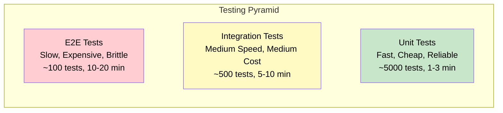
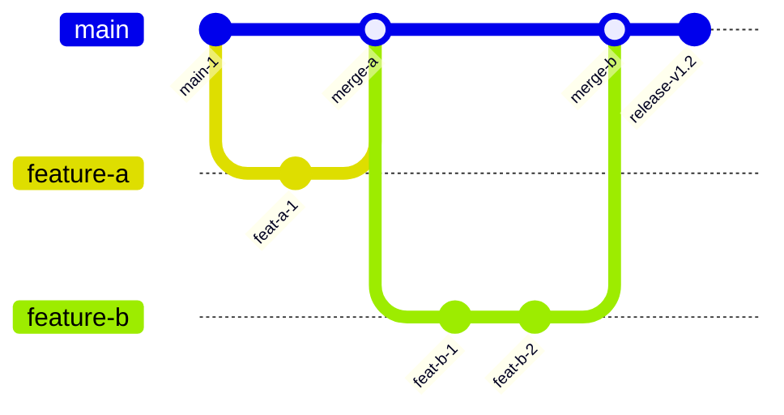
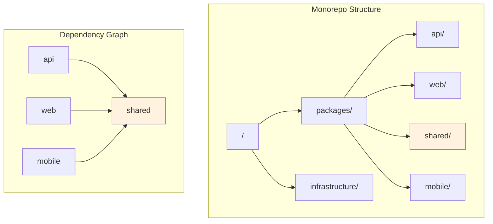
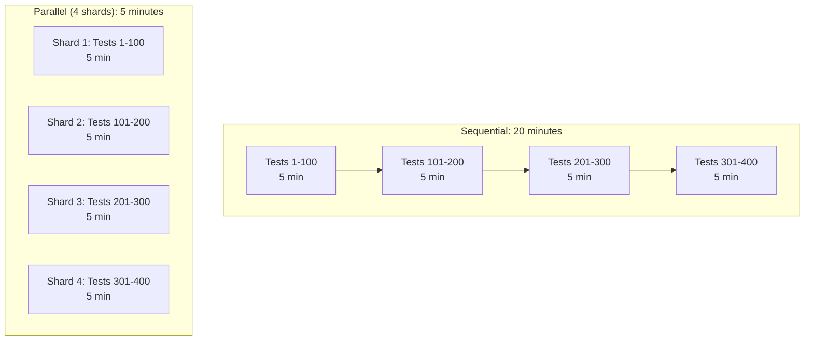
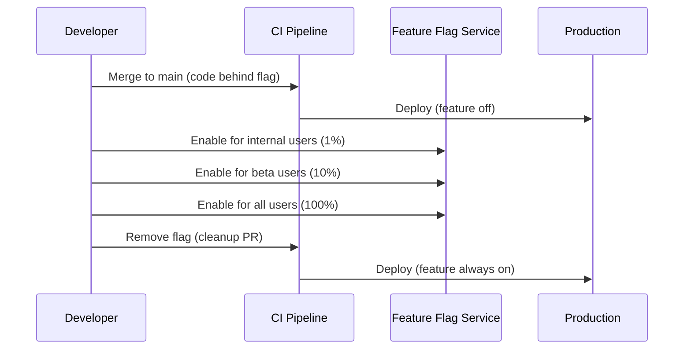
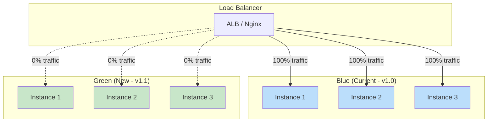
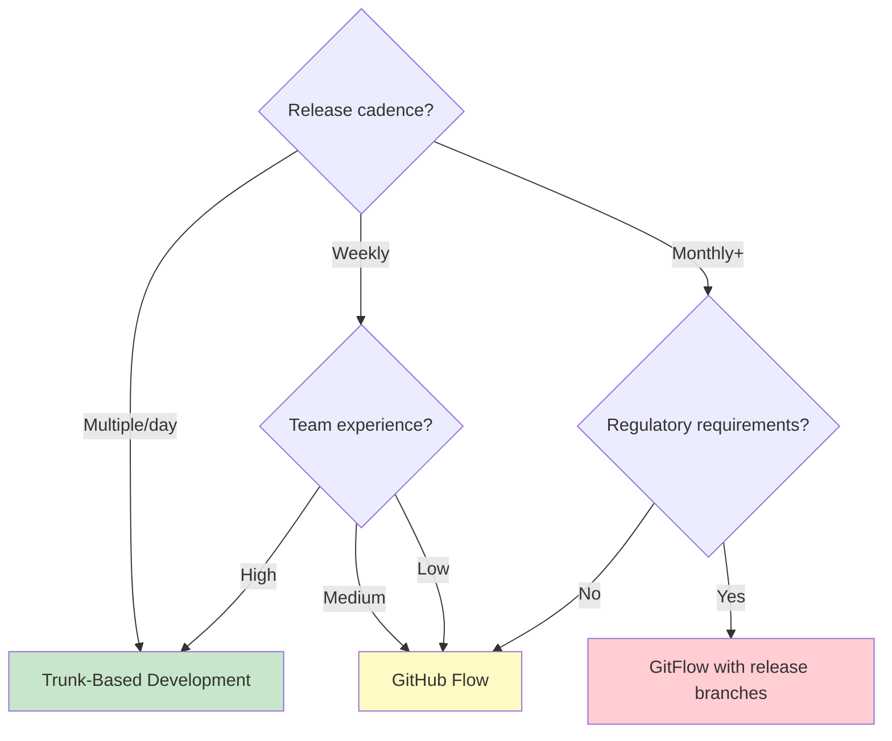

# Pipeline Patterns

## Why Pipeline Patterns Matter

A CI/CD pipeline is not just a sequence of shell commands — it is a **production system** that every developer interacts with dozens of times per day. A poorly designed pipeline creates a bottleneck that multiplies across every engineer, every PR, every deployment. The difference between a 5-minute and a 30-minute pipeline, across a team of 50 engineers making 100 PRs per week, is 2,000 engineer-minutes per week — or roughly one full-time engineer doing nothing but waiting for CI.

Pipeline patterns are the architectural blueprints that solve specific organizational and technical challenges. Just as software design patterns provide reusable solutions to recurring problems, pipeline patterns provide proven approaches to common CI/CD challenges.

### The Problem Space

| Challenge | Naive Approach | Cost | Pattern Solution |
|-----------|---------------|------|-----------------|
| Slow feedback | Run everything sequentially | 30+ min per PR | DAG pipelines, parallel testing |
| Monorepo blast radius | Run all tests on every change | Wasted compute | Change detection, affected project analysis |
| Environment consistency | Manual configuration | Environment drift | Infrastructure as code, immutable artifacts |
| Release coordination | Manual release process | Human error, slow releases | Trunk-based development, feature flags |
| Merge conflicts | Long-lived feature branches | Integration pain | Trunk-based development, short-lived branches |

## First Principles

### The Feedback Loop Axiom

The value of CI/CD feedback decreases exponentially with time:

$$
V(t) = V_0 \cdot e^{-\lambda t}
$$

Where:
- $V_0$ is the maximum value of the feedback (catching a bug before merge)
- $t$ is the time between commit and feedback
- $\lambda$ is the decay constant (typically ~0.1 per minute for developer context)

At $t = 5$ minutes, feedback retains $e^{-0.5} \approx 60\%$ of its value — the developer is still in context. At $t = 30$ minutes, feedback retains $e^{-3} \approx 5\%$ — the developer has context-switched and must reload mental state.

This exponential decay is why pipeline speed is not a nice-to-have but a force multiplier for engineering productivity.

### The Testing Pyramid in CI



Pipeline design should reflect this pyramid: run the fastest, cheapest tests first and gate progressively more expensive tests behind earlier successes.

## Core Mechanics

### Pattern 1: Trunk-Based Development Pipeline

Trunk-based development (TBD) is the practice of all developers committing to a single branch (`main`/`trunk`) with short-lived feature branches (< 1 day).



**Pipeline for trunk-based development**:

```yaml
# .github/workflows/trunk-based.yml
name: Trunk-Based CI/CD

on:
  push:
    branches: [main]
  pull_request:
    branches: [main]

concurrency:
  group: ${​{ github.workflow }}-${​{ github.ref }}
  cancel-in-progress: true

jobs:
  # Gate 1: Fast feedback (< 2 min)
  fast-checks:
    runs-on: ubuntu-latest
    steps:
      - uses: actions/checkout@v4
      - uses: actions/setup-node@v4
        with:
          node-version: '20'
          cache: 'npm'
      - run: npm ci
      - run: npm run lint
      - run: npm run typecheck
      - run: npm run test:unit -- --bail

  # Gate 2: Full validation (< 10 min)
  full-tests:
    needs: fast-checks
    runs-on: ubuntu-latest
    strategy:
      matrix:
        shard: [1, 2, 3, 4]
    services:
      postgres:
        image: postgres:16
        env:
          POSTGRES_PASSWORD: test
        ports: ['5432:5432']
    steps:
      - uses: actions/checkout@v4
      - uses: actions/setup-node@v4
        with:
          node-version: '20'
          cache: 'npm'
      - run: npm ci
      - run: npm run test:all -- --shard=${​{ matrix.shard }}/4

  # Gate 3: Build & push (< 5 min)
  build:
    needs: full-tests
    if: github.ref == 'refs/heads/main'
    runs-on: ubuntu-latest
    outputs:
      image: ${​{ steps.build.outputs.image }}
    steps:
      - uses: actions/checkout@v4
      - uses: docker/setup-buildx-action@v3
      - uses: docker/login-action@v3
        with:
          registry: ghcr.io
          username: ${​{ github.actor }}
          password: ${​{ secrets.GITHUB_TOKEN }}
      - id: build
        uses: docker/build-push-action@v5
        with:
          push: true
          tags: ghcr.io/${​{ github.repository }}:${​{ github.sha }}
          cache-from: type=gha
          cache-to: type=gha,mode=max

  # Gate 4: Progressive deployment
  deploy-canary:
    needs: build
    runs-on: ubuntu-latest
    environment: production-canary
    steps:
      - uses: actions/checkout@v4
      - name: Deploy canary (5% traffic)
        run: |
          kubectl set image deployment/app-canary \
            app=${​{ needs.build.outputs.image }} -n production

  verify-canary:
    needs: deploy-canary
    runs-on: ubuntu-latest
    steps:
      - name: Monitor canary for 10 minutes
        run: |
          for i in $(seq 1 20); do
            ERROR_RATE=$(curl -s "http://prometheus:9090/api/v1/query?query=rate(http_requests_total{status=~\"5..\",deployment=\"canary\"}[1m])/rate(http_requests_total{deployment=\"canary\"}[1m])" | jq '.data.result[0].value[1] // "0"' -r)
            if (( $(echo "$ERROR_RATE > 0.01" | bc -l) )); then
              echo "Canary error rate too high: $ERROR_RATE"
              kubectl rollout undo deployment/app-canary -n production
              exit 1
            fi
            echo "Canary healthy. Error rate: $ERROR_RATE"
            sleep 30
          done

  deploy-full:
    needs: verify-canary
    runs-on: ubuntu-latest
    environment: production
    steps:
      - name: Full production deployment
        run: |
          kubectl set image deployment/app \
            app=${​{ needs.build.outputs.image }} -n production
          kubectl rollout status deployment/app -n production --timeout=600s
```

### Pattern 2: Monorepo Pipeline

Monorepos require intelligent change detection to avoid rebuilding the entire codebase on every commit.



**Change detection with dependency awareness**:

```typescript
// scripts/detect-affected.ts
import { execSync } from 'child_process';
import * as path from 'path';
import * as fs from 'fs';

interface PackageInfo {
  name: string;
  path: string;
  dependencies: string[];
}

interface AffectedResult {
  packages: string[];
  matrix: { package: string }[];
}

function getChangedFiles(baseBranch: string = 'origin/main'): string[] {
  const output = execSync(
    `git diff --name-only ${baseBranch}...HEAD`,
    { encoding: 'utf-8' }
  );
  return output.trim().split('\n').filter(Boolean);
}

function getPackageMap(): Map<string, PackageInfo> {
  const packagesDir = path.join(process.cwd(), 'packages');
  const packages = new Map<string, PackageInfo>();

  for (const dir of fs.readdirSync(packagesDir)) {
    const pkgJsonPath = path.join(packagesDir, dir, 'package.json');
    if (!fs.existsSync(pkgJsonPath)) continue;

    const pkgJson = JSON.parse(fs.readFileSync(pkgJsonPath, 'utf-8'));
    const deps = Object.keys({
      ...pkgJson.dependencies,
      ...pkgJson.devDependencies,
    }).filter(d => d.startsWith('@myorg/'));

    packages.set(dir, {
      name: pkgJson.name,
      path: `packages/${dir}`,
      dependencies: deps.map(d => d.replace('@myorg/', '')),
    });
  }

  return packages;
}

function getAffectedPackages(
  changedFiles: string[],
  packageMap: Map<string, PackageInfo>
): Set<string> {
  const affected = new Set<string>();

  // Direct changes
  for (const file of changedFiles) {
    for (const [name, pkg] of packageMap) {
      if (file.startsWith(pkg.path + '/')) {
        affected.add(name);
      }
    }

    // Root config changes affect everything
    if (
      file === 'package.json' ||
      file === 'tsconfig.json' ||
      file.startsWith('.github/')
    ) {
      for (const name of packageMap.keys()) {
        affected.add(name);
      }
      return affected; // Everything affected
    }
  }

  // Transitive dependencies (BFS)
  const queue = [...affected];
  while (queue.length > 0) {
    const current = queue.shift()!;
    for (const [name, pkg] of packageMap) {
      if (!affected.has(name) && pkg.dependencies.includes(current)) {
        affected.add(name);
        queue.push(name);
      }
    }
  }

  return affected;
}

// Main
const changedFiles = getChangedFiles();
const packageMap = getPackageMap();
const affected = getAffectedPackages(changedFiles, packageMap);

const result: AffectedResult = {
  packages: [...affected],
  matrix: [...affected].map(p => ({ package: p })),
};

console.log(JSON.stringify(result));
```

**Monorepo pipeline with Turborepo**:

```yaml
# .github/workflows/monorepo-ci.yml
name: Monorepo CI

on:
  pull_request:
    branches: [main]
  push:
    branches: [main]

env:
  TURBO_TOKEN: ${​{ secrets.TURBO_TOKEN }}
  TURBO_TEAM: ${​{ vars.TURBO_TEAM }}

jobs:
  detect:
    runs-on: ubuntu-latest
    outputs:
      affected: ${​{ steps.affected.outputs.packages }}
      matrix: ${​{ steps.affected.outputs.matrix }}
    steps:
      - uses: actions/checkout@v4
        with:
          fetch-depth: 0
      - uses: actions/setup-node@v4
        with:
          node-version: '20'
      - id: affected
        run: |
          AFFECTED=$(npx turbo run build --dry-run=json --filter='...[origin/main...HEAD]' | jq -c '.packages')
          MATRIX=$(echo "$AFFECTED" | jq -c '[.[] | select(. != "//") | {package: .}]')
          echo "packages=$AFFECTED" >> "$GITHUB_OUTPUT"
          echo "matrix=$MATRIX" >> "$GITHUB_OUTPUT"
          echo "Affected packages: $AFFECTED"

  lint:
    needs: detect
    if: needs.detect.outputs.affected != '[]'
    runs-on: ubuntu-latest
    steps:
      - uses: actions/checkout@v4
      - uses: actions/setup-node@v4
        with:
          node-version: '20'
          cache: 'npm'
      - run: npm ci
      - run: npx turbo run lint --filter='...[origin/main...HEAD]'

  test:
    needs: detect
    if: needs.detect.outputs.matrix != '[]'
    runs-on: ubuntu-latest
    strategy:
      fail-fast: false
      matrix:
        include: ${​{ fromJson(needs.detect.outputs.matrix) }}
    steps:
      - uses: actions/checkout@v4
      - uses: actions/setup-node@v4
        with:
          node-version: '20'
          cache: 'npm'
      - run: npm ci
      - run: npx turbo run test --filter=${​{ matrix.package }}

  build:
    needs: [lint, test]
    runs-on: ubuntu-latest
    steps:
      - uses: actions/checkout@v4
      - uses: actions/setup-node@v4
        with:
          node-version: '20'
          cache: 'npm'
      - run: npm ci
      - run: npx turbo run build --filter='...[origin/main...HEAD]'
      - uses: actions/upload-artifact@v4
        with:
          name: build-artifacts
          path: |
            packages/*/dist/
```

### Pattern 3: Parallel Testing

Test parallelization is the single most impactful optimization for pipeline speed:



**Intelligent test sharding by duration**:

```typescript
// scripts/shard-tests.ts
import * as fs from 'fs';

interface TestTiming {
  file: string;
  duration: number; // milliseconds
}

interface ShardAssignment {
  shard: number;
  files: string[];
  estimatedDuration: number;
}

function loadTimings(timingsFile: string): TestTiming[] {
  if (!fs.existsSync(timingsFile)) {
    return []; // First run, no timing data
  }

  return JSON.parse(fs.readFileSync(timingsFile, 'utf-8'));
}

function shardByDuration(
  testFiles: string[],
  timings: TestTiming[],
  shardCount: number
): ShardAssignment[] {
  const timingMap = new Map(timings.map(t => [t.file, t.duration]));
  const defaultDuration = 5000; // 5s default for unknown tests

  // Sort tests by duration (descending) for better bin packing
  const sortedTests = [...testFiles].sort((a, b) => {
    const dA = timingMap.get(a) ?? defaultDuration;
    const dB = timingMap.get(b) ?? defaultDuration;
    return dB - dA;
  });

  // Greedy bin-packing: assign each test to the shard with least total duration
  const shards: ShardAssignment[] = Array.from({ length: shardCount }, (_, i) => ({
    shard: i + 1,
    files: [],
    estimatedDuration: 0,
  }));

  for (const test of sortedTests) {
    // Find shard with minimum current duration
    const minShard = shards.reduce((min, s) =>
      s.estimatedDuration < min.estimatedDuration ? s : min
    );

    minShard.files.push(test);
    minShard.estimatedDuration += timingMap.get(test) ?? defaultDuration;
  }

  return shards;
}

// Calculate theoretical speedup
function calculateSpeedup(shards: ShardAssignment[]): number {
  const totalDuration = shards.reduce((sum, s) => sum + s.estimatedDuration, 0);
  const maxShardDuration = Math.max(...shards.map(s => s.estimatedDuration));
  return totalDuration / maxShardDuration;
}

// Usage
const testFiles = fs.readdirSync('src')
  .filter(f => f.endsWith('.test.ts'))
  .map(f => `src/${f}`);

const timings = loadTimings('.test-timings.json');
const shardCount = parseInt(process.env.CI_SHARD_COUNT ?? '4', 10);
const shards = shardByDuration(testFiles, timings, shardCount);

console.log(`Speedup factor: ${calculateSpeedup(shards).toFixed(2)}x`);
for (const shard of shards) {
  console.log(
    `Shard ${shard.shard}: ${shard.files.length} tests, ` +
    `~${(shard.estimatedDuration / 1000).toFixed(1)}s`
  );
}

// Output for CI consumption
const currentShard = parseInt(process.env.CI_SHARD_INDEX ?? '1', 10);
const myFiles = shards[currentShard - 1].files;
console.log(myFiles.join('\n'));
```

**Pipeline with duration-based sharding**:

```yaml
jobs:
  prepare-shards:
    runs-on: ubuntu-latest
    outputs:
      shards: ${​{ steps.shard.outputs.shards }}
    steps:
      - uses: actions/checkout@v4
      - uses: actions/cache/restore@v4
        with:
          path: .test-timings.json
          key: test-timings-${​{ github.ref }}
          restore-keys: test-timings-
      - id: shard
        run: |
          SHARDS=$(npx ts-node scripts/shard-tests.ts --json --count=4)
          echo "shards=$SHARDS" >> "$GITHUB_OUTPUT"

  test:
    needs: prepare-shards
    runs-on: ubuntu-latest
    strategy:
      fail-fast: false
      matrix:
        shard: ${​{ fromJson(needs.prepare-shards.outputs.shards) }}
    steps:
      - uses: actions/checkout@v4
      - uses: actions/setup-node@v4
        with:
          node-version: '20'
          cache: 'npm'
      - run: npm ci
      - run: |
          echo '${​{ matrix.shard.files }}' > /tmp/test-files.txt
          npx vitest run --reporter=json --outputFile=test-results.json $(cat /tmp/test-files.txt | tr ',' ' ')
      - uses: actions/upload-artifact@v4
        with:
          name: test-results-${​{ matrix.shard.index }}
          path: test-results.json

  collect-timings:
    needs: test
    if: github.ref == 'refs/heads/main'
    runs-on: ubuntu-latest
    steps:
      - uses: actions/checkout@v4
      - uses: actions/download-artifact@v4
        with:
          pattern: test-results-*
      - run: |
          # Merge timing data from all shards
          npx ts-node scripts/merge-timings.ts test-results-*/*.json > .test-timings.json
      - uses: actions/cache/save@v4
        with:
          path: .test-timings.json
          key: test-timings-${​{ github.ref }}
```

### Pattern 4: Feature Flag Pipeline

Feature flags decouple deployment from release, enabling trunk-based development with safe rollouts:



```typescript
// src/feature-flags.ts
interface FeatureFlagConfig {
  name: string;
  defaultValue: boolean;
  rolloutPercentage: number;
  targetGroups: string[];
  killSwitch: boolean;
}

class FeatureFlagService {
  private flags: Map<string, FeatureFlagConfig>;
  private evaluationCache: Map<string, boolean> = new Map();

  constructor(private provider: FeatureFlagProvider) {
    this.flags = new Map();
  }

  async initialize(): Promise<void> {
    const configs = await this.provider.fetchAll();
    for (const config of configs) {
      this.flags.set(config.name, config);
    }

    // Subscribe to real-time updates
    this.provider.onUpdate((config) => {
      this.flags.set(config.name, config);
      this.evaluationCache.clear();
    });
  }

  isEnabled(flagName: string, context: EvaluationContext): boolean {
    const cacheKey = `${flagName}:${context.userId}`;
    const cached = this.evaluationCache.get(cacheKey);
    if (cached !== undefined) return cached;

    const flag = this.flags.get(flagName);
    if (!flag) return false;

    // Kill switch overrides everything
    if (flag.killSwitch) return false;

    // Check target groups
    if (flag.targetGroups.length > 0) {
      const inTargetGroup = flag.targetGroups.some(
        group => context.groups?.includes(group)
      );
      if (inTargetGroup) {
        this.evaluationCache.set(cacheKey, true);
        return true;
      }
    }

    // Percentage rollout (deterministic based on user ID)
    const hash = this.hashString(`${flagName}:${context.userId}`);
    const bucket = hash % 100;
    const enabled = bucket < flag.rolloutPercentage;

    this.evaluationCache.set(cacheKey, enabled);
    return enabled;
  }

  private hashString(str: string): number {
    let hash = 0;
    for (let i = 0; i < str.length; i++) {
      const char = str.charCodeAt(i);
      hash = ((hash << 5) - hash) + char;
      hash = hash & hash; // Convert to 32-bit integer
    }
    return Math.abs(hash);
  }
}

interface EvaluationContext {
  userId: string;
  groups?: string[];
  environment?: string;
  region?: string;
}

interface FeatureFlagProvider {
  fetchAll(): Promise<FeatureFlagConfig[]>;
  onUpdate(callback: (config: FeatureFlagConfig) => void): void;
}
```

### Pattern 5: Blue-Green Deployment Pipeline



```yaml
# Blue-green deployment with AWS ECS
jobs:
  deploy-blue-green:
    runs-on: ubuntu-latest
    environment: production
    steps:
      - uses: actions/checkout@v4

      - uses: aws-actions/configure-aws-credentials@v4
        with:
          role-to-assume: ${​{ vars.DEPLOY_ROLE_ARN }}
          aws-region: us-east-1

      - name: Determine active environment
        id: active
        run: |
          ACTIVE=$(aws elbv2 describe-rules \
            --listener-arn ${​{ vars.LISTENER_ARN }} \
            --query 'Rules[?IsDefault].Actions[0].ForwardConfig.TargetGroups[?Weight>`0`].TargetGroupArn' \
            --output text)
          if echo "$ACTIVE" | grep -q "blue"; then
            echo "active=blue" >> "$GITHUB_OUTPUT"
            echo "inactive=green" >> "$GITHUB_OUTPUT"
          else
            echo "active=green" >> "$GITHUB_OUTPUT"
            echo "inactive=blue" >> "$GITHUB_OUTPUT"
          fi

      - name: Deploy to inactive environment
        run: |
          ENV=${​{ steps.active.outputs.inactive }}
          aws ecs update-service \
            --cluster production \
            --service app-${ENV} \
            --task-definition app:${​{ github.sha }} \
            --force-new-deployment
          aws ecs wait services-stable \
            --cluster production \
            --services app-${ENV}

      - name: Health check inactive environment
        run: |
          ENV=${​{ steps.active.outputs.inactive }}
          ENDPOINT=$(aws elbv2 describe-target-groups \
            --names app-${ENV} \
            --query 'TargetGroups[0].HealthCheckPath' \
            --output text)
          curl --fail --retry 10 --retry-delay 5 \
            "http://app-${ENV}.internal${ENDPOINT}"

      - name: Switch traffic
        run: |
          ACTIVE_TG=$(aws elbv2 describe-target-groups \
            --names app-${​{ steps.active.outputs.active }} \
            --query 'TargetGroups[0].TargetGroupArn' --output text)
          INACTIVE_TG=$(aws elbv2 describe-target-groups \
            --names app-${​{ steps.active.outputs.inactive }} \
            --query 'TargetGroups[0].TargetGroupArn' --output text)

          aws elbv2 modify-rule \
            --rule-arn ${​{ vars.DEFAULT_RULE_ARN }} \
            --actions "[{
              \"Type\": \"forward\",
              \"ForwardConfig\": {
                \"TargetGroups\": [
                  {\"TargetGroupArn\": \"${INACTIVE_TG}\", \"Weight\": 100},
                  {\"TargetGroupArn\": \"${ACTIVE_TG}\", \"Weight\": 0}
                ]
              }
            }]"

      - name: Monitor for 5 minutes
        run: |
          for i in $(seq 1 10); do
            ERROR_RATE=$(aws cloudwatch get-metric-statistics \
              --namespace AWS/ApplicationELB \
              --metric-name HTTPCode_Target_5XX_Count \
              --period 30 --statistics Sum \
              --start-time $(date -u -d '1 minute ago' +%Y-%m-%dT%H:%M:%S) \
              --end-time $(date -u +%Y-%m-%dT%H:%M:%S) \
              --query 'Datapoints[0].Sum // `0`' --output text)
            echo "5XX count: $ERROR_RATE"
            if [ "$ERROR_RATE" -gt "10" ]; then
              echo "Too many errors, rolling back"
              # Rollback: switch traffic back
              aws elbv2 modify-rule \
                --rule-arn ${​{ vars.DEFAULT_RULE_ARN }} \
                --actions "[{
                  \"Type\": \"forward\",
                  \"ForwardConfig\": {
                    \"TargetGroups\": [
                      {\"TargetGroupArn\": \"${ACTIVE_TG}\", \"Weight\": 100},
                      {\"TargetGroupArn\": \"${INACTIVE_TG}\", \"Weight\": 0}
                    ]
                  }
                }]"
              exit 1
            fi
            sleep 30
          done
```

### Pattern 6: Preview Environment Per PR

```yaml
# .github/workflows/preview.yml
name: Preview Environment

on:
  pull_request:
    types: [opened, synchronize, reopened, closed]

jobs:
  deploy-preview:
    if: github.event.action != 'closed'
    runs-on: ubuntu-latest
    environment:
      name: preview-${​{ github.event.pull_request.number }}
      url: https://pr-${​{ github.event.pull_request.number }}.preview.example.com
    steps:
      - uses: actions/checkout@v4

      - name: Build preview image
        run: |
          docker build -t preview:pr-${​{ github.event.pull_request.number }} .

      - name: Deploy preview
        run: |
          # Create namespace for this PR
          kubectl create namespace preview-${​{ github.event.pull_request.number }} \
            --dry-run=client -o yaml | kubectl apply -f -

          # Deploy application
          helm upgrade --install \
            pr-${​{ github.event.pull_request.number }} \
            ./chart \
            --namespace preview-${​{ github.event.pull_request.number }} \
            --set image.tag=pr-${​{ github.event.pull_request.number }} \
            --set ingress.host=pr-${​{ github.event.pull_request.number }}.preview.example.com \
            --wait --timeout 300s

      - name: Comment PR with preview URL
        uses: actions/github-script@v7
        with:
          script: |
            const url = `https://pr-${​{ github.event.pull_request.number }}.preview.example.com`;
            const body = `## Preview Environment\n\nDeployed to: ${url}\n\nThis environment will be destroyed when the PR is closed.`;

            // Find existing comment
            const comments = await github.rest.issues.listComments({
              ...context.repo,
              issue_number: context.issue.number,
            });
            const existing = comments.data.find(c => c.body.includes('Preview Environment'));

            if (existing) {
              await github.rest.issues.updateComment({
                ...context.repo,
                comment_id: existing.id,
                body,
              });
            } else {
              await github.rest.issues.createComment({
                ...context.repo,
                issue_number: context.issue.number,
                body,
              });
            }

  cleanup-preview:
    if: github.event.action == 'closed'
    runs-on: ubuntu-latest
    steps:
      - name: Destroy preview environment
        run: |
          helm uninstall pr-${​{ github.event.pull_request.number }} \
            --namespace preview-${​{ github.event.pull_request.number }} || true
          kubectl delete namespace preview-${​{ github.event.pull_request.number }} || true
```

## Edge Cases & Failure Modes

### Pattern Anti-Patterns

| Anti-Pattern | Problem | Better Approach |
|-------------|---------|----------------|
| Test everything on every PR | Wasted compute, slow feedback | Change detection + affected analysis |
| Sequential stages only | Artificial dependencies slow pipeline | DAG dependencies with `needs` |
| Single massive E2E suite | Flaky, slow, hard to debug | Parallel shards with timing data |
| Manual deployment gates | Bottleneck on approvers | Automated canary with auto-rollback |
| Shared mutable test data | Test interference, flaky failures | Per-test database, test isolation |
| Long-lived feature branches | Merge conflicts, integration risk | Trunk-based + feature flags |
| Monolithic pipeline | Can't scale, hard to maintain | Reusable workflows, pipeline composition |

### Dealing with Flaky Tests in Parallel

```typescript
// scripts/quarantine-manager.ts
interface TestResult {
  name: string;
  passed: boolean;
  duration: number;
  retried: boolean;
}

interface QuarantineDecision {
  action: 'quarantine' | 'keep' | 'remove';
  reason: string;
}

class QuarantineManager {
  private readonly FLAKY_THRESHOLD = 0.15; // 15% failure rate
  private readonly WINDOW_SIZE = 20;       // Last 20 runs
  private readonly HEAL_THRESHOLD = 0.02;  // 2% failure rate to un-quarantine

  analyzeTest(
    testName: string,
    history: TestResult[]
  ): QuarantineDecision {
    if (history.length < this.WINDOW_SIZE) {
      return { action: 'keep', reason: 'Insufficient data' };
    }

    const recent = history.slice(-this.WINDOW_SIZE);
    const failures = recent.filter(r => !r.passed).length;
    const failureRate = failures / recent.length;

    if (failureRate >= this.FLAKY_THRESHOLD) {
      return {
        action: 'quarantine',
        reason: `Failure rate ${(failureRate * 100).toFixed(1)}% exceeds threshold`,
      };
    }

    if (failureRate <= this.HEAL_THRESHOLD) {
      return {
        action: 'remove',
        reason: `Failure rate ${(failureRate * 100).toFixed(1)}% below heal threshold`,
      };
    }

    return { action: 'keep', reason: 'Within acceptable range' };
  }
}
```

## Performance Characteristics

### Pipeline Optimization Impact

| Optimization | Before | After | Effort |
|-------------|--------|-------|--------|
| Add dependency caching | 15 min | 8 min | Low |
| Parallel test shards (4x) | 8 min | 3 min | Low |
| DAG pipeline (remove stage waits) | 12 min | 7 min | Medium |
| Change detection (monorepo) | 20 min | 5 min | Medium |
| Remote build cache (Turbo) | 10 min | 2 min | Medium |
| Predictive test selection | 8 min | 2 min | High |
| Self-hosted runners (warm cache) | 5 min | 2 min | High |

### Cost vs. Speed Tradeoff

$$
\text{Total Cost} = C_{\text{compute}} + C_{\text{developer-wait}}
$$

$$
C_{\text{compute}} = P \times T_{\text{pipeline}} \times C_{\text{per-min}}
$$

$$
C_{\text{developer-wait}} = N_{\text{devs}} \times D_{\text{daily-PRs}} \times T_{\text{wait}} \times C_{\text{dev-hourly}} / 60
$$

For a team of 30 developers at \$80/hr, each submitting 3 PRs/day:

| Pipeline Duration | Daily Compute Cost | Daily Wait Cost | Total Daily |
|------------------|--------------------|-----------------|-------------|
| 30 min | $72 | $3,600 | $3,672 |
| 15 min | $72 | $1,800 | $1,872 |
| 5 min | $96 | $600 | $696 |
| 2 min | $120 | $240 | $360 |

Spending more on compute (parallel runners, larger machines) dramatically reduces total cost because developer wait time dominates.

## Mathematical Foundations

### Optimal Shard Count

Given $n$ tests with durations $d_1, d_2, \ldots, d_n$ and $k$ shards, the optimal makespan (using greedy bin-packing) satisfies:

$$
T_{\text{makespan}} \leq \frac{4}{3} \cdot T_{\text{optimal}}
$$

This is the LPT (Longest Processing Time first) approximation ratio. The optimal solution is NP-hard (it's the multiprocessor scheduling problem), but LPT gives a 4/3 approximation.

The theoretical optimal makespan is bounded by:

$$
T_{\text{optimal}} \geq \max\left(\max_i d_i, \frac{\sum_{i=1}^n d_i}{k}\right)
$$

### Queuing Theory for PR Reviews

PRs in a review queue follow an M/G/c model:

$$
W_q = \frac{C_s^2 + C_a^2}{2} \cdot \frac{\rho}{1-\rho} \cdot \frac{1}{\mu}
$$

Where $C_s$ is the coefficient of variation of service time (review duration) and $C_a$ is the coefficient of variation of arrival time. High variance in review times ($C_s > 1$) dramatically increases wait times.

## Real-World War Stories

::: info War Story — The Monorepo That Brought Down CI
A fintech startup migrated 30 microservices into a monorepo for better code sharing. Day one: every push triggered builds for all 30 services. With 50 developers pushing 200 commits/day, this meant 6,000 service builds per day. Their 20-runner pool was overwhelmed within hours, and the queue grew to 8+ hours.

**Emergency fix**: Added path-based filtering so each service only built when its own files changed. But this missed shared library changes.

**Proper fix**: Built a dependency graph analysis tool (similar to the TypeScript code above). When `packages/shared/` changed, it computed the transitive closure of dependent services and only built those. CI minutes dropped 85%.

**Further optimization**: Added Turborepo with remote caching. If `packages/api` hadn't changed since the last main build, it reused the cached artifact. This cut another 60% off remaining builds.

**Final numbers**: 6,000 builds/day -> 400 builds/day. Pipeline time: 25 min -> 4 min.
:::

::: info War Story — Feature Flag Cleanup Debt
A product team adopted feature flags enthusiastically — 200 flags in 6 months. But they never cleaned up old flags. The codebase became a maze of conditional paths. Tests had to cover flag permutations ($2^{200}$ theoretical combinations). A production incident occurred when two flags interacted unexpectedly, creating a code path that no test covered.

**Fix**: Implemented a "flag lifecycle" policy:
1. Every flag has an owner and an expiration date (max 30 days)
2. CI pipeline fails if a flag exceeds its expiration
3. A weekly report shows flag age and usage
4. Dead flags are auto-detected by feature flag service metrics

Flag count dropped from 200 to 25 active flags within 3 months. Test reliability improved measurably.
:::

## Decision Framework

### Choosing a Branching Strategy

| Strategy | Branch Lifetime | Team Size | Release Cadence | Risk Tolerance |
|----------|----------------|-----------|----------------|---------------|
| Trunk-Based | < 1 day | Any | Continuous | High (needs feature flags) |
| GitHub Flow | 1-5 days | Small-Medium | Weekly | Medium |
| GitFlow | Weeks-Months | Large | Scheduled | Low |
| Release Branches | Per release | Large | Scheduled | Low |



### When to Use Each Pattern

| Pattern | Use When | Avoid When |
|---------|----------|------------|
| Trunk-based | Continuous deployment, experienced team | Regulatory holds, immature testing |
| Monorepo pipeline | Shared code, coordinated releases | Independent teams, massive codebase |
| Parallel testing | > 5 min test suite, flaky tests | Simple projects, < 50 tests |
| Feature flags | Trunk-based development, gradual rollout | Simple features, short development cycles |
| Blue-green | Zero-downtime requirements, easy rollback | Database migrations, stateful services |
| Preview environments | UI-heavy features, stakeholder review | Backend-only changes, cost constraints |
| Canary deployment | High-traffic services, risk-averse | Low-traffic services, simple applications |

## Advanced Topics

### Predictive Test Selection

Instead of running all tests, use ML to predict which tests are likely to fail based on the changed files:

```typescript
// Simplified predictive test selection
interface TestPrediction {
  testFile: string;
  probability: number;
  reason: string;
}

class PredictiveTestSelector {
  private cooccurrenceMatrix: Map<string, Map<string, number>> = new Map();
  private totalRuns: number = 0;

  // Build model from historical data
  train(history: { changedFiles: string[]; failedTests: string[] }[]): void {
    this.totalRuns = history.length;

    for (const run of history) {
      for (const file of run.changedFiles) {
        if (!this.cooccurrenceMatrix.has(file)) {
          this.cooccurrenceMatrix.set(file, new Map());
        }
        const row = this.cooccurrenceMatrix.get(file)!;

        for (const test of run.failedTests) {
          row.set(test, (row.get(test) ?? 0) + 1);
        }
      }
    }
  }

  // Predict which tests might fail
  predict(changedFiles: string[], threshold: number = 0.1): TestPrediction[] {
    const scores = new Map<string, number>();

    for (const file of changedFiles) {
      const row = this.cooccurrenceMatrix.get(file);
      if (!row) continue;

      for (const [test, count] of row) {
        const probability = count / this.totalRuns;
        const current = scores.get(test) ?? 0;
        scores.set(test, Math.max(current, probability));
      }
    }

    return [...scores.entries()]
      .filter(([, prob]) => prob >= threshold)
      .map(([testFile, probability]) => ({
        testFile,
        probability,
        reason: `${(probability * 100).toFixed(1)}% historical correlation`,
      }))
      .sort((a, b) => b.probability - a.probability);
  }
}
```

### Pipeline Observability

```typescript
// Pipeline metrics collector
import { metrics, trace } from '@opentelemetry/api';

const meter = metrics.getMeter('ci-pipeline');
const tracer = trace.getTracer('ci-pipeline');

const pipelineDuration = meter.createHistogram('pipeline.duration', {
  description: 'Pipeline execution duration in seconds',
  unit: 's',
});

const queueTime = meter.createHistogram('pipeline.queue_time', {
  description: 'Time spent waiting for a runner',
  unit: 's',
});

const cacheHitRate = meter.createObservableGauge('pipeline.cache_hit_rate', {
  description: 'Cache hit rate percentage',
});

const testFlakyRate = meter.createObservableGauge('pipeline.test_flaky_rate', {
  description: 'Percentage of tests that are flaky',
});

// Track pipeline execution
async function executePipeline(config: PipelineConfig): Promise<void> {
  const span = tracer.startSpan('pipeline.execute', {
    attributes: {
      'pipeline.id': config.id,
      'pipeline.trigger': config.trigger,
      'pipeline.branch': config.branch,
    },
  });

  const startTime = Date.now();

  try {
    // ... execute pipeline
    span.setStatus({ code: 0 }); // OK
  } catch (error) {
    span.setStatus({ code: 2, message: String(error) }); // ERROR
    throw error;
  } finally {
    const duration = (Date.now() - startTime) / 1000;
    pipelineDuration.record(duration, {
      status: span.status?.code === 0 ? 'success' : 'failure',
      branch: config.branch,
    });
    span.end();
  }
}
```

These patterns form the building blocks of production CI/CD systems. Most real-world pipelines combine multiple patterns — trunk-based development with monorepo change detection, parallel testing, and canary deployments. The key is matching patterns to your team's specific constraints: team size, release cadence, risk tolerance, and regulatory requirements.

For implementation details on specific CI platforms, see [GitHub Actions Deep Dive](./github-actions-deep-dive) and [GitLab CI](./gitlab-ci). For artifact management strategies referenced in these patterns, see [Artifact Management](./artifact-management).
