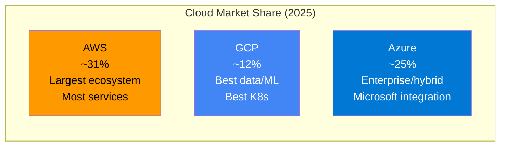
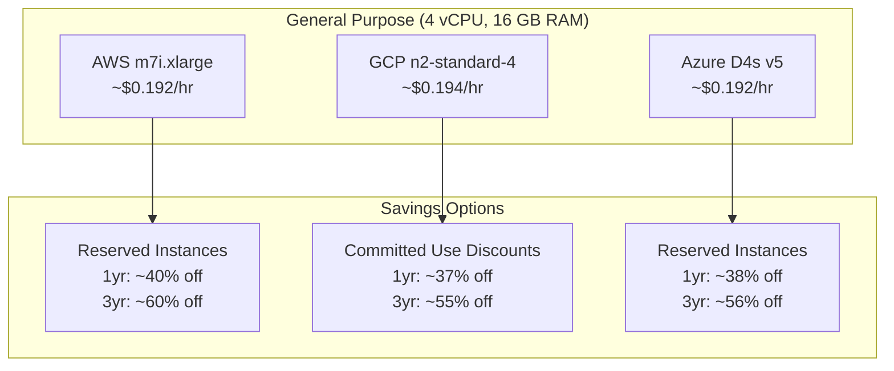
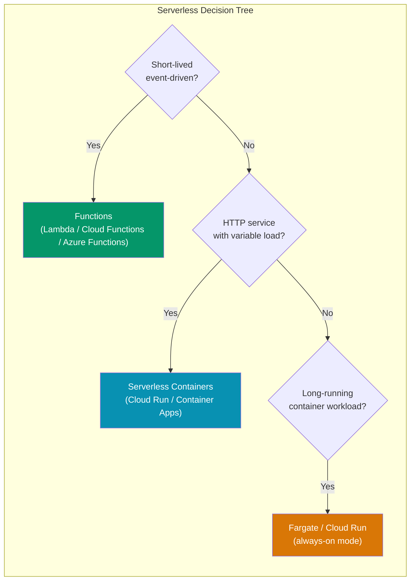
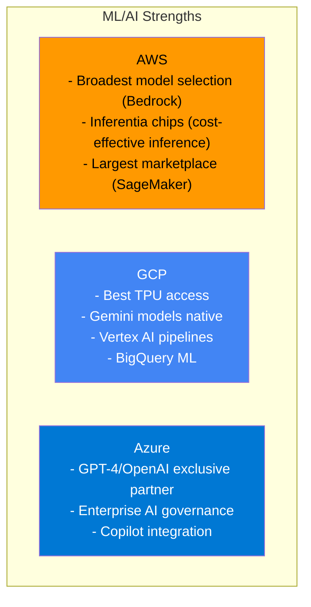
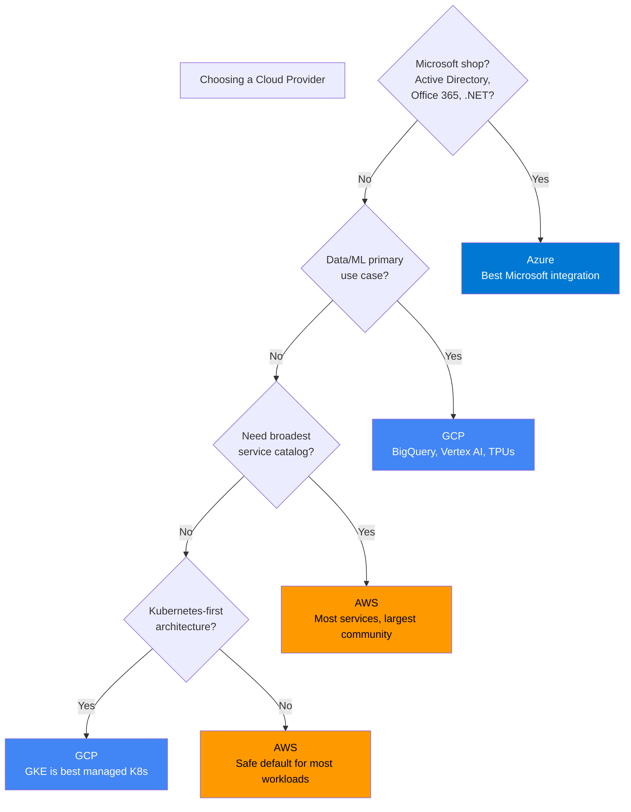

# AWS vs GCP vs Azure Comparison

Choosing a cloud provider is one of the most consequential infrastructure decisions a company makes. Migration is expensive, vendor lock-in is real, and the services across providers are similar but never identical. This page provides a side-by-side comparison of AWS, GCP, and Azure across every major category — not just what they call their services, but where each provider genuinely excels or falls short.

## Market Position

| Criteria | AWS | GCP | Azure |
|----------|-----|-----|-------|
| **Best for** | Broadest service catalog, startups | Data engineering, ML, Kubernetes | Enterprise, hybrid, Microsoft shops |
| **Strengths** | Maturity, ecosystem, documentation | Innovation, pricing simplicity, networking | Active Directory, Office 365 integration |
| **Weaknesses** | Complex pricing, console UX | Smaller ecosystem, enterprise features | Documentation quality, naming confusion |
| **Regions** | 34+ | 40+ | 60+ |

---

## Compute

| Capability | AWS | GCP | Azure |
|-----------|-----|-----|-------|
| **Virtual Machines** | EC2 | Compute Engine | Virtual Machines |
| **Spot/Preemptible** | Spot Instances (up to 90% off) | Spot VMs (60-91% off) | Spot VMs (up to 90% off) |
| **Autoscaling** | Auto Scaling Groups | Managed Instance Groups | VM Scale Sets |
| **Bare Metal** | EC2 Bare Metal | Sole-Tenant Nodes | Dedicated Hosts |
| **GPU Instances** | P5, G5 (NVIDIA A100, H100) | A3 (H100), A2 (A100) | ND (H100), NC (A100) |

### VM Comparison

::: tip GCP Sustained Use Discounts
GCP automatically applies discounts when a VM runs for more than 25% of the month — no commitment required. AWS and Azure require explicit reservations for savings.
:::

---

## Containers and Kubernetes

| Capability | AWS | GCP | Azure |
|-----------|-----|-----|-------|
| **Managed Kubernetes** | EKS | GKE | AKS |
| **Container Service** | ECS (proprietary) | Cloud Run (serverless) | Container Instances |
| **Container Registry** | ECR | Artifact Registry | ACR |
| **Service Mesh** | App Mesh | Anthos Service Mesh (Istio) | Open Service Mesh |
| **Control Plane Cost** | $0.10/hr (~$73/mo) | Free (Standard), $0.10/hr (Enterprise) | Free |

### Kubernetes Comparison

| Feature | EKS | GKE | AKS |
|---------|-----|-----|-----|
| **Setup complexity** | Higher — requires VPC, IAM, add-ons | Lowest — batteries included | Medium |
| **Auto-upgrades** | Optional (managed node groups) | Default (release channels) | Optional |
| **Node autoscaling** | Karpenter or Cluster Autoscaler | Node Auto-provisioning, Autopilot | KEDA, Cluster Autoscaler |
| **Autopilot mode** | No equivalent | GKE Autopilot (Google manages nodes) | No equivalent |
| **Networking** | VPC CNI (AWS native) | VPC-native, Dataplane V2 | Azure CNI, kubenet |
| **Multi-cluster** | Manual or Rancher | Anthos (built-in) | Azure Arc |
| **GPU support** | Good (NVIDIA, Inferentia) | Excellent (TPU access) | Good (NVIDIA) |

::: tip GKE Is the Gold Standard for Kubernetes
GKE was the first managed Kubernetes service (Google invented Kubernetes). It has the best auto-scaling (Autopilot), networking (Dataplane V2), and security posture. If Kubernetes is core to your stack, GKE is the strongest choice.
:::

---

## Serverless

| Capability | AWS | GCP | Azure |
|-----------|-----|-----|-------|
| **Functions** | Lambda | Cloud Functions | Azure Functions |
| **Max runtime** | 15 min | 60 min (2nd gen) | 10 min (Consumption), unlimited (Premium) |
| **Cold start** | 100ms-2s | 100ms-3s | 1-10s |
| **Min memory** | 128 MB | 128 MB | 128 MB |
| **Max memory** | 10 GB | 32 GB | 14 GB |
| **Languages** | Node, Python, Java, Go, .NET, Ruby, Rust (custom) | Node, Python, Java, Go, .NET, Ruby, PHP | Node, Python, Java, C#, PowerShell, TypeScript |
| **Container support** | Yes (up to 10 GB image) | Yes (Cloud Run) | Yes (custom handlers) |
| **Event sources** | 200+ via EventBridge | Eventarc, Pub/Sub | Event Grid, Service Bus |
| **Provisioned concurrency** | Yes | Yes (min instances) | Yes (Premium plan) |

### Serverless Containers

| Feature | AWS Fargate | Cloud Run | Azure Container Apps |
|---------|------------|-----------|---------------------|
| **Model** | Run ECS/EKS tasks without managing servers | Request-driven containers | Kubernetes-based, managed |
| **Scale to zero** | No (minimum 1 task) | Yes | Yes |
| **Max concurrency** | 1 per task | 1000 per instance | Configurable |
| **Pricing** | Per vCPU-second + memory-second | Per request + CPU/memory-second | Per vCPU-second + memory-second |
| **Cold start** | 1-2s | <1s (min instances available) | 1-3s |

---

## Databases

### Relational

| Capability | AWS | GCP | Azure |
|-----------|-----|-----|-------|
| **Managed PostgreSQL/MySQL** | RDS, Aurora | Cloud SQL | Azure Database for PostgreSQL/MySQL |
| **Serverless relational** | Aurora Serverless v2 | AlloyDB (PostgreSQL compatible) | Azure SQL Serverless |
| **Max storage** | 128 TB (Aurora) | 64 TB (Cloud SQL) | 100 TB (Azure SQL) |
| **Read replicas** | 15 (Aurora) | 10 (Cloud SQL) | 4 (Azure SQL) |
| **Multi-region** | Aurora Global Database | Cloud SQL cross-region replicas | Azure SQL Hyperscale geo-replication |
| **Price/performance** | Aurora is fastest | AlloyDB is 2x Cloud SQL | Azure SQL Hyperscale is competitive |

### NoSQL

| Capability | AWS | GCP | Azure |
|-----------|-----|-----|-------|
| **Document/Key-Value** | DynamoDB | Firestore | Cosmos DB |
| **Wide Column** | Keyspaces (Cassandra) | Cloud Bigtable | Cosmos DB (Cassandra API) |
| **In-Memory** | ElastiCache (Redis/Memcached) | Memorystore | Azure Cache for Redis |
| **Graph** | Neptune | No managed option | Cosmos DB (Gremlin API) |
| **Time Series** | Timestream | Cloud Bigtable | Azure Data Explorer |

### Database Comparison Table

| Feature | DynamoDB | Firestore | Cosmos DB |
|---------|----------|-----------|-----------|
| **Data model** | Key-value + document | Document (collections) | Multi-model (document, key-value, graph, column, table) |
| **Consistency** | Eventually or strong (per-item) | Strong | 5 levels (strong to eventual) |
| **Global distribution** | Global Tables | Multi-region | Turnkey global distribution (any region) |
| **Pricing model** | On-demand or provisioned RCU/WCU | Per read/write/delete operation | Per RU/s (request units) |
| **Serverless** | Yes (on-demand mode) | Yes (always serverless) | Yes (serverless mode) |
| **Transactions** | Yes (25 items max) | Yes (500 operations max) | Yes |

::: warning Cosmos DB Multi-Model Is Not Free
Cosmos DB supports multiple APIs (SQL, MongoDB, Cassandra, Gremlin, Table), but you choose one per container. It is not a universal database — it is one engine with multiple wire protocols. Performance characteristics differ from native implementations.
:::

---

## Object Storage

| Feature | S3 | Cloud Storage | Blob Storage |
|---------|----|--------------|----- ---------|
| **Durability** | 99.999999999% (11 9s) | 99.999999999% | 99.999999999% |
| **Availability** | 99.99% (Standard) | 99.95% (Standard) | 99.9% (Hot) |
| **Storage classes** | Standard, IA, One Zone IA, Glacier, Glacier Deep Archive | Standard, Nearline, Coldline, Archive | Hot, Cool, Cold, Archive |
| **Min storage duration** | 30 days (IA), 90/180 days (Glacier) | 30/90/365 days | 30/90/180 days |
| **Max object size** | 5 TB | 5 TB | 190.7 TB (block blob) |
| **Lifecycle policies** | Yes | Yes | Yes |
| **Versioning** | Yes | Yes | Yes |
| **Event notifications** | S3 Events → Lambda/SQS/SNS | Pub/Sub notifications | Event Grid |
| **Price per GB/month** | ~$0.023 (Standard) | ~$0.020 (Standard) | ~$0.018 (Hot) |

### Retrieval Cost Comparison (per GB)

| Tier | S3 | Cloud Storage | Blob Storage |
|------|----|----|-----|
| **Standard** | Free | Free | Free |
| **Infrequent/Nearline** | $0.01 | $0.01 | $0.01 |
| **Archive** | $0.03 (Expedited: $0.30) | $0.05 | $0.02 |

---

## Networking

| Capability | AWS | GCP | Azure |
|-----------|-----|-----|-------|
| **Virtual Network** | VPC | VPC | VNet |
| **Load Balancer** | ALB, NLB, GLB | Cloud Load Balancing | Application Gateway, Azure LB |
| **CDN** | CloudFront | Cloud CDN | Azure CDN / Front Door |
| **DNS** | Route 53 | Cloud DNS | Azure DNS |
| **VPN** | Site-to-Site VPN | Cloud VPN | VPN Gateway |
| **Private connectivity** | Direct Connect | Cloud Interconnect | ExpressRoute |
| **Service Mesh** | App Mesh | Anthos Service Mesh | Open Service Mesh |
| **Global networking** | Global Accelerator | Premium Tier networking | Front Door |

::: tip GCP's Network Advantage
GCP runs on Google's private global network — the same one that serves Google Search, YouTube, and Gmail. Traffic between GCP regions stays on Google's backbone, never touching the public internet. This gives GCP a measurable latency advantage for multi-region architectures.
:::

---

## ML and AI Services

| Capability | AWS | GCP | Azure |
|-----------|-----|-----|-------|
| **ML Platform** | SageMaker | Vertex AI | Azure ML |
| **Pre-trained APIs** | Rekognition, Comprehend, Translate | Vision AI, Natural Language, Translation | Cognitive Services |
| **LLM Access** | Bedrock (Claude, Llama, etc.) | Vertex AI (Gemini, Claude, etc.) | Azure OpenAI (GPT-4, etc.) |
| **Custom training** | SageMaker Training | Vertex AI Training | Azure ML Compute |
| **AutoML** | SageMaker Autopilot | Vertex AI AutoML | Azure AutoML |
| **TPU Access** | No | Yes (Google TPUs) | No |
| **Inference** | SageMaker Endpoints, Inferentia | Vertex AI Endpoints | Azure ML Endpoints |
| **Data labeling** | SageMaker Ground Truth | Vertex AI Data Labeling | Azure ML Data Labeling |

---

## Data and Analytics

| Capability | AWS | GCP | Azure |
|-----------|-----|-----|-------|
| **Data Warehouse** | Redshift | BigQuery | Synapse Analytics |
| **Data Lake** | S3 + Lake Formation | Cloud Storage + BigLake | Data Lake Storage Gen2 |
| **Streaming** | Kinesis | Dataflow (Apache Beam) | Event Hubs + Stream Analytics |
| **ETL/ELT** | Glue | Dataflow, Dataproc | Data Factory |
| **Message Queue** | SQS | Cloud Tasks | Azure Queue Storage |
| **Pub/Sub** | SNS, EventBridge | Pub/Sub | Service Bus, Event Grid |
| **Workflow orchestration** | Step Functions | Workflows, Cloud Composer | Logic Apps, Durable Functions |

::: tip BigQuery Is a Standout Product
BigQuery's architecture (separation of compute and storage, serverless, SQL interface, built-in ML) makes it significantly easier to use than Redshift or Synapse for ad-hoc analytics. If data analytics is a primary use case, GCP has a strong advantage.
:::

---

## Pricing Comparison

### Pricing Models

| Model | AWS | GCP | Azure |
|-------|-----|-----|-------|
| **On-demand** | Per-second (most), per-hour (some) | Per-second | Per-second (most), per-minute (some) |
| **Committed** | Reserved Instances (1yr/3yr), Savings Plans | Committed Use Discounts (1yr/3yr) | Reserved Instances (1yr/3yr) |
| **Spot/Preemptible** | Up to 90% off (can be reclaimed) | Up to 91% off (24hr max) | Up to 90% off |
| **Free tier** | 12 months + always free | Always free + 90-day trial ($300) | 12 months + always free + $200 credit |
| **Sustained use** | No auto-discount | Auto-discount after 25% monthly usage | No auto-discount |

### Free Tier Comparison

| Service | AWS Free Tier | GCP Free Tier | Azure Free Tier |
|---------|--------------|---------------|-----------------|
| **Compute** | 750 hrs/mo t2.micro (12 mo) | 1 e2-micro (always free) | 750 hrs/mo B1s (12 mo) |
| **Functions** | 1M invocations/mo (always free) | 2M invocations/mo (always free) | 1M invocations/mo (always free) |
| **Storage** | 5 GB S3 (12 mo) | 5 GB Cloud Storage (always free) | 5 GB Blob (12 mo) |
| **Database** | 25 GB DynamoDB (always free) | 1 GB Firestore (always free) | 250 GB SQL (12 mo) |
| **CDN** | 1 TB/mo CloudFront (12 mo) | No free tier | No free CDN |

### Cost Optimization Tips

| Strategy | Description |
|----------|-------------|
| **Right-sizing** | Use cloud provider tools (AWS Compute Optimizer, GCP Recommender) to downsize over-provisioned instances |
| **Spot instances** | Use for batch jobs, CI/CD, stateless workers — up to 90% savings |
| **Reserved capacity** | Commit for 1-3 years on stable workloads — 40-60% savings |
| **Auto-scaling** | Scale down during off-peak hours |
| **Storage tiering** | Move infrequently accessed data to cheaper tiers automatically |
| **Egress optimization** | Use CDNs, keep data in-region, use private endpoints |
| **FinOps tooling** | Implement tagging, budgets, anomaly detection |

---

## Decision Framework

::: tip Multi-Cloud Is Usually a Mistake
Multi-cloud "for avoiding vendor lock-in" doubles operational complexity, training burden, and networking costs. Most companies should pick one primary provider and use a second only for specific best-of-breed services (e.g., AWS primary + BigQuery for analytics). True multi-cloud only makes sense for very large organizations with regulatory requirements.
:::

---

## Related Pages

- [AWS](/infrastructure/aws/) — Deep dive into AWS services
- [GCP](/infrastructure/gcp/) — Google Cloud Platform guide
- [Terraform](/infrastructure/terraform/) — Infrastructure as Code across providers
- [Kubernetes](/infrastructure/kubernetes/) — Container orchestration
- [FinOps](/infrastructure/finops/) — Cloud cost optimization
