# Cloudflare Complete Guide

Cloudflare sits between your users and your origin server. That single sentence explains roughly 80% of what Cloudflare does. By acting as a reverse proxy for your traffic, Cloudflare can cache content, block attacks, accelerate delivery, manage DNS, terminate TLS, and enforce access policies — all before a request ever reaches your infrastructure.

What started in 2009 as a security and performance service has evolved into a full developer platform. Cloudflare now operates 310+ data centers across 120+ countries, handling over 20% of all internet traffic. Understanding how to configure it properly is not optional if you run anything on the public internet.

This guide covers everything *except* the Workers runtime and its storage primitives in detail. For the deep dive on V8 isolates, KV, Durable Objects, D1, R2, Queues, and building applications on Workers, see the dedicated [Cloudflare Workers](/performance/edge-computing/cloudflare-workers) page.

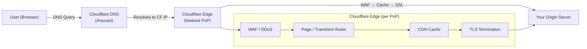

## DNS & Domain Setup

### How Cloudflare DNS Works

Cloudflare operates an **authoritative DNS** service. When you move your domain to Cloudflare, you change your domain registrar's nameservers to point at Cloudflare's nameservers (e.g., `ada.ns.cloudflare.com`, `bob.ns.cloudflare.com`). From that point, Cloudflare answers every DNS query for your domain.

Cloudflare's DNS runs on an **anycast network**. Every one of their 310+ data centers announces the same IP addresses via BGP, so DNS queries are automatically routed to the nearest data center by the internet's routing infrastructure. This gives you:

- **Low latency**: DNS resolution in under 11ms on average globally (independent benchmarks by DNSPerf consistently rank Cloudflare #1 or #2).
- **DDoS resilience**: Attacks against your DNS are absorbed across the entire network — no single point of failure.
- **No propagation delay within Cloudflare**: When you change a record in the dashboard, it is live globally within seconds (external caches like ISP resolvers still respect TTL).

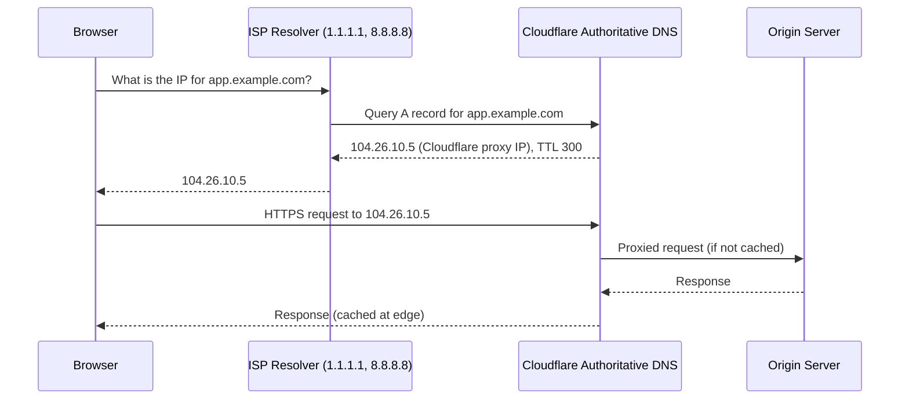

### DNS Record Types in Cloudflare

| Record Type | Purpose | Example | Proxiable? |
|-------------|---------|---------|-----------|
| **A** | Maps domain to IPv4 address | `app.example.com` -> `203.0.113.50` | Yes |
| **AAAA** | Maps domain to IPv6 address | `app.example.com` -> `2001:db8::1` | Yes |
| **CNAME** | Alias to another domain | `www.example.com` -> `example.com` | Yes |
| **MX** | Mail server routing | `example.com` -> `mail.example.com` (priority 10) | No |
| **TXT** | Arbitrary text (SPF, DKIM, verification) | `v=spf1 include:_spf.google.com ~all` | No |
| **SRV** | Service location (port + host) | `_sip._tcp.example.com` -> `sipserver.example.com:5060` | No |
| **NS** | Nameserver delegation (managed by Cloudflare) | Typically not user-editable at root | No |
| **CAA** | Certificate Authority Authorization | `0 issue "letsencrypt.org"` | No |
| **PTR** | Reverse DNS (rare — most providers manage this) | `50.113.0.203.in-addr.arpa` -> `app.example.com` | No |

**CNAME flattening**: Cloudflare automatically flattens CNAME records at the zone apex. The DNS spec technically disallows CNAME at root (`example.com`), but Cloudflare resolves the CNAME chain and returns the A/AAAA record instead. This means you can point `example.com` at a load balancer hostname like `lb.provider.com` without violating RFC 1034.

### Proxied vs DNS-Only (Orange Cloud vs Grey Cloud)

This is the single most important Cloudflare DNS concept:

| | Proxied (Orange Cloud) | DNS-Only (Grey Cloud) |
|---|---|---|
| **Icon** | Orange cloud | Grey cloud |
| **DNS response** | Returns Cloudflare IP | Returns your origin IP |
| **Traffic flows through** | Cloudflare edge | Directly to origin |
| **CDN caching** | Yes | No |
| **WAF / DDoS protection** | Yes | No |
| **SSL termination** | Cloudflare handles it | You handle it |
| **Origin IP hidden** | Yes | No — publicly exposed |
| **Use for** | Web traffic (HTTP/HTTPS) | Mail servers, FTP, SSH, non-HTTP |

::: danger Origin IP Exposure
If you proxy your main domain but leave a subdomain (like `mail.example.com` or `direct.example.com`) as DNS-only pointing to the same IP, attackers can discover your origin IP. They bypass Cloudflare entirely and attack your server directly. **Audit all your DNS records.** Any grey-cloud record pointing to the same IP as a proxied record is a leak.
:::

```bash
# Check if your origin IP is exposed
# This should return Cloudflare IPs, not your origin
dig +short example.com
# 104.26.10.5  (Cloudflare IP — good)

# Check a DNS-only subdomain
dig +short mail.example.com
# 203.0.113.50  (Your origin IP — make sure this isn't the same as your web server)
```

### DNSSEC Setup

DNSSEC adds cryptographic signatures to DNS responses, preventing attackers from forging DNS replies (DNS spoofing / cache poisoning). Cloudflare makes this a one-click enablement:

1. **In Cloudflare Dashboard**: Go to DNS > Settings > Enable DNSSEC.
2. **At your registrar**: Add the DS (Delegation Signer) record that Cloudflare provides. This looks like:
   ```
   example.com. 3600 IN DS 2371 13 2 abcdef1234567890...
   ```
3. **Verify**: Use `dig` to confirm:
   ```bash
   dig +dnssec example.com
   # Look for RRSIG records in the response — that confirms DNSSEC is active
   ```

Cloudflare handles all the key rotation and signing automatically. You never manage ZSK/KSK keys directly.

### DNS Analytics and Query Optimization

Cloudflare's DNS analytics (available on all plans) show:

- **Query volume** by record type, response code, and data center
- **NXDOMAIN responses** (queries for records that do not exist — often indicates misconfiguration or probing)
- **Query latency** (median and p99 response times)

Optimization strategies:

- **Low TTLs are fine on Cloudflare**: Because Cloudflare's DNS is fast (sub-11ms), you can safely use TTLs as low as 60 seconds for records that change frequently. The "set TTL to 86400 for performance" advice from the 2000s does not apply here.
- **Use Auto TTL**: Cloudflare's default "Auto" TTL (300 seconds) is a good default for most records.
- **Wildcard records**: Use `*.example.com` to catch all subdomains. Combine with a proxied record to protect all subdomains through Cloudflare's edge.

---

## CDN & Caching

### How Cloudflare's CDN Works

Cloudflare's CDN does not use a traditional pull-through cache hierarchy with dedicated origin shield servers (like AWS CloudFront or Akamai). Instead, every Cloudflare PoP (Point of Presence) acts as both an edge cache and a potential shield.

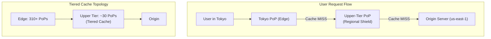

**Tiered Cache** (formerly Argo Tiered Cache) reduces origin requests by adding a layer between edge PoPs and your origin. Instead of 310 PoPs each independently requesting content from your origin on a cache miss, they first check a regional upper-tier PoP. This dramatically improves cache hit ratio for long-tail content.

**What Cloudflare caches by default**:

Cloudflare only caches static files with known extensions by default:

```
.js .css .png .jpg .jpeg .gif .ico .svg .woff .woff2 .ttf .eot
.mp4 .webm .mp3 .ogg .pdf .zip .gz .tar .rar
```

HTML pages, API responses, and any content with `Set-Cookie` headers are **not cached** by default. You must explicitly configure caching for these.

### Cache Rules

Cache Rules (the modern replacement for Page Rules cache settings) give you fine-grained control:

```
# Example: Cache everything on /blog/* for 1 hour at edge, 1 day in browser
# Cloudflare Dashboard: Rules > Cache Rules > Create Rule

Expression: (http.request.uri.path matches "/blog/*")
Then:
  Cache eligibility: Eligible for cache
  Edge TTL: 3600 (1 hour)
  Browser TTL: 86400 (1 day)
  Cache Key: Include query string
```

**Custom Cache Keys** control what makes a cached object "unique":

```
# Default cache key:
# scheme + host + path + query string

# Custom cache key examples:
# 1. Ignore query string (all ?utm_* params hit same cache)
Cache Key: Ignore query string

# 2. Cache by device type
Cache Key: Include header "CF-Device-Type"

# 3. Cache by country
Cache Key: Include geo "country"
```

**Cache Everything rule** — this is how you cache HTML:

```
# Cache your marketing site's HTML
Expression: (http.host eq "www.example.com")
Then:
  Cache eligibility: Eligible for cache
  Edge TTL: Override origin, 2 hours
  Respect origin: OFF (ignores Cache-Control: private)
```

::: warning Cache Everything Pitfall
"Cache Everything" literally caches everything, including pages with `Set-Cookie` headers. If your origin sets session cookies, you can accidentally cache one user's session and serve it to another. **Always exclude authenticated paths** from "Cache Everything" rules or strip `Set-Cookie` from cached responses.
:::

**Bypass Cache** — for authenticated or dynamic content:

```
# Never cache API responses or admin pages
Expression: (http.request.uri.path matches "/api/*") or
            (http.request.uri.path matches "/admin/*") or
            (http.request.uri.path matches "/dashboard/*")
Then:
  Cache eligibility: Bypass cache
```

### Cache-Control Headers vs Cloudflare Cache Rules

There are three layers of TTL that interact:

| Layer | Who sets it | What it controls |
|-------|-------------|-----------------|
| **Origin `Cache-Control`** | Your server | Default behavior at both edge and browser |
| **Edge TTL (Cloudflare)** | Cache Rules | How long Cloudflare caches at edge (overrides origin header) |
| **Browser TTL (Cloudflare)** | Cache Rules | How long the browser caches (overrides origin header) |

Precedence: Cloudflare Cache Rules > Origin Cache-Control headers.

```
# Your origin sends:
Cache-Control: public, max-age=3600, s-maxage=7200

# Without Cloudflare rules:
# Edge caches for 7200s (s-maxage), Browser caches for 3600s (max-age)

# With Cloudflare Edge TTL override set to 86400:
# Edge caches for 86400s, Browser still caches for 3600s (unless Browser TTL also overridden)
```

### Browser TTL vs Edge TTL

| | Edge TTL | Browser TTL |
|---|---|---|
| **Where cache lives** | Cloudflare PoP | User's browser |
| **Purge control** | You can purge via API/dashboard | You cannot purge (must wait for expiry or use versioned URLs) |
| **Recommended for** | Longer (hours to days) | Shorter (minutes to hours) for content that changes |
| **Cost** | Free — Cloudflare serves from edge | Free — browser never makes request |

**Strategy**: Set Edge TTL high (hours/days) and Browser TTL moderate (minutes/hours). You can always purge the edge cache when content changes, but you cannot purge browser caches.

### Cache Purge Strategies

| Method | API Endpoint | Use Case |
|--------|-------------|----------|
| **Purge by URL** | `POST /zones/{zone_id}/purge_cache` with `files: [url]` | Single page update |
| **Purge by tag** | Body: `tags: ["blog-post-123"]` | Content grouped by tag (Enterprise) |
| **Purge by prefix** | Body: `prefixes: ["/blog/"]` | All content under a path (Enterprise) |
| **Purge everything** | Body: `purge_everything: true` | Nuclear option — last resort |

```bash
# Purge a single URL
curl -X POST "https://api.cloudflare.com/client/v4/zones/ZONE_ID/purge_cache" \
  -H "Authorization: Bearer YOUR_API_TOKEN" \
  -H "Content-Type: application/json" \
  --data '{"files":["https://example.com/styles.css","https://example.com/app.js"]}'

# Purge by cache tag (Enterprise only — requires Cache-Tag header from origin)
curl -X POST "https://api.cloudflare.com/client/v4/zones/ZONE_ID/purge_cache" \
  -H "Authorization: Bearer YOUR_API_TOKEN" \
  -H "Content-Type: application/json" \
  --data '{"tags":["blog-post-123","author-jane"]}'

# Purge everything (be careful — causes origin stampede)
curl -X POST "https://api.cloudflare.com/client/v4/zones/ZONE_ID/purge_cache" \
  -H "Authorization: Bearer YOUR_API_TOKEN" \
  -H "Content-Type: application/json" \
  --data '{"purge_everything":true}'
```

::: danger Purge Everything in Production
Purging everything at once causes every edge PoP to re-fetch content from your origin on the next request. For high-traffic sites, this creates a thundering herd / origin stampede. Instead, purge by URL or tag. If you must purge everything, do it during low-traffic windows and make sure your origin can handle the sudden load spike.
:::

### Static Asset Optimization

Cloudflare provides several optimization features (availability varies by plan):

| Feature | What It Does | Plan |
|---------|-------------|------|
| **Auto Minify** | Minifies HTML, CSS, JS on the fly | Free |
| **Brotli** | Brotli compression for responses | Free |
| **Early Hints** | Sends `103 Early Hints` before full response | Free |
| **Polish** | Lossless/lossy image optimization, WebP conversion | Pro+ |
| **Mirage** | Lazy-loads images, resizes for mobile | Pro+ |
| **Rocket Loader** | Defers JS loading to improve paint times | Free |
| **HTTP/2 Push** | Server Push for critical assets | Deprecated — use Early Hints |
| **Image Resizing** | On-the-fly image transforms via URL params | Business+ |

```
# Polish: Convert images to WebP automatically
# Origin serves:  photo.jpg (500KB JPEG)
# Cloudflare serves: photo.jpg (120KB WebP to supported browsers)
# No code changes needed — just enable Polish in dashboard

# Image Resizing (Business+ plans):
# https://example.com/cdn-cgi/image/width=400,quality=80/photos/hero.jpg
```

::: warning Auto Minify and Rocket Loader Caveats
**Auto Minify** can break JS/CSS that relies on whitespace or specific formatting (rare but possible). **Rocket Loader** defers *all* JS execution, which breaks inline scripts that DOM elements depend on immediately (e.g., Google Tag Manager, some analytics snippets). Test thoroughly before enabling in production. If you see broken analytics or flickering UI, Rocket Loader is usually the culprit.
:::

---

## Security — WAF & DDoS

### Web Application Firewall (WAF)

Cloudflare's WAF inspects every HTTP request that passes through the proxy and can block, challenge, or log based on rules. There are three types of WAF rules:

#### Managed Rulesets

Pre-configured rules maintained by Cloudflare's security team:

| Ruleset | What It Covers | Default Action |
|---------|---------------|----------------|
| **Cloudflare Managed Ruleset** | Known attack patterns, zero-day mitigations | Block / Managed Challenge |
| **OWASP Core Ruleset** | Generic attack detection (SQLi, XSS, RCE, LFI, etc.) | Score-based (block if score > threshold) |
| **Cloudflare Leaked Credentials** | Checks for known compromised credential pairs | Log (you decide action) |
| **Cloudflare Sensitive Data Detection** | Detects outbound sensitive data (SSNs, credit cards) | Log |

The **OWASP Core Ruleset** works on an anomaly scoring model:

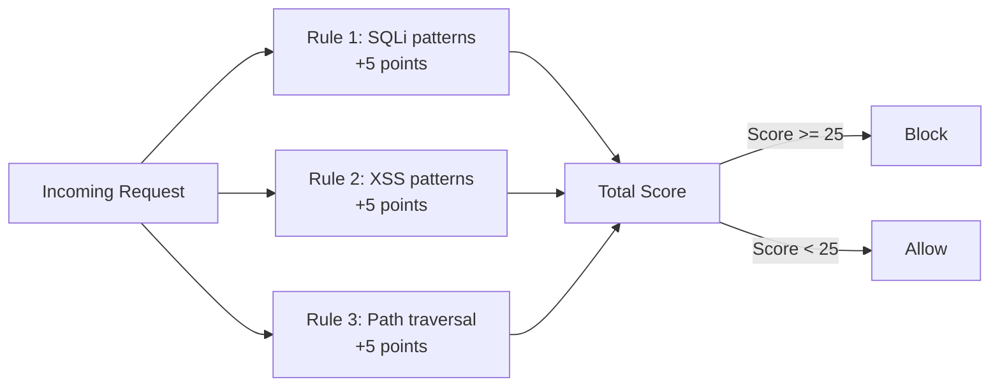

Adjust the OWASP sensitivity:

| Sensitivity | Threshold | Use Case |
|-------------|-----------|----------|
| **High** | Score >= 25 | APIs, applications handling sensitive data |
| **Medium** | Score >= 40 | Most web applications (recommended default) |
| **Low** | Score >= 60 | Legacy apps with unusual request patterns |

#### Custom WAF Rules

Write rules using Cloudflare's wirefilter expression language:

```
# Block requests with SQL injection patterns in query string
(http.request.uri.query contains "UNION SELECT") or
(http.request.uri.query contains "1=1") or
(http.request.uri.query contains "OR 1=1")
Action: Block

# Challenge requests from TOR exit nodes
(ip.src in $cf.anonymizer)
Action: Managed Challenge

# Block requests with suspiciously large POST bodies on login
(http.request.uri.path eq "/api/login") and
(http.request.body.size gt 10000)
Action: Block

# Allow known good bots but challenge everything else on sensitive paths
(http.request.uri.path matches "/admin/*") and
(not cf.bot_management.verified_bot)
Action: Managed Challenge

# Rate-aware rule: block if too many 404s from same IP
(http.request.uri.path matches "/wp-*") and
(not ip.src in {192.168.1.0/24})
Action: Block
```

#### WAF Exceptions

When legitimate traffic triggers a false positive:

```
# Skip specific managed rules for your API endpoint
Expression: (http.request.uri.path matches "/api/webhook/*")
Then: Skip specific rules — [Rule ID: 100015, 100016]

# Skip entire OWASP ruleset for file upload endpoint
Expression: (http.request.uri.path eq "/api/upload")
Then: Skip OWASP Core Ruleset
```

### DDoS Protection

Cloudflare provides always-on DDoS protection across multiple layers:

| Layer | Attack Type | Examples | Cloudflare Response |
|-------|------------|----------|-------------------|
| **L3/L4** | Volumetric / Protocol | SYN floods, UDP amplification, DNS amplification | Automatically absorbed by anycast network |
| **L7** | Application | HTTP floods, slowloris, cache-busting attacks | Behavioral analysis + challenge pages |

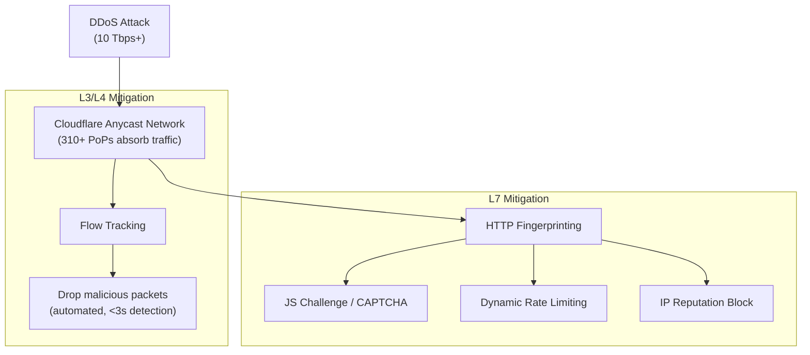

**L3/L4 DDoS protection** is automatic and unmetered on all plans, including Free. Cloudflare has mitigated attacks exceeding 71 million requests per second (February 2023) and volumetric attacks over 2 Tbps. You do not configure this — it is always on.

**L7 DDoS protection** uses Cloudflare's HTTP DDoS Attack Protection managed ruleset. You can tune sensitivity and action:

```
# HTTP DDoS Attack Protection overrides
Rule: HTTP Requests Flood
Sensitivity: Medium (default)
Action: Managed Challenge (default)

# For APIs that receive legitimately high traffic:
Rule: HTTP Requests from Same Source — High
Sensitivity: Low
Action: Log (observe before blocking)
```

### Bot Management

| Feature | What It Does | Plan |
|---------|-------------|------|
| **Bot Fight Mode** | Basic bot detection, serves compute-heavy JS challenge | Free |
| **Super Bot Fight Mode** | Configurable actions per bot type (definitely automated, likely automated, verified bot) | Pro+ |
| **Bot Management** | ML-based scoring (1-99), JS fingerprinting, behavioral analysis | Enterprise |
| **Turnstile** | Privacy-preserving CAPTCHA replacement (free for all) | Free (standalone) |

```html
<!-- Turnstile integration (free CAPTCHA alternative) -->
<script src="https://challenges.cloudflare.com/turnstile/v0/api.js" async defer></script>

<form action="/api/login" method="POST">
  <input type="email" name="email" required />
  <input type="password" name="password" required />

  <!-- Turnstile widget -->
  <div class="cf-turnstile" data-sitekey="0x4AAAAAAXXXXXXXXXXXXXXXXX"></div>

  <button type="submit">Login</button>
</form>
```

Server-side validation:

```javascript
// Validate Turnstile token server-side
async function validateTurnstile(token, remoteip) {
  const response = await fetch(
    'https://challenges.cloudflare.com/turnstile/v0/siteverify',
    {
      method: 'POST',
      headers: { 'Content-Type': 'application/x-www-form-urlencoded' },
      body: new URLSearchParams({
        secret: process.env.TURNSTILE_SECRET_KEY,
        response: token,
        remoteip, // optional
      }),
    }
  );

  const data = await response.json();
  // data.success === true means human
  // data['error-codes'] contains failure reasons
  return data.success;
}

// In your login handler:
app.post('/api/login', async (req, res) => {
  const turnstileToken = req.body['cf-turnstile-response'];

  if (!await validateTurnstile(turnstileToken, req.ip)) {
    return res.status(403).json({ error: 'Bot detected' });
  }

  // Proceed with authentication...
});
```

### Rate Limiting Rules

Rate Limiting rules are configured in the WAF section and use the same expression language:

```
# Rate limit login attempts: 5 requests per 10 seconds per IP
Expression: (http.request.uri.path eq "/api/login") and
            (http.request.method eq "POST")
Rate: 5 requests per 10 seconds
Counting: Per IP
Mitigation timeout: 60 seconds
Action: Block

# Rate limit API endpoints: 100 requests per minute per API key
Expression: (http.request.uri.path matches "/api/v1/*")
Rate: 100 requests per 60 seconds
Counting: Per header value (X-API-Key)
Mitigation timeout: 120 seconds
Action: Block with custom response (429 JSON body)

# Protect search from abuse: 10 requests per minute
Expression: (http.request.uri.path eq "/api/search")
Rate: 10 requests per 60 seconds
Counting: Per IP
Action: Managed Challenge
```

::: tip Rate Limiting Strategy
Start with **Log** action to observe patterns before blocking. Many legitimate use cases (monitoring bots, webhooks, CI/CD pipelines) generate traffic that looks like an attack. Use the Firewall Events dashboard to understand your traffic patterns first, then set thresholds at 2-3x your observed legitimate peak.
:::

### IP Access Rules, ASN Blocking, Country Blocking

```
# Block specific IPs
ip.src in {198.51.100.0/24 203.0.113.0/24}
Action: Block

# Block by ASN (entire hosting provider or ISP)
ip.src.asnum in {AS12345 AS67890}
Action: Block

# Country blocking — block traffic from countries you don't serve
ip.geoip.country in {"CN" "RU" "KP"}
Action: Block

# Allow only specific countries (useful for regional services)
not ip.geoip.country in {"US" "CA" "GB" "AU"}
Action: Managed Challenge

# Combine: Block TOR + known bad ASNs except for specific paths
(ip.src in $cf.anonymizer) and
(not http.request.uri.path matches "/public/*")
Action: Block
```

### Firewall Events Analytics

The Security Events dashboard shows:

- **Event timeline**: Blocked/challenged requests over time
- **Top triggered rules**: Which rules fire most often
- **Top source IPs/countries/ASNs**: Where attacks originate
- **Attack patterns**: Request paths, user agents, query strings being used
- **Sampled events**: Full request details (headers, body) for investigation

Use the **Ray ID** (returned in every Cloudflare response as `CF-Ray` header) to look up any specific request in the events log:

```bash
# Every Cloudflare response includes:
CF-Ray: 7f1234567890abcd-SJC
# Use this Ray ID in the dashboard to find exactly what happened to that request
```

---

## Page Rules & Transform Rules

### Page Rules (Legacy but Still Useful)

Page Rules are the original Cloudflare rule engine. Each Cloudflare plan gets a limited number (3 on Free, 20 on Pro, 50 on Business). Modern alternatives (Cache Rules, Transform Rules, Redirect Rules) have replaced most use cases, but Page Rules still work and some legacy configs depend on them.

| Setting | What It Does | Modern Alternative |
|---------|-------------|-------------------|
| **Cache Level** | Cache Everything, Bypass, Standard | Cache Rules |
| **Forwarding URL** | 301/302 redirects | Redirect Rules (Bulk Redirects) |
| **Always Use HTTPS** | Force HTTPS on matching URL | Configuration Rules or global setting |
| **SSL** | Set SSL mode per URL | Configuration Rules |
| **Security Level** | Adjust WAF sensitivity per URL | Configuration Rules |
| **Browser Cache TTL** | Override browser cache per URL | Cache Rules |
| **Disable Apps/Performance** | Turn off Rocket Loader etc. per URL | Configuration Rules |

```
# Example Page Rule: Cache everything on static subdomain
URL: static.example.com/*
Settings:
  Cache Level: Cache Everything
  Edge Cache TTL: 1 month
  Browser Cache TTL: 1 year

# Example Page Rule: Redirect www to naked domain
URL: www.example.com/*
Settings:
  Forwarding URL (301): https://example.com/$1
```

::: warning Page Rules Limits
Page Rules are matched top-to-bottom, first match wins. Only one Page Rule triggers per request. With only 3 rules on the Free plan, use them sparingly. **Migrate to the modern rules engine** (Cache Rules, Transform Rules, Redirect Rules) which have much higher limits and more flexibility.
:::

### Transform Rules

Transform Rules modify requests and responses as they pass through Cloudflare, without changing the actual origin request routing.

#### URL Rewrite Rules

Modify the URL that reaches your origin (the user's browser still sees the original URL):

```
# Rewrite /old-blog/* to /blog/* at the origin
Expression: (http.request.uri.path matches "^/old-blog/(.*)")
Rewrite to:
  Path: regex_replace(http.request.uri.path, "^/old-blog/", "/blog/")
  Query: preserve

# Add language prefix based on geo
Expression: (ip.geoip.country eq "FR") and
            (not http.request.uri.path matches "^/fr/")
Rewrite to:
  Path: concat("/fr", http.request.uri.path)

# Normalize API versioning
Expression: (http.request.uri.path matches "^/api/v[0-9]+/(.*)")
Rewrite to:
  Path: regex_replace(http.request.uri.path, "^/api/v[0-9]+/", "/api/current/")
```

#### HTTP Request Header Modification

Add, remove, or modify request headers before they reach your origin:

```
# Add a custom header for origin identification
Set static header:
  X-Forwarded-By: cloudflare
  X-Real-Country: ip.geoip.country   (dynamic value)
  X-Request-ID: cf.ray_id            (dynamic value)

# Remove headers your origin doesn't need
Remove headers:
  X-Powered-By
  Server

# Modify Host header (for multi-tenant origins)
Expression: (http.host eq "tenant1.example.com")
Set header:
  Host: app.internal.example.com
  X-Tenant-ID: tenant1
```

#### HTTP Response Header Modification

Modify response headers before they reach the user:

```
# Add security headers
Set static headers:
  X-Content-Type-Options: nosniff
  X-Frame-Options: DENY
  Referrer-Policy: strict-origin-when-cross-origin
  Permissions-Policy: camera=(), microphone=(), geolocation=()

# Remove server identification headers
Remove headers:
  Server
  X-Powered-By
  X-AspNet-Version

# Add custom cache debug header
Set dynamic header:
  X-Cache-Status: http.response.headers["cf-cache-status"]
```

#### Managed Transforms

One-click transforms Cloudflare maintains for you:

- **Add visitor location headers**: Adds `CF-IPCountry`, `CF-IPCity`, `CF-IPContinent`, etc.
- **Add bot management headers**: Adds `CF-Bot-Score`, `CF-Verified-Bot`, etc.
- **Add "True-Client-IP" header**: Passes the real client IP in `True-Client-IP` header.
- **Remove visitor IP headers**: Strips `X-Forwarded-For` for privacy.
- **Add Security Headers**: Adds HSTS, X-Content-Type-Options, etc.

### Redirect Rules

Redirect Rules replace Page Rule forwarding with a more powerful, higher-limit system:

#### Single Redirects

```
# 301 redirect: www to apex
Expression: (http.host eq "www.example.com")
Redirect to:
  URL: concat("https://example.com", http.request.uri.path)
  Status: 301
  Preserve query string: Yes

# 302 redirect: maintenance page
Expression: (http.request.uri.path ne "/maintenance") and
            (http.host eq "example.com")
Redirect to:
  URL: https://example.com/maintenance
  Status: 302
```

#### Bulk Redirects

For large-scale redirections (domain migrations, URL restructuring), Bulk Redirects handle thousands of entries efficiently:

```json
// Bulk Redirect list (upload via API or dashboard)
{
  "redirects": [
    {
      "source_url": "https://old.example.com/page1",
      "target_url": "https://new.example.com/pages/page1",
      "status_code": 301
    },
    {
      "source_url": "https://old.example.com/page2",
      "target_url": "https://new.example.com/pages/page2",
      "status_code": 301
    }
    // ... thousands more
  ]
}
```

### Configuration Rules

Override zone-level settings for specific URLs:

```
# Disable Rocket Loader on admin pages (where it breaks things)
Expression: (http.request.uri.path matches "/admin/*")
Then:
  Rocket Loader: Off
  Auto Minify: Off
  Email Obfuscation: Off

# Increase security level for sensitive pages
Expression: (http.request.uri.path matches "/api/payment/*")
Then:
  Security Level: High
  Browser Integrity Check: On
```

### Origin Rules

Override which origin server receives the request:

```
# Route API traffic to a different origin
Expression: (http.request.uri.path matches "/api/*")
Then:
  Override origin host: api-backend.internal.example.com
  Override origin port: 8443

# Route by geographic region
Expression: (ip.geoip.continent eq "EU")
Then:
  Override origin host: eu-origin.example.com

# Override DNS resolution for a specific path
Expression: (http.request.uri.path matches "/legacy/*")
Then:
  Override origin host: legacy-server.example.com
  Override origin port: 3000
```

---

## SSL/TLS

### SSL Modes

Cloudflare offers four SSL modes. Choosing the wrong one is the #1 source of redirect loops and security vulnerabilities:

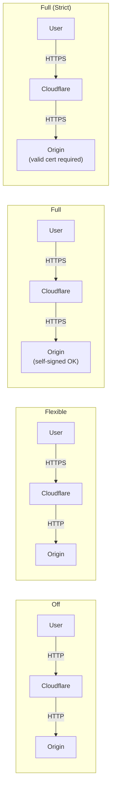

| Mode | User -> CF | CF -> Origin | Origin Cert Required? | Security | Use Case |
|------|-----------|-------------|----------------------|----------|----------|
| **Off** | HTTP | HTTP | No | None | Never use this |
| **Flexible** | HTTPS | HTTP | No | Partial | Origin cannot support TLS (legacy systems) |
| **Full** | HTTPS | HTTPS | Self-signed OK | Good | Quick setup, self-signed origin cert |
| **Full (Strict)** | HTTPS | HTTPS | Valid CA cert or Cloudflare Origin CA | Best | **Always use this in production** |

::: danger Flexible SSL is Dangerous
Flexible SSL encrypts traffic between the user and Cloudflare, but sends it unencrypted between Cloudflare and your origin. This means anyone on the network path between Cloudflare and your server (ISPs, data center operators, other tenants) can read your traffic in plaintext. It also causes infinite redirect loops if your origin forces HTTPS. **Always use Full (Strict).**
:::

::: danger Flexible SSL Redirect Loops
If your origin redirects HTTP to HTTPS, and Cloudflare Flexible mode sends HTTP to your origin, you get:
1. User -> HTTPS -> Cloudflare -> HTTP -> Origin
2. Origin redirects -> HTTPS -> Cloudflare -> HTTP -> Origin
3. Infinite loop. ERR_TOO_MANY_REDIRECTS.

Fix: Set SSL mode to Full (Strict) and install a proper cert on origin.
:::

### Origin Certificates vs Let's Encrypt

| | Cloudflare Origin CA Certificate | Let's Encrypt |
|---|---|---|
| **Issued by** | Cloudflare (not publicly trusted) | ISRG (publicly trusted) |
| **Validity** | Up to 15 years | 90 days |
| **Works with** | Cloudflare proxy only (Full Strict) | Any client directly |
| **Auto-renewal** | Not needed (15-year cert) | Required (certbot, etc.) |
| **Cost** | Free | Free |
| **Best for** | Origins always behind Cloudflare | Origins that may serve traffic directly |

```bash
# Generate a Cloudflare Origin Certificate:
# Dashboard: SSL/TLS > Origin Server > Create Certificate

# Install on your origin (Nginx example):
# /etc/nginx/ssl/cloudflare-origin.pem   (certificate)
# /etc/nginx/ssl/cloudflare-origin.key   (private key)

server {
    listen 443 ssl;
    server_name example.com;

    ssl_certificate     /etc/nginx/ssl/cloudflare-origin.pem;
    ssl_certificate_key /etc/nginx/ssl/cloudflare-origin.key;

    # Optional: Only accept connections from Cloudflare IPs
    # (see Authenticated Origin Pulls below)
}
```

### Always Use HTTPS, HSTS, Minimum TLS Version

**Always Use HTTPS**: Redirects all HTTP requests to HTTPS at the Cloudflare edge. No origin configuration needed.

```
# Equivalent to adding this to every page:
# 301 redirect http://example.com/* -> https://example.com/*
# Enable in: SSL/TLS > Edge Certificates > Always Use HTTPS
```

**HSTS (HTTP Strict Transport Security)**: Tells browsers to always use HTTPS for your domain, even on first visit (if preloaded):

```
# Cloudflare HSTS settings:
# SSL/TLS > Edge Certificates > HTTP Strict Transport Security

Strict-Transport-Security: max-age=31536000; includeSubDomains; preload

# max-age=31536000  → 1 year (required for preload list)
# includeSubDomains → All subdomains must also support HTTPS
# preload           → Eligible for browser preload list (hstspreload.org)
```

::: danger HSTS Preload is Permanent
Once your domain is on the HSTS preload list (hardcoded into Chrome, Firefox, Safari, Edge), browsers will *never* connect via HTTP. Removing your domain from the preload list takes months. **Do not enable preload** unless you are 100% certain every subdomain supports HTTPS and will continue to do so.
:::

**Minimum TLS Version**: Set the lowest TLS version Cloudflare accepts:

```
# Recommended: TLS 1.2 minimum
# TLS 1.0 and 1.1 are deprecated (RFC 8996, March 2021)
# TLS 1.3 is ideal but some older clients don't support it

# Set in: SSL/TLS > Edge Certificates > Minimum TLS Version
# Recommendation: TLS 1.2 (blocks ~0.1% of very old clients)
```

### Authenticated Origin Pulls

Authenticated Origin Pulls ensure your origin only accepts connections from Cloudflare, not from anyone who discovers your origin IP:

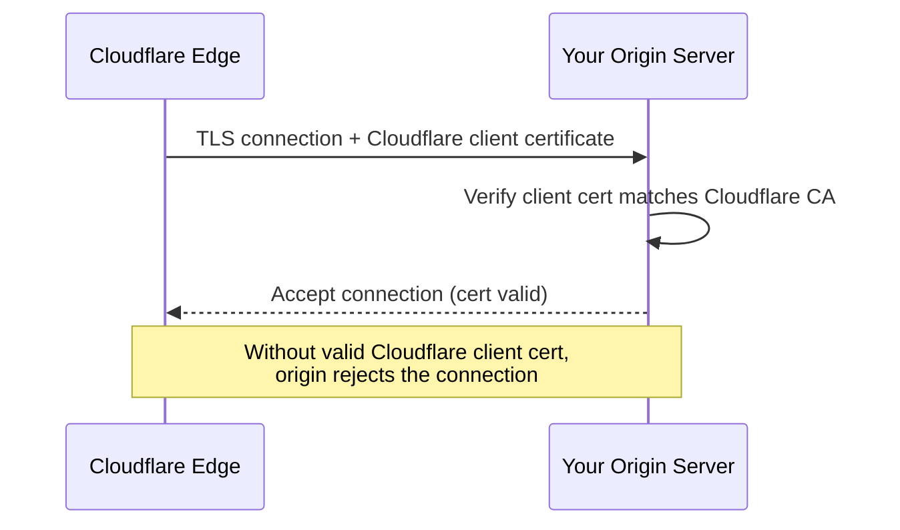

```nginx
# Nginx: Require Cloudflare client certificate
server {
    listen 443 ssl;
    server_name example.com;

    ssl_certificate     /etc/nginx/ssl/cloudflare-origin.pem;
    ssl_certificate_key /etc/nginx/ssl/cloudflare-origin.key;

    # Authenticated Origin Pulls
    ssl_client_certificate /etc/nginx/ssl/cloudflare-origin-pull-ca.pem;
    ssl_verify_client on;

    # If client cert verification fails, Nginx returns 403
}
```

```bash
# Download the Cloudflare Origin Pull CA certificate:
curl -o /etc/nginx/ssl/cloudflare-origin-pull-ca.pem \
  https://developers.cloudflare.com/ssl/static/authenticated_origin_pull_ca.pem
```

### Certificate Pinning Considerations

**Do not pin Cloudflare certificates.** Cloudflare rotates edge certificates periodically and without notice. If you pin a specific certificate or public key in your mobile app or client, it will break when Cloudflare rotates. Instead:

- Use **Certificate Transparency** (CT) logs to monitor for unauthorized certificate issuance.
- Use **CAA records** to restrict which CAs can issue certificates for your domain.
- If you must pin, pin the **Cloudflare CA root** (more stable) rather than the leaf certificate — but understand that even this can change.

```
# CAA record restricting certificate issuance
# Only Cloudflare's CA and Let's Encrypt can issue certs
example.com. CAA 0 issue "comodoca.com"        # Cloudflare uses Sectigo/DigiCert
example.com. CAA 0 issue "digicert.com"
example.com. CAA 0 issue "letsencrypt.org"
example.com. CAA 0 issuewild "comodoca.com"
example.com. CAA 0 issuewild "digicert.com"
```

---

## Cloudflare Platform (Workers Ecosystem)

For the deep dive on V8 isolates, programming patterns, and building full applications on Workers, see the dedicated [Cloudflare Workers](/performance/edge-computing/cloudflare-workers) page. This section provides a decision framework for choosing between Cloudflare's platform services.

### Platform Overview

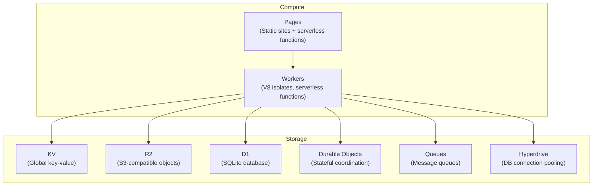

### When to Use Each Storage Option

| Service | Model | Consistency | Best For | Not For |
|---------|-------|------------|----------|---------|
| **KV** | Key-value | Eventually consistent (60s) | Config, feature flags, static JSON, session data | Counters, data that needs immediate consistency |
| **R2** | Object storage (S3 API) | Strong (per-object) | Files, images, backups, large blobs | Frequent small reads, transactional data |
| **D1** | SQLite (serverless) | Strong (per-database) | Relational data, queries with joins, CRUD apps | High-write throughput, multi-region writes |
| **Durable Objects** | Single-instance state | Strong (linearizable) | Real-time collaboration, counters, WebSocket coordination, rate limiters | Large datasets, batch analytics |
| **Queues** | Pull-based message queue | At-least-once delivery | Background jobs, webhook processing, event pipelines | Real-time streaming, sub-second latency |
| **Hyperdrive** | Connection pooler | Depends on backend DB | Connecting Workers to external PostgreSQL/MySQL | Replacing a database — it is just a pooler |

**Decision flowchart**:

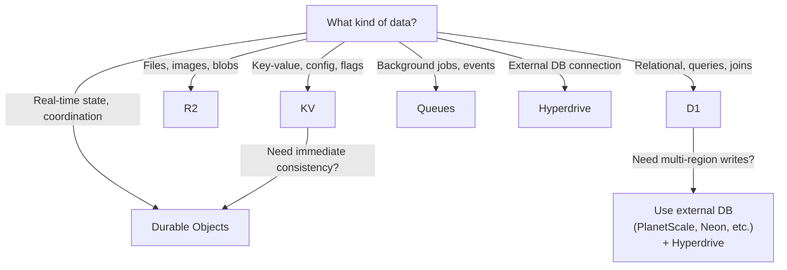

### Cloudflare Pages

Pages is Cloudflare's static site hosting platform with integrated CI/CD:

```yaml
# Example: VitePress site on Cloudflare Pages
# Build configuration (Dashboard or wrangler.toml):
# Framework preset: None (custom)
# Build command: npm run docs:build
# Build output directory: docs/.vitepress/dist
# Root directory: /

# Environment variables:
# NODE_VERSION: 20
```

Key Pages features:

- **Git integration**: Connects to GitHub/GitLab, auto-deploys on push
- **Preview deployments**: Every PR gets a unique preview URL (e.g., `abc123.my-site.pages.dev`)
- **Functions**: Add serverless functions by creating files in `/functions` directory
- **Custom domains**: Attach your own domain with automatic SSL
- **Rollbacks**: Instant rollback to any previous deployment
- **Build caching**: Caches `node_modules` and build artifacts between deploys

```
# Project structure for Pages with Functions:
my-site/
├── public/          # Static assets
├── functions/       # Serverless functions (auto-routed)
│   ├── api/
│   │   ├── hello.ts       # GET /api/hello
│   │   └── users/
│   │       └── [id].ts    # GET /api/users/:id
│   └── _middleware.ts     # Runs before every function
├── src/             # Your framework source
└── package.json
```

::: tip Pages vs Workers Sites
Workers Sites (the older approach using KV for static hosting) is **deprecated in favor of Pages**. Pages has better DX (git integration, preview URLs, build caching), handles more traffic on the free tier, and integrates Functions without a separate Workers project.
:::

---

## Zero Trust & Access

Cloudflare Zero Trust (formerly Cloudflare for Teams) replaces traditional VPNs and perimeter-based security with identity-aware access controls.

### Cloudflare Access (Identity-Aware Proxy)

Access puts an authentication layer in front of any web application — without modifying the application itself:

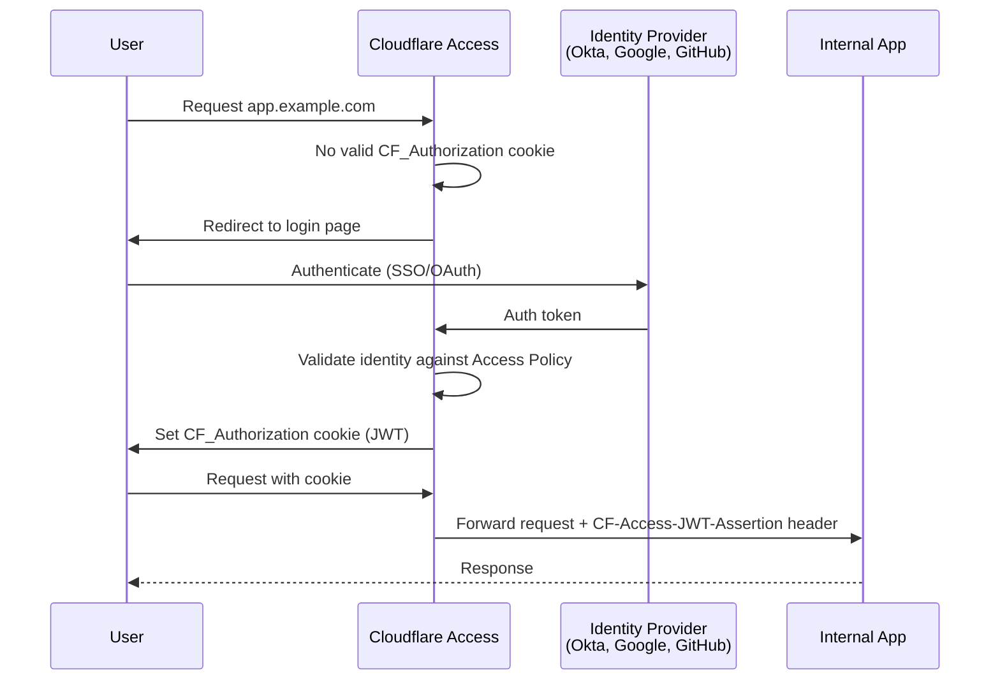

**Access Policy examples**:

```
# Allow only employees with @company.com email
Policy: Allow
Include: Emails ending in @company.com
Require: Login via Okta IdP

# Allow specific GitHub org members
Policy: Allow
Include: GitHub Organization = "my-company"

# Require both email domain AND specific group
Policy: Allow
Include: Emails ending in @company.com
Require: SAML Group = "engineering"

# Service-to-service authentication (no human login)
Policy: Service Auth
Include: Service Token (header-based)
```

### Cloudflare Tunnel (cloudflared)

Tunnel creates an outbound-only encrypted connection from your infrastructure to Cloudflare's edge, eliminating the need to open inbound ports or expose origin IPs:

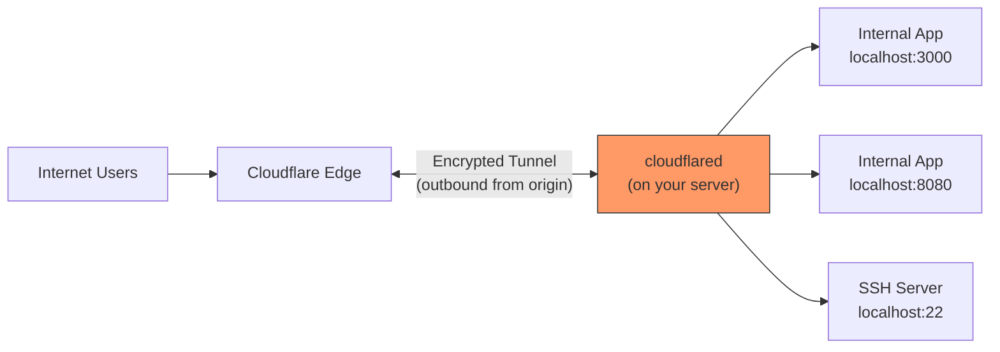

```bash
# Install cloudflared
# macOS
brew install cloudflared

# Linux (Debian/Ubuntu)
curl -L --output cloudflared.deb https://github.com/cloudflare/cloudflared/releases/latest/download/cloudflared-linux-amd64.deb
sudo dpkg -i cloudflared.deb

# Authenticate
cloudflared tunnel login
# Opens browser — select your Cloudflare zone

# Create a tunnel
cloudflared tunnel create my-app-tunnel
# Creates tunnel ID and credentials file

# Configure the tunnel
cat > ~/.cloudflared/config.yml << 'EOF'
tunnel: YOUR_TUNNEL_ID
credentials-file: /home/user/.cloudflared/YOUR_TUNNEL_ID.json

ingress:
  - hostname: app.example.com
    service: http://localhost:3000
  - hostname: api.example.com
    service: http://localhost:8080
  - hostname: ssh.example.com
    service: ssh://localhost:22
  # Catch-all rule (required)
  - service: http_status:404
EOF

# Route DNS to tunnel
cloudflared tunnel route dns my-app-tunnel app.example.com

# Run the tunnel
cloudflared tunnel run my-app-tunnel

# Run as a system service (production)
sudo cloudflared service install
sudo systemctl enable cloudflared
sudo systemctl start cloudflared
```

::: tip Tunnel for Home Labs and Dev
Cloudflare Tunnel is free and is one of the best ways to expose a local development server or home lab to the internet. No port forwarding, no dynamic DNS, no exposing your home IP. `cloudflared tunnel --url http://localhost:3000` gives you a temporary public URL instantly.
:::

### WARP Client

WARP is Cloudflare's device-level agent that routes all device traffic through Cloudflare's network:

| Mode | What It Does | Use Case |
|------|-------------|----------|
| **WARP (consumer)** | Routes all traffic via Cloudflare's 1.1.1.1 DNS + encrypted tunnel | Personal privacy/security |
| **WARP + Gateway** | Routes traffic through your org's Cloudflare Gateway for filtering | Corporate device management |
| **WARP + Access** | Provides device identity for Access policies | Zero Trust device authentication |

WARP connects to the nearest Cloudflare data center via WireGuard (the WARP protocol is based on WireGuard). This gives corporate IT full visibility and control over device traffic without a traditional VPN's bottleneck of routing everything through a single data center.

### Gateway (DNS and HTTP Filtering)

Gateway provides DNS-level and HTTP-level filtering for devices connected via WARP:

```
# DNS filtering policies (Gateway > DNS):

# Block malware domains
Policy: Block
Traffic: DNS queries matching category "Malware"
Action: Block (show block page)

# Block social media during work hours
Policy: Block
Traffic: DNS queries matching category "Social Media"
Schedule: Monday-Friday 9:00-17:00
Action: Block

# Log all DNS queries for security investigation
Policy: Log
Traffic: All DNS queries
Action: Log (no block)
```

```
# HTTP filtering policies (Gateway > HTTP):

# Block file uploads to personal cloud storage
Policy: Block
Traffic: HTTP requests to category "Cloud Storage" with upload method
Action: Block

# Prevent data exfiltration via DNS
Policy: Block
Traffic: DNS queries with TXT record type longer than 100 chars
Action: Block (potential DNS tunneling)

# Isolate risky websites in Browser Isolation
Policy: Isolate
Traffic: HTTP requests matching category "Uncategorized" or security risk score > 50
Action: Isolate
```

### Browser Isolation

Browser Isolation renders web pages in a remote Cloudflare data center and streams only the visual output to the user's browser. The actual page code never executes on the user's device:

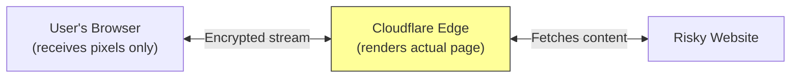

Use cases:
- **Open suspicious links safely**: Phishing emails, unknown URLs
- **Protect against zero-day browser exploits**: Page code runs in Cloudflare's sandbox, not on user devices
- **Data loss prevention**: Disable copy-paste, printing, file downloads from isolated sessions
- **Contractor access**: Give external users access to internal tools without installing anything on their devices

---

## Best Practices

### Performance Optimization Checklist

```
[x] Enable Tiered Cache (reduces origin requests by 30-90%)
[x] Set appropriate Edge TTLs (hours/days for static, minutes for semi-dynamic)
[x] Enable Brotli compression
[x] Enable HTTP/2 and HTTP/3 (QUIC)
[x] Enable Early Hints (103 responses)
[x] Enable 0-RTT Connection Resumption
[x] Configure Cache Rules (don't rely on defaults — cache HTML if safe)
[x] Use Cloudflare Polish for image optimization (Pro+)
[x] Set up custom cache keys to maximize hit ratio
[x] Enable Argo Smart Routing (paid — reduces latency 30%+ for dynamic content)
[x] Minimize origin distance — put origin in a region near most users
[x] Use Cache Reserve for long-tail content (prevents eviction)
[ ] Test Rocket Loader carefully before enabling
[ ] Enable Auto Minify only if you don't already minify at build time
```

### Security Hardening Checklist

```
[x] SSL mode: Full (Strict) — never Flexible
[x] Always Use HTTPS: On
[x] HSTS: max-age=31536000; includeSubDomains
[x] Minimum TLS version: 1.2
[x] Authenticated Origin Pulls: Enabled
[x] WAF Managed Rulesets: Cloudflare + OWASP enabled
[x] Bot Fight Mode: Enabled (or Super Bot Fight Mode on Pro+)
[x] Rate Limiting on auth endpoints (/login, /signup, /reset-password)
[x] Turnstile on all public forms
[x] Firewall rules blocking known-bad patterns
[x] Origin firewall: only accept traffic from Cloudflare IPs
[x] DNSSEC: Enabled
[x] CAA records: Restrict certificate issuance
[x] Audit all DNS records — no grey-cloud records exposing origin IP
[x] Enable notifications for certificate transparency, DDoS, WAF events
[x] Review Security Events dashboard weekly
```

### Cost Optimization Tips

| Strategy | Savings | Details |
|----------|---------|---------|
| **Start on Free plan** | Baseline | Generous free tier: unlimited bandwidth, 3 Page Rules, basic WAF |
| **Cache aggressively** | 30-70% origin cost | Every cached request is one your origin doesn't serve |
| **Use Workers free tier** | 100K req/day free | Good for small projects; $5/mo for 10M requests |
| **R2 over S3** | No egress fees | R2 is S3-compatible but charges $0 for egress |
| **Avoid unnecessary paid features** | Variable | Polish and Mirage are Pro+ ($20/mo) — only worth it for image-heavy sites |
| **Argo Smart Routing** | Must evaluate | $5/mo + $0.10/GB — measure actual latency improvement before committing |
| **Use Bulk Redirects over Page Rules** | Free | Bulk Redirects don't count against your Page Rule limit |
| **Tiered Cache** | Free | Enable it — reduces origin requests at zero cost |
| **Cache Reserve** | $5/mo per zone | Only useful for sites with large amounts of long-tail content |

### Migration Guide (from Other CDN/DNS Providers)

**Step-by-step migration from AWS CloudFront + Route 53 to Cloudflare**:

```
Phase 1: DNS Migration (0 downtime)
1. Add your domain to Cloudflare (free plan)
2. Cloudflare scans your existing DNS records automatically
3. Verify all records are imported correctly
   - Check A, AAAA, CNAME, MX, TXT, SRV records
   - Ensure mail records (MX) are NOT proxied (grey cloud)
4. At your registrar: change nameservers to Cloudflare's
   - Old: ns-xxx.awsdns-xx.org, ns-xxx.awsdns-xx.co.uk
   - New: ada.ns.cloudflare.com, bob.ns.cloudflare.com
5. Wait for propagation (usually 1-24 hours)
6. Verify in Cloudflare dashboard: Status shows "Active"

Phase 2: SSL/TLS Configuration
1. Set SSL mode to Full (Strict)
2. Generate Cloudflare Origin CA certificate
3. Install origin cert on your server
4. Enable Always Use HTTPS
5. Enable HSTS (start with short max-age, increase gradually)

Phase 3: Caching Configuration
1. Audit your current CloudFront cache behaviors
2. Recreate as Cloudflare Cache Rules
3. Map CloudFront TTLs to Edge TTL / Browser TTL
4. Enable Tiered Cache
5. Test cache hit rates (check CF-Cache-Status header)

Phase 4: Security Configuration
1. Enable WAF managed rulesets
2. Set up rate limiting rules
3. Configure bot management
4. Enable DNSSEC
5. Restrict origin to Cloudflare IPs only

Phase 5: Decommission Old CDN
1. Monitor for 1-2 weeks — verify no traffic hitting old CDN
2. Remove CloudFront distribution
3. Cancel Route 53 hosted zone (if no longer needed)
```

**Key differences from other CDNs**:

| Feature | AWS CloudFront | Cloudflare | Key Difference |
|---------|---------------|------------|---------------|
| **DNS** | Route 53 (separate) | Integrated | Cloudflare DNS is part of the proxy setup |
| **Pricing** | Per-request + per-GB egress | Free tier + paid plans | Cloudflare free tier is extremely generous |
| **WAF** | AWS WAF (separate, per-rule pricing) | Included in all plans | No additional WAF cost on Cloudflare |
| **DDoS** | AWS Shield ($3,000/mo for Advanced) | Included, unmetered, all plans | Massive cost difference |
| **Cache invalidation** | 1,000 free/mo, then $0.005 each | Unlimited | No cost for cache purges on Cloudflare |
| **SSL** | ACM (free, but complex) | Automatic (zero config) | Cloudflare handles cert issuance/renewal |
| **Workers** | Lambda@Edge / CloudFront Functions | Workers (more capable) | Workers has better DX and more storage options |

### Common Mistakes and Gotchas

1. **Using Flexible SSL**: Leaves traffic between Cloudflare and origin unencrypted. Always use Full (Strict).

2. **Proxying MX records**: Email servers need to connect directly to your mail server IP. If you proxy (orange cloud) an MX record, email delivery breaks. Keep MX-related records grey cloud.

3. **Exposing origin IP via DNS-only subdomains**: If `direct.example.com` (grey cloud) points to the same IP as `example.com` (orange cloud), your origin IP is trivially discoverable.

4. **Not restricting origin to Cloudflare IPs**: If your origin accepts connections from any IP, attackers who discover your origin IP can bypass all Cloudflare protections. Firewall your origin to only accept connections from [Cloudflare's published IP ranges](https://www.cloudflare.com/ips/).

5. **Cache Everything without excluding authenticated paths**: Caching a response that includes `Set-Cookie: session=abc123` and serving it to other users. Always exclude authenticated paths from aggressive caching.

6. **Enabling Rocket Loader without testing**: Breaks Google Tag Manager, inline scripts, and many third-party widgets. Test in staging first.

7. **Setting HSTS preload prematurely**: Once preloaded, it takes months to remove. Start with `max-age=86400` (1 day), increase gradually.

8. **Ignoring the WAF in log mode**: Enable managed rulesets in "log" mode first, review false positives for a week, then switch to "block." Going straight to block causes outages when legitimate traffic is misclassified.

9. **Using Page Rules for everything**: Page Rules have strict limits (3 on Free). Use the modern rules engine (Cache Rules, Transform Rules, Redirect Rules) which have higher limits and more expressiveness.

10. **Not monitoring Firewall Events**: The Security Events dashboard tells you what Cloudflare is blocking. If you never look at it, you will not know when legitimate traffic is being blocked or when real attacks are happening.

---

## When NOT to Use Cloudflare

Cloudflare is excellent for most web traffic, but it is not the right choice in every scenario:

- **Non-HTTP/HTTPS protocols**: Cloudflare's proxy only handles HTTP/HTTPS (and WebSocket) traffic on standard ports. If you need to proxy raw TCP, UDP, or custom protocols, you need Cloudflare Spectrum (Enterprise) or a different solution.

- **Strict data residency requirements**: Cloudflare's anycast network routes traffic to the nearest PoP. If regulations require that traffic never leaves a specific country, Cloudflare's Data Localization Suite (Enterprise only) can help, but it is expensive and complex.

- **Latency-sensitive real-time applications**: For applications requiring sub-10ms latency (high-frequency trading, real-time gaming), adding Cloudflare as a middleman adds a network hop. Direct connections to your origin or a specialized provider may be better.

- **Large file distribution at scale**: While Cloudflare does not charge for bandwidth, they may throttle or contact you if you use the Free plan primarily as a file distribution CDN (e.g., serving terabytes of video). For this use case, R2 or a dedicated CDN (BunnyCDN, Backblaze + Cloudflare) is more appropriate.

- **When you need origin shield guarantees**: Cloudflare's Tiered Cache approximates origin shield behavior, but it does not guarantee that only one PoP contacts your origin. For strict origin shield requirements, traditional CDNs (CloudFront, Fastly) offer more deterministic behavior.

---

::: tip Key Takeaway
- Cloudflare acts as a reverse proxy between users and your origin, providing DNS, CDN, WAF, DDoS protection, and SSL termination in a single service that starts at $0/month.
- **Full (Strict) SSL mode + Authenticated Origin Pulls + origin IP firewall** is the trifecta for secure origin communication. Anything less leaves attack surface exposed.
- The modern rules engine (Cache Rules, Transform Rules, Redirect Rules, Configuration Rules, Origin Rules) replaces the limited Page Rules system — use it for new configurations.
:::

::: warning Common Misconceptions

**"Cloudflare's free plan isn't good enough for production."**
False. The free plan includes unlimited bandwidth, DDoS protection, basic WAF, SSL, and CDN. Many production sites with millions of monthly visitors run on the free plan. You pay for advanced features (image optimization, advanced bot management, priority support), not for core functionality.

**"Flexible SSL is fine because traffic is encrypted to Cloudflare."**
The connection between Cloudflare and your origin is unencrypted with Flexible SSL. If your application handles any sensitive data (logins, personal info, payments), this is a security vulnerability. Full (Strict) is the only acceptable production mode.

**"Proxied records hide my origin IP completely."**
Only if *all* records pointing to that IP are proxied. A single grey-cloud DNS record pointing to the same IP exposes it. Also, historical DNS records, email headers (if mail server shares the IP), and SSL certificate transparency logs can all leak your origin IP.

**"Cloudflare slows down my site because it adds a network hop."**
For cached content, Cloudflare is dramatically faster because it serves from the nearest PoP. For dynamic content, the added hop is typically 1-5ms for nearby PoPs. Argo Smart Routing further reduces latency for dynamic content by finding the fastest path across Cloudflare's backbone.

**"I don't need to firewall my origin if I use Cloudflare."**
Cloudflare is a proxy, not a magic shield. If attackers find your origin IP (and they will try), they bypass Cloudflare entirely. Your origin firewall must only accept connections from [Cloudflare's IP ranges](https://www.cloudflare.com/ips/) — this is not optional.

**"Cache purge is instant and free, so I can purge on every deploy."**
Purging is fast (seconds) and free (unlimited), but purging everything causes an origin stampede as every PoP re-fetches content. For deploys, use versioned filenames (e.g., `app.v2.js`) instead of purging `app.js`.
:::

---

::: tip In Production

**Discord** runs its marketing site and blog through Cloudflare, leveraging the CDN and WAF. Their API infrastructure uses Cloudflare for DDoS protection handling billions of requests daily.

**Shopify** uses Cloudflare to protect millions of merchant storefronts. Cloudflare absorbs DDoS attacks targeting individual stores without affecting the platform.

**Canva** migrated to Cloudflare Workers and R2 for serving design assets, eliminating S3 egress costs while improving global delivery performance.

**Notion** uses Cloudflare to cache and accelerate their web app globally, with custom WAF rules protecting their API from abuse.

**The majority of the internet** passes through Cloudflare in some form — W3Techs reports Cloudflare as the most widely used CDN, powering over 20% of all websites as of 2025.
:::

---

::: details Quiz

**1. What SSL mode should you always use in production?**

**Full (Strict)**. It encrypts traffic between users and Cloudflare AND between Cloudflare and your origin, requiring a valid certificate on the origin. Flexible leaves the origin connection unencrypted.

---

**2. What is the difference between a proxied (orange cloud) and DNS-only (grey cloud) record?**

A proxied record returns Cloudflare's IP address, routing traffic through Cloudflare's edge (enabling CDN, WAF, DDoS protection). A DNS-only record returns your origin's actual IP address — traffic goes directly to your server without any Cloudflare protection.

---

**3. Why does "Cache Everything" require careful configuration?**

It caches all responses including those with `Set-Cookie` headers. If you cache an authenticated response and serve it to other users, you leak session data. Always exclude authenticated paths (login, dashboard, API endpoints with sessions) from Cache Everything rules.

---

**4. How does Cloudflare's Tiered Cache reduce origin load?**

Instead of all 310+ edge PoPs independently requesting content from your origin on a cache miss, Tiered Cache adds regional upper-tier PoPs. Edge PoPs check the upper-tier first, so your origin only serves one request per region instead of one per PoP.

---

**5. What three things should you combine for secure origin communication?**

(1) Full (Strict) SSL mode, (2) Authenticated Origin Pulls (client certificate verification), and (3) origin firewall restricted to Cloudflare IP ranges. This ensures only Cloudflare can reach your origin, over an encrypted connection, with a verified certificate.

---

**6. Why should you NOT proxy MX records through Cloudflare?**

Cloudflare's proxy only handles HTTP/HTTPS traffic. Mail servers use SMTP (port 25/587/465), which Cloudflare's standard proxy doesn't support. Proxying MX records breaks email delivery. Keep MX-related records as DNS-only (grey cloud).

---

**7. What is the advantage of Bulk Redirects over Page Rules for URL forwarding?**

Page Rules are limited (3 on Free plan, 20 on Pro) and each redirect consumes one rule. Bulk Redirects can handle thousands of redirects in a single list without consuming Page Rule slots, and they support more complex matching.

---

**8. How does Cloudflare Access differ from a traditional VPN?**

Access is an identity-aware reverse proxy that authenticates users at Cloudflare's edge using SSO/OAuth before forwarding requests to your application. Unlike a VPN, it doesn't require client software (works in a browser), doesn't route all traffic through a single chokepoint, and provides per-application access policies rather than network-level access.

---

**9. What is the purpose of Cloudflare Tunnel (cloudflared)?**

Tunnel creates an outbound-only encrypted connection from your infrastructure to Cloudflare's edge. This means you never need to open inbound ports, expose your origin IP, or configure firewall rules for incoming connections. Cloudflare receives user traffic at its edge and forwards it through the tunnel to your origin.

---

**10. When should you use KV vs D1 vs Durable Objects on Cloudflare's platform?**

**KV**: Eventually consistent key-value data — config, feature flags, cached JSON. **D1**: Relational data requiring SQL queries with joins and transactions. **Durable Objects**: Strongly consistent, single-instance state for real-time coordination — counters, WebSocket rooms, rate limiters. See the [Cloudflare Workers deep dive](/performance/edge-computing/cloudflare-workers) for implementation details.
:::

---

::: details Exercise: Secure a Web Application with Cloudflare

**Scenario**: You have a web application running on a VPS at `203.0.113.50`. The domain is `myapp.dev`. Set up Cloudflare from scratch with production-grade security.

**Steps**:

1. **Add your domain to Cloudflare**
   - Sign up / log in to Cloudflare Dashboard
   - Add site: `myapp.dev`
   - Select Free plan
   - Cloudflare scans existing DNS records

2. **Configure DNS records**
   ```
   A     myapp.dev        203.0.113.50    Proxied (orange)
   CNAME www.myapp.dev    myapp.dev       Proxied (orange)
   MX    myapp.dev        mail.provider.com  DNS-only (grey), Priority 10
   TXT   myapp.dev        v=spf1 include:_spf.google.com ~all  DNS-only
   ```

3. **Update nameservers at your registrar** to the Cloudflare-assigned nameservers

4. **Configure SSL/TLS**
   - SSL mode: Full (Strict)
   - Generate Origin CA certificate (15-year RSA)
   - Install on your server:
     ```bash
     sudo mkdir -p /etc/ssl/cloudflare
     # Paste certificate to /etc/ssl/cloudflare/origin.pem
     # Paste key to /etc/ssl/cloudflare/origin.key

     # Nginx config:
     server {
         listen 443 ssl http2;
         server_name myapp.dev www.myapp.dev;
         ssl_certificate /etc/ssl/cloudflare/origin.pem;
         ssl_certificate_key /etc/ssl/cloudflare/origin.key;
         # ... your app config
     }
     ```

5. **Enable Always Use HTTPS**

6. **Enable HSTS** with `max-age=86400` (start small, increase after verification)

7. **Enable Authenticated Origin Pulls**
   - Download Cloudflare CA: `cloudflare-origin-pull-ca.pem`
   - Add to Nginx:
     ```nginx
     ssl_client_certificate /etc/ssl/cloudflare/origin-pull-ca.pem;
     ssl_verify_client on;
     ```

8. **Restrict origin firewall to Cloudflare IPs**
   ```bash
   # iptables example (or use your cloud provider's security group)
   for ip in $(curl -s https://www.cloudflare.com/ips-v4); do
     iptables -A INPUT -p tcp --dport 443 -s $ip -j ACCEPT
   done
   iptables -A INPUT -p tcp --dport 443 -j DROP
   ```

9. **Enable WAF**
   - Enable Cloudflare Managed Ruleset (default action)
   - Enable OWASP Core Ruleset (Medium sensitivity)
   - Set both to "Log" mode for 1 week, then switch to "Block"

10. **Set up Rate Limiting**
    ```
    /api/login POST: 5 requests per 10 seconds per IP -> Block for 60s
    /api/signup POST: 3 requests per minute per IP -> Block for 300s
    /api/* : 100 requests per minute per IP -> Challenge
    ```

11. **Configure Cache Rules**
    ```
    # Static assets: Cache for 30 days at edge, 7 days in browser
    Expression: (http.request.uri.path matches "\\.(js|css|png|jpg|svg|woff2)$")
    Edge TTL: 2592000
    Browser TTL: 604800

    # HTML pages: Cache for 1 hour at edge, 5 minutes in browser
    Expression: (http.request.uri.path matches "\\.(html)$" or http.request.uri.path eq "/")
    Edge TTL: 3600
    Browser TTL: 300

    # API: Never cache
    Expression: (http.request.uri.path matches "/api/*")
    Cache: Bypass
    ```

12. **Enable DNSSEC** in DNS settings and add DS record at registrar

13. **Verify everything works**
    ```bash
    # Check SSL
    curl -I https://myapp.dev
    # Look for: strict-transport-security, cf-ray headers

    # Check cache
    curl -I https://myapp.dev/assets/style.css
    # Look for: cf-cache-status: HIT

    # Check WAF
    curl "https://myapp.dev/?id=1' OR 1=1--"
    # Should get 403 Forbidden

    # Check origin is not directly accessible
    curl -k https://203.0.113.50
    # Should timeout or get connection refused
    ```

**Verification**: After completing all steps, run the [Cloudflare SSL Test](https://www.ssllabs.com/ssltest/) and [Security Headers](https://securityheaders.com/) scanner against your domain. Aim for an A+ on both.
:::

---

**One-Liner Summary**: Cloudflare is a reverse proxy that sits between your users and your origin, providing DNS, CDN caching, WAF, DDoS protection, SSL termination, and Zero Trust access in a unified platform that starts free and scales to enterprise.
