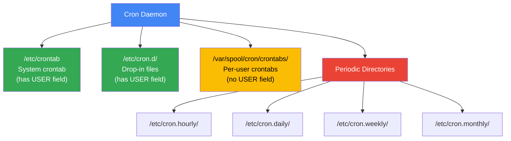
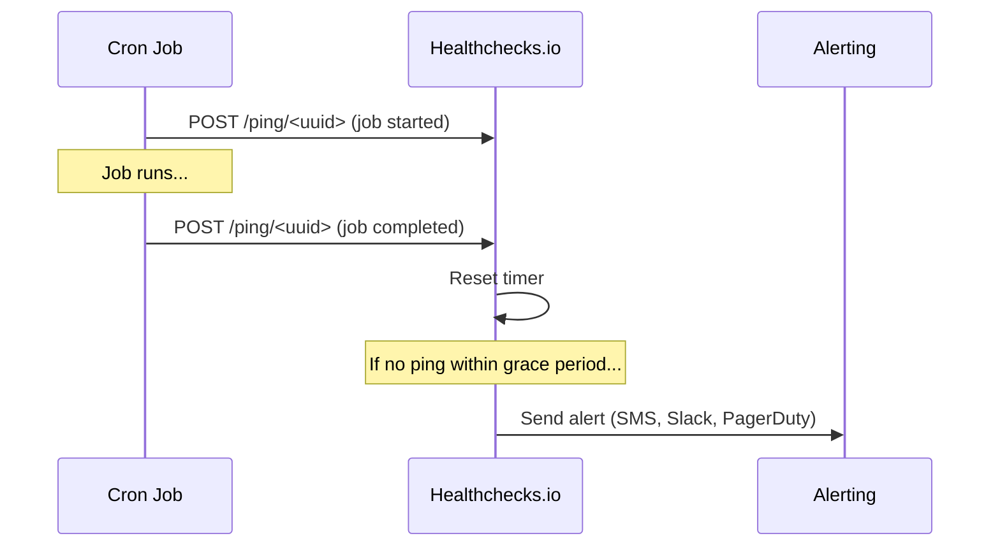

# Cron Jobs

Cron is the oldest and most ubiquitous job scheduler in Unix systems. It has been running background tasks since the 1970s. Despite its simplicity, misconfigured cron jobs cause more production outages than most engineers realize — wrong timezone, missing PATH, silent failures, overlapping runs, and secrets leaked into logs. This page covers cron syntax in depth, systemd timers as the modern alternative, Kubernetes CronJobs, cloud-native schedulers, and all the operational pitfalls you need to avoid.

**Related**: [Cron Patterns & Reliability](/devops/cron-patterns) | [Kubernetes](/infrastructure/kubernetes/) | [Linux Internals](/infrastructure/linux-internals/) | [AWS](/infrastructure/aws/)

---

::: tip Key Takeaway
- Cron's five-field syntax (`minute hour day month weekday`) is simple but unforgiving — test every expression before deploying it
- Always redirect output, set explicit PATH and SHELL, and monitor for silent failures — cron's default behavior is to silently swallow errors
- For anything beyond single-machine scheduling, use Kubernetes CronJobs or cloud-native schedulers — they provide retry, observability, and distributed execution out of the box
:::

::: warning Common Misconceptions
- **"Cron will email me on failure"** — Only if MAILTO is set, an MTA is configured, and the job produces output. Most modern servers have no MTA installed.
- **"Cron uses my shell profile"** — Cron runs in a minimal environment. Your `.bashrc`, `.profile`, PATH, and aliases do not exist. You must set everything explicitly.
- **"*/5 in the day field means every 5 days"** — It means every day whose date is divisible by 5 (5th, 10th, 15th, etc.), not "every 5 days from now."
- **"Cron handles DST automatically"** — Cron uses system time. During spring-forward, a 2:30 AM job may be skipped. During fall-back, it may run twice.
- **"If a job is still running, cron will wait"** — Cron has no overlap detection. It will launch another instance on schedule regardless of whether the previous one finished.
:::

---

## Cron Syntax Deep Dive

Every cron entry has five time fields followed by the command:

```
┌───────────── minute (0-59)
│ ┌───────────── hour (0-23)
│ │ ┌───────────── day of month (1-31)
│ │ │ ┌───────────── month (1-12 or JAN-DEC)
│ │ │ │ ┌───────────── day of week (0-7, 0 and 7 = Sunday, or SUN-SAT)
│ │ │ │ │
* * * * *  command-to-run
```

### Special Characters

| Character | Meaning | Example | Explanation |
|-----------|---------|---------|-------------|
| `*` | Any value | `* * * * *` | Every minute |
| `,` | Value list | `0,15,30,45 * * * *` | At minutes 0, 15, 30, 45 |
| `-` | Range | `0 9-17 * * *` | Every hour from 9 AM to 5 PM |
| `/` | Step | `*/10 * * * *` | Every 10 minutes |
| `@` | Predefined | `@daily` | Once a day at midnight |

### Predefined Schedules

| Shortcut | Equivalent | When |
|----------|-----------|------|
| `@reboot` | N/A | Once at startup |
| `@yearly` / `@annually` | `0 0 1 1 *` | January 1st, midnight |
| `@monthly` | `0 0 1 * *` | 1st of every month, midnight |
| `@weekly` | `0 0 * * 0` | Every Sunday, midnight |
| `@daily` / `@midnight` | `0 0 * * *` | Every day, midnight |
| `@hourly` | `0 * * * *` | Every hour, on the hour |

### Examples You Will Actually Use

```bash
# Every weekday at 9:30 AM
30 9 * * 1-5  /opt/scripts/daily-report.sh

# Every 15 minutes during business hours
*/15 9-17 * * 1-5  /opt/scripts/check-queues.sh

# First Monday of every month at 6 AM
0 6 1-7 * 1  /opt/scripts/monthly-cleanup.sh

# Every 6 hours (midnight, 6 AM, noon, 6 PM)
0 */6 * * *  /opt/scripts/sync-data.sh

# At 2:30 AM on the 1st and 15th of every month
30 2 1,15 * *  /opt/scripts/billing-run.sh
```

::: danger Day-of-Month AND Day-of-Week Trap
When BOTH day-of-month and day-of-week are specified (not `*`), cron uses OR logic, not AND. This means `0 0 13 * 5` runs on the 13th of every month AND every Friday — not just on Friday the 13th. This surprises almost everyone.
:::

---

## Crontab Management

### User Crontabs

```bash
# Edit current user's crontab
crontab -e

# List current user's crontab
crontab -l

# Edit another user's crontab (requires root)
crontab -u deploy -e

# Remove current user's crontab (dangerous — no confirmation)
crontab -r

# Always back up before removing
crontab -l > ~/crontab-backup-$(date +%Y%m%d).txt
```

### System Crontab Locations



The key difference: `/etc/crontab` and `/etc/cron.d/` files have a sixth field (username) between the time spec and the command. User crontabs do not.

```bash
# /etc/crontab — note the username field
SHELL=/bin/bash
PATH=/usr/local/sbin:/usr/local/bin:/sbin:/bin:/usr/sbin:/usr/bin

# m  h  dom mon dow user    command
17 * * * *  root    cd / && run-parts --report /etc/cron.hourly
25 6 * * *  root    test -x /usr/sbin/anacron || run-parts --report /etc/cron.daily

# /etc/cron.d/my-app — drop-in file
*/5 * * * *  deploy  /opt/myapp/bin/health-check.sh >> /var/log/myapp/health.log 2>&1
```

::: tip
Drop-in files in `/etc/cron.d/` are the preferred method for system services and deployments. They are managed by package managers, version-controllable, and do not require `crontab -e`.
:::

---

## Systemd Timers vs Cron

Modern Linux distributions ship systemd timers as an alternative to cron. They are more powerful but more verbose to configure.

### Comparison

| Feature | Cron | systemd Timer |
|---------|------|--------------|
| **Config complexity** | One line | Two unit files (timer + service) |
| **Calendar syntax** | `*/5 * * * *` | `*-*-* *:00/5:00` (more readable) |
| **Logging** | Must redirect manually | Automatic journald integration |
| **Dependency management** | None | Full systemd dependency graph |
| **Overlap prevention** | None (need flock) | Built-in (one instance at a time) |
| **Missed run handling** | Skipped silently | `Persistent=true` catches up |
| **Randomized delay** | Not possible | `RandomizedDelaySec=` built-in |
| **Resource limits** | None | Full cgroup controls (CPU, memory, IO) |
| **Status checking** | `crontab -l` | `systemctl list-timers`, rich status output |
| **Boot-time execution** | `@reboot` | `OnBootSec=` |

### systemd Timer Example

```ini
# /etc/systemd/system/backup.timer
[Unit]
Description=Run backup every 6 hours

[Timer]
OnCalendar=*-*-* 00/6:00:00
Persistent=true
RandomizedDelaySec=300

[Install]
WantedBy=timers.target
```

```ini
# /etc/systemd/system/backup.service
[Unit]
Description=Database backup
After=network-online.target postgresql.service

[Service]
Type=oneshot
User=backup
Group=backup
ExecStart=/opt/scripts/backup.sh
MemoryMax=512M
CPUQuota=50%
TimeoutStartSec=3600
```

```bash
# Enable and start the timer
systemctl daemon-reload
systemctl enable --now backup.timer

# Check timer status
systemctl list-timers --all
systemctl status backup.timer
systemctl status backup.service

# View logs
journalctl -u backup.service --since "1 hour ago"

# Run the service manually (for testing)
systemctl start backup.service
```

### When to Use Which

| Use **cron** when | Use **systemd timers** when |
|-------------------|----------------------------|
| Simple, one-liner jobs | Jobs need resource limits |
| Legacy systems without systemd | Jobs need dependency ordering |
| Quick prototyping | You need built-in logging |
| Cross-platform compatibility | You need missed-run recovery |
| You need simplicity | You need randomized delays to avoid thundering herd |

---

## Environment Gotchas

This is the number one source of cron bugs. Cron jobs run in a stripped-down environment that looks nothing like your interactive shell.

### The Problem

```bash
# What you tested interactively (works)
$ python3 /opt/scripts/etl.py

# What cron sees (fails)
# - PATH is /usr/bin:/bin (no /usr/local/bin, no virtualenv)
# - SHELL is /bin/sh (not bash)
# - HOME may or may not be set
# - No TTY, no display, no SSH agent
# - No .bashrc, .profile, or .zshrc loaded
```

### The Fix

Always set environment variables explicitly in your crontab:

```bash
# Set at the top of your crontab
SHELL=/bin/bash
PATH=/usr/local/sbin:/usr/local/bin:/usr/sbin:/usr/bin:/sbin:/bin
HOME=/home/deploy
LANG=en_US.UTF-8

# Or set per-command with full paths
* * * * *  /usr/bin/env PATH=/usr/local/bin:$PATH /opt/scripts/run.sh

# For Python virtualenvs
*/10 * * * *  /opt/myapp/venv/bin/python /opt/myapp/etl.py

# For Node.js with nvm — source nvm explicitly
*/5 * * * *  bash -lc 'source ~/.nvm/nvm.sh && node /opt/myapp/worker.js'
```

### Debugging Environment Issues

```bash
# Add this as a cron job to see what cron's environment looks like
* * * * *  env > /tmp/cron-env.txt 2>&1

# Compare with your interactive environment
env > /tmp/interactive-env.txt
diff /tmp/cron-env.txt /tmp/interactive-env.txt
```

---

## Logging and Output Handling

By default, cron sends any output (stdout + stderr) via email using the system MTA. On most modern servers, no MTA is configured, so output is silently discarded.

### Redirecting Output

```bash
# Redirect stdout and stderr to a log file
*/5 * * * *  /opt/scripts/sync.sh >> /var/log/sync.log 2>&1

# Separate stdout and stderr
*/5 * * * *  /opt/scripts/sync.sh >> /var/log/sync.log 2>> /var/log/sync-errors.log

# Discard output entirely (only if you have external monitoring)
*/5 * * * *  /opt/scripts/sync.sh > /dev/null 2>&1

# Log with timestamp using ts (from moreutils)
*/5 * * * *  /opt/scripts/sync.sh 2>&1 | ts '[\%Y-\%m-\%d \%H:\%M:\%S]' >> /var/log/sync.log
```

::: danger
Never use `> /dev/null 2>&1` without external monitoring. If a job fails silently for weeks, you will not discover it until a downstream system breaks. Always have at least one monitoring layer: log files, MAILTO, or a dead man's switch.
:::

### MAILTO

```bash
# Send output via email (requires working MTA)
MAILTO=ops-team@company.com

# Multiple recipients
MAILTO="alice@company.com,bob@company.com"

# Disable email (use only with proper logging/monitoring)
MAILTO=""
```

### systemd Timer Logging

```bash
# systemd timers log to journald automatically
journalctl -u backup.service --since "24 hours ago"
journalctl -u backup.service --follow
journalctl -u backup.service -p err     # Only errors
```

---

## Kubernetes CronJobs

Kubernetes CronJobs are the standard way to run scheduled work in a cluster. They create a Job (which creates a Pod) on each scheduled run.


### Spec Breakdown

```yaml
apiVersion: batch/v1
kind: CronJob
metadata:
  name: db-backup
  namespace: production
spec:
  schedule: "0 */6 * * *"                 # Every 6 hours
  timeZone: "America/New_York"            # K8s 1.27+ — explicit timezone
  concurrencyPolicy: Forbid              # Do NOT overlap runs
  startingDeadlineSeconds: 600            # Give up if 10 min late
  successfulJobsHistoryLimit: 3           # Keep last 3 successful jobs
  failedJobsHistoryLimit: 5              # Keep last 5 failed jobs
  suspend: false                          # Set true to pause without deleting
  jobTemplate:
    spec:
      backoffLimit: 2                     # Retry failed pods up to 2 times
      activeDeadlineSeconds: 3600         # Kill job after 1 hour
      template:
        spec:
          restartPolicy: OnFailure
          serviceAccountName: backup-sa
          containers:
            - name: backup
              image: myregistry/db-backup:v2.1.0
              resources:
                requests:
                  cpu: 250m
                  memory: 256Mi
                limits:
                  cpu: "1"
                  memory: 1Gi
              env:
                - name: DB_HOST
                  valueFrom:
                    secretKeyRef:
                      name: db-credentials
                      key: host
              volumeMounts:
                - name: backup-storage
                  mountPath: /backups
          volumes:
            - name: backup-storage
              persistentVolumeClaim:
                claimName: backup-pvc
```

### concurrencyPolicy Options

| Policy | Behavior | Use When |
|--------|----------|----------|
| `Allow` (default) | Multiple Jobs can run simultaneously | Jobs are independent and idempotent |
| `Forbid` | Skip new run if previous is still active | Jobs must not overlap (most common) |
| `Replace` | Kill running Job and start a new one | Only the latest run matters |

### startingDeadlineSeconds

If the CronJob controller misses a scheduled run (for example, the controller was down), `startingDeadlineSeconds` defines how many seconds late the Job can still start. If not set, the Job is never considered "too late." If more than 100 runs are missed within the deadline window, Kubernetes logs an error and stops scheduling.

::: warning
Always set `startingDeadlineSeconds`. Without it, a brief controller outage can trigger a burst of catch-up Jobs that overwhelm your cluster.
:::

---

## Cloud Schedulers

For serverless and cloud-native architectures, managed schedulers replace cron entirely.

### AWS EventBridge Scheduler

```json
{
  "Name": "daily-etl",
  "ScheduleExpression": "cron(30 2 * * ? *)",
  "FlexibleTimeWindow": {
    "Mode": "FLEXIBLE",
    "MaximumWindowInMinutes": 15
  },
  "Target": {
    "Arn": "arn:aws:lambda:us-east-1:123456789:function:etl-runner",
    "RoleArn": "arn:aws:iam::123456789:role/scheduler-role",
    "RetryPolicy": {
      "MaximumRetryAttempts": 2,
      "MaximumEventAgeInSeconds": 3600
    },
    "DeadLetterConfig": {
      "Arn": "arn:aws:sqs:us-east-1:123456789:scheduler-dlq"
    }
  }
}
```

### GCP Cloud Scheduler

```bash
gcloud scheduler jobs create http daily-etl \
  --schedule="30 2 * * *" \
  --uri="https://us-central1-myproject.cloudfunctions.net/etl-runner" \
  --http-method=POST \
  --oidc-service-account-email=scheduler@myproject.iam.gserviceaccount.com \
  --attempt-deadline=600s \
  --max-retry-attempts=3 \
  --time-zone="America/New_York"
```

### Comparison

| Feature | AWS EventBridge | GCP Cloud Scheduler | Azure Logic Apps |
|---------|----------------|--------------------|--------------------|
| **Min interval** | 1 minute | 1 minute | 1 second |
| **Targets** | Lambda, SQS, SNS, Step Functions, etc. | HTTP, Pub/Sub, App Engine | 400+ connectors |
| **Retry** | Built-in with DLQ | Built-in | Built-in with run history |
| **Timezone** | Yes | Yes | Yes |
| **Pricing** | Free tier: 14M invocations/mo | $0.10/job/month | Per-execution |
| **IAM** | IAM roles per schedule | Service account per job | Managed identity |

---

## Monitoring Cron Jobs

The single most important thing you can do for cron jobs is monitor them. A job that fails silently is worse than a job that fails loudly.

### Dead Man's Switch Pattern

Instead of alerting when a job fails (which requires the job to report failure), alert when a job does NOT check in by its expected time. This catches silent failures, crashed processes, and misconfigured schedules.



```bash
# Wrap your cron job with a health check ping
*/5 * * * *  /opt/scripts/sync.sh && curl -fsS -m 10 --retry 5 https://hc-ping.com/your-uuid-here > /dev/null
```

### Monitoring Services

| Service | Free Tier | Features |
|---------|-----------|----------|
| [Healthchecks.io](https://healthchecks.io) | 20 checks | Dead man's switch, cron syntax validation, integrations |
| [Cronitor](https://cronitor.io) | 5 monitors | Metrics, alerting, auto-discovery, dashboards |
| [Better Uptime](https://betteruptime.com) | 10 monitors | Heartbeat monitoring, status pages |

### DIY Monitoring with Prometheus

```bash
#!/bin/bash
# /opt/scripts/monitored-job.sh
START=$(date +%s)

# Run actual job
/opt/scripts/actual-job.sh
EXIT_CODE=$?

END=$(date +%s)
DURATION=$((END - START))

# Push metrics to Prometheus Pushgateway
cat <<METRICS | curl --data-binary @- http://pushgateway:9091/metrics/job/db_backup
# TYPE job_duration_seconds gauge
job_duration_seconds ${DURATION}
# TYPE job_last_exit_code gauge
job_last_exit_code ${EXIT_CODE}
# TYPE job_last_success_timestamp gauge
job_last_success_timestamp $([ $EXIT_CODE -eq 0 ] && echo $END || echo 0)
METRICS
```

---

## Security Considerations

### Least Privilege

```bash
# BAD — running as root
* * * * *  /opt/scripts/cleanup.sh

# GOOD — run as a dedicated service account with minimal permissions
# In /etc/cron.d/cleanup:
* * * * *  cleanup-svc  /opt/scripts/cleanup.sh
```

### Secrets in Cron

```bash
# BAD — secrets visible in crontab, process list, and logs
0 * * * *  /opt/scripts/backup.sh --password=SuperSecret123

# GOOD — use environment files with restricted permissions
0 * * * *  /opt/scripts/backup.sh
# Inside backup.sh:
# source /etc/myapp/secrets.env  (chmod 600, owned by backup user)

# GOOD — use a secrets manager
0 * * * *  /opt/scripts/backup.sh
# Inside backup.sh:
# DB_PASS=$(aws secretsmanager get-secret-value --secret-id db/password --query SecretString --output text)
```

### Audit Trail

```bash
# Enable cron logging (rsyslog)
# In /etc/rsyslog.d/50-cron.conf:
cron.*  /var/log/cron.log

# Monitor crontab changes
# Use auditd to track crontab modifications
auditctl -w /var/spool/cron/ -p wa -k crontab_changes
auditctl -w /etc/cron.d/ -p wa -k cron_d_changes

# Review audit log
ausearch -k crontab_changes
```

---

## When NOT to Use Cron

Cron is the wrong tool when:

| Scenario | Why Cron Fails | Use Instead |
|----------|---------------|-------------|
| **Multi-server deployments** | Every server runs its own cron — duplicate execution | Kubernetes CronJobs, cloud schedulers, or [leader election](/devops/cron-patterns#leader-election-for-cron) |
| **Job B depends on Job A finishing** | Cron has no dependency graph | Airflow, Temporal, Dagster, Prefect |
| **Sub-minute scheduling** | Cron's minimum interval is 1 minute | systemd timers (`OnUnitActiveSec=10s`), custom daemons |
| **Jobs needing retry on failure** | Cron does not retry — next run is next schedule | Task queues (Celery, BullMQ), cloud schedulers |
| **Jobs that must not overlap** | Cron has no built-in locking | [flock / advisory locks](/devops/cron-patterns#overlap-prevention), K8s CronJobs with `Forbid` |
| **Dynamic schedules** | Crontabs are static files | Database-driven schedulers, cloud schedulers |
| **Audit/compliance requirements** | Cron has minimal logging | Managed platforms with execution history and audit trails |

---

::: tip In Production

**GitHub** uses a combination of Kubernetes CronJobs and their internal "cron" service for scheduled tasks. After multiple incidents caused by overlapping cron jobs on bare metal, they migrated critical scheduled work to Kubernetes with `concurrencyPolicy: Forbid` and integrated health checks via their internal monitoring platform.

**Stripe** moved away from traditional cron early on. Their scheduled jobs run through a custom distributed task scheduler built on top of their queue infrastructure. Every job is idempotent, every run is logged with a correlation ID, and missed runs trigger PagerDuty alerts within minutes.

**Cloudflare** uses a custom distributed cron system called "Kronos" that handles scheduling across their 300+ data centers. It uses Raft consensus for leader election and ensures each job runs exactly once globally, not once per server.
:::

---

::: details Quiz

**Question 1:** What does the cron expression `30 4 1,15 * *` mean?

::: details Answer
Run at 4:30 AM on the 1st and 15th of every month, regardless of the day of the week.
:::

**Question 2:** A cron job is configured as `0 2 * * *` and the system timezone is US/Eastern. What happens on the night clocks spring forward (2:00 AM becomes 3:00 AM)?

::: details Answer
The job is skipped because 2:00 AM never occurs on that night. The system clock jumps from 1:59 AM to 3:00 AM. To avoid this, schedule jobs outside the 2:00-3:00 AM window, use UTC, or use systemd timers with `Persistent=true`.
:::

**Question 3:** You set `concurrencyPolicy: Replace` on a Kubernetes CronJob. The previous job has been running for 50 minutes when the next schedule triggers. What happens?

::: details Answer
Kubernetes terminates the currently running Job and starts a new one. The previous Job's Pod receives SIGTERM (then SIGKILL after the grace period). Use `Replace` only when the latest run supersedes previous runs (e.g., cache warming). For most use cases, `Forbid` is safer.
:::

**Question 4:** Why is `> /dev/null 2>&1` at the end of a cron command considered dangerous?

::: details Answer
It silences ALL output — including error messages. If the job fails, you have no logs, no email, and no way to diagnose the failure. Always redirect to a log file instead (`>> /var/log/job.log 2>&1`) or use a monitoring service.
:::

**Question 5:** Your cron job runs `python3 /opt/app/etl.py` and works perfectly when you run it manually as the deploy user, but fails in cron. What is the most likely cause?

::: details Answer
PATH differences. When you run it interactively, your shell profile sets PATH to include `/usr/local/bin` or a virtualenv. Cron runs with a minimal PATH (`/usr/bin:/bin`). Fix by using the full path to the Python binary (e.g., `/opt/app/venv/bin/python3 /opt/app/etl.py`) or setting PATH explicitly at the top of the crontab.
:::

:::

---

::: details Exercise: Build a Production-Ready Cron Setup

**Scenario:** You need to run a database backup script (`/opt/scripts/db-backup.sh`) every 6 hours on a Linux server. Requirements:

1. Must not overlap with a previous run
2. Must log output with timestamps
3. Must alert if the job fails or does not run
4. Must run as a non-root user
5. Must not expose database credentials

**Build the complete setup: crontab entry, wrapper script, and monitoring integration.**

::: details Solution

**Step 1: Create the wrapper script** (`/opt/scripts/db-backup-wrapper.sh`)

```bash
#!/bin/bash
set -euo pipefail

LOCK_FILE="/var/run/db-backup.lock"
LOG_FILE="/var/log/db-backup/backup.log"
HC_UUID="your-healthchecks-uuid"

# Signal start to monitoring
curl -fsS -m 10 --retry 3 "https://hc-ping.com/${HC_UUID}/start" > /dev/null 2>&1 || true

# Prevent overlapping runs
exec 200>"$LOCK_FILE"
if ! flock -n 200; then
    echo "$(date -Iseconds) [WARN] Previous backup still running, skipping" >> "$LOG_FILE"
    curl -fsS -m 10 "https://hc-ping.com/${HC_UUID}/fail" > /dev/null 2>&1 || true
    exit 1
fi

# Load secrets from a restricted file (chmod 600, owned by backup user)
source /etc/db-backup/secrets.env

# Run the actual backup with timestamped logging
{
    echo "=== Backup started at $(date -Iseconds) ==="
    /opt/scripts/db-backup.sh
    EXIT_CODE=$?
    echo "=== Backup finished at $(date -Iseconds) with exit code ${EXIT_CODE} ==="
} >> "$LOG_FILE" 2>&1

# Signal success or failure to monitoring
if [ "${EXIT_CODE:-0}" -eq 0 ]; then
    curl -fsS -m 10 --retry 3 "https://hc-ping.com/${HC_UUID}" > /dev/null 2>&1 || true
else
    curl -fsS -m 10 --retry 3 "https://hc-ping.com/${HC_UUID}/fail" > /dev/null 2>&1 || true
fi

exit "${EXIT_CODE:-0}"
```

**Step 2: Create the crontab entry** (`/etc/cron.d/db-backup`)

```bash
SHELL=/bin/bash
PATH=/usr/local/sbin:/usr/local/bin:/usr/sbin:/usr/bin:/sbin:/bin

# Database backup every 6 hours, running as backup user
0 */6 * * *  backup  /opt/scripts/db-backup-wrapper.sh
```

**Step 3: Set up the monitoring check on healthchecks.io**

- Create a check with a period of 6 hours and a grace period of 30 minutes
- Configure alert integrations (Slack, PagerDuty, email)
- The `/start` ping lets you track job duration; the `/fail` ping triggers immediate alerting

**Step 4: Set file permissions**

```bash
sudo mkdir -p /var/log/db-backup
sudo chown backup:backup /var/log/db-backup
sudo chmod 750 /opt/scripts/db-backup-wrapper.sh
sudo chown backup:backup /opt/scripts/db-backup-wrapper.sh
sudo chmod 600 /etc/db-backup/secrets.env
sudo chown backup:backup /etc/db-backup/secrets.env
```
:::

:::

---

**One-Liner Summary:** Cron schedules jobs with five fields (minute, hour, day, month, weekday), but production cron requires explicit PATH, output redirection, overlap prevention, monitoring, and least-privilege execution — or you should use Kubernetes CronJobs / cloud schedulers instead.
