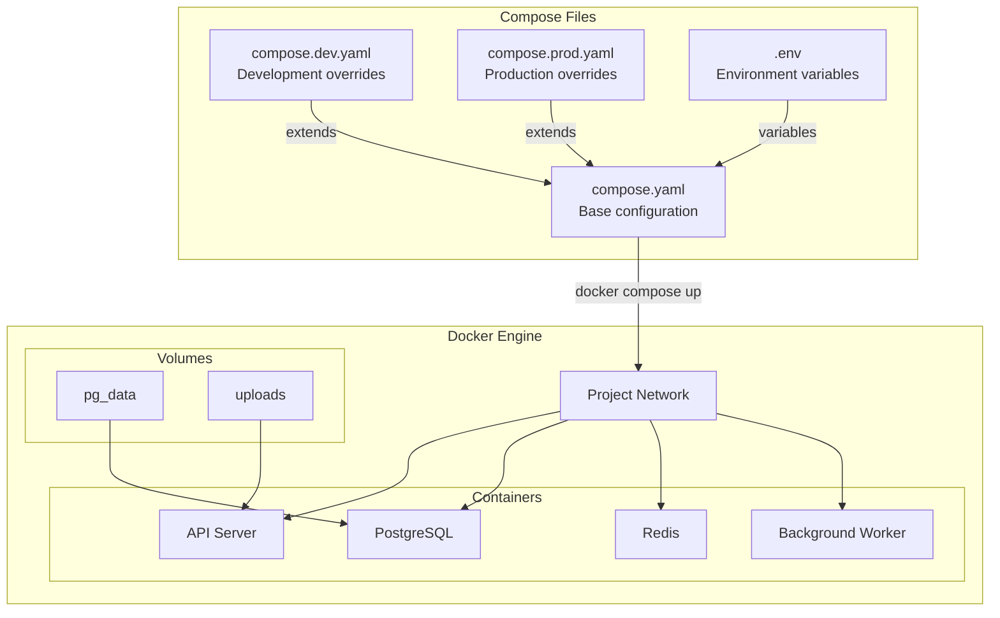
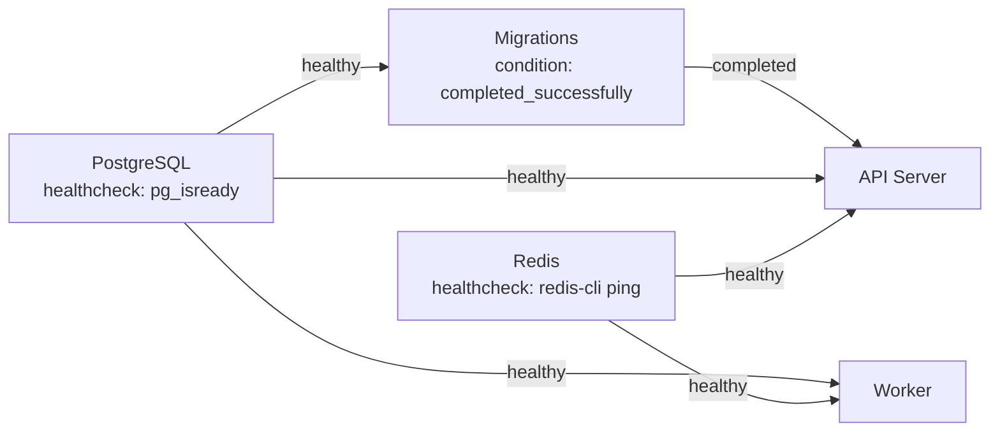

# Docker Compose Patterns

## Why It Exists

A modern application is never just one container. Even a simple web application needs an application server, a database, a cache, and perhaps a message queue. Starting each of these with individual `docker run` commands — each with 10+ flags for ports, volumes, networks, environment variables, and health checks — is tedious and error-prone.

Docker Compose (originally a separate tool, now integrated as `docker compose`) provides declarative multi-container orchestration. You define your entire application stack in a YAML file and bring it up with a single command. But more importantly, Compose enables **environment-specific configurations** — the same service definition can be extended for development (with hot-reload and debug ports), staging (with production-like config), and production (with resource limits and restart policies).

Compose is not a replacement for Kubernetes. It is ideal for:
- Local development environments
- CI/CD testing
- Small deployments (single-host)
- Demo/evaluation environments

## First Principles

### The Compose Architecture



### File Precedence and Merging

Compose merges multiple files using a deep merge strategy:

```bash
# Development
docker compose -f compose.yaml -f compose.dev.yaml up

# Production
docker compose -f compose.yaml -f compose.prod.yaml up

# Or use COMPOSE_FILE environment variable
export COMPOSE_FILE=compose.yaml:compose.dev.yaml
docker compose up
```

Merge rules:
- **Scalars** (strings, numbers): later file overrides earlier
- **Mappings** (objects): deep merged recursively
- **Sequences** (arrays): later file replaces entirely (not appended)

## Core Mechanics

### Base Configuration (compose.yaml)

```yaml
# compose.yaml — Shared base for all environments

name: myapp

services:
  api:
    build:
      context: .
      dockerfile: Dockerfile
    environment:
      - NODE_ENV=${NODE_ENV:-production}
      - DATABASE_URL=postgresql://${DB_USER:-postgres}:${DB_PASSWORD:-postgres}@db:5432/${DB_NAME:-myapp}
      - REDIS_URL=redis://redis:6379
      - PORT=3000
    depends_on:
      db:
        condition: service_healthy
      redis:
        condition: service_healthy
    networks:
      - backend
    restart: unless-stopped

  worker:
    build:
      context: .
      dockerfile: Dockerfile
    command: ["node", "dist/worker.js"]
    environment:
      - NODE_ENV=${NODE_ENV:-production}
      - DATABASE_URL=postgresql://${DB_USER:-postgres}:${DB_PASSWORD:-postgres}@db:5432/${DB_NAME:-myapp}
      - REDIS_URL=redis://redis:6379
    depends_on:
      db:
        condition: service_healthy
      redis:
        condition: service_healthy
    networks:
      - backend
    restart: unless-stopped

  db:
    image: postgres:16-alpine
    environment:
      POSTGRES_USER: ${DB_USER:-postgres}
      POSTGRES_PASSWORD: ${DB_PASSWORD:-postgres}
      POSTGRES_DB: ${DB_NAME:-myapp}
    volumes:
      - pg_data:/var/lib/postgresql/data
    healthcheck:
      test: ["CMD-SHELL", "pg_isready -U ${DB_USER:-postgres}"]
      interval: 10s
      timeout: 5s
      retries: 5
      start_period: 30s
    networks:
      - backend

  redis:
    image: redis:7-alpine
    command: redis-server --maxmemory 256mb --maxmemory-policy allkeys-lru
    volumes:
      - redis_data:/data
    healthcheck:
      test: ["CMD", "redis-cli", "ping"]
      interval: 10s
      timeout: 5s
      retries: 5
    networks:
      - backend

networks:
  backend:
    driver: bridge

volumes:
  pg_data:
  redis_data:
```

### Development Override (compose.dev.yaml)

```yaml
# compose.dev.yaml — Development-specific configuration

services:
  api:
    build:
      target: development
    ports:
      - "3000:3000"    # API
      - "9229:9229"    # Node.js debugger
    volumes:
      - ./src:/app/src:ro           # Hot-reload source code
      - ./package.json:/app/package.json:ro
      - ./tsconfig.json:/app/tsconfig.json:ro
    environment:
      - NODE_ENV=development
      - LOG_LEVEL=debug
    command: ["npx", "nodemon", "--inspect=0.0.0.0:9229", "src/server.ts"]
    restart: "no"

  worker:
    build:
      target: development
    volumes:
      - ./src:/app/src:ro
    environment:
      - NODE_ENV=development
      - LOG_LEVEL=debug
    command: ["npx", "nodemon", "src/worker.ts"]
    restart: "no"

  db:
    ports:
      - "5432:5432"    # Expose for local DB tools (pgAdmin, DBeaver)
    environment:
      POSTGRES_PASSWORD: postgres  # Simple password for dev

  redis:
    ports:
      - "6379:6379"    # Expose for local Redis tools

  # Development-only services
  adminer:
    image: adminer:4
    ports:
      - "8080:8080"
    depends_on:
      - db
    networks:
      - backend

  mailhog:
    image: mailhog/mailhog:latest
    ports:
      - "1025:1025"    # SMTP
      - "8025:8025"    # Web UI
    networks:
      - backend
```

### Production Override (compose.prod.yaml)

```yaml
# compose.prod.yaml — Production-specific configuration

services:
  api:
    build:
      target: production
    ports:
      - "3000:3000"
    deploy:
      replicas: 3
      resources:
        limits:
          cpus: "1.0"
          memory: 512M
        reservations:
          cpus: "0.25"
          memory: 128M
      restart_policy:
        condition: on-failure
        delay: 5s
        max_attempts: 3
        window: 120s
    environment:
      - NODE_ENV=production
      - LOG_LEVEL=info
    logging:
      driver: json-file
      options:
        max-size: "10m"
        max-file: "3"
        tag: "api"
    healthcheck:
      test: ["CMD", "wget", "--spider", "-q", "http://localhost:3000/health"]
      interval: 30s
      timeout: 5s
      retries: 3
      start_period: 30s
    read_only: true
    tmpfs:
      - /tmp:size=100M
    security_opt:
      - no-new-privileges:true

  worker:
    build:
      target: production
    deploy:
      replicas: 2
      resources:
        limits:
          cpus: "0.5"
          memory: 256M
    environment:
      - NODE_ENV=production
    logging:
      driver: json-file
      options:
        max-size: "10m"
        max-file: "3"
    read_only: true
    tmpfs:
      - /tmp:size=100M

  db:
    deploy:
      resources:
        limits:
          cpus: "2.0"
          memory: 2G
        reservations:
          cpus: "0.5"
          memory: 512M
    environment:
      POSTGRES_PASSWORD_FILE: /run/secrets/db_password
    secrets:
      - db_password
    volumes:
      - pg_data:/var/lib/postgresql/data
      - ./postgresql.conf:/etc/postgresql/postgresql.conf:ro
    command: postgres -c config_file=/etc/postgresql/postgresql.conf
    logging:
      driver: json-file
      options:
        max-size: "50m"
        max-file: "5"

  redis:
    deploy:
      resources:
        limits:
          cpus: "0.5"
          memory: 512M
    command: >
      redis-server
      --maxmemory 256mb
      --maxmemory-policy allkeys-lru
      --save 60 1000
      --save 300 100
      --requirepass ${REDIS_PASSWORD}

  # Production-only: reverse proxy
  nginx:
    image: nginx:1.25-alpine
    ports:
      - "80:80"
      - "443:443"
    volumes:
      - ./nginx/nginx.conf:/etc/nginx/nginx.conf:ro
      - ./nginx/ssl:/etc/nginx/ssl:ro
    depends_on:
      api:
        condition: service_healthy
    networks:
      - backend
    deploy:
      resources:
        limits:
          cpus: "0.5"
          memory: 128M
    logging:
      driver: json-file
      options:
        max-size: "10m"
        max-file: "3"

secrets:
  db_password:
    file: ./secrets/db_password.txt
```

### Staging Override (compose.staging.yaml)

```yaml
# compose.staging.yaml — Staging mirrors production but with debug access

services:
  api:
    build:
      target: production
    ports:
      - "3000:3000"
    environment:
      - NODE_ENV=staging
      - LOG_LEVEL=debug
    deploy:
      replicas: 2
      resources:
        limits:
          cpus: "0.5"
          memory: 256M

  db:
    ports:
      - "5432:5432"  # Accessible for debugging
    environment:
      POSTGRES_PASSWORD: ${DB_PASSWORD}

  redis:
    ports:
      - "6379:6379"  # Accessible for debugging
```

### CI/CD Test Configuration (compose.test.yaml)

```yaml
# compose.test.yaml — CI/CD testing configuration

services:
  api:
    build:
      target: tester
    command: ["npm", "run", "test:ci"]
    environment:
      - NODE_ENV=test
      - DATABASE_URL=postgresql://postgres:test@db:5432/myapp_test
      - REDIS_URL=redis://redis:6379/1
      - CI=true
    depends_on:
      db:
        condition: service_healthy
      redis:
        condition: service_healthy

  db:
    environment:
      POSTGRES_DB: myapp_test
      POSTGRES_PASSWORD: test
    tmpfs:
      - /var/lib/postgresql/data  # In-memory for speed

  redis:
    command: redis-server --save ""  # No persistence for tests

  # Integration test runner
  integration:
    build:
      context: .
      target: tester
    command: ["npm", "run", "test:integration"]
    environment:
      - API_URL=http://api:3000
      - DATABASE_URL=postgresql://postgres:test@db:5432/myapp_test
    depends_on:
      api:
        condition: service_healthy
```

```bash
# Run tests in CI
docker compose -f compose.yaml -f compose.test.yaml run --rm --exit-code-from api api
echo "Tests exited with code: $?"
docker compose -f compose.yaml -f compose.test.yaml down -v
```

## Implementation — Advanced Patterns

### Service Profiles

Profiles allow selectively starting services:

```yaml
services:
  api:
    # No profile — always starts
    build: .

  db:
    # No profile — always starts
    image: postgres:16-alpine

  monitoring:
    image: grafana/grafana:latest
    profiles:
      - monitoring
    ports:
      - "3001:3000"

  prometheus:
    image: prom/prometheus:latest
    profiles:
      - monitoring
    ports:
      - "9090:9090"

  debug-tools:
    image: nicolaka/netshoot
    profiles:
      - debug
    network_mode: "service:api"
    command: sleep infinity
```

```bash
# Start without monitoring
docker compose up

# Start with monitoring
docker compose --profile monitoring up

# Start everything
docker compose --profile monitoring --profile debug up
```

### Depends On with Health Checks

```yaml
services:
  api:
    depends_on:
      db:
        condition: service_healthy
        restart: true  # Restart API if DB restarts
      redis:
        condition: service_healthy
      migrations:
        condition: service_completed_successfully

  migrations:
    build: .
    command: ["node", "dist/migrations/run.js"]
    environment:
      - DATABASE_URL=postgresql://postgres:postgres@db:5432/myapp
    depends_on:
      db:
        condition: service_healthy
    restart: "no"
```



### Extension Fields (YAML Anchors)

Avoid repetition with YAML anchors and Compose extensions:

```yaml
# Define reusable blocks with x- prefix
x-common-env: &common-env
  NODE_ENV: ${NODE_ENV:-production}
  LOG_LEVEL: ${LOG_LEVEL:-info}
  DATABASE_URL: postgresql://postgres:${DB_PASSWORD}@db:5432/myapp
  REDIS_URL: redis://redis:6379

x-healthcheck-defaults: &healthcheck-defaults
  interval: 30s
  timeout: 5s
  retries: 3
  start_period: 30s

x-logging: &default-logging
  driver: json-file
  options:
    max-size: "10m"
    max-file: "3"

x-deploy-defaults: &deploy-defaults
  resources:
    limits:
      cpus: "1.0"
      memory: 512M
    reservations:
      cpus: "0.25"
      memory: 128M

services:
  api:
    build: .
    environment:
      <<: *common-env
      PORT: "3000"
    logging: *default-logging
    deploy: *deploy-defaults
    healthcheck:
      <<: *healthcheck-defaults
      test: ["CMD", "wget", "--spider", "-q", "http://localhost:3000/health"]

  worker:
    build: .
    command: ["node", "dist/worker.js"]
    environment:
      <<: *common-env
      WORKER_CONCURRENCY: "5"
    logging: *default-logging
    deploy:
      <<: *deploy-defaults
      replicas: 2
      resources:
        limits:
          cpus: "0.5"
          memory: 256M

  scheduler:
    build: .
    command: ["node", "dist/scheduler.js"]
    environment:
      <<: *common-env
    logging: *default-logging
    deploy:
      <<: *deploy-defaults
      replicas: 1
```

### Multi-Project Networking

Connect services across multiple Compose projects:

```yaml
# project-a/compose.yaml
services:
  api:
    build: .
    networks:
      - default
      - shared

networks:
  shared:
    name: shared-network
    external: true
```

```yaml
# project-b/compose.yaml
services:
  frontend:
    build: .
    networks:
      - default
      - shared

networks:
  shared:
    name: shared-network
    external: true
```

```bash
# Create the shared network first
docker network create shared-network

# Then start both projects
cd project-a && docker compose up -d
cd project-b && docker compose up -d

# Frontend can now reach API via: http://api:3000
```

### GPU Support

```yaml
services:
  ml-inference:
    image: company/ml-model:latest
    deploy:
      resources:
        reservations:
          devices:
            - driver: nvidia
              count: 1
              capabilities: [gpu]
    environment:
      - NVIDIA_VISIBLE_DEVICES=all
```

## Edge Cases and Failure Modes

### 1. Volume Permission Issues on Linux

Docker Compose volumes created by root can cause permission issues for non-root containers:

```yaml
services:
  api:
    user: "1001:1001"
    volumes:
      - uploads:/app/uploads

volumes:
  uploads:
    driver: local
    driver_opts:
      type: none
      device: /data/uploads
      o: bind,uid=1001,gid=1001
```

### 2. Depends On Does Not Wait for Application Readiness

`depends_on` only waits for the container to start, not for the application inside to be ready. Always use `condition: service_healthy`:

```yaml
# BAD: DB container starts but PostgreSQL isn't accepting connections yet
depends_on:
  - db

# GOOD: Waits until PostgreSQL health check passes
depends_on:
  db:
    condition: service_healthy
```

### 3. Environment Variable Precedence

Compose resolves variables in this order (highest to lowest):

1. `docker compose run -e` (CLI override)
2. `environment:` in compose file
3. `env_file:` in compose file
4. `.env` file (in project directory)
5. Shell environment

```bash
# This will override the compose file value
DB_PASSWORD=override123 docker compose up
```

### 4. Named Volume Data Persistence

Named volumes persist data between `docker compose down` and `docker compose up`. But `docker compose down -v` deletes them:

```bash
# Keeps volumes (data preserved)
docker compose down

# DELETES volumes (data loss!)
docker compose down -v

# Remove only orphaned volumes
docker volume prune
```

### 5. Build Cache Between Compose Runs

```bash
# Force rebuild without cache
docker compose build --no-cache

# Build with BuildKit (parallel stages)
COMPOSE_DOCKER_CLI_BUILD=1 DOCKER_BUILDKIT=1 docker compose build

# Pull latest base images before building
docker compose build --pull
```

## Performance Characteristics

### Startup Time by Configuration

| Configuration | Total Startup | Bottleneck |
|--------------|--------------|-----------|
| 3 services, no deps | 3-5s | Parallel container creation |
| 3 services, sequential deps | 15-30s | Health check intervals |
| 5 services, DB + migrations | 30-60s | DB startup + migration run |
| Full stack (10 services) | 45-120s | Depends on chain depth |

### Resource Overhead

$$
R_{compose} = \sum_{i=1}^{N} R_{container_i} + R_{network} + R_{volumes}
$$

For a typical 5-service stack:

| Component | CPU | Memory |
|-----------|-----|--------|
| API (Node.js) | 0.1-1.0 | 128-512MB |
| Worker (Node.js) | 0.1-0.5 | 128-256MB |
| PostgreSQL | 0.1-2.0 | 256MB-2GB |
| Redis | 0.05-0.5 | 64-512MB |
| Nginx | 0.01-0.1 | 32-128MB |
| **Total** | **0.36-4.1** | **608MB-3.4GB** |

### Docker Compose vs Kubernetes Resource Usage

| Metric | Docker Compose | Kubernetes (single-node) |
|--------|---------------|-------------------------|
| Control plane overhead | ~0 | 500MB-2GB |
| Per-container overhead | ~1MB | ~5MB (kubelet tracking) |
| Network overhead | Minimal (bridge) | Moderate (CNI + kube-proxy) |
| Minimum viable host | 2GB RAM | 4GB RAM |
| Suitable for | 1-20 containers | 10-1000+ containers |

## Mathematical Foundations

### Startup Order as DAG Resolution

Service dependencies form a Directed Acyclic Graph. The startup order is a topological sort:

$$
G = (S, E) \text{ where } S = \text{services}, E = \text{depends\_on edges}
$$

The minimum startup time is the critical path length:

$$
T_{min} = \max_{p \in \text{paths}(G)} \sum_{s \in p} T_s
$$

For the dependency graph:

```
DB (10s) -> Migrations (5s) -> API (3s) -> Nginx (1s)
     \-> Redis (3s) -> Worker (2s)
```

Critical path: DB -> Migrations -> API -> Nginx = 19s

Parallel path: DB -> Redis -> Worker = 15s

Total minimum startup: 19s (limited by critical path)

### Health Check Convergence

A health check with interval $I$, timeout $T$, retries $R$, and start period $P$:

$$
T_{healthy} = P + I \times R_{successes\_needed}
$$

Where $R_{successes\_needed} = 1$ by default.

$$
T_{unhealthy} = P + I \times R
$$

For `interval=10s, retries=5, start_period=30s`:
- Time to first healthy: 30s + 10s = 40s
- Time to mark unhealthy: 30s + 50s = 80s

## Real-World War Stories

::: info War Story — The Docker Compose in Production
A startup ran their entire production infrastructure with Docker Compose on a single EC2 instance. It worked well for 6 months until their database volume filled up the disk. Because Docker Compose has no native monitoring integration, they did not notice until the PostgreSQL container crashed, corrupting the WAL. The most recent backup was 3 days old.

**Lessons:**
1. Docker Compose is acceptable for small production deployments, but you must add external monitoring
2. Always set up automated backups independent of Compose
3. Use volume size monitoring and disk space alerts
4. Consider managed database services (RDS) even with Compose
:::

::: info War Story — The Shared Network Name Collision
Two developers on the same team both ran `docker compose up` for different projects. Both compose files used the default network name (project directory name). Because both projects were in directories named `api`, their containers ended up on the same network with DNS name collisions. One developer's API was hitting the other's database.

**Fix:** Always set explicit `name:` in compose.yaml and use unique project names:
```yaml
name: project-specific-name
```
:::

::: info War Story — The Volume Mount Performance on macOS
A Rails team using Docker Desktop on macOS experienced 10x slower test runs compared to Linux. The cause: bind-mounted volumes on macOS use osxfs/VirtioFS for filesystem sharing between the macOS host and the Linux VM, adding significant I/O latency for the thousands of small files in `vendor/bundle`.

**Fix:** Used named volumes for dependencies (not bind mounts) and only bind-mounted source code:
```yaml
volumes:
  - ./app:/app/app:cached    # Source code (bind mount with cache)
  - bundle:/app/vendor/bundle # Dependencies (named volume, fast)
```
:::

## Decision Framework

### When to Use Docker Compose

| Scenario | Compose | Kubernetes | Neither |
|----------|---------|-----------|---------|
| Local development | Best | Overkill | Manual Docker run |
| CI/CD testing | Best | Good (kind) | Docker run scripts |
| Single-server production | Acceptable | Overkill | Direct install |
| Multi-server production | Not suitable | Best | Cloud services |
| Demo/evaluation | Best | Good | Cloud deploy |
| IoT/Edge deployment | Good | K3s/K0s | Direct install |

### Compose File Organization

| Team Size | File Structure | Why |
|-----------|---------------|-----|
| 1-3 devs | Single `compose.yaml` with profiles | Simple, no confusion |
| 3-10 devs | Base + dev/prod overrides | Environment parity |
| 10+ devs | Base + per-service + per-env overrides | Independent service ownership |

## Advanced Topics

### Docker Compose Watch (Live Sync)

Docker Compose Watch (v2.22+) provides file synchronization without bind mounts:

```yaml
services:
  api:
    build: .
    develop:
      watch:
        # Sync source code changes immediately
        - action: sync
          path: ./src
          target: /app/src
          ignore:
            - node_modules/

        # Rebuild on dependency changes
        - action: rebuild
          path: ./package.json

        # Sync and restart on config changes
        - action: sync+restart
          path: ./config
          target: /app/config
```

```bash
# Start with watch mode
docker compose watch
```

### Docker Compose with Terraform

```hcl
# Provision the host, then deploy with Compose
resource "aws_instance" "app_server" {
  ami           = "ami-0c55b159cbfafe1f0"
  instance_type = "t3.medium"

  user_data = <<-EOF
    #!/bin/bash
    yum install -y docker
    systemctl start docker
    curl -L "https://github.com/docker/compose/releases/latest/download/docker-compose-$(uname -s)-$(uname -m)" -o /usr/local/bin/docker-compose
    chmod +x /usr/local/bin/docker-compose

    cd /opt/app
    docker compose -f compose.yaml -f compose.prod.yaml up -d
  EOF
}
```

### Compose Specification Compliance

The modern `compose.yaml` follows the Compose Specification (not the legacy v2/v3 schema). Key differences:

```yaml
# Modern (Compose Specification) — no version field needed
name: myapp
services:
  api:
    build: .
    deploy:
      resources:
        limits:
          cpus: "1.0"
          memory: 512M

# Legacy (v3) — version field required
version: "3.8"
services:
  api:
    build: .
    deploy:
      resources:
        limits:
          cpus: "1.0"
          memory: 512M
```

The `version` field is now **optional and ignored** in modern Docker Compose. You can remove it.

---

*Next: [Image Optimization](./image-optimization.md) — Layer caching, .dockerignore, dive analysis, and techniques to minimize Docker image sizes.*
