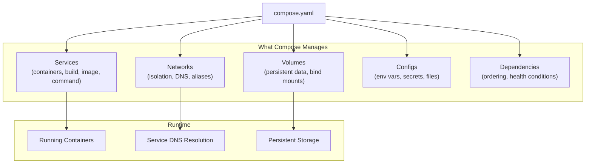
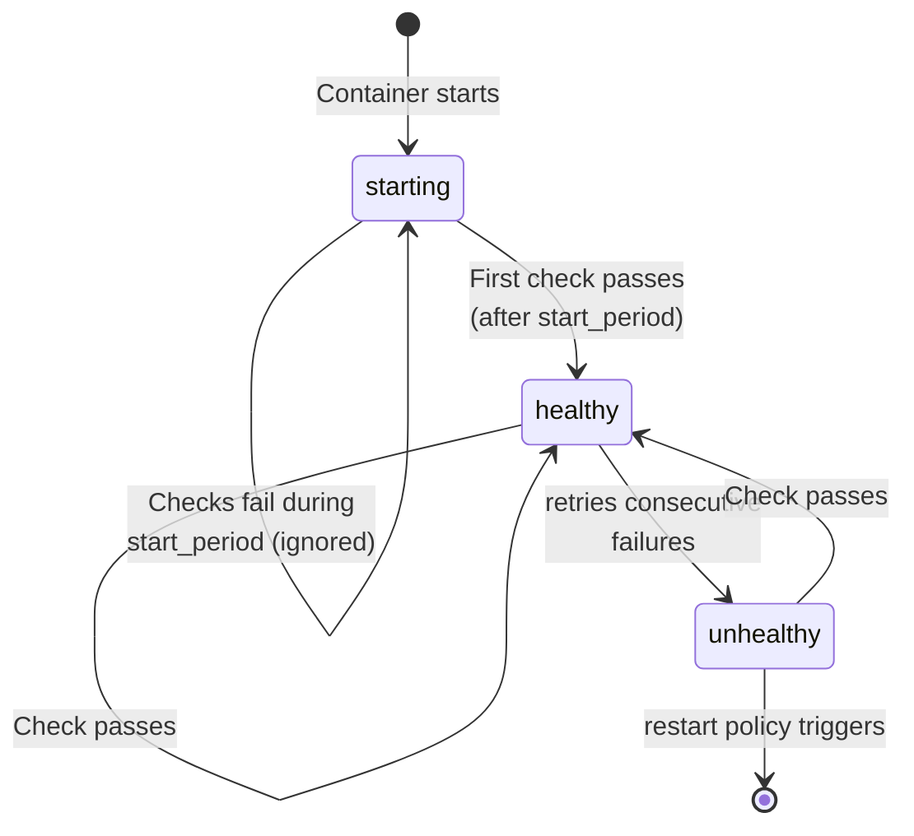
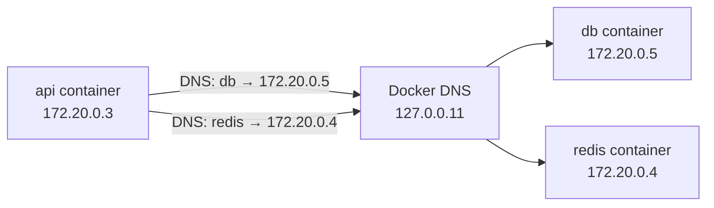
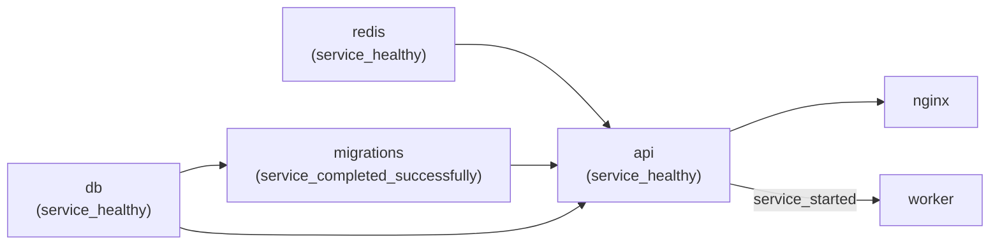

# Docker Compose Patterns

## Why Compose Matters

Every production application is a system of cooperating processes. Even a minimal web application involves an application server, a database, and probably a cache. As your system grows, you add background workers, message queues, reverse proxies, and monitoring sidecars. Each of these needs to be configured with the correct network access, volume mounts, environment variables, restart policies, and startup ordering.

Running this manually — `docker run` with 15 flags per container, repeated for each service — is fragile and impossible to reproduce. Docker Compose solves this by encoding your entire multi-container application in a single declarative YAML file. But Compose is not just a convenience tool for running containers together. When used properly, it becomes the single source of truth for your local development environment, your CI/CD test infrastructure, and (for smaller deployments) even production.

The key insight behind Compose is that **infrastructure is a dependency graph**. Your API depends on a healthy database. Your worker depends on a healthy message queue. Your reverse proxy depends on healthy application servers. Compose makes this dependency graph explicit and manages the lifecycle accordingly.



### When Compose Is the Right Tool

| Scenario | Compose | Kubernetes | Plain Docker |
|----------|---------|-----------|-------------|
| Local development | Best | Overkill | Tedious |
| CI/CD integration tests | Best | Slow setup | Fragile scripts |
| Single-server production | Acceptable | Overkill | Unmaintainable |
| Multi-server production | Not suitable | Best | Not possible |
| Demo / evaluation environments | Best | Over-engineered | Manual |
| Edge / IoT deployment | Good | K3s / K0s | Limited |

## Multi-Service Patterns

### The Classic Web Stack

The most common pattern: a web application server fronted by a reverse proxy, backed by a relational database and an in-memory cache, with asynchronous work handled by background workers.

```yaml
# compose.yaml — Complete web application stack
name: webapp

services:
  # ── Reverse Proxy ──────────────────────────────
  nginx:
    image: nginx:1.27-alpine
    ports:
      - "80:80"
      - "443:443"
    volumes:
      - ./nginx/nginx.conf:/etc/nginx/nginx.conf:ro
      - ./nginx/conf.d:/etc/nginx/conf.d:ro
      - ./certbot/www:/var/www/certbot:ro
      - ./certbot/conf:/etc/letsencrypt:ro
    depends_on:
      api:
        condition: service_healthy
    networks:
      - frontend
      - backend
    restart: unless-stopped

  # ── Application Server ─────────────────────────
  api:
    build:
      context: .
      dockerfile: Dockerfile
      target: production
    environment:
      NODE_ENV: production
      DATABASE_URL: postgresql://${DB_USER:-app}:${DB_PASSWORD}@db:5432/${DB_NAME:-webapp}
      REDIS_URL: redis://redis:6379
      AMQP_URL: amqp://rabbitmq:5672
    depends_on:
      db:
        condition: service_healthy
      redis:
        condition: service_healthy
      rabbitmq:
        condition: service_healthy
    healthcheck:
      test: ["CMD", "wget", "--spider", "-q", "http://localhost:3000/health"]
      interval: 15s
      timeout: 5s
      retries: 3
      start_period: 20s
    networks:
      - backend
    restart: unless-stopped

  # ── Background Worker ──────────────────────────
  worker:
    build:
      context: .
      dockerfile: Dockerfile
      target: production
    command: ["node", "dist/worker.js"]
    environment:
      NODE_ENV: production
      DATABASE_URL: postgresql://${DB_USER:-app}:${DB_PASSWORD}@db:5432/${DB_NAME:-webapp}
      REDIS_URL: redis://redis:6379
      AMQP_URL: amqp://rabbitmq:5672
    depends_on:
      db:
        condition: service_healthy
      redis:
        condition: service_healthy
      rabbitmq:
        condition: service_healthy
    networks:
      - backend
    restart: unless-stopped

  # ── Database ───────────────────────────────────
  db:
    image: postgres:16-alpine
    environment:
      POSTGRES_USER: ${DB_USER:-app}
      POSTGRES_PASSWORD: ${DB_PASSWORD:?DB_PASSWORD must be set}
      POSTGRES_DB: ${DB_NAME:-webapp}
    volumes:
      - pg_data:/var/lib/postgresql/data
      - ./db/init:/docker-entrypoint-initdb.d:ro
    healthcheck:
      test: ["CMD-SHELL", "pg_isready -U ${DB_USER:-app} -d ${DB_NAME:-webapp}"]
      interval: 10s
      timeout: 5s
      retries: 5
      start_period: 30s
    networks:
      - backend
    restart: unless-stopped

  # ── Cache ──────────────────────────────────────
  redis:
    image: redis:7-alpine
    command: >
      redis-server
      --maxmemory 256mb
      --maxmemory-policy allkeys-lru
      --appendonly yes
    volumes:
      - redis_data:/data
    healthcheck:
      test: ["CMD", "redis-cli", "ping"]
      interval: 10s
      timeout: 3s
      retries: 5
    networks:
      - backend
    restart: unless-stopped

  # ── Message Queue ──────────────────────────────
  rabbitmq:
    image: rabbitmq:3.13-management-alpine
    environment:
      RABBITMQ_DEFAULT_USER: ${RABBITMQ_USER:-guest}
      RABBITMQ_DEFAULT_PASS: ${RABBITMQ_PASS:-guest}
    volumes:
      - rabbitmq_data:/var/lib/rabbitmq
    healthcheck:
      test: ["CMD", "rabbitmq-diagnostics", "-q", "check_running"]
      interval: 15s
      timeout: 10s
      retries: 5
      start_period: 30s
    networks:
      - backend
    restart: unless-stopped

networks:
  frontend:
    driver: bridge
  backend:
    driver: bridge
    internal: true   # No external access — only reachable via nginx

volumes:
  pg_data:
  redis_data:
  rabbitmq_data:
```

The `internal: true` on the backend network is critical for security — it prevents any container on that network from making outbound connections to the internet or being reached from outside. Only `nginx`, which is on both `frontend` and `backend`, can bridge the two.

## Healthchecks

Healthchecks are the backbone of reliable Compose orchestration. Without them, `depends_on` only waits for a container to **start**, not for the service inside it to be **ready**. A PostgreSQL container starts in milliseconds, but the database engine inside it takes seconds to initialize — and your application will crash if it tries to connect during that window.

### Anatomy of a Healthcheck

```yaml
healthcheck:
  test: ["CMD-SHELL", "pg_isready -U postgres"]  # The check command
  interval: 10s       # Time between checks
  timeout: 5s         # Max time for a single check to respond
  retries: 5          # Consecutive failures before marking unhealthy
  start_period: 30s   # Grace period — failures during this window don't count
```



### Healthcheck Commands for Common Services

| Service | Healthcheck Command | Notes |
|---------|-------------------|-------|
| PostgreSQL | `pg_isready -U $USER -d $DB` | Checks if PG accepts connections |
| MySQL | `mysqladmin ping -h localhost` | Basic liveness check |
| Redis | `redis-cli ping` | Returns PONG if healthy |
| MongoDB | `mongosh --eval "db.adminCommand('ping')"` | Requires mongosh in image |
| RabbitMQ | `rabbitmq-diagnostics -q check_running` | Full node health |
| Elasticsearch | `curl -sf http://localhost:9200/_cluster/health` | Cluster-level health |
| Kafka | `kafka-broker-api-versions --bootstrap-server localhost:9092` | Broker availability |
| Nginx | `curl -sf http://localhost/health` | Requires health endpoint |
| Custom HTTP | `wget --spider -q http://localhost:PORT/health` | Works in Alpine images |

::: warning CMD vs CMD-SHELL
`["CMD", "redis-cli", "ping"]` executes the command directly (no shell). `["CMD-SHELL", "curl -sf http://localhost:3000/health || exit 1"]` runs through `/bin/sh -c`, which is needed for pipes, `||`, variable expansion, and redirections. Prefer `CMD` when possible — it avoids shell overhead and signal handling issues.
:::

### The start_period Trap

The `start_period` does **not** mean "wait this long before starting checks." Checks begin immediately, but failures during the start period do not count toward the retry threshold. This means:

```yaml
healthcheck:
  test: ["CMD", "redis-cli", "ping"]
  interval: 5s
  retries: 3
  start_period: 30s
  timeout: 3s
```

- `t=0s`: Container starts. First check runs. Fails (Redis not ready). Ignored (within start_period).
- `t=5s`: Second check. Fails. Ignored.
- `t=10s`: Third check. Succeeds. Status: **healthy**.
- If instead, the service takes 35 seconds to start:
  - `t=30s`: start_period ends. Checks now count.
  - `t=35s`: Check fails. Failure count: 1/3.
  - `t=40s`: Check fails. Failure count: 2/3.
  - `t=45s`: Check fails. Failure count: 3/3. Status: **unhealthy**.

## Networking

### How Compose DNS Works

Compose automatically creates a default network for each project and registers each service name as a DNS entry. When the `api` service runs `getaddrinfo("db")`, Docker's embedded DNS server resolves it to the IP address of the `db` container.



::: tip Service Names Are Hostnames
Every service name in your `compose.yaml` becomes a DNS hostname. `DATABASE_URL=postgresql://user:pass@db:5432/mydb` works because `db` resolves to the database container's IP. You never need to hardcode container IPs.
:::

### Custom Networks and Isolation

```yaml
networks:
  # Public-facing network — containers here can reach the internet
  frontend:
    driver: bridge

  # Internal network — no external connectivity
  backend:
    driver: bridge
    internal: true

  # Custom subnet for predictable IPs (rare use case)
  monitoring:
    driver: bridge
    ipam:
      config:
        - subnet: 172.28.0.0/16

services:
  nginx:
    networks:
      - frontend
      - backend    # Bridge between public and private

  api:
    networks:
      backend:
        aliases:
          - app           # Also reachable as "app" on this network
          - api-service   # Multiple aliases allowed

  db:
    networks:
      - backend          # Only on internal network

  prometheus:
    networks:
      backend:
        ipv4_address: 172.28.0.10   # Fixed IP (for static scrape configs)
      monitoring:
```

### Network Aliases

Aliases let a single container respond to multiple DNS names on the same network. This is useful for gradual service renames or when different consumers know a service by different names:

```yaml
services:
  postgres:
    image: postgres:16-alpine
    networks:
      backend:
        aliases:
          - db            # Legacy name used by older services
          - database      # Descriptive name
          - pg            # Short name
```

All three aliases (`db`, `database`, `pg`) plus the service name (`postgres`) resolve to the same container on the `backend` network.

## Volumes

### Volume Types

```yaml
services:
  api:
    volumes:
      # Named volume — managed by Docker, persists across restarts
      - app_uploads:/app/uploads

      # Bind mount — maps host directory into container
      - ./src:/app/src:ro

      # tmpfs mount — in-memory, not persisted, good for secrets/temp data
      - type: tmpfs
        target: /app/tmp
        tmpfs:
          size: 100M
          mode: 1777

volumes:
  app_uploads:
    driver: local    # Default driver
```

| Type | Persistence | Performance | Use Case |
|------|------------|-------------|----------|
| Named volume | Survives container removal | Native filesystem speed | Database data, uploaded files |
| Bind mount | Tied to host path | Varies (slow on macOS) | Source code in development |
| tmpfs | Lost on container stop | RAM speed | Temporary files, secrets |

::: danger Bind Mount Performance on macOS / Windows
Docker Desktop runs Linux in a VM. Bind mounts must synchronize files between your host filesystem and the Linux VM. This adds latency that can make builds and tests 5-20x slower. Use named volumes for dependency directories (`node_modules`, `vendor/bundle`) and bind-mount only your source code.
:::

### Volume Drivers and Backup

```yaml
volumes:
  pg_data:
    driver: local
    driver_opts:
      type: none
      o: bind
      device: /mnt/fast-ssd/postgres   # Use specific disk

  # NFS mount (shared across hosts)
  shared_assets:
    driver: local
    driver_opts:
      type: nfs
      o: addr=10.0.1.100,rw,nfsvers=4
      device: ":/exports/assets"
```

Backup pattern for named volumes:

```bash
# Backup a named volume to a tar file
docker run --rm \
  -v pg_data:/data:ro \
  -v $(pwd)/backups:/backup \
  alpine tar czf /backup/pg_data_$(date +%Y%m%d).tar.gz -C /data .

# Restore from backup
docker run --rm \
  -v pg_data:/data \
  -v $(pwd)/backups:/backup \
  alpine sh -c "cd /data && tar xzf /backup/pg_data_20260401.tar.gz"
```

## Environment Management

### The .env File

Compose automatically loads variables from a `.env` file in the same directory as `compose.yaml`:

```bash
# .env — loaded automatically by Compose
DB_USER=webapp
DB_PASSWORD=s3cret_pr0d_p@ss
DB_NAME=webapp_production
REDIS_MAXMEM=512mb
NODE_ENV=production
API_REPLICAS=3
```

```yaml
# compose.yaml — reference .env variables with ${VAR} or ${VAR:-default}
services:
  api:
    environment:
      DATABASE_URL: postgresql://${DB_USER}:${DB_PASSWORD}@db:5432/${DB_NAME}
    deploy:
      replicas: ${API_REPLICAS:-1}
```

### Variable Interpolation Rules

| Syntax | Behavior |
|--------|----------|
| `${VAR}` | Value of VAR. Error if unset. |
| `${VAR:-default}` | Value of VAR, or "default" if unset or empty |
| `${VAR-default}` | Value of VAR, or "default" if unset (empty string is kept) |
| `${VAR:?error msg}` | Value of VAR. Abort with "error msg" if unset or empty |
| `${VAR?error msg}` | Value of VAR. Abort with "error msg" if unset |

::: warning Never Commit .env Files
Add `.env` to `.gitignore`. Provide a `.env.example` with placeholder values instead. In CI/CD, inject variables through the pipeline's secret management, not through files.
:::

### Docker Secrets (Compose v2)

For sensitive data, Docker secrets are safer than environment variables because they are mounted as files rather than visible in `docker inspect`:

```yaml
services:
  db:
    image: postgres:16-alpine
    environment:
      POSTGRES_PASSWORD_FILE: /run/secrets/db_password
    secrets:
      - db_password

  api:
    environment:
      DATABASE_URL_FILE: /run/secrets/database_url
    secrets:
      - database_url

secrets:
  db_password:
    file: ./secrets/db_password.txt    # From a file
  database_url:
    environment: DATABASE_URL          # From host environment variable
```

::: tip Not All Images Support _FILE
The `_FILE` suffix convention (e.g., `POSTGRES_PASSWORD_FILE`) is implemented by the image's entrypoint script, not by Docker itself. Official images (postgres, mysql, redis) support it. Your custom images need to read the file explicitly: `export DB_PASS=$(cat /run/secrets/db_password)`.
:::

## Dev vs Prod Compose

### Override Files

The recommended approach for environment-specific config is a base file with override files:

```
project/
  compose.yaml            # Base — shared service definitions
  compose.override.yaml   # Auto-loaded in dev (docker compose up)
  compose.prod.yaml       # Explicit for production (-f compose.yaml -f compose.prod.yaml)
  compose.test.yaml       # Explicit for CI/CD
  .env                    # Default env vars
  .env.production         # Production env vars
```

```yaml
# compose.override.yaml — automatically merged with compose.yaml
# This file is for development convenience
services:
  api:
    build:
      target: development
    ports:
      - "3000:3000"       # Direct access (no nginx in dev)
      - "9229:9229"       # Node.js debugger
    volumes:
      - ./src:/app/src    # Hot reload via bind mount
    environment:
      NODE_ENV: development
      LOG_LEVEL: debug
    command: ["npx", "tsx", "watch", "src/server.ts"]

  db:
    ports:
      - "5432:5432"       # Direct access for DB tools

  redis:
    ports:
      - "6379:6379"       # Direct access for redis-cli

  # Dev-only service
  pgadmin:
    image: dpage/pgadmin4:latest
    environment:
      PGADMIN_DEFAULT_EMAIL: dev@local.dev
      PGADMIN_DEFAULT_PASSWORD: dev
    ports:
      - "5050:80"
    depends_on:
      - db
    profiles:
      - tools             # Only starts with --profile tools
```

```yaml
# compose.prod.yaml — production overrides
services:
  api:
    build:
      target: production
    deploy:
      replicas: 3
      resources:
        limits:
          cpus: "1.0"
          memory: 512M
        reservations:
          cpus: "0.25"
          memory: 128M
    environment:
      NODE_ENV: production
      LOG_LEVEL: warn
    logging:
      driver: json-file
      options:
        max-size: "50m"
        max-file: "5"
    read_only: true
    tmpfs:
      - /tmp:size=100M
    security_opt:
      - no-new-privileges:true

  worker:
    deploy:
      replicas: 2
      resources:
        limits:
          cpus: "0.5"
          memory: 256M

  db:
    deploy:
      resources:
        limits:
          cpus: "2.0"
          memory: 2G
    command: >
      postgres
      -c shared_buffers=512MB
      -c effective_cache_size=1536MB
      -c work_mem=16MB
      -c maintenance_work_mem=128MB
      -c max_connections=200
```

### Profiles

Profiles let you define services that only start when explicitly requested:

```yaml
services:
  api:
    # No profile — always starts
    build: .

  db:
    # No profile — always starts
    image: postgres:16-alpine

  pgadmin:
    profiles: ["debug"]
    image: dpage/pgadmin4

  prometheus:
    profiles: ["monitoring"]
    image: prom/prometheus

  grafana:
    profiles: ["monitoring"]
    image: grafana/grafana

  k6:
    profiles: ["loadtest"]
    image: grafana/k6
```

```bash
# Start core services only
docker compose up

# Start core + monitoring
docker compose --profile monitoring up

# Start everything
docker compose --profile debug --profile monitoring --profile loadtest up
```

## Dependency Ordering

### depends_on with Conditions

Plain `depends_on` only waits for a container to start. Use `condition: service_healthy` to wait for actual readiness:

```yaml
services:
  migrations:
    build: .
    command: ["npx", "prisma", "migrate", "deploy"]
    depends_on:
      db:
        condition: service_healthy    # Wait for PG to accept connections
    restart: "no"                     # Run once and exit

  api:
    build: .
    depends_on:
      db:
        condition: service_healthy
      redis:
        condition: service_healthy
      migrations:
        condition: service_completed_successfully   # Wait for migration to finish

  worker:
    build: .
    command: ["node", "dist/worker.js"]
    depends_on:
      api:
        condition: service_started    # Just needs API container to be running
```



| Condition | Waits For | Use Case |
|-----------|----------|----------|
| `service_started` | Container is running (default) | Services that boot quickly |
| `service_healthy` | Healthcheck passes | Databases, caches, queues |
| `service_completed_successfully` | Container exits with code 0 | Migrations, seed scripts |

## Resource Limits

```yaml
services:
  api:
    deploy:
      resources:
        limits:
          cpus: "1.0"        # Hard ceiling — container is throttled beyond this
          memory: 512M        # Hard ceiling — container is OOM-killed beyond this
          pids: 100           # Max number of processes
        reservations:
          cpus: "0.25"        # Guaranteed minimum CPU
          memory: 128M        # Guaranteed minimum memory
```

::: warning Reservations vs Limits
**Reservations** are guarantees — Docker will not schedule the container on a host that cannot provide this minimum. **Limits** are ceilings — the container is throttled (CPU) or killed (memory) if it exceeds them. Always set both. A container with a limit but no reservation may be starved by other containers.
:::

## Logging Configuration

```yaml
services:
  api:
    logging:
      driver: json-file       # Default driver
      options:
        max-size: "50m"       # Rotate at 50MB
        max-file: "5"         # Keep 5 rotated files
        tag: "api-{​{.Name}}"  # Tag for filtering

  # Alternative: log to syslog
  worker:
    logging:
      driver: syslog
      options:
        syslog-address: "tcp://logstash:5000"
        tag: "worker"

  # Alternative: log to fluentd
  scheduler:
    logging:
      driver: fluentd
      options:
        fluentd-address: "localhost:24224"
        tag: "app.scheduler"
```

::: danger Log Rotation Is Not Optional
Without `max-size` and `max-file`, Docker stores logs indefinitely in `/var/lib/docker/containers/<id>/<id>-json.log`. A busy service writing 1 GB/day of logs fills a 50 GB disk in under two months. Always set log rotation — or configure a centralized logging driver that handles retention externally.
:::

## Docker Compose Watch

Docker Compose Watch (v2.22+) provides hot reload without bind mounts. This is particularly valuable on macOS/Windows where bind mount performance is poor:

```yaml
services:
  api:
    build:
      context: .
      dockerfile: Dockerfile
    develop:
      watch:
        # Sync source code changes — fast, no rebuild
        - action: sync
          path: ./src
          target: /app/src
          ignore:
            - "**/*.test.ts"
            - "**/__tests__/"

        # Sync config changes and restart the process
        - action: sync+restart
          path: ./config
          target: /app/config

        # Full rebuild on dependency changes
        - action: rebuild
          path: ./package.json

        # Full rebuild on Dockerfile changes
        - action: rebuild
          path: ./Dockerfile
```

```bash
# Start with watch mode
docker compose watch

# Watch with build (rebuilds first, then watches)
docker compose watch --no-up
docker compose up --build --watch
```

| Action | What Happens | Speed | Use Case |
|--------|-------------|-------|----------|
| `sync` | File copied into running container | Milliseconds | Source code with hot-reload |
| `sync+restart` | File copied, then container process restarted | Seconds | Config files, env files |
| `rebuild` | Image rebuilt, container recreated | 10-60 seconds | Dependency or Dockerfile changes |

## Multi-Stage Builds in Compose

Compose integrates directly with multi-stage Dockerfiles via the `target` field:

```dockerfile
# Dockerfile
FROM node:22-alpine AS base
WORKDIR /app
COPY package*.json ./

FROM base AS development
RUN npm install
COPY . .
CMD ["npx", "tsx", "watch", "src/server.ts"]

FROM base AS build
RUN npm ci
COPY . .
RUN npm run build

FROM node:22-alpine AS production
WORKDIR /app
RUN addgroup -g 1001 appgroup && adduser -u 1001 -G appgroup -D appuser
COPY --from=build /app/dist ./dist
COPY --from=build /app/node_modules ./node_modules
COPY --from=build /app/package.json ./
USER appuser
EXPOSE 3000
CMD ["node", "dist/server.js"]
```

```yaml
# compose.yaml
services:
  api:
    build:
      context: .
      dockerfile: Dockerfile
      # target is set per-environment in override files

# compose.override.yaml (development)
services:
  api:
    build:
      target: development

# compose.prod.yaml (production)
services:
  api:
    build:
      target: production
```

## Common Real-World Stack Patterns

### Reverse Proxy + App + DB (Minimal Production)

```yaml
name: minimal-prod

services:
  caddy:
    image: caddy:2-alpine
    ports:
      - "80:80"
      - "443:443"
    volumes:
      - ./Caddyfile:/etc/caddy/Caddyfile:ro
      - caddy_data:/data
      - caddy_config:/config
    depends_on:
      app:
        condition: service_healthy
    restart: unless-stopped

  app:
    build: .
    environment:
      DATABASE_URL: postgresql://app:${DB_PASS}@db:5432/production
    healthcheck:
      test: ["CMD", "wget", "--spider", "-q", "http://localhost:8080/health"]
      interval: 15s
      timeout: 5s
      retries: 3
      start_period: 15s
    restart: unless-stopped

  db:
    image: postgres:16-alpine
    environment:
      POSTGRES_USER: app
      POSTGRES_PASSWORD: ${DB_PASS}
      POSTGRES_DB: production
    volumes:
      - pg_data:/var/lib/postgresql/data
    healthcheck:
      test: ["CMD-SHELL", "pg_isready -U app"]
      interval: 10s
      timeout: 5s
      retries: 5
      start_period: 30s
    restart: unless-stopped

volumes:
  caddy_data:
  caddy_config:
  pg_data:
```

### Message Queue Consumer Pattern

```yaml
name: queue-consumers

services:
  api:
    build: .
    environment:
      AMQP_URL: amqp://rabbitmq:5672
    depends_on:
      rabbitmq:
        condition: service_healthy

  # Multiple specialized workers consuming different queues
  email-worker:
    build: .
    command: ["node", "dist/workers/email.js"]
    environment:
      QUEUE_NAME: emails
      AMQP_URL: amqp://rabbitmq:5672
      CONCURRENCY: "5"
    deploy:
      replicas: 2
    depends_on:
      rabbitmq:
        condition: service_healthy
    restart: unless-stopped

  pdf-worker:
    build: .
    command: ["node", "dist/workers/pdf.js"]
    environment:
      QUEUE_NAME: pdf-generation
      AMQP_URL: amqp://rabbitmq:5672
      CONCURRENCY: "2"
    deploy:
      resources:
        limits:
          memory: 1G      # PDF generation is memory-intensive
    depends_on:
      rabbitmq:
        condition: service_healthy
    restart: unless-stopped

  rabbitmq:
    image: rabbitmq:3.13-management-alpine
    volumes:
      - rabbitmq_data:/var/lib/rabbitmq
    healthcheck:
      test: ["CMD", "rabbitmq-diagnostics", "-q", "check_running"]
      interval: 15s
      timeout: 10s
      retries: 5
      start_period: 30s
    restart: unless-stopped

volumes:
  rabbitmq_data:
```

### ELK Stack (Logging Infrastructure)

```yaml
name: elk-stack

services:
  elasticsearch:
    image: docker.elastic.co/elasticsearch/elasticsearch:8.13.0
    environment:
      - discovery.type=single-node
      - xpack.security.enabled=false
      - "ES_JAVA_OPTS=-Xms1g -Xmx1g"
    volumes:
      - es_data:/usr/share/elasticsearch/data
    healthcheck:
      test: ["CMD-SHELL", "curl -sf http://localhost:9200/_cluster/health || exit 1"]
      interval: 15s
      timeout: 10s
      retries: 5
      start_period: 60s
    deploy:
      resources:
        limits:
          memory: 2G
    restart: unless-stopped

  logstash:
    image: docker.elastic.co/logstash/logstash:8.13.0
    volumes:
      - ./logstash/pipeline:/usr/share/logstash/pipeline:ro
    depends_on:
      elasticsearch:
        condition: service_healthy
    restart: unless-stopped

  kibana:
    image: docker.elastic.co/kibana/kibana:8.13.0
    environment:
      ELASTICSEARCH_HOSTS: http://elasticsearch:9200
    ports:
      - "5601:5601"
    depends_on:
      elasticsearch:
        condition: service_healthy
    restart: unless-stopped

volumes:
  es_data:
```

### Monitoring Stack (Prometheus + Grafana)

```yaml
name: monitoring

services:
  prometheus:
    image: prom/prometheus:v2.51.0
    volumes:
      - ./prometheus/prometheus.yml:/etc/prometheus/prometheus.yml:ro
      - ./prometheus/rules:/etc/prometheus/rules:ro
      - prometheus_data:/prometheus
    command:
      - "--config.file=/etc/prometheus/prometheus.yml"
      - "--storage.tsdb.retention.time=30d"
      - "--web.enable-lifecycle"
    ports:
      - "9090:9090"
    restart: unless-stopped

  grafana:
    image: grafana/grafana:10.4.0
    environment:
      GF_SECURITY_ADMIN_USER: ${GRAFANA_USER:-admin}
      GF_SECURITY_ADMIN_PASSWORD: ${GRAFANA_PASS:-admin}
    volumes:
      - grafana_data:/var/lib/grafana
      - ./grafana/provisioning:/etc/grafana/provisioning:ro
    ports:
      - "3000:3000"
    depends_on:
      - prometheus
    restart: unless-stopped

  node-exporter:
    image: prom/node-exporter:v1.7.0
    pid: host
    volumes:
      - /proc:/host/proc:ro
      - /sys:/host/sys:ro
      - /:/rootfs:ro
    command:
      - "--path.procfs=/host/proc"
      - "--path.sysfs=/host/sys"
      - "--collector.filesystem.mount-points-exclude=^/(sys|proc|dev|host|etc)($$|/)"
    restart: unless-stopped

volumes:
  prometheus_data:
  grafana_data:
```

## Debugging Tips

### Inspecting a Running Stack

```bash
# View running services and their status
docker compose ps

# View logs for a specific service (follow mode)
docker compose logs -f api

# View logs for multiple services with timestamps
docker compose logs -f --timestamps api worker

# Execute a command inside a running container
docker compose exec api sh

# Run a one-off command (creates a new container)
docker compose run --rm api npm run migrate

# View resource usage
docker compose top
docker stats
```

### Common Failure Scenarios

```bash
# Service won't start — check build logs
docker compose build --no-cache api
docker compose up api 2>&1 | head -50

# Service starts but is unhealthy — run healthcheck manually
docker compose exec db pg_isready -U postgres

# Network connectivity issues — verify DNS resolution
docker compose exec api nslookup db
docker compose exec api wget -qO- http://db:5432 || echo "Connection check"

# Volume permission issues — check file ownership
docker compose exec api ls -la /app/uploads

# Port conflicts — find what's using the port
# On Linux:
# ss -tlnp | grep :3000
# On macOS:
# lsof -i :3000
```

### Validate Configuration Without Starting

```bash
# Check for syntax errors
docker compose config

# Show resolved configuration (with all overrides applied)
docker compose -f compose.yaml -f compose.prod.yaml config

# Show only service names
docker compose config --services

# Show only volumes
docker compose config --volumes

# Dry-run (Compose v2.27+)
docker compose up --dry-run
```

## Compose in CI/CD

```yaml
# .github/workflows/test.yml
name: Integration Tests

on: [push, pull_request]

jobs:
  test:
    runs-on: ubuntu-latest
    steps:
      - uses: actions/checkout@v4

      - name: Start services
        run: docker compose -f compose.yaml -f compose.test.yaml up -d --wait
        # --wait blocks until all healthchecks pass

      - name: Run migrations
        run: docker compose exec -T api npx prisma migrate deploy

      - name: Run tests
        run: docker compose exec -T api npm test

      - name: Collect logs on failure
        if: failure()
        run: docker compose logs --timestamps > compose-logs.txt

      - name: Upload logs artifact
        if: failure()
        uses: actions/upload-artifact@v4
        with:
          name: compose-logs
          path: compose-logs.txt

      - name: Teardown
        if: always()
        run: docker compose down -v    # -v removes volumes for clean state
```

```yaml
# compose.test.yaml — CI/CD-specific overrides
services:
  api:
    build:
      target: development    # Includes dev dependencies for testing
    environment:
      NODE_ENV: test
      DATABASE_URL: postgresql://test:test@db:5432/test_db
      LOG_LEVEL: error       # Reduce noise in CI logs

  db:
    environment:
      POSTGRES_USER: test
      POSTGRES_PASSWORD: test
      POSTGRES_DB: test_db
    tmpfs:
      - /var/lib/postgresql/data   # Use tmpfs for speed — data is ephemeral in CI
```

::: tip The --wait Flag
`docker compose up --wait` blocks until all services with healthchecks report healthy. This is the recommended approach for CI/CD — it replaces fragile `sleep 30` commands and custom polling scripts. Added in Compose v2.1.1.
:::

---

## Key Takeaway

::: info Key Takeaway
Docker Compose is not just a convenience tool for starting multiple containers — it is a declarative specification of your application's runtime topology. The most impactful patterns are: using `condition: service_healthy` in `depends_on` to prevent cascade failures during startup, separating base config from environment overrides to maintain dev-prod parity, and treating the `compose.yaml` as a living document that reflects the actual dependency graph of your system. When Compose is used well, any developer can clone a repo, run `docker compose up`, and have a fully functional local environment in under a minute.
:::

---

## Common Misconceptions

::: warning Common Misconceptions

**1. "Docker Compose is only for development."**
Compose is excellent for development, but it is also suitable for single-server production deployments, CI/CD testing, and demo environments. Companies successfully run Compose in production for applications that do not need multi-host orchestration. The key is adding proper monitoring, log rotation, backup, and restart policies — things Kubernetes gives you by default.

**2. "depends_on guarantees my database is ready."**
Without `condition: service_healthy`, `depends_on` only waits for the container to be **created**, not for the service inside to be accepting connections. Your application will crash on startup if it tries to connect to PostgreSQL before `pg_isready` returns success.

**3. "Environment variables in compose.yaml are secure."**
Environment variables are visible in `docker inspect`, in `/proc/<pid>/environ` inside the container, and in your compose file (which is likely in version control). Use Docker secrets for sensitive data — they are mounted as files and are not exposed through inspect.

**4. "I need Kubernetes for replicas."**
Compose supports `deploy.replicas` for running multiple instances of a service. Combined with a reverse proxy (Nginx, Caddy, Traefik), you get basic load balancing on a single host. This covers many small-to-medium workloads that do not need distributed scheduling.

**5. "Bind mounts and named volumes are interchangeable."**
Bind mounts have fundamentally different behavior. They bypass Docker's storage driver, have different permission semantics, perform poorly on macOS/Windows, and are tied to a specific host path. Use named volumes for data that should persist (databases, uploads) and bind mounts only for development hot-reload.

**6. "docker compose down removes everything."**
`docker compose down` removes containers and the default network, but **preserves named volumes**. To also remove volumes, use `docker compose down -v`. To remove images too, use `docker compose down --rmi all`. Forgetting `-v` is how "phantom data" survives across rebuilds.
:::

---

## When NOT to Use Docker Compose

| Scenario | Why Not | Better Alternative |
|----------|---------|-------------------|
| Multi-host production deployments | No cross-host networking or scheduling | Kubernetes, Docker Swarm |
| Auto-scaling based on load | No built-in auto-scaling | Kubernetes HPA, cloud auto-scaling |
| Zero-downtime rolling deployments | Limited rolling update support | Kubernetes Deployments |
| Highly available stateful services | No leader election, no consensus | Managed databases, Kubernetes StatefulSets |
| Complex service mesh with mTLS | No service mesh capabilities | Istio, Linkerd |
| When your team already uses Kubernetes | Adding Compose creates tooling fragmentation | Tilt, Skaffold, or DevSpace for K8s dev |

---

## In Production

::: warning Production Considerations

**Restart policies are not optional.** Always set `restart: unless-stopped` (or `on-failure` with `max_attempts`) for production services. Without it, a crashed container stays dead until someone notices and manually restarts it.

**Log rotation prevents disk exhaustion.** Set `max-size` and `max-file` on every service's logging config, or configure a centralized logging driver. A single chatty service can fill a 100 GB disk in days.

**Named volumes are your data.** Back them up. `docker compose down -v` irreversibly deletes all named volumes. In CI/CD, `-v` is correct (clean state). In production, it is catastrophic. Automate volume backups and test restores.

**Health checks determine startup order.** If your application crashes on startup because the database is not ready, the fix is almost always adding a healthcheck to the database service and `condition: service_healthy` to the application's `depends_on` — not a retry loop in the application code.

**Resource limits prevent noisy neighbors.** Without memory limits, a single leaking service can OOM-kill the entire host. Set `deploy.resources.limits` for every service in production. Start with generous limits and tighten based on monitoring.

**Use `docker compose up --wait` in CI/CD.** It replaces fragile sleep-based polling. The command blocks until all services with healthchecks report healthy, or fails with a clear error if a service cannot start.
:::

---

## Quiz

::: details Quiz — 7 Questions

**Q1: What is the difference between `depends_on: [db]` and `depends_on: { db: { condition: service_healthy } }`?**
The first form (`depends_on: [db]`) only waits for the `db` container to be created and started — it does not check whether the database engine is actually accepting connections. The second form waits for the `db` service's healthcheck to pass before starting the dependent service. Without the healthcheck condition, your application may crash on startup if it tries to connect before PostgreSQL is ready.

**Q2: Why does `docker compose down` not remove database data, but `docker compose down -v` does?**
`docker compose down` removes containers and the default network but preserves named volumes (like `pg_data`). The `-v` flag additionally removes all named volumes defined in the compose file. This is a safety measure — persistent data should not be accidentally deleted when rebuilding containers.

**Q3: What is the difference between `sync`, `sync+restart`, and `rebuild` in Docker Compose Watch?**
`sync` copies changed files into the running container without any restart — useful for source code with hot module reload. `sync+restart` copies the files and then restarts the container's main process — useful for config files that are read once at startup. `rebuild` triggers a full image rebuild and container recreation — necessary when dependencies or the Dockerfile itself change.

**Q4: Why should you use `internal: true` on backend networks?**
An `internal: true` network has no gateway, so containers on it cannot make outbound connections to the internet and cannot be reached from outside Docker. This is a defense-in-depth measure that prevents your database from being accidentally exposed and limits the blast radius if a container is compromised.

**Q5: What does `start_period` in a healthcheck actually do?**
The `start_period` defines a grace window after the container starts. Health checks run during this period, but failures do not count toward the `retries` threshold. This gives slow-starting services (like Java applications or databases) time to initialize without being prematurely marked as unhealthy. Checks that succeed during the start period immediately mark the service as healthy.

**Q6: How do Compose profiles work, and when would you use them?**
Profiles tag services as optional. Services without a profile always start. Services with a profile (e.g., `profiles: ["debug"]`) only start when that profile is explicitly activated with `--profile debug`. Use them for development-only tools (pgAdmin, mailhog), monitoring stacks, load testing infrastructure, or any service that should not run in every context.

**Q7: Why is `tmpfs` used for PostgreSQL data in CI/CD compose files?**
In CI/CD, test data is ephemeral — you do not need it to persist after the pipeline finishes. A `tmpfs` mount stores data in RAM instead of disk, which dramatically speeds up database operations (no disk I/O for writes). This can cut integration test suite time by 30-50% compared to using a regular volume.
:::

---

## Exercise

::: details Build a Complete Development Environment with Compose

**Scenario:** You are setting up a new project with the following requirements:
- A Node.js API server with hot reload
- A PostgreSQL database with a health check
- A Redis cache with a health check
- A Celery-style background worker (same codebase as API)
- Database migrations that run before the API starts
- A development mail server (Mailpit) accessible on port 8025
- An admin panel (pgAdmin) that only starts with `--profile tools`

**Tasks:**
1. Write a `compose.yaml` with all services, proper dependency ordering, and healthchecks
2. Write a `compose.override.yaml` that adds bind mounts, debug ports, and dev-only settings
3. Write a `compose.test.yaml` that uses tmpfs for the database and sets `NODE_ENV=test`
4. Write a `.env.example` with all required variables and safe defaults
5. Ensure the migration service uses `condition: service_completed_successfully`

**Evaluation criteria:**
- All services have appropriate healthchecks
- Dependency ordering prevents race conditions
- Dev override enables hot reload without rebuilding
- Test override uses tmpfs for fast ephemeral tests
- Secrets are not hardcoded in compose files
- pgAdmin only starts with `--profile tools`
- `docker compose config` validates without errors
:::

---

## One-Liner Summary

Docker Compose encodes your multi-container application as a dependency graph — use healthcheck conditions for reliable startup ordering, override files for environment parity, and profiles for optional services.

---

*Next: [Compose Patterns (Multi-Environment)](./compose-patterns.md) — Dev, staging, and production configurations with file merging and environment overrides.*
