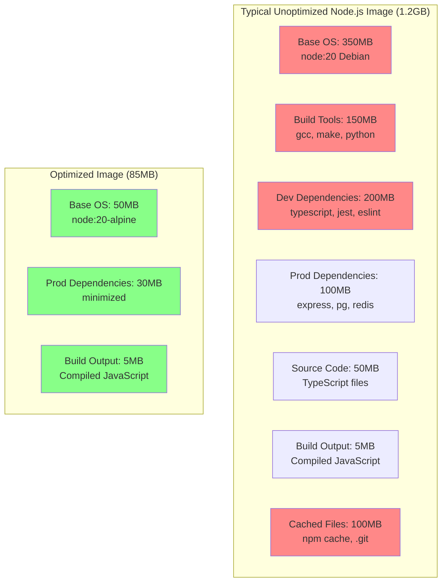

# Docker Image Optimization

## Why It Exists

Docker image size and build time directly impact every stage of the software delivery pipeline:

| Impact Area | Large Image Problem | Optimized Image Benefit |
|-------------|-------------------|------------------------|
| **CI/CD build time** | 10-15 minutes per build | 1-3 minutes per build |
| **Registry storage** | $50-200/month for 100 images | $5-20/month |
| **Pull time (deploy)** | 30-60 seconds | 2-5 seconds |
| **Horizontal scaling** | New pods take 60s to start | New pods in 5s |
| **Security surface** | 200+ CVEs in large images | 0-10 CVEs |
| **Network egress** | $100+/month in transfer costs | $10/month |

At scale, these differences are multiplied. A company with 50 microservices deploying 10 times per day moves:

$$
\text{Daily transfer} = 50 \times 10 \times 3 \text{ replicas} \times S_{image}
$$

With 500MB images: $50 \times 10 \times 3 \times 500\text{MB} = 750\text{GB/day}$

With 50MB images: $50 \times 10 \times 3 \times 50\text{MB} = 75\text{GB/day}$

The 10x reduction saves approximately $2,000/month in network costs alone, plus the immeasurable time savings for developers waiting for builds and deployments.

## First Principles

### What Makes Images Large

Every Docker image is a stack of layers. Each layer adds files. Understanding where the bytes come from is the first step to optimization.



### The Four Optimization Levers

1. **Base image** — The foundation. Alpine is 7MB, Debian is 125MB, Ubuntu is 77MB.
2. **Layer structure** — What you install and how you clean up.
3. **Build context** — What gets sent to the Docker daemon.
4. **Caching strategy** — How to maximize cache hits for fast rebuilds.

## Core Mechanics

### Analyzing Images with Dive

[Dive](https://github.com/wagoodman/dive) is an interactive tool that visualizes image layers and identifies wasted space.

```bash
# Install dive
# macOS
brew install dive

# Linux
wget https://github.com/wagoodman/dive/releases/download/v0.12.0/dive_0.12.0_linux_amd64.tar.gz
tar -xzf dive_0.12.0_linux_amd64.tar.gz
sudo mv dive /usr/local/bin/

# Analyze an image
dive myapp:latest

# CI mode (fails if efficiency is below threshold)
CI=true dive myapp:latest --ci-config .dive-ci.yaml
```

**.dive-ci.yaml:**

```yaml
rules:
  # If the efficiency is below this percentage, the CI test will fail
  lowestEfficiency: 0.95

  # If the amount of wasted space is above this, the CI test will fail
  highestWastedBytes: 20000000  # 20MB

  # If the number of wasted files is above this, the CI test will fail
  highestUserWastedPercent: 0.10  # 10%
```

**Dive output interpretation:**

```
Layer Details:
  Digest: sha256:abc123...
  Size:   156 MB
  Command: RUN npm ci

  Added files:
    /app/node_modules/typescript/       45 MB  ← dev dependency in prod!
    /app/node_modules/@types/           23 MB  ← type definitions in prod!
    /app/node_modules/jest/             34 MB  ← test framework in prod!
    /app/node_modules/express/          12 MB  ← needed
    /root/.npm/_cacache/                42 MB  ← npm cache not cleaned!
```

**Using docker history for quick analysis:**

```bash
# View layer sizes
docker history myapp:latest --format "table {​{.Size}}\t{​{.CreatedBy}}" --no-trunc

# Example output:
# SIZE      CREATED BY
# 0B        CMD ["node" "dist/server.js"]
# 5MB       COPY dist/ ./dist/
# 100MB     RUN npm ci --production
# 50KB      COPY package.json package-lock.json ./
# 0B        WORKDIR /app
# 180MB     Base image layers
```

### .dockerignore Deep Dive

The `.dockerignore` file controls what gets sent as the build context. Without it, Docker sends **everything** in the build directory to the daemon.

```bash
# Check build context size
docker build --no-cache . 2>&1 | head -5
# Sending build context to Docker daemon  523.8MB  ← Too large!
```

**Comprehensive .dockerignore:**

```
# Version control
.git
.gitignore
.gitattributes

# CI/CD
.github
.gitlab-ci.yml
.circleci
Jenkinsfile
.travis.yml

# Docker
Dockerfile*
docker-compose*
.dockerignore

# IDE and editor
.vscode
.idea
*.swp
*.swo
*~
.editorconfig

# Documentation
*.md
docs/
LICENSE
CHANGELOG*

# Testing
coverage/
.nyc_output/
__tests__/
test/
tests/
*.test.js
*.test.ts
*.spec.js
*.spec.ts
jest.config.*
.jest/

# Node.js
node_modules/
npm-debug.log*
.npm/

# Build output (rebuilt in container)
dist/
build/
out/
.next/

# Environment files
.env
.env.*
!.env.example

# OS files
.DS_Store
Thumbs.db
*.tmp

# Python
__pycache__/
*.py[cod]
*.egg-info/
.venv/
venv/
.tox/
.mypy_cache/

# Go
vendor/ (if using modules)

# Misc
*.log
*.bak
*.backup
tmp/
temp/
```

**Impact measurement:**

```bash
# Before .dockerignore
du -sh .
# 523MB

# After .dockerignore
# Create a tar to simulate what Docker sends
tar -czf /dev/null -T <(git ls-files) 2>&1
# Or:
docker build --no-cache . 2>&1 | grep "Sending"
# Sending build context to Docker daemon  4.2MB  ← 125x smaller
```

### Layer Optimization Techniques

#### 1. Combine RUN Commands

Each RUN creates a layer. Combining related commands reduces layers and eliminates intermediate files:

```dockerfile
# BAD: 3 layers, intermediate apt cache persists
RUN apt-get update
RUN apt-get install -y curl wget
RUN rm -rf /var/lib/apt/lists/*

# GOOD: 1 layer, apt cache cleaned in same layer
RUN apt-get update && \
    apt-get install -y --no-install-recommends \
    curl \
    wget && \
    rm -rf /var/lib/apt/lists/*
```

::: warning
Deleting files in a separate RUN command does NOT reduce image size. The files still exist in the previous layer. They must be deleted in the same RUN command where they were created.
:::

```dockerfile
# BAD: File still exists in Layer 1
RUN wget https://example.com/large-file.tar.gz && tar xzf large-file.tar.gz  # Layer 1: +500MB
RUN rm large-file.tar.gz                                                       # Layer 2: 0 size change

# GOOD: File downloaded, extracted, and removed in same layer
RUN wget https://example.com/large-file.tar.gz && \
    tar xzf large-file.tar.gz && \
    rm large-file.tar.gz  # Layer 1: only extracted files remain
```

#### 2. Package Manager Optimization

**Node.js:**

```dockerfile
# Install production deps only
RUN npm ci --production

# Clean npm cache
RUN npm ci --production && npm cache clean --force

# Remove unnecessary files from node_modules
RUN npm ci --production && \
    npm cache clean --force && \
    find node_modules -name "*.md" -delete && \
    find node_modules -name "*.txt" -delete && \
    find node_modules -name "LICENSE*" -delete && \
    find node_modules -name "CHANGELOG*" -delete && \
    find node_modules -name "*.map" -delete && \
    find node_modules -name "*.d.ts" -delete && \
    find node_modules -name ".package-lock.json" -delete
```

**Python:**

```dockerfile
# Install without cache and compile
RUN pip install --no-cache-dir --no-compile -r requirements.txt

# Remove __pycache__ and .pyc files
RUN pip install --no-cache-dir -r requirements.txt && \
    find /usr/local/lib/python3.12 -name "__pycache__" -type d -exec rm -rf {} + 2>/dev/null; \
    find /usr/local/lib/python3.12 -name "*.pyc" -delete 2>/dev/null; \
    true

# Use --only-binary to avoid compiling from source
RUN pip install --no-cache-dir --only-binary=:all: -r requirements.txt
```

**Alpine APK:**

```dockerfile
# Install and clean in one layer
RUN apk add --no-cache curl wget

# Use --virtual for build dependencies (easy cleanup)
RUN apk add --no-cache --virtual .build-deps \
    build-base \
    python3-dev && \
    npm ci && \
    apk del .build-deps
```

**Debian APT:**

```dockerfile
# Clean apt cache and lists
RUN apt-get update && \
    apt-get install -y --no-install-recommends \
    libpq5 \
    curl && \
    rm -rf /var/lib/apt/lists/* /var/cache/apt/archives/*
```

#### 3. Copy Optimization

```dockerfile
# BAD: Copy everything, invalidating all subsequent cache
COPY . .

# GOOD: Copy in order of change frequency (least to most)
COPY package.json package-lock.json ./   # Changes: weekly
RUN npm ci --production
COPY tsconfig.json ./                     # Changes: monthly
COPY src/ ./src/                          # Changes: daily
RUN npm run build
```

#### 4. Use Specific COPY Targets

```dockerfile
# BAD: Copies everything including test files, docs, etc.
COPY . .

# GOOD: Copy only what's needed
COPY --from=builder /app/dist ./dist
COPY --from=deps /app/node_modules ./node_modules
COPY package.json ./
```

### Base Image Selection Impact

| Base Image | Compressed Size | Uncompressed | Packages | CVEs (typical) |
|-----------|----------------|--------------|----------|----------------|
| `scratch` | 0 | 0 | 0 | 0 |
| `alpine:3.19` | 3.4MB | 7.7MB | ~15 | 0-2 |
| `gcr.io/distroless/static` | 1.2MB | 2.5MB | ~5 | 0 |
| `debian:12-slim` | 30MB | 77MB | ~60 | 5-20 |
| `ubuntu:22.04` | 29MB | 77MB | ~90 | 10-40 |
| `node:20-alpine` | 55MB | 180MB | ~25 | 2-10 |
| `node:20-slim` | 70MB | 200MB | ~80 | 10-30 |
| `node:20` | 340MB | 1GB | ~400 | 50-150 |
| `python:3.12-alpine` | 18MB | 55MB | ~25 | 2-5 |
| `python:3.12-slim` | 50MB | 140MB | ~80 | 10-30 |
| `python:3.12` | 340MB | 1GB | ~400 | 50-150 |
| `golang:1.22-alpine` | 100MB | 270MB | ~30 | 2-10 |
| `golang:1.22` | 280MB | 820MB | ~200 | 20-60 |

### BuildKit Cache Mounts

Cache mounts persist package manager caches between builds, dramatically speeding up dependency installation:

```dockerfile
# syntax=docker/dockerfile:1

# npm: cache the npm store
RUN --mount=type=cache,target=/root/.npm \
    npm ci --production

# pip: cache the pip downloads
RUN --mount=type=cache,target=/root/.cache/pip \
    pip install -r requirements.txt

# Go: cache modules and build cache
RUN --mount=type=cache,target=/go/pkg/mod \
    --mount=type=cache,target=/root/.cache/go-build \
    go build -o /server ./cmd/server

# apt: cache the package lists and downloads
RUN --mount=type=cache,target=/var/cache/apt \
    --mount=type=cache,target=/var/lib/apt/lists \
    apt-get update && apt-get install -y libpq-dev

# Cargo: cache the registry and build artifacts
RUN --mount=type=cache,target=/usr/local/cargo/registry \
    --mount=type=cache,target=/app/target \
    cargo build --release && \
    cp target/release/server /usr/local/bin/
```

**Cache mount performance impact:**

| Package Manager | Without Cache Mount | With Cache Mount | Speedup |
|----------------|--------------------|--------------------|---------|
| npm ci (500 packages) | 45s | 12s | 3.75x |
| pip install (50 packages) | 30s | 8s | 3.75x |
| go build (large project) | 60s | 15s | 4x |
| cargo build | 180s | 30s | 6x |
| apt-get install | 20s | 5s | 4x |

## Implementation — Optimization Workflow

### Step-by-Step Image Size Audit

```typescript
import { execSync } from 'child_process';

interface LayerInfo {
  id: string;
  createdBy: string;
  size: number;
  sizeHuman: string;
}

interface OptimizationReport {
  imageName: string;
  totalSize: number;
  totalSizeHuman: string;
  layers: LayerInfo[];
  recommendations: string[];
}

function auditImage(imageName: string): OptimizationReport {
  // Get layer information
  const historyOutput = execSync(
    `docker history ${imageName} --format "{​{.ID}}|||{​{.CreatedBy}}|||{​{.Size}}" --no-trunc`,
    { encoding: 'utf-8' },
  );

  const layers: LayerInfo[] = historyOutput
    .trim()
    .split('\n')
    .map((line) => {
      const [id, createdBy, sizeStr] = line.split('|||');
      return {
        id: id.trim(),
        createdBy: createdBy.trim(),
        size: parseSize(sizeStr.trim()),
        sizeHuman: sizeStr.trim(),
      };
    })
    .filter((l) => l.size > 0);

  const totalSize = layers.reduce((sum, l) => sum + l.size, 0);
  const recommendations: string[] = [];

  // Check for common issues
  for (const layer of layers) {
    const cmd = layer.createdBy;

    // Check for npm install without --production
    if (cmd.includes('npm install') && !cmd.includes('--production') && !cmd.includes('npm ci')) {
      recommendations.push(
        `Layer "${cmd.slice(0, 80)}..." uses npm install without --production. ` +
        `This includes devDependencies. Use "npm ci --production" instead.`,
      );
    }

    // Check for apt without cleanup
    if (cmd.includes('apt-get install') && !cmd.includes('rm -rf /var/lib/apt')) {
      recommendations.push(
        'apt-get install without cleanup. Add "rm -rf /var/lib/apt/lists/*" ' +
        'in the same RUN command.',
      );
    }

    // Check for large layers
    if (layer.size > 100_000_000) {
      recommendations.push(
        `Large layer (${layer.sizeHuman}): "${cmd.slice(0, 100)}...". ` +
        'Consider splitting or optimizing this layer.',
      );
    }

    // Check for COPY of everything
    if (cmd.includes('COPY . .') || cmd.includes('COPY dir:.')) {
      recommendations.push(
        'COPY . . detected. Ensure .dockerignore excludes unnecessary files. ' +
        'Consider copying specific directories instead.',
      );
    }
  }

  // Check for multi-stage usage
  const inspectOutput = execSync(
    `docker inspect ${imageName} --format "{​{len .RootFS.Layers}}"`,
    { encoding: 'utf-8' },
  );
  const layerCount = parseInt(inspectOutput.trim(), 10);
  if (layerCount > 15) {
    recommendations.push(
      `Image has ${layerCount} layers. Consider reducing layers by combining ` +
      'RUN commands or using multi-stage builds.',
    );
  }

  // Check base image
  const baseImage = layers[layers.length - 1]?.createdBy ?? '';
  if (baseImage.includes('ubuntu') || baseImage.includes('debian:') && !baseImage.includes('slim')) {
    recommendations.push(
      'Using full Debian/Ubuntu base. Consider Alpine or distroless for smaller images.',
    );
  }

  return {
    imageName,
    totalSize,
    totalSizeHuman: formatSize(totalSize),
    layers: layers.sort((a, b) => b.size - a.size),
    recommendations,
  };
}

function parseSize(sizeStr: string): number {
  const match = sizeStr.match(/([\d.]+)\s*(B|KB|MB|GB|TB)/i);
  if (!match) return 0;
  const value = parseFloat(match[1]);
  const unit = match[2].toUpperCase();
  const multipliers: Record<string, number> = {
    B: 1, KB: 1024, MB: 1024 ** 2, GB: 1024 ** 3, TB: 1024 ** 4,
  };
  return value * (multipliers[unit] ?? 0);
}

function formatSize(bytes: number): string {
  const units = ['B', 'KB', 'MB', 'GB'];
  let unitIndex = 0;
  let size = bytes;
  while (size >= 1024 && unitIndex < units.length - 1) {
    size /= 1024;
    unitIndex++;
  }
  return `${size.toFixed(1)} ${units[unitIndex]}`;
}

// Usage
const report = auditImage('myapp:latest');
console.log(`Image: ${report.imageName}`);
console.log(`Total size: ${report.totalSizeHuman}`);
console.log('\nLargest layers:');
for (const layer of report.layers.slice(0, 5)) {
  console.log(`  ${layer.sizeHuman}: ${layer.createdBy.slice(0, 80)}`);
}
console.log('\nRecommendations:');
for (const rec of report.recommendations) {
  console.log(`  - ${rec}`);
}
```

### CI/CD Image Size Gate

```yaml
# GitHub Actions workflow that fails if image is too large
jobs:
  build:
    runs-on: ubuntu-latest
    steps:
      - uses: actions/checkout@v4

      - name: Build image
        run: docker build -t myapp:test .

      - name: Check image size
        run: |
          MAX_SIZE_MB=150
          SIZE_BYTES=$(docker inspect myapp:test --format='{​{.Size}}')
          SIZE_MB=$((SIZE_BYTES / 1024 / 1024))
          echo "Image size: ${SIZE_MB}MB (limit: ${MAX_SIZE_MB}MB)"
          if [ "$SIZE_MB" -gt "$MAX_SIZE_MB" ]; then
            echo "Image exceeds size limit!"
            docker history myapp:test --format "table {​{.Size}}\t{​{.CreatedBy}}" --no-trunc
            exit 1
          fi

      - name: Run dive CI
        uses: wagoodman/dive-action@master
        with:
          image: myapp:test
          config: .dive-ci.yaml
```

## Edge Cases and Failure Modes

### 1. Multi-Stage COPY Creates New Layer

Even when using multi-stage builds, COPY --from creates a new layer with the full file content:

```dockerfile
# Each COPY creates a layer
COPY --from=builder /app/dist ./dist           # Layer 1: 5MB
COPY --from=deps /app/node_modules ./node_modules # Layer 2: 80MB

# No way to avoid this — it's by design
# But you can minimize by only copying what's needed
```

### 2. Docker Cache Invalidation with Timestamps

If your build tool generates files with timestamps (e.g., Java .class files), the checksum changes even when content is identical, invalidating Docker's layer cache:

```dockerfile
# Fix for Java: use reproducible builds
RUN mvn package -Dproject.build.outputTimestamp=2024-01-01T00:00:00Z

# Fix for Go: strip build info
RUN CGO_ENABLED=0 go build -trimpath -ldflags='-w -s' -o /server
```

### 3. Platform-Specific Image Sizes

The same Dockerfile produces different sizes on different architectures:

| Image | amd64 | arm64 | Difference |
|-------|-------|-------|-----------|
| `alpine:3.19` | 3.4MB | 3.3MB | ~3% |
| `node:20-alpine` | 55MB | 52MB | ~5% |
| `golang:1.22` | 280MB | 265MB | ~5% |
| Go binary | 12MB | 11MB | ~8% |

### 4. Squashing Layers (When to Use)

Docker supports squashing all layers into one, which can reduce size by eliminating deleted files in intermediate layers:

```bash
# Squash during build (experimental)
docker build --squash -t myapp:squashed .

# With BuildKit, use a single-layer export
docker buildx build --output type=docker -t myapp:squashed .
```

::: warning
Squashing eliminates all layer sharing. If 10 services share a common base layer, squashing each means the base layer is stored 10 times instead of once. Only squash when layer sharing is not applicable.
:::

### 5. Large Context Due to Symlinks

Docker follows symlinks when building the context. A symlink to a large directory outside the build context can inflate the context size:

```bash
# Check for symlinks in the build context
find . -type l -ls

# Ensure .dockerignore catches symlinked directories
```

## Performance Characteristics

### Build Time by Optimization Level

| Optimization | Clean Build | Code Change | Dep Change |
|-------------|-------------|-------------|------------|
| No optimization | 120s | 120s | 120s |
| Layer ordering | 120s | 15s | 90s |
| + .dockerignore | 110s | 10s | 85s |
| + Cache mounts | 90s | 10s | 30s |
| + Multi-stage | 100s | 10s | 30s |
| + BuildKit parallel | 70s | 8s | 25s |
| + Registry cache | 70s (cold) | 8s | 25s |

### Image Pull Time vs Size

$$
T_{pull} = T_{auth} + \frac{S_{compressed}}{BW} + T_{extract}
$$

$$
T_{extract} \approx \frac{S_{uncompressed}}{500\text{MB/s}} + N_{layers} \times 100\text{ms}
$$

| Image Size (compressed) | 100Mbps | 1Gbps | 10Gbps |
|------------------------|---------|-------|--------|
| 5MB (Go scratch) | 0.4s | 0.1s | 0.05s |
| 50MB (Alpine) | 4.0s | 0.4s | 0.1s |
| 200MB (Slim) | 16s | 1.6s | 0.2s |
| 500MB (Full OS) | 40s | 4.0s | 0.4s |
| 1GB (Unoptimized) | 80s | 8.0s | 0.8s |

### Compression Ratios

Docker uses gzip for layer compression. Different content types compress differently:

$$
R_{compression} = 1 - \frac{S_{compressed}}{S_{uncompressed}}
$$

| Content Type | Compression Ratio | Example |
|-------------|-------------------|---------|
| JavaScript source | 70-80% | 100KB becomes 20-30KB |
| Compiled Go binary | 55-65% | 30MB becomes 10-13MB |
| Python bytecode | 40-50% | 50MB becomes 25-30MB |
| Node modules (mixed) | 65-75% | 200MB becomes 50-70MB |
| SQLite databases | 30-40% | 100MB becomes 60-70MB |
| Docker base OS layers | 50-65% | 77MB becomes 27-38MB |

### Registry Storage Cost Analysis

$$
\text{Monthly cost} = N_{images} \times R_{retention} \times S_{avg} \times C_{per\_GB}
$$

For 50 microservices, 30 retained tags each:

| Scenario | Avg Image | Total Storage | Cost (at $0.10/GB) |
|----------|-----------|--------------|---------------------|
| Unoptimized | 500MB | 750GB | $75/month |
| Optimized | 50MB | 75GB | $7.50/month |
| With dedup | 50MB (15MB unique) | 22.5GB | $2.25/month |

## Mathematical Foundations

### Optimal Layer Ordering Proof

Given operations $o_1, ..., o_n$ with change probabilities $p_1, ..., p_n$ and execution costs $c_1, ..., c_n$, the expected rebuild cost is:

$$
E[C] = \sum_{i=1}^{n} p_i \cdot \sum_{j=i}^{n} c_j
$$

**Theorem:** This is minimized when operations are sorted by decreasing $\frac{c_i}{p_i}$ (cost-to-frequency ratio).

**Proof:** Consider swapping adjacent operations $o_i$ and $o_{i+1}$. The cost difference:

$$
\Delta E = p_i \cdot c_{i+1} - p_{i+1} \cdot c_i
$$

The swap is beneficial when $\Delta E < 0$:

$$
p_i \cdot c_{i+1} < p_{i+1} \cdot c_i \implies \frac{c_i}{p_i} > \frac{c_{i+1}}{p_{i+1}}
$$

So operations with higher $\frac{c}{p}$ ratio should come first. This gives the optimal ordering:

| Operation | Cost | Frequency | c/p | Order |
|-----------|------|-----------|-----|-------|
| Install OS packages | 20s | 1/month | 600 | 1st |
| Install dependencies | 60s | 2/week | 210 | 2nd |
| Copy config files | 1s | 1/week | 7 | 3rd |
| Copy source code | 3s | 5/day | 0.4 | 4th |
| Run build | 15s | 5/day | 2.1 | 3rd-4th |

### Image Deduplication Analysis

For $N$ images sharing $k$ common layers with total common size $S_c$ and unique sizes $S_1, ..., S_N$:

$$
S_{deduplicated} = S_c + \sum_{i=1}^{N} S_i
$$

$$
S_{naive} = N \cdot S_c + \sum_{i=1}^{N} S_i
$$

$$
\text{Savings ratio} = \frac{(N-1) \cdot S_c}{N \cdot S_c + \sum S_i}
$$

This approaches $\frac{N-1}{N}$ as common layers dominate, meaning:
- 2 images sharing layers: up to 50% savings
- 10 images: up to 90% savings
- 100 images: up to 99% savings

## Real-World War Stories

::: info War Story — The 4GB Docker Image
A machine learning team built a Docker image that included the full CUDA toolkit (3.5GB), PyTorch (~2GB installed), their model weights (500MB), and the training data (1GB). Total: 7GB. Pulling this image took 5 minutes even on AWS's internal network.

**Optimization path:**
1. Used NVIDIA's runtime base instead of full CUDA toolkit: -2.5GB
2. Moved model weights to S3, downloaded in init container: -500MB
3. Removed training data (not needed at inference): -1GB
4. Used multi-stage build to exclude build tools: -500MB
5. Final image: 2.5GB (64% reduction)

They further reduced deployment time by using an Amazon ECR pull-through cache in each region.
:::

::: info War Story — The npm Cache That Ate Production
A team noticed their production containers were using 200MB more disk than expected. Investigation with `dive` revealed that `npm ci` was writing to `/root/.npm/_cacache/` (the npm cache), which persisted in the image layer. Over multiple dependency updates, old cached packages accumulated.

**Fix:**
```dockerfile
RUN npm ci --production && npm cache clean --force
```
Or better, with a cache mount that does not persist in the image:
```dockerfile
RUN --mount=type=cache,target=/root/.npm npm ci --production
```
:::

::: info War Story — The .git Directory in Production
A company's container scanner flagged their production image for containing Git credentials. Investigation revealed that `COPY . .` had included the `.git/` directory, which contained the `.git/config` file with a GitHub personal access token in the remote URL. The `.git/` directory also added 400MB to the image (full Git history).

**Fix:** Added `.git` to `.dockerignore` and rotated the exposed token. Now enforce `.dockerignore` review as part of the PR process.
:::

## Decision Framework

### When to Optimize

| Situation | Effort | Impact | Priority |
|-----------|--------|--------|----------|
| Image > 500MB | Low (add .dockerignore, multi-stage) | High | Immediate |
| Build takes > 5min | Medium (layer reordering, cache mounts) | High | This sprint |
| 10+ microservices | Medium (shared base, registry cache) | High | This quarter |
| < 50MB, < 1min build | N/A | Low | Don't optimize |

### Optimization Checklist

- [ ] .dockerignore excludes .git, node_modules, dist, docs, tests
- [ ] Multi-stage build separates build from runtime
- [ ] Dependencies copied before source code (cache optimization)
- [ ] Alpine or distroless base image
- [ ] `npm ci --production` or equivalent
- [ ] Package manager cache cleaned in same RUN
- [ ] No unnecessary files in final image
- [ ] BuildKit cache mounts for package managers
- [ ] CI gate for image size
- [ ] dive audit passes with >95% efficiency

## Advanced Topics

### Nix-Based Docker Builds

Nix provides perfectly reproducible builds with minimal image sizes:

```nix
# flake.nix
{
  inputs = {
    nixpkgs.url = "github:NixOS/nixpkgs/nixos-23.11";
  };

  outputs = { self, nixpkgs }:
    let
      pkgs = nixpkgs.legacyPackages.x86_64-linux;
    in {
      packages.x86_64-linux.docker = pkgs.dockerTools.buildLayeredImage {
        name = "myapp";
        tag = "latest";
        contents = [
          pkgs.nodejs_20
          ./dist  # Application code
        ];
        config = {
          Cmd = [ "${pkgs.nodejs_20}/bin/node" "/dist/server.js" ];
          ExposedPorts = { "3000/tcp" = {}; };
        };
      };
    };
}
```

### Slim (DockerSlim) for Automatic Optimization

```bash
# Automatically minify an image by analyzing what files are actually used
docker-slim build --target myapp:latest --http-probe-cmd /health

# Typical results:
# Original: 350MB
# Slimmed: 35MB (90% reduction)

# WARNING: Slim removes files not accessed during probing
# Ensure all code paths are exercised during the probe
```

### Layer-Level Compression with zstd

Docker now supports zstd compression (better ratio and speed than gzip):

```bash
# Build with zstd compression (BuildKit)
docker buildx build \
  --output type=image,compression=zstd,compression-level=3 \
  -t myapp:latest .
```

| Compression | Ratio | Compress Speed | Decompress Speed |
|------------|-------|---------------|-----------------|
| gzip (default) | ~65% | 50 MB/s | 400 MB/s |
| zstd (level 3) | ~65% | 300 MB/s | 800 MB/s |
| zstd (level 19) | ~70% | 15 MB/s | 800 MB/s |

zstd level 3 provides similar compression to gzip with 6x faster compression and 2x faster decompression.

### Lazy Image Loading (eStargz/Nydus)

Instead of pulling the entire image before starting, lazy loading streams layers on demand:

```bash
# Convert image to eStargz format
ctr-remote image optimize myapp:latest myapp:estargz

# Stargz snapshotter downloads only needed files on first access
# Cold start: 300ms vs 30s for a 500MB image
```

$$
T_{start}^{lazy} = T_{metadata} + T_{entrypoint\_files} \ll T_{full\_pull}
$$

This is particularly impactful for large images (ML models, Java applications) where only a fraction of the image is needed at startup.

---

*Previous: [Compose Patterns](./compose-patterns.md) | Back to [Docker Overview](./).*
