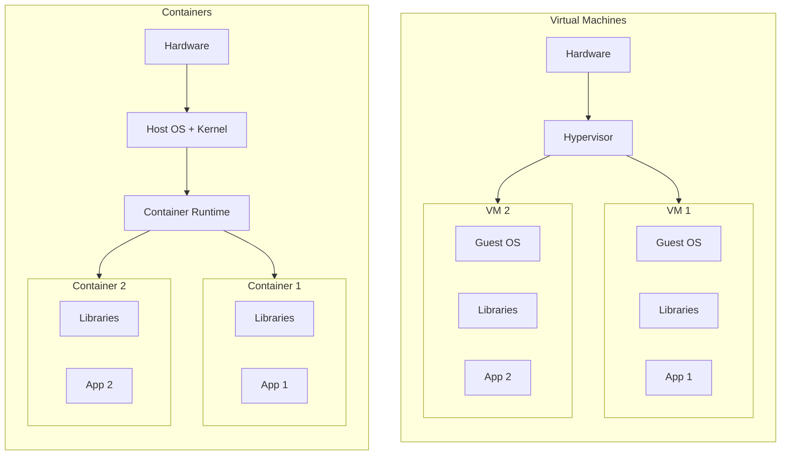
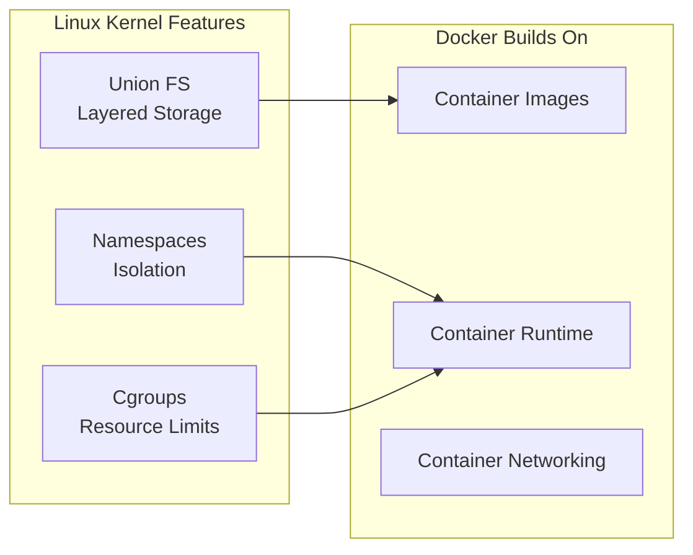
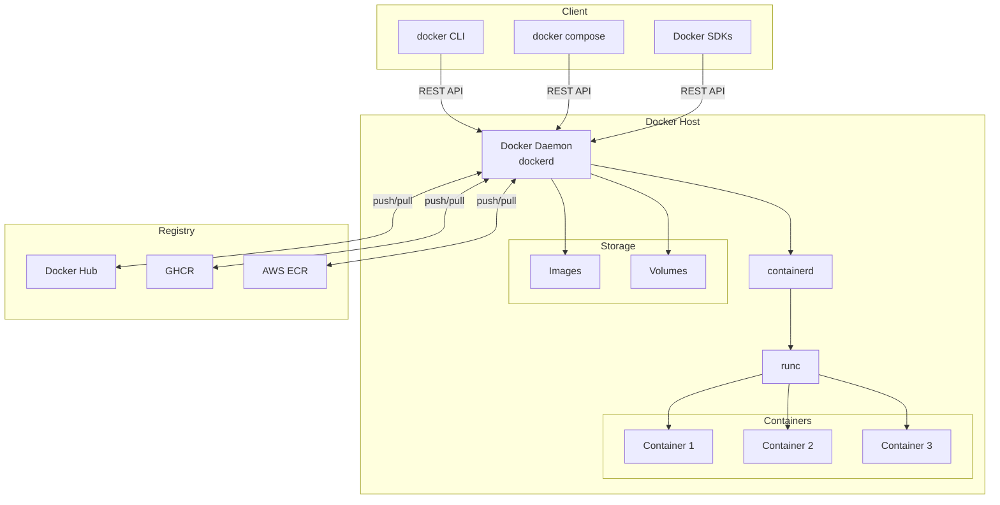
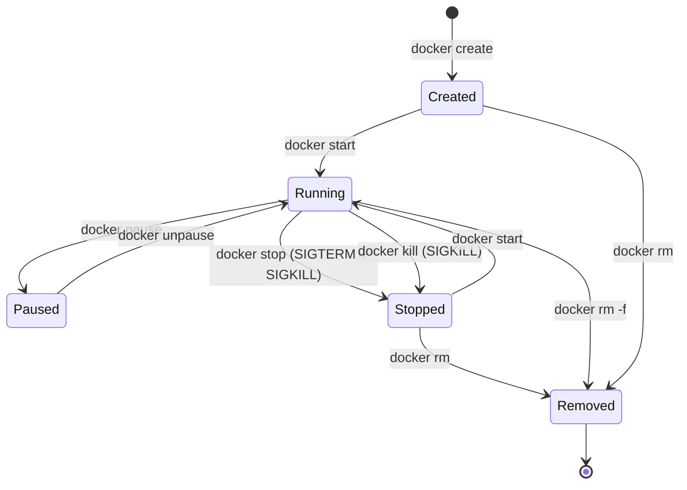
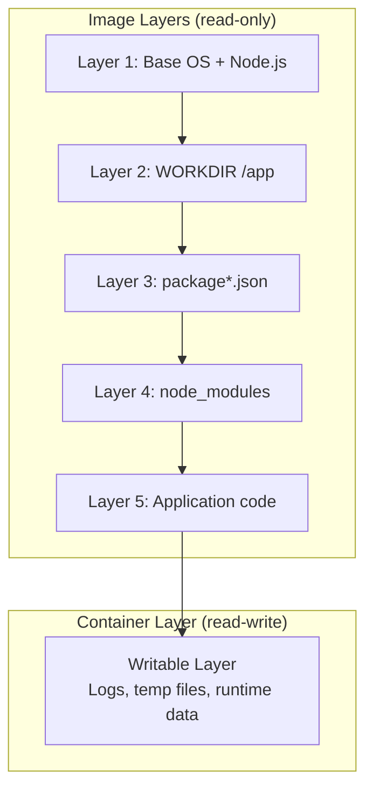
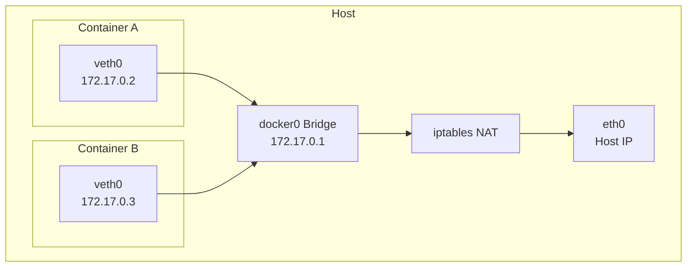
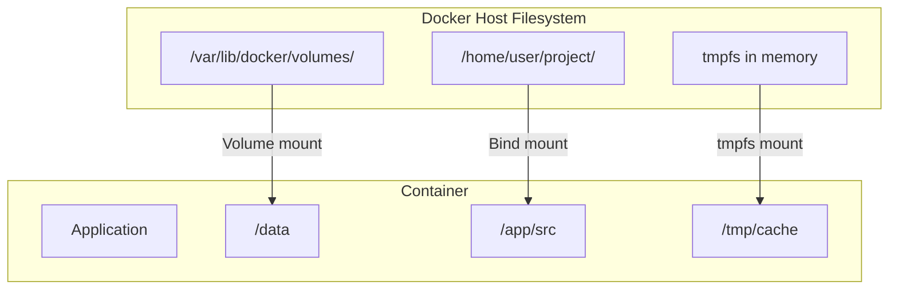
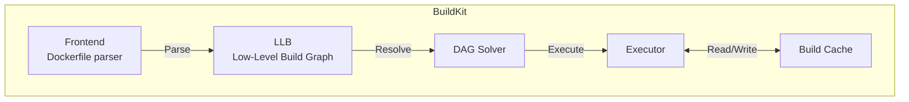

# Docker Overview

## Why It Exists

Before containers, deploying software was a nightmare of environment inconsistency. A developer would write code on their laptop running macOS with Node.js 18, Python 3.11, and specific versions of OpenSSL. The staging server ran Ubuntu 20.04 with Node.js 16. The production server ran Amazon Linux 2 with a different OpenSSL. The result: "it works on my machine" became the most feared phrase in software engineering.

The solutions before Docker were insufficient:
- **Virtual machines** — Full OS per application. 5-30 second boot times. 500MB-10GB per VM. Memory overhead for each guest OS kernel.
- **Configuration management (Ansible/Chef/Puppet)** — Manages the host, not the application. Drift over time. "Snowflake" servers.
- **Language-specific packaging (pip, npm, gem)** — Only manages that language's dependencies. System libraries, OS packages, and configuration are left to chance.

Docker, released in 2013, solved this by packaging an application with **all of its dependencies** — libraries, system tools, runtime, and configuration — into a single, portable artifact called a **container image**. The key insight was leveraging existing Linux kernel features (namespaces, cgroups, union filesystems) rather than hardware virtualization.

### The Impact

| Metric | Before Docker | After Docker |
|--------|--------------|--------------|
| Environment consistency | Low (manual setup) | Perfect (image is identical) |
| Deployment time | Minutes to hours | Seconds |
| Resource overhead | 500MB+ per VM | 5-50MB per container |
| Boot time | 30-60 seconds (VM) | <1 second |
| Density per host | 5-10 VMs | 50-100+ containers |
| Developer onboarding | Days (setup env) | Minutes (docker compose up) |

## First Principles

### Containers vs. Virtual Machines



The fundamental difference: VMs virtualize **hardware**, containers virtualize the **operating system**. Containers share the host kernel, eliminating the overhead of running multiple OS instances.

### The Three Pillars of Containerization

Docker's containerization stands on three Linux kernel features:

1. **Namespaces** — Isolation (what a process can see)
2. **Cgroups** — Resource limits (what a process can use)
3. **Union Filesystems** — Layered storage (how images are built and shared)



**Namespace types:**

| Namespace | Isolates | Effect |
|-----------|----------|--------|
| PID | Process IDs | Container sees only its own processes |
| NET | Network stack | Container gets its own IP, ports, routes |
| MNT | Mount points | Container has its own filesystem view |
| UTS | Hostname | Container can have its own hostname |
| IPC | Inter-process communication | Shared memory isolated |
| USER | User/group IDs | Container can map UID 0 to unprivileged host UID |
| CGROUP | Cgroup hierarchy | Container sees only its own cgroup |

### The Docker Architecture



**Component responsibilities:**

| Component | Role |
|-----------|------|
| **docker CLI** | User interface, sends commands to daemon |
| **dockerd** | Daemon that manages images, networks, volumes |
| **containerd** | Container lifecycle management (start, stop, pause) |
| **runc** | Low-level container runtime (creates namespaces, cgroups) |
| **Registry** | Stores and distributes container images |

## Core Mechanics

### Container Lifecycle



### Image Layers

Every instruction in a Dockerfile creates a new layer. Layers are cached and shared between images:

```dockerfile
FROM node:20-alpine          # Layer 1: Base OS + Node.js (~180MB)
WORKDIR /app                 # Layer 2: Create directory (0B, metadata only)
COPY package*.json ./        # Layer 3: Package files (~50KB)
RUN npm ci --production      # Layer 4: Dependencies (~100MB)
COPY . .                     # Layer 5: Application code (~5MB)
CMD ["node", "server.js"]    # Layer 6: Default command (metadata only)
```



**Key layer behaviors:**
- Layers are **read-only** once created
- Each container gets a **thin writable layer** on top
- Layers are identified by SHA256 content hash
- Identical layers are stored **once** on disk and shared between images
- Changing a layer invalidates **all subsequent layers** (cache invalidation)

### Networking Models

Docker provides four network drivers:

```bash
# List networks
docker network ls

# NETWORK ID     NAME      DRIVER    SCOPE
# a1b2c3d4e5f6   bridge    bridge    local
# f6e5d4c3b2a1   host      host      local
# 1a2b3c4d5e6f   none      null      local
```

| Driver | Use Case | Isolation | Performance |
|--------|----------|-----------|-------------|
| **bridge** (default) | Container-to-container on same host | Isolated, NAT to host | Good (veth pairs) |
| **host** | Performance-critical apps | No isolation (shares host network) | Best (no overhead) |
| **none** | Security-critical, custom networking | Complete network isolation | N/A |
| **overlay** | Multi-host networking (Swarm) | Cross-host isolation | Good (VXLAN) |
| **macvlan** | Legacy apps needing Layer 2 | Direct L2 network access | Good |

**Bridge network internals:**



### Storage: Volumes vs Bind Mounts



| Type | Managed By | Use Case | Portability |
|------|-----------|----------|-------------|
| **Volume** | Docker | Persistent data (databases, uploads) | Portable (docker manages) |
| **Bind mount** | User | Development (live code reload) | Host-dependent |
| **tmpfs** | Kernel | Sensitive data, caches | Container lifetime only |

```bash
# Named volume (recommended for production)
docker volume create app-data
docker run -v app-data:/data myapp

# Bind mount (development)
docker run -v $(pwd)/src:/app/src myapp

# tmpfs (sensitive data)
docker run --tmpfs /tmp:rw,noexec,nosuid,size=100m myapp
```

## Implementation — Essential Docker Commands

### Image Management

```bash
# Build an image
docker build -t myapp:1.0 .
docker build -t myapp:1.0 -f Dockerfile.production .

# Build with build arguments
docker build --build-arg NODE_ENV=production -t myapp:1.0 .

# List images
docker images
docker images --format "table {​{.Repository}}\t{​{.Tag}}\t{​{.Size}}"

# Tag for registry
docker tag myapp:1.0 ghcr.io/company/myapp:1.0

# Push to registry
docker push ghcr.io/company/myapp:1.0

# Pull from registry
docker pull ghcr.io/company/myapp:1.0

# Inspect image layers
docker history myapp:1.0
docker inspect myapp:1.0

# Remove unused images
docker image prune -a --filter "until=168h"  # Remove images older than 7 days
```

### Container Management

```bash
# Run a container (foreground)
docker run --name myapp -p 3000:3000 myapp:1.0

# Run detached with auto-restart
docker run -d --name myapp --restart unless-stopped -p 3000:3000 myapp:1.0

# Run with resource limits
docker run -d --name myapp \
  --memory=512m \
  --cpus=1.0 \
  --pids-limit=100 \
  -p 3000:3000 \
  myapp:1.0

# Execute command in running container
docker exec -it myapp /bin/sh

# View logs
docker logs myapp --tail 100 -f
docker logs myapp --since 30m

# Copy files
docker cp myapp:/app/data.json ./data.json
docker cp ./config.json myapp:/app/config.json

# Resource usage
docker stats myapp --no-stream

# Inspect container
docker inspect myapp --format '{​{.State.Status}}'
docker inspect myapp --format '{​{range .NetworkSettings.Networks}}{​{.IPAddress}}{​{end}}'
```

### System Cleanup

```bash
# Remove all stopped containers
docker container prune

# Remove all unused images
docker image prune -a

# Remove all unused volumes (DANGEROUS — data loss)
docker volume prune

# Remove everything unused (containers, networks, images, build cache)
docker system prune -a --volumes

# Check disk usage
docker system df
docker system df -v  # Verbose
```

### Dockerfile Best Practices Summary

```dockerfile
# 1. Use specific base image tags (never :latest)
FROM node:20.11.1-alpine3.19

# 2. Set metadata
LABEL maintainer="team@company.com"
LABEL org.opencontainers.image.source="https://github.com/company/myapp"

# 3. Create non-root user early
RUN addgroup -g 1001 appgroup && \
    adduser -u 1001 -G appgroup -s /bin/sh -D appuser

# 4. Set working directory
WORKDIR /app

# 5. Copy dependency files first (layer caching)
COPY package.json package-lock.json ./

# 6. Install dependencies in a separate layer
RUN npm ci --production && \
    npm cache clean --force

# 7. Copy application code
COPY --chown=appuser:appgroup . .

# 8. Switch to non-root user
USER appuser

# 9. Expose port (documentation only)
EXPOSE 3000

# 10. Use exec form for CMD (proper signal handling)
CMD ["node", "server.js"]

# 11. Add health check
HEALTHCHECK --interval=30s --timeout=5s --start-period=10s --retries=3 \
  CMD wget --no-verbose --tries=1 --spider http://localhost:3000/health || exit 1
```

## Edge Cases and Failure Modes

### 1. PID 1 and Signal Handling

The first process in a container (PID 1) has special responsibilities: it must handle signals and reap zombie child processes. Many applications don't handle this correctly.

```dockerfile
# BAD: shell form — /bin/sh -c "node server.js"
# Shell intercepts SIGTERM, node never sees it
CMD node server.js

# GOOD: exec form — node is PID 1
CMD ["node", "server.js"]

# BEST: Use tini as init process for proper signal handling and zombie reaping
RUN apk add --no-cache tini
ENTRYPOINT ["/sbin/tini", "--"]
CMD ["node", "server.js"]
```

### 2. Layer Cache Invalidation

If you COPY your entire application directory before installing dependencies, every code change invalidates the dependency layer:

```dockerfile
# BAD: Any source code change reinstalls ALL dependencies
COPY . .
RUN npm ci

# GOOD: Dependency lock file changes rarely
COPY package.json package-lock.json ./
RUN npm ci
COPY . .
```

### 3. Build Secrets Leaking into Image

```dockerfile
# BAD: Secret is stored in a layer forever
COPY .env .
RUN npm run build
RUN rm .env  # This does NOT remove it from the layer!

# GOOD: Use BuildKit secrets (never stored in layers)
RUN --mount=type=secret,id=npmrc,target=/root/.npmrc npm ci
```

### 4. DNS Resolution in Containers

Containers use the Docker daemon's DNS settings by default. If the host uses `systemd-resolved` (127.0.0.53), containers may not be able to resolve DNS.

```bash
# Check DNS config inside container
docker run --rm alpine cat /etc/resolv.conf

# Fix: specify DNS servers explicitly
docker run --dns 8.8.8.8 --dns 8.8.4.4 myapp

# Or in daemon.json
# {"dns": ["8.8.8.8", "8.8.4.4"]}
```

### 5. Filesystem Full — Docker Storage Driver

```bash
# Check Docker disk usage
docker system df

# TYPE            TOTAL     ACTIVE    SIZE      RECLAIMABLE
# Images          45        12        8.5GB     6.2GB (73%)
# Containers      15        8         1.2GB     500MB (42%)
# Local Volumes   23        15        12.5GB    3.1GB (25%)
# Build Cache     -         -         4.3GB     4.3GB

# Clean build cache
docker builder prune --all

# WARNING: /var/lib/docker can fill up silently
# Set up monitoring for this directory
```

## Performance Characteristics

### Container vs VM Performance

| Metric | Container | VM (KVM) | Overhead |
|--------|-----------|----------|----------|
| CPU | ~0% overhead | 1-3% overhead | Container wins |
| Memory | ~0% overhead | 200-500MB per VM | Container wins |
| Disk I/O | ~0-2% (overlay2) | 5-10% (virtio) | Container wins |
| Network I/O | ~1-3% (bridge) | 2-5% (virtio-net) | Container wins |
| Boot time | <1 second | 5-30 seconds | Container wins |
| Image size | 5-500MB | 500MB-10GB | Container wins |

### Layer Size Impact

$$
T_{pull} = \frac{S_{total}}{BW_{network}} + N_{layers} \times T_{extract}
$$

Where:
- $S_{total}$ = total image size (compressed)
- $BW_{network}$ = network bandwidth
- $N_{layers}$ = number of layers
- $T_{extract}$ = time to extract each layer (~100ms for small layers)

For a 500MB image with 20 layers on 100Mbps network:

$$
T_{pull} = \frac{500\text{MB}}{12.5\text{MB/s}} + 20 \times 0.1\text{s} = 40\text{s} + 2\text{s} = 42\text{s}
$$

Reducing to 100MB with 8 layers:

$$
T_{pull} = \frac{100\text{MB}}{12.5\text{MB/s}} + 8 \times 0.1\text{s} = 8\text{s} + 0.8\text{s} = 8.8\text{s}
$$

### Container Startup Time Components

| Phase | Typical Duration | Bottleneck |
|-------|-----------------|------------|
| Image pull (cached) | 0ms | N/A |
| Image pull (uncached, 100MB) | 5-30s | Network + extraction |
| Create container | 50-200ms | Filesystem setup |
| Start container | 10-50ms | Namespace + cgroup creation |
| Application startup | 100ms-30s | Application dependent |
| Health check passes | 5-30s | Probe configuration |

## Mathematical Foundations

### Image Layer Deduplication

Given $N$ images sharing a common base image with $L_{base}$ layers of size $S_{base}$:

$$
S_{disk} = S_{base} + \sum_{i=1}^{N} S_{unique_i}
$$

Instead of:

$$
S_{naive} = N \times (S_{base} + S_{unique})
$$

Savings ratio:

$$
\text{Savings} = 1 - \frac{S_{base} + N \times S_{unique}}{N \times (S_{base} + S_{unique})}
$$

For 10 microservices sharing a 200MB base image with 50MB unique code each:

$$
\text{Savings} = 1 - \frac{200 + 10 \times 50}{10 \times (200 + 50)} = 1 - \frac{700}{2500} = 72\%
$$

### Copy-on-Write Performance Model

The overlay2 filesystem uses copy-on-write (CoW). The first write to a file in a lower layer triggers a full copy:

$$
T_{first\_write}(f) = T_{copy}(f) + T_{write}(f) = \frac{S_f}{BW_{disk}} + T_{write}
$$

Subsequent writes are at native speed. For a 100MB database file:

$$
T_{first\_write} = \frac{100\text{MB}}{500\text{MB/s}} + T_{write} = 0.2\text{s} + T_{write}
$$

This is why databases should use **volumes** (bypass CoW) not the container's writable layer.

## Real-World War Stories

::: info War Story — The 2GB Node.js Image
A team's Node.js application image was 2.1GB. Build times were 15 minutes, and deployments took 5 minutes just to pull the image. Investigation revealed:
1. Using `node:18` (Debian-based, 900MB) instead of `node:18-alpine` (50MB)
2. Installing devDependencies in the final image (`npm install` instead of `npm ci --production`)
3. Copying the entire repo including `.git/` directory (500MB of Git history)
4. Running `apt-get install` without cleanup

After optimization: 85MB image, 30-second builds, 5-second pulls.
:::

::: info War Story — The Container That Couldn't Be Killed
A Python application running as PID 1 in a container ignored SIGTERM (Python does not handle it by default). When `docker stop` was issued, Docker waited 10 seconds (default grace period), then sent SIGKILL. During deployments, this meant 10-second delays per container — unacceptable for rolling updates of 50 containers.

**Fix:** Added a SIGTERM handler in Python and used `tini` as the init process:
```dockerfile
ENTRYPOINT ["/sbin/tini", "--"]
CMD ["python", "app.py"]
```
:::

::: info War Story — The Docker Socket Mount Breach
A CI/CD pipeline mounted the Docker socket (`-v /var/run/docker.sock:/var/run/docker.sock`) into a build container to enable Docker-in-Docker builds. An attacker exploited a vulnerability in the CI pipeline to run `docker run --privileged -v /:/host alpine chroot /host`, gaining root access to the host machine and from there to the entire cluster.

**Fix:** Switched to rootless Docker for CI/CD builds, implemented Kaniko for container builds inside Kubernetes (no Docker socket needed), and added network segmentation for build nodes.
:::

## Decision Framework

### When to Use Docker

| Scenario | Docker | VM | Bare Metal |
|----------|--------|-----|-----------|
| Microservices | Best | Overkill | Impractical |
| Legacy monolith | Good | Good | Best (if optimized) |
| GPU workloads | Good (nvidia-docker) | Good | Best |
| Windows apps | Limited | Best | Best |
| High-security isolation | Acceptable | Better | N/A |
| Development environment | Best | Good | Impractical |
| CI/CD pipelines | Best | Good | Impractical |

### Container Runtime Comparison

| Runtime | Use Case | OCI Compliant | Rootless |
|---------|----------|---------------|----------|
| **Docker** (containerd + runc) | Development, CI/CD | Yes | Yes (experimental) |
| **containerd** | Kubernetes (CRI) | Yes | Yes |
| **CRI-O** | Kubernetes-only | Yes | Yes |
| **Podman** | Rootless, daemonless | Yes | Native |
| **gVisor** (runsc) | High isolation | Yes | Yes |
| **Kata Containers** | VM-level isolation | Yes | N/A |

### Docker Desktop Alternatives

| Tool | Platform | Free for Enterprise | Features |
|------|----------|-------------------|----------|
| Docker Desktop | macOS, Windows, Linux | No (>250 employees) | Full integration |
| Podman Desktop | macOS, Windows, Linux | Yes | Docker-compatible |
| Rancher Desktop | macOS, Windows, Linux | Yes | Docker + K8s |
| Colima | macOS, Linux | Yes | Minimal, fast |
| OrbStack | macOS | Free for personal | Fast, native |

## Advanced Topics

### BuildKit Architecture

BuildKit is Docker's modern build engine (default since Docker 23.0):



BuildKit features:
- **Parallel builds** — Independent stages run concurrently
- **Build cache mounts** — Persist package manager caches between builds
- **Secret mounts** — Use secrets during build without storing in layers
- **SSH forwarding** — Access private repos during build
- **Multi-platform builds** — Build for amd64, arm64, etc. in one command

```bash
# Enable BuildKit (default in Docker 23+)
export DOCKER_BUILDKIT=1

# Multi-platform build
docker buildx build \
  --platform linux/amd64,linux/arm64 \
  -t myapp:1.0 \
  --push .

# Build with cache export
docker buildx build \
  --cache-from type=registry,ref=ghcr.io/company/myapp:cache \
  --cache-to type=registry,ref=ghcr.io/company/myapp:cache,mode=max \
  -t myapp:1.0 .
```

### OCI Image Specification

Docker images follow the OCI (Open Container Initiative) specification:

```json
{
  "schemaVersion": 2,
  "mediaType": "application/vnd.oci.image.manifest.v1+json",
  "config": {
    "mediaType": "application/vnd.oci.image.config.v1+json",
    "digest": "sha256:abc123...",
    "size": 7023
  },
  "layers": [
    {
      "mediaType": "application/vnd.oci.image.layer.v1.tar+gzip",
      "digest": "sha256:def456...",
      "size": 32654
    }
  ]
}
```

Understanding the OCI spec matters because:
1. Images are portable across any OCI-compliant runtime
2. Digest-based addressing ensures integrity
3. Manifest lists enable multi-architecture images
4. The spec enables tooling interoperability (Buildah, Kaniko, ko, Jib)

### Container Security Scanning Pipeline

```typescript
import { execSync } from 'child_process';

interface ScanResult {
  image: string;
  vulnerabilities: {
    critical: number;
    high: number;
    medium: number;
    low: number;
  };
  passed: boolean;
}

function scanImage(image: string, maxCritical = 0, maxHigh = 5): ScanResult {
  // Run Trivy scan
  const output = execSync(
    `trivy image --format json --severity CRITICAL,HIGH,MEDIUM,LOW ${image}`,
    { encoding: 'utf-8', maxBuffer: 50 * 1024 * 1024 },
  );

  const report = JSON.parse(output);
  const counts = { critical: 0, high: 0, medium: 0, low: 0 };

  for (const result of report.Results ?? []) {
    for (const vuln of result.Vulnerabilities ?? []) {
      const severity = vuln.Severity.toLowerCase() as keyof typeof counts;
      if (severity in counts) {
        counts[severity]++;
      }
    }
  }

  return {
    image,
    vulnerabilities: counts,
    passed: counts.critical <= maxCritical && counts.high <= maxHigh,
  };
}

// Usage in CI/CD
const result = scanImage('ghcr.io/company/myapp:latest');
if (!result.passed) {
  console.error('Image scan failed:', result);
  process.exit(1);
}
```

### Docker Content Trust (DCT)

```bash
# Enable content trust
export DOCKER_CONTENT_TRUST=1

# Sign and push
docker push ghcr.io/company/myapp:1.0
# First push generates signing keys

# Verify on pull (automatic with DCT enabled)
docker pull ghcr.io/company/myapp:1.0

# Verify with cosign (modern alternative)
cosign verify \
  --key cosign.pub \
  ghcr.io/company/myapp:1.0
```

---

*Next: [Docker Internals](./internals.md) — Linux namespaces, cgroups, overlay filesystem, and how containers actually work at the kernel level.*
