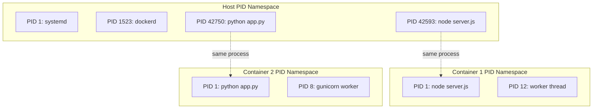
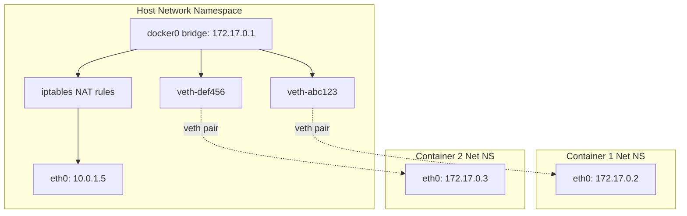
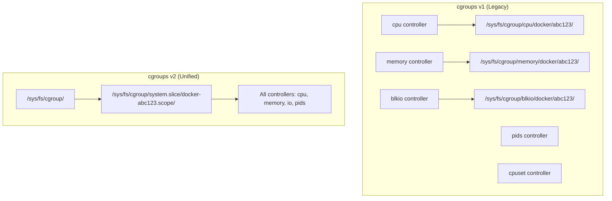
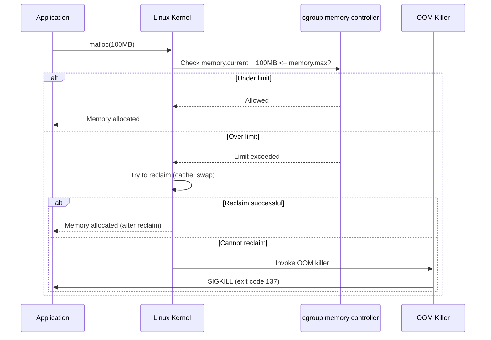
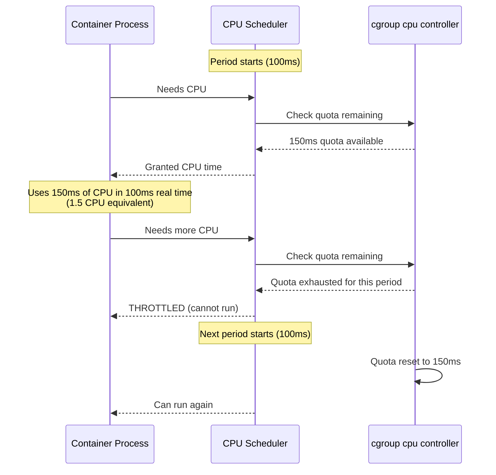

# Docker Internals

## Why It Exists

Understanding Docker internals is not academic curiosity — it is essential for debugging production issues, writing secure containers, and understanding performance characteristics. When a container is OOM killed, you need to understand how cgroups enforce memory limits. When containers cannot communicate, you need to understand network namespaces and veth pairs. When a container's filesystem is slow, you need to understand how overlay2's copy-on-write works.

Docker is not magic — it is a well-crafted combination of Linux kernel features that have existed since 2002 (namespaces) and 2008 (cgroups). Docker's innovation was making these features accessible through a simple CLI and image format.

## First Principles

### A Container is Just a Process

At its most fundamental level, a container is a regular Linux process with three modifications:

1. **Namespaces** restrict what the process can **see**
2. **Cgroups** restrict what the process can **use**
3. **Chroot/pivot_root** restricts where the process's filesystem **root** is

You can create a "container" with pure Linux commands:

```bash
# Create a minimal container manually
# 1. Create a rootfs (using Alpine Linux)
mkdir -p /tmp/container/rootfs
cd /tmp/container/rootfs
curl -o alpine.tar.gz https://dl-cdn.alpinelinux.org/alpine/v3.19/releases/x86_64/alpine-minirootfs-3.19.1-x86_64.tar.gz
tar -xzf alpine.tar.gz
rm alpine.tar.gz

# 2. Run a process in new namespaces with unshare
sudo unshare --mount --uts --ipc --net --pid --fork \
  chroot /tmp/container/rootfs /bin/sh

# Inside the "container":
hostname container-1
ps aux  # Only sees its own processes
ip addr # No network interfaces (empty net namespace)
```

This is exactly what Docker's `runc` does, but with more configuration options and a standardized interface.

## Core Mechanics

### Linux Namespaces

Namespaces partition kernel resources so that one set of processes sees one set of resources, while another set sees a different set. Each namespace type isolates a specific kernel subsystem.

#### PID Namespace

The PID namespace gives each container its own view of process IDs. The first process in a container is PID 1 (the init process), while on the host it might be PID 42593.



**PID 1 responsibilities:**

PID 1 in a container must:
1. Handle SIGTERM/SIGINT for graceful shutdown
2. Reap zombie child processes (wait for orphaned children)
3. Forward signals to child processes

If PID 1 does not reap zombies, the PID table fills up and the container cannot create new processes.

```bash
# View the PID mapping
# From the host:
docker inspect --format '{{.State.Pid}}' container_name
# Returns: 42593

# From inside the container:
cat /proc/1/status | grep NSpid
# NSpid: 42593  1
# (host PID is 42593, container PID is 1)
```

#### Network Namespace

Each container gets its own network stack: interfaces, IP addresses, routing tables, iptables rules, and sockets.



**How container networking works step by step:**

1. Docker creates a **veth pair** (virtual ethernet pair) — two virtual network interfaces connected like a pipe
2. One end (`vethXXX`) is placed in the **host namespace** and connected to the `docker0` bridge
3. The other end is moved into the **container namespace** and renamed to `eth0`
4. Docker assigns an IP from the bridge subnet (172.17.0.0/16) to the container's eth0
5. Docker adds **iptables NAT rules** to masquerade container traffic with the host IP

```bash
# View the veth pair mapping
# From host:
ip link show type veth
# 5: veth2f0b4c0@if4: <BROADCAST,MULTICAST,UP> link/ether ...

# From container:
ip link show
# 4: eth0@if5: <BROADCAST,MULTICAST,UP> link/ether ...
# The @ifN refers to the peer interface index on the host
```

#### Mount Namespace

The mount namespace gives each container its own filesystem view. This is how containers see their own root filesystem, volumes, and mounted secrets.

```bash
# View mount points inside a container
docker exec myapp cat /proc/mounts

# Key mounts:
# overlay on / type overlay (ro,...)          - Container root filesystem
# proc on /proc type proc (rw,nosuid,...)     - Process info
# tmpfs on /dev type tmpfs (rw,nosuid,...)    - Device nodes
# /dev/sda1 on /app/data type ext4 (rw,...)  - Volume mount
```

#### User Namespace

User namespaces map UIDs inside the container to different UIDs on the host. A process can be root (UID 0) inside the container but unprivileged (UID 100000) on the host.

```bash
# Enable user namespace remapping
# /etc/docker/daemon.json
# {"userns-remap": "default"}

# Result:
# Container UID 0 maps to host UID 100000
# Container UID 1 maps to host UID 100001
# ...

# View the mapping
cat /proc/$(docker inspect --format '{{.State.Pid}}' myapp)/uid_map
# 0     100000     65536
# (container UID 0 starts at host UID 100000, 65536 UIDs mapped)
```

### Control Groups (cgroups)

Cgroups limit, account for, and isolate resource usage (CPU, memory, I/O, network) of process groups.

#### cgroups v1 vs v2



| Feature | cgroups v1 | cgroups v2 |
|---------|-----------|-----------|
| Controller hierarchy | Per-controller trees | Unified tree |
| Memory accounting | Includes page cache | Configurable |
| CPU pressure | Not available | PSI (Pressure Stall Information) |
| IO accounting | Limited | Comprehensive |
| Thread-level control | Limited | Full support |
| Default in Docker | Docker < 25 | Docker 25+ with systemd |

#### Memory Cgroup

```bash
# View memory limits for a container (cgroups v2)
cat /sys/fs/cgroup/system.slice/docker-abc123.scope/memory.max
# 536870912 (512Mi in bytes)

cat /sys/fs/cgroup/system.slice/docker-abc123.scope/memory.current
# 234567890 (current usage)

# View OOM kill count
cat /sys/fs/cgroup/system.slice/docker-abc123.scope/memory.events
# low 0
# high 0
# max 3     <-- OOM kills happened 3 times
# oom 3
# oom_kill 3
```

**Memory limit enforcement flow:**



**Memory components in cgroups v2:**

$$
\text{memory.current} = \text{RSS} + \text{page cache} + \text{kernel memory} + \text{swap (if enabled)}
$$

$$
\text{RSS} = \text{anonymous pages} + \text{shared memory}
$$

This is why `docker stats` may show different memory than `top` inside the container — they are measuring different things.

#### CPU Cgroup

Docker's `--cpus=1.5` translates to cgroup CPU quota:

```bash
# --cpus=1.5 means:
# cpu.max = "150000 100000"
# (150,000 microseconds of CPU time per 100,000 microsecond period)

cat /sys/fs/cgroup/system.slice/docker-abc123.scope/cpu.max
# 150000 100000
```

**CPU throttling mechanics:**



**Measuring CPU throttling:**

```bash
# View throttling stats
cat /sys/fs/cgroup/system.slice/docker-abc123.scope/cpu.stat
# usage_usec 45678901234
# user_usec 40000000000
# system_usec 5678901234
# nr_periods 123456
# nr_throttled 4567        <-- Number of periods with throttling
# throttled_usec 89012345  <-- Total throttled time in microseconds

# Throttle ratio:
# 4567 / 123456 = 3.7% of periods experienced throttling
```

::: warning
CPU throttling causes **latency spikes** that are invisible in average CPU utilization metrics. A container can show 30% average CPU usage but be throttled for 50ms every 100ms period, causing p99 latency to spike. Monitor `nr_throttled` in production.
:::

#### PID Cgroup

Limits the number of processes a container can create:

```bash
# Docker default: unlimited (dangerous)
# Recommended: set a limit
docker run --pids-limit 100 myapp

# View current count
cat /sys/fs/cgroup/system.slice/docker-abc123.scope/pids.current
# 15

cat /sys/fs/cgroup/system.slice/docker-abc123.scope/pids.max
# 100
```

Without a PID limit, a fork bomb inside a container can exhaust the host's PID space, affecting all containers and the host itself.

### Union Filesystems (OverlayFS)

Docker uses OverlayFS (specifically overlay2 driver) to implement the layered image model.

```mermaid
flowchart TB
    subgraph "Container View (merged)"
        MERGED["/merged<br/>/app/server.js (from upperdir)<br/>/usr/bin/node (from lowerdir)<br/>/etc/alpine-release (from lowerdir)"]
    end

    subgraph "Write Layer (upperdir)"
        UPPER["/upper<br/>/app/server.js (modified)<br/>/app/logs/ (new)<br/>.wh.tmp_file (whiteout = deleted)"]
    end

    subgraph "Read-Only Layers (lowerdir)"
        L1[Layer 1: Base OS<br/>/etc/alpine-release<br/>/bin/sh]
        L2[Layer 2: Node.js<br/>/usr/bin/node<br/>/usr/lib/node_modules/]
        L3[Layer 3: Dependencies<br/>/app/node_modules/]
        L4[Layer 4: App Code<br/>/app/server.js (original)]
    end

    UPPER --> MERGED
    L4 --> MERGED
    L3 --> MERGED
    L2 --> MERGED
    L1 --> MERGED
```

**How OverlayFS operations work:**

| Operation | Mechanism |
|-----------|-----------|
| **Read file** | Search from top layer down, return first match |
| **Write new file** | Create in upperdir |
| **Modify existing file** | Copy from lowerdir to upperdir (copy-on-write), then modify |
| **Delete file** | Create a "whiteout" file (`.wh.filename`) in upperdir |
| **Delete directory** | Create an "opaque" whiteout (`.wh..wh..opq`) in upperdir |
| **List directory** | Merge listings from all layers, filter whiteouts |

```bash
# View overlay mount details
docker inspect myapp --format '{{.GraphDriver.Data.MergedDir}}'
# /var/lib/docker/overlay2/abc123/merged

docker inspect myapp --format '{{.GraphDriver.Data.UpperDir}}'
# /var/lib/docker/overlay2/abc123/diff

docker inspect myapp --format '{{.GraphDriver.Data.LowerDir}}'
# /var/lib/docker/overlay2/def456/diff:/var/lib/docker/overlay2/ghi789/diff:...

# View from kernel
mount | grep overlay
# overlay on /var/lib/docker/overlay2/abc123/merged type overlay
#   (rw,lowerdir=...,upperdir=...,workdir=...)
```

**Copy-on-Write performance impact:**

The first write to a file triggers a full copy from the lower layer:

$$
T_{cow}(f) = T_{copy}(S_f) + T_{write}
$$

For a 1GB database file:

$$
T_{cow} = \frac{1\text{GB}}{500\text{MB/s}} = 2\text{s}
$$

This is why performance-critical data (databases, log files) should use Docker volumes, which bypass the overlay filesystem entirely.

## Implementation — Building Containers from Scratch

### Creating a Container with syscalls

```go
// Minimal container implementation in Go
package main

import (
	"fmt"
	"os"
	"os/exec"
	"syscall"
)

func main() {
	switch os.Args[1] {
	case "run":
		run()
	case "child":
		child()
	default:
		fmt.Println("Usage: container run <command>")
	}
}

func run() {
	fmt.Printf("[Parent] Running %v\n", os.Args[2:])

	cmd := exec.Command("/proc/self/exe", append([]string{"child"}, os.Args[2:]...)...)
	cmd.Stdin = os.Stdin
	cmd.Stdout = os.Stdout
	cmd.Stderr = os.Stderr

	// Create new namespaces
	cmd.SysProcAttr = &syscall.SysProcAttr{
		Cloneflags: syscall.CLONE_NEWUTS |   // New hostname
			syscall.CLONE_NEWPID |            // New PID space
			syscall.CLONE_NEWNS |             // New mount space
			syscall.CLONE_NEWNET |            // New network
			syscall.CLONE_NEWIPC,             // New IPC
		Unshareflags: syscall.CLONE_NEWNS,
	}

	must(cmd.Run())
}

func child() {
	fmt.Printf("[Container] Running %v as PID %d\n", os.Args[2:], os.Getpid())

	// Set hostname
	must(syscall.Sethostname([]byte("container")))

	// Set cgroup limits
	cgroupPath := "/sys/fs/cgroup/system.slice/my-container.scope"
	must(os.MkdirAll(cgroupPath, 0755))
	must(os.WriteFile(cgroupPath+"/memory.max", []byte("536870912"), 0644)) // 512MB
	must(os.WriteFile(cgroupPath+"/pids.max", []byte("100"), 0644))
	must(os.WriteFile(cgroupPath+"/cgroup.procs", []byte(fmt.Sprintf("%d", os.Getpid())), 0644))

	// Change root filesystem
	must(syscall.Chroot("/tmp/container/rootfs"))
	must(os.Chdir("/"))

	// Mount /proc (required for PID namespace to work)
	must(syscall.Mount("proc", "/proc", "proc", 0, ""))

	// Mount /tmp as tmpfs
	must(syscall.Mount("tmpfs", "/tmp", "tmpfs", 0, ""))

	// Execute the requested command
	cmd := exec.Command(os.Args[2], os.Args[3:]...)
	cmd.Stdin = os.Stdin
	cmd.Stdout = os.Stdout
	cmd.Stderr = os.Stderr
	must(cmd.Run())

	// Cleanup
	must(syscall.Unmount("/proc", 0))
	must(syscall.Unmount("/tmp", 0))
}

func must(err error) {
	if err != nil {
		fmt.Printf("Error: %v\n", err)
		os.Exit(1)
	}
}
```

```bash
# Build and run our minimal container
go build -o container main.go
sudo ./container run /bin/sh

# Inside our "container":
hostname  # "container"
ps aux    # Only sees its own processes
whoami    # root (but only inside the namespace)
```

### Seccomp Profiles

Seccomp (Secure Computing) limits which system calls a container can make:

```json
{
  "defaultAction": "SCMP_ACT_ERRNO",
  "defaultErrnoRet": 1,
  "architectures": ["SCMP_ARCH_X86_64", "SCMP_ARCH_AARCH64"],
  "syscalls": [
    {
      "names": [
        "accept", "accept4", "access", "bind", "brk",
        "clock_gettime", "clone", "close", "connect",
        "dup", "dup2", "dup3", "epoll_create", "epoll_create1",
        "epoll_ctl", "epoll_wait", "execve", "exit", "exit_group",
        "fchmod", "fchown", "fcntl", "fstat", "futex",
        "getcwd", "getdents64", "getegid", "geteuid", "getgid",
        "getpid", "getppid", "getuid", "ioctl", "kill",
        "listen", "lseek", "madvise", "memfd_create",
        "mmap", "mprotect", "munmap", "nanosleep",
        "newfstatat", "open", "openat", "pipe", "pipe2",
        "poll", "ppoll", "pread64", "pwrite64",
        "read", "readlink", "recvfrom", "recvmsg",
        "rename", "rt_sigaction", "rt_sigprocmask", "rt_sigreturn",
        "sched_getaffinity", "sched_yield",
        "sendmsg", "sendto", "set_robust_list", "set_tid_address",
        "setgid", "setgroups", "setuid",
        "shutdown", "sigaltstack", "socket", "stat",
        "statx", "tgkill", "umask", "uname", "unlink",
        "wait4", "write", "writev"
      ],
      "action": "SCMP_ACT_ALLOW"
    }
  ]
}
```

Docker's default seccomp profile blocks approximately 44 syscalls out of 300+ including:
- `mount`, `umount2` — filesystem manipulation
- `reboot` — system reboot
- `kexec_load` — kernel replacement
- `init_module`, `delete_module` — kernel modules
- `sethostname` — hostname changes (unless UTS namespace)

```bash
# Run with custom seccomp profile
docker run --security-opt seccomp=custom-profile.json myapp

# Run with no seccomp (dangerous)
docker run --security-opt seccomp=unconfined myapp

# Check which syscalls are blocked
docker run --rm -it --security-opt seccomp=unconfined myapp strace -c -f true
```

## Edge Cases and Failure Modes

### 1. Cgroup Memory Accounting Surprise

In cgroups v1, the kernel's page cache for files read by the container is charged to the container's memory usage. This means a container that reads large files can be OOM killed even if its application only uses a fraction of the limit.

```bash
# Container reads a 2GB file with 512MB memory limit
# RSS: 100MB, Page cache: 412MB
# Total memory.current: 512MB -> OOM kill!

# Fix: Upgrade to cgroups v2 where page cache handling is better,
# or increase memory limits to account for I/O-heavy workloads
```

### 2. PID Namespace and /proc

If `/proc` is not properly mounted in a new PID namespace, tools like `ps`, `top`, and `kill` will not work or will show host processes:

```bash
# Without proc mount, container sees host processes
docker run --rm alpine cat /proc/1/cmdline
# Shows the host's init process

# With proc mount (Docker does this automatically)
# Container only sees its own processes
```

### 3. Network Namespace Leaks

When containers crash without proper cleanup, veth interfaces can be orphaned:

```bash
# Find orphaned veth interfaces on the host
ip link show type veth | grep -v "@"

# Clean up
docker network prune
```

### 4. Overlay2 Inode Exhaustion

Each layer in overlay2 uses inodes. A large number of small files across many layers can exhaust the filesystem's inode table:

```bash
# Check inode usage
df -i /var/lib/docker

# If inodes are at 100%, containers cannot create new files
# Fix: Clean up unused images and containers
docker system prune -a
```

### 5. Time Namespace Absence

Containers share the host's clock. You cannot run a container with a different system time (no time namespace in older kernels):

```bash
# This does NOT change time inside the container
docker run --env TZ=UTC alpine date
# Only changes the timezone, not the actual clock

# Kernel 5.6+ supports time namespaces, but Docker does not use them yet
# Workaround: use libfaketime for testing
docker run -e LD_PRELOAD=/usr/lib/libfaketime.so \
  -e FAKETIME="2020-01-01 00:00:00" myapp
```

## Performance Characteristics

### Namespace Creation Cost

| Namespace | Creation Time | Memory Overhead |
|-----------|--------------|-----------------|
| PID | ~50μs | ~4KB |
| NET | ~200μs | ~8KB + veth pair |
| MNT | ~100μs | ~4KB per mount |
| UTS | ~30μs | ~4KB |
| IPC | ~50μs | ~4KB |
| USER | ~100μs | ~4KB |
| CGROUP | ~100μs | ~4KB |
| **Total** | ~500-700μs | ~32-40KB |

### Overlay2 Performance

| Operation | overlay2 vs ext4 | Notes |
|-----------|-------------------|-------|
| Sequential read | 95-100% | Minimal overhead |
| Sequential write (new file) | 95-100% | Direct to upperdir |
| Random read | 90-95% | Layer lookup overhead |
| Random write (existing file) | 50-70% (first write) | Copy-on-write penalty |
| Random write (subsequent) | 95-100% | After CoW, native speed |
| Directory listing | 80-90% | Must merge layers |
| File stat | 90-95% | Layer lookup |

### Memory Overhead per Container

$$
M_{container} = M_{process} + M_{namespaces} + M_{cgroup} + M_{overlay}
$$

$$
M_{container} = M_{process} + 40\text{KB} + 8\text{KB} + 64\text{KB} \approx M_{process} + 112\text{KB}
$$

The kernel overhead is negligible — the dominant factor is the application's memory usage. This is why you can run hundreds of containers on a single host.

## Mathematical Foundations

### Namespace Isolation Proof

A namespace provides **resource partitioning** — formally, for a resource $R$:

$$
R_{total} = \bigsqcup_{i=1}^{N} R_{ns_i}
$$

Where $\bigsqcup$ denotes disjoint union. A process in namespace $ns_i$ can only observe and interact with resources in $R_{ns_i}$.

The isolation guarantee:

$$
\forall p \in ns_i, q \in ns_j, i \neq j: \text{visible}(p, q) = \text{false}
$$

This holds for PID, NET, MNT, UTS, and IPC namespaces. USER namespace is an exception — it maps UIDs rather than partitioning them.

### Cgroup Proportional Share Scheduling

The CFS (Completely Fair Scheduler) uses cgroup cpu.weight (v2) or cpu.shares (v1) for proportional CPU distribution:

$$
\text{CPU}_i = \frac{w_i}{\sum_{j=1}^{N} w_j} \times \text{CPU}_{total}
$$

Where $w_i$ is the weight of container $i$.

For 3 containers with weights 100, 200, 300 on a 4-core host:

$$
\text{CPU}_1 = \frac{100}{600} \times 4 = 0.67 \text{ cores}
$$

$$
\text{CPU}_2 = \frac{200}{600} \times 4 = 1.33 \text{ cores}
$$

$$
\text{CPU}_3 = \frac{300}{600} \times 4 = 2.00 \text{ cores}
$$

::: tip
CPU weights only apply when there is **contention**. If only one container needs CPU, it can use all available cores regardless of its weight.
:::

### Overlay FS Layer Lookup Complexity

For a file lookup across $L$ layers:

$$
T_{lookup} = O(L) \text{ in the worst case (file in bottom layer)}
$$

$$
T_{lookup} = O(1) \text{ in the best case (file in upperdir or recently cached)}
$$

With directory caching (dcache), repeated lookups are $O(1)$ amortized. The practical impact is that images with many layers (>20) can have slightly slower cold-start file access.

## Real-World War Stories

::: info War Story — The Cgroup v1 Page Cache OOM
A Java application running in a container with 4GB memory limit was intermittently OOM killed despite heap being set to 2GB. The JVM's RSS was 2.5GB. Investigation revealed that Java's NIO file channel operations caused the kernel to charge page cache to the container's cgroup v1 memory. The page cache accumulated to 1.5GB, pushing total to 4GB and triggering OOM.

**Fix:** Migrated to cgroups v2 where page cache reclaimable memory is tracked separately, and added `-XX:MaxDirectMemorySize=256m` to bound off-heap memory.
:::

::: info War Story — The CPU Throttling Mystery
A Go HTTP server had excellent average latency (5ms) but terrible p99 (500ms). CPU utilization was only 20%. The team spent weeks profiling the application until they discovered CPU throttling: the `--cpus=0.5` limit meant the container got 50ms of CPU per 100ms period. Go's goroutine scheduler would burst through the 50ms quota in the first 10ms of a period, then the entire application was frozen for the remaining 90ms.

**Fix:** Removed CPU limits (kept requests for scheduling), which reduced p99 from 500ms to 15ms. The 20% average utilization was misleading — the issue was burst behavior within CFS periods.
:::

::: info War Story — The Overlay2 Inode Disaster
A CI/CD system that built and pushed Docker images on a single host ran out of inodes before running out of disk space. Each image build created thousands of files across multiple layers. With 50 builds per day and images retained for 7 days, the host had 350 images with an average of 10 layers each, totaling 3,500 layer directories. Each layer contained hundreds of files. The ext4 filesystem hit its inode limit at 15 million inodes while 200GB of disk remained free.

**Fix:** Configured Docker to use `--max-concurrent-downloads=3` and `--max-concurrent-uploads=3` to reduce simultaneous layers. Implemented aggressive image pruning with `docker image prune -a --filter "until=48h"`. Reformatted the Docker data partition with more inodes: `mkfs.ext4 -i 4096 /dev/sdb1` (1 inode per 4KB vs default 16KB).
:::

## Decision Framework

### When to Care About Internals

| Situation | Knowledge Needed | Depth |
|-----------|-----------------|-------|
| Application developer using Docker | Basic understanding | Overview is sufficient |
| Debugging OOM kills | cgroups memory accounting | Deep |
| Performance optimization | overlay2, cgroups CPU | Deep |
| Security hardening | namespaces, seccomp, capabilities | Deep |
| Building container platform | All of the above | Expert |
| Compliance/auditing | Isolation guarantees, security | Deep |

### Container Runtime Selection

| Runtime | Isolation Level | Performance | Use Case |
|---------|----------------|-------------|----------|
| runc | Kernel namespaces | Best | Standard workloads |
| gVisor | User-space kernel | 5-20% overhead | Untrusted workloads |
| Kata Containers | Hardware VM | 10-30% overhead | Maximum isolation |
| Firecracker | microVM | 5-15% overhead | Serverless (Lambda) |

## Advanced Topics

### Rootless Containers

Rootless containers run the entire container runtime without root privileges, eliminating the most dangerous attack vector:

```bash
# Install rootless Docker
dockerd-rootless-setuptool.sh install

# Running rootless
# - Uses user namespaces (UID mapping)
# - Uses slirp4netns for networking (not veth pairs)
# - Stores data in ~/.local/share/docker
# - Cannot bind to ports < 1024 without capabilities

# Performance impact:
# - Networking: 10-30% overhead (slirp4netns vs veth)
# - Storage: Minimal overhead
# - CPU: No overhead
```

### Linux Capabilities

Instead of running as root (all capabilities) or non-root (no capabilities), Linux capabilities provide fine-grained privileges:

```bash
# View container capabilities
docker run --rm alpine cat /proc/1/status | grep Cap
# CapPrm: 00000000a80425fb
# CapEff: 00000000a80425fb

# Decode capabilities
capsh --decode=00000000a80425fb
# cap_chown,cap_dac_override,cap_fowner,cap_fsetid,cap_kill,
# cap_setgid,cap_setuid,cap_setpcap,cap_net_bind_service,
# cap_net_raw,cap_sys_chroot,cap_mknod,cap_audit_write,cap_setfcap

# Run with minimal capabilities
docker run --cap-drop=ALL --cap-add=NET_BIND_SERVICE myapp
```

**Dangerous capabilities to always drop:**

| Capability | Risk | Should Drop? |
|-----------|------|-------------|
| `SYS_ADMIN` | Near-root access | Always |
| `NET_ADMIN` | Network manipulation | Usually |
| `SYS_PTRACE` | Process inspection | Usually |
| `SYS_MODULE` | Load kernel modules | Always |
| `DAC_OVERRIDE` | Bypass file permissions | Usually |
| `NET_RAW` | Raw socket access | Usually |

### Container Escape Mitigations

```bash
# Layer 1: Drop all capabilities
--cap-drop=ALL

# Layer 2: Enable seccomp
--security-opt seccomp=default

# Layer 3: Enable AppArmor
--security-opt apparmor=docker-default

# Layer 4: Read-only root filesystem
--read-only

# Layer 5: No new privileges
--security-opt no-new-privileges

# Layer 6: Run as non-root
--user 1000:1000

# Layer 7: Resource limits (prevent DoS)
--memory=512m --pids-limit=100

# Combined:
docker run \
  --cap-drop=ALL \
  --security-opt seccomp=default \
  --security-opt apparmor=docker-default \
  --security-opt no-new-privileges \
  --read-only \
  --user 1000:1000 \
  --memory=512m \
  --pids-limit=100 \
  --tmpfs /tmp:rw,noexec,nosuid,size=100m \
  myapp
```

---

*Next: [Multi-Stage Builds](./multi-stage-builds.md) — Builder pattern, layer caching optimization, and reducing image sizes by 10-50x.*
