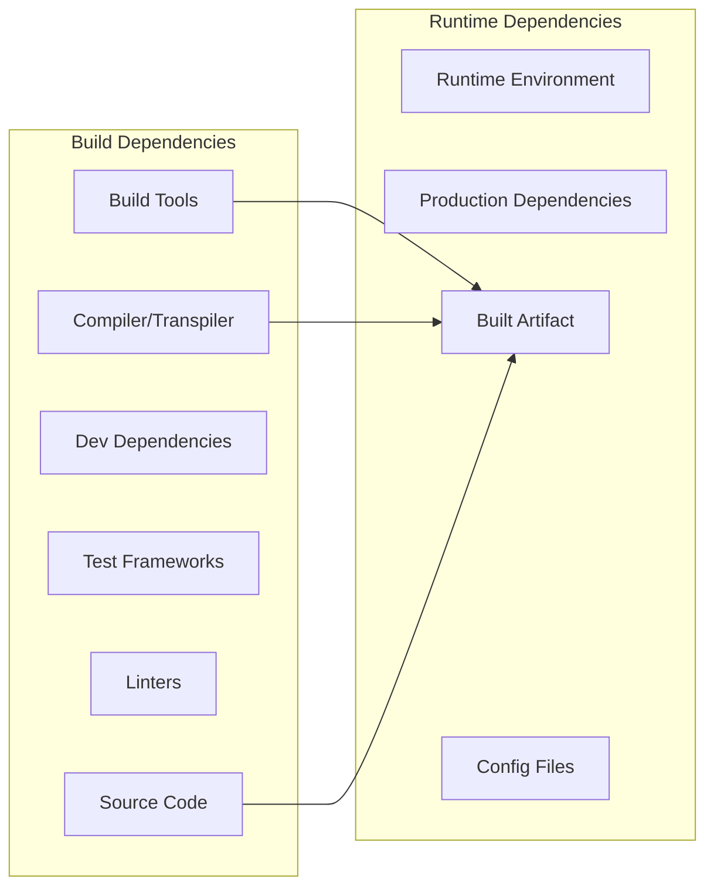
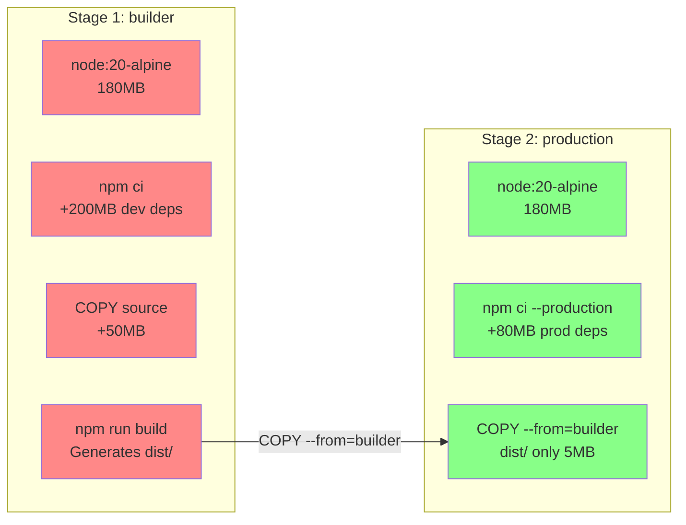
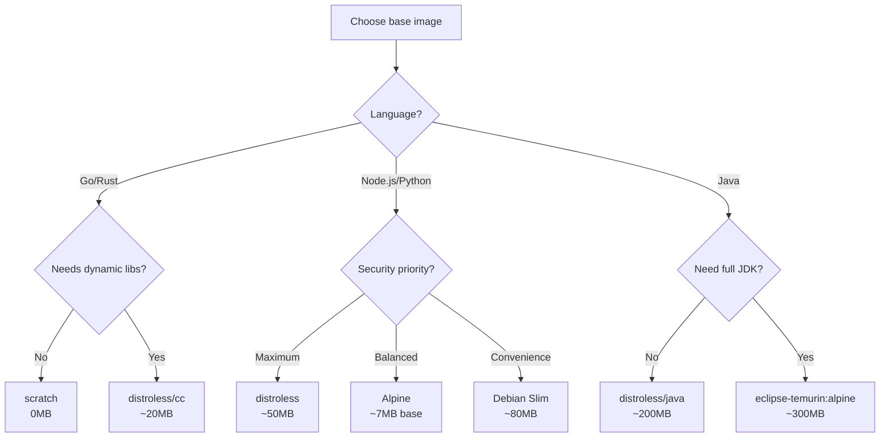

# Docker Multi-Stage Builds

## Why It Exists

Before multi-stage builds (introduced in Docker 17.05, 2017), producing small, secure production images required one of two unpleasant patterns:

**Pattern 1: Fat images** — Install build tools, build the application, and ship everything together. A Node.js application image might be 1.5GB because it includes `gcc`, `make`, `python`, dev dependencies, source code, and build artifacts — all for a 10MB compiled output.

**Pattern 2: Builder pattern with shell scripts** — Use two Dockerfiles and a shell script to copy artifacts between them:

```bash
# build.sh (the old way)
docker build -t myapp-builder -f Dockerfile.build .
docker create --name builder myapp-builder
docker cp builder:/app/dist ./dist
docker rm builder
docker build -t myapp -f Dockerfile.prod .
rm -rf ./dist
```

Both patterns were error-prone, slow, and hard to maintain. Multi-stage builds solved this by allowing multiple `FROM` statements in a single Dockerfile, where each stage can selectively copy artifacts from previous stages.

## First Principles

### The Build vs. Runtime Dependency Problem

Every application has two dependency sets:



| Language | Build Dependencies (typical) | Runtime Dependencies (typical) |
|----------|----------------------------|-----------------------------|
| TypeScript | `tsc`, `node_modules` (dev), source code | Node.js, `node_modules` (prod), compiled JS |
| Go | Go compiler, `go.sum`, source code | Static binary (nothing else!) |
| Rust | `rustc`, `cargo`, source code | Static binary or libc |
| Java | JDK, Maven/Gradle, source code | JRE, JAR file |
| Python | pip, build tools, source code | Python runtime, installed packages |

Multi-stage builds let you use all build dependencies in one stage and only copy the runtime artifacts to the final stage.

### The Size Equation

$$
S_{single} = S_{base} + S_{build\_tools} + S_{dev\_deps} + S_{source} + S_{artifacts}
$$

$$
S_{multi} = S_{runtime\_base} + S_{prod\_deps} + S_{artifacts}
$$

$$
\text{Savings} = S_{build\_tools} + S_{dev\_deps} + S_{source}
$$

For a typical Node.js application:

| Component | Size |
|-----------|------|
| Base image (node:20) | 350MB |
| Build tools (node:20-alpine) | 180MB |
| Dev dependencies | 200MB |
| Source code | 50MB |
| Production dependencies | 80MB |
| Compiled output | 5MB |
| **Single-stage total** | **685MB** |
| **Multi-stage total** | **265MB** (alpine + prod deps + output) |
| **With distroless** | **90MB** |

## Core Mechanics

### Basic Multi-Stage Structure

```dockerfile
# Stage 1: Build
FROM node:20-alpine AS builder
WORKDIR /app
COPY package.json package-lock.json ./
RUN npm ci
COPY . .
RUN npm run build

# Stage 2: Production
FROM node:20-alpine AS production
WORKDIR /app
COPY package.json package-lock.json ./
RUN npm ci --production && npm cache clean --force
COPY --from=builder /app/dist ./dist
USER node
EXPOSE 3000
CMD ["node", "dist/server.js"]
```



### Layer Caching in Multi-Stage Builds

Docker caches each layer based on the instruction and its inputs. Understanding cache invalidation is key to fast builds.

```dockerfile
# OPTIMAL layer ordering for cache hits:

# Layer 1: Base image (changes rarely)
FROM node:20-alpine AS builder

# Layer 2: Working directory (never changes)
WORKDIR /app

# Layer 3: Dependency manifest (changes sometimes)
COPY package.json package-lock.json ./

# Layer 4: Install dependencies (only re-runs when Layer 3 changes)
RUN npm ci

# Layer 5: Source code (changes frequently)
COPY . .

# Layer 6: Build (re-runs when Layer 5 changes)
RUN npm run build
```

**Cache hit matrix:**

| What Changed | Layers Rebuilt | Build Time |
|-------------|---------------|------------|
| Nothing | None (all cached) | <1 second |
| Source code only | Layer 5, 6 | 5-15 seconds |
| Dependencies (package-lock.json) | Layer 3, 4, 5, 6 | 30-120 seconds |
| Base image | All layers | 60-180 seconds |

### Advanced Multi-Stage Patterns

#### Pattern 1: Test Stage

Run tests in a dedicated stage without polluting the production image:

```dockerfile
# Stage 1: Dependencies
FROM node:20-alpine AS deps
WORKDIR /app
COPY package.json package-lock.json ./
RUN npm ci

# Stage 2: Build
FROM deps AS builder
COPY . .
RUN npm run build

# Stage 3: Test (does not affect production image)
FROM deps AS tester
COPY . .
RUN npm run lint && npm run test

# Stage 4: Production
FROM node:20-alpine AS production
WORKDIR /app
RUN addgroup -g 1001 appgroup && adduser -u 1001 -G appgroup -s /bin/sh -D appuser
COPY package.json package-lock.json ./
RUN npm ci --production && npm cache clean --force
COPY --from=builder /app/dist ./dist
USER appuser
CMD ["node", "dist/server.js"]
```

```bash
# Build only the test stage (CI)
docker build --target tester -t myapp:test .

# Build only production (CD)
docker build --target production -t myapp:prod .
```

#### Pattern 2: Shared Base Stage

```dockerfile
# Shared base for all stages
FROM node:20-alpine AS base
RUN apk add --no-cache dumb-init
WORKDIR /app

# Development stage
FROM base AS development
COPY package.json package-lock.json ./
RUN npm ci
COPY . .
CMD ["npx", "nodemon", "src/server.ts"]

# Build stage
FROM base AS builder
COPY package.json package-lock.json ./
RUN npm ci
COPY . .
RUN npm run build

# Production stage
FROM base AS production
ENV NODE_ENV=production
COPY package.json package-lock.json ./
RUN npm ci --production && npm cache clean --force
COPY --from=builder /app/dist ./dist
RUN chown -R node:node /app
USER node
ENTRYPOINT ["dumb-init", "--"]
CMD ["node", "dist/server.js"]
```

#### Pattern 3: Multi-Architecture Build

```dockerfile
FROM --platform=$BUILDPLATFORM node:20-alpine AS builder
ARG TARGETPLATFORM
ARG BUILDPLATFORM
RUN echo "Building on $BUILDPLATFORM for $TARGETPLATFORM"
WORKDIR /app
COPY package.json package-lock.json ./
RUN npm ci
COPY . .
RUN npm run build

FROM --platform=$TARGETPLATFORM node:20-alpine
WORKDIR /app
COPY --from=builder /app/dist ./dist
COPY --from=builder /app/node_modules ./node_modules
CMD ["node", "dist/server.js"]
```

```bash
# Build for multiple architectures
docker buildx build \
  --platform linux/amd64,linux/arm64 \
  -t ghcr.io/company/myapp:1.0 \
  --push .
```

#### Pattern 4: Go Static Binary

Go produces static binaries — the final image needs nothing but the binary:

```dockerfile
# Build stage with full Go toolchain
FROM golang:1.22-alpine AS builder
RUN apk add --no-cache git ca-certificates
WORKDIR /app

# Cache Go modules
COPY go.mod go.sum ./
RUN go mod download

# Build static binary
COPY . .
RUN CGO_ENABLED=0 GOOS=linux go build \
    -ldflags='-w -s -extldflags "-static"' \
    -o /app/server ./cmd/server

# Production: scratch image (0 bytes base)
FROM scratch
COPY --from=builder /etc/ssl/certs/ca-certificates.crt /etc/ssl/certs/
COPY --from=builder /app/server /server
EXPOSE 8080
ENTRYPOINT ["/server"]
```

**Image size comparison for Go:**

| Base Image | Size |
|-----------|------|
| `golang:1.22` (build) | 820MB |
| `ubuntu:22.04` | 77MB |
| `alpine:3.19` | 7.7MB |
| `gcr.io/distroless/static` | 2.5MB |
| `scratch` | 0MB |
| **Go binary** | 10-30MB |
| **Final image (scratch + binary)** | 10-30MB |

## Implementation — Production Dockerfiles

### TypeScript API Server

```dockerfile
# syntax=docker/dockerfile:1

# Stage 1: Install dependencies
FROM node:20-alpine AS deps
WORKDIR /app
COPY package.json package-lock.json ./
RUN --mount=type=cache,target=/root/.npm \
    npm ci

# Stage 2: Build TypeScript
FROM deps AS builder
COPY tsconfig.json ./
COPY src/ ./src/
RUN npm run build

# Stage 3: Production dependencies only
FROM node:20-alpine AS prod-deps
WORKDIR /app
COPY package.json package-lock.json ./
RUN --mount=type=cache,target=/root/.npm \
    npm ci --production

# Stage 4: Production image
FROM node:20-alpine AS production

# Security: create non-root user
RUN addgroup -g 1001 -S appgroup && \
    adduser -u 1001 -S appuser -G appgroup

# Security: install tini for proper PID 1 handling
RUN apk add --no-cache tini

WORKDIR /app

# Copy production dependencies
COPY --from=prod-deps --chown=appuser:appgroup /app/node_modules ./node_modules

# Copy built application
COPY --from=builder --chown=appuser:appgroup /app/dist ./dist
COPY --chown=appuser:appgroup package.json ./

# Security: switch to non-root user
USER appuser

# Expose port
EXPOSE 3000

# Health check
HEALTHCHECK --interval=30s --timeout=5s --start-period=10s --retries=3 \
    CMD wget --no-verbose --tries=1 --spider http://localhost:3000/health || exit 1

# Use tini as entrypoint for signal handling
ENTRYPOINT ["/sbin/tini", "--"]
CMD ["node", "dist/server.js"]
```

### Cache Mount Optimization

BuildKit's `--mount=type=cache` persists package manager caches between builds:

```dockerfile
# npm cache
RUN --mount=type=cache,target=/root/.npm npm ci

# pip cache
RUN --mount=type=cache,target=/root/.cache/pip pip install -r requirements.txt

# Go module cache
RUN --mount=type=cache,target=/go/pkg/mod go mod download

# Rust/Cargo cache
RUN --mount=type=cache,target=/usr/local/cargo/registry \
    --mount=type=cache,target=/app/target \
    cargo build --release

# apt cache
RUN --mount=type=cache,target=/var/cache/apt \
    --mount=type=cache,target=/var/lib/apt/lists \
    apt-get update && apt-get install -y libpq-dev
```

### Secret Mount (BuildKit)

Use secrets during build without leaking them into layers:

```dockerfile
# syntax=docker/dockerfile:1

FROM node:20-alpine AS builder
WORKDIR /app
COPY package.json package-lock.json ./

# Mount NPM token as a secret (not stored in any layer)
RUN --mount=type=secret,id=npmrc,target=/root/.npmrc \
    npm ci

COPY . .
RUN npm run build
```

```bash
# Build with secret
docker build --secret id=npmrc,src=$HOME/.npmrc -t myapp:1.0 .

# The .npmrc content is available during build but NOT stored in the image
# Verify: docker history myapp:1.0 shows no trace of the secret
```

## Edge Cases and Failure Modes

### 1. Cache Busting from COPY Ordering

```dockerfile
# BAD: Copying everything first busts cache on every code change
COPY . .
RUN npm ci
RUN npm run build

# GOOD: Copy dependency files first
COPY package.json package-lock.json ./
RUN npm ci
COPY . .
RUN npm run build
```

### 2. .dockerignore Matters

Without a `.dockerignore`, `COPY . .` sends the entire build context to the Docker daemon, including `.git/`, `node_modules/`, and build artifacts:

```
# .dockerignore
.git
.gitignore
node_modules
dist
*.md
.env*
.vscode
.idea
coverage
.nyc_output
Dockerfile
docker-compose*.yml
.dockerignore
```

Build context size impact:

| Without .dockerignore | With .dockerignore | Time Saved |
|----------------------|-------------------|------------|
| 500MB (with .git/) | 5MB | 10-30 seconds |
| 200MB (with node_modules/) | 5MB | 5-15 seconds |

### 3. Build Arguments and Cache

Build arguments (`ARG`) invalidate cache when their values change:

```dockerfile
# BAD: Changing VERSION invalidates everything after it
ARG VERSION
FROM node:20-alpine
RUN npm ci  # This layer is invalidated when VERSION changes!

# GOOD: Place ARG after expensive operations
FROM node:20-alpine
RUN npm ci
ARG VERSION  # Only layers after this are invalidated
LABEL version=$VERSION
```

### 4. Multi-Stage Copy from External Images

You can copy from published images, not just local stages:

```dockerfile
# Copy nginx config from official nginx image
COPY --from=nginx:1.25-alpine /etc/nginx/nginx.conf /etc/nginx/nginx.conf

# Copy a specific tool from another image
COPY --from=aquasec/trivy:latest /usr/local/bin/trivy /usr/local/bin/trivy

# Copy CA certificates
COPY --from=alpine:3.19 /etc/ssl/certs/ca-certificates.crt /etc/ssl/certs/
```

### 5. Intermediate Stage Size Does Not Matter

Only the final stage contributes to the image size. Build stages can be as large as needed:

```dockerfile
# This 2GB stage is thrown away
FROM ubuntu:22.04 AS builder
RUN apt-get update && apt-get install -y \
    build-essential cmake libssl-dev libpq-dev \
    python3 python3-pip python3-dev
# ... heavy build operations ...

# Final image is tiny
FROM gcr.io/distroless/cc
COPY --from=builder /app/binary /app/binary
CMD ["/app/binary"]
# Total size: ~30MB regardless of builder stage size
```

## Performance Characteristics

### Build Time Comparison

| Scenario | Single-Stage | Multi-Stage | Multi-Stage + Cache |
|----------|-------------|-------------|-------------------|
| Clean build | 90s | 120s (more layers) | 120s |
| Code change only | 90s (reinstalls deps) | 15s (deps cached) | 10s |
| Dependency change | 90s | 90s | 45s (npm cache mount) |
| Base image update | 90s | 120s | 90s |

### Image Size by Strategy

| Strategy | Node.js App | Go App | Python App |
|----------|-------------|--------|------------|
| Single-stage (full OS) | 1.2GB | 900MB | 1.5GB |
| Single-stage (Alpine) | 350MB | 300MB | 500MB |
| Multi-stage (Alpine) | 150MB | 15MB | 200MB |
| Multi-stage (distroless) | 130MB | 8MB | 150MB |
| Multi-stage (scratch) | N/A | 8MB | N/A |

### Layer Cache Hit Rates

In a typical CI/CD pipeline with 50 builds/day:

$$
\text{Cache Hit Rate} = \frac{\text{Cached Layers}}{\text{Total Layers}}
$$

| Build Trigger | Layers Rebuilt | Cache Hit Rate |
|--------------|---------------|----------------|
| Code push (no dep change) | 2/6 | 67% |
| Dependency update | 4/6 | 33% |
| Base image update | 6/6 | 0% |
| Branch switch | Varies | 50-80% |
| **Weighted average** | | **60-70%** |

Time saved per year with 60% cache rate:

$$
T_{saved} = 50 \frac{\text{builds}}{\text{day}} \times 365 \times 0.6 \times 60\text{s} = 657,000\text{s} \approx 182 \text{ hours}
$$

## Mathematical Foundations

### Optimal Layer Ordering

Given $n$ operations with change frequencies $f_1, f_2, ..., f_n$ (probability of change per build), the optimal layer ordering minimizes expected rebuild cost:

$$
E[\text{cost}] = \sum_{i=1}^{n} f_i \times \sum_{j=i}^{n} c_j
$$

Where $c_j$ is the cost (time) of layer $j$. This is minimized when operations are ordered by **increasing frequency of change**:

$$
f_1 \leq f_2 \leq ... \leq f_n
$$

**Proof:** If $f_i > f_{i+1}$ for some $i$, swapping them reduces the expected cost:

$$
\Delta E = (f_i - f_{i+1})(c_{i+1} - c_i)
$$

Since $f_i > f_{i+1}$ and typically $c_i, c_{i+1} > 0$, ordering by frequency is optimal (this is essentially the Weighted Shortest Job First algorithm applied to Dockerfiles).

**Practical ordering:**

| Layer | Change Frequency | Cost |
|-------|-----------------|------|
| Base image | ~1/month | High |
| System packages | ~1/week | Medium |
| Dependency manifest | ~2/week | Low |
| Install dependencies | ~2/week | High |
| Source code | ~5/day | Low |
| Build | ~5/day | Medium |

### Image Compression Ratio

Docker images use gzip compression for layers:

$$
\text{Compressed Size} = S_{raw} \times (1 - R_{compression})
$$

Typical compression ratios by content type:

| Content | Raw Size | Compressed | Ratio |
|---------|----------|------------|-------|
| JavaScript/TypeScript | 100MB | 25MB | 75% |
| Go binary | 30MB | 12MB | 60% |
| Node modules | 200MB | 60MB | 70% |
| Alpine base | 7.7MB | 3.4MB | 56% |
| Python packages | 150MB | 50MB | 67% |

## Real-World War Stories

::: info War Story — The 15-Minute Build
A team's CI pipeline took 15 minutes per build because their Dockerfile looked like this:

```dockerfile
FROM node:18
WORKDIR /app
COPY . .
RUN npm install
RUN npm run build
```

Every source code change triggered a full `npm install` because the `COPY . .` before `npm install` invalidated the cache. After restructuring to copy `package*.json` first and switching to multi-stage:

Build time dropped from 15 minutes to 45 seconds for code-only changes. Annual CI compute cost dropped by $18,000.
:::

::: info War Story — The Leaking NPM Token
A team used a `.npmrc` file with a private registry token:

```dockerfile
COPY .npmrc .
RUN npm ci
RUN rm .npmrc  # This does NOT remove it from the layer!
```

The token was visible in the image history. An attacker who gained read access to the registry could extract the `.npmrc` from Layer 3 using `docker save | tar -x`.

**Fix:** Switched to BuildKit secret mounts:
```dockerfile
RUN --mount=type=secret,id=npmrc,target=/root/.npmrc npm ci
```

The secret is never stored in any layer.
:::

::: info War Story — The Monorepo Build Cache Miss
A monorepo with 12 microservices had a single `package.json` at the root. Every service shared the same dependency layer, which was great for caching. But when ANY service changed its dependencies, ALL services had their cache invalidated — even if the change was unrelated.

**Fix:** Used workspace-specific dependency caching:
```dockerfile
COPY package.json package-lock.json ./
COPY packages/service-a/package.json ./packages/service-a/
RUN npm ci --workspace=packages/service-a
```

Cache invalidation became per-service, reducing average build times by 60%.
:::

## Decision Framework

### When to Use Multi-Stage Builds

| Scenario | Multi-Stage? | Why |
|----------|-------------|-----|
| Compiled languages (Go, Rust, Java) | Always | Build tools are huge, runtime needs are minimal |
| TypeScript/CoffeeScript | Always | Compiler not needed at runtime |
| Python with C extensions | Yes | Build tools (gcc, make) not needed at runtime |
| Interpreted languages (Node.js) | Usually | Separates dev/prod dependencies |
| Static sites (React, Vue) | Always | Only need nginx + static files |
| Development images | Sometimes | Multi-target: dev and prod from one Dockerfile |

### Base Image Selection Guide



### Optimization Priority

1. **Use multi-stage builds** (biggest impact: 50-90% size reduction)
2. **Order layers by change frequency** (10-50x faster incremental builds)
3. **Use .dockerignore** (faster build context transfer)
4. **Use cache mounts** (30-60% faster dependency installation)
5. **Choose smaller base images** (20-80% size reduction)
6. **Combine RUN commands** (fewer layers, slightly smaller)
7. **Clean up in the same RUN** (5-20% size reduction)

## Advanced Topics

### BuildKit Inline Cache

Export cache metadata inline with the image for remote cache sharing:

```bash
# Build and push with inline cache
docker buildx build \
  --cache-from type=registry,ref=ghcr.io/company/myapp:cache \
  --cache-to type=inline \
  -t ghcr.io/company/myapp:latest \
  --push .

# Subsequent builds (even on different machines) reuse the cache
docker buildx build \
  --cache-from type=registry,ref=ghcr.io/company/myapp:latest \
  -t ghcr.io/company/myapp:pr-123 .
```

### Registry Cache Backend

For maximum cache efficiency, use a dedicated cache image:

```bash
# Export max cache (all layers, including intermediate)
docker buildx build \
  --cache-from type=registry,ref=ghcr.io/company/myapp:cache \
  --cache-to type=registry,ref=ghcr.io/company/myapp:cache,mode=max \
  -t ghcr.io/company/myapp:latest \
  --push .
```

| Cache Mode | What's Cached | Use Case |
|-----------|--------------|----------|
| `mode=min` (default) | Only final stage layers | Simple projects |
| `mode=max` | All stages, all layers | Monorepos, complex builds |

### GitHub Actions Cache Integration

```yaml
# .github/workflows/build.yml
jobs:
  build:
    runs-on: ubuntu-latest
    steps:
      - uses: actions/checkout@v4

      - uses: docker/setup-buildx-action@v3

      - uses: docker/build-push-action@v5
        with:
          context: .
          push: true
          tags: ghcr.io/company/myapp:latest
          cache-from: type=gha
          cache-to: type=gha,mode=max
```

### Parallelizing Multi-Stage Builds

BuildKit automatically parallelizes independent stages:

```dockerfile
# These stages run IN PARALLEL:
FROM node:20-alpine AS frontend-builder
WORKDIR /frontend
COPY frontend/package.json frontend/package-lock.json ./
RUN npm ci
COPY frontend/ .
RUN npm run build

FROM golang:1.22-alpine AS backend-builder
WORKDIR /backend
COPY backend/go.mod backend/go.sum ./
RUN go mod download
COPY backend/ .
RUN CGO_ENABLED=0 go build -o /server ./cmd/server

# This stage depends on both (runs after both complete):
FROM alpine:3.19
COPY --from=backend-builder /server /server
COPY --from=frontend-builder /frontend/dist /static
CMD ["/server"]
```



```mermaid
gantt
    title Multi-Stage Build Timeline
    dateFormat X
    axisFormat %s

    section Frontend
    npm ci           :f1, 0, 30
    npm run build    :f2, after f1, 15

    section Backend
    go mod download  :b1, 0, 10
    go build         :b2, after b1, 20

    section Final
    COPY artifacts   :fin, after f2 b2, 2
```

Without parallelism, total build time = 30 + 15 + 10 + 20 + 2 = 77s.
With parallelism, total build time = max(45, 30) + 2 = 47s (39% faster).

---

*Next: [Security Hardening](./security-hardening.md) — Non-root containers, read-only filesystems, Trivy scanning, and distroless images.*
