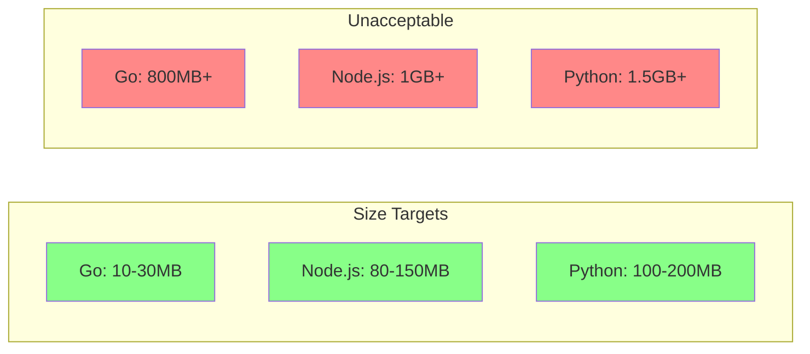
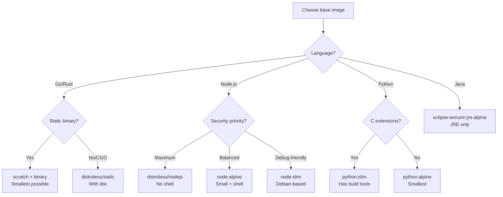

# Production Dockerfiles

## Why It Exists

Most Dockerfiles found in tutorials and quickstarts are designed for development simplicity, not production reliability. They run as root, use `:latest` tags, install dev dependencies, skip health checks, and produce images 10-50x larger than necessary. In production, every one of these shortcuts becomes a security vulnerability, a deployment bottleneck, or a debugging nightmare.

This page provides battle-tested Dockerfiles for the three most common backend languages — Node.js (TypeScript), Go, and Python — along with the reasoning behind every line. These are not toy examples — they include signal handling, health checks, security hardening, caching optimization, and multi-architecture support.

## First Principles

### The Production Dockerfile Requirements

Every production Dockerfile must satisfy:

| Requirement | Why |
|-------------|-----|
| Non-root user | Limit blast radius of container escape |
| Specific image tags (with SHA) | Reproducible builds, no surprise updates |
| Multi-stage build | Minimize image size and attack surface |
| Health check | Orchestrator-aware lifecycle management |
| Signal handling (PID 1) | Graceful shutdown, no zombie processes |
| Read-only filesystem compatible | Prevent malware persistence |
| No secrets in layers | Prevent credential leaks |
| Layer cache optimization | Fast CI/CD builds |
| Minimal runtime dependencies | Fewer CVEs, smaller images |
| Metadata labels | Image provenance and traceability |

### The Production Image Size Target



## Core Mechanics — Node.js (TypeScript)

### Complete Production Dockerfile

```dockerfile
# syntax=docker/dockerfile:1

# ============================================================
# Node.js TypeScript Production Dockerfile
# ============================================================
# Image size: ~120MB (Alpine) or ~90MB (distroless)
# Build time: ~30s (cold) / ~10s (cached code change)
# Security: non-root, read-only FS, no dev deps, tini
# ============================================================

# ------ Stage 1: Base ------
# Pinned to specific SHA for reproducibility
FROM node:20.11.1-alpine3.19 AS base
RUN apk add --no-cache tini
WORKDIR /app

# ------ Stage 2: Dependencies ------
FROM base AS deps
COPY package.json package-lock.json ./

# Use cache mount for faster rebuilds
RUN --mount=type=cache,target=/root/.npm \
    npm ci --ignore-scripts && \
    npm cache clean --force

# ------ Stage 3: Build ------
FROM deps AS builder
COPY tsconfig.json ./
COPY src/ ./src/

# Run TypeScript compilation
RUN npm run build

# Prune dev dependencies after build
RUN npm prune --production

# ------ Stage 4: Production ------
FROM base AS production

# Security: create application user
RUN addgroup -g 10001 -S appgroup && \
    adduser -u 10001 -S appuser -G appgroup \
    -h /home/appuser -s /sbin/nologin

# Copy production node_modules from builder (already pruned)
COPY --from=builder --chown=appuser:appgroup /app/node_modules ./node_modules

# Copy compiled JavaScript
COPY --from=builder --chown=appuser:appgroup /app/dist ./dist

# Copy package.json for runtime metadata
COPY --chown=appuser:appgroup package.json ./

# Create writable directories for read-only FS compatibility
RUN mkdir -p /tmp/app && chown appuser:appgroup /tmp/app

# Environment
ENV NODE_ENV=production
ENV PORT=3000

# OCI metadata labels
LABEL org.opencontainers.image.title="API Server"
LABEL org.opencontainers.image.description="Production Node.js API"
LABEL org.opencontainers.image.vendor="Company"
LABEL org.opencontainers.image.source="https://github.com/company/api-server"

# Security: switch to non-root user
USER appuser

# Expose port
EXPOSE 3000

# Health check
HEALTHCHECK --interval=30s --timeout=5s --start-period=15s --retries=3 \
    CMD wget --no-verbose --tries=1 --spider http://localhost:3000/health || exit 1

# Use tini for proper signal handling and zombie reaping
ENTRYPOINT ["/sbin/tini", "--"]
CMD ["node", "dist/server.js"]
```

### Corresponding Application Code

```typescript
// src/server.ts — Production-ready server entry point
import http from 'http';

const PORT = parseInt(process.env.PORT ?? '3000', 10);

// Track server state for graceful shutdown
let isShuttingDown = false;
let activeConnections = new Set<http.ServerResponse>();

const server = http.createServer((req, res) => {
  // Track active connections
  activeConnections.add(res);
  res.on('close', () => activeConnections.delete(res));

  // Health endpoints
  if (req.url === '/health' || req.url === '/health/live') {
    res.writeHead(200, { 'Content-Type': 'application/json' });
    res.end(JSON.stringify({ status: 'ok', uptime: process.uptime() }));
    return;
  }

  if (req.url === '/health/ready') {
    if (isShuttingDown) {
      res.writeHead(503, { 'Content-Type': 'application/json' });
      res.end(JSON.stringify({ status: 'shutting_down' }));
      return;
    }
    res.writeHead(200, { 'Content-Type': 'application/json' });
    res.end(JSON.stringify({ status: 'ready' }));
    return;
  }

  // Application routes...
  res.writeHead(200, { 'Content-Type': 'application/json' });
  res.end(JSON.stringify({ message: 'Hello from production' }));
});

// Graceful shutdown handler
function gracefulShutdown(signal: string) {
  console.log(`Received ${signal}, starting graceful shutdown...`);
  isShuttingDown = true;

  // Stop accepting new connections
  server.close(() => {
    console.log('Server closed, all connections drained');
    process.exit(0);
  });

  // Close idle keep-alive connections
  for (const res of activeConnections) {
    if (!res.headersSent) {
      res.setHeader('Connection', 'close');
    }
  }

  // Force exit after timeout
  // Leave buffer before SIGKILL: terminationGracePeriodSeconds(30) - preStop(5) = 25s
  setTimeout(() => {
    console.error('Forced shutdown after timeout');
    process.exit(1);
  }, 20_000);
}

process.on('SIGTERM', () => gracefulShutdown('SIGTERM'));
process.on('SIGINT', () => gracefulShutdown('SIGINT'));

server.listen(PORT, '0.0.0.0', () => {
  console.log(`Server listening on port ${PORT}`);
});
```

### NestJS Variant

```dockerfile
# syntax=docker/dockerfile:1

FROM node:20-alpine AS base
RUN apk add --no-cache tini
WORKDIR /app

FROM base AS deps
COPY package.json package-lock.json ./
RUN --mount=type=cache,target=/root/.npm npm ci

FROM deps AS builder
COPY tsconfig.json tsconfig.build.json nest-cli.json ./
COPY src/ ./src/
RUN npm run build
RUN npm prune --production

FROM base AS production
RUN addgroup -g 10001 -S appgroup && \
    adduser -u 10001 -S appuser -G appgroup -s /sbin/nologin

COPY --from=builder --chown=appuser:appgroup /app/node_modules ./node_modules
COPY --from=builder --chown=appuser:appgroup /app/dist ./dist
COPY --chown=appuser:appgroup package.json ./

ENV NODE_ENV=production
USER appuser
EXPOSE 3000

HEALTHCHECK --interval=30s --timeout=5s --start-period=20s --retries=3 \
    CMD wget --no-verbose --tries=1 --spider http://localhost:3000/health || exit 1

ENTRYPOINT ["/sbin/tini", "--"]
CMD ["node", "dist/main.js"]
```

## Core Mechanics — Go

### Complete Production Dockerfile

```dockerfile
# syntax=docker/dockerfile:1

# ============================================================
# Go Production Dockerfile
# ============================================================
# Image size: ~12MB (scratch) or ~15MB (distroless)
# Build time: ~20s (cold) / ~5s (cached code change)
# Security: static binary, scratch base, no shell
# ============================================================

# ------ Stage 1: Build ------
FROM golang:1.22-alpine AS builder

# Install CA certificates and timezone data (for scratch image)
RUN apk add --no-cache ca-certificates tzdata git

WORKDIR /app

# Cache Go modules
COPY go.mod go.sum ./
RUN go mod download && go mod verify

# Copy source code
COPY . .

# Build static binary with all optimizations
# -ldflags: -w removes DWARF debug info, -s removes symbol table
# CGO_ENABLED=0: static binary (no libc dependency)
# -trimpath: removes build paths from binary
ARG VERSION=dev
ARG COMMIT=unknown
ARG BUILD_TIME=unknown

RUN CGO_ENABLED=0 GOOS=linux go build \
    -ldflags="-w -s \
    -X main.Version=${VERSION} \
    -X main.Commit=${COMMIT} \
    -X main.BuildTime=${BUILD_TIME}" \
    -trimpath \
    -o /app/server ./cmd/server

# ------ Stage 2: Test (CI only) ------
FROM builder AS tester
RUN go test -v -race -coverprofile=coverage.out ./...

# ------ Stage 3: Production (scratch) ------
FROM scratch AS production

# Import CA certificates for HTTPS
COPY --from=builder /etc/ssl/certs/ca-certificates.crt /etc/ssl/certs/

# Import timezone data
COPY --from=builder /usr/share/zoneinfo /usr/share/zoneinfo

# Create non-root user (scratch has no useradd)
COPY --from=builder /etc/passwd /etc/passwd
COPY --from=builder /etc/group /etc/group

# Copy the binary
COPY --from=builder /app/server /server

# Labels
LABEL org.opencontainers.image.title="API Server"
LABEL org.opencontainers.image.source="https://github.com/company/api-server"

# Run as non-root (must exist in /etc/passwd copied above)
USER nobody:nogroup

EXPOSE 8080

# No health check in scratch (no tools available)
# Use Kubernetes probes instead

ENTRYPOINT ["/server"]
```

**Alternative with distroless (when you need gRPC health checks):**

```dockerfile
# For gRPC services, use distroless which includes grpc_health_probe
FROM gcr.io/distroless/static-debian12 AS production
COPY --from=builder /app/server /server
COPY --from=builder /etc/ssl/certs/ca-certificates.crt /etc/ssl/certs/
USER nonroot:nonroot
EXPOSE 8080
ENTRYPOINT ["/server"]
```

### Corresponding Go Application

```go
// cmd/server/main.go
package main

import (
	"context"
	"fmt"
	"log/slog"
	"net/http"
	"os"
	"os/signal"
	"syscall"
	"time"
)

var (
	Version   = "dev"
	Commit    = "unknown"
	BuildTime = "unknown"
)

func main() {
	logger := slog.New(slog.NewJSONHandler(os.Stdout, &slog.HandlerOptions{
		Level: slog.LevelInfo,
	}))
	slog.SetDefault(logger)

	port := os.Getenv("PORT")
	if port == "" {
		port = "8080"
	}

	mux := http.NewServeMux()

	// Health endpoints
	mux.HandleFunc("GET /health", func(w http.ResponseWriter, r *http.Request) {
		w.Header().Set("Content-Type", "application/json")
		fmt.Fprintf(w, `{"status":"ok","version":"%s","commit":"%s"}`, Version, Commit)
	})

	mux.HandleFunc("GET /health/live", func(w http.ResponseWriter, r *http.Request) {
		w.WriteHeader(http.StatusOK)
		w.Write([]byte(`{"status":"ok"}`))
	})

	mux.HandleFunc("GET /health/ready", func(w http.ResponseWriter, r *http.Request) {
		// Check dependencies here (DB, cache, etc.)
		w.WriteHeader(http.StatusOK)
		w.Write([]byte(`{"status":"ready"}`))
	})

	// Application routes
	mux.HandleFunc("GET /", func(w http.ResponseWriter, r *http.Request) {
		w.Header().Set("Content-Type", "application/json")
		w.Write([]byte(`{"message":"Hello from Go production"}`))
	})

	server := &http.Server{
		Addr:              ":" + port,
		Handler:           mux,
		ReadHeaderTimeout: 10 * time.Second,
		ReadTimeout:       30 * time.Second,
		WriteTimeout:      30 * time.Second,
		IdleTimeout:       120 * time.Second,
		MaxHeaderBytes:    1 << 20, // 1MB
	}

	// Start server in goroutine
	go func() {
		slog.Info("Server starting",
			"port", port,
			"version", Version,
			"commit", Commit,
			"build_time", BuildTime,
		)
		if err := server.ListenAndServe(); err != nil && err != http.ErrServerClosed {
			slog.Error("Server failed to start", "error", err)
			os.Exit(1)
		}
	}()

	// Wait for shutdown signal
	quit := make(chan os.Signal, 1)
	signal.Notify(quit, syscall.SIGTERM, syscall.SIGINT)
	sig := <-quit

	slog.Info("Shutdown signal received", "signal", sig.String())

	// Graceful shutdown with timeout
	ctx, cancel := context.WithTimeout(context.Background(), 25*time.Second)
	defer cancel()

	if err := server.Shutdown(ctx); err != nil {
		slog.Error("Server forced to shutdown", "error", err)
		os.Exit(1)
	}

	slog.Info("Server shutdown complete")
}
```

## Core Mechanics — Python

### Complete Production Dockerfile

```dockerfile
# syntax=docker/dockerfile:1

# ============================================================
# Python Production Dockerfile (FastAPI/Uvicorn)
# ============================================================
# Image size: ~150MB (Alpine) or ~120MB (slim)
# Build time: ~45s (cold) / ~10s (cached code change)
# Security: non-root, venv, no dev deps
# ============================================================

# ------ Stage 1: Build dependencies ------
FROM python:3.12-slim AS builder

# Install build dependencies (for compiled packages like psycopg2)
RUN apt-get update && apt-get install -y --no-install-recommends \
    build-essential \
    libpq-dev \
    && rm -rf /var/lib/apt/lists/*

WORKDIR /app

# Create virtual environment
RUN python -m venv /opt/venv
ENV PATH="/opt/venv/bin:$PATH"

# Install Python dependencies (cache mount for pip)
COPY requirements.txt ./
RUN --mount=type=cache,target=/root/.cache/pip \
    pip install --no-compile -r requirements.txt

# ------ Stage 2: Production ------
FROM python:3.12-slim AS production

# Install runtime dependencies only (not build tools)
RUN apt-get update && apt-get install -y --no-install-recommends \
    libpq5 \
    curl \
    tini \
    && rm -rf /var/lib/apt/lists/* \
    && apt-get purge -y --auto-remove

# Create non-root user
RUN groupadd -g 10001 appgroup && \
    useradd -u 10001 -g appgroup -s /usr/sbin/nologin -r appuser && \
    mkdir -p /home/appuser && chown appuser:appgroup /home/appuser

WORKDIR /app

# Copy virtual environment from builder
COPY --from=builder /opt/venv /opt/venv
ENV PATH="/opt/venv/bin:$PATH"
ENV PYTHONDONTWRITEBYTECODE=1
ENV PYTHONUNBUFFERED=1

# Copy application code
COPY --chown=appuser:appgroup . .

# Create writable directories
RUN mkdir -p /tmp/app && chown appuser:appgroup /tmp/app

# Labels
LABEL org.opencontainers.image.title="Python API Server"
LABEL org.opencontainers.image.source="https://github.com/company/python-api"

# Switch to non-root user
USER appuser

EXPOSE 8000

# Health check
HEALTHCHECK --interval=30s --timeout=5s --start-period=15s --retries=3 \
    CMD curl -f http://localhost:8000/health || exit 1

# Use tini for PID 1
ENTRYPOINT ["tini", "--"]

# Run with uvicorn (production ASGI server)
CMD ["uvicorn", "app.main:app", \
    "--host", "0.0.0.0", \
    "--port", "8000", \
    "--workers", "4", \
    "--no-access-log", \
    "--proxy-headers", \
    "--forwarded-allow-ips", "*"]
```

### Python with Poetry

```dockerfile
# syntax=docker/dockerfile:1

FROM python:3.12-slim AS builder

RUN pip install poetry==1.7.1
ENV POETRY_NO_INTERACTION=1 \
    POETRY_VIRTUALENVS_IN_PROJECT=1 \
    POETRY_VIRTUALENVS_CREATE=1 \
    POETRY_CACHE_DIR=/tmp/poetry_cache

WORKDIR /app

COPY pyproject.toml poetry.lock ./
RUN --mount=type=cache,target=/tmp/poetry_cache \
    poetry install --without dev --no-root

FROM python:3.12-slim AS production

RUN groupadd -g 10001 appgroup && \
    useradd -u 10001 -g appgroup -s /usr/sbin/nologin -r appuser

WORKDIR /app

# Copy the virtual environment
COPY --from=builder /app/.venv /app/.venv
ENV PATH="/app/.venv/bin:$PATH"
ENV PYTHONDONTWRITEBYTECODE=1
ENV PYTHONUNBUFFERED=1

COPY --chown=appuser:appgroup . .
USER appuser
EXPOSE 8000

CMD ["uvicorn", "app.main:app", "--host", "0.0.0.0", "--port", "8000"]
```

## Implementation — Supporting Files

### .dockerignore (Universal)

```
# Version control
.git
.gitignore

# Docker files
Dockerfile*
docker-compose*.yml
.dockerignore

# IDE
.vscode
.idea
*.swp
*.swo

# Documentation
*.md
LICENSE

# CI/CD
.github
.gitlab-ci.yml
Jenkinsfile

# Testing
coverage
.nyc_output
__pycache__
.pytest_cache
.coverage
htmlcov

# Node.js
node_modules
dist
.env*

# Go
vendor

# Python
*.pyc
*.pyo
__pycache__
.venv
*.egg-info

# OS
.DS_Store
Thumbs.db
```

### Docker Compose for Development

```yaml
# docker-compose.yml
services:
  api:
    build:
      context: .
      dockerfile: Dockerfile
      target: development  # Use development stage
    ports:
      - "3000:3000"
      - "9229:9229"  # Node.js debug port
    volumes:
      - ./src:/app/src:ro
      - ./package.json:/app/package.json:ro
    environment:
      - NODE_ENV=development
      - DATABASE_URL=postgresql://postgres:postgres@db:5432/app
      - REDIS_URL=redis://redis:6379
    depends_on:
      db:
        condition: service_healthy
      redis:
        condition: service_healthy

  db:
    image: postgres:16-alpine
    environment:
      POSTGRES_USER: postgres
      POSTGRES_PASSWORD: postgres
      POSTGRES_DB: app
    volumes:
      - pg_data:/var/lib/postgresql/data
    healthcheck:
      test: ["CMD-SHELL", "pg_isready -U postgres"]
      interval: 5s
      timeout: 5s
      retries: 5

  redis:
    image: redis:7-alpine
    healthcheck:
      test: ["CMD", "redis-cli", "ping"]
      interval: 5s
      timeout: 5s
      retries: 5

volumes:
  pg_data:
```

## Edge Cases and Failure Modes

### 1. Alpine DNS Resolution Delay

Alpine uses musl libc which handles DNS differently from glibc. Go applications on Alpine may experience 5-second DNS resolution delays due to musl's handling of dual A/AAAA queries.

```dockerfile
# Fix for Go on Alpine: use CGO_ENABLED=0 (pure Go DNS resolver)
RUN CGO_ENABLED=0 go build -o /server ./cmd/server

# Or use the Go net resolver explicitly in code
# import _ "net" // ensure Go DNS resolver
# os.Setenv("GODEBUG", "netdns=go")
```

### 2. Node.js Heap Memory in Containers

Node.js does not automatically detect container memory limits. It uses host memory for default heap calculations:

```dockerfile
# Set Node.js to respect container memory limits
ENV NODE_OPTIONS="--max-old-space-size=384"
# For a 512MB container: leave ~128MB for non-heap (stack, buffers, native)

# Or use the automatic flag (Node.js 19+)
ENV NODE_OPTIONS="--max-old-space-size=0"
# 0 means "auto-detect" which respects cgroup limits
```

### 3. Python pip and Wheel Caching

```dockerfile
# BAD: Downloads wheels every build
RUN pip install -r requirements.txt

# GOOD: Uses cache mount
RUN --mount=type=cache,target=/root/.cache/pip \
    pip install -r requirements.txt

# GOOD: Pre-compiled wheels for reproducibility
RUN pip install --no-cache-dir --only-binary=:all: -r requirements.txt
```

### 4. Timezone Data in Scratch Images

```dockerfile
# Go binary that needs timezone support
FROM scratch
# Must copy timezone data from build stage
COPY --from=builder /usr/share/zoneinfo /usr/share/zoneinfo
ENV TZ=UTC
```

### 5. Signal Handling in Python

```python
# Python does not handle SIGTERM by default
import signal
import sys
import uvicorn

def handle_signal(signum, frame):
    print(f"Received signal {signum}, shutting down...")
    sys.exit(0)

signal.signal(signal.SIGTERM, handle_signal)
signal.signal(signal.SIGINT, handle_signal)

# Uvicorn handles signals internally when run as main
if __name__ == "__main__":
    uvicorn.run("app.main:app", host="0.0.0.0", port=8000)
```

## Performance Characteristics

### Image Size Comparison

| Application | Naive Dockerfile | Optimized Multi-Stage | With Distroless |
|-------------|-----------------|----------------------|----------------|
| Node.js API | 1.2 GB | 120 MB | 90 MB |
| Go API | 850 MB | 12 MB (scratch) | 15 MB |
| Python FastAPI | 1.5 GB | 150 MB | 130 MB |
| Next.js SSR | 1.8 GB | 180 MB | N/A |
| Rust API | 1.5 GB | 8 MB (scratch) | 10 MB |

### Build Time Comparison

| Scenario | Naive | Optimized (cold) | Optimized (cached) |
|----------|-------|-------------------|---------------------|
| Node.js clean build | 180s | 90s | N/A |
| Node.js code change | 180s | 15s | 15s |
| Node.js dep change | 180s | 90s | 45s (cache mount) |
| Go clean build | 120s | 60s | N/A |
| Go code change | 120s | 10s | 10s |
| Python clean build | 240s | 120s | N/A |
| Python code change | 240s | 10s | 10s |

### Pull Time (100Mbps network)

$$
T_{pull} = \frac{S_{compressed}}{BW} + T_{extract}
$$

| Image | Compressed Size | Pull Time | Extract Time | Total |
|-------|----------------|-----------|-------------|-------|
| 1.2GB Node (naive) | ~450MB | 36s | 15s | 51s |
| 120MB Node (optimized) | ~45MB | 3.6s | 3s | 6.6s |
| 12MB Go (scratch) | ~5MB | 0.4s | 0.5s | 0.9s |

## Mathematical Foundations

### Image Layer Deduplication Savings

When running $N$ microservices sharing the same base image and runtime:

$$
S_{shared} = S_{base} + S_{runtime} + \sum_{i=1}^{N} S_{app_i}
$$

$$
S_{naive} = N \times (S_{base} + S_{runtime} + S_{app})
$$

$$
\text{Savings} = 1 - \frac{S_{shared}}{S_{naive}} = 1 - \frac{S_{base} + S_{runtime} + N \times S_{app}}{N \times (S_{base} + S_{runtime} + S_{app})}
$$

For 10 Node.js services (base+runtime: 100MB, app: 20MB each):

$$
\text{Savings} = 1 - \frac{100 + 200}{10 \times 120} = 1 - \frac{300}{1200} = 75\%
$$

Disk savings: 900MB (stored 300MB instead of 1200MB).

### Build Cache Efficiency

$$
\text{Efficiency} = \frac{\sum_{i} \text{cached}_i \times \text{cost}_i}{\sum_{i} \text{cost}_i}
$$

For a 6-layer Dockerfile with costs $[5s, 1s, 2s, 60s, 3s, 15s]$ and cache hits $[1, 1, 1, 1, 0, 0]$ (code change only):

$$
\text{Efficiency} = \frac{5 + 1 + 2 + 60}{5 + 1 + 2 + 60 + 3 + 15} = \frac{68}{86} = 79\%
$$

Time saved: $68\text{s}$ out of $86\text{s}$ total = build runs in $18\text{s}$ instead of $86\text{s}$.

## Real-World War Stories

::: info War Story — The 15-Minute Container Start
A Java application in Docker took 15 minutes to start because it was using a fat JAR with all dependencies extracted into the filesystem. The overlay2 copy-on-write overhead for 50,000 small files was enormous. The startup involved touching each file, triggering 50,000 CoW operations.

**Fix:** Used a layered JAR approach where Spring Boot's layers were separate Docker layers, and the frequently-changing application code was in the top layer. Startup dropped to 30 seconds.
:::

::: info War Story — The Go Binary That Crashed on Alpine
A Go service built on macOS with `GOOS=linux` worked in development but crashed with a segfault on Alpine. The issue: CGO was enabled (default on macOS), and the binary linked against glibc, but Alpine uses musl.

**Fix:** Added `CGO_ENABLED=0` to the build command, producing a fully static binary that works on any Linux distribution, including scratch.
:::

::: info War Story — The Python Image That Doubled
A Python team noticed their image size doubled from 150MB to 300MB after adding a single dependency (`pandas`). Investigation revealed that `pandas` pulled in `numpy`, which included pre-compiled C extensions for every CPU architecture. The fix was to use `--only-binary=:all:` to ensure pre-compiled wheels matched the target architecture, and adding `numpy` and `pandas` to a separate layer for caching.
:::

## Decision Framework

### Base Image Selection



### Dockerfile Checklist

Use this checklist before deploying any Dockerfile to production:

- [ ] Uses specific base image tag (not `:latest`)
- [ ] Multi-stage build separates build from runtime
- [ ] Non-root user created and set with `USER`
- [ ] `COPY --chown` used for application files
- [ ] `.dockerignore` excludes unnecessary files
- [ ] Dependencies cached via layer ordering
- [ ] `HEALTHCHECK` defined
- [ ] Signal handling configured (tini or application-level)
- [ ] Read-only filesystem compatible
- [ ] No secrets in any layer
- [ ] OCI labels added
- [ ] Production dependencies only (no dev deps)
- [ ] Vulnerability scan passes (zero critical CVEs)

## Advanced Topics

### Reproducible Builds with SHA Pinning

```dockerfile
# Pin EVERYTHING by digest for complete reproducibility
FROM node:20.11.1-alpine3.19@sha256:abc123... AS base

# Pin apk packages by version
RUN apk add --no-cache tini=0.19.0-r2

# Pin npm packages via lockfile (npm ci)
COPY package-lock.json ./
RUN npm ci  # Respects exact versions in lockfile
```

### Multi-Platform Build Matrix

```bash
# Build for all platforms in one command
docker buildx build \
  --platform linux/amd64,linux/arm64 \
  --build-arg VERSION=$(git describe --tags) \
  --build-arg COMMIT=$(git rev-parse HEAD) \
  --build-arg BUILD_TIME=$(date -u +"%Y-%m-%dT%H:%M:%SZ") \
  -t ghcr.io/company/myapp:$(git describe --tags) \
  -t ghcr.io/company/myapp:latest \
  --push .
```

### Kaniko for Building in Kubernetes

When you cannot mount the Docker socket (security requirement), use Kaniko:

```yaml
apiVersion: batch/v1
kind: Job
metadata:
  name: build-image
spec:
  template:
    spec:
      containers:
        - name: kaniko
          image: gcr.io/kaniko-project/executor:latest
          args:
            - "--dockerfile=Dockerfile"
            - "--context=git://github.com/company/myapp.git#refs/heads/main"
            - "--destination=ghcr.io/company/myapp:latest"
            - "--cache=true"
            - "--cache-repo=ghcr.io/company/myapp/cache"
          volumeMounts:
            - name: docker-config
              mountPath: /kaniko/.docker
      volumes:
        - name: docker-config
          secret:
            secretName: docker-registry-credentials
      restartPolicy: Never
```

---

*Next: [Compose Patterns](./compose-patterns.md) — Development, staging, and production Docker Compose patterns for complex multi-service architectures.*
