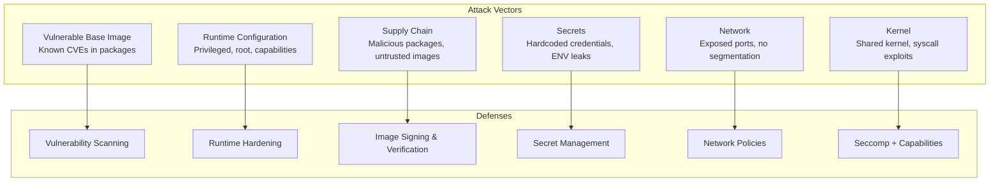

# Docker Security Hardening

## Why It Exists

Containers provide process-level isolation, not security isolation. A container running as root with default settings shares the same kernel as the host — a kernel exploit or container escape gives an attacker root access to the host machine and every other container on it. In 2019, the CVE-2019-5736 runc vulnerability allowed a malicious container to overwrite the host runc binary and gain host root access. In 2022, CVE-2022-0185 allowed a container with `CAP_SYS_ADMIN` to escape via a heap overflow in the filesystem context handling code.

Docker security hardening is not optional — it is the difference between an attacker compromising one container and an attacker compromising your entire infrastructure.

### The Attack Surface



## First Principles

### Defense in Depth

Security must be layered — no single measure is sufficient:

| Layer | Defense | What It Prevents |
|-------|---------|-----------------|
| 1 | Minimal base image | Reduces CVE surface area |
| 2 | Non-root user | Limits damage from container compromise |
| 3 | Read-only filesystem | Prevents malware persistence |
| 4 | Drop all capabilities | Prevents privilege escalation |
| 5 | Seccomp profile | Blocks dangerous syscalls |
| 6 | Vulnerability scanning | Catches known CVEs before deployment |
| 7 | Image signing | Prevents supply chain attacks |
| 8 | Network segmentation | Limits lateral movement |
| 9 | Runtime monitoring | Detects anomalous behavior |

### The Principle of Least Privilege

Every container should have the absolute minimum permissions required to function:

$$
\text{Permissions}_{container} = \text{Permissions}_{minimum\_required}
$$

Not:

$$
\text{Permissions}_{container} = \text{Permissions}_{default} \supset \text{Permissions}_{minimum\_required}
$$

## Core Mechanics

### 1. Non-Root Containers

By default, Docker runs containers as root (UID 0). This is dangerous because:
- If the attacker escapes the container, they are root on the host
- Root can modify system files inside the container
- Root can install tools useful for lateral movement

```dockerfile
# Create a non-root user
FROM node:20-alpine

# Create user and group with specific IDs
RUN addgroup -g 1001 -S appgroup && \
    adduser -u 1001 -S appuser -G appgroup -h /home/appuser -s /sbin/nologin

WORKDIR /app

# Install dependencies as root (need write access to /app)
COPY package.json package-lock.json ./
RUN npm ci --production && npm cache clean --force

# Copy application code and change ownership
COPY --chown=appuser:appgroup . .

# Switch to non-root user BEFORE CMD
USER appuser

# Verify
# RUN whoami  # appuser
# RUN id      # uid=1001(appuser) gid=1001(appgroup)

CMD ["node", "server.js"]
```

**Common issue: file permission errors with non-root:**

```dockerfile
# The app needs to write to /tmp and /var/cache
# Solution: Create these directories with correct ownership
RUN mkdir -p /tmp/app /var/cache/app && \
    chown -R appuser:appgroup /tmp/app /var/cache/app

# Or use emptyDir/tmpfs in Kubernetes
```

### 2. Read-Only Root Filesystem

Prevents attackers from writing malware, scripts, or configuration changes to the container:

```bash
# Run with read-only filesystem
docker run --read-only \
  --tmpfs /tmp:rw,noexec,nosuid,size=100m \
  --tmpfs /var/run:rw,noexec,nosuid,size=10m \
  myapp
```

```dockerfile
# Design the application for read-only FS
FROM node:20-alpine AS production
WORKDIR /app

COPY --from=builder /app/dist ./dist
COPY --from=deps /app/node_modules ./node_modules

# Create writable directories that will be tmpfs-mounted
RUN mkdir -p /tmp/app /var/run/app

USER appuser
CMD ["node", "dist/server.js"]
```

**Application changes needed for read-only filesystem:**

```typescript
import { tmpdir } from 'os';
import { join } from 'path';
import { mkdirSync, existsSync } from 'fs';

// Use /tmp for temporary files (tmpfs-mounted)
const TMP_DIR = join(tmpdir(), 'app');
if (!existsSync(TMP_DIR)) {
  mkdirSync(TMP_DIR, { recursive: true });
}

// Use environment variable for log destination
// Instead of writing to /var/log/app.log, write to stdout
console.log(JSON.stringify({ level: 'info', message: 'Application started' }));

// For file uploads, stream to external storage (S3) instead of local disk
```

### 3. Distroless Images

Google's distroless images contain only the application runtime — no shell, no package manager, no utilities:

```dockerfile
# Multi-stage build with distroless final image
FROM node:20-alpine AS builder
WORKDIR /app
COPY package.json package-lock.json ./
RUN npm ci
COPY . .
RUN npm run build

FROM node:20-alpine AS prod-deps
WORKDIR /app
COPY package.json package-lock.json ./
RUN npm ci --production

# Distroless Node.js image
FROM gcr.io/distroless/nodejs20-debian12
WORKDIR /app
COPY --from=prod-deps /app/node_modules ./node_modules
COPY --from=builder /app/dist ./dist
CMD ["dist/server.js"]
```

**Distroless advantages:**

| Feature | Alpine | Distroless | Scratch |
|---------|--------|-----------|---------|
| Shell | Yes (`/bin/sh`) | No | No |
| Package manager | Yes (`apk`) | No | No |
| Debug tools | Minimal | None | None |
| CVE surface | ~20 packages | ~5 packages | 0 packages |
| Size | 7-50MB | 20-50MB | 0MB |
| Debugging | Easy | Hard (use debug variant) | Very hard |
| Suitable for | Most apps | Production | Static binaries |

::: tip
For debugging distroless containers in production, use the debug variant:
```bash
# Debug variant has a busybox shell
FROM gcr.io/distroless/nodejs20-debian12:debug
# Or use kubectl debug with ephemeral containers
kubectl debug <pod> -it --image=busybox --target=<container>
```
:::

### 4. Capability Management

Linux capabilities split root privileges into distinct units. Docker grants a default set that is too permissive:

```bash
# Default Docker capabilities (14 out of ~40):
# CAP_AUDIT_WRITE, CAP_CHOWN, CAP_DAC_OVERRIDE, CAP_FOWNER,
# CAP_FSETID, CAP_KILL, CAP_MKNOD, CAP_NET_BIND_SERVICE,
# CAP_NET_RAW, CAP_SETFCAP, CAP_SETGID, CAP_SETPCAP,
# CAP_SETUID, CAP_SYS_CHROOT

# Drop ALL and add back only what's needed
docker run --cap-drop=ALL --cap-add=NET_BIND_SERVICE myapp
```

**Capability audit for common workloads:**

| Workload | Required Capabilities |
|----------|----------------------|
| Web server (port > 1024) | None (`--cap-drop=ALL`) |
| Web server (port 80/443) | `NET_BIND_SERVICE` |
| Database (PostgreSQL) | `CHOWN`, `SETUID`, `SETGID`, `FOWNER` |
| Health check with ping | `NET_RAW` |
| Most applications | None (`--cap-drop=ALL`) |

### 5. Vulnerability Scanning with Trivy

Trivy scans container images, filesystems, and IaC for known vulnerabilities:

```bash
# Scan an image
trivy image myapp:1.0

# Scan with severity filter
trivy image --severity CRITICAL,HIGH myapp:1.0

# Scan and fail CI if critical vulnerabilities found
trivy image --exit-code 1 --severity CRITICAL myapp:1.0

# Scan local Dockerfile
trivy config Dockerfile

# Scan filesystem (for embedded dependencies)
trivy fs --scanners vuln,secret,misconfig .

# Generate SBOM (Software Bill of Materials)
trivy image --format spdx-json --output sbom.json myapp:1.0

# Scan with ignore file
trivy image --ignorefile .trivyignore myapp:1.0
```

**.trivyignore:**

```
# Accepted risks (document why!)
# CVE-2023-12345: false positive, not affected because we don't use X feature
CVE-2023-12345

# CVE-2023-67890: fix not available yet, mitigated by network policy
CVE-2023-67890
```

**CI/CD integration:**

```yaml
# GitHub Actions
- name: Run Trivy vulnerability scanner
  uses: aquasecurity/trivy-action@master
  with:
    image-ref: 'ghcr.io/company/myapp:${{ github.sha }}'
    format: 'sarif'
    output: 'trivy-results.sarif'
    severity: 'CRITICAL,HIGH'
    exit-code: '1'

- name: Upload Trivy scan results
  uses: github/codeql-action/upload-sarif@v3
  if: always()
  with:
    sarif_file: 'trivy-results.sarif'
```

**Trivy scan output interpretation:**

```typescript
interface TrivyVulnerability {
  VulnerabilityID: string;      // CVE-2023-12345
  PkgName: string;              // openssl
  InstalledVersion: string;     // 3.1.1
  FixedVersion: string;         // 3.1.2
  Severity: 'CRITICAL' | 'HIGH' | 'MEDIUM' | 'LOW' | 'UNKNOWN';
  Title: string;
  Description: string;
  References: string[];
  CVSS: Record<string, { V3Score: number }>;
}

function assessRisk(vuln: TrivyVulnerability): string {
  const cvssScore = Object.values(vuln.CVSS)?.[0]?.V3Score ?? 0;

  if (vuln.Severity === 'CRITICAL' && vuln.FixedVersion) {
    return 'MUST_FIX: Critical vulnerability with available fix';
  }
  if (vuln.Severity === 'CRITICAL' && !vuln.FixedVersion) {
    return 'MITIGATE: Critical vulnerability without fix — implement compensating controls';
  }
  if (cvssScore >= 7.0 && vuln.FixedVersion) {
    return 'SHOULD_FIX: High-severity with available fix';
  }
  return 'MONITOR: Track for future fix availability';
}
```

### 6. Image Signing and Verification

```bash
# Generate cosign key pair
cosign generate-key-pair

# Sign an image
cosign sign --key cosign.key ghcr.io/company/myapp@sha256:abc123...

# Verify before deployment
cosign verify --key cosign.pub ghcr.io/company/myapp@sha256:abc123...

# Keyless signing with GitHub Actions OIDC (recommended)
cosign sign --yes ghcr.io/company/myapp@sha256:abc123...
# Uses GitHub's OIDC identity, no manual key management
```

**Admission control with Kyverno:**

```yaml
apiVersion: kyverno.io/v1
kind: ClusterPolicy
metadata:
  name: verify-image-signatures
spec:
  validationFailureAction: enforce
  webhookTimeoutSeconds: 30
  rules:
    - name: verify-cosign-signature
      match:
        resources:
          kinds:
            - Pod
      verifyImages:
        - imageReferences:
            - "ghcr.io/company/*"
          attestors:
            - entries:
                - keys:
                    publicKeys: |
                      -----BEGIN PUBLIC KEY-----
                      MFkwEwYHKoZIzj0CAQYIKoZIzj0DAQcDQgAE...
                      -----END PUBLIC KEY-----
```

### 7. Docker Daemon Hardening

```json
// /etc/docker/daemon.json
{
  "icc": false,
  "userns-remap": "default",
  "no-new-privileges": true,
  "log-driver": "json-file",
  "log-opts": {
    "max-size": "10m",
    "max-file": "3"
  },
  "live-restore": true,
  "userland-proxy": false,
  "default-ulimits": {
    "nofile": {
      "Name": "nofile",
      "Hard": 65536,
      "Soft": 65536
    },
    "nproc": {
      "Name": "nproc",
      "Hard": 4096,
      "Soft": 4096
    }
  },
  "seccomp-profile": "/etc/docker/seccomp-default.json",
  "storage-driver": "overlay2"
}
```

| Setting | Purpose |
|---------|---------|
| `icc: false` | Disable inter-container communication on default bridge |
| `userns-remap` | Map container root to unprivileged host user |
| `no-new-privileges` | Prevent SUID/SGID escalation |
| `live-restore` | Keep containers running during daemon restart |
| `userland-proxy: false` | Use iptables instead of docker-proxy (better performance) |

## Implementation — Complete Hardened Dockerfile

```dockerfile
# syntax=docker/dockerfile:1

# ----- Stage 1: Dependencies -----
FROM node:20-alpine AS deps
WORKDIR /app

# Only copy dependency files for cache optimization
COPY package.json package-lock.json ./

# Use cache mount for npm
RUN --mount=type=cache,target=/root/.npm \
    npm ci --production --ignore-scripts && \
    npm cache clean --force

# ----- Stage 2: Build -----
FROM node:20-alpine AS builder
WORKDIR /app
COPY package.json package-lock.json ./
RUN --mount=type=cache,target=/root/.npm npm ci
COPY tsconfig.json ./
COPY src/ ./src/
RUN npm run build

# ----- Stage 3: Security scan (CI only) -----
FROM deps AS scanner
# Copy built artifacts for scanning
COPY --from=builder /app/dist ./dist
# Trivy runs in CI, not in the image

# ----- Stage 4: Production -----
FROM node:20-alpine AS production

# Install security updates
RUN apk upgrade --no-cache

# Install tini for proper PID 1 handling
RUN apk add --no-cache tini

# Create non-root user with specific UID/GID
RUN addgroup -g 10001 -S appgroup && \
    adduser -u 10001 -S appuser -G appgroup \
    -h /home/appuser -s /sbin/nologin

# Set working directory
WORKDIR /app

# Copy production dependencies
COPY --from=deps --chown=appuser:appgroup /app/node_modules ./node_modules

# Copy built application
COPY --from=builder --chown=appuser:appgroup /app/dist ./dist

# Copy package.json for version info
COPY --chown=appuser:appgroup package.json ./

# Create directories the app needs to write to
RUN mkdir -p /tmp/app && chown appuser:appgroup /tmp/app

# Remove unnecessary files from node_modules
RUN find node_modules -name "*.md" -delete 2>/dev/null; \
    find node_modules -name "*.txt" -delete 2>/dev/null; \
    find node_modules -name ".npmignore" -delete 2>/dev/null; \
    find node_modules -name "CHANGELOG*" -delete 2>/dev/null; \
    find node_modules -name "LICENSE*" -delete 2>/dev/null; \
    true

# Set environment
ENV NODE_ENV=production
ENV NPM_CONFIG_UPDATE_NOTIFIER=false

# Labels (OCI standard)
LABEL org.opencontainers.image.source="https://github.com/company/myapp"
LABEL org.opencontainers.image.description="Production API server"
LABEL org.opencontainers.image.vendor="Company"

# Switch to non-root user
USER appuser

# Expose non-privileged port
EXPOSE 3000

# Health check
HEALTHCHECK --interval=30s --timeout=5s --start-period=10s --retries=3 \
    CMD wget --no-verbose --tries=1 --spider http://localhost:3000/health || exit 1

# Use tini as init for signal handling and zombie reaping
ENTRYPOINT ["/sbin/tini", "--"]
CMD ["node", "dist/server.js"]
```

**Runtime hardening (Docker Compose):**

```yaml
services:
  api:
    image: ghcr.io/company/myapp:1.0
    read_only: true
    tmpfs:
      - /tmp:rw,noexec,nosuid,size=100m
    security_opt:
      - no-new-privileges:true
      - seccomp:seccomp-profile.json
    cap_drop:
      - ALL
    deploy:
      resources:
        limits:
          cpus: '1.0'
          memory: 512M
          pids: 100
        reservations:
          cpus: '0.25'
          memory: 128M
    healthcheck:
      test: ["CMD", "wget", "--spider", "-q", "http://localhost:3000/health"]
      interval: 30s
      timeout: 5s
      retries: 3
```

## Edge Cases and Failure Modes

### 1. Alpine musl vs glibc

Alpine uses musl libc instead of glibc. Some applications (particularly those with native modules) may behave differently or crash:

```bash
# Node.js native modules may fail on Alpine
npm install sharp  # Uses libvips — needs alpine-specific build

# Fix: Install build dependencies in Alpine
RUN apk add --no-cache --virtual .build-deps \
    python3 make g++ && \
    npm ci --production && \
    apk del .build-deps

# Or use the full Node image for the build stage
```

### 2. Distroless Debugging Challenge

With no shell, you cannot exec into the container:

```bash
# This fails on distroless
docker exec -it container /bin/sh
# exec: "/bin/sh": stat /bin/sh: no such file or directory

# Solutions:
# 1. Use the debug variant
FROM gcr.io/distroless/nodejs20-debian12:debug

# 2. Use ephemeral containers (Kubernetes)
kubectl debug pod/myapp -it --image=busybox --target=myapp

# 3. Copy files out
docker cp container:/app/logs ./logs
```

### 3. Read-Only FS with npm/node

Node.js writes to several locations by default:

```bash
# Locations Node.js may try to write:
# - /tmp (temp files) — mount as tmpfs
# - /home/node/.npm (npm cache) — not needed in production
# - /app/node_modules/.cache — set NODE_OPTIONS
# - /root/.node_repl_history — not relevant in production

# Fix: ensure writable tmpfs for /tmp
docker run --read-only --tmpfs /tmp:rw,noexec,nosuid myapp
```

### 4. UID Mapping with Volumes

When using non-root users, volume-mounted files may have wrong ownership:

```bash
# Host file owned by UID 1000
# Container runs as UID 10001
# Result: Permission denied

# Fix 1: Match UIDs
docker run -u 1000:1000 -v ./data:/app/data myapp

# Fix 2: Use init container to fix permissions (Kubernetes)
initContainers:
  - name: fix-permissions
    image: busybox
    command: ["sh", "-c", "chown -R 10001:10001 /app/data"]
    volumeMounts:
      - name: data
        mountPath: /app/data
```

### 5. Secret Scanning False Positives

Trivy's secret scanner may flag test fixtures, example configs, or documentation:

```yaml
# .trivyignore.yaml
vulnerabilities: []
secrets:
  - id: "generic-api-key"
    path: "tests/fixtures/example-config.json"
  - id: "aws-access-key-id"
    path: "docs/examples/aws-setup.md"
```

## Performance Characteristics

### Image Scan Times

| Image Size | Trivy Scan Time | Grype Scan Time | Snyk Scan Time |
|-----------|----------------|-----------------|----------------|
| 50MB (Alpine) | 5-10s | 3-8s | 10-20s |
| 200MB (Debian Slim) | 15-30s | 10-20s | 30-60s |
| 500MB (Ubuntu) | 30-60s | 20-40s | 60-120s |
| 1GB+ (Full OS) | 60-120s | 40-80s | 120-240s |

### CVE Surface Area by Base Image

| Base Image | Installed Packages | Typical CVEs (any severity) | Critical CVEs |
|-----------|-------------------|---------------------------|---------------|
| `ubuntu:22.04` | ~90 | 50-100 | 0-5 |
| `debian:12-slim` | ~60 | 30-70 | 0-3 |
| `alpine:3.19` | ~15 | 5-15 | 0-1 |
| `gcr.io/distroless/static` | ~5 | 0-3 | 0 |
| `scratch` | 0 | 0 | 0 |

### Security Overhead Impact

| Security Measure | CPU Overhead | Memory Overhead | Startup Overhead |
|-----------------|-------------|-----------------|-----------------|
| Non-root user | 0% | 0% | 0% |
| Read-only FS | 0% | 0% (tmpfs adds minimal) | 0% |
| Drop capabilities | 0% | 0% | 0% |
| Seccomp profile | <1% | ~1MB per container | ~1ms |
| AppArmor profile | <1% | ~1MB per container | ~1ms |
| User namespace remapping | 0% | ~4KB | ~100μs |
| **Total** | **<2%** | **~2MB** | **~2ms** |

Security hardening has essentially zero performance cost. There is no excuse to skip it.

## Mathematical Foundations

### Vulnerability Risk Scoring

The CVSS v3.1 base score is calculated as:

$$
\text{CVSS} = \text{Roundup}(\min((\text{Impact} + \text{Exploitability}), 10))
$$

Where:

$$
\text{Impact} = 6.42 \times \text{ISS}
$$

$$
\text{ISS} = 1 - (1 - \text{C}) \times (1 - \text{I}) \times (1 - \text{A})
$$

And C, I, A are Confidentiality, Integrity, Availability impact scores.

**Risk-based patching priority:**

$$
\text{Priority} = \text{CVSS} \times \text{Reachability} \times \text{ExposureFactor}
$$

| Factor | Value | Meaning |
|--------|-------|---------|
| Reachability = 1.0 | Code path is reachable | Must fix |
| Reachability = 0.5 | Potentially reachable | Should fix |
| Reachability = 0.1 | Dead code / unused feature | Can defer |
| ExposureFactor = 1.0 | Internet-facing | Critical |
| ExposureFactor = 0.5 | Internal network | Important |
| ExposureFactor = 0.1 | Air-gapped | Low priority |

### Attack Surface Reduction

Given an image with $N$ packages, the probability of at least one exploitable vulnerability:

$$
P(\text{exploitable}) = 1 - \prod_{i=1}^{N} (1 - p_i)
$$

Where $p_i$ is the probability of package $i$ having an exploitable vulnerability.

If each package has a 2% chance:

| Packages | P(exploitable) |
|----------|---------------|
| 100 (Ubuntu) | 86.7% |
| 60 (Debian Slim) | 70.1% |
| 15 (Alpine) | 26.1% |
| 5 (Distroless) | 9.6% |
| 0 (Scratch) | 0% |

## Real-World War Stories

::: info War Story — The Container Escape via /proc
A team ran containers as root with the default capability set. An attacker exploited a Node.js deserialization vulnerability to gain code execution inside the container. Because the container ran as root with `CAP_SYS_PTRACE`, the attacker used `/proc/1/root` to access the host filesystem through the container's PID namespace relationship.

**Impact:** Full host compromise, access to all containers on the node.

**Fix:** `--cap-drop=ALL`, non-root user, seccomp profile, and eventually gVisor for untrusted workloads.
:::

::: info War Story — The Dependency Confusion Attack
A company's internal package name (`@company/auth-utils`) collided with a malicious package published to the public npm registry with the same name. Their Dockerfile ran `npm install` without a lockfile, and npm resolved the public package (higher version) instead of the private one. The malicious package exfiltrated environment variables (including API keys) during installation.

**Impact:** 47 API keys and database credentials exfiltrated.

**Fix:**
1. Always use `npm ci` (uses lockfile strictly)
2. Added `.npmrc` with `@company:registry=https://npm.company.com`
3. Scoped all internal packages under `@company/`
4. Added Trivy secret scanning to CI/CD
:::

::: info War Story — The 200 Critical CVEs
A platform team adopted Trivy scanning and discovered their production images had 200+ critical CVEs. The security team mandated zero critical CVEs within 30 days. The team attempted to patch everything, but many CVEs were in the base image packages that they didn't even use.

**Resolution:**
1. Migrated from `ubuntu:20.04` to `gcr.io/distroless/nodejs20-debian12`
2. CVE count dropped from 200 to 3
3. The remaining 3 were in packages bundled with Node.js runtime (accepted risk with monitoring)
4. Total effort: 2 days of Dockerfile changes vs. 30 days of patching attempts
:::

## Decision Framework

### Vulnerability Scanner Comparison

| Feature | Trivy | Grype | Snyk | Docker Scout |
|---------|-------|-------|------|-------------|
| Speed | Fast | Fast | Medium | Fast |
| CVE database | Multiple | Anchore | Snyk DB | Docker DB |
| SBOM generation | Yes | Yes | Yes | Yes |
| Secret scanning | Yes | No | Yes | No |
| IaC scanning | Yes | No | Yes | No |
| License scanning | Yes | No | Yes | No |
| CI/CD integration | Excellent | Good | Excellent | Good |
| Free tier | Unlimited | Unlimited | Limited | Limited |
| False positive rate | Low | Low | Low | Medium |

### Hardening Priority

| Measure | Effort | Impact | Priority |
|---------|--------|--------|----------|
| Non-root user | Low | High | P0 |
| Drop all capabilities | Low | High | P0 |
| Vulnerability scanning | Low | High | P0 |
| Read-only filesystem | Medium | Medium | P1 |
| Distroless/minimal base | Medium | High | P1 |
| Seccomp profile | Medium | Medium | P1 |
| Image signing | Medium | Medium | P2 |
| User namespace remapping | High | Medium | P2 |
| Runtime monitoring | High | High | P2 |
| gVisor/Kata isolation | High | High | P3 |

## Advanced Topics

### Runtime Threat Detection with Falco

```yaml
# Falco rules for container monitoring
- rule: Terminal shell in container
  desc: A shell was spawned in a container
  condition: >
    spawned_process and container and
    shell_procs and
    not (proc.pname = "cron" or proc.pname = "supervisord")
  output: "Shell spawned in container (user=%user.name container=%container.name shell=%proc.name)"
  priority: WARNING
  tags: [container, shell]

- rule: Write below binary dirs
  desc: An attempt to write to dirs containing system binaries
  condition: >
    container and evt.dir = < and
    (fd.directory in (/bin, /sbin, /usr/bin, /usr/sbin))
  output: "Write to binary dir (user=%user.name file=%fd.name container=%container.name)"
  priority: CRITICAL
  tags: [container, filesystem]

- rule: Read sensitive file
  desc: An attempt to read sensitive files
  condition: >
    container and open_read and
    (fd.name startswith /etc/shadow or fd.name startswith /etc/passwd)
  output: "Sensitive file read (user=%user.name file=%fd.name container=%container.name)"
  priority: WARNING
  tags: [container, filesystem]
```

### SBOM-Driven Security

```bash
# Generate SBOM with Trivy
trivy image --format spdx-json -o sbom.spdx.json myapp:1.0

# Generate SBOM with Syft
syft myapp:1.0 -o spdx-json > sbom.spdx.json

# Scan SBOM for vulnerabilities (without the image)
trivy sbom sbom.spdx.json

# Attach SBOM to image as attestation
cosign attest --type spdxjson --predicate sbom.spdx.json \
  --key cosign.key ghcr.io/company/myapp:1.0
```

### Automated Base Image Updates

```typescript
import { execSync } from 'child_process';

interface ImageUpdateCheck {
  currentDigest: string;
  latestDigest: string;
  needsUpdate: boolean;
  currentVulns: number;
  latestVulns: number;
}

function checkForBaseImageUpdate(
  currentImage: string,
  latestTag: string,
): ImageUpdateCheck {
  // Get current digest
  const currentDigest = execSync(
    `docker inspect --format='{{.RepoDigests}}' ${currentImage}`,
    { encoding: 'utf-8' },
  ).trim();

  // Pull latest and get digest
  execSync(`docker pull ${latestTag}`, { encoding: 'utf-8' });
  const latestDigest = execSync(
    `docker inspect --format='{{.RepoDigests}}' ${latestTag}`,
    { encoding: 'utf-8' },
  ).trim();

  // Scan both for vulnerabilities
  const currentVulns = countCriticalVulns(currentImage);
  const latestVulns = countCriticalVulns(latestTag);

  return {
    currentDigest,
    latestDigest,
    needsUpdate: currentDigest !== latestDigest,
    currentVulns,
    latestVulns,
  };
}

function countCriticalVulns(image: string): number {
  const output = execSync(
    `trivy image --format json --severity CRITICAL ${image}`,
    { encoding: 'utf-8', maxBuffer: 50 * 1024 * 1024 },
  );
  const report = JSON.parse(output);
  let count = 0;
  for (const result of report.Results ?? []) {
    count += (result.Vulnerabilities ?? []).length;
  }
  return count;
}
```

---

*Next: [Production Dockerfiles](./production-dockerfiles.md) — Complete, production-ready Dockerfiles for Node.js, Go, and Python applications.*
