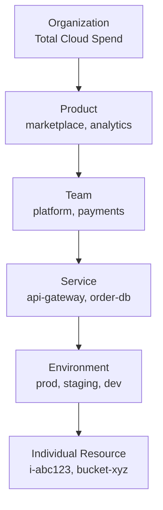
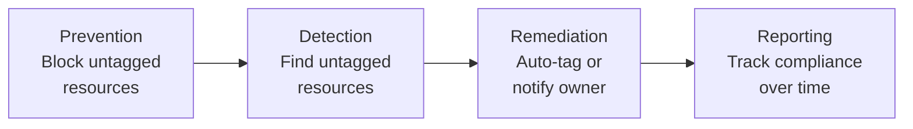
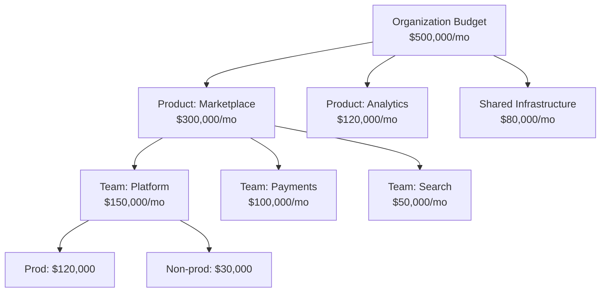
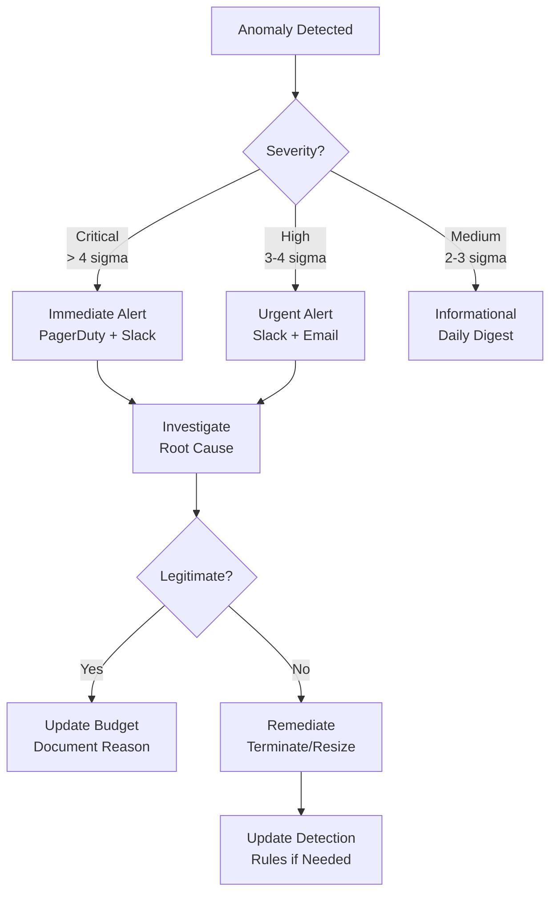

# Cost Allocation & Tagging

Cost allocation is the practice of mapping every dollar of cloud spend to the team, service, product, or customer that generated it. Without allocation, cloud costs are a shared pool that nobody owns — the classic tragedy of the commons. Teams overprovision because they do not see the cost. Leadership cannot identify which products are profitable. Finance cannot forecast accurately. Cost allocation transforms cloud spending from an opaque line item into a transparent, accountable system where every team knows what they spend and why.

The foundation of cost allocation is **tagging** — attaching metadata to every cloud resource that identifies who owns it, what it does, and what business function it supports. A well-tagged environment enables accurate cost reports, budget enforcement, and anomaly detection. A poorly tagged environment is a black hole of unattributed spend.

## Tagging Strategy

### The Tagging Schema

Every organization needs a consistent tagging schema applied across all cloud resources. Start with these essential tags:

| Tag Key | Required | Purpose | Example Values |
|---------|----------|---------|---------------|
| `team` | Yes | Cost ownership | `platform`, `payments`, `search`, `data` |
| `service` | Yes | Which service/application | `api-gateway`, `order-service`, `user-db` |
| `environment` | Yes | Deployment stage | `production`, `staging`, `development`, `sandbox` |
| `cost-center` | Yes | Finance mapping | `CC-1001`, `CC-2050` |
| `product` | Yes | Business product line | `marketplace`, `analytics`, `core-platform` |
| `managed-by` | Recommended | How resource is managed | `terraform`, `pulumi`, `manual`, `cdk` |
| `owner` | Recommended | Individual or team contact | `alice@company.com`, `platform-team` |
| `created-by` | Recommended | Who created it | `ci-pipeline`, `terraform`, `alice` |
| `expiry-date` | For temporary resources | When to clean up | `2026-04-30` |
| `data-classification` | For compliance | Data sensitivity | `public`, `internal`, `confidential`, `restricted` |

### Tagging Conventions

Consistency matters more than the specific tag names. Define and enforce these conventions:

```yaml
# Tagging policy document
tagging_policy:
  version: "1.0"
  last_updated: "2026-03-20"

  required_tags:
    - key: "team"
      allowed_values: ["platform", "payments", "search", "data", "ml", "frontend"]
      case: "lowercase"

    - key: "service"
      pattern: "^[a-z][a-z0-9-]{2,40}$"
      case: "lowercase"

    - key: "environment"
      allowed_values: ["production", "staging", "development", "sandbox"]
      case: "lowercase"

    - key: "cost-center"
      pattern: "^CC-[0-9]{4}$"

    - key: "product"
      allowed_values: ["marketplace", "analytics", "core-platform", "internal-tools"]

  optional_tags:
    - key: "managed-by"
      allowed_values: ["terraform", "pulumi", "cdk", "manual", "helm"]

    - key: "expiry-date"
      pattern: "^[0-9]{4}-[0-9]{2}-[0-9]{2}$"

  conventions:
    key_format: "kebab-case"
    value_format: "lowercase"
    prefix: ""  # Some orgs use "company:" prefix
    max_tags_per_resource: 50  # AWS limit
```

### Tag Hierarchy for Cost Roll-Up



This hierarchy enables cost questions at every level:
- "How much does the marketplace product cost?" → Filter by `product=marketplace`
- "How much does the payments team spend?" → Filter by `team=payments`
- "How much does the order database cost in production?" → Filter by `service=order-db`, `environment=production`
- "How much are we spending on non-production environments?" → Filter by `environment!=production`

## Tag Enforcement

### The Problem: Tag Drift

Without enforcement, tag compliance starts at 100% (when you first apply your policy) and degrades to 40-60% within 6 months. Engineers create resources manually, automation scripts miss tags, and new services are deployed without the latest tag requirements.

### Enforcement Layers



### Layer 1: Prevention — Infrastructure as Code

```hcl
# Terraform: Enforce required tags via a module
variable "required_tags" {
  type = object({
    team        = string
    service     = string
    environment = string
    cost_center = string
    product     = string
  })

  validation {
    condition     = contains(["platform", "payments", "search", "data", "ml", "frontend"], var.required_tags.team)
    error_message = "Tag 'team' must be one of: platform, payments, search, data, ml, frontend."
  }

  validation {
    condition     = contains(["production", "staging", "development", "sandbox"], var.required_tags.environment)
    error_message = "Tag 'environment' must be one of: production, staging, development, sandbox."
  }

  validation {
    condition     = can(regex("^CC-[0-9]{4}$", var.required_tags.cost_center))
    error_message = "Tag 'cost_center' must match format CC-XXXX."
  }
}

# Apply tags to every resource
locals {
  common_tags = merge(var.required_tags, {
    managed_by = "terraform"
    created_at = timestamp()
  })
}

resource "aws_instance" "app" {
  ami           = var.ami_id
  instance_type = var.instance_type
  tags          = local.common_tags
}
```

### Layer 2: Prevention — AWS Service Control Policies

```json
{
  "Version": "2012-10-17",
  "Statement": [
    {
      "Sid": "RequireTagsOnEC2",
      "Effect": "Deny",
      "Action": [
        "ec2:RunInstances"
      ],
      "Resource": [
        "arn:aws:ec2:*:*:instance/*",
        "arn:aws:ec2:*:*:volume/*"
      ],
      "Condition": {
        "Null": {
          "aws:RequestTag/team": "true",
          "aws:RequestTag/service": "true",
          "aws:RequestTag/environment": "true"
        }
      }
    },
    {
      "Sid": "RequireTagsOnRDS",
      "Effect": "Deny",
      "Action": [
        "rds:CreateDBInstance",
        "rds:CreateDBCluster"
      ],
      "Resource": "*",
      "Condition": {
        "Null": {
          "aws:RequestTag/team": "true",
          "aws:RequestTag/service": "true",
          "aws:RequestTag/environment": "true"
        }
      }
    }
  ]
}
```

### Layer 3: Detection — Tag Compliance Scanner

```python
# Tag compliance scanner
import boto3

class TagComplianceScanner:
    REQUIRED_TAGS = ["team", "service", "environment", "cost-center", "product"]

    def __init__(self):
        self.resourcegroupstagging = boto3.client('resourcegroupstaggingapi')

    def scan_compliance(self) -> dict:
        """Scan all resources for tag compliance."""
        paginator = self.resourcegroupstagging.get_paginator('get_resources')
        all_resources = []

        for page in paginator.paginate():
            for resource in page['ResourceTagMappingList']:
                tags = {
                    t['Key']: t['Value']
                    for t in resource.get('Tags', [])
                }
                missing_tags = [
                    tag for tag in self.REQUIRED_TAGS
                    if tag not in tags
                ]
                all_resources.append({
                    'arn': resource['ResourceARN'],
                    'resource_type': self._extract_type(resource['ResourceARN']),
                    'tags': tags,
                    'missing_tags': missing_tags,
                    'compliant': len(missing_tags) == 0,
                })

        compliant = [r for r in all_resources if r['compliant']]
        non_compliant = [r for r in all_resources if not r['compliant']]

        # Group non-compliant by missing tag
        by_missing_tag = {}
        for r in non_compliant:
            for tag in r['missing_tags']:
                by_missing_tag.setdefault(tag, []).append(r['arn'])

        return {
            'total_resources': len(all_resources),
            'compliant': len(compliant),
            'non_compliant': len(non_compliant),
            'compliance_pct': round(
                len(compliant) / len(all_resources) * 100, 1
            ) if all_resources else 0,
            'by_missing_tag': {
                tag: len(resources)
                for tag, resources in by_missing_tag.items()
            },
            'non_compliant_resources': non_compliant[:50],  # Top 50
        }

    def _extract_type(self, arn: str) -> str:
        parts = arn.split(':')
        if len(parts) >= 6:
            return f"{parts[2]}:{parts[5].split('/')[0]}"
        return "unknown"
```

### Layer 4: Remediation — Auto-Tagging

```python
# Auto-tagger for resources created without tags
class AutoTagger:
    # Inference rules: derive tags from resource context
    INFERENCE_RULES = {
        # If resource is in a specific VPC, infer the environment
        "vpc-prod-12345": {"environment": "production"},
        "vpc-stg-67890": {"environment": "staging"},
        "vpc-dev-11111": {"environment": "development"},
    }

    def auto_tag_resource(self, resource_arn: str, existing_tags: dict) -> dict:
        """Attempt to infer missing tags from context."""
        inferred_tags = {}

        # Infer from resource name
        resource_name = existing_tags.get("Name", "")
        if "prod" in resource_name.lower():
            inferred_tags["environment"] = "production"
        elif "staging" in resource_name.lower() or "stg" in resource_name.lower():
            inferred_tags["environment"] = "staging"
        elif "dev" in resource_name.lower():
            inferred_tags["environment"] = "development"

        # Infer from CloudTrail — who created it?
        creator = self._find_creator(resource_arn)
        if creator:
            inferred_tags["created-by"] = creator
            team = self._lookup_team(creator)
            if team:
                inferred_tags["team"] = team

        # Mark as auto-tagged for review
        inferred_tags["auto-tagged"] = "true"
        inferred_tags["auto-tagged-date"] = datetime.utcnow().strftime("%Y-%m-%d")

        # Apply only missing tags (never overwrite existing)
        tags_to_apply = {
            k: v for k, v in inferred_tags.items()
            if k not in existing_tags
        }

        if tags_to_apply:
            self._apply_tags(resource_arn, tags_to_apply)

        return tags_to_apply
```

::: warning Auto-Tagging is a Safety Net, Not a Solution
Auto-tagging catches resources that slip through prevention controls, but inferred tags are often wrong. Treat auto-tagged resources as "needs review" and alert the owning team to confirm or correct the tags. The goal is 100% prevention-based tagging; auto-tagging handles the exceptions.
:::

## Showback vs Chargeback

### The Two Models

| Model | Description | Pros | Cons |
|-------|-------------|------|------|
| **Showback** | Show teams their costs but do not charge them | Low friction, easy to start, encourages learning | No financial consequence; easy to ignore |
| **Chargeback** | Deduct costs from team budgets | Strong accountability, drives optimization | Complex accounting, can create perverse incentives |

### Showback (Recommended Starting Point)

Showback gives teams visibility into their costs without the complexity of inter-departmental billing:

```markdown
## Monthly Cost Report — Payments Team — March 2026

### Summary
| Metric | Value | Change |
|--------|-------|--------|
| Total spend | $42,350 | +8% MoM |
| Production | $35,200 | +5% MoM |
| Non-production | $7,150 | +22% MoM |
| Cost per transaction | $0.0034 | -2% MoM |

### Top Cost Drivers
| Service | Monthly Cost | % of Total | Trend |
|---------|-------------|-----------|-------|
| RDS (payment-db) | $12,400 | 29% | Stable |
| EC2 (payment-api) | $8,900 | 21% | +5% |
| ElastiCache | $5,200 | 12% | Stable |
| S3 (transaction-logs) | $3,800 | 9% | +15% |
| Lambda (webhooks) | $2,100 | 5% | +30% |

### Optimization Opportunities
| Opportunity | Estimated Savings | Effort |
|-------------|------------------|--------|
| Right-size payment-api instances (avg CPU: 22%) | $2,200/mo | Low |
| S3 lifecycle policy for logs older than 90 days | $1,500/mo | Low |
| Switch to Graviton instances | $1,800/mo | Medium |
| Reserved instance for payment-db | $3,700/mo | Low |
| **Total potential savings** | **$9,200/mo (22%)** | |

### Action Items
- [ ] Alice: Right-size payment-api by March 31
- [ ] Bob: Implement S3 lifecycle policy by March 25
- [ ] Team: Evaluate Graviton migration for Q2
```

### Chargeback (For Mature Organizations)

Chargeback deducts cloud costs from team budgets, creating strong financial accountability:

```python
# Chargeback allocation engine
class ChargebackEngine:
    def calculate_chargeback(
        self,
        billing_period: str,  # "2026-03"
        cost_data: list[dict],
    ) -> dict:
        """Allocate costs to teams based on tags."""
        team_costs = {}
        unallocated = 0
        shared_costs = 0

        for item in cost_data:
            team = item.get("tags", {}).get("team")
            cost = item["cost"]

            if not team:
                unallocated += cost
                continue

            if team == "shared":
                shared_costs += cost
                continue

            team_costs.setdefault(team, {
                "direct_costs": 0,
                "shared_allocation": 0,
                "total": 0,
                "services": {},
            })
            team_costs[team]["direct_costs"] += cost

            service = item.get("tags", {}).get("service", "untagged")
            team_costs[team]["services"].setdefault(service, 0)
            team_costs[team]["services"][service] += cost

        # Allocate shared costs proportionally
        total_direct = sum(t["direct_costs"] for t in team_costs.values())
        for team, data in team_costs.items():
            proportion = data["direct_costs"] / total_direct if total_direct > 0 else 0
            data["shared_allocation"] = round(shared_costs * proportion, 2)
            data["unallocated_share"] = round(unallocated * proportion, 2)
            data["total"] = round(
                data["direct_costs"] +
                data["shared_allocation"] +
                data["unallocated_share"], 2
            )

        return {
            "period": billing_period,
            "total_cost": sum(item["cost"] for item in cost_data),
            "directly_allocated": round(total_direct, 2),
            "shared_costs": round(shared_costs, 2),
            "unallocated": round(unallocated, 2),
            "unallocated_pct": round(unallocated / sum(item["cost"] for item in cost_data) * 100, 1),
            "by_team": team_costs,
        }
```

### Handling Shared Costs

Some costs are inherently shared — VPN, monitoring infrastructure, shared databases, network backbone. Allocate these proportionally:

| Allocation Method | How It Works | Best For |
|-------------------|-------------|----------|
| **Even split** | Divide equally among all teams | Simple; fair when teams are similar size |
| **Proportional** | Allocate based on each team's direct spend | Fair for teams with different scale |
| **Usage-based** | Allocate based on actual usage metrics | Most accurate but complex |
| **Fixed percentage** | Pre-agreed allocation percentages | Predictable; good for stable organizations |

## Budgets and Alerts

### Budget Structure



### Budget Alert Configuration

```python
# Multi-level budget alert system
@dataclass
class BudgetConfig:
    name: str
    monthly_limit: float
    team: str
    alerts: list[dict]

BUDGETS = [
    BudgetConfig(
        name="platform-team-production",
        monthly_limit=120000,
        team="platform",
        alerts=[
            {"threshold_pct": 50, "type": "info", "channel": "slack"},
            {"threshold_pct": 75, "type": "warning", "channel": "slack"},
            {"threshold_pct": 90, "type": "critical", "channel": "slack+email"},
            {"threshold_pct": 100, "type": "breach", "channel": "slack+email+pagerduty"},
        ],
    ),
    BudgetConfig(
        name="platform-team-non-production",
        monthly_limit=30000,
        team="platform",
        alerts=[
            {"threshold_pct": 80, "type": "warning", "channel": "slack"},
            {"threshold_pct": 100, "type": "breach", "channel": "slack+email"},
        ],
    ),
]

class BudgetMonitor:
    def check_budgets(self, current_spend: dict):
        day_of_month = datetime.utcnow().day
        days_in_month = 30  # simplified
        expected_spend_pct = (day_of_month / days_in_month) * 100

        for budget in BUDGETS:
            actual_spend = current_spend.get(budget.name, 0)
            actual_pct = (actual_spend / budget.monthly_limit) * 100

            # Check if spending is ahead of pace
            pace_ratio = actual_pct / expected_spend_pct if expected_spend_pct > 0 else 0

            for alert in budget.alerts:
                if actual_pct >= alert["threshold_pct"]:
                    self.send_alert(
                        budget=budget,
                        alert_config=alert,
                        actual_spend=actual_spend,
                        actual_pct=actual_pct,
                        pace_ratio=pace_ratio,
                    )

            # Forecast alert — predict month-end spend
            forecasted_spend = actual_spend * (days_in_month / day_of_month)
            if forecasted_spend > budget.monthly_limit * 1.1:
                self.send_alert(
                    budget=budget,
                    alert_config={"type": "forecast", "channel": "slack+email"},
                    actual_spend=actual_spend,
                    actual_pct=actual_pct,
                    forecasted_spend=forecasted_spend,
                )
```

## Anomaly Detection

### What Constitutes an Anomaly?

| Anomaly Type | Description | Example |
|-------------|-------------|---------|
| **Sudden spike** | Cost jumps significantly in a short period | Someone launched 100 GPU instances |
| **Gradual drift** | Cost slowly increases beyond expected growth | Data transfer costs growing 10%/week |
| **New service** | A service appears that was not in previous budgets | Someone enabled a new AWS service |
| **Missing decrease** | Expected cost reduction did not materialize | Reserved instances expired without renewal |

### Detection Implementation

```python
# Cost anomaly detector
import numpy as np
from datetime import datetime, timedelta

class CostAnomalyDetector:
    def __init__(self, sensitivity: float = 2.0):
        self.sensitivity = sensitivity  # Standard deviations from mean

    def detect_anomalies(
        self,
        daily_costs: list[tuple[str, float]],  # (date, cost) pairs
        lookback_days: int = 30,
    ) -> list[dict]:
        """Detect cost anomalies using statistical analysis."""
        if len(daily_costs) < lookback_days:
            return []

        costs = [c for _, c in daily_costs]
        anomalies = []

        for i in range(lookback_days, len(costs)):
            # Calculate statistics from lookback window
            window = costs[i - lookback_days:i]
            mean = np.mean(window)
            std = np.std(window)

            current = costs[i]
            date = daily_costs[i][0]

            if std == 0:
                continue

            z_score = (current - mean) / std

            if abs(z_score) > self.sensitivity:
                anomalies.append({
                    "date": date,
                    "cost": current,
                    "expected_cost": round(mean, 2),
                    "deviation_pct": round(
                        (current - mean) / mean * 100, 1
                    ),
                    "z_score": round(z_score, 2),
                    "direction": "spike" if z_score > 0 else "drop",
                    "severity": self._classify_severity(z_score),
                })

        return anomalies

    def _classify_severity(self, z_score: float) -> str:
        abs_z = abs(z_score)
        if abs_z > 4:
            return "critical"
        elif abs_z > 3:
            return "high"
        elif abs_z > 2:
            return "medium"
        return "low"

    def detect_service_anomalies(
        self,
        current_costs_by_service: dict[str, float],
        previous_costs_by_service: dict[str, float],
        threshold_pct: float = 50,
    ) -> list[dict]:
        """Detect anomalies at the service level."""
        anomalies = []

        # Check for significant increases
        for service, current in current_costs_by_service.items():
            previous = previous_costs_by_service.get(service, 0)
            if previous == 0 and current > 100:
                anomalies.append({
                    "service": service,
                    "type": "new_service",
                    "current_cost": current,
                    "previous_cost": 0,
                    "message": f"New service appeared with ${current:.2f} cost",
                })
            elif previous > 0:
                change_pct = (current - previous) / previous * 100
                if change_pct > threshold_pct:
                    anomalies.append({
                        "service": service,
                        "type": "cost_increase",
                        "current_cost": current,
                        "previous_cost": previous,
                        "change_pct": round(change_pct, 1),
                        "message": f"{service} cost increased {change_pct:.1f}%",
                    })

        # Check for services that disappeared (might be good or bad)
        for service, previous in previous_costs_by_service.items():
            if service not in current_costs_by_service and previous > 100:
                anomalies.append({
                    "service": service,
                    "type": "service_disappeared",
                    "current_cost": 0,
                    "previous_cost": previous,
                    "message": f"{service} costs dropped to zero (was ${previous:.2f})",
                })

        return anomalies
```

### Anomaly Response Workflow



## Cost Allocation Metrics Dashboard

Track these metrics to measure FinOps maturity:

| Metric | Target | Measurement |
|--------|--------|-------------|
| Tag compliance | > 95% | Percentage of resources with all required tags |
| Cost attribution | > 90% | Percentage of spend allocated to a team |
| Budget accuracy | Within 10% | Actual vs budgeted spend |
| Anomaly detection time | < 24 hours | Time from anomaly to alert |
| Optimization action rate | > 80% | Percentage of recommendations acted on |
| Untagged spend | < 5% | Dollar amount of unattributed costs |

::: tip The #1 FinOps Metric
**Untagged spend percentage** is the single most important metric for cost allocation maturity. If 30% of your spend is untagged, you do not have cost allocation — you have cost guessing. Drive untagged spend below 5% before worrying about advanced analytics.
:::

## Further Reading

- [FinOps Overview](/infrastructure/finops/) — principles and lifecycle
- [Cloud Cost Optimization Playbook](/infrastructure/finops/cost-optimization) — using allocated costs to optimize
- [Capacity Planning](/devops/sre/capacity-planning) — cost-aware capacity decisions
- FinOps Foundation Tagging Guide — finops.org
- AWS Tagging Best Practices — docs.aws.amazon.com/tag-editor
- GCP Resource Labels — cloud.google.com/resource-manager/docs/creating-managing-labels
- *Cloud FinOps* by J.R. Storment & Mike Fuller — the definitive FinOps book
