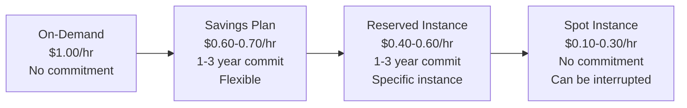
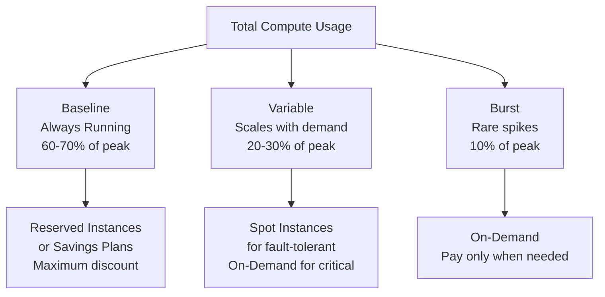
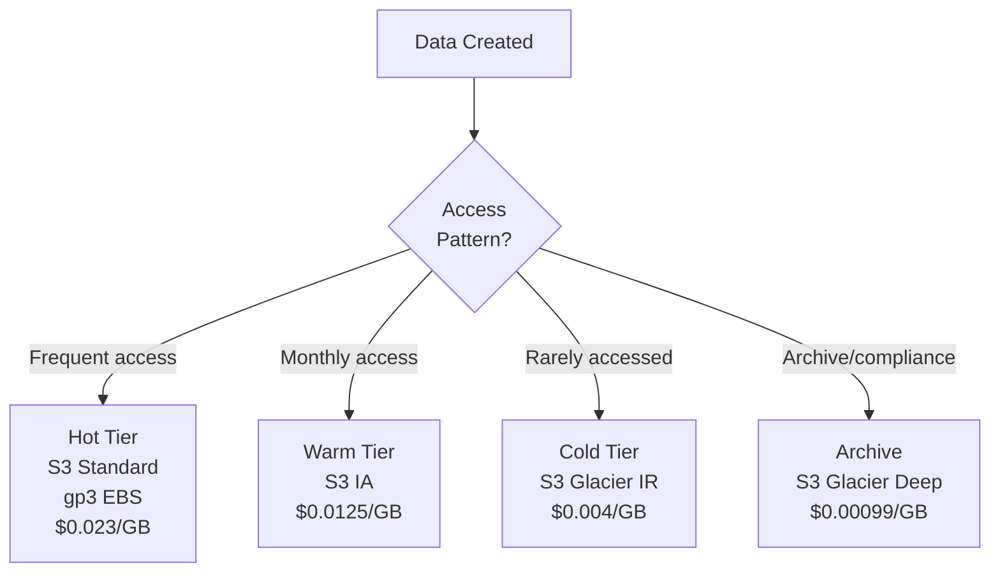
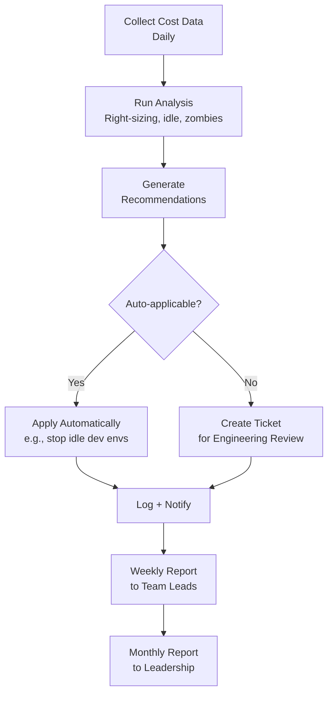

# Cloud Cost Optimization Playbook

Cloud cost optimization is not a one-time project — it is a continuous practice. Every week, new resources are deployed, traffic patterns change, and pricing models evolve. An organization that optimized perfectly six months ago will have accumulated 15-25% waste by now through natural drift: instances that grew but traffic did not, development environments that were never torn down, and storage that accumulated without lifecycle policies.

This playbook provides concrete, actionable strategies organized by effort and impact. Start with the quick wins (right-sizing and idle cleanup), then progress to structural changes (reserved instances, architecture optimization). The goal is not to minimize cost — it is to maximize the value delivered per dollar spent.

## The Optimization Priority Matrix

```mermaid
quadchart
    title Cost Optimization Priority
    x-axis Low Effort --> High Effort
    y-axis Low Savings --> High Savings
    quadrant-1 Strategic investments
    quadrant-2 Do these first
    quadrant-3 Do when convenient
    quadrant-4 Evaluate carefully
```

| Priority | Strategy | Typical Savings | Effort |
|----------|----------|----------------|--------|
| 1 | Eliminate idle/zombie resources | 5-15% | Very low |
| 2 | Right-size instances | 15-25% | Low |
| 3 | Reserved Instances / Savings Plans | 30-60% | Low |
| 4 | Storage tiering and lifecycle | 40-70% of storage | Low |
| 5 | Spot / Preemptible instances | 60-90% | Medium |
| 6 | Data transfer optimization | 10-30% of network | Medium |
| 7 | Compute architecture (ARM, serverless) | 20-50% | High |
| 8 | Application-level optimization | 10-40% | High |

## Eliminate Idle and Zombie Resources

### What to Look For

Zombie resources are cloud resources that cost money but serve no purpose. They accumulate silently and can represent 5-15% of total spend.

| Zombie Type | How to Detect | AWS CLI Check |
|------------|--------------|---------------|
| Unattached EBS volumes | Volume state = "available" | `aws ec2 describe-volumes --filters Name=status,Values=available` |
| Idle load balancers | Zero healthy targets for 7+ days | Check target group health + CloudWatch `RequestCount = 0` |
| Unused Elastic IPs | Not associated with an instance | `aws ec2 describe-addresses --filters Name=association-id,Values=""` |
| Old snapshots | Older than retention period | `aws ec2 describe-snapshots --owner self --query 'sort_by(Snapshots, &StartTime)'` |
| Stopped instances | Stopped for 30+ days (still paying for EBS) | `aws ec2 describe-instances --filters Name=instance-state-name,Values=stopped` |
| Unused NAT gateways | Zero bytes processed | CloudWatch `BytesOutToDestination = 0` for 7 days |
| Forgotten dev/test envs | Tagged as dev/test, running 24/7 | Filter by tags, check uptime |

### Automated Cleanup

```python
# Zombie resource scanner
import boto3
from datetime import datetime, timedelta, timezone

class ZombieScanner:
    def __init__(self):
        self.ec2 = boto3.client('ec2')
        self.elb = boto3.client('elbv2')
        self.cloudwatch = boto3.client('cloudwatch')

    def find_unattached_volumes(self) -> list[dict]:
        """Find EBS volumes not attached to any instance."""
        volumes = self.ec2.describe_volumes(
            Filters=[{'Name': 'status', 'Values': ['available']}]
        )['Volumes']

        zombies = []
        for vol in volumes:
            age_days = (datetime.now(timezone.utc) - vol['CreateTime']).days
            monthly_cost = self._estimate_ebs_cost(vol)
            zombies.append({
                'resource_type': 'ebs_volume',
                'id': vol['VolumeId'],
                'size_gb': vol['Size'],
                'age_days': age_days,
                'monthly_cost_usd': monthly_cost,
                'recommendation': 'delete' if age_days > 7 else 'investigate',
            })

        return zombies

    def find_idle_instances(self, days: int = 7) -> list[dict]:
        """Find instances with consistently low CPU."""
        instances = self.ec2.describe_instances(
            Filters=[{'Name': 'instance-state-name', 'Values': ['running']}]
        )

        idle = []
        for reservation in instances['Reservations']:
            for instance in reservation['Instances']:
                avg_cpu = self._get_avg_cpu(
                    instance['InstanceId'], days
                )
                if avg_cpu is not None and avg_cpu < 5:
                    idle.append({
                        'resource_type': 'ec2_instance',
                        'id': instance['InstanceId'],
                        'type': instance['InstanceType'],
                        'avg_cpu_pct': round(avg_cpu, 1),
                        'recommendation': 'right-size or terminate',
                    })

        return idle

    def _get_avg_cpu(self, instance_id: str, days: int) -> float | None:
        response = self.cloudwatch.get_metric_statistics(
            Namespace='AWS/EC2',
            MetricName='CPUUtilization',
            Dimensions=[{
                'Name': 'InstanceId',
                'Value': instance_id
            }],
            StartTime=datetime.now(timezone.utc) - timedelta(days=days),
            EndTime=datetime.now(timezone.utc),
            Period=3600,
            Statistics=['Average'],
        )
        points = response['Datapoints']
        if not points:
            return None
        return sum(p['Average'] for p in points) / len(points)

    def _estimate_ebs_cost(self, volume: dict) -> float:
        # Rough estimate: gp3 = $0.08/GB/month
        price_per_gb = {
            'gp2': 0.10, 'gp3': 0.08,
            'io1': 0.125, 'io2': 0.125,
            'st1': 0.045, 'sc1': 0.015,
        }
        vol_type = volume.get('VolumeType', 'gp3')
        return volume['Size'] * price_per_gb.get(vol_type, 0.08)
```

### Dev/Test Environment Scheduling

Stop paying for development environments 24/7 when they are only used 10 hours/day on weekdays:

```yaml
# AWS Instance Scheduler configuration
# Runs dev/staging instances only during business hours
ScheduleConfig:
  timezone: "America/New_York"
  schedules:
    business-hours:
      periods:
        - begintime: "08:00"
          endtime: "20:00"
          weekdays: "mon-fri"
      # Saves: 70% (running 60h/week instead of 168h/week)

    extended-hours:
      periods:
        - begintime: "06:00"
          endtime: "23:00"
          weekdays: "mon-fri"
        - begintime: "09:00"
          endtime: "18:00"
          weekdays: "sat"
      # Saves: 55%

    always-off:
      # For resources tagged but not currently needed
      # Saves: 100%
```

::: tip Quick Win — Schedule Dev Environments
Scheduling dev/staging instances to run only during business hours is the highest-ROI, lowest-effort optimization. It typically saves 60-70% on non-production compute costs with zero impact on productivity.
:::

## Right-Sizing

### What is Right-Sizing?

Right-sizing is matching your instance type and size to actual workload requirements. Most instances are provisioned based on guesses or worst-case estimates and never revisited.

### Right-Sizing Analysis

```python
# Right-sizing recommendation engine
def analyze_instance(
    instance_type: str,
    cpu_p95: float,      # 95th percentile CPU utilization
    memory_p95: float,   # 95th percentile memory utilization
    network_peak_mbps: float,
) -> dict:
    current = INSTANCE_SPECS[instance_type]

    # Find the smallest instance type that provides adequate resources
    # with 30% headroom
    target_cpu = cpu_p95 * 1.3
    target_memory = memory_p95 * 1.3
    target_network = network_peak_mbps * 1.5

    candidates = []
    for itype, specs in INSTANCE_SPECS.items():
        if (specs['vcpu'] >= target_cpu and
            specs['memory_gb'] >= target_memory and
            specs['network_mbps'] >= target_network):
            candidates.append({
                'type': itype,
                'vcpu': specs['vcpu'],
                'memory_gb': specs['memory_gb'],
                'price_per_hour': specs['price'],
            })

    # Sort by price
    candidates.sort(key=lambda x: x['price_per_hour'])
    recommended = candidates[0] if candidates else None

    savings_pct = 0
    if recommended:
        savings_pct = (1 - recommended['price_per_hour'] / current['price']) * 100

    return {
        'current_type': instance_type,
        'current_price': current['price'],
        'recommended_type': recommended['type'] if recommended else instance_type,
        'recommended_price': recommended['price_per_hour'] if recommended else current['price'],
        'monthly_savings': (current['price'] - recommended['price_per_hour']) * 720 if recommended else 0,
        'savings_pct': round(savings_pct, 1),
        'utilization': {
            'cpu_p95': cpu_p95,
            'memory_p95': memory_p95,
        },
    }
```

### Right-Sizing Guidelines

| Current Utilization | Recommendation |
|--------------------|----------------|
| CPU < 10%, Memory < 20% | Downsize by 2 tiers (e.g., xlarge to small) |
| CPU 10-30%, Memory 20-40% | Downsize by 1 tier (e.g., xlarge to large) |
| CPU 30-60%, Memory 40-70% | Properly sized (with headroom) |
| CPU 60-80%, Memory 70-85% | Monitor closely; may need upsize |
| CPU > 80%, Memory > 85% | Upsize to prevent performance issues |

::: warning Do Not Right-Size Based on Average CPU
Average CPU is misleading. An instance averaging 20% CPU might spike to 95% during peak hours. Always use p95 or p99 percentile utilization over at least a 2-week period for right-sizing decisions.
:::

## Reserved Instances and Savings Plans

### The Commitment Spectrum



### Comparison

| Pricing Model | Discount | Commitment | Flexibility | Best For |
|--------------|----------|-----------|-------------|----------|
| **On-Demand** | 0% | None | Full | Unpredictable workloads, short-term projects |
| **Savings Plans (Compute)** | 30-40% | 1 or 3 years ($X/hr) | Any instance type, region, OS | Stable baseline compute |
| **Savings Plans (EC2)** | 40-50% | 1 or 3 years ($X/hr) | Any size within instance family | Known instance family |
| **Reserved Instances (Standard)** | 40-60% | 1 or 3 years | Specific instance type + region | Very predictable workloads |
| **Reserved Instances (Convertible)** | 30-45% | 1 or 3 years | Can change instance type | Predictable but evolving workloads |
| **Spot Instances** | 60-90% | None | Can be interrupted with 2-min notice | Fault-tolerant, batch, stateless |

### Commitment Strategy



### How to Calculate Commitment Level

```python
# Commitment coverage calculator
def calculate_commitment(
    hourly_usage: list[float],  # 30 days of hourly instance-hours
    on_demand_rate: float,
    savings_plan_rate: float,
    spot_rate: float,
) -> dict:
    hourly_usage.sort()
    total_hours = len(hourly_usage)

    # Baseline: p10 usage (always running)
    baseline = hourly_usage[int(total_hours * 0.10)]

    # Variable: p10 to p90
    variable = hourly_usage[int(total_hours * 0.90)] - baseline

    # Burst: above p90
    burst = max(hourly_usage) - hourly_usage[int(total_hours * 0.90)]

    # Cost calculation
    baseline_cost = baseline * savings_plan_rate * 720  # monthly hours
    variable_cost = variable * spot_rate * 720 * 0.5  # assuming 50% spot
    variable_cost += variable * on_demand_rate * 720 * 0.5
    burst_cost = burst * on_demand_rate * 720 * 0.1  # bursts ~10% of time

    total_optimized = baseline_cost + variable_cost + burst_cost
    total_on_demand = sum(hourly_usage) / total_hours * on_demand_rate * 720

    return {
        "baseline_commitment_instances": round(baseline, 1),
        "monthly_cost_optimized": round(total_optimized, 2),
        "monthly_cost_on_demand": round(total_on_demand, 2),
        "savings_pct": round((1 - total_optimized / total_on_demand) * 100, 1),
    }
```

## Spot and Preemptible Instances

### When to Use Spot

Spot instances are heavily discounted (60-90% off) but can be interrupted with as little as 2 minutes notice. Use them for:

| Workload Type | Why It Works | Example |
|--------------|-------------|---------|
| Batch processing | Can checkpoint and resume | Data pipeline jobs, ETL |
| Stateless web servers | Load balancer routes around terminated instances | API servers behind ALB |
| CI/CD runners | Build can restart if interrupted | GitHub Actions self-hosted runners |
| Machine learning training | Checkpoint every N epochs | Model training with periodic saves |
| Testing and QA | Interruption is acceptable | Load testing, integration testing |

### Spot Best Practices

```yaml
# Kubernetes spot instance configuration
apiVersion: karpenter.sh/v1beta1
kind: NodePool
metadata:
  name: spot-pool
spec:
  template:
    spec:
      requirements:
        - key: karpenter.sh/capacity-type
          operator: In
          values: ["spot"]
        - key: node.kubernetes.io/instance-type
          operator: In
          values:
            # Diversify across instance types to reduce interruption risk
            - m5.large
            - m5a.large
            - m5d.large
            - m6i.large
            - m6a.large
            - c5.large
            - c5a.large
            - c6i.large
      nodeClassRef:
        name: default
  disruption:
    consolidationPolicy: WhenUnderutilized
    # Allow graceful shutdown on spot interruption
    expireAfter: 720h
```

::: danger Never Run Stateful Services on Spot
Databases, queues, and any service that stores state locally should never run on spot instances. The 2-minute interruption warning is not enough time to gracefully migrate a database. Use reserved instances or on-demand for stateful workloads.
:::

## Storage Optimization

### Storage Tiering



### S3 Lifecycle Policies

```json
{
  "Rules": [
    {
      "ID": "optimize-storage-costs",
      "Status": "Enabled",
      "Filter": {
        "Prefix": "logs/"
      },
      "Transitions": [
        {
          "Days": 30,
          "StorageClass": "STANDARD_IA"
        },
        {
          "Days": 90,
          "StorageClass": "GLACIER_IR"
        },
        {
          "Days": 365,
          "StorageClass": "DEEP_ARCHIVE"
        }
      ],
      "Expiration": {
        "Days": 2555
      }
    },
    {
      "ID": "cleanup-incomplete-uploads",
      "Status": "Enabled",
      "Filter": {},
      "AbortIncompleteMultipartUpload": {
        "DaysAfterInitiation": 7
      }
    }
  ]
}
```

### Storage Cost Comparison

| Storage Class (AWS) | Cost/GB/month | Retrieval Cost | Use Case |
|--------------------|---------------|----------------|----------|
| S3 Standard | $0.023 | None | Active application data |
| S3 Intelligent-Tiering | $0.023 (auto-tiered) | None | Unknown access patterns |
| S3 Standard-IA | $0.0125 | $0.01/GB | Monthly access |
| S3 One Zone-IA | $0.01 | $0.01/GB | Recreatable data, monthly access |
| S3 Glacier Instant | $0.004 | $0.03/GB | Quarterly access, instant retrieval |
| S3 Glacier Flexible | $0.0036 | $0.01/GB + time | Annual access, hours to retrieve |
| S3 Glacier Deep Archive | $0.00099 | $0.02/GB + time | Compliance archives, 12h+ retrieval |

## Data Transfer Costs

Data transfer is often the most surprising cost on a cloud bill. The pricing model is asymmetric: data into the cloud is free, data out is expensive.

### Common Data Transfer Costs (AWS)

| Transfer Type | Cost |
|--------------|------|
| Data in (internet to AWS) | Free |
| Data out (AWS to internet) | $0.09/GB (first 10TB) |
| Same region, same AZ | Free |
| Same region, different AZ | $0.01/GB each way |
| Cross-region | $0.02/GB |
| S3 to CloudFront | Free |
| VPC endpoint (S3, DynamoDB) | Free (gateway endpoint) |
| NAT Gateway processing | $0.045/GB |

### Optimization Strategies

| Strategy | Implementation | Savings |
|----------|---------------|---------|
| Use VPC endpoints | Gateway endpoints for S3 and DynamoDB | Eliminate NAT Gateway costs |
| CDN for static content | CloudFront/Cloudflare | Reduced origin egress |
| Compress responses | gzip/brotli for API responses | 60-80% less transfer |
| Keep traffic in-region | Co-locate services in same region | Avoid cross-region charges |
| Use same-AZ when possible | Session affinity, AZ-aware routing | Avoid cross-AZ charges |
| Batch API calls | Combine multiple requests | Less overhead per byte |

```python
# Data transfer cost estimator
def estimate_data_transfer_cost(
    internet_egress_gb: float,
    cross_region_gb: float,
    cross_az_gb: float,
    nat_gateway_gb: float,
) -> dict:
    costs = {
        "internet_egress": internet_egress_gb * 0.09,
        "cross_region": cross_region_gb * 0.02,
        "cross_az": cross_az_gb * 0.01 * 2,  # both directions
        "nat_gateway": nat_gateway_gb * 0.045,
    }
    costs["total"] = sum(costs.values())

    optimized = {
        "internet_egress": internet_egress_gb * 0.09 * 0.3,  # CDN + compression
        "cross_region": cross_region_gb * 0.02 * 0.2,  # co-locate services
        "cross_az": cross_az_gb * 0.01 * 0.5,  # AZ-aware routing
        "nat_gateway": 0,  # VPC endpoints
    }
    optimized["total"] = sum(optimized.values())

    return {
        "current_monthly": round(costs["total"], 2),
        "optimized_monthly": round(optimized["total"], 2),
        "monthly_savings": round(costs["total"] - optimized["total"], 2),
        "savings_pct": round((1 - optimized["total"] / costs["total"]) * 100, 1),
        "breakdown": costs,
    }
```

## Compute Architecture Optimization

### ARM-Based Instances

ARM-based instances (AWS Graviton, GCP Tau T2A) offer 20-40% better price-performance than x86:

| Comparison | x86 (m6i.large) | ARM (m7g.large) | Savings |
|-----------|-----------------|-----------------|---------|
| On-demand price | $0.096/hr | $0.0816/hr | 15% |
| Performance (typical) | Baseline | 10-20% better | +15% performance |
| Price-performance | 1.0x | ~1.35x | 35% better value |

::: tip ARM Migration Checklist
Most modern applications work on ARM without changes. Check for:
- Native dependencies compiled for x86 (some C extensions)
- Docker images — ensure multi-arch builds (`--platform linux/arm64`)
- Third-party agents or tools that only support x86
- Load test on ARM before migrating production
:::

### Serverless vs Containers vs VMs

| Factor | Serverless (Lambda) | Containers (ECS/EKS) | VMs (EC2) |
|--------|-------------------|---------------------|-----------|
| **Best for** | Sporadic, event-driven | Steady, microservices | Legacy, full OS control |
| **Idle cost** | $0 | Container + host cost | Full instance cost |
| **Scale-to-zero** | Yes | Possible (Fargate) | No |
| **Cost at low volume** | Cheapest | Medium | Most expensive |
| **Cost at high volume** | Most expensive | Cheapest (with RIs) | Medium |
| **Crossover point** | ~1M invocations/month | - | - |

### Containerization Savings

```yaml
# Before: 3 dedicated EC2 instances per microservice
# 10 microservices × 3 instances × m5.large ($0.096/hr)
# = $2,073/month

# After: Kubernetes cluster with bin-packing
# 6 m5.xlarge nodes ($0.192/hr) running all 10 services
# = $829/month (60% savings from better utilization)

# Resource requests and limits enable efficient bin-packing
apiVersion: v1
kind: Pod
spec:
  containers:
    - name: api-server
      resources:
        requests:
          cpu: "250m"      # 0.25 vCPU — what the scheduler allocates
          memory: "512Mi"
        limits:
          cpu: "1000m"     # Can burst to 1 vCPU
          memory: "1Gi"
```

## Optimization Automation

### Continuous Optimization Pipeline



### Key Metrics to Track

| Metric | Target | Why |
|--------|--------|-----|
| Commitment coverage | 70-80% of steady-state compute | Balance savings vs flexibility |
| Waste percentage | < 10% of total spend | Measure zombie and idle resources |
| Cost per customer | Decreasing over time | Unit economics improvement |
| Cost per transaction | Stable or decreasing | Efficiency at scale |
| Tagging compliance | > 95% of resources tagged | Enables accurate allocation |
| Optimization action rate | > 80% of recommendations actioned within 30 days | Team engagement |

## Further Reading

- [FinOps Overview](/infrastructure/finops/) — principles and lifecycle
- [Cost Allocation & Tagging](/infrastructure/finops/cost-allocation) — tagging strategies and budgets
- [Capacity Planning](/devops/sre/capacity-planning) — SRE perspective on provisioning
- [Serverless Patterns](/architecture-patterns/cloud-native/serverless-patterns) — pay-per-use architecture
- [Cloud Design Patterns](/architecture-patterns/cloud-native/cloud-design-patterns) — architectural patterns that affect cost
- AWS Cost Optimization Hub — docs.aws.amazon.com
- GCP Cost Management — cloud.google.com/cost-management
- *Cloud FinOps* by J.R. Storment & Mike Fuller — the definitive FinOps book
