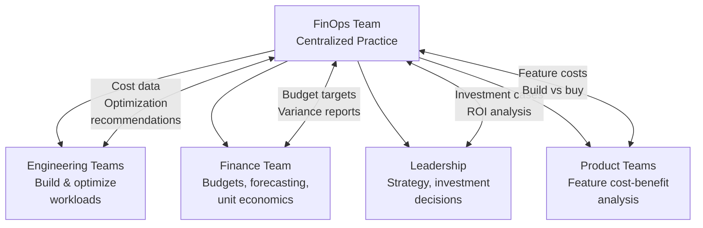
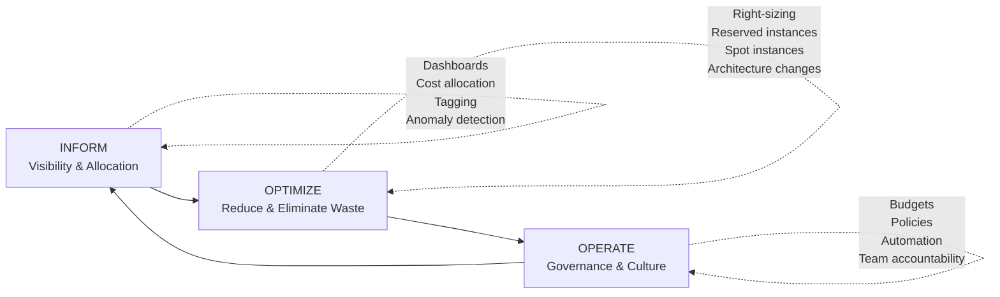
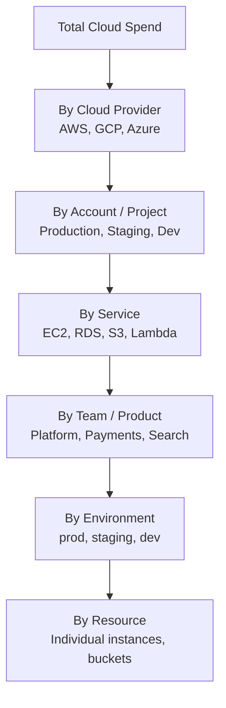

# FinOps Overview

FinOps — short for Cloud Financial Operations — is the practice of bringing financial accountability to cloud spending. In the on-premises world, infrastructure was a capital expense: you bought servers, depreciated them over 3-5 years, and that was your cost. In the cloud, infrastructure is an operational expense that changes every hour based on what you deploy, how much traffic you receive, and what services you use. This shift means that engineering decisions directly impact the company's financial results — every oversized instance, forgotten development environment, and uncompressed data transfer is money leaving the organization.

FinOps is not about spending less. It is about spending wisely — ensuring that every dollar of cloud spend drives business value, and that the organization has the visibility, tools, and culture to make informed trade-offs between cost, speed, and reliability.

## Why FinOps Matters

### The Cloud Cost Problem

Cloud spending is growing faster than cloud adoption, which means organizations are spending more per workload, not less:

| Problem | Impact |
|---------|--------|
| No visibility into costs | Teams do not know what they spend; surprises at month-end |
| No accountability | No one owns costs; shared account is a tragedy of the commons |
| Over-provisioning | 35-45% of cloud spend is wasted on idle or oversized resources (Flexera, 2024) |
| Zombie resources | Forgotten dev environments, detached EBS volumes, unused load balancers |
| Data transfer costs | Often the most surprising line item; cross-region and egress charges |
| No architectural optimization | Running on the most expensive compute type by default |

### The Business Case

| Metric | Typical Impact |
|--------|---------------|
| Cloud cost savings from FinOps adoption | 20-30% reduction in first year |
| Engineering time saved on cost investigations | 5-10 hours per team per month |
| Budget forecast accuracy improvement | From ±30% to ±10% |
| Time to detect cost anomalies | From days/weeks to hours |
| Avoided cost from right-sizing | 15-25% of compute spend |

::: tip FinOps is a Cultural Shift, Not a Tool
You cannot buy your way to FinOps. Tools like AWS Cost Explorer, Google Cloud Billing, or third-party platforms (CloudHealth, Kubecost, Vantage) provide data, but the real change is cultural: engineers who understand the cost of their architecture decisions and product managers who factor infrastructure cost into feature prioritization.
:::

## FinOps Principles

The FinOps Foundation defines six core principles:

### 1. Teams Need to Collaborate

Finance, engineering, product, and leadership must work together. Cost optimization is not exclusively a finance problem or an engineering problem — it is a shared responsibility.



### 2. Everyone Takes Ownership

Every team is responsible for its own cloud costs. This does not mean every engineer needs to become a billing expert — it means teams have visibility into their costs and are empowered to optimize.

### 3. A Centralized Team Drives FinOps

A small, dedicated FinOps team (or a FinOps champion in smaller organizations) sets standards, builds tooling, negotiates discounts, and provides guardrails. They do not do all the optimization — they enable teams to optimize themselves.

### 4. Reports Should Be Accessible and Timely

Cost data must be available in near-real-time, not in monthly invoices that arrive 15 days after the period ends. Engineers need to see the cost impact of their changes within hours, not weeks.

### 5. Decisions Are Driven by Business Value

The goal is not to minimize cost — it is to maximize value. A service that costs $100,000/month but generates $10,000,000 in revenue is a great investment. A service that costs $5,000/month but generates no revenue is waste. FinOps decisions should be measured in terms of unit economics: cost per customer, cost per transaction, cost per API call.

### 6. Take Advantage of the Variable Cost Model

Cloud's variable pricing is a feature, not a bug. You can scale down on weekends, use spot instances for fault-tolerant workloads, and shut down development environments at night. The on-premises model forces you to provision for peak; the cloud model lets you pay for actual usage.

## The FinOps Lifecycle

FinOps operates in a continuous cycle of three phases:



### Phase 1: Inform

Before you can optimize, you need visibility. The Inform phase establishes:

| Capability | Description | Tools |
|-----------|-------------|-------|
| **Cost visibility** | Real-time dashboard showing spend by service, team, environment | AWS Cost Explorer, GCP Billing, Azure Cost Management |
| **Cost allocation** | Mapping costs to teams, products, and environments | Tagging strategies, cost allocation reports |
| **Unit economics** | Cost per customer, per transaction, per API call | Custom metrics, business intelligence tools |
| **Anomaly detection** | Automatic alerts when spending deviates from baseline | AWS Cost Anomaly Detection, custom alerts |
| **Forecasting** | Predicting future spend based on trends | Regression models, vendor forecasting tools |

See: [Cost Allocation & Tagging](/infrastructure/finops/cost-allocation)

### Phase 2: Optimize

With visibility established, identify and act on optimization opportunities:

| Optimization | Typical Savings | Effort |
|-------------|----------------|--------|
| **Right-sizing** | 15-25% of compute | Low — resize instances to match actual usage |
| **Reserved instances / Savings Plans** | 30-60% vs on-demand | Low — commit to usage you will definitely have |
| **Spot / Preemptible instances** | 60-90% vs on-demand | Medium — requires fault-tolerant architecture |
| **Storage tiering** | 40-70% of storage costs | Low — move cold data to cheaper tiers |
| **Idle resource cleanup** | 5-15% of total spend | Low — terminate unused resources |
| **Architecture optimization** | 20-50% | High — requires redesign (serverless, ARM, caching) |
| **Data transfer optimization** | 10-30% of network costs | Medium — VPC endpoints, CDN, compression |

See: [Cloud Cost Optimization Playbook](/infrastructure/finops/cost-optimization)

### Phase 3: Operate

Sustain optimizations and build a cost-aware culture:

| Practice | Description |
|----------|-------------|
| **Budgets and alerts** | Set budget thresholds with automatic alerts |
| **Tagging enforcement** | Require cost-allocation tags on all resources |
| **Cost review cadence** | Weekly team reviews, monthly leadership reviews |
| **FinOps metrics in engineering** | Include cost metrics in sprint reviews and architecture decisions |
| **Automation** | Auto-stop dev environments, auto-scale, auto-archive |
| **Cost gates** | Require cost estimate for infrastructure changes above a threshold |

## Cloud Cost Visibility

### The Cost Hierarchy



### Essential Dashboards

Every organization needs these cost dashboards:

#### 1. Executive Dashboard

| Metric | Purpose |
|--------|---------|
| Total monthly spend (trend) | Is spending growing faster than revenue? |
| Spend by team/product | Which teams are driving costs? |
| Unit cost metrics | Cost per customer, cost per transaction |
| Budget vs actual | Are teams staying within budget? |
| Savings achieved | What is the FinOps program delivering? |

#### 2. Engineering Team Dashboard

| Metric | Purpose |
|--------|---------|
| Team's monthly spend (trend) | Am I staying within budget? |
| Top 10 cost drivers | Where should I focus optimization? |
| Idle resources | What should I clean up? |
| Right-sizing opportunities | What is over-provisioned? |
| Cost per service | Which microservice is most expensive? |

#### 3. Anomaly Dashboard

| Metric | Purpose |
|--------|---------|
| Daily spend vs 7-day average | Detect sudden spikes |
| New resources created | Catch accidental large deployments |
| Cost by tag (untagged highlighted) | Enforce tagging compliance |
| Cross-region data transfer | Catch unexpected data movement costs |

### Cost Monitoring Setup

```yaml
# AWS CloudWatch alarm for cost anomaly
Resources:
  BudgetAlarm:
    Type: AWS::Budgets::Budget
    Properties:
      Budget:
        BudgetName: monthly-engineering-budget
        BudgetLimit:
          Amount: 50000
          Unit: USD
        TimeUnit: MONTHLY
        BudgetType: COST
        CostFilters:
          TagKeyValue:
            - "user:team$platform"
      NotificationsWithSubscribers:
        - Notification:
            NotificationType: ACTUAL
            ComparisonOperator: GREATER_THAN
            Threshold: 80  # Alert at 80% of budget
          Subscribers:
            - SubscriptionType: EMAIL
              Address: platform-team@company.com
            - SubscriptionType: SNS
              Address: !Ref CostAlertTopic
        - Notification:
            NotificationType: FORECASTED
            ComparisonOperator: GREATER_THAN
            Threshold: 100  # Alert if forecast exceeds budget
          Subscribers:
            - SubscriptionType: EMAIL
              Address: platform-team@company.com
```

## FinOps Maturity Model

### Crawl, Walk, Run

| Capability | Crawl | Walk | Run |
|-----------|-------|------|-----|
| **Visibility** | Monthly invoice review | Daily cost dashboards | Real-time cost per transaction |
| **Allocation** | By account only | By tags (team, env) | By feature, by customer |
| **Optimization** | Ad hoc cleanup | Quarterly right-sizing | Continuous automated optimization |
| **Governance** | No budgets | Budget alerts | Automated cost gates in CI/CD |
| **Culture** | Finance handles costs | Teams see their costs | Engineers factor cost into design decisions |
| **Forecasting** | None | Monthly trend projection | ML-based prediction with confidence intervals |
| **Automation** | Manual processes | Scheduled scripts | Event-driven auto-optimization |

### Getting Started

If you are beginning your FinOps journey:

1. **Enable cost allocation tags** — see [Cost Allocation & Tagging](/infrastructure/finops/cost-allocation)
2. **Set up a cost dashboard** — start with your cloud provider's built-in tools
3. **Identify your top 3 cost drivers** — focus optimization where the money is
4. **Set budgets** — even rough budgets create accountability
5. **Run a right-sizing exercise** — identify over-provisioned resources
6. **Buy reserved instances** — commit to your baseline compute usage

::: tip Start With Visibility, Not Optimization
The most common mistake is jumping straight to optimization without understanding where money is going. Spend the first month getting visibility right — accurate tagging, allocated costs, and team dashboards. The optimization opportunities will become obvious once you can see the data.
:::

## FinOps and SRE

FinOps and SRE are complementary disciplines. SRE asks "how reliable should this be?" and FinOps asks "how much should we spend on it?" The trade-off between the two is at the heart of capacity planning:

| SRE Concern | FinOps Concern | Trade-off |
|------------|---------------|-----------|
| More replicas for redundancy | Fewer replicas to save money | Size for SLO, not for maximum redundancy |
| Multi-region for disaster recovery | Single region is cheaper | Multi-region for tier-1 services, single region for tier-3 |
| Over-provisioned for headroom | Right-sized for cost efficiency | 30% headroom is the sweet spot |
| Always-on for instant response | Scale-to-zero when idle | Use for dev/staging; production stays warm |

See: [Capacity Planning](/devops/sre/capacity-planning)

## FinOps in the Archon Knowledge Base

| Page | Focus |
|------|-------|
| [Cloud Cost Optimization Playbook](/infrastructure/finops/cost-optimization) | Right-sizing, reserved instances, spot, storage tiering |
| [Cost Allocation & Tagging](/infrastructure/finops/cost-allocation) | Tagging strategies, showback/chargeback, budgets |

Related pages:

| Page | Relevance |
|------|-----------|
| [Capacity Planning](/devops/sre/capacity-planning) | The SRE side of cost-capacity trade-offs |
| [Cloud Design Patterns](/architecture-patterns/cloud-native/cloud-design-patterns) | Architectural patterns that affect cost |
| [Serverless Patterns](/architecture-patterns/cloud-native/serverless-patterns) | Pay-per-use computing model |

## Further Reading

- FinOps Foundation — finops.org — the industry body for FinOps practices
- *Cloud FinOps* by J.R. Storment & Mike Fuller — O'Reilly
- AWS Well-Architected Framework: Cost Optimization Pillar — docs.aws.amazon.com
- GCP Cloud Architecture Framework: Cost optimization — cloud.google.com
- The FinOps Framework — framework.finops.org
