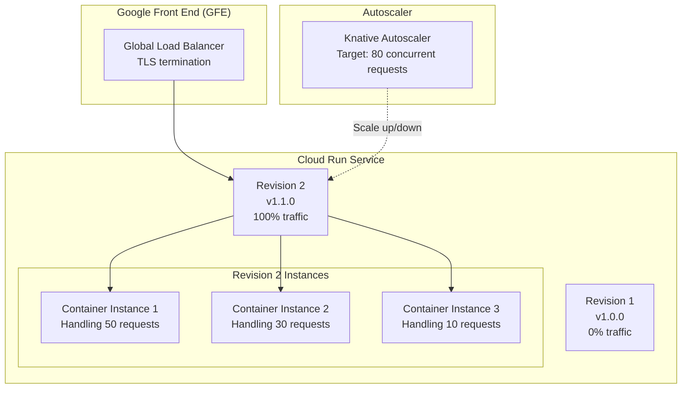
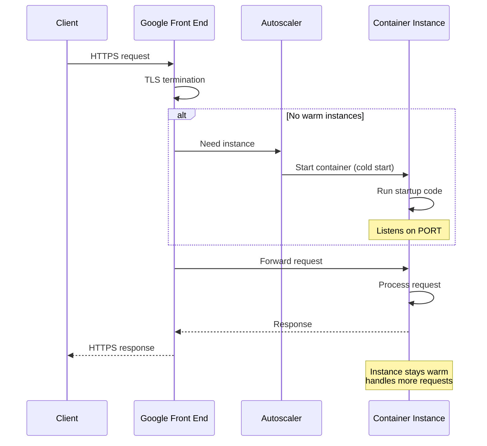
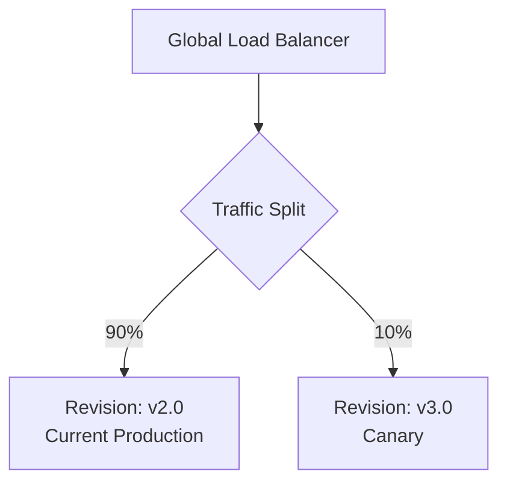
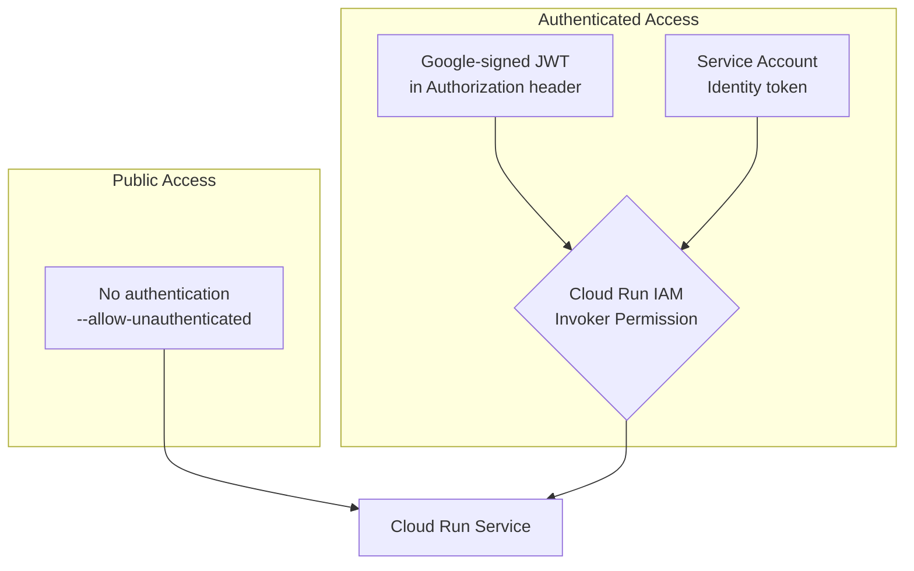

# GCP Cloud Run Deep Dive

Cloud Run is GCP's serverless container platform. Give it a container image, and it handles scaling (including to zero), TLS termination, autoscaling, load balancing, and high availability. Unlike AWS Lambda (which requires specific runtimes and packaging), Cloud Run runs **any container** that listens on a port — your existing Docker images work without modification.

Cloud Run sits at the sweet spot between full container orchestration (GKE) and functions-as-a-service (Cloud Functions). It gives you the deployment simplicity of serverless with the flexibility of containers.

---

## 1. Why Cloud Run Exists: The Problem It Solves

### The Container Deployment Gap

Before Cloud Run, deploying a containerized application on GCP required:

1. **GKE**: Set up a Kubernetes cluster, configure nodes, deployments, services, ingress, autoscaling, TLS certificates, etc. Minimum cost ~$70/month (control plane) even with zero traffic.
2. **Compute Engine**: Manage VMs, install Docker, configure health checks, load balancing, auto-scaling groups, TLS — all manually.
3. **App Engine**: Constrained to specific runtimes and deployment models.

Cloud Run launched in April 2019 (GA November 2019) as a way to deploy containers with zero infrastructure management. Built on **Knative** (an open-source serverless platform for Kubernetes), Cloud Run runs on Google's own Borg/Kubernetes infrastructure.

### Cloud Run vs. Competitors

| Feature | Cloud Run | AWS Lambda | AWS Fargate | Azure Container Apps |
|---------|-----------|-----------|-------------|---------------------|
| Input | Any container | Zip/container (specific runtimes) | Any container | Any container |
| Scale to zero | Yes | Yes | No (min 1 task) | Yes |
| Max timeout | 60 minutes | 15 minutes | Unlimited | Unlimited |
| Max memory | 32 GB | 10 GB | 120 GB | 4 GB per replica |
| Concurrency | Up to 1000 req/instance | 1 req/instance | Unlimited | Configurable |
| Cold start | 0.5-5s (depends on image) | 0.1-10s (depends on runtime) | 30-60s | 1-10s |
| Pricing | Per-request + CPU/memory | Per-invocation + duration | Always-on | Per-request + CPU/memory |

---

## 2. First Principles: How Cloud Run Works

### Architecture



### Key Concepts

| Concept | Definition |
|---------|-----------|
| **Service** | A named, auto-scaling group of container instances serving requests |
| **Revision** | An immutable snapshot of a service configuration (code + config) |
| **Instance** | A running container that handles requests |
| **Concurrency** | Number of simultaneous requests a single instance handles |

### The Request Lifecycle



### The Concurrency Model

This is Cloud Run's most important and most misunderstood feature. Unlike Lambda (1 request per instance), Cloud Run can handle **multiple concurrent requests per instance**.

Default concurrency: **80** requests per instance (configurable 1-1000).

$$\text{Instances Needed} = \lceil \frac{\text{Concurrent Requests}}{\text{Concurrency Setting}} \rceil$$

For 400 concurrent requests with concurrency of 80:

$$\text{Instances} = \lceil \frac{400}{80} \rceil = 5$$

::: tip
Higher concurrency means fewer instances, lower cost, and better resource utilization. Set concurrency as high as your application can handle without degrading response times. For I/O-bound services (most APIs), 80-200 is typical. For CPU-bound services, lower it to 1-10.
:::

---

## 3. Container Requirements

### What Cloud Run Expects

1. Your container must listen on the port specified by the `PORT` environment variable (default: 8080)
2. The container must be stateless (no local disk persistence across requests)
3. The container must start within the startup timeout (default: 300s, max: 3600s)
4. x86_64 or ARM64 architecture
5. Linux containers only

### Production Dockerfile

```dockerfile
# Multi-stage build for minimal image size
FROM node:20-slim AS builder
WORKDIR /app

# Install dependencies first (cached layer)
COPY package.json package-lock.json ./
RUN npm ci --only=production

# Copy source and build
COPY tsconfig.json ./
COPY src/ ./src/
RUN npm run build

# Production stage
FROM node:20-slim AS production
WORKDIR /app

# Security: run as non-root
RUN groupadd -r app && useradd -r -g app app

# Copy only production artifacts
COPY --from=builder /app/node_modules ./node_modules
COPY --from=builder /app/dist ./dist
COPY package.json ./

# Cloud Run sets PORT env var
ENV NODE_ENV=production
EXPOSE 8080

USER app

# Use exec form for proper signal handling
CMD ["node", "dist/server.js"]
```

### Application Setup

```typescript
// src/server.ts — Cloud Run-optimized server
import Fastify from 'fastify';
import { Logger } from './logger';

const logger = new Logger({ service: 'api' });

async function start() {
  const app = Fastify({
    logger: false, // Use structured logging instead
    trustProxy: true, // Cloud Run is behind a proxy
    // Increase keep-alive for connection reuse
    keepAliveTimeout: 620 * 1000, // > Cloud Run's 600s timeout
    connectionTimeout: 0,
  });

  // Health check endpoint
  app.get('/', async () => ({ status: 'healthy' }));

  // Readiness probe (Cloud Run checks this)
  app.get('/ready', async () => {
    // Check dependencies (DB, cache, etc.)
    const dbHealthy = await checkDatabase();
    if (!dbHealthy) {
      throw { statusCode: 503, message: 'Database unavailable' };
    }
    return { status: 'ready' };
  });

  // Application routes
  app.register(import('./routes/orders'));
  app.register(import('./routes/users'));

  // Listen on the PORT Cloud Run provides
  const port = parseInt(process.env.PORT ?? '8080', 10);
  const host = '0.0.0.0'; // Must bind to all interfaces

  await app.listen({ port, host });
  logger.info(`Server listening on ${host}:${port}`);

  // Graceful shutdown
  const shutdown = async (signal: string) => {
    logger.info(`Received ${signal}, shutting down gracefully`);

    // Stop accepting new requests
    await app.close();

    // Close database connections
    await closeDatabasePool();

    logger.info('Shutdown complete');
    process.exit(0);
  };

  process.on('SIGTERM', () => shutdown('SIGTERM'));
  process.on('SIGINT', () => shutdown('SIGINT'));
}

start().catch((err) => {
  logger.error('Failed to start server', { error: err });
  process.exit(1);
});
```

---

## 4. Scaling Behavior

### Scale to Zero

When no requests arrive for a period (typically ~15 minutes, but variable), Cloud Run scales down to **zero instances**. You pay nothing. The next request triggers a cold start.

### Scaling Up

The autoscaler targets a **concurrency utilization** of ~70% by default:

$$\text{Target Instances} = \lceil \frac{\text{Current Concurrent Requests}}{\text{Concurrency} \times 0.7} \rceil$$

Scaling is not instantaneous — there is a ramp-up period. For sudden spikes, Cloud Run can overshoot and start more instances than needed, then scale back down.

### Cold Start Optimization

| Factor | Impact | Optimization |
|--------|--------|-------------|
| Image size | Proportional | Multi-stage builds, distroless base images |
| Language runtime | Varies | Go/Rust: ~100ms; Java: 1-5s; Node.js: 200-500ms |
| Dependency loading | Proportional | Lazy loading, reduce dependencies |
| Database connections | 1-5s for new connections | Use connection pooling, defer until needed |
| TLS handshakes | 50-100ms per external service | Connection reuse, keep-alive |
| Startup CPU | 2x boost during startup | Take advantage of it — do heavy init early |

```typescript
// Optimization: Defer heavy initialization
let dbPool: Pool | null = null;

// DON'T do this at startup — it blocks cold start
// const dbPool = new Pool({ connectionString: process.env.DATABASE_URL });

// DO: Lazy initialize on first request
async function getDbPool(): Promise<Pool> {
  if (!dbPool) {
    dbPool = new Pool({
      connectionString: process.env.DATABASE_URL,
      max: 5, // Cloud Run instances handle multiple requests
      idleTimeoutMillis: 30000,
      connectionTimeoutMillis: 5000,
    });
  }
  return dbPool;
}
```

### Minimum Instances

To avoid cold starts entirely, set a minimum instance count:

```hcl
resource "google_cloud_run_v2_service" "api" {
  name     = "api-service"
  location = "us-central1"

  template {
    scaling {
      min_instance_count = 1   # Always warm
      max_instance_count = 100
    }

    containers {
      image = "gcr.io/my-project/api:latest"

      resources {
        limits = {
          cpu    = "2"
          memory = "1Gi"
        }
        cpu_idle = true # Only charge for CPU during requests (with min instances)
        startup_cpu_boost = true # 2x CPU during startup
      }

      ports {
        container_port = 8080
      }
    }
  }
}
```

::: warning
With `min_instance_count > 0` and `cpu_idle = false`, you pay for CPU continuously (like a VM). With `cpu_idle = true`, you only pay for CPU when handling requests, but the instance stays warm (no cold start). Memory is always billed for min instances.
:::

---

## 5. Traffic Management

### Revision-Based Traffic Splitting

Cloud Run's traffic splitting is built on Knative's traffic management:



```hcl
resource "google_cloud_run_v2_service" "api" {
  name     = "api-service"
  location = "us-central1"

  template {
    revision = "api-service-v3"
    containers {
      image = "gcr.io/my-project/api:v3.0"
    }
  }

  traffic {
    type     = "TRAFFIC_TARGET_ALLOCATION_TYPE_REVISION"
    revision = "api-service-v2"
    percent  = 90
  }

  traffic {
    type     = "TRAFFIC_TARGET_ALLOCATION_TYPE_REVISION"
    revision = "api-service-v3"
    percent  = 10
  }
}
```

### Blue-Green Deployments

```bash
# Deploy new revision with 0% traffic
gcloud run deploy api-service \
  --image gcr.io/my-project/api:v3.0 \
  --no-traffic

# Test the new revision directly
curl https://api-service-v3---api-service-xxxxx.run.app/health

# If tests pass, shift all traffic
gcloud run services update-traffic api-service \
  --to-revisions=api-service-v3=100

# If something goes wrong, instant rollback
gcloud run services update-traffic api-service \
  --to-revisions=api-service-v2=100
```

### Canary with Automatic Rollback

```typescript
// deploy/canary.ts — Automated canary deployment
import { CloudRunClient } from './cloud-run-client';
import { MonitoringClient } from './monitoring-client';

interface CanaryConfig {
  service: string;
  region: string;
  newRevision: string;
  steps: number[];          // [5, 25, 50, 100]
  stepDurationMs: number;   // Time at each step
  errorThreshold: number;   // Max error rate (0.01 = 1%)
  latencyThreshold: number; // Max P99 latency (ms)
}

async function canaryDeploy(config: CanaryConfig): Promise<boolean> {
  const cloudRun = new CloudRunClient(config.service, config.region);
  const monitoring = new MonitoringClient(config.service);

  for (const percent of config.steps) {
    console.log(`Setting traffic to ${percent}% for ${config.newRevision}`);
    await cloudRun.setTrafficSplit(config.newRevision, percent);

    // Wait and monitor
    await sleep(config.stepDurationMs);

    const metrics = await monitoring.getRevisionMetrics(config.newRevision, config.stepDurationMs);

    if (metrics.errorRate > config.errorThreshold) {
      console.error(`Error rate ${metrics.errorRate} exceeds threshold ${config.errorThreshold}`);
      await cloudRun.rollback();
      return false;
    }

    if (metrics.latencyP99 > config.latencyThreshold) {
      console.error(`P99 latency ${metrics.latencyP99}ms exceeds threshold ${config.latencyThreshold}ms`);
      await cloudRun.rollback();
      return false;
    }

    console.log(`Step ${percent}% healthy: error=${metrics.errorRate}, p99=${metrics.latencyP99}ms`);
  }

  return true;
}
```

---

## 6. Cloud Run Jobs

Cloud Run Jobs (GA 2023) run containers to completion — they do not serve HTTP requests. Use for:
- Database migrations
- Batch processing
- Scheduled tasks (with Cloud Scheduler)
- Data imports/exports

```hcl
resource "google_cloud_run_v2_job" "migration" {
  name     = "db-migration"
  location = "us-central1"

  template {
    task_count  = 1
    parallelism = 1

    template {
      containers {
        image = "gcr.io/my-project/migration:latest"

        env {
          name  = "DATABASE_URL"
          value_source {
            secret_key_ref {
              secret  = google_secret_manager_secret.db_url.secret_id
              version = "latest"
            }
          }
        }

        resources {
          limits = {
            cpu    = "2"
            memory = "2Gi"
          }
        }
      }

      timeout     = "3600s"
      max_retries = 1
    }
  }
}
```

---

## 7. Security

### Authentication and Authorization



### Service-to-Service Authentication

```typescript
// Calling another Cloud Run service with authentication
import { GoogleAuth } from 'google-auth-library';

const auth = new GoogleAuth();

async function callInternalService(
  serviceUrl: string,
  path: string,
  body: unknown,
): Promise<unknown> {
  // Get an ID token for the target service
  const client = await auth.getIdTokenClient(serviceUrl);

  const response = await client.request({
    url: `${serviceUrl}${path}`,
    method: 'POST',
    data: body,
    headers: { 'Content-Type': 'application/json' },
  });

  return response.data;
}

// Usage
const result = await callInternalService(
  'https://order-service-xxxxx-uc.a.run.app',
  '/api/orders',
  { customerId: '123', items: [{ productId: 'abc', quantity: 1 }] },
);
```

### Secrets Management

```hcl
# Use Secret Manager for sensitive configuration
resource "google_secret_manager_secret" "api_key" {
  secret_id = "api-key"

  replication {
    auto {}
  }
}

resource "google_secret_manager_secret_version" "api_key" {
  secret      = google_secret_manager_secret.api_key.id
  secret_data = var.api_key_value
}

# Mount as environment variable in Cloud Run
resource "google_cloud_run_v2_service" "api" {
  # ...
  template {
    containers {
      image = "gcr.io/my-project/api:latest"

      env {
        name = "API_KEY"
        value_source {
          secret_key_ref {
            secret  = google_secret_manager_secret.api_key.secret_id
            version = "latest"
          }
        }
      }
    }

    service_account = google_service_account.api.email
  }
}

# Grant access to secret
resource "google_secret_manager_secret_iam_member" "api_key_access" {
  secret_id = google_secret_manager_secret.api_key.id
  role      = "roles/secretmanager.secretAccessor"
  member    = "serviceAccount:${google_service_account.api.email}"
}
```

---

## 8. Networking

### VPC Connectivity

Cloud Run services can connect to VPC resources (Cloud SQL, Memorystore, internal services) via:

1. **Direct VPC egress** (recommended) — Direct connection to VPC, no connector needed
2. **Serverless VPC Access Connector** — Legacy approach, uses a managed connector

```hcl
resource "google_cloud_run_v2_service" "api" {
  name     = "api-service"
  location = "us-central1"

  template {
    vpc_access {
      # Direct VPC egress (preferred)
      network_interfaces {
        network    = google_compute_network.main.id
        subnetwork = google_compute_subnetwork.cloud_run.id
      }
      egress = "PRIVATE_RANGES_ONLY" # Only route private IPs through VPC
    }

    containers {
      image = "gcr.io/my-project/api:latest"
    }
  }
}
```

### Custom Domains

```hcl
# Map custom domain to Cloud Run service
resource "google_cloud_run_domain_mapping" "api" {
  location = "us-central1"
  name     = "api.example.com"

  metadata {
    namespace = var.project_id
  }

  spec {
    route_name = google_cloud_run_v2_service.api.name
  }
}

# For global load balancing with Cloud CDN
resource "google_compute_backend_service" "api" {
  name = "api-backend"

  backend {
    group = google_compute_region_network_endpoint_group.api.id
  }

  log_config {
    enable = true
  }
}

resource "google_compute_region_network_endpoint_group" "api" {
  name                  = "api-neg"
  network_endpoint_type = "SERVERLESS"
  region                = "us-central1"

  cloud_run {
    service = google_cloud_run_v2_service.api.name
  }
}
```

---

## 9. Observability

### Structured Logging

Cloud Run automatically sends stdout/stderr to Cloud Logging. Use structured JSON for rich querying:

```typescript
// logger.ts — Cloud Run structured logging
interface LogEntry {
  severity: 'DEBUG' | 'INFO' | 'WARNING' | 'ERROR' | 'CRITICAL';
  message: string;
  httpRequest?: {
    requestMethod: string;
    requestUrl: string;
    status: number;
    latency: string;
    userAgent: string;
    remoteIp: string;
  };
  'logging.googleapis.com/trace'?: string;
  'logging.googleapis.com/spanId'?: string;
  [key: string]: unknown;
}

export function log(entry: LogEntry): void {
  // Cloud Run picks up JSON from stdout
  console.log(JSON.stringify(entry));
}

// Middleware to extract trace context
export function traceMiddleware(req: any, res: any, next: any): void {
  const traceHeader = req.headers['x-cloud-trace-context'];
  if (traceHeader) {
    const [traceId, spanId] = traceHeader.split('/');
    req.traceId = `projects/${process.env.GOOGLE_CLOUD_PROJECT}/traces/${traceId}`;
    req.spanId = spanId?.split(';')[0];
  }
  next();
}
```

---

## 10. Cost Model

### Pricing Components

| Component | Cost | Billing |
|-----------|------|---------|
| CPU | $0.00002400/vCPU-second | Per-second, during request processing |
| Memory | $0.00000250/GiB-second | Per-second, during request processing |
| Requests | $0.40 per million | Per request |
| Networking | Standard GCP egress rates | Per GB |

### CPU Allocation Modes

| Mode | `cpu_idle` | When CPU Is Available | When Billed | Use Case |
|------|-----------|----------------------|-------------|----------|
| CPU during requests only | `true` | Only during request processing | Per-request | APIs, web services |
| CPU always allocated | `false` | Always (even between requests) | Always-on | Background work, WebSockets |

### Cost Example: API Service

For a service handling 10M requests/month, 100ms average latency, 1 vCPU, 512MB memory:

$$\text{CPU} = 10{,}000{,}000 \times 0.1\text{s} \times 1\text{vCPU} \times \$0.0000240 = \$24.00$$

$$\text{Memory} = 10{,}000{,}000 \times 0.1\text{s} \times 0.5\text{GiB} \times \$0.0000025 = \$1.25$$

$$\text{Requests} = 10 \times \$0.40 = \$4.00$$

$$\text{Total} = \$29.25/\text{month}$$

Compare to a Compute Engine e2-medium running 24/7: ~$24.27/month — but it handles far fewer concurrent requests and requires manual scaling.

::: info War Story
A startup migrated 12 microservices from GKE (3-node cluster, ~$250/month) to Cloud Run. Most services had sporadic traffic. Monthly cost dropped to $45 because services scaled to zero when not in use. The exception was their WebSocket service — Cloud Run does not support WebSocket well (connections are capped at 60 minutes), so that stayed on GKE.
:::

---

## 11. Edge Cases and Failure Modes

| Issue | Cause | Mitigation |
|-------|-------|-----------|
| Request timeout (60 min max) | Long-running process | Use Cloud Run Jobs instead |
| Cold start spikes | Traffic bursts to idle service | Set min instances > 0 |
| 503 errors during deployment | Old revision draining | Use gradual traffic migration |
| Memory exceeded (killed) | Memory leak or large payload | Monitor memory, set appropriate limits |
| Container fails to start | Port misconfiguration | Ensure `PORT` env var is used |
| Intermittent 429 errors | Per-service scaling limits | Request quota increase |

---

## 12. Decision Framework

| Choose Cloud Run When | Choose GKE When | Choose Cloud Functions When |
|-----------------------|----------------|---------------------------|
| HTTP services, APIs | Complex service mesh needed | Simple event handlers |
| Containers with any language | Stateful workloads | No container expertise |
| Scale-to-zero needed | GPU/TPU workloads | Tight GCP event integration |
| Simple deployment model | Custom scheduling | Very small functions |
| Cost-sensitive, variable traffic | Need DaemonSets, sidecars | Sub-second cold starts critical |

---

## See Also

- [GCP Overview](./index.md) — GCP fundamentals and resource hierarchy
- [GKE](./gke.md) — When you need full Kubernetes
- [Cloud SQL](./cloud-sql.md) — Connecting Cloud Run to databases
- [Pub/Sub](./pub-sub.md) — Event-driven Cloud Run services
- [IAM](./iam.md) — Service accounts and invoker permissions
- [Cost Optimization](./cost-optimization.md) — Cloud Run cost strategies
