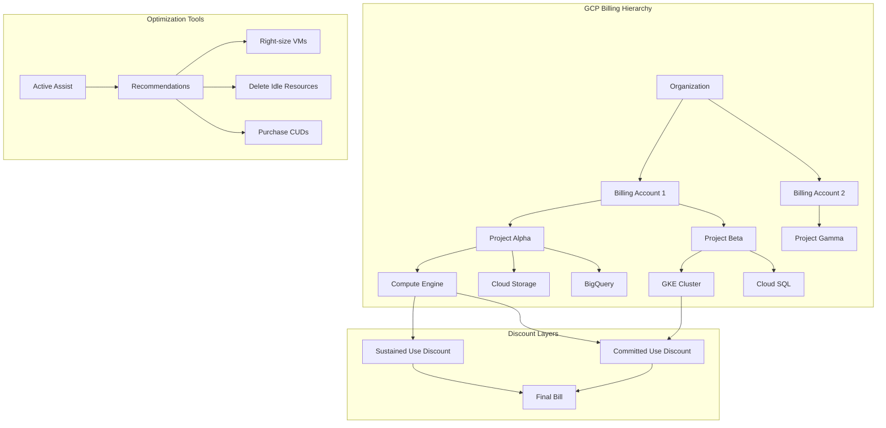
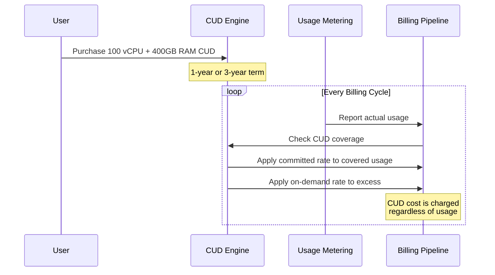
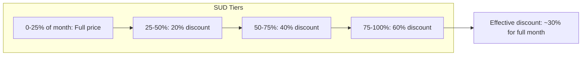
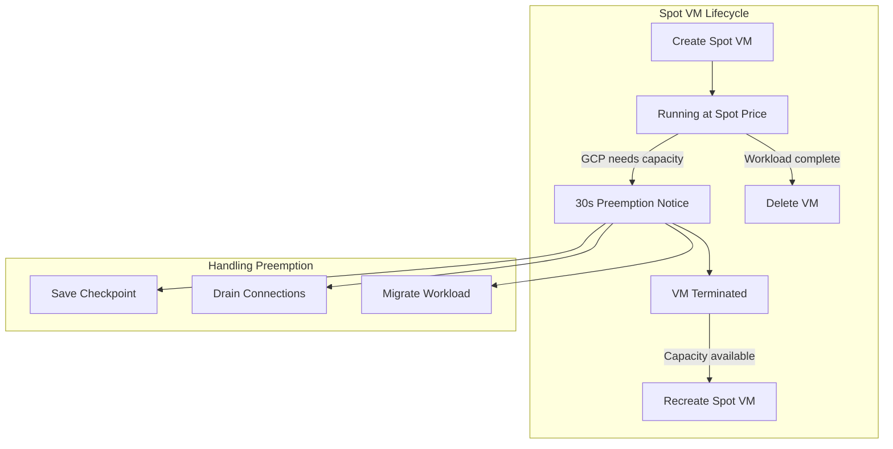
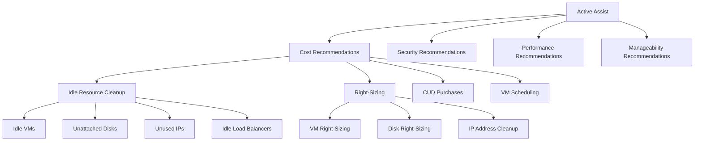
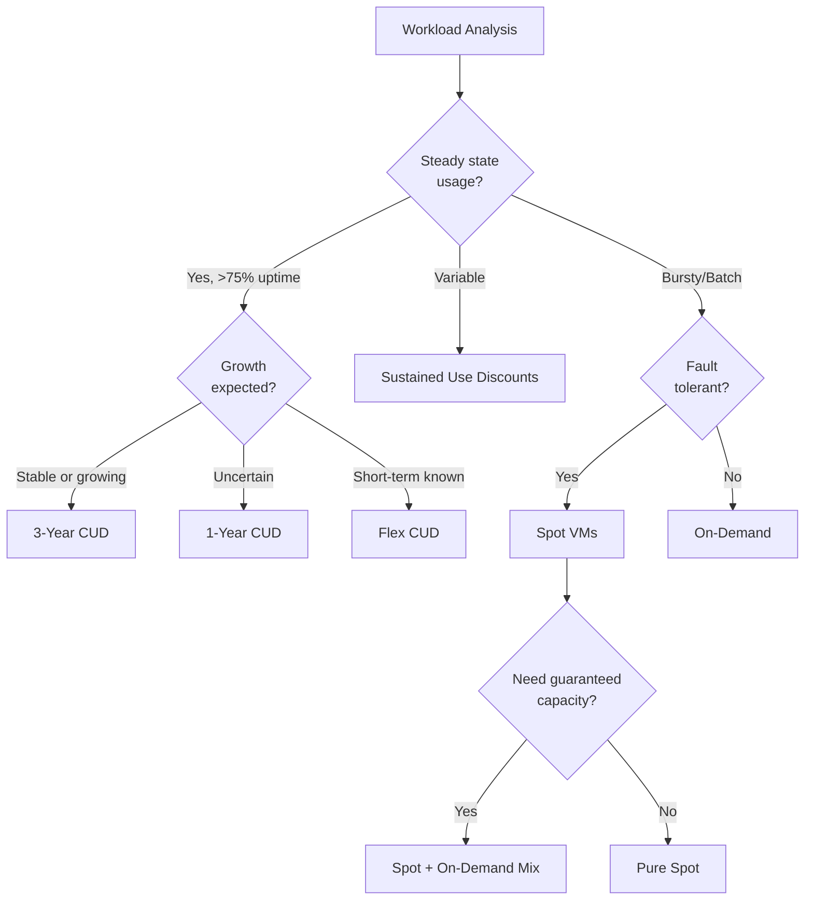
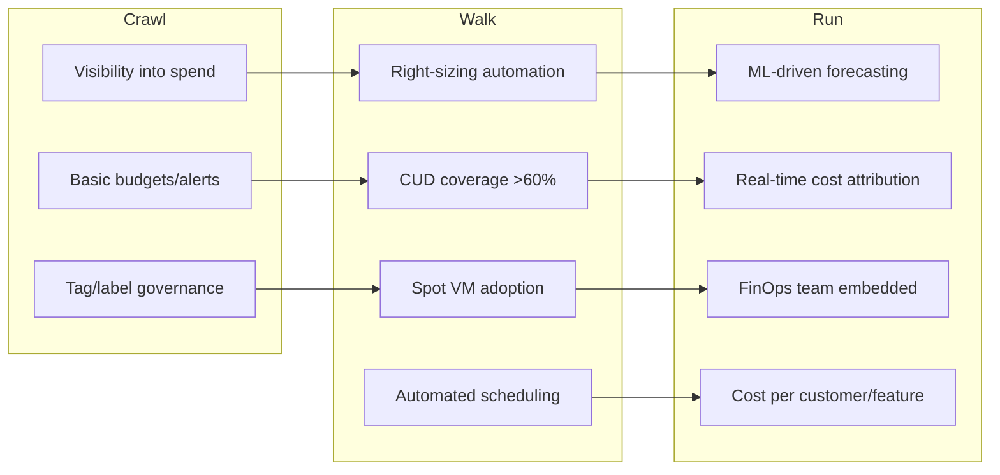

# GCP Cost Optimization

## Why It Exists

Cloud cost optimization exists because the shift from CapEx to OpEx fundamentally changed how organizations spend on infrastructure. In the data center era, you bought servers upfront — overspending meant idle hardware, but costs were fixed and predictable. In the cloud era, every API call, every byte stored, every CPU-second consumed generates a line item on a bill that can spiral out of control without discipline.

Google Cloud Platform's pricing model is particularly nuanced. Unlike AWS, which pioneered Reserved Instances with rigid 1-year or 3-year commitments, GCP introduced Sustained Use Discounts (automatic discounts for consistent usage) and Committed Use Discounts (flexible commitment-based pricing). GCP also led the industry with per-second billing for Compute Engine and preemptible VMs at 60-80% discounts.

The problem is straightforward: organizations routinely waste 30-40% of their cloud spend. A 2025 Flexera study found that the average enterprise wastes 32% of cloud budget. For a company spending $10M/year on GCP, that's $3.2M burned. Cost optimization is not about being cheap — it's about directing every dollar toward business value.

### Historical Context

Google's pricing evolution tells a story:

- **2013**: GCP launches with per-minute billing (industry first)
- **2014**: Automatic Sustained Use Discounts introduced
- **2016**: Preemptible VMs launched at 80% discount
- **2017**: Committed Use Discounts replace traditional reservations
- **2020**: Active Assist recommendations engine GA
- **2022**: Spot VMs replace preemptible VMs with more flexibility
- **2023**: Flex CUDs for short-term commitments
- **2024**: CUD recommendations powered by ML predictions
- **2025**: Carbon-aware cost optimization integrated into Active Assist

## First Principles

### The Unit Economics of Cloud Compute

Every cloud resource has a marginal cost that breaks down into:

$$
C_{total} = C_{compute} + C_{storage} + C_{network} + C_{services} + C_{support}
$$

Where each component follows different pricing curves:

$$
C_{compute} = \sum_{i=1}^{n} (vCPU_i \times P_{cpu} + RAM_i \times P_{mem}) \times T_i \times D_i
$$

- $vCPU_i$: Number of virtual CPUs for instance $i$
- $P_{cpu}$: Price per vCPU-hour
- $RAM_i$: GB of memory for instance $i$
- $P_{mem}$: Price per GB-hour
- $T_i$: Time the instance runs (hours)
- $D_i$: Discount factor (1.0 = on-demand, 0.2 = spot, etc.)

### The Commitment Spectrum

Cloud pricing follows a fundamental tradeoff:

$$
\text{Discount} \propto \frac{\text{Commitment Duration} \times \text{Flexibility Reduction}}{\text{Risk Tolerance}}
$$

```
On-Demand (0% discount) ←→ Spot/Preemptible (60-91% discount)
         ↕                              ↕
   Maximum Flexibility          Maximum Savings
   Minimum Commitment           Maximum Risk
```

The optimal strategy is a portfolio approach:

$$
\text{Optimal Cost} = \alpha \cdot C_{committed} + \beta \cdot C_{sustained} + \gamma \cdot C_{spot} + \delta \cdot C_{ondemand}
$$

Where $\alpha + \beta + \gamma + \delta = 1$ and each coefficient depends on workload characteristics.

### Waste Taxonomy

Cloud waste falls into five categories:

1. **Idle Resources**: Provisioned but unused (zombie VMs, unattached disks)
2. **Right-Sizing Gaps**: Over-provisioned resources running at <30% utilization
3. **Pricing Model Mismatch**: On-demand for steady-state workloads
4. **Architectural Waste**: Inefficient patterns (synchronous where async suffices)
5. **Data Gravity Costs**: Egress charges from poor data placement

## Core Mechanics

### GCP Billing Architecture



### Committed Use Discounts (CUDs)

CUDs are Google's commitment-based discount mechanism. Unlike AWS Reserved Instances, GCP CUDs commit to a certain amount of vCPU and memory — not specific instance types.

#### How CUDs Work Internally



#### CUD Types and Discounts

| CUD Type | Term | vCPU Discount | Memory Discount | Flexibility |
|----------|------|---------------|-----------------|-------------|
| Standard 1-year | 12 months | 37% | 37% | Region-locked, machine family flexible |
| Standard 3-year | 36 months | 55% | 55% | Region-locked, machine family flexible |
| Flex CUD | 1-3 months | 20-25% | 20-25% | Region-locked, machine family flexible |
| Spend-based CUD | 12/36 months | Varies | Varies | Cross-service (BigQuery, Cloud SQL) |

#### CUD Coverage Calculation

The CUD engine applies discounts using a waterfall model:

$$
C_{effective} = \min(U_{actual}, U_{committed}) \times P_{committed} + \max(0, U_{actual} - U_{committed}) \times P_{ondemand} + (U_{committed} - \min(U_{actual}, U_{committed})) \times P_{committed}
$$

Simplified:
$$
C_{effective} = U_{committed} \times P_{committed} + \max(0, U_{actual} - U_{committed}) \times P_{ondemand}
$$

Key insight: **You pay for the commitment regardless of usage.** A CUD for 100 vCPUs costs the committed rate even if you only use 50 vCPUs.

### Sustained Use Discounts (SUDs)

SUDs are automatic discounts that apply when you run Compute Engine resources for a significant portion of the month. No commitment required.



The effective SUD discount for running an instance the entire month:

$$
D_{SUD} = \frac{0.25 \times 1.0 + 0.25 \times 0.8 + 0.25 \times 0.6 + 0.25 \times 0.4}{1.0} = 0.70
$$

So running an instance for the full month gives an effective 30% discount.

::: warning
SUDs do NOT apply to resources covered by CUDs. CUDs take priority. Also, SUDs do not apply to E2, A2, or Tau machine families — these use a different pricing model.
:::

### Preemptible and Spot VMs

#### Evolution: Preemptible to Spot

Preemptible VMs were GCP's original interruptible instances with a 24-hour maximum lifetime. In 2022, Spot VMs replaced them with key differences:

| Feature | Preemptible VM | Spot VM |
|---------|---------------|---------|
| Max Lifetime | 24 hours | No limit (but can be preempted) |
| Preemption Notice | 30 seconds | 30 seconds |
| Discount | 60-91% | 60-91% |
| Availability | Being deprecated | GA |
| Dynamic Pricing | No | Yes (varies by zone/time) |

#### Spot VM Pricing Model

Spot pricing follows supply-demand dynamics within each zone:

$$
P_{spot}(z, t) = P_{ondemand} \times (1 - D_{spot}(z, t))
$$

Where $D_{spot}(z, t)$ is the dynamic discount for zone $z$ at time $t$, typically 60-91%.



### Active Assist

Active Assist is GCP's ML-powered recommendation engine that analyzes usage patterns and suggests optimizations.

#### Recommendation Categories



## Implementation

### Automated CUD Purchase Analyzer

```typescript
import { RecommenderClient } from '@google-cloud/recommender';
import { ComputeClient } from '@google-cloud/compute';

interface CUDAnalysis {
  currentMonthlySpend: number;
  recommendedCUDvCPUs: number;
  recommendedCUDMemoryGB: number;
  projectedMonthlySavings: number;
  breakEvenMonths: number;
  coveragePercentage: number;
  risk: 'low' | 'medium' | 'high';
}

interface UsagePattern {
  hour: number;
  avgVCPUs: number;
  avgMemoryGB: number;
  p95VCPUs: number;
  p95MemoryGB: number;
}

class CUDOptimizer {
  private recommenderClient: RecommenderClient;
  private computeClient: ComputeClient;

  constructor(
    private projectId: string,
    private region: string,
  ) {
    this.recommenderClient = new RecommenderClient();
    this.computeClient = new ComputeClient();
  }

  /**
   * Analyze historical usage to determine optimal CUD purchase.
   * Uses the P50 of daily minimum usage as the CUD baseline —
   * you want to commit only to usage you're confident you'll sustain.
   */
  async analyzeCUDOpportunity(
    lookbackDays: number = 90,
  ): Promise<CUDAnalysis> {
    const usageData = await this.getHistoricalUsage(lookbackDays);
    const baseline = this.calculateBaselineUsage(usageData);
    const currentSpend = await this.getCurrentMonthlySpend();

    // CUD should cover steady-state baseline, not peaks
    const recommendedVCPUs = Math.floor(baseline.p50MinVCPUs);
    const recommendedMemoryGB = Math.floor(baseline.p50MinMemoryGB);

    // Calculate savings with 1-year CUD (37% discount)
    const onDemandCPURate = 0.031611; // per vCPU-hour, n2-standard
    const onDemandMemRate = 0.004237; // per GB-hour
    const cudDiscount = 0.37;

    const monthlyHours = 730;
    const coveredCPUCost =
      recommendedVCPUs * onDemandCPURate * monthlyHours;
    const coveredMemCost =
      recommendedMemoryGB * onDemandMemRate * monthlyHours;
    const totalCoveredCost = coveredCPUCost + coveredMemCost;
    const monthlySavings = totalCoveredCost * cudDiscount;

    const coveragePercentage =
      (totalCoveredCost / currentSpend) * 100;

    // Risk assessment based on usage stability
    const varianceCoeff =
      baseline.stdDevVCPUs / baseline.avgVCPUs;
    const risk: 'low' | 'medium' | 'high' =
      varianceCoeff < 0.1
        ? 'low'
        : varianceCoeff < 0.3
          ? 'medium'
          : 'high';

    return {
      currentMonthlySpend: currentSpend,
      recommendedCUDvCPUs: recommendedVCPUs,
      recommendedCUDMemoryGB: recommendedMemoryGB,
      projectedMonthlySavings: monthlySavings,
      breakEvenMonths:
        risk === 'low' ? 1 : risk === 'medium' ? 3 : 6,
      coveragePercentage,
      risk,
    };
  }

  /**
   * Fetch Active Assist CUD recommendations and compare
   * with our independent analysis.
   */
  async getActiveAssistRecommendations(): Promise<{
    googleRecommendation: CUDAnalysis | null;
    ourAnalysis: CUDAnalysis;
    agreement: boolean;
  }> {
    const parent = `projects/${this.projectId}/locations/${this.region}/recommenders/google.compute.commitment.UsageCommitmentRecommender`;

    const [recommendations] =
      await this.recommenderClient.listRecommendations({
        parent,
        filter: 'stateInfo.state=ACTIVE',
      });

    let googleRecommendation: CUDAnalysis | null = null;

    if (recommendations.length > 0) {
      const rec = recommendations[0];
      const content = rec.content?.operationGroups?.[0]
        ?.operations?.[0]?.value as Record<string, unknown>;

      if (content) {
        googleRecommendation = {
          currentMonthlySpend: 0, // Not provided by Google
          recommendedCUDvCPUs: Number(content['vcpuCount'] ?? 0),
          recommendedCUDMemoryGB: Number(
            content['memoryMb'] ?? 0,
          ) / 1024,
          projectedMonthlySavings: Number(
            rec.primaryImpact?.costProjection
              ?.costInLocalCurrency?.units ?? 0,
          ),
          breakEvenMonths: 0,
          coveragePercentage: 0,
          risk: 'low',
        };
      }
    }

    const ourAnalysis = await this.analyzeCUDOpportunity();

    const agreement =
      googleRecommendation !== null &&
      Math.abs(
        googleRecommendation.recommendedCUDvCPUs -
          ourAnalysis.recommendedCUDvCPUs,
      ) /
        ourAnalysis.recommendedCUDvCPUs <
        0.2;

    return { googleRecommendation, ourAnalysis, agreement };
  }

  private async getHistoricalUsage(
    days: number,
  ): Promise<UsagePattern[]> {
    // In production, this queries Cloud Monitoring API
    // for compute.googleapis.com/instance/cpu/utilization
    // and compute.googleapis.com/instance/memory/usage
    const { MetricServiceClient } = await import(
      '@google-cloud/monitoring'
    );
    const monitoringClient = new MetricServiceClient();

    const now = new Date();
    const startTime = new Date(
      now.getTime() - days * 24 * 60 * 60 * 1000,
    );

    const [timeSeries] = await monitoringClient.listTimeSeries({
      name: `projects/${this.projectId}`,
      filter:
        'metric.type="compute.googleapis.com/instance/cpu/utilization"',
      interval: {
        startTime: { seconds: Math.floor(startTime.getTime() / 1000) },
        endTime: { seconds: Math.floor(now.getTime() / 1000) },
      },
      aggregation: {
        alignmentPeriod: { seconds: 3600 }, // 1 hour
        perSeriesAligner: 'ALIGN_MEAN',
        crossSeriesReducer: 'REDUCE_SUM',
        groupByFields: [],
      },
    });

    // Transform to UsagePattern
    const hourlyUsage = new Map<number, number[]>();

    for (const series of timeSeries) {
      for (const point of series.points ?? []) {
        const timestamp = new Date(
          Number(point.interval?.startTime?.seconds) * 1000,
        );
        const hour = timestamp.getHours();
        const value = point.value?.doubleValue ?? 0;

        if (!hourlyUsage.has(hour)) {
          hourlyUsage.set(hour, []);
        }
        hourlyUsage.get(hour)!.push(value);
      }
    }

    return Array.from(hourlyUsage.entries()).map(
      ([hour, values]) => {
        values.sort((a, b) => a - b);
        return {
          hour,
          avgVCPUs:
            values.reduce((s, v) => s + v, 0) / values.length,
          avgMemoryGB: 0, // Would come from a separate query
          p95VCPUs: values[Math.floor(values.length * 0.95)],
          p95MemoryGB: 0,
        };
      },
    );
  }

  private calculateBaselineUsage(patterns: UsagePattern[]): {
    p50MinVCPUs: number;
    p50MinMemoryGB: number;
    avgVCPUs: number;
    stdDevVCPUs: number;
  } {
    const allVCPUs = patterns.map((p) => p.avgVCPUs);
    allVCPUs.sort((a, b) => a - b);

    const avg =
      allVCPUs.reduce((s, v) => s + v, 0) / allVCPUs.length;
    const variance =
      allVCPUs.reduce((s, v) => s + (v - avg) ** 2, 0) /
      allVCPUs.length;

    return {
      p50MinVCPUs: allVCPUs[Math.floor(allVCPUs.length * 0.5)],
      p50MinMemoryGB: 0,
      avgVCPUs: avg,
      stdDevVCPUs: Math.sqrt(variance),
    };
  }

  private async getCurrentMonthlySpend(): Promise<number> {
    // Uses Cloud Billing API to get current month spend
    const { CloudBillingClient } = await import(
      '@google-cloud/billing'
    );
    const billingClient = new CloudBillingClient();

    const [billingInfo] =
      await billingClient.getProjectBillingInfo({
        name: `projects/${this.projectId}`,
      });

    // In practice, you'd query BigQuery billing export
    // for actual spend data
    return 0; // Placeholder
  }
}
```

### Spot VM Workload Manager

```typescript
import { InstancesClient, ZoneOperationsClient } from '@google-cloud/compute';

interface SpotConfig {
  projectId: string;
  zone: string;
  machineType: string;
  minInstances: number;
  maxInstances: number;
  targetInstances: number;
  checkpointBucket: string;
  preemptionHandler: PreemptionStrategy;
}

type PreemptionStrategy =
  | 'checkpoint-and-restart'
  | 'migrate-to-on-demand'
  | 'requeue-work';

interface SpotInstance {
  name: string;
  zone: string;
  status: 'RUNNING' | 'TERMINATED' | 'STAGING';
  createdAt: Date;
  preemptedAt?: Date;
  workloadId?: string;
}

class SpotVMWorkloadManager {
  private instancesClient: InstancesClient;
  private operationsClient: ZoneOperationsClient;
  private instances: Map<string, SpotInstance> = new Map();
  private preemptionCount = 0;
  private totalRunHours = 0;

  constructor(private config: SpotConfig) {
    this.instancesClient = new InstancesClient();
    this.operationsClient = new ZoneOperationsClient();
  }

  /**
   * Create a pool of Spot VMs with preemption handling.
   * Implements a self-healing pool that automatically replaces
   * preempted instances.
   */
  async createSpotPool(): Promise<void> {
    const createPromises: Promise<void>[] = [];

    for (let i = 0; i < this.config.targetInstances; i++) {
      createPromises.push(this.createSpotInstance(i));
    }

    const results = await Promise.allSettled(createPromises);
    const failures = results.filter(
      (r) => r.status === 'rejected',
    );

    if (failures.length > 0) {
      console.warn(
        `Failed to create ${failures.length} spot instances. ` +
        `Falling back to on-demand for critical capacity.`,
      );

      if (
        this.instances.size < this.config.minInstances &&
        this.config.preemptionHandler === 'migrate-to-on-demand'
      ) {
        await this.createOnDemandFallback(
          this.config.minInstances - this.instances.size,
        );
      }
    }
  }

  /**
   * Handle preemption notification. This is called by the
   * metadata server watcher when a preemption notice is detected.
   */
  async handlePreemption(instanceName: string): Promise<void> {
    const instance = this.instances.get(instanceName);
    if (!instance) return;

    this.preemptionCount++;
    instance.preemptedAt = new Date();
    instance.status = 'TERMINATED';

    console.log(
      `Preemption detected for ${instanceName}. ` +
      `Strategy: ${this.config.preemptionHandler}`,
    );

    switch (this.config.preemptionHandler) {
      case 'checkpoint-and-restart':
        await this.checkpointAndRestart(instance);
        break;
      case 'migrate-to-on-demand':
        await this.migrateToOnDemand(instance);
        break;
      case 'requeue-work':
        await this.requeueWork(instance);
        break;
    }
  }

  private async createSpotInstance(index: number): Promise<void> {
    const instanceName = `spot-worker-${Date.now()}-${index}`;

    const [operation] = await this.instancesClient.insert({
      project: this.config.projectId,
      zone: this.config.zone,
      instanceResource: {
        name: instanceName,
        machineType: `zones/${this.config.zone}/machineTypes/${this.config.machineType}`,
        scheduling: {
          provisioningModel: 'SPOT',
          instanceTerminationAction: 'STOP',
          onHostMaintenance: 'TERMINATE',
        },
        disks: [
          {
            boot: true,
            autoDelete: true,
            initializeParams: {
              sourceImage:
                'projects/debian-cloud/global/images/family/debian-12',
              diskSizeGb: '50',
              diskType: `zones/${this.config.zone}/diskTypes/pd-balanced`,
            },
          },
        ],
        networkInterfaces: [
          {
            network: 'global/networks/default',
            accessConfigs: [{ type: 'ONE_TO_ONE_NAT' }],
          },
        ],
        metadata: {
          items: [
            {
              key: 'startup-script',
              value: this.getStartupScript(),
            },
            {
              key: 'shutdown-script',
              value: this.getShutdownScript(),
            },
          ],
        },
        labels: {
          'managed-by': 'spot-pool',
          'pool-id': `pool-${this.config.projectId}`,
        },
      },
    });

    await this.operationsClient.wait({
      project: this.config.projectId,
      zone: this.config.zone,
      operation: operation.name!,
    });

    this.instances.set(instanceName, {
      name: instanceName,
      zone: this.config.zone,
      status: 'RUNNING',
      createdAt: new Date(),
    });
  }

  private async checkpointAndRestart(
    instance: SpotInstance,
  ): Promise<void> {
    // The shutdown script on the VM saves checkpoint to GCS.
    // We wait briefly then create a new spot instance that
    // resumes from the checkpoint.
    console.log(
      `Waiting for checkpoint save for ${instance.name}...`,
    );

    // Give 25 seconds for checkpoint (5s buffer from 30s notice)
    await new Promise((resolve) => setTimeout(resolve, 25000));

    // Create replacement instance
    const newIndex = this.instances.size;
    try {
      await this.createSpotInstance(newIndex);
      console.log(
        `Replacement spot instance created successfully.`,
      );
    } catch (error) {
      console.error(
        `Failed to create replacement spot instance: ${error}`,
      );
      // Fall back to on-demand if below minimum
      if (this.getRunningCount() < this.config.minInstances) {
        await this.createOnDemandFallback(1);
      }
    }
  }

  private async migrateToOnDemand(
    instance: SpotInstance,
  ): Promise<void> {
    console.log(
      `Migrating workload from ${instance.name} to on-demand instance.`,
    );
    await this.createOnDemandFallback(1);
  }

  private async requeueWork(instance: SpotInstance): Promise<void> {
    if (instance.workloadId) {
      console.log(
        `Requeuing work item ${instance.workloadId} to task queue.`,
      );
      // Push work item back to Cloud Tasks or Pub/Sub
    }
  }

  private async createOnDemandFallback(
    count: number,
  ): Promise<void> {
    for (let i = 0; i < count; i++) {
      const instanceName = `ondemand-fallback-${Date.now()}-${i}`;

      await this.instancesClient.insert({
        project: this.config.projectId,
        zone: this.config.zone,
        instanceResource: {
          name: instanceName,
          machineType: `zones/${this.config.zone}/machineTypes/${this.config.machineType}`,
          scheduling: {
            provisioningModel: 'STANDARD',
            onHostMaintenance: 'MIGRATE',
          },
          disks: [
            {
              boot: true,
              autoDelete: true,
              initializeParams: {
                sourceImage:
                  'projects/debian-cloud/global/images/family/debian-12',
                diskSizeGb: '50',
              },
            },
          ],
          networkInterfaces: [
            {
              network: 'global/networks/default',
            },
          ],
          labels: {
            'managed-by': 'spot-pool',
            'fallback': 'true',
          },
        },
      });
    }
  }

  private getRunningCount(): number {
    return Array.from(this.instances.values()).filter(
      (i) => i.status === 'RUNNING',
    ).length;
  }

  private getStartupScript(): string {
    return `#!/bin/bash
# Check for existing checkpoint
CHECKPOINT_PATH="gs://${this.config.checkpointBucket}/checkpoints/\$(hostname).tar.gz"
if gsutil ls "\$CHECKPOINT_PATH" 2>/dev/null; then
  echo "Resuming from checkpoint..."
  gsutil cp "\$CHECKPOINT_PATH" /tmp/checkpoint.tar.gz
  tar -xzf /tmp/checkpoint.tar.gz -C /opt/workload/
  /opt/workload/resume.sh
else
  echo "Starting fresh..."
  /opt/workload/start.sh
fi

# Start preemption watcher
/opt/scripts/watch-preemption.sh &
`;
  }

  private getShutdownScript(): string {
    return `#!/bin/bash
echo "Shutdown signal received. Saving checkpoint..."
tar -czf /tmp/checkpoint.tar.gz -C /opt/workload/ state/
gsutil cp /tmp/checkpoint.tar.gz "gs://${this.config.checkpointBucket}/checkpoints/\$(hostname).tar.gz"
echo "Checkpoint saved successfully."
`;
  }

  /**
   * Calculate cost savings from using spot instances.
   */
  getPoolMetrics(): {
    totalInstances: number;
    runningInstances: number;
    preemptionRate: number;
    estimatedMonthlySavings: number;
  } {
    const running = this.getRunningCount();
    const onDemandRate = 0.0950; // n2-standard-2 per hour
    const spotRate = 0.0285; // ~70% discount
    const hoursPerMonth = 730;

    return {
      totalInstances: this.instances.size,
      runningInstances: running,
      preemptionRate:
        this.preemptionCount /
        Math.max(1, this.instances.size),
      estimatedMonthlySavings:
        running *
        (onDemandRate - spotRate) *
        hoursPerMonth,
    };
  }
}
```

### Cost Monitoring and Alerting Pipeline

```typescript
import { BudgetServiceClient } from '@google-cloud/billing-budgets';
import { BigQuery } from '@google-cloud/bigquery';

interface CostAlert {
  projectId: string;
  service: string;
  currentSpend: number;
  budgetAmount: number;
  percentUsed: number;
  forecastedOverrun: number;
  anomalyDetected: boolean;
  severity: 'info' | 'warning' | 'critical';
}

interface CostAnomaly {
  service: string;
  date: string;
  expectedCost: number;
  actualCost: number;
  deviation: number;
  zScore: number;
}

class CostMonitoringPipeline {
  private bigquery: BigQuery;
  private budgetClient: BudgetServiceClient;

  constructor(
    private projectId: string,
    private billingDataset: string = 'billing_export',
  ) {
    this.bigquery = new BigQuery({ projectId });
    this.budgetClient = new BudgetServiceClient();
  }

  /**
   * Detect cost anomalies using z-score analysis on
   * daily spend by service.
   */
  async detectAnomalies(
    lookbackDays: number = 30,
    zScoreThreshold: number = 2.5,
  ): Promise<CostAnomaly[]> {
    const query = `
      WITH daily_costs AS (
        SELECT
          service.description AS service_name,
          DATE(usage_start_time) AS usage_date,
          SUM(cost) AS daily_cost
        FROM \`${this.projectId}.${this.billingDataset}.gcp_billing_export_v1*\`
        WHERE DATE(usage_start_time) >= DATE_SUB(CURRENT_DATE(), INTERVAL ${lookbackDays} DAY)
        GROUP BY service_name, usage_date
      ),
      stats AS (
        SELECT
          service_name,
          AVG(daily_cost) AS avg_cost,
          STDDEV(daily_cost) AS stddev_cost
        FROM daily_costs
        WHERE usage_date < DATE_SUB(CURRENT_DATE(), INTERVAL 1 DAY)
        GROUP BY service_name
        HAVING COUNT(*) >= 7
      ),
      today_costs AS (
        SELECT service_name, daily_cost
        FROM daily_costs
        WHERE usage_date = CURRENT_DATE()
      )
      SELECT
        t.service_name,
        CAST(t.daily_cost AS FLOAT64) AS actual_cost,
        CAST(s.avg_cost AS FLOAT64) AS expected_cost,
        CAST((t.daily_cost - s.avg_cost) / NULLIF(s.stddev_cost, 0) AS FLOAT64) AS z_score
      FROM today_costs t
      JOIN stats s ON t.service_name = s.service_name
      WHERE ABS((t.daily_cost - s.avg_cost) / NULLIF(s.stddev_cost, 0)) > ${zScoreThreshold}
      ORDER BY z_score DESC
    `;

    const [rows] = await this.bigquery.query({ query });

    return rows.map((row: Record<string, unknown>) => ({
      service: String(row['service_name']),
      date: new Date().toISOString().split('T')[0],
      expectedCost: Number(row['expected_cost']),
      actualCost: Number(row['actual_cost']),
      deviation:
        Number(row['actual_cost']) - Number(row['expected_cost']),
      zScore: Number(row['z_score']),
    }));
  }

  /**
   * Generate a comprehensive cost optimization report.
   */
  async generateOptimizationReport(): Promise<{
    totalMonthlySpend: number;
    topServices: Array<{ service: string; cost: number; trend: string }>;
    wastageEstimate: number;
    recommendations: string[];
  }> {
    const spendQuery = `
      SELECT
        service.description AS service_name,
        SUM(cost) AS total_cost,
        SUM(CASE
          WHEN DATE(usage_start_time) >= DATE_SUB(CURRENT_DATE(), INTERVAL 7 DAY)
          THEN cost ELSE 0 END) * 4.3 AS projected_monthly
      FROM \`${this.projectId}.${this.billingDataset}.gcp_billing_export_v1*\`
      WHERE DATE(usage_start_time) >= DATE_SUB(CURRENT_DATE(), INTERVAL 30 DAY)
      GROUP BY service_name
      ORDER BY total_cost DESC
      LIMIT 20
    `;

    const [rows] = await this.bigquery.query({ query: spendQuery });

    const totalMonthlySpend = rows.reduce(
      (sum: number, row: Record<string, unknown>) =>
        sum + Number(row['total_cost']),
      0,
    );

    const topServices = rows.slice(0, 10).map(
      (row: Record<string, unknown>) => {
        const current = Number(row['total_cost']);
        const projected = Number(row['projected_monthly']);
        const trend =
          projected > current * 1.1
            ? 'increasing'
            : projected < current * 0.9
              ? 'decreasing'
              : 'stable';
        return {
          service: String(row['service_name']),
          cost: current,
          trend,
        };
      },
    );

    // Estimate wastage at 30% (industry average)
    const wastageEstimate = totalMonthlySpend * 0.3;

    const recommendations: string[] = [];
    if (topServices.some((s) => s.service === 'Compute Engine')) {
      recommendations.push(
        'Review Compute Engine for right-sizing and CUD opportunities',
      );
    }
    if (topServices.some((s) => s.service === 'Cloud Storage')) {
      recommendations.push(
        'Implement lifecycle policies for Cloud Storage objects',
      );
    }
    if (topServices.some((s) => s.service === 'BigQuery')) {
      recommendations.push(
        'Consider BigQuery flat-rate or editions pricing',
      );
    }

    return {
      totalMonthlySpend,
      topServices,
      wastageEstimate,
      recommendations,
    };
  }

  /**
   * Set up budget alerts with anomaly detection.
   */
  async createBudgetWithAlerts(
    billingAccountId: string,
    monthlyBudget: number,
    alertThresholds: number[] = [0.5, 0.8, 0.9, 1.0, 1.2],
  ): Promise<string> {
    const [budget] = await this.budgetClient.createBudget({
      parent: `billingAccounts/${billingAccountId}`,
      budget: {
        displayName: `${this.projectId}-monthly-budget`,
        amount: {
          specifiedAmount: {
            currencyCode: 'USD',
            units: String(monthlyBudget),
          },
        },
        budgetFilter: {
          projects: [`projects/${this.projectId}`],
          calendarPeriod: 'MONTH',
        },
        thresholdRules: alertThresholds.map((threshold) => ({
          thresholdPercent: threshold,
          spendBasis: 'CURRENT_SPEND',
        })),
        notificationsRule: {
          pubsubTopic: `projects/${this.projectId}/topics/budget-alerts`,
          schemaVersion: '1.0',
          monitoringNotificationChannels: [],
          disableDefaultIamRecipients: false,
        },
      },
    });

    return budget.name!;
  }
}
```

## Edge Cases and Failure Modes

### CUD Pitfalls

::: danger
**Over-committing on CUDs**: If your workload shrinks below the committed amount, you pay for unused capacity. A 3-year CUD for 1000 vCPUs that drops to 200 vCPUs means you're paying committed rates for 800 unused vCPUs — potentially hundreds of thousands of dollars wasted.
:::

| Failure Mode | Impact | Mitigation |
|---|---|---|
| Over-committed CUDs | Pay for unused capacity | Start with 50-60% of baseline, grow incrementally |
| Under-committed CUDs | Miss savings opportunity | Review quarterly, use Flex CUDs for uncertainty |
| Wrong region CUDs | CUDs are region-specific | Verify workload placement before purchase |
| Machine family migration | CUDs apply within machine families | Plan migrations before CUD expiry |
| Spot preemption cascade | All spot VMs reclaimed simultaneously | Spread across zones, maintain on-demand baseline |
| Budget alert delay | Billing data can lag 12-24 hours | Use Cloud Monitoring for real-time signals |
| Egress cost surprise | Inter-region/internet egress adds up | Use CDN, Private Google Access, same-region placement |

### Spot VM Preemption Patterns

In practice, preemption rates vary dramatically:

- **Off-peak hours (UTC 00:00-08:00)**: 2-5% preemption rate
- **Peak hours (UTC 14:00-22:00)**: 10-30% preemption rate
- **End of month**: Higher preemption as capacity tightens
- **Major launches/events**: Can spike to 50%+

::: info War Story
A machine learning team at a fintech company ran their training pipelines on 500 preemptible VMs. During a major GCP region expansion, Google reclaimed 80% of their fleet within a 2-hour window. Their training jobs had 6-hour checkpoint intervals, losing up to 6 hours of computation per instance. After this incident, they implemented 30-minute checkpoint intervals and a mixed fleet strategy: 30% on-demand for guaranteed capacity, 70% spot for cost savings. Total cost increased by 15% but availability went from 95% to 99.7%.
:::

## Performance Characteristics

### CUD vs. SUD vs. Spot: Break-Even Analysis

For an n2-standard-8 instance (8 vCPU, 32 GB RAM):

| Pricing Model | Hourly Rate | Monthly Cost | Annual Cost | Savings vs. On-Demand |
|---|---|---|---|---|
| On-Demand | $0.3886 | $283.68 | $3,404.14 | 0% |
| SUD (full month) | $0.2720 | $198.58 | $2,382.90 | 30% |
| 1-Year CUD | $0.2448 | $178.68 | $2,144.16 | 37% |
| 3-Year CUD | $0.1749 | $127.66 | $1,531.86 | 55% |
| Spot VM | $0.1166 | $85.10 | $1,021.24 | 70% |

Break-even for CUDs assuming constant usage:

$$
T_{break-even} = \frac{C_{CUD\_total}}{C_{on-demand\_rate} - C_{CUD\_rate}}
$$

For a 1-year CUD:
$$
T_{break-even} = \frac{C_{annual}}{(0.3886 - 0.2448) \times 8760} = 1 \text{ month}
$$

CUDs break even almost immediately because there's no upfront cost — you simply pay a lower hourly rate.

### Storage Cost Optimization

Storage class selection dramatically impacts costs:

| Storage Class | per GB/month | Use Case | Minimum Duration |
|---|---|---|---|
| Standard | $0.020 | Frequently accessed | None |
| Nearline | $0.010 | Monthly access | 30 days |
| Coldline | $0.004 | Quarterly access | 90 days |
| Archive | $0.0012 | Annual access | 365 days |

The cost crossover point for retrieval costs:

$$
C_{standard} < C_{nearline} \text{ when } \frac{\text{retrievals}}{\text{month}} > \frac{P_{standard} - P_{nearline}}{P_{retrieval\_nearline}}
$$

$$
\frac{0.020 - 0.010}{0.01} = 1 \text{ retrieval per GB per month}
$$

If you access data more than once per month, Standard is cheaper than Nearline.

## Mathematical Foundations

### Optimal Commitment Level (Newsvendor Model)

The CUD purchase decision is formally equivalent to the newsvendor problem from operations research. You must decide how much capacity to commit to (order) before knowing actual demand.

Let $D$ be the random variable representing future usage (demand), with CDF $F(d)$ and PDF $f(d)$.

- $c_u$: Underage cost (cost of on-demand when CUD runs out) = $P_{ondemand} - P_{CUD}$
- $c_o$: Overage cost (cost of unused CUD capacity) = $P_{CUD}$

The optimal commitment level $Q^*$ satisfies:

$$
F(Q^*) = \frac{c_u}{c_u + c_o} = \frac{P_{ondemand} - P_{CUD}}{P_{ondemand}}
$$

For a 1-year CUD with 37% discount:
$$
F(Q^*) = \frac{0.3886 - 0.2448}{0.3886} = 0.37
$$

This means you should commit to the 37th percentile of your expected usage distribution — the amount you'll exceed 63% of the time.

For a 3-year CUD with 55% discount:
$$
F(Q^*) = \frac{0.3886 - 0.1749}{0.3886} = 0.55
$$

Commit to the 55th percentile — the amount you'll exceed 45% of the time.

### Portfolio Optimization

Modeling the cost optimization as a portfolio problem:

$$
\min_{\mathbf{x}} \sum_{i \in \{CUD, SUD, spot, OD\}} c_i \cdot x_i
$$

Subject to:
$$
\sum_i x_i \geq D_{min} \quad \text{(meet minimum demand)}
$$
$$
x_{spot} \leq \alpha \cdot \sum_i x_i \quad \text{(spot VM risk limit)}
$$
$$
x_{CUD} \leq F^{-1}(0.37) \quad \text{(newsvendor bound)}
$$
$$
x_i \geq 0 \quad \forall i
$$

## Real-World War Stories

::: info War Story
A SaaS company migrated from AWS to GCP and immediately purchased 3-year CUDs for their entire Compute Engine fleet — 2000 vCPUs at a 55% discount, saving approximately $800K/year. Six months later, they containerized their workloads and moved to GKE Autopilot, which uses its own pricing model. The CUDs still applied to the underlying GKE nodes, but Autopilot's auto-scaling meant they were using 40% fewer resources. They ended up paying $200K/year for unused CUD capacity. Lesson: never commit long-term right before a major architectural change.
:::

::: info War Story
An analytics company ran their data pipelines on 1000+ spot VMs in us-central1. They noticed that every Monday morning at 9 AM CT, they experienced high preemption rates — coinciding with US business opening hours. They implemented a zone-rotation strategy, shifting to us-east1 and us-west1 during peak us-central1 preemption windows. This reduced their effective preemption rate from 15% to 3% and saved $2M annually compared to on-demand pricing.
:::

::: info War Story
A gaming company's cloud bill went from $50K/month to $300K/month over a weekend. The culprit: a developer had deployed a Cloud Function that triggered on Cloud Storage uploads. Another service was writing logs to the same bucket, creating a feedback loop. Each function invocation generated more logs, which triggered more invocations. By the time the on-call engineer noticed the budget alert (which had a 24-hour delay), they'd burned through $250K. They now implement circuit breakers on all event-driven architectures and use real-time cost monitoring via Cloud Monitoring rather than relying solely on billing alerts.
:::

## Decision Framework

### When to Use Each Pricing Model



### Cost Optimization Decision Matrix

| Criterion | CUD 3-Year | CUD 1-Year | Flex CUD | Spot VM | On-Demand |
|---|---|---|---|---|---|
| Savings | 55% | 37% | 20-25% | 60-91% | 0% |
| Commitment | 36 months | 12 months | 1-3 months | None | None |
| Risk | High | Medium | Low | Preemption | None |
| Best For | Stable production | Growth phase | Short projects | Batch/ML | Spiky workloads |
| Flexibility | Low | Medium | High | High | Maximum |
| Upfront Cost | None | None | None | None | None |

### GCP vs AWS vs Azure Cost Comparison

| Feature | GCP | AWS | Azure |
|---|---|---|---|
| Commitment Model | CUDs (resource-based) | Reserved Instances (instance-specific or convertible) | Reserved VMs |
| Auto-discount | SUDs (up to 30%) | None | None |
| Spot/Preemptible | Spot VMs (60-91%) | Spot Instances (up to 90%) | Spot VMs (up to 90%) |
| Billing Granularity | Per-second | Per-second | Per-minute (some per-second) |
| Free Tier | Always Free + $300 credit | 12-month free tier | 12-month free tier + always free |
| Cost Recommender | Active Assist | Cost Explorer + Trusted Advisor | Azure Advisor |

## Advanced Topics

### FinOps Maturity Model on GCP



### Carbon-Aware Cost Optimization

GCP's Carbon Footprint dashboard (launched 2024-2025) integrates carbon awareness into cost optimization. The key insight: carbon-intensive regions often correlate with higher costs due to energy prices.

$$
C_{total} = C_{compute} + C_{carbon\_offset}
$$

Where:
$$
C_{carbon\_offset} = E_{compute} \times I_{grid} \times P_{carbon}
$$

- $E_{compute}$: Energy consumed (kWh)
- $I_{grid}$: Grid carbon intensity (gCO2/kWh) — varies by region
- $P_{carbon}$: Carbon price ($/tCO2)

Low-carbon GCP regions (Oregon, Finland, Montreal) also tend to have lower compute costs due to cheap hydroelectric power.

### BigQuery Cost Optimization

BigQuery can silently become the largest line item on a GCP bill:

```typescript
interface BigQueryCostStrategy {
  // Slot-based pricing for predictable costs
  useEditions: boolean;
  editionType: 'standard' | 'enterprise' | 'enterprise-plus';
  baselineSlots: number;
  autoscaleMaxSlots: number;

  // Query optimization
  partitionStrategy: 'time' | 'integer' | 'ingestion-time';
  clusteringColumns: string[];
  materializedViewRefreshMs: number;

  // Storage optimization
  longTermStorageThresholdDays: number;
  activeStorageExpirationDays: number;
}

function estimateBigQueryCost(
  strategy: BigQueryCostStrategy,
  monthlyQueriedTB: number,
  storedTB: number,
): { monthlyCost: number; perTBQueryCost: number } {
  if (strategy.useEditions) {
    // Editions pricing (slot-based)
    const slotPrices: Record<string, number> = {
      standard: 0.04, // per slot-hour
      enterprise: 0.06,
      'enterprise-plus': 0.10,
    };
    const baselineCost =
      strategy.baselineSlots *
      slotPrices[strategy.editionType] *
      730; // hours/month
    const autoscaleCost =
      strategy.autoscaleMaxSlots *
      0.5 * // assume 50% autoscale utilization
      slotPrices[strategy.editionType] *
      730;

    const storageCost = storedTB * 20; // $20/TB/month active
    return {
      monthlyCost: baselineCost + autoscaleCost + storageCost,
      perTBQueryCost:
        (baselineCost + autoscaleCost) / monthlyQueriedTB,
    };
  } else {
    // On-demand pricing
    const queryCost = monthlyQueriedTB * 6.25; // $6.25/TB
    const storageCost = storedTB * 20;
    return {
      monthlyCost: queryCost + storageCost,
      perTBQueryCost: 6.25,
    };
  }
}
```

### Network Egress Optimization

Network egress is the silent killer of GCP budgets:

| Egress Type | Cost per GB | Optimization |
|---|---|---|
| Same zone | Free | Co-locate services |
| Same region, different zone | $0.01 | Use regional resources |
| Different region (US) | $0.01 | Minimize cross-region |
| Different region (intercontinental) | $0.08-$0.12 | Use CDN, edge caching |
| Internet egress (first 1TB) | $0.12 | CDN, compression |
| Internet egress (1-10TB) | $0.11 | Cloud CDN |
| Internet egress (10TB+) | $0.08 | Negotiate custom pricing |

::: tip
Use **Private Google Access** for GCE instances to access Google APIs without going through the internet (and without incurring egress charges). Enable it on the subnet level:

```bash
gcloud compute networks subnets update my-subnet \
  --region=us-central1 \
  --enable-private-ip-google-access
```
:::

### GKE Cost Optimization

```typescript
interface GKECostConfig {
  // Cluster-level settings
  autopilot: boolean;
  releaseChannel: 'rapid' | 'regular' | 'stable';

  // Node pool optimization
  nodePools: Array<{
    name: string;
    machineType: string;
    spot: boolean;
    minNodes: number;
    maxNodes: number;
    autoscaling: boolean;
  }>;

  // Workload optimization
  verticalPodAutoscaler: boolean;
  horizontalPodAutoscaler: boolean;
  clusterAutoscaler: boolean;
  nodeAutoProvisioning: boolean;
}

function estimateGKEMonthlyCost(config: GKECostConfig): number {
  if (config.autopilot) {
    // Autopilot: pay per pod resource request
    // $0.000017/vCPU/second + $0.000001863/GB/second
    return 0; // Depends entirely on pod specs
  }

  let totalCost = 0;

  // Cluster management fee
  totalCost += 0; // Standard tier is free (2025)

  for (const pool of config.nodePools) {
    const machineHourlyRate = getMachineRate(pool.machineType);
    const avgNodes =
      (pool.minNodes + pool.maxNodes) / 2; // simplified
    const discount = pool.spot ? 0.3 : 1.0; // spot = 70% off

    totalCost +=
      avgNodes * machineHourlyRate * discount * 730;
  }

  return totalCost;
}

function getMachineRate(machineType: string): number {
  const rates: Record<string, number> = {
    'e2-standard-2': 0.06701,
    'e2-standard-4': 0.13402,
    'e2-standard-8': 0.26805,
    'n2-standard-2': 0.09710,
    'n2-standard-4': 0.19420,
    'n2-standard-8': 0.38840,
  };
  return rates[machineType] ?? 0.10;
}
```

### Terraform Cost Guard Rails

```hcl
# Enforce cost optimization policies via Terraform

variable "max_instance_size" {
  default = "n2-standard-16"
  description = "Maximum allowed machine type"
}

variable "require_labels" {
  default = ["team", "environment", "cost-center"]
  description = "Required labels for cost attribution"
}

resource "google_compute_instance" "example" {
  name         = "optimized-instance"
  machine_type = "n2-standard-4"
  zone         = "us-central1-a"

  scheduling {
    # Use spot for non-production
    provisioning_model  = var.environment == "production" ? "STANDARD" : "SPOT"
    on_host_maintenance = var.environment == "production" ? "MIGRATE" : "TERMINATE"
  }

  labels = {
    team        = var.team
    environment = var.environment
    cost-center = var.cost_center
    managed-by  = "terraform"
  }

  lifecycle {
    # Prevent accidental creation of expensive instances
    precondition {
      condition     = contains(["n2-standard-2", "n2-standard-4", "n2-standard-8", "n2-standard-16", "e2-standard-2", "e2-standard-4"], self.machine_type)
      error_message = "Machine type ${self.machine_type} is not in the approved list."
    }
  }
}
```

### Automated Resource Scheduling

For development environments, scheduling VMs to run only during business hours saves 65% on compute:

$$
\text{Savings} = 1 - \frac{\text{Business Hours}}{\text{Total Hours}} = 1 - \frac{10 \times 5}{24 \times 7} = 1 - \frac{50}{168} = 70.2\%
$$

```typescript
import { CloudSchedulerClient } from '@google-cloud/scheduler';

async function createVMSchedule(
  projectId: string,
  zone: string,
  instanceName: string,
): Promise<void> {
  const schedulerClient = new CloudSchedulerClient();
  const parent = `projects/${projectId}/locations/${zone.slice(0, -2)}`;

  // Start at 8 AM Monday-Friday
  await schedulerClient.createJob({
    parent,
    job: {
      name: `${parent}/jobs/start-${instanceName}`,
      schedule: '0 8 * * 1-5',
      timeZone: 'America/New_York',
      httpTarget: {
        uri: `https://compute.googleapis.com/compute/v1/projects/${projectId}/zones/${zone}/instances/${instanceName}/start`,
        httpMethod: 'POST',
        oauthToken: {
          serviceAccountEmail: `scheduler@${projectId}.iam.gserviceaccount.com`,
        },
      },
    },
  });

  // Stop at 6 PM Monday-Friday
  await schedulerClient.createJob({
    parent,
    job: {
      name: `${parent}/jobs/stop-${instanceName}`,
      schedule: '0 18 * * 1-5',
      timeZone: 'America/New_York',
      httpTarget: {
        uri: `https://compute.googleapis.com/compute/v1/projects/${projectId}/zones/${zone}/instances/${instanceName}/stop`,
        httpMethod: 'POST',
        oauthToken: {
          serviceAccountEmail: `scheduler@${projectId}.iam.gserviceaccount.com`,
        },
      },
    },
  });
}
```

### Cost Allocation with Labels

Effective label taxonomy for cost attribution:

```yaml
# Required labels for every GCP resource
labels:
  team: "platform-engineering"      # Who owns this
  environment: "production"          # prod/staging/dev
  cost-center: "CC-1234"            # Finance tracking
  service: "user-auth"              # Which microservice
  managed-by: "terraform"           # How it's provisioned
  data-classification: "internal"   # Security classification

# Optional but recommended
  feature: "sso-integration"        # Feature flag
  ttl: "2026-06-01"                 # Auto-cleanup date
  on-call: "team-alpha"             # Incident routing
```

::: warning
GCP label limits: 64 labels per resource, keys max 63 characters, values max 63 characters. Labels are case-sensitive. Plan your taxonomy carefully — changing labels retroactively doesn't update historical billing data.
:::

## Key Takeaways

1. **Start with visibility**: Export billing to BigQuery, implement labels, set budgets before optimizing
2. **Layer discounts**: CUDs for baseline, SUDs for growth, Spot for batch, on-demand for spikes
3. **Use the newsvendor model**: Commit to the percentile that matches your discount level
4. **Automate everything**: Resource scheduling, right-sizing, anomaly detection
5. **Monitor continuously**: Billing data lags 24 hours — use Cloud Monitoring for real-time signals
6. **Think architecturally**: The biggest savings come from architectural decisions, not pricing negotiations
