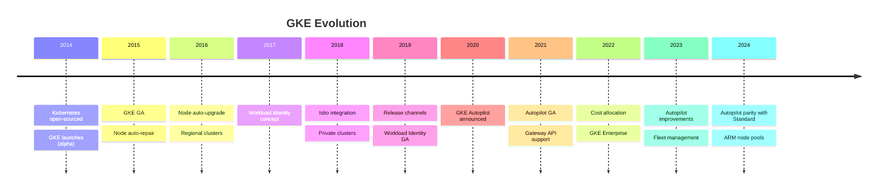
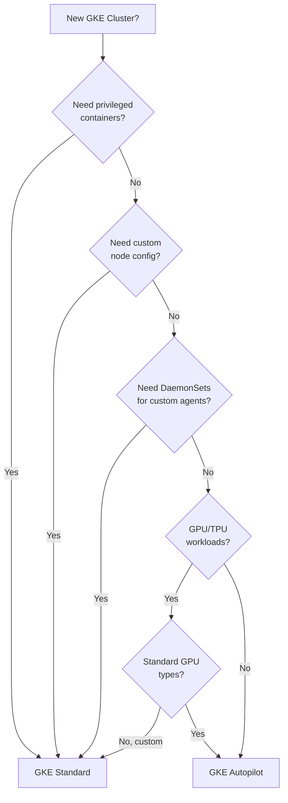
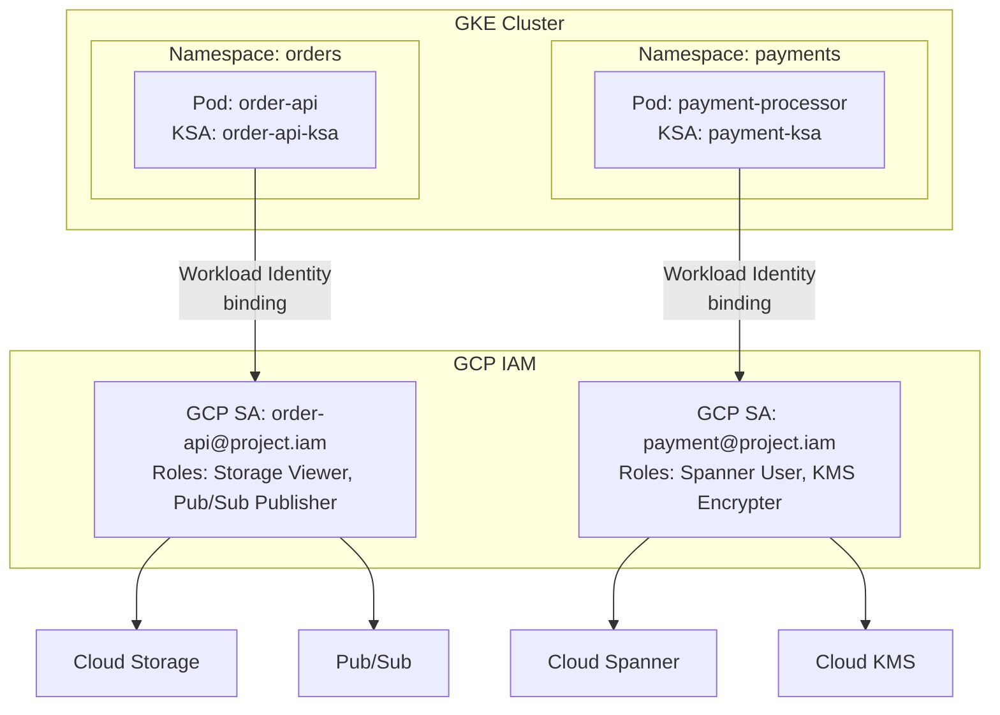
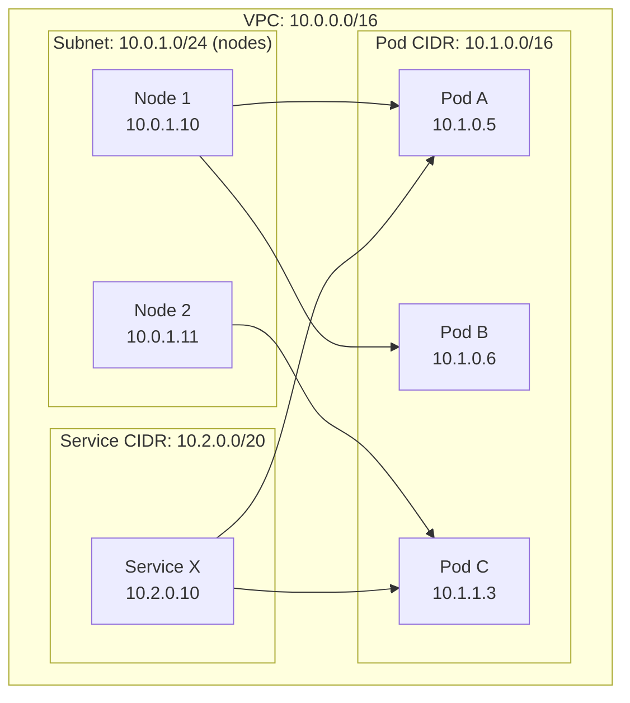
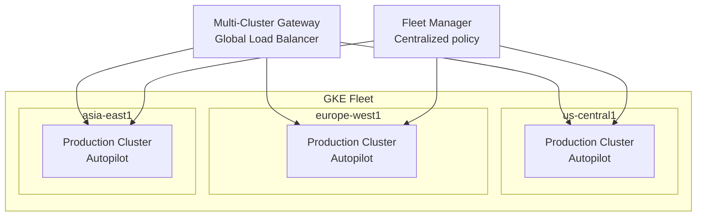

# Google Kubernetes Engine (GKE) Deep Dive

GKE is the most mature managed Kubernetes offering available. Google invented Kubernetes (based on their internal Borg system), and GKE reflects over a decade of running containers at planet scale. GKE manages the control plane, provides integrated networking, auto-upgrades, auto-repair, and integrates deeply with GCP services.

This guide covers GKE from operational modes through production-hardened patterns.

---

## 1. Why GKE Exists: Historical Context

### From Borg to Kubernetes to GKE

Google has run all its workloads in containers since the mid-2000s, orchestrated by **Borg** (an internal cluster management system). In 2014, Google open-sourced a redesigned version as **Kubernetes**. GKE launched the same year as a managed service for running Kubernetes on GCP.



### GKE vs. EKS vs. AKS

| Feature | GKE | EKS | AKS |
|---------|-----|-----|-----|
| Control plane cost | $0 (Autopilot) / $74.40/mo (Standard) | $73/mo | Free |
| Auto-upgrade | Yes (release channels) | Manual (add-on) | Yes |
| Auto-repair | Yes (built-in) | Manual | Yes |
| Workload Identity | Native, seamless | IRSA (complex setup) | Azure AD Pod Identity |
| Networking | VPC-native by default | VPC-CNI or overlay | Azure CNI or kubenet |
| Multi-cluster | Fleet management | None native | Azure Arc |
| Autopilot mode | Yes (node-less) | Fargate profiles | Virtual Nodes |
| GPU support | Excellent (TPUs too) | Good | Good |
| Maturity | Most mature | Growing | Growing |

---

## 2. Standard vs. Autopilot

### The Fundamental Difference

| Aspect | GKE Standard | GKE Autopilot |
|--------|-------------|---------------|
| Node management | You manage node pools | Google manages nodes |
| Pricing | Pay for nodes (VMs) | Pay for pods (CPU/memory/ephemeral storage) |
| Control plane | $74.40/month | Free |
| Minimum cost | ~$74.40/mo + node cost | Pod cost only |
| Node configuration | Full control (machine type, OS, etc.) | Google chooses |
| DaemonSets | Yes | Limited (GKE-managed only) |
| Privileged pods | Yes | No |
| Host access | Yes (SSH to nodes) | No |
| SLA | 99.5% (zonal) / 99.95% (regional) | 99.9% (regional only) |
| Best for | Complex workloads needing fine control | Most production workloads |

### Decision Framework



::: tip
**Default to Autopilot** unless you have a specific reason to use Standard. Autopilot handles node provisioning, scaling, security hardening, and OS patching. It also enforces security best practices (no privileged containers, no host networking, resource requests required on all pods).
:::

---

## 3. Cluster Configuration

### Autopilot Cluster (Terraform)

```hcl
resource "google_container_cluster" "autopilot" {
  name     = "production-autopilot"
  location = "us-central1" # Regional cluster (recommended)
  project  = var.project_id

  # Enable Autopilot
  enable_autopilot = true

  # Network configuration
  network    = google_compute_network.main.id
  subnetwork = google_compute_subnetwork.gke.id

  ip_allocation_policy {
    cluster_secondary_range_name  = "pods"
    services_secondary_range_name = "services"
  }

  # Private cluster (no public IPs on nodes)
  private_cluster_config {
    enable_private_nodes    = true
    enable_private_endpoint = false # Allow kubectl from outside
    master_ipv4_cidr_block  = "172.16.0.0/28"
  }

  # Master authorized networks
  master_authorized_networks_config {
    cidr_blocks {
      cidr_block   = var.admin_cidr
      display_name = "Admin access"
    }
  }

  # Release channel
  release_channel {
    channel = "REGULAR" # RAPID, REGULAR, or STABLE
  }

  # Workload Identity
  workload_identity_config {
    workload_pool = "${var.project_id}.svc.id.goog"
  }

  # Binary Authorization
  binary_authorization {
    evaluation_mode = "PROJECT_SINGLETON_POLICY_ENFORCE"
  }

  # Logging and monitoring
  logging_config {
    enable_components = ["SYSTEM_COMPONENTS", "WORKLOADS"]
  }

  monitoring_config {
    enable_components = ["SYSTEM_COMPONENTS", "DEPLOYMENT", "HPA", "POD", "DAEMONSET", "STATEFULSET"]
    managed_prometheus {
      enabled = true
    }
  }

  # Maintenance window
  maintenance_policy {
    recurring_window {
      start_time = "2024-01-01T04:00:00Z"
      end_time   = "2024-01-01T08:00:00Z"
      recurrence = "FREQ=WEEKLY;BYDAY=SA,SU"
    }
  }
}
```

### Standard Cluster with Node Pools

```hcl
resource "google_container_cluster" "standard" {
  name     = "production-standard"
  location = "us-central1"
  project  = var.project_id

  # Remove default node pool and manage separately
  remove_default_node_pool = true
  initial_node_count       = 1

  network    = google_compute_network.main.id
  subnetwork = google_compute_subnetwork.gke.id

  ip_allocation_policy {
    cluster_secondary_range_name  = "pods"
    services_secondary_range_name = "services"
  }

  private_cluster_config {
    enable_private_nodes    = true
    enable_private_endpoint = false
    master_ipv4_cidr_block  = "172.16.0.0/28"
  }

  workload_identity_config {
    workload_pool = "${var.project_id}.svc.id.goog"
  }

  release_channel {
    channel = "REGULAR"
  }

  # Enable Dataplane V2 (eBPF-based networking)
  datapath_provider = "ADVANCED_DATAPATH"

  # Security
  enable_shielded_nodes = true

  # Network policy
  network_policy {
    enabled  = true
    provider = "CALICO"
  }
}

# General-purpose node pool
resource "google_container_node_pool" "general" {
  name     = "general"
  cluster  = google_container_cluster.standard.id
  location = "us-central1"

  initial_node_count = 2

  autoscaling {
    min_node_count  = 2
    max_node_count  = 10
    location_policy = "BALANCED"
  }

  management {
    auto_repair  = true
    auto_upgrade = true
  }

  node_config {
    machine_type = "e2-standard-4" # 4 vCPU, 16GB RAM
    disk_size_gb = 100
    disk_type    = "pd-ssd"

    # Use Containerd runtime
    image_type = "COS_CONTAINERD"

    # Workload Identity
    workload_metadata_config {
      mode = "GKE_METADATA"
    }

    # Security
    shielded_instance_config {
      enable_secure_boot          = true
      enable_integrity_monitoring = true
    }

    # Labels and taints
    labels = {
      pool = "general"
    }

    oauth_scopes = [
      "https://www.googleapis.com/auth/cloud-platform",
    ]
  }

  upgrade_settings {
    max_surge       = 1
    max_unavailable = 0
    strategy        = "SURGE"
  }
}

# Spot node pool for batch workloads
resource "google_container_node_pool" "spot" {
  name     = "spot-batch"
  cluster  = google_container_cluster.standard.id
  location = "us-central1"

  initial_node_count = 0

  autoscaling {
    min_node_count = 0
    max_node_count = 20
  }

  node_config {
    machine_type = "e2-standard-8"
    spot         = true

    labels = {
      pool = "spot-batch"
    }

    taint {
      key    = "cloud.google.com/gke-spot"
      value  = "true"
      effect = "NO_SCHEDULE"
    }

    workload_metadata_config {
      mode = "GKE_METADATA"
    }
  }
}
```

---

## 4. Workload Identity

### The Problem It Solves

Before Workload Identity, GKE workloads accessed GCP APIs using:
1. **Node service account** — Every pod on the node had the node's permissions (too broad)
2. **Service account JSON keys** — Mounted as Kubernetes secrets (key management nightmare)

Workload Identity maps a **Kubernetes Service Account** to a **GCP Service Account**, providing per-pod identity without managing keys.



### Terraform Configuration

```hcl
# GCP Service Account
resource "google_service_account" "order_api" {
  account_id   = "order-api"
  display_name = "Order API Service Account"
  project      = var.project_id
}

# Grant specific permissions
resource "google_project_iam_member" "order_api_storage" {
  project = var.project_id
  role    = "roles/storage.objectViewer"
  member  = "serviceAccount:${google_service_account.order_api.email}"
}

resource "google_project_iam_member" "order_api_pubsub" {
  project = var.project_id
  role    = "roles/pubsub.publisher"
  member  = "serviceAccount:${google_service_account.order_api.email}"
}

# Workload Identity binding
resource "google_service_account_iam_member" "order_api_wi" {
  service_account_id = google_service_account.order_api.name
  role               = "roles/iam.workloadIdentityUser"
  member             = "serviceAccount:${var.project_id}.svc.id.goog[orders/order-api-ksa]"
}

# Kubernetes Service Account
resource "kubernetes_service_account" "order_api" {
  metadata {
    name      = "order-api-ksa"
    namespace = "orders"
    annotations = {
      "iam.gke.io/gcp-service-account" = google_service_account.order_api.email
    }
  }
}
```

### Using Workload Identity in Deployments

```yaml
# k8s/deployment.yaml
apiVersion: apps/v1
kind: Deployment
metadata:
  name: order-api
  namespace: orders
spec:
  replicas: 3
  selector:
    matchLabels:
      app: order-api
  template:
    metadata:
      labels:
        app: order-api
    spec:
      serviceAccountName: order-api-ksa  # Workload Identity
      nodeSelector:
        iam.gke.io/gke-metadata-server-enabled: "true"
      containers:
        - name: order-api
          image: gcr.io/my-project/order-api:v1.0.0
          ports:
            - containerPort: 8080
          resources:
            requests:
              cpu: "500m"
              memory: "512Mi"
            limits:
              cpu: "1000m"
              memory: "1Gi"
          env:
            - name: GOOGLE_CLOUD_PROJECT
              value: "my-project"
          livenessProbe:
            httpGet:
              path: /health
              port: 8080
            initialDelaySeconds: 10
            periodSeconds: 10
          readinessProbe:
            httpGet:
              path: /ready
              port: 8080
            initialDelaySeconds: 5
            periodSeconds: 5
```

::: warning
Workload Identity requires the GKE metadata server on nodes. If you use `nodeSelector: iam.gke.io/gke-metadata-server-enabled: "true"`, pods will only schedule on nodes with the metadata server. Autopilot clusters have this enabled by default.
:::

---

## 5. Networking

### VPC-Native Clusters

GKE uses **VPC-native** (alias IP) clusters by default. Each pod gets an IP from a secondary CIDR range, making pods directly routable within the VPC.



### IP Address Planning

| Component | CIDR | Required Size | Notes |
|-----------|------|--------------|-------|
| Node subnet | /24 | 251 nodes max | One IP per node |
| Pod secondary range | /16 | 65,536 pod IPs | ~110 pods per node default |
| Service secondary range | /20 | 4,096 service IPs | Rarely exhausted |

$$\text{Max Pods} = \text{Nodes} \times \text{Max Pods Per Node} = 251 \times 110 = 27{,}610$$

### GKE Ingress and Gateway API

```yaml
# Gateway API (recommended over Ingress)
apiVersion: gateway.networking.k8s.io/v1
kind: Gateway
metadata:
  name: external-gateway
  namespace: gateway-infra
spec:
  gatewayClassName: gke-l7-global-external-managed
  listeners:
    - name: https
      protocol: HTTPS
      port: 443
      tls:
        mode: Terminate
        certificateRefs:
          - name: api-cert
            namespace: gateway-infra
---
apiVersion: gateway.networking.k8s.io/v1
kind: HTTPRoute
metadata:
  name: order-api-route
  namespace: orders
spec:
  parentRefs:
    - name: external-gateway
      namespace: gateway-infra
  hostnames:
    - "api.example.com"
  rules:
    - matches:
        - path:
            type: PathPrefix
            value: /api/orders
      backendRefs:
        - name: order-api
          port: 8080
    - matches:
        - path:
            type: PathPrefix
            value: /api/users
      backendRefs:
        - name: user-api
          port: 8080
```

---

## 6. Security Best Practices

### Security Hardening Checklist

| Category | Practice | Autopilot | Standard |
|----------|---------|-----------|----------|
| Network | Private cluster | Default | Must configure |
| Network | Authorized networks | Must configure | Must configure |
| Network | Network policies | Enforced | Must enable |
| Identity | Workload Identity | Default | Must enable |
| Identity | No node SA overscoping | Enforced | Must configure |
| Runtime | Shielded nodes | Default | Must enable |
| Runtime | No privileged containers | Enforced | Must enforce via policy |
| Runtime | Binary Authorization | Available | Available |
| Supply chain | Image signing | Available | Available |
| Secrets | External secrets (Secret Manager) | Recommended | Recommended |

### Pod Security Standards

```yaml
# Enforce restricted pod security in namespace
apiVersion: v1
kind: Namespace
metadata:
  name: production
  labels:
    pod-security.kubernetes.io/enforce: restricted
    pod-security.kubernetes.io/warn: restricted
    pod-security.kubernetes.io/audit: restricted
```

### Network Policy Example

```yaml
# Only allow order-api to talk to order-db and pub/sub
apiVersion: networking.k8s.io/v1
kind: NetworkPolicy
metadata:
  name: order-api-policy
  namespace: orders
spec:
  podSelector:
    matchLabels:
      app: order-api
  policyTypes:
    - Ingress
    - Egress
  ingress:
    - from:
        - namespaceSelector:
            matchLabels:
              name: gateway-infra
      ports:
        - protocol: TCP
          port: 8080
  egress:
    # Allow DNS
    - to: []
      ports:
        - protocol: UDP
          port: 53
        - protocol: TCP
          port: 53
    # Allow Cloud SQL
    - to:
        - ipBlock:
            cidr: 10.0.10.0/24
      ports:
        - protocol: TCP
          port: 5432
    # Allow Google APIs (for Pub/Sub, etc.)
    - to:
        - ipBlock:
            cidr: 199.36.153.4/30  # private.googleapis.com
      ports:
        - protocol: TCP
          port: 443
```

---

## 7. Cost Optimization

### GKE Standard Cost Components

| Component | Cost | Notes |
|-----------|------|-------|
| Control plane | $74.40/month (zonal) / $74.40/month (regional) | Free for Autopilot |
| Nodes | Compute Engine pricing | Sustained use discounts apply |
| Persistent disks | Standard PD or SSD PD | Per-GB pricing |
| Network egress | Standard GCP pricing | Cross-zone is $0.01/GB |
| Load balancers | $0.025/hour + rules | Per forwarding rule |

### GKE Autopilot Cost

Autopilot charges per pod resources:

| Resource | Cost per second | Equivalent hourly |
|----------|----------------|-------------------|
| vCPU | $0.0000340 | $0.1224 |
| Memory (GiB) | $0.0000037 | $0.01332 |
| Ephemeral storage (GiB) | $0.0000054 | $0.01944 |

### Cost Comparison Example

For a workload needing 8 vCPU and 32GB memory:

**Standard (e2-standard-8 nodes):**
$$\text{Node cost} = \$0.268/\text{hr} \times 730\text{hr} = \$195.64 + \$74.40\text{ control plane} = \$270.04$$

**Autopilot:**
$$\text{Pod cost} = (8 \times \$0.1224 + 32 \times \$0.01332) \times 730 = \$1{,}025.79$$

Autopilot is more expensive for steady workloads. But:
- With Spot pods in Autopilot: up to 91% discount
- No wasted capacity (you only pay for what pods request)
- No node management overhead

::: tip
Use Autopilot with CUDs (Committed Use Discounts) for the best Autopilot pricing. CUDs apply to Autopilot pod resources, providing up to 57% discount on 3-year commitments.
:::

---

## 8. Production Patterns

### Multi-Cluster Architecture



### Horizontal Pod Autoscaler with Custom Metrics

```yaml
apiVersion: autoscaling/v2
kind: HorizontalPodAutoscaler
metadata:
  name: order-api-hpa
  namespace: orders
spec:
  scaleTargetRef:
    apiVersion: apps/v1
    kind: Deployment
    name: order-api
  minReplicas: 3
  maxReplicas: 50
  metrics:
    - type: Resource
      resource:
        name: cpu
        target:
          type: Utilization
          averageUtilization: 70
    - type: Pods
      pods:
        metric:
          name: http_requests_per_second
        target:
          type: AverageValue
          averageValue: "100"
  behavior:
    scaleUp:
      stabilizationWindowSeconds: 60
      policies:
        - type: Pods
          value: 5
          periodSeconds: 60
    scaleDown:
      stabilizationWindowSeconds: 300
      policies:
        - type: Percent
          value: 10
          periodSeconds: 60
```

::: info War Story
A gaming company ran their matchmaking service on GKE Standard with 3 node pools across 3 zones. During a product launch, their cluster autoscaler couldn't scale fast enough — new nodes took 2-3 minutes to provision, and pods waited in Pending state. Players got matchmaking errors.

They switched to Autopilot with pre-provisioned spare capacity (using low-priority balloon pods that get evicted when real workloads need resources). Cold start for new pods went from 2-3 minutes to 10-15 seconds because Autopilot maintained warm node capacity.
:::

---

## 9. Monitoring and Observability

### GKE Dashboard Metrics

| Metric | Warning Threshold | Critical Threshold |
|--------|------------------|-------------------|
| Node CPU utilization | > 70% | > 85% |
| Node memory utilization | > 75% | > 90% |
| Pod restart count | > 3 in 5 min | > 10 in 5 min |
| Pending pods | > 0 for 2 min | > 0 for 5 min |
| PVC utilization | > 75% | > 90% |
| API server latency (P99) | > 1s | > 5s |

### Managed Prometheus

```yaml
# PodMonitoring for managed Prometheus
apiVersion: monitoring.googleapis.com/v1
kind: PodMonitoring
metadata:
  name: order-api-monitoring
  namespace: orders
spec:
  selector:
    matchLabels:
      app: order-api
  endpoints:
    - port: metrics
      interval: 30s
      path: /metrics
```

---

## 10. Decision Framework

### When to Choose GKE Over Cloud Run

| Scenario | GKE | Cloud Run |
|----------|-----|-----------|
| Stateful workloads (databases, caches) | Yes | No |
| Complex networking (service mesh, mTLS) | Yes | Limited |
| GPU/TPU workloads | Yes | No |
| Custom scheduling needs | Yes | No |
| WebSocket/gRPC streaming | Yes | Limited |
| Existing Kubernetes expertise | Yes | Simpler alternative |
| Need DaemonSets or init containers | Yes | No |
| Sub-second cold starts critical | Yes (always-running) | No (cold start) |

---

## See Also

- [GCP Overview](./index.md) — GCP fundamentals
- [Cloud Run](./cloud-run.md) — Simpler alternative for stateless services
- [Cloud SQL](./cloud-sql.md) — Database connectivity from GKE
- [IAM](./iam.md) — Workload Identity and service accounts
- [Cost Optimization](./cost-optimization.md) — GKE cost strategies
- [Kubernetes Architecture](/infrastructure/kubernetes/architecture-internals.md) — K8s internals
