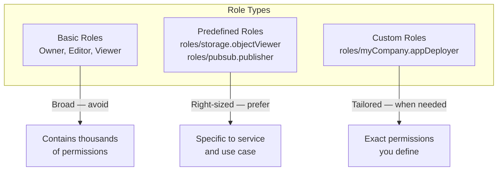
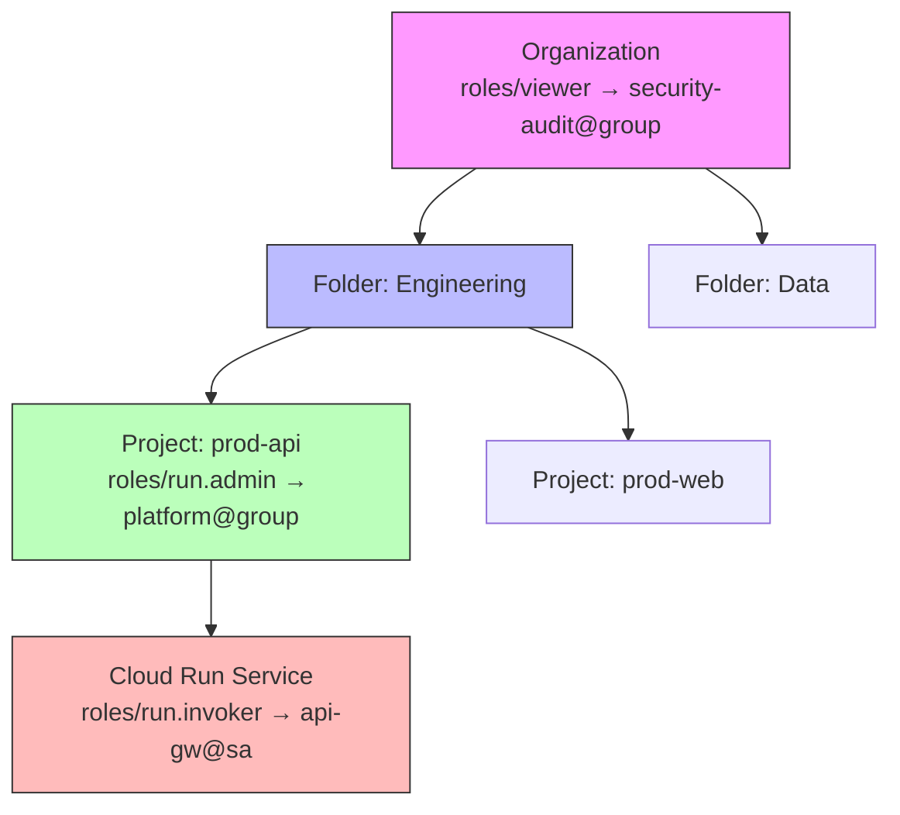
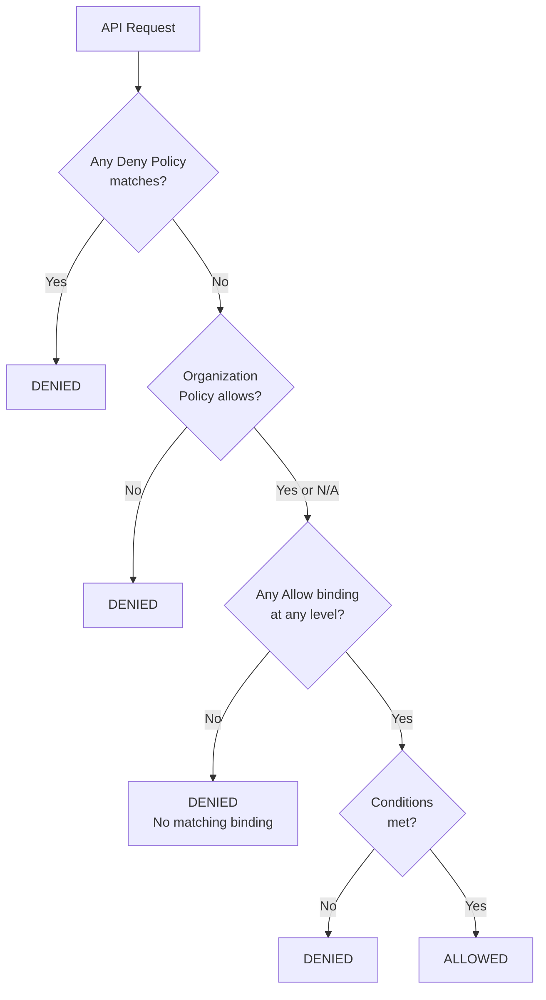
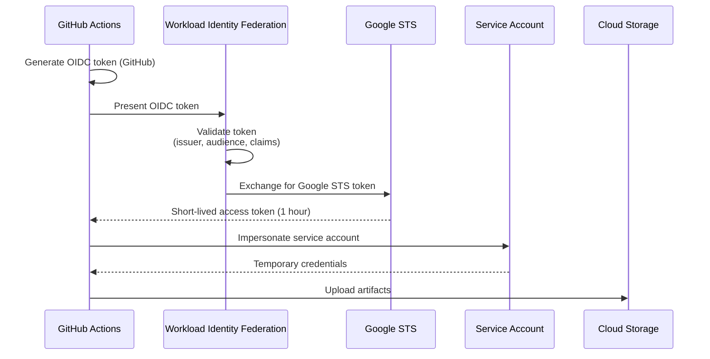
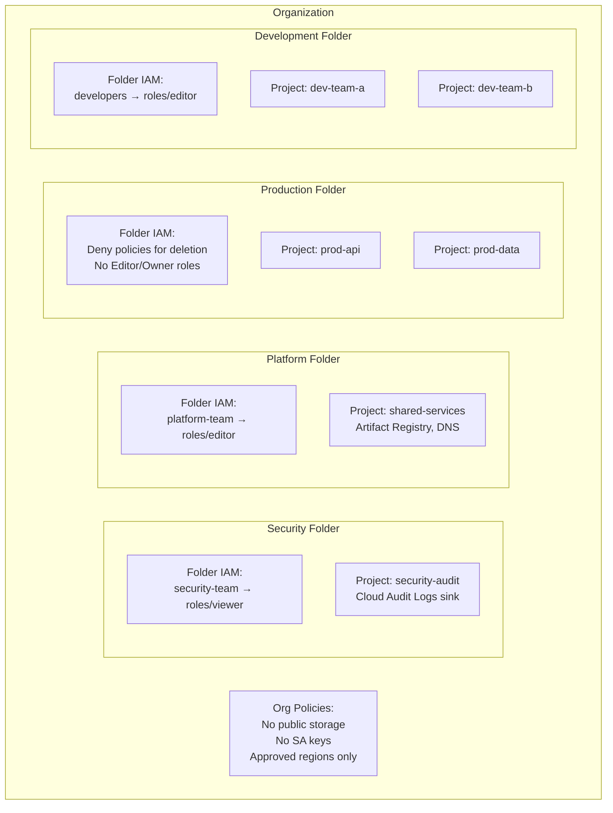

# GCP IAM Deep Dive

GCP IAM controls who (identity) has what access (role) to which resource. Unlike AWS IAM where policies are JSON documents attached to identities, GCP IAM uses a **binding model** — you bind an identity to a role on a resource. This difference in mental model is the source of most confusion for engineers moving from AWS to GCP.

This guide covers GCP IAM from the evaluation model through production patterns for multi-project organizations.

---

## 1. Why GCP IAM Exists: The Problem It Solves

GCP IAM solves the same fundamental problem as AWS IAM: controlling access to cloud resources. But GCP's approach reflects Google's organizational philosophy — a hierarchical model where policies **inherit** down the resource tree.

### GCP IAM vs. AWS IAM

| Feature | GCP IAM | AWS IAM |
|---------|---------|---------|
| Policy model | Bindings (identity + role + resource) | Policy documents (JSON) |
| Inheritance | Policies inherit down hierarchy | No inheritance (except SCPs) |
| Deny policies | Available (added 2022) | Built-in (explicit deny) |
| Service accounts | Identities (can be principals) | Roles (assumed by principals) |
| Cross-account | Workload Identity Federation | AssumeRole + trust policies |
| Groups | Google Groups (external to IAM) | IAM Groups (built into IAM) |
| Organization guardrails | Organization Policies | Service Control Policies |
| Conditional access | IAM Conditions | IAM Conditions |
| Maximum policies per resource | 1 IAM policy (with multiple bindings) | Multiple policies per identity |

---

## 2. First Principles: The IAM Model

### The Binding Model

Every IAM permission in GCP is expressed as a **binding**:

$$\text{Binding} = (\text{Member}, \text{Role}, \text{Resource})$$

- **Member**: Who is getting access (user, service account, group)
- **Role**: What permissions they get (a collection of permissions)
- **Resource**: What they can access (project, bucket, topic, etc.)

```mermaid
graph LR
    MEMBER[Member<br/>user:alice@company.com] --> |bound to| ROLE[Role<br/>roles/storage.objectViewer]
    ROLE --> |on| RESOURCE[Resource<br/>gs://my-bucket]
```

### The IAM Policy

Each resource has exactly one **IAM Policy**, which contains multiple bindings:

```json
{
  "bindings": [
    {
      "role": "roles/storage.objectViewer",
      "members": [
        "user:alice@company.com",
        "serviceAccount:api@project.iam.gserviceaccount.com"
      ]
    },
    {
      "role": "roles/storage.objectCreator",
      "members": [
        "serviceAccount:api@project.iam.gserviceaccount.com"
      ]
    },
    {
      "role": "roles/storage.admin",
      "members": [
        "group:platform-team@company.com"
      ],
      "condition": {
        "title": "Only in dev environment",
        "expression": "resource.name.startsWith('projects/_/buckets/dev-')"
      }
    }
  ]
}
```

### Member Types

| Member Type | Syntax | When to Use |
|------------|--------|-------------|
| Google Account | `user:alice@company.com` | Individual human access (avoid in production) |
| Service Account | `serviceAccount:name@project.iam.gserviceaccount.com` | Application/service identity |
| Google Group | `group:team@company.com` | Team-based access (recommended for humans) |
| Google Workspace Domain | `domain:company.com` | All users in organization (broad) |
| allUsers | `allUsers` | Anyone on the internet (public) |
| allAuthenticatedUsers | `allAuthenticatedUsers` | Any Google account (still broad) |
| Workload Identity | `principal://iam.googleapis.com/...` | External workloads (AWS, Azure, GitHub) |
| Workforce Identity | `principalSet://...` | External IdP users |

::: danger
Never use `allUsers` or `allAuthenticatedUsers` unless you intentionally want public access (e.g., a public website bucket). These are the most common source of GCP data breaches.
:::

---

## 3. Role Types

### Role Hierarchy



### Basic Roles (AVOID in Production)

| Role | Permissions | Why Avoid |
|------|------------|-----------|
| `roles/viewer` | Read-only to almost all resources | Too broad — includes secrets, configs |
| `roles/editor` | Read-write to almost all resources | Can modify infrastructure, deploy code |
| `roles/owner` | Full control + IAM management | Can grant others access, delete everything |

### Predefined Roles (PREFER)

GCP provides 1,000+ predefined roles, each scoped to a specific service and access level:

| Pattern | Example | Permissions |
|---------|---------|------------|
| `roles/SERVICE.viewer` | `roles/storage.objectViewer` | Read-only access to objects |
| `roles/SERVICE.creator` | `roles/storage.objectCreator` | Create (but not read/delete) |
| `roles/SERVICE.admin` | `roles/storage.admin` | Full control of storage |
| `roles/SERVICE.user` | `roles/cloudsql.client` | Connect and use |

### Custom Roles

```hcl
resource "google_project_iam_custom_role" "app_deployer" {
  role_id     = "appDeployer"
  title       = "Application Deployer"
  description = "Can deploy Cloud Run services and update traffic"
  project     = var.project_id

  permissions = [
    "run.services.get",
    "run.services.list",
    "run.services.update",
    "run.revisions.get",
    "run.revisions.list",
    "run.routes.get",
    "run.routes.list",
    "run.operations.get",
    "iam.serviceAccounts.actAs",
  ]
}
```

---

## 4. Policy Inheritance

### How Inheritance Works

IAM policies **inherit down** the resource hierarchy. A binding set at the organization level applies to all folders, projects, and resources within.



**Effective permissions at Cloud Run Service:**
- `roles/viewer` for `security-audit@group` (inherited from org)
- `roles/run.admin` for `platform@group` (inherited from project)
- `roles/run.invoker` for `api-gw@sa` (set on resource)

### The Inheritance Formula

$$\text{Effective Permissions}(identity, resource) = \bigcup_{r \in \text{ancestors}(resource)} \text{Bindings}(identity, r)$$

Where $\text{ancestors}(resource)$ includes the resource itself, its project, folders, and organization.

### Deny Policies (Override Inheritance)

Since IAM policies only grant access (and inheritance adds more), you need **Deny Policies** to restrict inherited permissions:

```json
{
  "displayName": "Deny production deletion",
  "rules": [
    {
      "denyRule": {
        "deniedPrincipals": [
          "principalSet://goog/group/developers@company.com"
        ],
        "exceptionPrincipals": [
          "principalSet://goog/group/platform-leads@company.com"
        ],
        "deniedPermissions": [
          "compute.instances.delete",
          "run.services.delete",
          "sqladmin.instances.delete",
          "container.clusters.delete"
        ],
        "denialCondition": {
          "title": "Production resources only",
          "expression": "resource.matchTag('env', 'production')"
        }
      }
    }
  ]
}
```

### Policy Evaluation Order



$$\text{Decision} = \begin{cases} \text{Deny} & \text{if any deny policy matches} \\ \text{Deny} & \text{if org policy blocks} \\ \text{Allow} & \text{if any binding grants permission (with conditions met)} \\ \text{Deny} & \text{otherwise (implicit deny)} \end{cases}$$

---

## 5. Service Accounts

### What Service Accounts Are

In GCP, a service account is both an **identity** (it can authenticate) and a **resource** (it has its own IAM policy controlling who can use it). This dual nature is unique to GCP.

```mermaid
graph TB
    subgraph "Service Account as Identity"
        SA[my-api@project.iam.gserviceaccount.com]
        SA --> |Has permissions| GCS[Cloud Storage]
        SA --> |Has permissions| PUB[Pub/Sub]
    end

    subgraph "Service Account as Resource"
        SA --> |Controlled by| BINDING[IAM Binding:<br/>roles/iam.serviceAccountUser<br/>→ developer@company.com]
    end
```

### Service Account Types

| Type | Created By | Use Case |
|------|-----------|----------|
| User-managed | You | Application identity |
| Default | GCP (per-service) | Avoid in production |
| Google-managed | GCP internally | Internal service operations |

::: warning
**Never use default service accounts in production.** Default compute and App Engine service accounts have the `Editor` basic role — far too broad. Create dedicated service accounts with minimal permissions for each application.
:::

### Service Account Best Practices

```hcl
# One service account per application/microservice
resource "google_service_account" "order_api" {
  account_id   = "order-api"
  display_name = "Order API Service Account"
  description  = "Service account for the order API Cloud Run service"
  project      = var.project_id
}

# Grant only the permissions this service needs
resource "google_project_iam_member" "order_api_pubsub" {
  project = var.project_id
  role    = "roles/pubsub.publisher"
  member  = "serviceAccount:${google_service_account.order_api.email}"

  condition {
    title       = "Only order topics"
    description = "Restrict publishing to order-related topics"
    expression  = "resource.name.startsWith('projects/${var.project_id}/topics/order-')"
  }
}

resource "google_project_iam_member" "order_api_cloudsql" {
  project = var.project_id
  role    = "roles/cloudsql.client"
  member  = "serviceAccount:${google_service_account.order_api.email}"
}

resource "google_storage_bucket_iam_member" "order_api_uploads" {
  bucket = google_storage_bucket.uploads.name
  role   = "roles/storage.objectCreator"
  member = "serviceAccount:${google_service_account.order_api.email}"
}
```

### Service Account Key Management

| Authentication Method | Security | When to Use |
|----------------------|----------|-------------|
| Workload Identity (GKE) | Best | GKE pods |
| Built-in SA (Cloud Run/Functions) | Good | Serverless services |
| Metadata server (Compute Engine) | Good | VMs |
| Workload Identity Federation | Good | External workloads (AWS, GitHub) |
| Service account keys (JSON) | **Worst** | Avoid — use only when no alternative |

::: danger
Service account keys are long-lived credentials that, if leaked, provide full access to the service account's permissions. They do not expire automatically (10-year validity), cannot be scoped, and are the number one cause of GCP security breaches. Use Workload Identity Federation instead.
:::

---

## 6. Workload Identity Federation

### The Problem It Solves

External workloads (GitHub Actions, AWS services, on-premises servers) need GCP credentials. Before Workload Identity Federation, the only option was service account keys — static credentials stored in CI/CD secrets, environment variables, or configuration files.

### How It Works



### GitHub Actions Configuration

```hcl
# Workload Identity Pool
resource "google_iam_workload_identity_pool" "github" {
  workload_identity_pool_id = "github-pool"
  display_name              = "GitHub Actions Pool"
  description               = "Identity pool for GitHub Actions CI/CD"
  project                   = var.project_id
}

# Workload Identity Provider
resource "google_iam_workload_identity_pool_provider" "github" {
  workload_identity_pool_id          = google_iam_workload_identity_pool.github.workload_identity_pool_id
  workload_identity_pool_provider_id = "github-provider"
  display_name                       = "GitHub Actions Provider"
  project                            = var.project_id

  attribute_mapping = {
    "google.subject"       = "assertion.sub"
    "attribute.actor"      = "assertion.actor"
    "attribute.repository" = "assertion.repository"
    "attribute.ref"        = "assertion.ref"
  }

  attribute_condition = "assertion.repository_owner == '${var.github_org}'"

  oidc {
    issuer_uri = "https://token.actions.githubusercontent.com"
  }
}

# Allow the GitHub repo to impersonate the service account
resource "google_service_account_iam_member" "github_deployer" {
  service_account_id = google_service_account.deployer.name
  role               = "roles/iam.workloadIdentityUser"
  member             = "principalSet://iam.googleapis.com/${google_iam_workload_identity_pool.github.name}/attribute.repository/${var.github_org}/${var.github_repo}"
}
```

```yaml
# .github/workflows/deploy.yaml
name: Deploy to GCP
on:
  push:
    branches: [main]

permissions:
  contents: read
  id-token: write  # Required for OIDC

jobs:
  deploy:
    runs-on: ubuntu-latest
    steps:
      - uses: actions/checkout@v4

      - id: auth
        uses: google-github-actions/auth@v2
        with:
          workload_identity_provider: 'projects/123456/locations/global/workloadIdentityPools/github-pool/providers/github-provider'
          service_account: 'deployer@my-project.iam.gserviceaccount.com'

      - uses: google-github-actions/setup-gcloud@v2

      - name: Deploy to Cloud Run
        run: |
          gcloud run deploy api-service \
            --image gcr.io/my-project/api:${{ github.sha }} \
            --region us-central1
```

### AWS-to-GCP Federation

```hcl
# Allow AWS workloads to access GCP resources
resource "google_iam_workload_identity_pool" "aws" {
  workload_identity_pool_id = "aws-pool"
  display_name              = "AWS Workload Pool"
  project                   = var.project_id
}

resource "google_iam_workload_identity_pool_provider" "aws" {
  workload_identity_pool_id          = google_iam_workload_identity_pool.aws.workload_identity_pool_id
  workload_identity_pool_provider_id = "aws-provider"
  project                            = var.project_id

  aws {
    account_id = var.aws_account_id
  }

  attribute_mapping = {
    "google.subject"        = "assertion.arn"
    "attribute.aws_role"    = "assertion.arn.extract('assumed-role/{role}/')"
    "attribute.account"     = "assertion.account"
  }

  attribute_condition = "attribute.aws_role == '${var.aws_role_name}'"
}
```

---

## 7. Organization Policies

### What They Are

Organization Policies are constraints enforced on the resource hierarchy — they restrict what configurations are allowed, regardless of IAM permissions. Think of them as GCP's equivalent to AWS Service Control Policies (SCPs).

```hcl
# Restrict VM creation to approved regions
resource "google_org_policy_policy" "restrict_regions" {
  name   = "organizations/${var.org_id}/policies/gcp.resourceLocations"
  parent = "organizations/${var.org_id}"

  spec {
    rules {
      values {
        allowed_values = [
          "in:us-locations",
          "in:eu-locations",
        ]
      }
    }
  }
}

# Disable service account key creation
resource "google_org_policy_policy" "disable_sa_keys" {
  name   = "organizations/${var.org_id}/policies/iam.disableServiceAccountKeyCreation"
  parent = "organizations/${var.org_id}"

  spec {
    rules {
      enforce = "TRUE"
    }
  }
}

# Require OS Login for SSH
resource "google_org_policy_policy" "require_os_login" {
  name   = "organizations/${var.org_id}/policies/compute.requireOsLogin"
  parent = "organizations/${var.org_id}"

  spec {
    rules {
      enforce = "TRUE"
    }
  }
}

# Restrict public access to Cloud Storage
resource "google_org_policy_policy" "no_public_access" {
  name   = "organizations/${var.org_id}/policies/storage.publicAccessPrevention"
  parent = "organizations/${var.org_id}"

  spec {
    rules {
      enforce = "TRUE"
    }
  }
}
```

### Essential Organization Policies

| Policy | Effect | Why |
|--------|--------|-----|
| `gcp.resourceLocations` | Restrict resource creation regions | Data residency, latency |
| `iam.disableServiceAccountKeyCreation` | Prevent SA key creation | Force Workload Identity |
| `compute.requireOsLogin` | Require OS Login for SSH | Audit trail for SSH |
| `storage.publicAccessPrevention` | Block public bucket access | Prevent data leaks |
| `compute.vmExternalIpAccess` | Control external IP assignment | Network security |
| `iam.allowedPolicyMemberDomains` | Restrict who can be granted access | Prevent external access |
| `compute.requireShieldedVm` | Require Shielded VMs | Boot integrity |

---

## 8. IAM Conditions

### Conditional Bindings

IAM Conditions use CEL (Common Expression Language) to add context-based access control:

```hcl
# Time-based access (business hours only)
resource "google_project_iam_member" "dev_access" {
  project = var.project_id
  role    = "roles/container.developer"
  member  = "group:developers@company.com"

  condition {
    title       = "Business hours only"
    description = "Access only during business hours UTC"
    expression  = "request.time.getHours('UTC') >= 9 && request.time.getHours('UTC') < 17"
  }
}

# Resource-name-based access
resource "google_project_iam_member" "dev_storage" {
  project = var.project_id
  role    = "roles/storage.objectAdmin"
  member  = "group:developers@company.com"

  condition {
    title      = "Dev buckets only"
    expression = "resource.name.startsWith('projects/_/buckets/dev-')"
  }
}

# Temporary access (expiring)
resource "google_project_iam_member" "contractor_access" {
  project = var.project_id
  role    = "roles/viewer"
  member  = "user:contractor@external.com"

  condition {
    title      = "Temporary access"
    expression = "request.time < timestamp('2026-06-01T00:00:00Z')"
  }
}
```

### Common CEL Expressions

| Use Case | Expression |
|----------|-----------|
| Specific resource name | `resource.name == 'projects/my-project/topics/my-topic'` |
| Resource name prefix | `resource.name.startsWith('projects/_/buckets/dev-')` |
| Resource tag | `resource.matchTag('env', 'development')` |
| Time-based | `request.time.getHours('UTC') >= 9 && request.time.getHours('UTC') < 17` |
| Expiring access | `request.time < timestamp('2026-12-31T00:00:00Z')` |
| IP-based | `request.auth.access_levels.exists(level, level == 'accessPolicies/123/accessLevels/corp_network')` |

---

## 9. Audit and Compliance

### Cloud Audit Logs

GCP automatically logs all IAM-relevant activities:

| Log Type | What It Captures | Cost |
|----------|-----------------|------|
| Admin Activity | IAM policy changes, resource creation/deletion | Free |
| Data Access | Read/write operations on data | Paid (can be expensive) |
| System Event | GCP system actions | Free |
| Policy Denied | Denied API calls | Free |

### IAM Recommender

GCP's IAM Recommender uses ML to analyze actual permission usage and suggest right-sizing:

```typescript
// iam-audit/recommender.ts
import { RecommenderClient } from '@google-cloud/recommender';

async function getIAMRecommendations(projectId: string): Promise<void> {
  const client = new RecommenderClient();

  const [recommendations] = await client.listRecommendations({
    parent: `projects/${projectId}/locations/global/recommenders/google.iam.policy.Recommender`,
  });

  for (const rec of recommendations) {
    console.log('Recommendation:', {
      description: rec.description,
      priority: rec.priority,
      state: rec.stateInfo?.state,
      primaryImpact: rec.primaryImpact,
    });

    // Each recommendation contains the current and suggested role
    for (const group of rec.content?.operationGroups ?? []) {
      for (const op of group.operations ?? []) {
        console.log('  Operation:', {
          action: op.action,
          path: op.path,
          value: op.value,
        });
      }
    }
  }
}
```

### Automated Compliance Checking

```typescript
// iam-audit/compliance.ts
import { CloudResourceManagerClient } from '@google-cloud/resource-manager';

interface ComplianceViolation {
  project: string;
  member: string;
  role: string;
  violation: string;
  severity: 'critical' | 'high' | 'medium' | 'low';
}

async function auditProjectIAM(projectId: string): Promise<ComplianceViolation[]> {
  const client = new CloudResourceManagerClient();
  const violations: ComplianceViolation[] = [];

  const [policy] = await client.getIamPolicy({
    resource: `projects/${projectId}`,
    options: { requestedPolicyVersion: 3 },
  });

  for (const binding of policy.bindings ?? []) {
    const role = binding.role ?? '';

    // Check for basic roles in production
    if (['roles/owner', 'roles/editor', 'roles/viewer'].includes(role)) {
      for (const member of binding.members ?? []) {
        violations.push({
          project: projectId,
          member,
          role,
          violation: `Basic role "${role}" used — replace with predefined role`,
          severity: role === 'roles/owner' ? 'critical' : 'high',
        });
      }
    }

    // Check for allUsers or allAuthenticatedUsers
    for (const member of binding.members ?? []) {
      if (member === 'allUsers' || member === 'allAuthenticatedUsers') {
        violations.push({
          project: projectId,
          member,
          role,
          violation: `Public access granted via ${member}`,
          severity: 'critical',
        });
      }
    }

    // Check for user accounts (should use groups)
    for (const member of binding.members ?? []) {
      if (member.startsWith('user:') && !binding.condition) {
        violations.push({
          project: projectId,
          member,
          role,
          violation: 'Direct user binding — use Google Groups instead',
          severity: 'medium',
        });
      }
    }

    // Check for service account keys
    if (role === 'roles/iam.serviceAccountKeyAdmin') {
      violations.push({
        project: projectId,
        member: (binding.members ?? []).join(', '),
        role,
        violation: 'SA key admin role granted — prefer Workload Identity',
        severity: 'high',
      });
    }
  }

  return violations;
}
```

---

## 10. Production IAM Architecture

### Multi-Project IAM Strategy



### Least Privilege by Role

| Human Role | GCP Roles | Scope |
|-----------|-----------|-------|
| Platform Engineer | `roles/container.admin`, `roles/run.admin`, `roles/cloudsql.admin` | Production projects |
| Application Developer | `roles/container.developer`, `roles/run.developer`, `roles/logging.viewer` | Development projects |
| Data Engineer | `roles/bigquery.dataEditor`, `roles/dataflow.admin` | Data projects |
| Security Auditor | `roles/iam.securityReviewer`, `roles/logging.viewer` | All projects (via org binding) |
| Billing Admin | `roles/billing.admin` | Billing account |
| SRE/On-Call | `roles/monitoring.viewer`, `roles/logging.viewer`, custom escalation role | All projects |

---

## 11. Edge Cases and Failure Modes

| Issue | Cause | Mitigation |
|-------|-------|-----------|
| Inherited permissions too broad | Editor role at folder level | Use predefined roles, deny policies |
| Service account impersonation chain | SA can impersonate another SA | Audit `iam.serviceAccountTokenCreator` |
| Default SA with Editor role | Default compute/App Engine SA | Create dedicated SAs, disable defaults |
| Org policy bypass | Admin overrides at project level | Use org policy inheritance locks |
| Stale permissions | Former employees retain access | Automate offboarding, periodic audits |
| Cross-project access creep | Accumulated bindings over time | IAM Recommender, periodic reviews |

::: info War Story
A company discovered that a contractor who left 6 months earlier still had `roles/editor` on their production project. The contractor's personal Google account was directly bound (not through a group). When they reviewed their IAM bindings, they found 47 direct user bindings across 12 projects — none removable through their HR offboarding process because the process only revoked Google Workspace access, not GCP IAM bindings.

The fix:
1. Migrated all human access to Google Groups
2. HR offboarding now removes users from all Groups (automatic GCP access revocation)
3. Organization policy `iam.allowedPolicyMemberDomains` blocks non-company domains
4. Weekly automated audit flags any direct `user:` bindings in production
:::

---

## 12. Performance Characteristics

| Operation | Latency | Rate Limit |
|-----------|---------|-----------|
| IAM policy evaluation | < 1ms (cached) | N/A |
| GetIamPolicy | 50-200ms | 1 QPS per resource |
| SetIamPolicy | 100-500ms | 1 QPS per resource |
| TestIamPermissions | 50-200ms | 10 QPS per resource |
| SA token generation | 50-100ms | 60,000/min per SA |

---

## See Also

- [GCP Overview](./index.md) — Resource hierarchy
- [GKE](./gke.md) — Workload Identity for GKE pods
- [Cloud Run](./cloud-run.md) — Service accounts for Cloud Run
- [Cloud SQL](./cloud-sql.md) — IAM database authentication
- [Cost Optimization](./cost-optimization.md) — IAM for billing control
