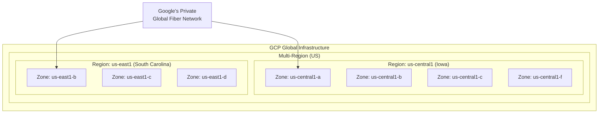
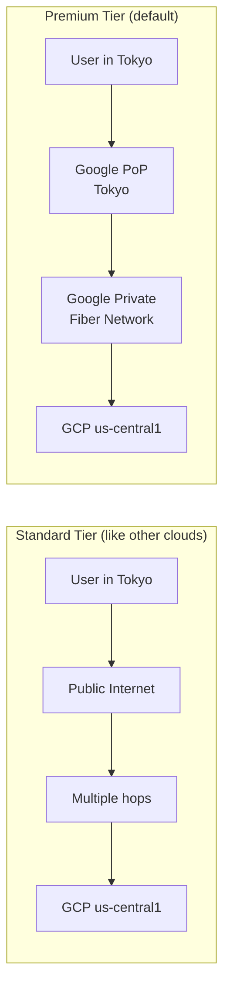
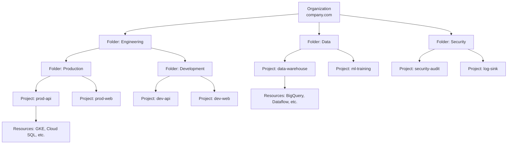
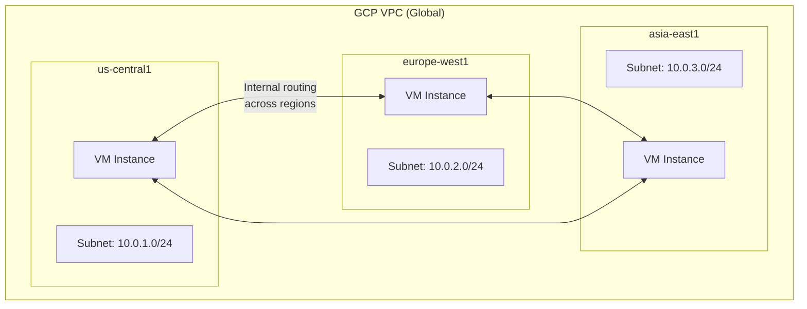
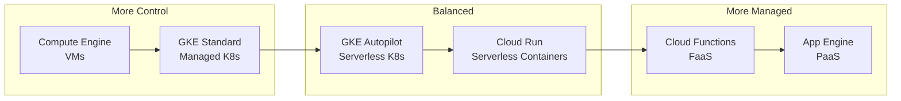

# Google Cloud Platform Overview

Google Cloud Platform (GCP) is Google's public cloud offering, built on the same infrastructure that powers Google Search, YouTube, and Gmail. While AWS leads in market share and Azure in enterprise adoption, GCP differentiates through its networking (Google's private global fiber network), data and analytics services (BigQuery, Dataflow), Kubernetes expertise (Google invented Kubernetes), and machine learning capabilities (TPUs, Vertex AI).

This overview covers GCP's architecture from first principles, how it differs from AWS/Azure, and when to choose it.

---

## 1. Why GCP Exists: Historical Context

### The Origin Story

Google began offering cloud services in 2008 with **App Engine** — a fully managed platform for deploying web applications. Unlike AWS's IaaS-first approach (EC2 launched in 2006), Google started with PaaS. This philosophical difference persists today: GCP tends to offer higher-level abstractions and managed services.

Key milestones:
- **2008**: App Engine (PaaS)
- **2010**: Cloud Storage, BigQuery
- **2012**: Compute Engine (IaaS)
- **2013**: Cloud Datastore, Cloud SQL
- **2014**: Kubernetes open-sourced by Google
- **2015**: Google Kubernetes Engine (GKE), Cloud Pub/Sub
- **2017**: Cloud Spanner, Cloud Functions
- **2019**: Anthos (hybrid/multi-cloud), Cloud Run
- **2021**: Distributed Cloud
- **2023**: Duet AI (now Gemini for Cloud)
- **2024**: Gemini integration across all services

### Why Choose GCP?

| Strength | Detail |
|----------|--------|
| **Networking** | Google's private global network (longest fiber network in the world) |
| **Kubernetes** | GKE is the most mature managed Kubernetes offering |
| **Data/Analytics** | BigQuery, Dataflow, Pub/Sub are best-in-class |
| **ML/AI** | TPUs, Vertex AI, pre-trained models |
| **Pricing** | Per-second billing, sustained use discounts (automatic) |
| **Open source** | Kubernetes, TensorFlow, Istio, Knative — all Google-originated |

---

## 2. GCP Global Infrastructure

### Regions and Zones

GCP infrastructure is organized hierarchically:



As of 2026, GCP operates:
- **40+ regions** across 6 continents
- **120+ zones** (3-4 per region)
- **187+ network edge locations** (PoPs)
- **Private submarine cables** (Curie, Dunant, Equiano, Grace Hopper, Firmina, Umoja, Blue, Raman)

### Regions vs. Multi-Regions

| Concept | Definition | Use Case |
|---------|-----------|----------|
| Zone | Single data center | Individual VM placement |
| Region | 2-4 zones, ~1-2ms latency between zones | Application deployment |
| Multi-Region | Multiple regions in a continent | Data replication (Cloud Storage, Spanner) |
| Dual-Region | Specific pair of regions | Geo-redundant storage |

### Google's Network Advantage

GCP's most significant differentiator is Google's private global network. When traffic enters Google's network at a PoP (Point of Presence), it stays on Google's private fiber until it reaches the destination — it does not traverse the public internet.



| Network Tier | Latency | Cost | How It Works |
|-------------|---------|------|-------------|
| Premium (default) | Lower | Higher | Traffic enters Google's network at nearest PoP |
| Standard | Higher | 25-45% cheaper | Traffic uses public internet to region |

---

## 3. Resource Hierarchy

GCP's resource hierarchy is fundamentally different from AWS. Where AWS uses accounts as the primary isolation boundary, GCP uses a nested **Organization → Folder → Project** hierarchy.



### Projects: The Fundamental Unit

A GCP **Project** is the equivalent of an AWS account. It:
- Contains all resources (VMs, databases, buckets, etc.)
- Has its own billing
- Has its own IAM policies
- Has a globally unique **Project ID** (immutable)
- Has a user-friendly **Project Name** (mutable)
- Has a **Project Number** (auto-generated, numeric)

### Comparison: GCP vs. AWS Hierarchy

| GCP | AWS Equivalent | Purpose |
|-----|---------------|---------|
| Organization | AWS Organization | Root entity |
| Folder | Organizational Unit (OU) | Grouping and policy inheritance |
| Project | AWS Account | Resource container, billing unit |
| Resource | Resource | Individual service instance |

### Terraform Setup

```hcl
# GCP resource hierarchy with Terraform
resource "google_folder" "engineering" {
  display_name = "Engineering"
  parent       = "organizations/${var.org_id}"
}

resource "google_folder" "production" {
  display_name = "Production"
  parent       = google_folder.engineering.name
}

resource "google_project" "prod_api" {
  name            = "Production API"
  project_id      = "company-prod-api"
  folder_id       = google_folder.production.name
  billing_account = var.billing_account_id

  labels = {
    environment = "production"
    team        = "platform"
  }
}

# Enable required APIs
resource "google_project_service" "apis" {
  for_each = toset([
    "compute.googleapis.com",
    "container.googleapis.com",
    "sqladmin.googleapis.com",
    "run.googleapis.com",
    "pubsub.googleapis.com",
    "cloudresourcemanager.googleapis.com",
    "iam.googleapis.com",
  ])

  project = google_project.prod_api.project_id
  service = each.value

  disable_dependent_services = false
  disable_on_destroy         = false
}
```

::: warning
GCP requires you to **explicitly enable APIs** before using them. Unlike AWS where you can immediately call any service, GCP projects start with almost all APIs disabled. Forgetting to enable an API is a common source of "Permission Denied" errors during Terraform applies.
:::

---

## 4. GCP Networking Model

### VPC: Global by Default

The biggest difference from AWS: **GCP VPCs are global**. A single VPC spans all regions, and subnets are regional (not zonal). This means:

- A VM in `us-central1` and a VM in `europe-west1` can be in the **same VPC**
- Subnets in different regions can communicate without peering
- Firewall rules apply VPC-wide



### GCP vs. AWS Networking

| Feature | GCP | AWS |
|---------|-----|-----|
| VPC scope | Global | Regional |
| Subnet scope | Regional | Zonal |
| Cross-region communication | Built-in (same VPC) | Requires VPC Peering or Transit Gateway |
| Firewall | Tag-based, VPC-wide | Security Groups (instance) + NACLs (subnet) |
| Load balancer | Global by default | Regional (ALB/NLB) or Global (CloudFront) |
| Private Google Access | One setting per subnet | VPC Endpoints per service |
| DNS | Cloud DNS (global) | Route 53 (global) |

### Firewall Rules

GCP firewalls are VPC-level rules that use **tags** and **service accounts** for targeting (not security groups):

```hcl
# Allow HTTP from anywhere to instances with tag "web"
resource "google_compute_firewall" "allow_http" {
  name    = "allow-http"
  network = google_compute_network.main.name

  allow {
    protocol = "tcp"
    ports    = ["80", "443"]
  }

  source_ranges = ["0.0.0.0/0"]
  target_tags   = ["web"]
}

# Allow internal communication between app and database instances
resource "google_compute_firewall" "app_to_db" {
  name    = "app-to-db"
  network = google_compute_network.main.name

  allow {
    protocol = "tcp"
    ports    = ["5432"]
  }

  source_tags = ["app"]
  target_tags = ["database"]
}

# More secure: use service accounts instead of tags
resource "google_compute_firewall" "app_to_db_sa" {
  name    = "app-to-db-sa"
  network = google_compute_network.main.name

  allow {
    protocol = "tcp"
    ports    = ["5432"]
  }

  source_service_accounts = [google_service_account.app.email]
  target_service_accounts = [google_service_account.database.email]
}
```

---

## 5. GCP Compute Options

### The Compute Spectrum



| Service | Abstraction Level | Use Case | Pricing Model |
|---------|-----------------|----------|---------------|
| Compute Engine | VM instances | Legacy apps, custom OS | Per-second |
| GKE Standard | Managed Kubernetes | Complex microservices | Node hours |
| GKE Autopilot | Serverless Kubernetes | K8s without node management | Pod resource hours |
| Cloud Run | Serverless containers | HTTP services, jobs | Per-request + CPU/memory |
| Cloud Functions | Functions (FaaS) | Event-driven, glue | Per-invocation + duration |
| App Engine | PaaS | Simple web apps | Instance hours |

### Comparison with AWS

| GCP Service | AWS Equivalent | Key Difference |
|-------------|---------------|----------------|
| Compute Engine | EC2 | Sustained use discounts (automatic) |
| GKE | EKS | More mature, Autopilot mode |
| Cloud Run | Fargate + App Runner | True scale-to-zero, simpler |
| Cloud Functions | Lambda | Gen2 uses Cloud Run (longer timeout) |
| App Engine | Elastic Beanstalk | More opinionated, less flexible |

---

## 6. GCP Storage Options

| Service | Type | Use Case | Durability |
|---------|------|----------|-----------|
| Cloud Storage | Object storage | Files, backups, data lake | 99.999999999% (11 nines) |
| Persistent Disk | Block storage | VM disks | Regional replication |
| Filestore | NFS | Shared file system | Zonal or regional |
| Cloud SQL | Managed RDBMS | PostgreSQL, MySQL, SQL Server | Multi-zonal HA |
| Cloud Spanner | Global RDBMS | Globally consistent transactions | Multi-region |
| Firestore | Document DB | Mobile/web apps | Multi-region |
| Bigtable | Wide-column | IoT, time-series, analytics | Zonal or regional |
| Memorystore | In-memory | Redis/Memcached caching | Zonal or regional |
| AlloyDB | PostgreSQL-compatible | High-performance OLTP | Regional |

### Cloud Storage Classes

| Class | Monthly Cost/GB | Min Duration | Use Case |
|-------|----------------|-------------|----------|
| Standard | $0.020 | None | Frequently accessed |
| Nearline | $0.010 | 30 days | Monthly access |
| Coldline | $0.004 | 90 days | Quarterly access |
| Archive | $0.0012 | 365 days | Annual access |

---

## 7. GCP Data and Analytics

This is where GCP truly excels. Google's heritage in large-scale data processing (MapReduce, Dremel, Colossus) translates into best-in-class managed analytics services.

| Service | Purpose | AWS Equivalent |
|---------|---------|---------------|
| BigQuery | Serverless data warehouse | Redshift Serverless |
| Dataflow | Stream/batch processing | Kinesis Data Analytics + Glue |
| Dataproc | Managed Spark/Hadoop | EMR |
| Pub/Sub | Messaging | SNS + SQS + Kinesis |
| Data Fusion | ETL (no-code) | AWS Glue Studio |
| Composer | Managed Airflow | MWAA |
| Looker | BI and visualization | QuickSight |

### BigQuery: The Killer Feature

BigQuery is GCP's most differentiated service. It is a serverless, petabyte-scale data warehouse that:
- Requires **no infrastructure management** — no clusters, no nodes, no indices
- Scans TB of data in seconds using **columnar storage** (Capacitor format)
- Separates **storage and compute** completely
- Offers **slot-based pricing** or **on-demand** ($5/TB scanned)
- Supports **streaming inserts** (100,000 rows/second per table)
- Has built-in **ML** (BigQuery ML — train models with SQL)

---

## 8. GCP vs. AWS vs. Azure: Decision Framework

### Service Comparison

| Category | GCP Strength | AWS Strength | Azure Strength |
|----------|-------------|-------------|----------------|
| Kubernetes | GKE (best managed K8s) | Ecosystem breadth | AKS + Azure Arc |
| Serverless | Cloud Run (containers) | Lambda (largest ecosystem) | Azure Functions (Durable) |
| Database | Spanner (global SQL) | Aurora + DynamoDB | Cosmos DB |
| Analytics | BigQuery (serverless) | Redshift + Athena | Synapse |
| ML/AI | Vertex AI + TPUs | SageMaker + Bedrock | Azure ML + OpenAI |
| Networking | Global VPC, global LB | Most services | ExpressRoute |
| Enterprise | Growing | Most mature | Active Directory |
| Pricing | Sustained use discounts | Reserved Instances | Reserved Instances |
| Free tier | $300 credits + always-free | 12-month + always-free | $200 credits + always-free |

### When to Choose GCP

| Scenario | Why GCP |
|----------|---------|
| Kubernetes-native architecture | GKE is the most mature and feature-rich managed K8s |
| Data/analytics workloads | BigQuery, Dataflow, Pub/Sub are best-in-class |
| ML/AI with custom training | TPUs provide best price/performance for training |
| Global applications | Global VPC and global load balancing simplify multi-region |
| Cost-sensitive compute | Sustained use discounts apply automatically |
| Containerized workloads | Cloud Run provides the simplest container deployment model |

### When NOT to Choose GCP

| Scenario | Why Not |
|----------|---------|
| Deep enterprise integration | Azure (Active Directory) or AWS (most services) |
| Widest service catalog | AWS has 200+ services vs. GCP's ~100 |
| Government/regulated | AWS GovCloud is most mature |
| Existing AWS investment | Migration cost usually not worth it |
| Windows workloads | Azure is native; GCP/AWS are guests |

---

## 9. GCP Pricing Model

### Key Pricing Differences from AWS

| Feature | GCP | AWS |
|---------|-----|-----|
| Billing granularity | Per-second | Per-second (EC2), varies by service |
| Automatic discounts | Sustained Use Discounts (up to 30%) | None automatic |
| Committed discounts | Committed Use Discounts (1yr/3yr) | Reserved Instances / Savings Plans |
| Preemptible/Spot | Spot VMs (up to 91% off) | Spot Instances (up to 90% off) |
| Network egress | Tiered (Premium vs. Standard) | Single tier |
| Data transfer between zones | $0.01/GB | $0.01/GB |
| Data transfer between regions | $0.01-0.08/GB | $0.02/GB |

### Sustained Use Discounts

GCP automatically discounts VMs that run more than 25% of a month. No commitment required:

| Monthly Usage | Effective Discount |
|--------------|-------------------|
| 0-25% | 0% (full price) |
| 25-50% | ~20% on incremental |
| 50-75% | ~40% on incremental |
| 75-100% | ~60% on incremental |
| Full month | ~30% overall |

$$\text{Effective Price} = P_{base} \times \left(0.25 + 0.75 \times \frac{\sum_{t=0.25}^{1.0} d(t)}{0.75}\right)$$

Where $d(t)$ is the discount rate at utilization level $t$.

---

## 10. Getting Started: Project Setup

```hcl
# terraform/gcp-foundation/main.tf
terraform {
  required_providers {
    google = {
      source  = "hashicorp/google"
      version = "~> 5.0"
    }
  }
}

provider "google" {
  project = var.project_id
  region  = var.region
}

# VPC Network
resource "google_compute_network" "main" {
  name                    = "main-vpc"
  auto_create_subnetworks = false
  routing_mode            = "GLOBAL"
}

# Subnets
resource "google_compute_subnetwork" "app" {
  name          = "app-subnet"
  ip_cidr_range = "10.0.1.0/24"
  region        = var.region
  network       = google_compute_network.main.id

  secondary_ip_range {
    range_name    = "pods"
    ip_cidr_range = "10.1.0.0/16"
  }

  secondary_ip_range {
    range_name    = "services"
    ip_cidr_range = "10.2.0.0/20"
  }

  private_ip_google_access = true

  log_config {
    aggregation_interval = "INTERVAL_5_SEC"
    flow_sampling        = 0.5
    metadata             = "INCLUDE_ALL_METADATA"
  }
}

# Cloud NAT for outbound internet access
resource "google_compute_router" "main" {
  name    = "main-router"
  region  = var.region
  network = google_compute_network.main.id
}

resource "google_compute_router_nat" "main" {
  name                               = "main-nat"
  router                             = google_compute_router.main.name
  region                             = var.region
  nat_ip_allocate_option             = "AUTO_ONLY"
  source_subnetwork_ip_ranges_to_nat = "ALL_SUBNETWORKS_ALL_IP_RANGES"

  log_config {
    enable = true
    filter = "ERRORS_ONLY"
  }
}

# Enable Private Google Access for accessing Google APIs without public IPs
# (Already enabled in subnet above with private_ip_google_access = true)
```

---

## 11. GCP CLI and SDK

### gcloud CLI Essentials

```bash
# Authentication
gcloud auth login                          # Interactive login
gcloud auth application-default login      # Set application default credentials
gcloud auth activate-service-account \
  --key-file=sa-key.json                   # Service account auth

# Project management
gcloud projects list
gcloud config set project my-project-id
gcloud config set compute/region us-central1
gcloud config set compute/zone us-central1-a

# Configurations (like AWS profiles)
gcloud config configurations create staging
gcloud config configurations activate staging

# Common operations
gcloud compute instances list
gcloud container clusters list
gcloud run services list
gcloud sql instances list
```

### Client Libraries (TypeScript/Node.js)

```typescript
// GCP client library pattern
import { Storage } from '@google-cloud/storage';
import { PubSub } from '@google-cloud/pubsub';
import { Spanner } from '@google-cloud/spanner';

// Authentication is automatic via:
// 1. GOOGLE_APPLICATION_CREDENTIALS env var
// 2. Application Default Credentials (gcloud auth application-default login)
// 3. GCE/GKE metadata server (on GCP infrastructure)
// 4. Workload Identity (recommended for GKE)

const storage = new Storage();
const pubsub = new PubSub();

async function uploadFile(bucket: string, filename: string, data: Buffer): Promise<string> {
  const file = storage.bucket(bucket).file(filename);
  await file.save(data, {
    contentType: 'application/json',
    metadata: {
      cacheControl: 'no-cache',
    },
  });
  return `gs://${bucket}/${filename}`;
}
```

---

## 12. Edge Cases and Common Pitfalls

### API Enablement

Unlike AWS, GCP APIs must be explicitly enabled per project. Common errors:

```
Error: googleapi: Error 403: Cloud Run Admin API has not been used in project
123456 before or it is disabled.
```

Fix: Enable the API via Terraform or `gcloud services enable run.googleapis.com`.

### Quota Management

GCP has aggressive quotas by default. Common limits that hit first:

| Quota | Default | Impact |
|-------|---------|--------|
| CPUs per region | 24 | Cannot create VMs |
| GKE nodes per zone | 100 | Cannot scale cluster |
| Cloud SQL instances | 40 | Cannot create databases |
| External IPs | 8 per region | Cannot assign public IPs |
| Pub/Sub topics | 10,000 | Unlikely to hit |

### Project Deletion

Deleting a GCP project is **permanent after 30 days**. During the 30-day window, you can restore it. After that, the project ID is permanently reserved (you can never reuse it).

::: danger
If you delete a production project, all resources — VMs, databases, storage buckets, and their data — are permanently destroyed after 30 days. There is no recovery. Always use Organization Policies to restrict who can delete projects.
:::

---

## See Also

- [Cloud Run](./cloud-run.md) — Serverless container deployment
- [GKE](./gke.md) — Managed Kubernetes
- [Cloud SQL](./cloud-sql.md) — Managed relational databases
- [Pub/Sub](./pub-sub.md) — Messaging and event streaming
- [IAM](./iam.md) — Identity and access management
- [Cost Optimization](./cost-optimization.md) — GCP cost strategies
