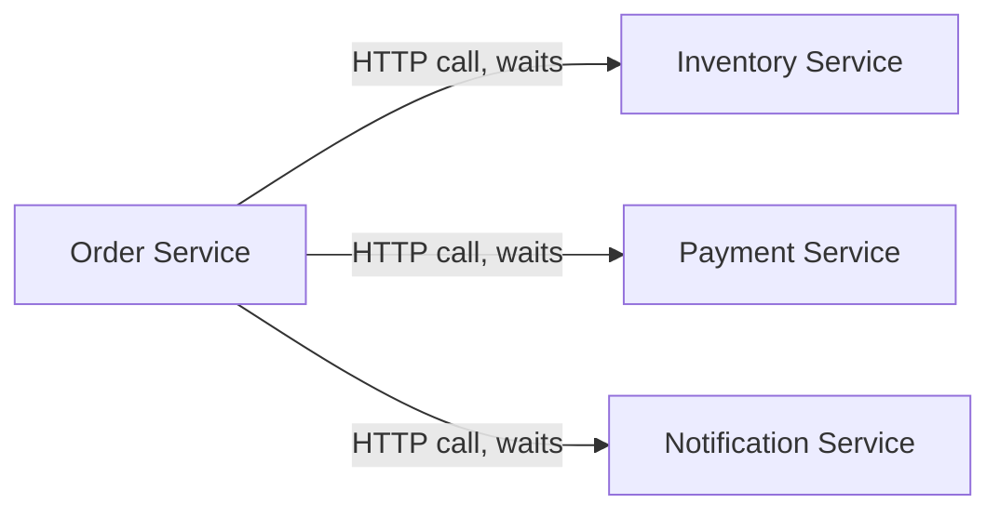
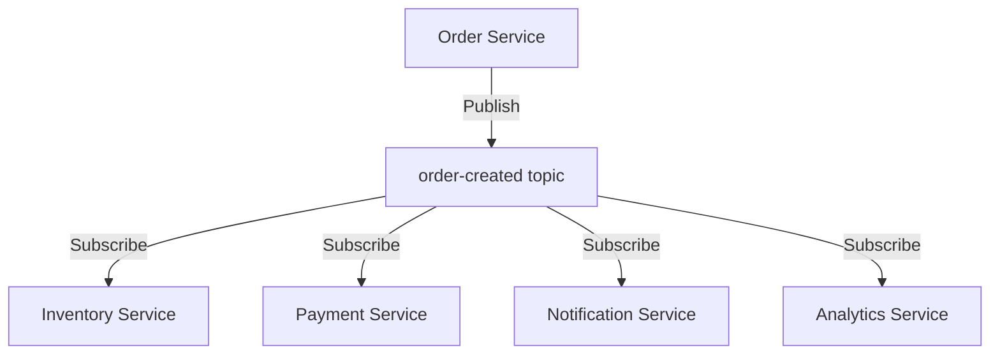
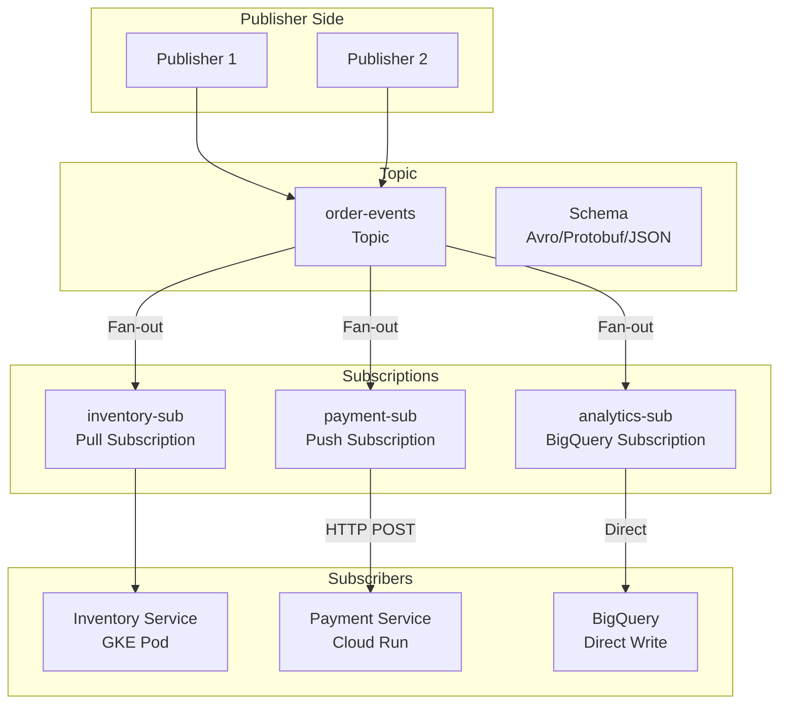
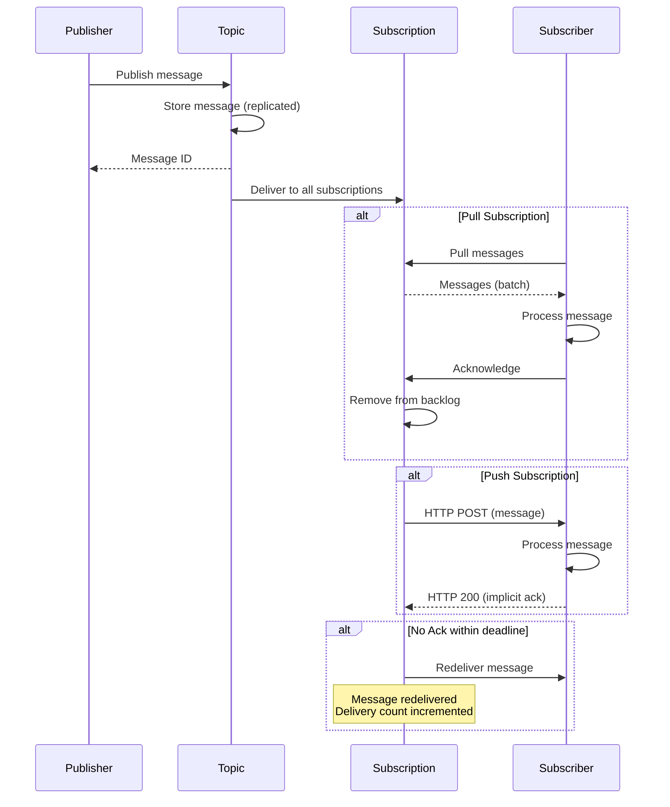
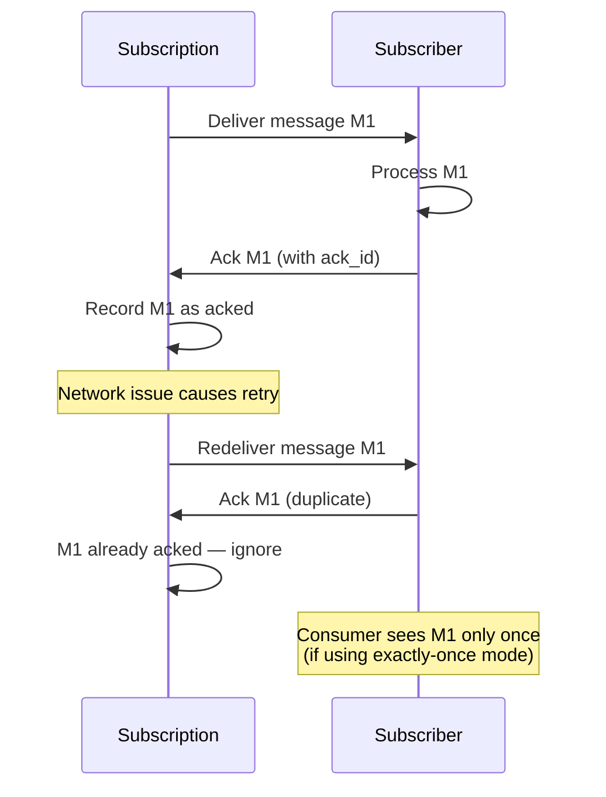
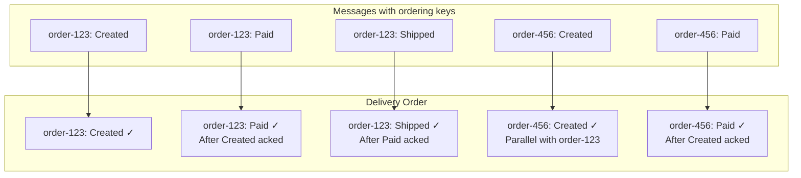
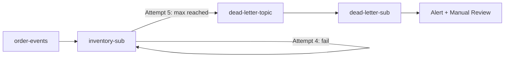

# GCP Pub/Sub Deep Dive

Cloud Pub/Sub is Google's fully managed, real-time messaging service. It decouples producers from consumers, enabling asynchronous communication, event-driven architectures, and stream processing pipelines. Built on the same infrastructure that handles Google's internal messaging (including Gmail and YouTube notifications), Pub/Sub processes hundreds of billions of messages daily.

This guide covers Pub/Sub from its messaging semantics through production patterns for exactly-once processing.

---

## 1. Why Pub/Sub Exists: The Problem It Solves

### The Coupling Problem

In a synchronous microservice architecture, Service A calls Service B directly:



Problems with direct calls:
1. **Temporal coupling** — If Inventory Service is down, Order Service fails
2. **Throughput coupling** — Order Service can only process as fast as the slowest downstream
3. **Knowledge coupling** — Order Service must know about all consumers
4. **Scaling coupling** — All services must scale together

Pub/Sub decouples these:



Now:
- Order Service publishes once, does not know who consumes
- Each consumer processes independently at its own pace
- Adding a new consumer requires zero changes to the publisher
- If a consumer is down, messages queue up until it recovers

### Pub/Sub vs. Competitors

| Feature | Cloud Pub/Sub | AWS SQS | AWS SNS+SQS | Kafka |
|---------|-------------|---------|-------------|-------|
| Model | Pub/Sub + Queue | Queue only | Pub/Sub + Queue | Log-based |
| Ordering | Per-key ordering | FIFO queues | FIFO queues | Per-partition |
| Exactly-once | Yes (with caveats) | Yes (FIFO) | No (at-least-once) | Yes (with transactions) |
| Replay | Yes (seek to time) | No | No | Yes (offset-based) |
| Max message size | 10 MB | 256 KB | 256 KB | 1 MB (default) |
| Retention | 7 days (default, up to 31) | 14 days max | N/A | Unlimited |
| Throughput | Millions/sec | Thousands/sec | Millions/sec (SNS) | Millions/sec |
| Managed | Fully | Fully | Fully | Self-managed (or Confluent) |
| Global | Yes | Regional | Regional | Self-managed |
| Cost | Per-message + data | Per-request | Per-request | Cluster cost |

---

## 2. First Principles: The Messaging Model

### Core Concepts



| Concept | Definition |
|---------|-----------|
| **Topic** | A named resource to which publishers send messages |
| **Subscription** | A named resource representing interest in a topic |
| **Message** | Data (up to 10MB) + attributes (key-value metadata) |
| **Publisher** | Any client that sends messages to a topic |
| **Subscriber** | Any client that receives messages from a subscription |
| **Ack** | Acknowledgment that a message has been successfully processed |
| **Ack deadline** | Time a subscriber has to ack before message is redelivered |

### Message Lifecycle



---

## 3. Subscription Types

### Pull Subscriptions

The subscriber explicitly requests messages. Best for:
- Long-running processing
- Batch consumers
- Rate-limited processing
- Subscribers behind firewalls

```typescript
// pull-subscriber.ts — Production pull subscriber
import { PubSub, Message } from '@google-cloud/pubsub';

const pubsub = new PubSub();

interface OrderEvent {
  orderId: string;
  customerId: string;
  total: number;
  items: Array<{ productId: string; quantity: number }>;
  timestamp: string;
}

async function startPullSubscriber(): Promise<void> {
  const subscription = pubsub.subscription('order-events-inventory-sub', {
    // Flow control — prevent overwhelming the subscriber
    flowControl: {
      maxMessages: 100,        // Max outstanding messages
      allowExcessMessages: false,
    },
    // Ack deadline
    ackDeadline: 60,          // 60 seconds to process
    // Streaming pull configuration
    streamingOptions: {
      maxStreams: 4,           // Number of gRPC streams
    },
  });

  subscription.on('message', async (message: Message) => {
    try {
      const event: OrderEvent = JSON.parse(message.data.toString());

      console.log(`Processing order ${event.orderId}`, {
        deliveryAttempt: message.deliveryAttempt,
        publishTime: message.publishTime,
        messageId: message.id,
      });

      await processInventoryUpdate(event);

      // Acknowledge — message will not be redelivered
      message.ack();
    } catch (error) {
      console.error(`Failed to process message ${message.id}:`, error);

      // Nack — message will be redelivered after ack deadline
      message.nack();
    }
  });

  subscription.on('error', (error) => {
    console.error('Subscription error:', error);
  });

  console.log('Pull subscriber started');
}

async function processInventoryUpdate(event: OrderEvent): Promise<void> {
  for (const item of event.items) {
    await updateInventory(item.productId, -item.quantity);
  }
}
```

### Push Subscriptions

Pub/Sub sends messages as HTTP POST requests to a specified endpoint. Best for:
- Cloud Run services
- Cloud Functions
- App Engine
- Any publicly accessible HTTP endpoint

```hcl
resource "google_pubsub_subscription" "payment_push" {
  name  = "order-events-payment-push"
  topic = google_pubsub_topic.order_events.id

  push_config {
    push_endpoint = google_cloud_run_v2_service.payment.uri

    # Authentication — Pub/Sub sends a signed JWT
    oidc_token {
      service_account_email = google_service_account.pubsub_invoker.email
      audience              = google_cloud_run_v2_service.payment.uri
    }

    attributes = {
      x-goog-version = "v1"
    }
  }

  ack_deadline_seconds = 60

  retry_policy {
    minimum_backoff = "10s"
    maximum_backoff = "600s"
  }

  dead_letter_policy {
    dead_letter_topic     = google_pubsub_topic.dead_letter.id
    max_delivery_attempts = 5
  }
}
```

```typescript
// Cloud Run push handler
import Fastify from 'fastify';

const app = Fastify();

interface PubSubPushMessage {
  message: {
    data: string; // Base64 encoded
    messageId: string;
    publishTime: string;
    attributes: Record<string, string>;
  };
  subscription: string;
  deliveryAttempt: number;
}

app.post('/pubsub/orders', async (request, reply) => {
  const body = request.body as PubSubPushMessage;

  // Decode the message
  const data = Buffer.from(body.message.data, 'base64').toString();
  const event: OrderEvent = JSON.parse(data);

  console.log(`Processing order ${event.orderId}`, {
    messageId: body.message.messageId,
    deliveryAttempt: body.deliveryAttempt,
  });

  try {
    await processPayment(event);

    // Return 200-299 to acknowledge
    return reply.status(200).send({ status: 'processed' });
  } catch (error) {
    console.error('Processing failed:', error);

    // Return non-2xx to nack — Pub/Sub will retry
    return reply.status(500).send({ status: 'failed' });
  }
});
```

### BigQuery Subscriptions

Write messages directly to BigQuery without any subscriber code:

```hcl
resource "google_pubsub_subscription" "analytics_bq" {
  name  = "order-events-analytics-bq"
  topic = google_pubsub_topic.order_events.id

  bigquery_config {
    table            = "${google_bigquery_table.order_events.project}.${google_bigquery_table.order_events.dataset_id}.${google_bigquery_table.order_events.table_id}"
    write_metadata   = true  # Include message metadata
    drop_unknown_fields = true
  }
}

resource "google_bigquery_table" "order_events" {
  dataset_id = google_bigquery_dataset.events.dataset_id
  table_id   = "order_events"

  schema = jsonencode([
    { name = "orderId", type = "STRING", mode = "REQUIRED" },
    { name = "customerId", type = "STRING", mode = "REQUIRED" },
    { name = "total", type = "FLOAT64", mode = "REQUIRED" },
    { name = "timestamp", type = "TIMESTAMP", mode = "REQUIRED" },
  ])
}
```

---

## 4. Exactly-Once Delivery

### The Three Delivery Guarantees

| Guarantee | Definition | Pub/Sub Support |
|-----------|-----------|----------------|
| **At-most-once** | Messages may be lost, never duplicated | Not the default |
| **At-least-once** | Messages never lost, may be duplicated | Default behavior |
| **Exactly-once** | Messages never lost, never duplicated | Available (with caveats) |

### How Exactly-Once Works in Pub/Sub

Pub/Sub provides exactly-once delivery by tracking acknowledged message IDs server-side:



### Enabling Exactly-Once

```hcl
resource "google_pubsub_subscription" "exactly_once" {
  name  = "order-events-exactly-once"
  topic = google_pubsub_topic.order_events.id

  enable_exactly_once_delivery = true

  ack_deadline_seconds = 60
}
```

### The Idempotency Pattern (More Reliable)

Even with exactly-once delivery, you should design consumers to be **idempotent** — processing the same message twice should produce the same result:

```typescript
// idempotent-consumer.ts
import { PubSub, Message } from '@google-cloud/pubsub';
import { Pool } from 'pg';

const pool = new Pool();

async function processOrderIdempotently(message: Message): Promise<void> {
  const event: OrderEvent = JSON.parse(message.data.toString());
  const messageId = message.id;

  const client = await pool.connect();
  try {
    await client.query('BEGIN');

    // Check if already processed (idempotency key)
    const existing = await client.query(
      'SELECT 1 FROM processed_messages WHERE message_id = $1',
      [messageId]
    );

    if (existing.rowCount > 0) {
      console.log(`Message ${messageId} already processed, skipping`);
      await client.query('COMMIT');
      message.ack();
      return;
    }

    // Process the message
    await client.query(
      'UPDATE inventory SET quantity = quantity - $1 WHERE product_id = $2',
      [event.items[0].quantity, event.items[0].productId]
    );

    // Record processing (same transaction = atomic)
    await client.query(
      'INSERT INTO processed_messages (message_id, processed_at) VALUES ($1, NOW())',
      [messageId]
    );

    await client.query('COMMIT');
    message.ack();
  } catch (error) {
    await client.query('ROLLBACK');
    message.nack();
    throw error;
  } finally {
    client.release();
  }
}
```

---

## 5. Message Ordering

### Ordering Keys

By default, Pub/Sub does not guarantee message order. To get ordered delivery, use **ordering keys**:

```typescript
// publisher-with-ordering.ts
import { PubSub } from '@google-cloud/pubsub';

const pubsub = new PubSub();
const topic = pubsub.topic('order-events', {
  enableMessageOrdering: true,
});

async function publishOrderEvent(event: OrderEvent): Promise<string> {
  const messageId = await topic.publishMessage({
    data: Buffer.from(JSON.stringify(event)),
    orderingKey: event.orderId,  // All messages for same order arrive in order
    attributes: {
      eventType: 'ORDER_CREATED',
      version: '1',
    },
  });

  return messageId;
}
```

### Ordering Semantics

| Behavior | Description |
|----------|------------|
| Ordering scope | Per ordering key, per subscription |
| Cross-key ordering | Not guaranteed |
| Parallelism | Different ordering keys process in parallel |
| Error handling | A failed message blocks subsequent messages with same key |



::: warning
If a message with an ordering key fails to be acknowledged, all subsequent messages with the **same ordering key** are blocked until the failed message is acked or the subscription is seeked past it. Design your error handling carefully — a poison message can block an entire order's event stream.
:::

---

## 6. Dead Letter Queues

### How Dead Lettering Works

When a message fails processing repeatedly, it is sent to a dead letter topic after exceeding the maximum delivery attempts:



### Configuration

```hcl
resource "google_pubsub_topic" "dead_letter" {
  name = "order-events-dead-letter"
}

resource "google_pubsub_subscription" "dead_letter_sub" {
  name  = "order-events-dead-letter-sub"
  topic = google_pubsub_topic.dead_letter.id

  # Long retention for manual review
  message_retention_duration = "604800s" # 7 days
  retain_acked_messages      = true
}

resource "google_pubsub_subscription" "inventory" {
  name  = "order-events-inventory"
  topic = google_pubsub_topic.order_events.id

  dead_letter_policy {
    dead_letter_topic     = google_pubsub_topic.dead_letter.id
    max_delivery_attempts = 5
  }

  retry_policy {
    minimum_backoff = "10s"
    maximum_backoff = "600s"
  }

  ack_deadline_seconds = 60
}

# Grant Pub/Sub permission to publish to DLQ
resource "google_pubsub_topic_iam_member" "dead_letter_publisher" {
  topic  = google_pubsub_topic.dead_letter.id
  role   = "roles/pubsub.publisher"
  member = "serviceAccount:service-${data.google_project.current.number}@gcp-sa-pubsub.iam.gserviceaccount.com"
}

# Grant Pub/Sub permission to ack from source subscription
resource "google_pubsub_subscription_iam_member" "dead_letter_subscriber" {
  subscription = google_pubsub_subscription.inventory.id
  role         = "roles/pubsub.subscriber"
  member       = "serviceAccount:service-${data.google_project.current.number}@gcp-sa-pubsub.iam.gserviceaccount.com"
}
```

### Dead Letter Processing

```typescript
// dlq-processor.ts — Process dead letter messages
import { PubSub, Message } from '@google-cloud/pubsub';

const pubsub = new PubSub();

async function processDLQ(): Promise<void> {
  const subscription = pubsub.subscription('order-events-dead-letter-sub');

  subscription.on('message', async (message: Message) => {
    const originalTopic = message.attributes['CloudPubSubDeadLetterSourceTopicName'];
    const originalSub = message.attributes['CloudPubSubDeadLetterSourceSubscription'];
    const deliveryAttempt = message.attributes['CloudPubSubDeadLetterSourceDeliveryCount'];

    console.error('Dead letter message received', {
      messageId: message.id,
      originalTopic,
      originalSub,
      deliveryAttempts: deliveryAttempt,
      data: message.data.toString(),
    });

    // Options:
    // 1. Alert the team
    await alertTeam({
      channel: '#incidents',
      message: `Dead letter: ${message.id} from ${originalTopic} after ${deliveryAttempt} attempts`,
    });

    // 2. Store for manual replay
    await storeForReplay(message);

    // 3. Ack to prevent DLQ buildup
    message.ack();
  });
}
```

---

## 7. Schema Validation

### Defining Schemas

Pub/Sub supports Avro, Protocol Buffers, and JSON Schema for message validation:

```hcl
resource "google_pubsub_schema" "order_event" {
  name       = "order-event-schema"
  type       = "AVRO"
  definition = jsonencode({
    type = "record"
    name = "OrderEvent"
    fields = [
      { name = "orderId", type = "string" },
      { name = "customerId", type = "string" },
      { name = "total", type = "double" },
      { name = "status", type = { type = "enum", name = "OrderStatus", symbols = ["CREATED", "PAID", "SHIPPED", "DELIVERED", "CANCELLED"] } },
      { name = "timestamp", type = { type = "long", logicalType = "timestamp-millis" } },
      { name = "items", type = { type = "array", items = {
        type = "record", name = "OrderItem", fields = [
          { name = "productId", type = "string" },
          { name = "quantity", type = "int" },
          { name = "price", type = "double" },
        ]
      }}},
    ]
  })
}

resource "google_pubsub_topic" "order_events" {
  name = "order-events"

  schema_settings {
    schema   = google_pubsub_schema.order_event.id
    encoding = "JSON"
  }
}
```

---

## 8. Performance Characteristics

### Throughput and Latency

| Metric | Value | Notes |
|--------|-------|-------|
| Publish throughput | Millions/sec per topic | Scales automatically |
| Pull throughput | 50 MB/sec per streaming pull | Use multiple streams |
| Publish latency (P50) | 10-20ms | Regional |
| Publish latency (P99) | 50-100ms | Regional |
| End-to-end latency (P50) | 50-100ms | Publish to delivery |
| End-to-end latency (P99) | 200-500ms | Publish to delivery |
| Max message size | 10 MB | Per message |
| Max batch size | 1,000 messages | Per publish call |
| Max attributes per message | 100 | Key-value pairs |
| Max attribute key size | 256 bytes | |
| Max attribute value size | 1,024 bytes | |

### Cost Model

| Component | Cost | Notes |
|-----------|------|-------|
| Message ingestion | $0.04/million messages (first 10GB free) | Minimum 1KB per message |
| Message delivery | Included in ingestion | Per subscription |
| Retained acknowledged messages | $0.27/GB/month | Optional feature |
| Snapshot retention | $0.003/GB/month | For seek functionality |
| Schema validation | Free | No additional cost |
| Egress | Standard GCP rates | Cross-region only |

### Cost Optimization

$$\text{Monthly Cost} = \frac{\text{Total Data (GB)} \times \$40}{1000}$$

For 100 million messages at 1KB each = 100GB:

$$\text{Cost} = \frac{100 \times \$40}{1000} = \$4.00/\text{month}$$

::: tip
Pub/Sub charges per **data volume**, not per message count (minimum 1KB per message). Batching multiple small events into a single larger message can reduce costs significantly. A message with 10 events at 100 bytes each costs the same as 1 event at 1KB.
:::

---

## 9. Production Patterns

### Fan-Out Pattern

```typescript
// One event triggers multiple independent processes
// Each subscription processes independently

// Topic: order-created
// Subscriptions:
//   - inventory-update (update stock levels)
//   - payment-processing (charge customer)
//   - email-notification (send confirmation)
//   - analytics-pipeline (BigQuery subscription)
//   - search-indexing (update search index)
```

### Event Sourcing Pattern

```typescript
// event-sourcing.ts — Using Pub/Sub as an event bus
interface DomainEvent {
  aggregateId: string;
  aggregateType: string;
  eventType: string;
  version: number;
  timestamp: string;
  payload: unknown;
}

class EventPublisher {
  private topic: Topic;

  constructor(topicName: string) {
    const pubsub = new PubSub();
    this.topic = pubsub.topic(topicName, { enableMessageOrdering: true });
  }

  async publish(event: DomainEvent): Promise<string> {
    return this.topic.publishMessage({
      data: Buffer.from(JSON.stringify(event)),
      orderingKey: `${event.aggregateType}:${event.aggregateId}`,
      attributes: {
        eventType: event.eventType,
        aggregateType: event.aggregateType,
        version: event.version.toString(),
      },
    });
  }
}

// Usage
const publisher = new EventPublisher('domain-events');

await publisher.publish({
  aggregateId: 'order-123',
  aggregateType: 'Order',
  eventType: 'OrderCreated',
  version: 1,
  timestamp: new Date().toISOString(),
  payload: { customerId: 'cust-456', total: 99.99 },
});
```

### Backpressure and Flow Control

```typescript
// flow-control.ts — Prevent overwhelming downstream systems
const subscription = pubsub.subscription('high-volume-sub', {
  flowControl: {
    maxMessages: 50,          // Process at most 50 at a time
    maxBytes: 10 * 1024 * 1024, // 10MB max outstanding
    allowExcessMessages: false,
  },
  // Extend ack deadline for slow processing
  maxExtensionMinutes: 60,
});
```

::: info War Story
An e-commerce company used Pub/Sub to fan out order events to 8 downstream services. During Black Friday, one subscriber (the analytics pipeline) fell behind and accumulated a 2-hour backlog of 5 million messages. The subscriber was processing messages faster than normal but couldn't keep up with the 10x traffic spike.

The fix:
1. Set `flowControl.maxMessages = 200` (was unlimited, causing OOM)
2. Added horizontal scaling — 10 subscriber instances instead of 2
3. Switched analytics to BigQuery Subscription (zero code, handles any throughput)
4. Added monitoring on subscription backlog age — alert if > 5 minutes

Black Friday the next year: all subscribers stayed within 30 seconds of real-time.
:::

---

## 10. Monitoring

### Key Metrics

| Metric | Warning | Critical | Meaning |
|--------|---------|----------|---------|
| `subscription/oldest_unacked_message_age` | > 300s | > 900s | Processing falling behind |
| `subscription/num_undelivered_messages` | > 10,000 | > 100,000 | Backlog growing |
| `subscription/dead_letter_message_count` | > 0 | > 100 | Messages failing permanently |
| `topic/send_request_count` (errors) | > 1% | > 5% | Publish failures |
| `subscription/pull_request_count` (errors) | > 1% | > 5% | Pull failures |

### Alerting on Backlog

```hcl
resource "google_monitoring_alert_policy" "pubsub_backlog" {
  display_name = "Pub/Sub Backlog Alert"
  combiner     = "OR"

  conditions {
    display_name = "Oldest unacked message > 5 minutes"
    condition_threshold {
      filter          = "resource.type = \"pubsub_subscription\" AND metric.type = \"pubsub.googleapis.com/subscription/oldest_unacked_message_age\""
      comparison      = "COMPARISON_GT"
      threshold_value = 300
      duration        = "60s"

      aggregations {
        alignment_period   = "60s"
        per_series_aligner = "ALIGN_MAX"
      }
    }
  }

  notification_channels = [google_monitoring_notification_channel.pagerduty.id]
}
```

---

## 11. Edge Cases and Failure Modes

| Issue | Cause | Mitigation |
|-------|-------|-----------|
| Duplicate delivery | Network issues, subscriber crash before ack | Idempotent processing |
| Message backlog | Subscriber slower than publisher | Scale subscribers, increase parallelism |
| Ordering blocked | Failed message blocks key | DLQ policy, seek past bad message |
| Schema evolution | Breaking change to message format | Use schema registry, versioned schemas |
| Large messages (> 10MB) | Payload too big | Store data in GCS, send reference in message |
| Poison messages | Unparseable or logic-error-causing messages | DLQ with alerting |

---

## 12. Decision Framework

| Choose Pub/Sub When | Choose Kafka When | Choose Cloud Tasks When |
|--------------------|-------------------|----------------------|
| Event-driven architecture | Need infinite retention | Task queue (one consumer) |
| Fan-out to multiple consumers | Need consumer group rebalancing | Delayed execution |
| Serverless integration | Need exactly-once with transactions | Rate limiting |
| Simple operational model | Need compacted topics | HTTP target invocation |
| GCP-native workloads | Multi-cloud or on-premises | Simple webhook delivery |

---

## See Also

- [GCP Overview](./index.md) — GCP fundamentals
- [Cloud Run](./cloud-run.md) — Push subscriptions to Cloud Run
- [GKE](./gke.md) — Pull subscribers on GKE
- [IAM](./iam.md) — Pub/Sub permissions
- [Cost Optimization](./cost-optimization.md) — Pub/Sub cost strategies
