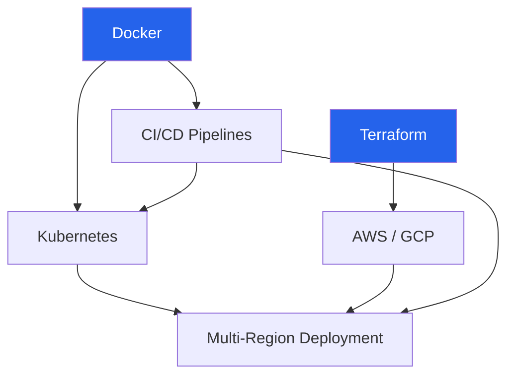

# Infrastructure

Infrastructure used to be someone else's problem. You wrote code, "the ops team" deployed it, and if something broke at 3 AM, they got paged. That world is gone. Modern engineers own their infrastructure end to end, from the Terraform module that provisions a VPC to the Kubernetes manifest that schedules their pods to the CI/CD pipeline that validates and ships every commit.

This section gives you production-grade infrastructure patterns — not toy examples that work in a tutorial and collapse under real traffic. Every Terraform module is structured for team use with proper state management. Every Kubernetes config handles resource limits, health checks, and graceful shutdown. Every CI/CD pipeline includes security scanning, not just `npm test`.

## What You'll Be Able to Deploy After This Section

By the time you work through these pages, you will be able to stand up and operate:

- A **multi-environment AWS or GCP stack** (dev, staging, production) with proper network isolation, IAM boundaries, and cost tagging
- A **Kubernetes cluster** running multiple services with autoscaling, rolling deployments, pod disruption budgets, and observability baked in
- A **CI/CD pipeline** that builds, tests, scans, and deploys with zero manual steps and full rollback capability
- A **multi-region deployment** with DNS-based failover, data replication, and latency-based routing
- **Docker images** optimized for production — small, secure, reproducible, with multi-stage builds and distroless base images

## Infrastructure Learning Path

Start with the two foundations in parallel: **Docker** (how you package applications) and **Terraform** (how you provision cloud resources). Docker leads naturally into **CI/CD** (automating the build-test-deploy cycle) and **Kubernetes** (orchestrating containers at scale). Terraform leads into **AWS/GCP** (the cloud platforms you provision). Everything converges at **multi-region deployment**, where you combine all these skills to run a globally distributed, fault-tolerant system.

## Section Map

| Subsection | What You'll Learn | Key Deliverables |
|---|---|---|
| [Docker](/infrastructure/docker) | Multi-stage builds, layer caching, security hardening, compose for local dev | Production Dockerfile template, docker-compose stack |
| [Terraform](/infrastructure/terraform) | Module structure, state management, workspaces, drift detection, policy-as-code | Reusable VPC module, remote state backend, CI integration |
| [Kubernetes](/infrastructure/kubernetes) | Pod lifecycle, deployments, services, ingress, HPA, RBAC, network policies | Complete deployment manifest set, Helm chart template |
| [AWS](/infrastructure/aws) | VPC design, IAM best practices, ECS vs EKS, RDS, S3, CloudFront, cost optimization | Production-ready AWS landing zone in Terraform |
| [GCP](/infrastructure/gcp) | Project structure, GKE, Cloud Run, Cloud SQL, IAM, networking | GCP foundation Terraform module |
| [CI/CD](/infrastructure/ci-cd) | GitHub Actions, pipeline design, security scanning, artifact management, rollback | Complete pipeline configs for multiple project types |
| [Multi-Region](/infrastructure/multi-region) | Active-active vs active-passive, data replication, DNS failover, latency routing | Multi-region architecture blueprint with Terraform |

## Philosophy

Good infrastructure has three properties: it is **reproducible** (anyone can recreate it from code), **observable** (you can see what it is doing right now), and **recoverable** (when something breaks, you can fix it fast). Every page in this section optimizes for these three properties. You won't find ClickOps guides here. Everything is code, everything is versioned, and everything can be torn down and rebuilt from scratch in minutes.
