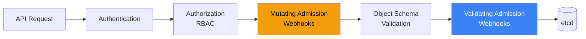
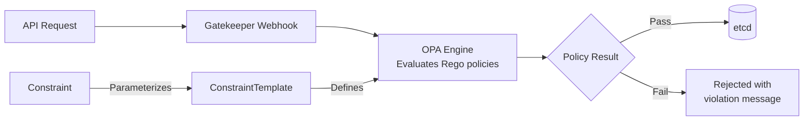

# Admission Webhooks

Every object that enters a Kubernetes cluster passes through the admission control pipeline. This pipeline sits between the API server authenticating your request and the object being persisted to etcd. Admission webhooks let you inject custom logic into this pipeline — validating resources against organizational policies, mutating resources to inject defaults (sidecar containers, labels, resource limits), or rejecting resources that violate security constraints.

Admission webhooks are the enforcement mechanism for platform engineering. They turn "we have a wiki page saying all pods must have resource limits" into "pods without resource limits are rejected at admission time, every time, with a helpful error message."

---

## How Admission Control Works

### The Request Pipeline



**Order matters.** Mutating webhooks run first, so validating webhooks see the final, mutated object. This means a mutating webhook can inject a sidecar container, and a validating webhook can verify that all containers have security contexts — including the injected sidecar.

### Mutating vs Validating

| Aspect | Mutating Webhook | Validating Webhook |
|--------|-----------------|-------------------|
| **Purpose** | Modify the resource before it is stored | Accept or reject the resource |
| **Can modify object** | Yes (JSON patch) | No (read-only) |
| **Can reject request** | Yes | Yes |
| **Execution order** | First | After mutation + schema validation |
| **Use cases** | Inject sidecars, add labels, set defaults | Enforce policies, check naming, block images |
| **Runs on** | CREATE, UPDATE, DELETE, CONNECT | CREATE, UPDATE, DELETE, CONNECT |

---

## Building a Mutating Webhook

A mutating webhook intercepts resources and returns JSON patches that modify them. Common use cases: injecting sidecar containers, adding default labels, setting resource limits, injecting environment variables.

### Webhook Server Implementation

```go
package webhook

import (
    "context"
    "encoding/json"
    "fmt"
    "net/http"

    admissionv1 "k8s.io/api/admission/v1"
    corev1 "k8s.io/api/core/v1"
    "k8s.io/apimachinery/pkg/api/resource"
    metav1 "k8s.io/apimachinery/pkg/apis/meta/v1"
    "sigs.k8s.io/controller-runtime/pkg/webhook/admission"
)

// PodDefaulter injects defaults into all pods
type PodDefaulter struct {
    decoder *admission.Decoder
}

func (p *PodDefaulter) Handle(ctx context.Context, req admission.Request) admission.Response {
    pod := &corev1.Pod{}
    if err := p.decoder.Decode(req, pod); err != nil {
        return admission.Errored(http.StatusBadRequest, err)
    }

    // Inject default resource limits if missing
    for i := range pod.Spec.Containers {
        c := &pod.Spec.Containers[i]
        if c.Resources.Limits == nil {
            c.Resources.Limits = corev1.ResourceList{
                corev1.ResourceCPU:    resource.MustParse("500m"),
                corev1.ResourceMemory: resource.MustParse("256Mi"),
            }
        }
        if c.Resources.Requests == nil {
            c.Resources.Requests = corev1.ResourceList{
                corev1.ResourceCPU:    resource.MustParse("100m"),
                corev1.ResourceMemory: resource.MustParse("128Mi"),
            }
        }
    }

    // Inject team label from namespace annotation
    if pod.Labels == nil {
        pod.Labels = map[string]string{}
    }
    if _, exists := pod.Labels["team"]; !exists {
        pod.Labels["team"] = "unknown"
    }

    // Inject security context defaults
    if pod.Spec.SecurityContext == nil {
        pod.Spec.SecurityContext = &corev1.PodSecurityContext{
            RunAsNonRoot: boolPtr(true),
        }
    }

    // Return the mutated pod
    marshaledPod, err := json.Marshal(pod)
    if err != nil {
        return admission.Errored(http.StatusInternalServerError, err)
    }

    return admission.PatchResponseFromRaw(req.Object.Raw, marshaledPod)
}
```

### Webhook Configuration

```yaml
apiVersion: admissionregistration.k8s.io/v1
kind: MutatingWebhookConfiguration
metadata:
  name: pod-defaults
  annotations:
    cert-manager.io/inject-ca-from: webhook-system/webhook-serving-cert
webhooks:
  - name: pod-defaults.archon.dev
    admissionReviewVersions: ["v1"]
    sideEffects: None
    timeoutSeconds: 10
    failurePolicy: Fail        # Reject if webhook is down
    matchPolicy: Equivalent
    clientConfig:
      service:
        name: webhook-service
        namespace: webhook-system
        path: /mutate-pods
      # caBundle is injected by cert-manager
    rules:
      - apiGroups: [""]
        apiVersions: ["v1"]
        resources: ["pods"]
        operations: ["CREATE"]
        scope: Namespaced
    namespaceSelector:
      matchExpressions:
        - key: kubernetes.io/metadata.name
          operator: NotIn
          values: ["kube-system", "kube-public", "webhook-system"]
    objectSelector:
      matchExpressions:
        - key: skip-defaults
          operator: DoesNotExist
```

::: warning
Always set `namespaceSelector` to exclude system namespaces (`kube-system`, `kube-public`) and the webhook's own namespace. If your webhook intercepts its own pods, a failed deployment creates a deadlock — the new pod needs the webhook to start, but the webhook needs the new pod to be running.
:::

---

## Building a Validating Webhook

A validating webhook inspects resources and returns allow/deny decisions. It cannot modify the resource.

```go
// PodValidator enforces organizational policies on all pods
type PodValidator struct {
    decoder *admission.Decoder
}

func (v *PodValidator) Handle(ctx context.Context, req admission.Request) admission.Response {
    pod := &corev1.Pod{}
    if err := v.decoder.Decode(req, pod); err != nil {
        return admission.Errored(http.StatusBadRequest, err)
    }

    var violations []string

    for _, c := range pod.Spec.Containers {
        // Policy: No latest tag
        if isLatestTag(c.Image) {
            violations = append(violations,
                fmt.Sprintf("container %q uses :latest tag — pin to a specific version", c.Name))
        }

        // Policy: No privileged containers
        if c.SecurityContext != nil && c.SecurityContext.Privileged != nil && *c.SecurityContext.Privileged {
            violations = append(violations,
                fmt.Sprintf("container %q is privileged — this is not allowed", c.Name))
        }

        // Policy: Resource limits required
        if c.Resources.Limits.Cpu().IsZero() || c.Resources.Limits.Memory().IsZero() {
            violations = append(violations,
                fmt.Sprintf("container %q missing CPU or memory limits", c.Name))
        }

        // Policy: Only approved registries
        if !isApprovedRegistry(c.Image) {
            violations = append(violations,
                fmt.Sprintf("container %q image %q not from an approved registry", c.Name, c.Image))
        }
    }

    // Policy: Required labels
    requiredLabels := []string{"app", "team", "environment"}
    for _, label := range requiredLabels {
        if _, exists := pod.Labels[label]; !exists {
            violations = append(violations,
                fmt.Sprintf("missing required label %q", label))
        }
    }

    if len(violations) > 0 {
        return admission.Denied(fmt.Sprintf(
            "Pod rejected due to policy violations:\n- %s",
            strings.Join(violations, "\n- "),
        ))
    }

    return admission.Allowed("all policies passed")
}
```

### Validating Webhook Configuration

```yaml
apiVersion: admissionregistration.k8s.io/v1
kind: ValidatingWebhookConfiguration
metadata:
  name: pod-policy
webhooks:
  - name: pod-policy.archon.dev
    admissionReviewVersions: ["v1"]
    sideEffects: None
    timeoutSeconds: 5
    failurePolicy: Fail
    clientConfig:
      service:
        name: webhook-service
        namespace: webhook-system
        path: /validate-pods
    rules:
      - apiGroups: [""]
        apiVersions: ["v1"]
        resources: ["pods"]
        operations: ["CREATE", "UPDATE"]
    namespaceSelector:
      matchLabels:
        policy-enforcement: enabled
```

### failurePolicy: Fail vs Ignore

| Policy | Behavior when webhook is unreachable | Use when |
|--------|--------------------------------------|----------|
| `Fail` | Reject the request | Security-critical policies (image validation, privilege checks) |
| `Ignore` | Allow the request through | Non-critical defaults (label injection, annotations) |

::: danger
Setting `failurePolicy: Fail` on a webhook that watches kube-system resources can prevent the cluster from self-healing. If the webhook pod crashes, no new pods can be created in kube-system (including the webhook pod itself). Always exclude system namespaces with `namespaceSelector`.
:::

---

## Policy Engines

### OPA Gatekeeper

[OPA Gatekeeper](https://open-policy-agent.github.io/gatekeeper/) integrates Open Policy Agent with Kubernetes admission control. Instead of writing Go webhook code, you define policies in Rego (OPA's policy language) and deploy them as Kubernetes resources.



**ConstraintTemplate** — Defines a reusable policy with parameters:

```yaml
apiVersion: templates.gatekeeper.sh/v1
kind: ConstraintTemplate
metadata:
  name: k8srequiredlabels
spec:
  crd:
    spec:
      names:
        kind: K8sRequiredLabels
      validation:
        openAPIV3Schema:
          type: object
          properties:
            labels:
              type: array
              items:
                type: string
  targets:
    - target: admission.k8s.gatekeeper.sh
      rego: |
        package k8srequiredlabels

        violation[{"msg": msg}] {
          provided := {label | input.review.object.metadata.labels[label]}
          required := {label | label := input.parameters.labels[_]}
          missing := required - provided
          count(missing) > 0
          msg := sprintf("Missing required labels: %v", [missing])
        }
```

**Constraint** — Applies the template with specific parameters:

```yaml
apiVersion: constraints.gatekeeper.sh/v1beta1
kind: K8sRequiredLabels
metadata:
  name: require-team-labels
spec:
  enforcementAction: deny     # deny | dryrun | warn
  match:
    kinds:
      - apiGroups: [""]
        kinds: ["Pod"]
      - apiGroups: ["apps"]
        kinds: ["Deployment", "StatefulSet"]
    namespaceSelector:
      matchExpressions:
        - key: kubernetes.io/metadata.name
          operator: NotIn
          values: ["kube-system", "gatekeeper-system"]
  parameters:
    labels:
      - "app"
      - "team"
      - "environment"
```

### Kyverno

[Kyverno](https://kyverno.io/) takes a different approach — policies are written in YAML, not Rego. This makes it more accessible to teams without OPA expertise.

```yaml
apiVersion: kyverno.io/v1
kind: ClusterPolicy
metadata:
  name: require-resource-limits
  annotations:
    policies.kyverno.io/title: Require Resource Limits
    policies.kyverno.io/severity: high
spec:
  validationFailureAction: Enforce  # Enforce | Audit
  background: true
  rules:
    - name: check-resource-limits
      match:
        any:
          - resources:
              kinds:
                - Pod
      exclude:
        any:
          - resources:
              namespaces:
                - kube-system
                - kyverno
      validate:
        message: "All containers must have CPU and memory limits defined."
        pattern:
          spec:
            containers:
              - resources:
                  limits:
                    memory: "?*"
                    cpu: "?*"

    - name: disallow-latest-tag
      match:
        any:
          - resources:
              kinds:
                - Pod
      validate:
        message: "Using ':latest' tag is not allowed. Pin to a specific version."
        pattern:
          spec:
            containers:
              - image: "!*:latest"

    - name: add-default-labels
      match:
        any:
          - resources:
              kinds:
                - Pod
      mutate:
        patchStrategicMerge:
          metadata:
            labels:
              +(managed-by): "kyverno"
              +(policy-version): "v1"
```

### Gatekeeper vs Kyverno

| Aspect | OPA Gatekeeper | Kyverno |
|--------|---------------|---------|
| **Policy language** | Rego (dedicated language) | YAML (Kubernetes-native) |
| **Learning curve** | Steep (Rego is unique) | Gentle (YAML patterns) |
| **Mutation support** | Limited (via assign/modify) | Full (strategic merge patch) |
| **Generation** | No | Yes (generate resources on events) |
| **Audit mode** | Yes (`dryrun` enforcement) | Yes (`Audit` action) |
| **External data** | Yes (sync data to OPA) | Yes (API calls, ConfigMaps) |
| **Performance** | Faster for complex logic (compiled Rego) | Adequate for most workloads |
| **Community** | Larger (CNCF graduated) | Growing (CNCF incubating) |
| **Best for** | Complex cross-resource policies | Teams that prefer YAML-first |

::: tip
If your team already knows OPA from Terraform or API gateway policies, use Gatekeeper. If you want the fastest path to enforcing basic policies (labels, limits, image registries), use Kyverno. Both are production-grade.
:::

---

## Certificate Management for Webhooks

Webhooks communicate with the API server over TLS. The API server must trust the webhook's certificate. Managing these certificates manually is error-prone and leads to outages when certs expire.

### cert-manager Integration

[cert-manager](https://cert-manager.io/) automates certificate issuance and renewal. It integrates with webhook configurations via annotations.

```yaml
# 1. Create a self-signed issuer for webhooks
apiVersion: cert-manager.io/v1
kind: Issuer
metadata:
  name: webhook-selfsigned
  namespace: webhook-system
spec:
  selfSigned: {}

---
# 2. Create a CA certificate
apiVersion: cert-manager.io/v1
kind: Certificate
metadata:
  name: webhook-ca
  namespace: webhook-system
spec:
  isCA: true
  commonName: webhook-ca
  secretName: webhook-ca-secret
  privateKey:
    algorithm: ECDSA
    size: 256
  issuerRef:
    name: webhook-selfsigned
    kind: Issuer

---
# 3. Create an issuer using the CA
apiVersion: cert-manager.io/v1
kind: Issuer
metadata:
  name: webhook-ca-issuer
  namespace: webhook-system
spec:
  ca:
    secretName: webhook-ca-secret

---
# 4. Create the serving certificate for the webhook
apiVersion: cert-manager.io/v1
kind: Certificate
metadata:
  name: webhook-serving-cert
  namespace: webhook-system
spec:
  secretName: webhook-tls
  duration: 8760h       # 1 year
  renewBefore: 720h     # Renew 30 days before expiry
  dnsNames:
    - webhook-service.webhook-system.svc
    - webhook-service.webhook-system.svc.cluster.local
  issuerRef:
    name: webhook-ca-issuer
    kind: Issuer
```

The webhook `MutatingWebhookConfiguration` or `ValidatingWebhookConfiguration` uses the annotation `cert-manager.io/inject-ca-from` to have cert-manager automatically inject the CA bundle:

```yaml
metadata:
  annotations:
    cert-manager.io/inject-ca-from: webhook-system/webhook-serving-cert
```

### Mounting the Certificate in the Webhook Pod

```yaml
apiVersion: apps/v1
kind: Deployment
metadata:
  name: webhook-server
  namespace: webhook-system
spec:
  template:
    spec:
      containers:
        - name: webhook
          image: myregistry/webhook-server:v1.2.0
          ports:
            - containerPort: 9443
              name: webhook
          volumeMounts:
            - name: tls
              mountPath: /tmp/k8s-webhook-server/serving-certs
              readOnly: true
      volumes:
        - name: tls
          secret:
            secretName: webhook-tls
```

---

## Troubleshooting Webhooks

| Symptom | Likely Cause | Fix |
|---------|-------------|-----|
| `connection refused` on resource creation | Webhook pod not running | Check pod status, check Service endpoints |
| `x509: certificate signed by unknown authority` | CA bundle not injected | Verify cert-manager annotation, check Certificate status |
| Pods stuck in `Pending` forever | Webhook creates a deadlock with its own namespace | Add `namespaceSelector` to exclude the webhook namespace |
| `context deadline exceeded` | Webhook too slow | Increase `timeoutSeconds`, optimize webhook logic |
| All resources rejected after webhook deploy | `failurePolicy: Fail` with broken webhook | Temporarily set to `Ignore`, fix webhook, restore `Fail` |
| Mutations not appearing | Mutating webhook running after validating | Check webhook ordering (mutating runs first by default) |

```bash
# Debug webhook connectivity
kubectl get mutatingwebhookconfigurations
kubectl get validatingwebhookconfigurations
kubectl describe mutatingwebhookconfiguration pod-defaults

# Check webhook pod logs
kubectl logs -n webhook-system -l app=webhook-server

# Check certificate status
kubectl get certificate -n webhook-system
kubectl describe certificate webhook-serving-cert -n webhook-system

# Test webhook manually with a dry-run
kubectl run test-pod --image=nginx --dry-run=server -o yaml
```

---

## Further Reading

- [CRDs & Operators Deep Dive](/infrastructure/kubernetes/crds-operators) — building the custom resources that webhooks validate
- [RBAC](/infrastructure/kubernetes/rbac) — restricting who can create and modify webhook configurations
- [Secrets Management](/infrastructure/kubernetes/secrets-management) — managing TLS secrets for webhook certificates
- [Network Policies](/infrastructure/kubernetes/network-policies) — ensuring webhook traffic is allowed through CNI policies
- [OPA Gatekeeper documentation](https://open-policy-agent.github.io/gatekeeper/) — official constraint framework reference
- [Kyverno documentation](https://kyverno.io/docs/) — YAML-native policy engine
- [cert-manager documentation](https://cert-manager.io/docs/) — automated certificate lifecycle management
