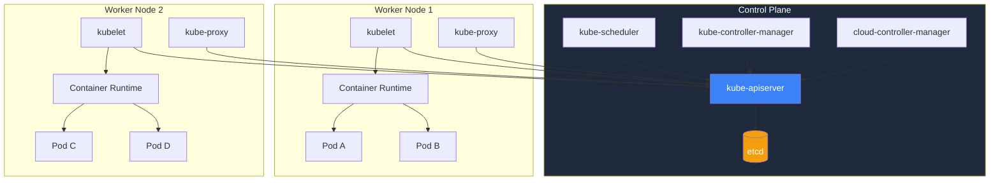

# Kubernetes Architecture Internals

Understanding Kubernetes architecture is not academic — it is the difference between debugging a problem in minutes versus hours. When a pod is stuck in Pending, you need to know that the scheduler could not find a node with enough resources. When a service is unreachable, you need to understand how kube-proxy programs iptables rules. When etcd runs out of disk, you need to know that the entire cluster stops.

This page dissects every component of a Kubernetes cluster.

## Architecture Overview



## Control Plane Components

The control plane makes global decisions about the cluster (scheduling, detecting and responding to events). In production, control plane components run across multiple machines for high availability.

### kube-apiserver

The API server is the front door to Kubernetes. Every operation — creating a pod, scaling a deployment, reading logs — goes through the API server. It is the only component that talks to etcd directly.

**What it does:**

1. **Validates and admits requests** — checks that incoming API requests are well-formed and authorized
2. **Persists state to etcd** — writes the desired state to the cluster's database
3. **Serves the Kubernetes API** — RESTful HTTP API, used by kubectl, client libraries, and other components
4. **Watches** — provides a watch mechanism so components can be notified of changes

**How it processes a request:**

```
kubectl apply -f pod.yaml
    │
    ▼
┌──────────────────────┐
│  1. Authentication   │  Who are you? (x509 cert, bearer token, OIDC)
├──────────────────────┤
│  2. Authorization    │  Are you allowed? (RBAC, ABAC, Webhook)
├──────────────────────┤
│  3. Admission Control│  Should we modify/reject? (Mutating, Validating)
├──────────────────────┤
│  4. Validation       │  Is the object valid? (schema, constraints)
├──────────────────────┤
│  5. Persist to etcd  │  Write the object to the database
├──────────────────────┤
│  6. Notify watchers  │  Tell scheduler, controllers about the new object
└──────────────────────┘
```

**Key configuration flags:**

```bash
# Common kube-apiserver flags (managed clusters handle this for you)
--etcd-servers=https://etcd-1:2379,https://etcd-2:2379,https://etcd-3:2379
--service-cluster-ip-range=10.96.0.0/12
--service-node-port-range=30000-32767
--enable-admission-plugins=NamespaceLifecycle,NodeRestriction,LimitRanger,ServiceAccount,DefaultStorageClass,ResourceQuota,MutatingAdmissionWebhook,ValidatingAdmissionWebhook
--authorization-mode=Node,RBAC
--audit-log-path=/var/log/kubernetes/audit.log
--audit-policy-file=/etc/kubernetes/audit-policy.yaml
--encryption-provider-config=/etc/kubernetes/encryption-config.yaml
```

### etcd

etcd is a distributed key-value store that holds all cluster state. Every object in Kubernetes — every pod, service, secret, config map — is stored in etcd as a key-value pair.

**What it stores:**

```
/registry/pods/default/nginx-abc123
/registry/services/default/kubernetes
/registry/deployments/default/web
/registry/secrets/kube-system/admin-token
/registry/configmaps/default/app-config
/registry/events/default/nginx-abc123.event1
```

**Why etcd matters:**

- If etcd loses data, you lose your entire cluster state
- If etcd is slow, the API server is slow, and everything feels broken
- etcd uses the Raft consensus algorithm — it needs a quorum (majority) of members to function
- For HA, run 3 or 5 etcd members (always odd numbers for quorum)

**Performance considerations:**

- etcd is I/O bound — use SSDs, always
- Default storage limit is 2 GB (configurable to 8 GB)
- Compact and defragment regularly
- Monitor `etcd_server_slow_apply_total` and `etcd_disk_wal_fsync_duration_seconds`

**Backup and restore:**

```bash
# Snapshot
ETCDCTL_API=3 etcdctl snapshot save /backup/etcd-$(date +%Y%m%d).db \
  --endpoints=https://127.0.0.1:2379 \
  --cacert=/etc/etcd/ca.crt \
  --cert=/etc/etcd/server.crt \
  --key=/etc/etcd/server.key

# Verify snapshot
ETCDCTL_API=3 etcdctl snapshot status /backup/etcd-20240115.db

# Restore (stop kube-apiserver first)
ETCDCTL_API=3 etcdctl snapshot restore /backup/etcd-20240115.db \
  --data-dir=/var/lib/etcd-restored
```

### kube-scheduler

The scheduler watches for newly created pods that have no node assigned and selects a node for them to run on.

**Scheduling algorithm:**

```
New Pod (no node assigned)
    │
    ▼
┌────────────────────────┐
│  1. Filtering           │  Eliminate nodes that cannot run the pod
│     - Enough CPU/memory │
│     - Node selector     │
│     - Affinity rules    │
│     - Taints/tolerations│
│     - PV availability   │
├────────────────────────┤
│  2. Scoring             │  Rank remaining nodes
│     - Least requested   │
│     - Balance resource  │
│     - Spread topology   │
│     - Node affinity     │
│     - Image locality    │
├────────────────────────┤
│  3. Binding             │  Assign pod to highest-scored node
└────────────────────────┘
```

**Filtering predicates (must all pass):**

| Predicate | What It Checks |
|---|---|
| `PodFitsResources` | Node has enough CPU and memory |
| `PodFitsHostPorts` | Required host ports are available |
| `PodMatchNodeSelector` | Node labels match pod's nodeSelector |
| `PodToleratesNodeTaints` | Pod tolerates the node's taints |
| `CheckVolumeBinding` | Required PersistentVolumes can be bound |
| `NoVolumeZoneConflict` | Volumes are in the same zone as the node |

**Scoring priorities (weighted):**

| Priority | What It Favors |
|---|---|
| `LeastRequestedPriority` | Nodes with the most free resources |
| `BalancedResourceAllocation` | Nodes where CPU/memory usage is balanced |
| `SelectorSpreadPriority` | Spreading pods across nodes |
| `InterPodAffinityPriority` | Nodes matching inter-pod affinity rules |
| `ImageLocalityPriority` | Nodes that already have the container image |

### kube-controller-manager

The controller manager runs a set of controllers, each responsible for maintaining one aspect of the cluster's desired state. A controller is a control loop that watches the state of the cluster through the API server and makes changes to move the current state toward the desired state.

**Key controllers:**

| Controller | What It Does |
|---|---|
| **Deployment controller** | Creates/updates ReplicaSets to match the Deployment spec |
| **ReplicaSet controller** | Creates/deletes Pods to match the ReplicaSet's replicas count |
| **StatefulSet controller** | Manages ordered pod creation/deletion for StatefulSets |
| **DaemonSet controller** | Ensures one pod per node (or per matching node) |
| **Job controller** | Creates pods for Jobs, tracks completion |
| **CronJob controller** | Creates Jobs on schedule |
| **Node controller** | Monitors node health, marks nodes as NotReady |
| **Service account controller** | Creates default ServiceAccounts for namespaces |
| **Endpoint controller** | Populates the Endpoints object for Services |
| **Namespace controller** | Cleans up resources when a namespace is deleted |
| **Garbage collector** | Deletes dependent objects (e.g., pods when ReplicaSet is deleted) |

**The control loop pattern:**

```
for {
    desired := getDesiredState()   // Read from API server (Deployment spec)
    current := getCurrentState()   // Read from API server (actual pods)
    diff := compare(desired, current)
    if diff != empty {
        makeChanges(diff)          // Create/delete/update via API server
    }
    sleep(syncPeriod)
}
```

Every controller follows this pattern. The Deployment controller does not create pods directly — it creates a ReplicaSet, and the ReplicaSet controller creates the pods. This separation of concerns is what makes Kubernetes extensible.

### cloud-controller-manager

The cloud controller manager runs controllers that interact with the underlying cloud provider. It is separated from the core controller manager so that Kubernetes core code does not need cloud-specific logic.

**Cloud controllers:**

| Controller | What It Does |
|---|---|
| **Node controller** | Checks if a node still exists in the cloud after it stops responding |
| **Route controller** | Sets up routes in the cloud infrastructure |
| **Service controller** | Creates, updates, deletes cloud load balancers for Service type=LoadBalancer |

In managed Kubernetes (EKS, GKE, AKS), the cloud controller manager is handled by the provider.

## Node Components

Every worker node runs these components:

### kubelet

The kubelet is the primary node agent. It ensures that containers described in PodSpecs are running and healthy.

**What it does:**

1. Registers the node with the API server
2. Watches for pods assigned to its node
3. Pulls container images (via the container runtime)
4. Starts and monitors containers
5. Reports pod and node status back to the API server
6. Runs liveness, readiness, and startup probes
7. Manages pod volumes and secrets
8. Handles pod eviction when resources are low

**Pod lifecycle from kubelet's perspective:**

```
API Server assigns pod to this node
    │
    ▼
kubelet receives pod spec
    │
    ▼
Pull container images (if not cached)
    │
    ▼
Create sandbox (pause container) for network namespace
    │
    ▼
Set up pod networking (CNI plugin)
    │
    ▼
Mount volumes
    │
    ▼
Run init containers (sequentially)
    │
    ▼
Start main containers (in parallel)
    │
    ▼
Run startup probe (if defined)
    │
    ▼
Run readiness/liveness probes continuously
    │
    ▼
Report status to API server
```

**Node allocatable resources:**

```
Node Capacity
├── kube-reserved        (kubelet, container runtime)
├── system-reserved      (OS processes, sshd, etc.)
├── eviction-threshold   (memory pressure buffer)
└── allocatable          (available for pods)
```

```bash
# Check allocatable resources
kubectl describe node <node-name> | grep -A 8 "Allocatable"
```

### kube-proxy

kube-proxy maintains network rules on nodes that allow network communication to pods from inside or outside the cluster. It implements the Service abstraction.

**Modes:**

| Mode | How It Works | Performance |
|---|---|---|
| **iptables** (default) | Programs iptables rules for each Service | Good for < 5,000 services |
| **IPVS** | Uses Linux IPVS for load balancing | Better for > 5,000 services |
| **nftables** | Uses nftables (newer Linux kernels) | Best performance, newest |

**How a Service works (iptables mode):**

```
Client Pod → ClusterIP (10.96.0.1:80)
    │
    ▼
iptables DNAT rule randomly selects a backend pod
    │
    ▼
Traffic forwarded to pod IP (10.244.1.5:8080)
```

kube-proxy watches the API server for Service and Endpoints changes. When a new Service is created or a pod is added/removed, kube-proxy updates the iptables rules on every node.

### Container Runtime

The container runtime is responsible for pulling images and running containers. Kubernetes supports any runtime that implements the Container Runtime Interface (CRI).

**Common runtimes:**

| Runtime | Description |
|---|---|
| **containerd** | Default in most distributions, extracted from Docker |
| **CRI-O** | Lightweight, designed specifically for Kubernetes |
| **Docker** (via cri-dockerd) | Legacy, adds unnecessary overhead |

Since Kubernetes 1.24, Docker is no longer directly supported as a runtime. containerd is the standard.

## Admission Controllers

Admission controllers intercept requests to the API server after authentication and authorization but before the object is persisted. They can mutate (change) or validate (accept/reject) requests.

### Built-in Admission Controllers

```yaml
# Commonly enabled admission controllers
NamespaceLifecycle          # Prevents operations on terminating namespaces
LimitRanger                 # Enforces LimitRange constraints
ServiceAccount              # Creates default ServiceAccount for pods
DefaultStorageClass         # Sets default StorageClass for PVCs
ResourceQuota               # Enforces namespace resource quotas
NodeRestriction             # Restricts what kubelets can modify
MutatingAdmissionWebhook    # Calls external mutating webhooks
ValidatingAdmissionWebhook  # Calls external validating webhooks
PodSecurity                 # Enforces Pod Security Standards
```

### Mutating Admission Webhooks

Mutating webhooks can modify objects before they are created:

```yaml
apiVersion: admissionregistration.k8s.io/v1
kind: MutatingWebhookConfiguration
metadata:
  name: inject-sidecar
webhooks:
  - name: inject-sidecar.example.com
    clientConfig:
      service:
        name: sidecar-injector
        namespace: system
        path: /inject
      caBundle: <base64-encoded-ca-cert>
    rules:
      - apiGroups: [""]
        apiVersions: ["v1"]
        operations: ["CREATE"]
        resources: ["pods"]
    namespaceSelector:
      matchLabels:
        sidecar-injection: enabled
    admissionReviewVersions: ["v1"]
    sideEffects: None
    failurePolicy: Fail
```

This pattern is used by Istio (injecting Envoy sidecars), Vault (injecting secret sidecars), and many other tools.

### ValidatingAdmissionPolicy (Kubernetes 1.26+)

In-process validation without external webhooks:

```yaml
apiVersion: admissionregistration.k8s.io/v1
kind: ValidatingAdmissionPolicy
metadata:
  name: require-resource-limits
spec:
  failurePolicy: Fail
  matchConstraints:
    resourceRules:
      - apiGroups: [""]
        apiVersions: ["v1"]
        operations: ["CREATE", "UPDATE"]
        resources: ["pods"]
  validations:
    - expression: "object.spec.containers.all(c, has(c.resources) && has(c.resources.limits))"
      message: "All containers must have resource limits defined"
    - expression: "object.spec.containers.all(c, c.resources.limits['memory'] != '' && c.resources.limits['cpu'] != '')"
      message: "All containers must have both CPU and memory limits"
---
apiVersion: admissionregistration.k8s.io/v1
kind: ValidatingAdmissionPolicyBinding
metadata:
  name: require-resource-limits-binding
spec:
  policyName: require-resource-limits
  validationActions:
    - Deny
  matchResources:
    namespaceSelector:
      matchExpressions:
        - key: kubernetes.io/metadata.name
          operator: NotIn
          values: ["kube-system", "kube-public"]
```

## What Happens When You Run kubectl apply

Here is the complete flow when you run `kubectl apply -f deployment.yaml`:

```
1. kubectl reads deployment.yaml and sends HTTP PUT to API server
2. API server authenticates (who is this?) via cert/token/OIDC
3. API server authorizes (can they do this?) via RBAC
4. Mutating admission webhooks run (might inject sidecars, add labels)
5. Object schema validation
6. Validating admission webhooks run (might reject if policy violated)
7. Object written to etcd
8. API server confirms creation to kubectl
9. Deployment controller sees new Deployment, creates ReplicaSet
10. ReplicaSet controller sees new ReplicaSet, creates Pod objects
11. Scheduler sees unscheduled pods, assigns nodes
12. kubelet on assigned node sees new pod, pulls image
13. kubelet starts containers via container runtime
14. kubelet runs startup probe, then readiness/liveness probes
15. Endpoints controller adds pod IP to Service endpoints
16. kube-proxy updates iptables rules on all nodes
17. Traffic can now reach the pod through the Service
```

This entire flow happens in seconds for a simple deployment. Understanding each step is what lets you debug the 1% of cases where something goes wrong.

## Cluster Sizing Guidelines

| Cluster Size | etcd | Control Plane | Workers |
|---|---|---|---|
| Small (< 100 pods) | 3 members | 2 API servers | 3-10 nodes |
| Medium (< 1,000 pods) | 3-5 members | 3 API servers | 10-50 nodes |
| Large (< 5,000 pods) | 5 members | 3+ API servers | 50-200 nodes |
| Very Large (< 150,000 pods) | 5+ members | 5+ API servers | 200-5,000 nodes |

Kubernetes officially supports up to 5,000 nodes, 150,000 pods, and 300,000 containers per cluster.

## What to Learn Next

- **[Pod Lifecycle](./pod-lifecycle)** — understand what happens inside each pod from creation to termination
- **[Services & Ingress](./services-ingress)** — how networking works in Kubernetes
- **[Troubleshooting](./troubleshooting)** — use your architecture knowledge to debug real problems
