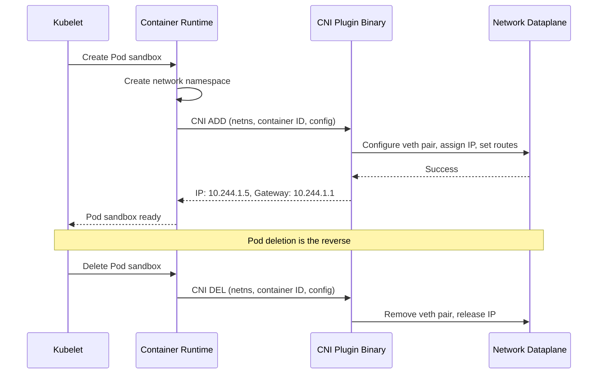
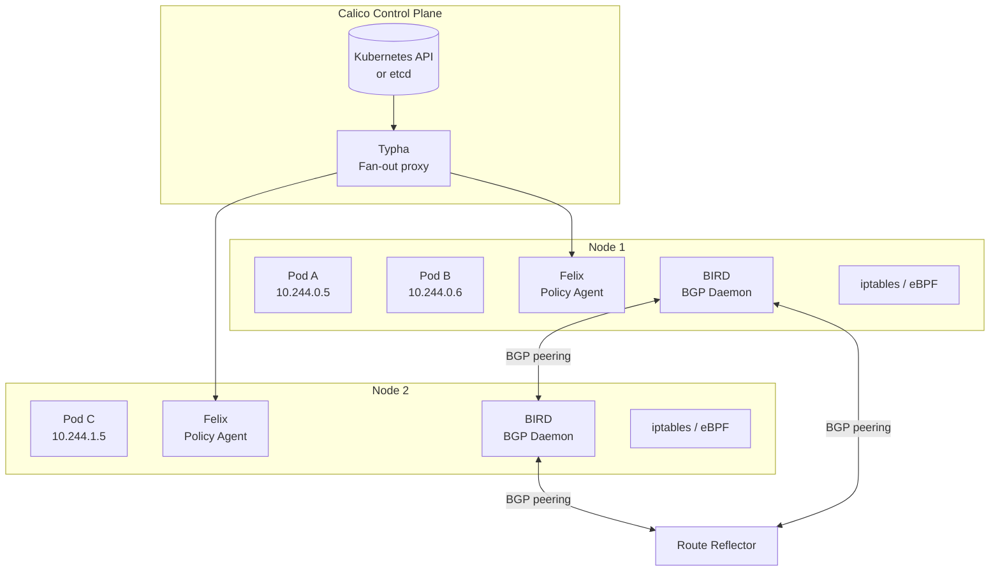
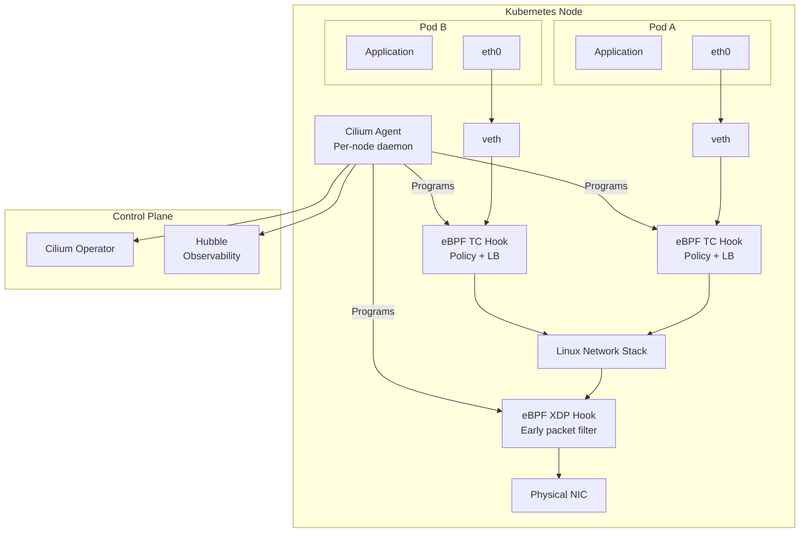

# CNI Plugins & Networking

The Container Network Interface (CNI) is the contract between Kubernetes and the networking layer. When the kubelet creates a pod, it calls the CNI plugin to set up networking — assigning an IP address, configuring routes, and connecting the pod to the cluster network. The choice of CNI plugin determines your cluster's networking performance, security capabilities, observability, and operational complexity.

This is not a neutral choice. Calico and Cilium dominate production deployments, but they make fundamentally different architectural decisions: Calico grew from traditional networking (BGP, iptables) and added eBPF as an option; Cilium was built eBPF-first from the ground up. Understanding these differences matters because migrating CNI plugins on a running cluster is one of the most disruptive operations in Kubernetes.

---

## The CNI Specification

### How CNI Works

The CNI spec defines a simple interface: the container runtime calls a binary with environment variables describing the operation (ADD, DEL, CHECK) and passes a JSON config via stdin. The plugin returns the network configuration (IP address, routes, DNS) via stdout.



### CNI Plugin Chain

CNI supports plugin chaining — multiple plugins execute in sequence. A common pattern:

1. **Main plugin** (Calico, Cilium, Flannel) — assigns IP, sets up routes
2. **IPAM plugin** — manages IP address allocation (host-local, calico-ipam, whereabouts)
3. **Meta plugin** — bandwidth limiting, port mapping, tuning

```json
{
  "cniVersion": "1.0.0",
  "name": "k8s-cluster-network",
  "plugins": [
    {
      "type": "calico",
      "datastore_type": "kubernetes",
      "ipam": {
        "type": "calico-ipam",
        "assign_ipv4": "true",
        "ipv4_pools": ["10.244.0.0/16"]
      }
    },
    {
      "type": "bandwidth",
      "capabilities": { "bandwidth": true }
    },
    {
      "type": "portmap",
      "capabilities": { "portMappings": true }
    }
  ]
}
```

---

## Calico

Calico is the most widely deployed CNI plugin. It started as a pure L3 networking solution using BGP to distribute routes between nodes, avoiding overlay network overhead. It has since added VXLAN overlay support and an eBPF dataplane.

### Architecture



**Components:**

| Component | Role |
|-----------|------|
| **Felix** | Per-node agent. Reads policy from the datastore, programs iptables/eBPF rules, manages routes |
| **BIRD** | BGP daemon. Distributes pod routes to other nodes and external routers |
| **Typha** | Fan-out proxy. Reduces API server load by multiplexing watch connections (essential at 100+ nodes) |
| **confd** | Generates BIRD configuration from the Calico datastore |
| **calico-kube-controllers** | Syncs Kubernetes NetworkPolicy to Calico's datastore |

### BGP Mode (No Overlay)

In BGP mode, Calico distributes pod CIDR routes directly between nodes using BGP. Each node advertises its pod CIDR to peers. Traffic flows at L3 without encapsulation — maximum performance, but requires the underlying network to support it.

```yaml
# Calico BGP configuration
apiVersion: projectcalico.org/v3
kind: BGPConfiguration
metadata:
  name: default
spec:
  logSeverityScreen: Info
  nodeToNodeMeshEnabled: true   # Full mesh for <100 nodes
  asNumber: 64512
  listenPort: 179

---
# For 100+ nodes, disable mesh and use route reflectors
apiVersion: projectcalico.org/v3
kind: BGPConfiguration
metadata:
  name: default
spec:
  nodeToNodeMeshEnabled: false  # Disable full mesh

---
apiVersion: projectcalico.org/v3
kind: BGPPeer
metadata:
  name: route-reflector
spec:
  peerIP: 10.0.0.100
  asNumber: 64512
  nodeSelector: all()
```

::: tip
BGP mode delivers the best performance (no encapsulation overhead) but requires the network fabric to support BGP. On cloud providers, this works with VPC native routing (GKE), but not with default VPC setups on AWS/Azure. For cloud, use VXLAN overlay unless you have confirmed BGP support with your network team.
:::

### eBPF Dataplane

Calico's eBPF dataplane replaces iptables and kube-proxy with eBPF programs. Benefits: faster packet processing, no kube-proxy needed, direct server return (DSR) for load balancing.

```yaml
# Enable eBPF dataplane on Calico
apiVersion: operator.tigera.io/v1
kind: Installation
metadata:
  name: default
spec:
  calicoNetwork:
    linuxDataplane: BPF
    bgp: Enabled
    ipPools:
      - blockSize: 26
        cidr: 10.244.0.0/16
        encapsulation: None
        natOutgoing: Enabled
```

```bash
# Disable kube-proxy (eBPF replaces it)
kubectl patch ds -n kube-system kube-proxy -p \
  '{"spec": {"template": {"spec": {"nodeSelector": {"non-calico": "true"}}}}}'
```

---

## Cilium

Cilium was designed from the ground up around eBPF. It does not use iptables at all — every networking operation (routing, load balancing, network policy, encryption) is implemented as eBPF programs attached to network interfaces.

### Architecture



**Key differentiators:**

| Feature | How Cilium Implements It |
|---------|------------------------|
| **Pod networking** | eBPF programs on veth pairs, no bridge/iptables |
| **Service load balancing** | eBPF replaces kube-proxy, supports Maglev hashing |
| **Network policy** | eBPF map lookups (O(1)), includes L7 policies |
| **Encryption** | WireGuard or IPsec, transparently in eBPF |
| **Observability** | Hubble — eBPF-based flow visibility without packet capture |
| **Service mesh** | Sidecar-free mesh using eBPF (no Envoy sidecar per pod) |

### Cilium Installation

```yaml
# Cilium Helm values for production
apiVersion: helm.toolkit.fluxcd.io/v2beta1
kind: HelmRelease
metadata:
  name: cilium
  namespace: kube-system
spec:
  chart:
    spec:
      chart: cilium
      version: "1.16.x"
      sourceRef:
        kind: HelmRepository
        name: cilium
  values:
    kubeProxyReplacement: true    # Replace kube-proxy entirely
    k8sServiceHost: "api.cluster.local"
    k8sServicePort: 6443

    ipam:
      mode: kubernetes            # Use Kubernetes IPAM

    bpf:
      masquerade: true            # eBPF-based masquerading
      hostLegacyRouting: false

    hubble:
      enabled: true
      relay:
        enabled: true
      ui:
        enabled: true

    encryption:
      enabled: true
      type: wireguard             # Transparent pod-to-pod encryption

    loadBalancer:
      algorithm: maglev           # Consistent hashing for better distribution

    bandwidthManager:
      enabled: true               # eBPF bandwidth management
      bbr: true                   # BBR congestion control
```

### Cilium Network Policy (L7)

Cilium extends standard NetworkPolicy with L7 (application layer) enforcement. This is unique among CNI plugins — you can write policies based on HTTP methods, paths, headers, gRPC services, and Kafka topics.

```yaml
apiVersion: cilium.io/v2
kind: CiliumNetworkPolicy
metadata:
  name: api-l7-policy
  namespace: production
spec:
  endpointSelector:
    matchLabels:
      app: api-server
  ingress:
    - fromEndpoints:
        - matchLabels:
            app: frontend
      toPorts:
        - ports:
            - port: "8080"
              protocol: TCP
          rules:
            http:
              - method: GET
                path: "/api/v1/products.*"
              - method: POST
                path: "/api/v1/orders"
                headers:
                  - 'Content-Type: application/json'
              - method: GET
                path: "/healthz"
    - fromEndpoints:
        - matchLabels:
            app: grpc-client
      toPorts:
        - ports:
            - port: "9090"
              protocol: TCP
          rules:
            http:                 # gRPC uses HTTP/2
              - method: POST
                path: "/com.example.OrderService/.*"
```

### Hubble Observability

Hubble provides network-level observability without packet capture tools. It uses eBPF to trace every packet decision — allows, drops, forwarding — and exposes them as structured events.

```bash
# Install Hubble CLI
cilium hubble enable

# Watch all traffic in a namespace
hubble observe --namespace production

# Watch only dropped traffic (policy violations)
hubble observe --namespace production --verdict DROPPED

# Filter by source and destination
hubble observe --from-pod production/frontend --to-pod production/api-server

# Export as JSON for log aggregation
hubble observe --namespace production --output json | \
  jq '{src: .flow.source.pod_name, dst: .flow.destination.pod_name, verdict: .flow.verdict}'
```

---

## Flannel and Weave

### Flannel

Flannel is the simplest CNI plugin. It creates an overlay network using VXLAN (or host-gw for same-subnet nodes) and assigns each node a /24 subnet from a larger /16 CIDR.

**Flannel does NOT support NetworkPolicy.** If you need policy enforcement with Flannel, deploy Calico alongside it (known as "Canal").

```yaml
# Flannel ConfigMap
net-conf.json: |
  {
    "Network": "10.244.0.0/16",
    "Backend": {
      "Type": "vxlan",
      "VNI": 1,
      "DirectRouting": true
    }
  }
```

### Weave

Weave creates a mesh network between nodes using a custom encapsulation protocol. It supports NetworkPolicy, automatic encryption, and multicast.

```bash
# Install Weave
kubectl apply -f "https://cloud.weave.works/k8s/net?k8s-version=$(kubectl version | base64 | tr -d '\n')"
```

Weave is simpler to operate than Calico or Cilium but has lower performance ceilings and fewer features.

---

## Network Policy Implementation Differences

The same `NetworkPolicy` YAML produces different behavior depending on the CNI plugin, because enforcement happens at different layers.

| Feature | Calico (iptables) | Calico (eBPF) | Cilium | Flannel | Weave |
|---------|-------------------|---------------|--------|---------|-------|
| **Standard NetworkPolicy** | Full | Full | Full | None | Full |
| **L7 policies (HTTP/gRPC)** | No (use CRDs) | No | Yes (native) | No | No |
| **Global policies** | Yes (GlobalNetworkPolicy) | Yes | Yes (CiliumClusterwideNetworkPolicy) | No | No |
| **DNS-based policies** | Yes (Calico CRD) | Yes | Yes (CiliumNetworkPolicy) | No | No |
| **Policy enforcement** | iptables FILTER chain | eBPF tc hooks | eBPF tc hooks | N/A | iptables |
| **Policy lookup complexity** | O(n) chain walk | O(1) map lookup | O(1) map lookup | N/A | O(n) chain walk |
| **FQDN-based egress** | Yes (NetworkSet) | Yes | Yes (toFQDNs) | No | No |

### DNS-Based Egress Policy (Cilium)

Standard NetworkPolicy only supports IP-based rules. Cilium adds FQDN-based egress — essential for allowing traffic to external services like `api.stripe.com` without hardcoding IP addresses:

```yaml
apiVersion: cilium.io/v2
kind: CiliumNetworkPolicy
metadata:
  name: allow-external-apis
  namespace: production
spec:
  endpointSelector:
    matchLabels:
      app: payment-service
  egress:
    - toFQDNs:
        - matchName: "api.stripe.com"
        - matchName: "api.paypal.com"
        - matchPattern: "*.amazonaws.com"
      toPorts:
        - ports:
            - port: "443"
              protocol: TCP
    - toEndpoints:
        - matchLabels:
            io.kubernetes.pod.namespace: kube-system
            k8s-app: kube-dns
      toPorts:
        - ports:
            - port: "53"
              protocol: UDP
```

---

## Performance Comparison

### Throughput Benchmarks

| CNI Plugin | Mode | TCP Throughput (Gbps) | Latency p50 | Latency p99 | CPU Overhead |
|------------|------|----------------------|-------------|-------------|--------------|
| Calico | BGP (no overlay) | 9.2 | 42us | 98us | Low |
| Calico | VXLAN | 7.8 | 68us | 180us | Medium |
| Calico | eBPF | 9.4 | 38us | 82us | Low |
| Cilium | eBPF (native routing) | 9.5 | 35us | 75us | Low |
| Cilium | VXLAN | 8.1 | 62us | 160us | Medium |
| Flannel | VXLAN | 7.2 | 75us | 210us | Medium |
| Weave | Weave overlay | 5.8 | 120us | 350us | High |
| **Host networking** | **No CNI** | **9.8** | **28us** | **55us** | **None** |

*Benchmarks on 25Gbps NIC, 2-node cluster, iperf3, MTU 9000 where supported.*

### Scaling Characteristics

```mermaid
flowchart LR
    subgraph "iptables-based (Calico default, Weave)"
        IPT[Rule count grows O(n)<br/>with pods and policies]
        IPT --> IPT_PERF["Performance degrades at<br/>1000+ pods per node"]
    end

    subgraph "eBPF-based (Cilium, Calico eBPF)"
        BPF[Map lookups O(1)<br/>regardless of scale]
        BPF --> BPF_PERF["Constant performance at<br/>any pod count"]
    end
```

| Scale | iptables (rules) | iptables (latency) | eBPF (maps) | eBPF (latency) |
|-------|------------------|--------------------|-------------|----------------|
| 100 pods | ~2,000 rules | +0.1ms | ~100 entries | +0.02ms |
| 500 pods | ~10,000 rules | +0.5ms | ~500 entries | +0.02ms |
| 2,000 pods | ~40,000 rules | +2ms | ~2,000 entries | +0.02ms |
| 10,000 pods | ~200,000 rules | +8ms | ~10,000 entries | +0.03ms |

::: warning
At 500+ pods per node with complex network policies, iptables-based CNIs show measurable latency degradation. This is the primary technical reason production clusters at scale migrate to Cilium or Calico eBPF mode.
:::

---

## Decision Framework

```
Q: What is your cluster scale?
├── < 200 pods → Any CNI works; Calico is the safe default
├── 200-2000 pods → Calico or Cilium; consider eBPF mode
└── 2000+ pods → Cilium or Calico eBPF strongly recommended

Q: Do you need L7 network policies (HTTP path/method filtering)?
├── Yes → Cilium (native L7) or service mesh
└── No → Any policy-supporting CNI

Q: Do you need NetworkPolicy enforcement?
├── Yes → Calico, Cilium, or Weave (NOT Flannel alone)
└── No → Flannel is the simplest option

Q: Does your network support BGP?
├── Yes → Calico BGP mode (best performance, no overlay)
└── No → VXLAN overlay (Calico, Cilium, or Flannel)

Q: Do you need pod-to-pod encryption?
├── Yes → Cilium (WireGuard), Calico (WireGuard), or Weave (built-in)
└── No → Any CNI

Q: Managed Kubernetes (EKS, GKE, AKS)?
├── EKS → VPC CNI (default) + Calico for policy, or replace with Cilium
├── GKE → Dataplane v2 (Cilium-based) is the default
└── AKS → Azure CNI (default) + Calico for policy, or Cilium
```

---

## Further Reading

- [Network Policies](/infrastructure/kubernetes/network-policies) — writing and testing NetworkPolicy resources across different CNI plugins
- [Services & Ingress](/infrastructure/kubernetes/services-ingress) — how CNI plugins interact with kube-proxy and service routing
- [Architecture Internals](/infrastructure/kubernetes/architecture-internals) — where CNI fits in the Kubernetes component model
- [Calico documentation](https://docs.tigera.io/calico/latest/about/) — official Calico reference
- [Cilium documentation](https://docs.cilium.io/) — official Cilium reference
- [CNI specification](https://www.cni.dev/docs/spec/) — the formal interface contract
- [Benchmark methodology (Cilium)](https://docs.cilium.io/en/stable/operations/performance/benchmark/) — reproducing performance benchmarks
