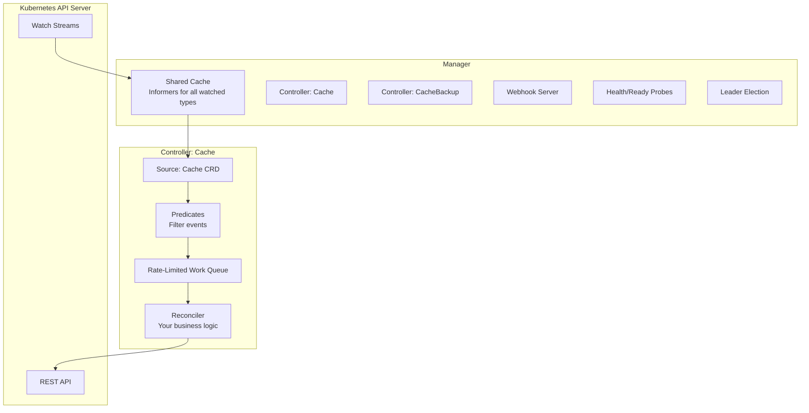
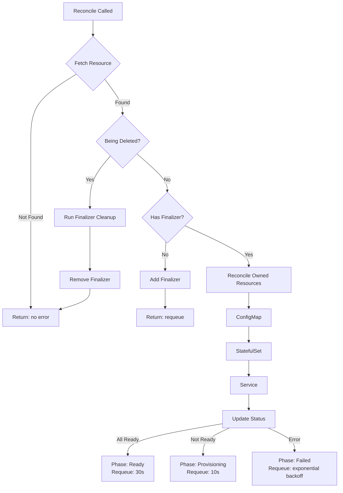
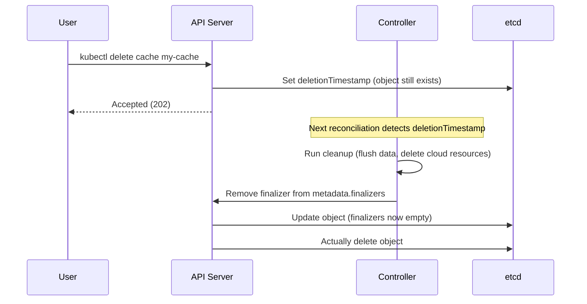

# CRDs & Operators Deep Dive

Custom Resource Definitions let you extend the Kubernetes API with your own resource types. Operators are controllers that watch these custom resources and automate complex operational tasks — backups, failovers, upgrades, scaling — that would otherwise require human intervention. Together, they are the mechanism by which Kubernetes becomes a platform for running anything, not just stateless containers.

This page focuses on the mechanics of building CRDs and operators from first principles. For the conceptual overview and the operator pattern at a higher level, see [Kubernetes Operators](/infrastructure/kubernetes/operators).

---

## Custom Resource Definitions

### CRD Specification Anatomy

A CRD tells the Kubernetes API server about a new resource type. Once applied, the API server dynamically creates REST endpoints for CRUD operations on your custom resource.

```yaml
apiVersion: apiextensions.k8s.io/v1
kind: CustomResourceDefinition
metadata:
  # Name must be: <plural>.<group>
  name: caches.infra.archon.dev
spec:
  group: infra.archon.dev
  scope: Namespaced           # or Cluster
  names:
    plural: caches
    singular: cache
    kind: Cache
    shortNames:
      - ch
    categories:
      - all                   # Shows up in 'kubectl get all'

  versions:
    - name: v1alpha1
      served: true            # API server serves this version
      storage: true           # This version is stored in etcd
      schema:
        openAPIV3Schema:
          type: object
          required: ["spec"]
          properties:
            spec:
              type: object
              required: ["engine", "memory"]
              properties:
                engine:
                  type: string
                  enum: ["redis", "memcached", "valkey"]
                  description: "Cache engine type"
                memory:
                  type: string
                  pattern: '^\d+(Mi|Gi)$'
                  description: "Memory allocation (e.g., 256Mi, 1Gi)"
                replicas:
                  type: integer
                  minimum: 1
                  maximum: 10
                  default: 1
                evictionPolicy:
                  type: string
                  enum: ["allkeys-lru", "volatile-lru", "noeviction"]
                  default: "allkeys-lru"
                tls:
                  type: object
                  properties:
                    enabled:
                      type: boolean
                      default: false
                    secretName:
                      type: string
            status:
              type: object
              properties:
                phase:
                  type: string
                  enum: ["Pending", "Provisioning", "Ready", "Failed", "Terminating"]
                readyReplicas:
                  type: integer
                endpoint:
                  type: string
                conditions:
                  type: array
                  items:
                    type: object
                    required: ["type", "status"]
                    properties:
                      type:
                        type: string
                      status:
                        type: string
                        enum: ["True", "False", "Unknown"]
                      lastTransitionTime:
                        type: string
                        format: date-time
                      reason:
                        type: string
                      message:
                        type: string

      # Status subresource: enables PATCH /status independently of spec
      subresources:
        status: {}
        scale:
          specReplicasPath: .spec.replicas
          statusReplicasPath: .status.readyReplicas

      # Custom columns for kubectl get
      additionalPrinterColumns:
        - name: Engine
          type: string
          jsonPath: .spec.engine
        - name: Memory
          type: string
          jsonPath: .spec.memory
        - name: Replicas
          type: integer
          jsonPath: .spec.replicas
        - name: Phase
          type: string
          jsonPath: .status.phase
        - name: Age
          type: date
          jsonPath: .metadata.creationTimestamp
```

After applying this CRD:

```bash
kubectl apply -f cache-crd.yaml
kubectl get crd caches.infra.archon.dev

# Now you can use it like any built-in resource
kubectl get caches
kubectl get ch               # short name
kubectl describe cache my-cache
kubectl scale cache my-cache --replicas=3
```

### Schema Validation

The `openAPIV3Schema` field provides server-side validation. Every field type, enum constraint, regex pattern, min/max value, and required field is enforced by the API server before the resource is persisted to etcd. This means invalid resources are rejected at admission time, not at reconciliation time.

Key validation features:

| Feature | Schema Keyword | Example |
|---------|---------------|---------|
| Required fields | `required` | `required: ["engine", "memory"]` |
| Enum values | `enum` | `enum: ["redis", "memcached"]` |
| Regex patterns | `pattern` | `pattern: '^\d+Gi$'` |
| Numeric ranges | `minimum`, `maximum` | `minimum: 1, maximum: 10` |
| Default values | `default` | `default: 1` |
| Nested objects | `properties` | Nested `type: object` blocks |
| String formats | `format` | `format: date-time` |

::: tip
Use `x-kubernetes-validations` (CEL expressions, GA since Kubernetes 1.29) for cross-field validation that OpenAPI schema cannot express:

```yaml
x-kubernetes-validations:
  - rule: "self.tls.enabled == true || !has(self.tls.secretName)"
    message: "secretName requires tls.enabled to be true"
  - rule: "self.replicas >= 3 || self.engine != 'redis'"
    message: "Redis clusters require at least 3 replicas"
```
:::

### Multi-Version CRDs

As your CRD evolves, you need to support multiple API versions simultaneously. The `storage` version is what etcd stores. The API server converts between versions using a webhook.

```yaml
versions:
  - name: v1alpha1
    served: true
    storage: false       # No longer the storage version
  - name: v1beta1
    served: true
    storage: true        # New storage version
    schema:
      openAPIV3Schema:
        # v1beta1 adds new fields
        properties:
          spec:
            properties:
              highAvailability:
                type: object
                properties:
                  enabled:
                    type: boolean
                  autoFailover:
                    type: boolean
                    default: true
conversion:
  strategy: Webhook
  webhook:
    conversionReviewVersions: ["v1"]
    clientConfig:
      service:
        name: cache-operator-webhook
        namespace: cache-system
        path: /convert
```

---

## The Controller Pattern

### controller-runtime Architecture

The `controller-runtime` library (used by kubebuilder and Operator SDK) provides the scaffolding for building controllers. Understanding its internals is essential for debugging production operators.



**Manager** — The top-level entry point. Starts all controllers, the webhook server, and health endpoints. Handles leader election for high availability.

**Cache** — Shared across all controllers in the manager. Uses informers internally — one per watched resource type. Reads from the cache are free (in-memory); writes go to the API server.

**Controller** — Watches one or more resource types. Filters events through predicates. Enqueues work items. Dequeues and passes them to the reconciler.

**Reconciler** — Your code. Receives a `Request` (namespace + name), reads the current state, computes the desired state, and takes action to converge.

### Building with kubebuilder

```bash
# Initialize project
kubebuilder init \
  --domain archon.dev \
  --repo github.com/archon/cache-operator

# Create API (CRD + controller)
kubebuilder create api \
  --group infra \
  --version v1alpha1 \
  --kind Cache \
  --resource --controller

# Create webhook (for validation and defaulting)
kubebuilder create webhook \
  --group infra \
  --version v1alpha1 \
  --kind Cache \
  --defaulting --programmatic-validation
```

kubebuilder generates:

```
cache-operator/
  api/v1alpha1/
    cache_types.go          # Type definitions (spec, status)
    cache_webhook.go        # Validation and defaulting webhooks
    zz_generated_deepcopy.go
  internal/controller/
    cache_controller.go     # Reconciler implementation
    cache_controller_test.go
  config/
    crd/                    # Generated CRD YAML
    rbac/                   # Generated RBAC rules
    webhook/                # Webhook configuration
  main.go                   # Manager entry point
```

---

## Reconciliation Loop

The reconciliation loop is the heart of every operator. It must be **idempotent**, **level-triggered**, and **convergent**.

### Full Reconciler Implementation

```go
package controller

import (
    "context"
    "fmt"
    "time"

    appsv1 "k8s.io/api/apps/v1"
    corev1 "k8s.io/api/core/v1"
    "k8s.io/apimachinery/pkg/api/errors"
    metav1 "k8s.io/apimachinery/pkg/apis/meta/v1"
    "k8s.io/apimachinery/pkg/runtime"
    ctrl "sigs.k8s.io/controller-runtime"
    "sigs.k8s.io/controller-runtime/pkg/client"
    "sigs.k8s.io/controller-runtime/pkg/controller/controllerutil"
    "sigs.k8s.io/controller-runtime/pkg/log"

    infrav1 "github.com/archon/cache-operator/api/v1alpha1"
)

const (
    cacheFinalizer = "infra.archon.dev/cache-finalizer"
    requeueDelay   = 30 * time.Second
)

type CacheReconciler struct {
    client.Client
    Scheme *runtime.Scheme
}

func (r *CacheReconciler) Reconcile(ctx context.Context, req ctrl.Request) (ctrl.Result, error) {
    log := log.FromContext(ctx)

    // 1. Fetch the Cache resource
    cache := &infrav1.Cache{}
    if err := r.Get(ctx, req.NamespacedName, cache); err != nil {
        if errors.IsNotFound(err) {
            log.Info("Cache resource deleted, nothing to do")
            return ctrl.Result{}, nil
        }
        return ctrl.Result{}, fmt.Errorf("fetching Cache: %w", err)
    }

    // 2. Handle deletion via finalizer
    if !cache.DeletionTimestamp.IsZero() {
        return r.handleDeletion(ctx, cache)
    }

    // 3. Ensure finalizer is present
    if !controllerutil.ContainsFinalizer(cache, cacheFinalizer) {
        controllerutil.AddFinalizer(cache, cacheFinalizer)
        if err := r.Update(ctx, cache); err != nil {
            return ctrl.Result{}, fmt.Errorf("adding finalizer: %w", err)
        }
        // Return and let the next reconciliation proceed
        return ctrl.Result{}, nil
    }

    // 4. Reconcile owned resources
    if err := r.reconcileConfigMap(ctx, cache); err != nil {
        return ctrl.Result{}, r.updatePhase(ctx, cache, "Failed", err)
    }
    if err := r.reconcileStatefulSet(ctx, cache); err != nil {
        return ctrl.Result{}, r.updatePhase(ctx, cache, "Failed", err)
    }
    if err := r.reconcileService(ctx, cache); err != nil {
        return ctrl.Result{}, r.updatePhase(ctx, cache, "Failed", err)
    }

    // 5. Check readiness and update status
    return r.updateStatus(ctx, cache)
}

func (r *CacheReconciler) handleDeletion(ctx context.Context, cache *infrav1.Cache) (ctrl.Result, error) {
    log := log.FromContext(ctx)

    if !controllerutil.ContainsFinalizer(cache, cacheFinalizer) {
        return ctrl.Result{}, nil
    }

    log.Info("Running cleanup for Cache", "name", cache.Name)

    // Perform cleanup: flush data, remove external resources, etc.
    if err := r.cleanupExternalResources(ctx, cache); err != nil {
        log.Error(err, "Cleanup failed, proceeding anyway to avoid stuck resource")
        // Don't return error — allow deletion to proceed
    }

    controllerutil.RemoveFinalizer(cache, cacheFinalizer)
    if err := r.Update(ctx, cache); err != nil {
        return ctrl.Result{}, fmt.Errorf("removing finalizer: %w", err)
    }

    return ctrl.Result{}, nil
}

// SetupWithManager registers watches for owned resources
func (r *CacheReconciler) SetupWithManager(mgr ctrl.Manager) error {
    return ctrl.NewControllerManagedBy(mgr).
        For(&infrav1.Cache{}).           // Watch Cache CRD
        Owns(&appsv1.StatefulSet{}).     // Watch owned StatefulSets
        Owns(&corev1.Service{}).         // Watch owned Services
        Owns(&corev1.ConfigMap{}).       // Watch owned ConfigMaps
        WithOptions(controller.Options{
            MaxConcurrentReconciles: 5,  // Parallel reconciliation
        }).
        Complete(r)
}
```

### Reconciliation Flow



---

## Status Subresource

The status subresource separates spec (desired state, written by users) from status (observed state, written by the controller). This separation is enforced at the API level — users cannot modify status via `kubectl edit`, and the controller's status updates do not trigger spec-watches.

### Why It Matters

Without the status subresource:
- Every status update modifies the resource, triggering a new reconciliation (infinite loop risk)
- Users can accidentally overwrite status fields via `kubectl apply`
- RBAC cannot distinguish between spec and status permissions

With the status subresource:
- `r.Status().Update(ctx, cache)` only modifies `.status`, does not trigger spec-watches
- Separate RBAC rules for `caches` and `caches/status`
- `kubectl apply` never touches the status field

### Status Update Pattern

```go
func (r *CacheReconciler) updateStatus(ctx context.Context, cache *infrav1.Cache) (ctrl.Result, error) {
    // Read the current StatefulSet to get ready replica count
    sts := &appsv1.StatefulSet{}
    stsName := client.ObjectKey{
        Name:      fmt.Sprintf("%s-cache", cache.Name),
        Namespace: cache.Namespace,
    }

    if err := r.Get(ctx, stsName, sts); err != nil {
        if errors.IsNotFound(err) {
            return ctrl.Result{RequeueAfter: 5 * time.Second}, nil
        }
        return ctrl.Result{}, err
    }

    // Update status fields
    cache.Status.ReadyReplicas = sts.Status.ReadyReplicas
    cache.Status.Endpoint = fmt.Sprintf(
        "%s-cache.%s.svc.cluster.local:6379",
        cache.Name, cache.Namespace,
    )

    if sts.Status.ReadyReplicas == cache.Spec.Replicas {
        cache.Status.Phase = "Ready"
        setCondition(cache, metav1.Condition{
            Type:               "Ready",
            Status:             metav1.ConditionTrue,
            Reason:             "AllReplicasAvailable",
            Message:            "All cache replicas are running",
            LastTransitionTime: metav1.Now(),
        })
    } else {
        cache.Status.Phase = "Provisioning"
        setCondition(cache, metav1.Condition{
            Type:               "Ready",
            Status:             metav1.ConditionFalse,
            Reason:             "ReplicasNotReady",
            Message:            fmt.Sprintf("%d/%d replicas ready", sts.Status.ReadyReplicas, cache.Spec.Replicas),
            LastTransitionTime: metav1.Now(),
        })
    }

    // Use Status().Update, NOT Update
    if err := r.Status().Update(ctx, cache); err != nil {
        return ctrl.Result{}, fmt.Errorf("updating status: %w", err)
    }

    return ctrl.Result{RequeueAfter: requeueDelay}, nil
}
```

---

## Finalizers

Finalizers prevent a resource from being deleted until cleanup logic has run. They are strings added to `metadata.finalizers`. When a delete request arrives, Kubernetes sets `deletionTimestamp` but does not actually remove the object from etcd until all finalizers are removed.

### Finalizer Lifecycle



### Finalizer Anti-Patterns

::: danger
**Stuck finalizers** are the most common operator incident. If the controller is uninstalled while custom resources still have finalizers, the resources can never be deleted. The namespace gets stuck in `Terminating` state.

Prevention strategies:
1. Always delete all custom resources before uninstalling the operator
2. Implement a cleanup flag: `--remove-finalizers-on-shutdown`
3. Document manual finalizer removal: `kubectl patch cache my-cache -p '{"metadata":{"finalizers":null}}' --type=merge`
:::

```go
// Safe finalizer cleanup — never block deletion permanently
func (r *CacheReconciler) cleanupExternalResources(ctx context.Context, cache *infrav1.Cache) error {
    // Use a bounded timeout for cleanup
    cleanupCtx, cancel := context.WithTimeout(ctx, 2*time.Minute)
    defer cancel()

    if err := r.flushCacheData(cleanupCtx, cache); err != nil {
        // Log but DO NOT return error — let deletion proceed
        log.FromContext(ctx).Error(err, "Failed to flush cache data during cleanup")
    }

    if err := r.deleteCloudResources(cleanupCtx, cache); err != nil {
        log.FromContext(ctx).Error(err, "Failed to delete cloud resources during cleanup")
    }

    return nil // Always succeed to avoid stuck resources
}
```

---

## Testing Operators

### envtest Integration Tests

The `envtest` package from controller-runtime spins up a real API server and etcd (without kubelet or scheduler) for integration testing:

```go
func TestCacheReconciler(t *testing.T) {
    g := gomega.NewGomegaWithT(t)

    // Create a Cache resource
    cache := &infrav1.Cache{
        ObjectMeta: metav1.ObjectMeta{
            Name:      "test-cache",
            Namespace: "default",
        },
        Spec: infrav1.CacheSpec{
            Engine:   "redis",
            Memory:   "256Mi",
            Replicas: 3,
        },
    }

    err := k8sClient.Create(ctx, cache)
    g.Expect(err).NotTo(gomega.HaveOccurred())

    // Wait for StatefulSet creation
    sts := &appsv1.StatefulSet{}
    g.Eventually(func() error {
        return k8sClient.Get(ctx, client.ObjectKey{
            Name:      "test-cache-cache",
            Namespace: "default",
        }, sts)
    }, 10*time.Second, 250*time.Millisecond).Should(gomega.Succeed())

    g.Expect(*sts.Spec.Replicas).To(gomega.Equal(int32(3)))

    // Test deletion and finalizer
    err = k8sClient.Delete(ctx, cache)
    g.Expect(err).NotTo(gomega.HaveOccurred())

    g.Eventually(func() bool {
        err := k8sClient.Get(ctx, client.ObjectKeyFromObject(cache), cache)
        return errors.IsNotFound(err)
    }, 10*time.Second, 250*time.Millisecond).Should(gomega.BeTrue())
}
```

---

## Performance Tuning

| Parameter | Default | Recommendation | Impact |
|-----------|---------|---------------|--------|
| `MaxConcurrentReconciles` | 1 | 5-10 for high-volume operators | Parallel reconciliation of different resources |
| `CacheSyncTimeout` | 2 min | Increase for large clusters | Time to populate informer cache on startup |
| `RateLimiter.BaseDelay` | 5ms | Keep default | Delay before first retry on error |
| `RateLimiter.MaxDelay` | 1000s | Reduce to 5min | Max backoff on repeated failures |
| `RecoverPanic` | false | true in production | Prevents single panic from killing the operator |

### Leader Election for HA

```go
mgr, err := ctrl.NewManager(ctrl.GetConfigOrDie(), ctrl.Options{
    Scheme:                 scheme,
    LeaderElection:         true,
    LeaderElectionID:       "cache-operator-leader",
    LeaseDuration:          ptr.To(15 * time.Second),
    RenewDeadline:          ptr.To(10 * time.Second),
    RetryPeriod:            ptr.To(2 * time.Second),
    HealthProbeBindAddress: ":8081",
    MetricsBindAddress:     ":8080",
})
```

::: warning
`RenewDeadline` must be less than `LeaseDuration`. If the leader fails to renew within the deadline, another replica takes over. Set `LeaseDuration` high enough to survive brief network blips (15-30s) but low enough for acceptable failover time.
:::

---

## Further Reading

- [Kubernetes Operators](/infrastructure/kubernetes/operators) — higher-level overview of the operator pattern, maturity model, and real-world war stories
- [Admission Webhooks](/infrastructure/kubernetes/admission-webhooks) — validating and mutating custom resources before they hit etcd
- [Helm Charts](/infrastructure/kubernetes/helm-charts) — packaging your operator for distribution
- [RBAC](/infrastructure/kubernetes/rbac) — scoping your operator's permissions correctly
- [kubebuilder book](https://book.kubebuilder.io/) — official tutorial for building operators with kubebuilder
- [controller-runtime documentation](https://pkg.go.dev/sigs.k8s.io/controller-runtime) — API reference for the controller framework
