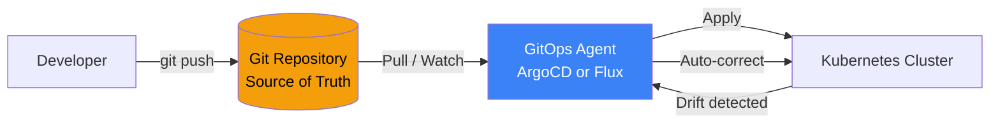
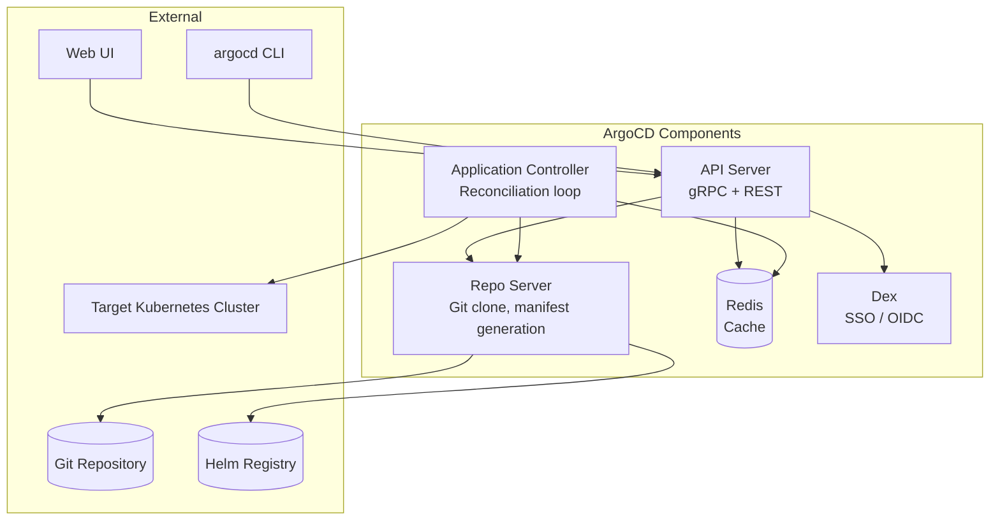
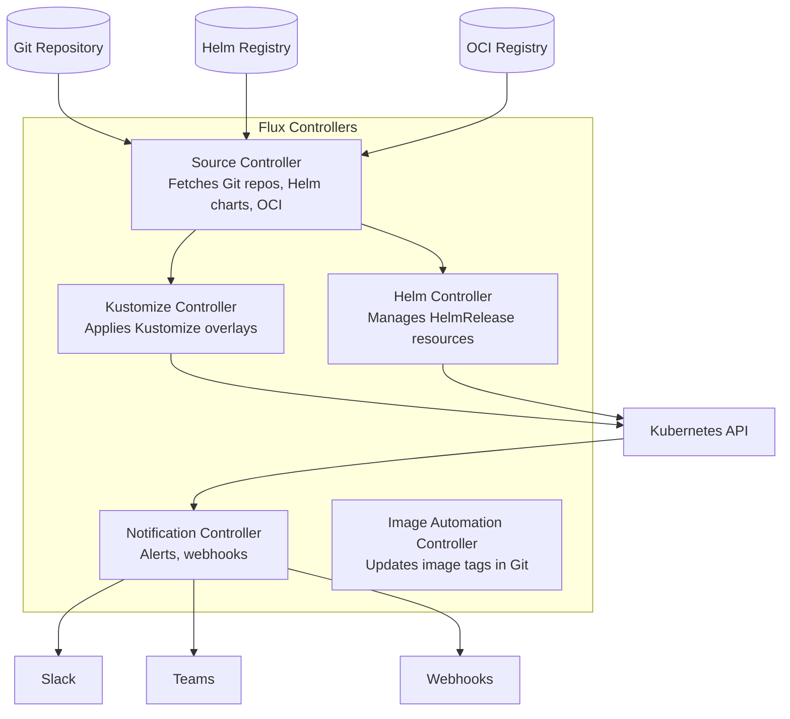

# GitOps (ArgoCD & Flux)

GitOps is an operational model where the desired state of your infrastructure is declared in Git, and an automated system continuously reconciles the actual cluster state to match. You do not `kubectl apply` in production. You do not SSH into servers. You push a commit, and the system converges.

This is not just "infrastructure as code" with extra steps. Traditional CI/CD pushes changes to the cluster. GitOps pulls from Git. This inversion matters: the cluster continuously monitors the source of truth and self-heals when it drifts. If someone manually edits a Deployment, the GitOps controller reverts it. If a node dies and pods restart with stale config, the controller corrects it.

---

## GitOps Principles

The four principles (from the OpenGitOps project, a CNCF sandbox):

1. **Declarative** — The entire system is described declaratively (YAML, Helm charts, Kustomize overlays)
2. **Versioned and immutable** — The desired state is stored in Git, with full history, audit trail, and rollback via `git revert`
3. **Pulled automatically** — Agents in the cluster pull the desired state from Git (not pushed by CI)
4. **Continuously reconciled** — The system detects drift and corrects it automatically



### Push vs Pull Model

| Aspect | Push (Traditional CI/CD) | Pull (GitOps) |
|--------|------------------------|---------------|
| **Who applies** | CI pipeline (Jenkins, GitHub Actions) | In-cluster agent (ArgoCD, Flux) |
| **Credentials** | CI needs cluster credentials | Agent has cluster access, not CI |
| **Drift detection** | None (apply and forget) | Continuous (agent watches state) |
| **Self-healing** | No | Yes (reverts manual changes) |
| **Security** | CI credentials are a high-value target | Cluster credentials stay in-cluster |
| **Audit trail** | CI logs | Git history (who, what, when, why) |

::: tip
GitOps does not replace CI. CI still builds, tests, and pushes container images. GitOps replaces the deployment step — instead of CI running `kubectl apply`, CI updates the image tag in Git, and the GitOps agent deploys it.
:::

---

## ArgoCD

ArgoCD is the most popular GitOps tool. It provides a web UI, CLI, and rich API for managing applications across clusters.

### Architecture



**Components:**

| Component | Role |
|-----------|------|
| **API Server** | Exposes gRPC/REST API, serves the web UI, handles authentication |
| **Repo Server** | Clones Git repos, generates manifests (Helm template, Kustomize build) |
| **Application Controller** | Watches Application CRDs, compares desired vs actual state, syncs |
| **Redis** | Caches Git repo state and app manifests for performance |
| **Dex** | Optional SSO provider (OIDC, LDAP, SAML, GitHub) |

### Application CRD

The core abstraction is the `Application` resource — it maps a Git path to a cluster namespace:

```yaml
apiVersion: argoproj.io/v1alpha1
kind: Application
metadata:
  name: payment-service
  namespace: argocd
  finalizers:
    - resources-finalizer.argocd.argoproj.io
spec:
  project: production

  source:
    repoURL: https://github.com/myorg/k8s-manifests.git
    targetRevision: main
    path: apps/payment-service/overlays/production

  destination:
    server: https://kubernetes.default.svc
    namespace: payment

  syncPolicy:
    automated:
      prune: true              # Delete resources removed from Git
      selfHeal: true           # Revert manual changes in cluster
      allowEmpty: false        # Don't sync if manifest generation produces nothing
    syncOptions:
      - CreateNamespace=true
      - PrunePropagationPolicy=foreground
      - PruneLast=true         # Prune old resources after new ones are healthy
    retry:
      limit: 5
      backoff:
        duration: 5s
        factor: 2
        maxDuration: 3m

  ignoreDifferences:
    # Ignore fields managed by other controllers
    - group: apps
      kind: Deployment
      jsonPointers:
        - /spec/replicas       # HPA manages replicas, not Git
    - group: ""
      kind: Service
      jqPathExpressions:
        - .spec.clusterIP      # Assigned by Kubernetes, not Git
```

### Sync Strategies

| Strategy | `automated` | `prune` | `selfHeal` | Use Case |
|----------|-------------|---------|------------|----------|
| **Manual** | false | - | - | Production with change approval required |
| **Auto sync** | true | false | false | Auto-deploy, but don't delete removed resources |
| **Auto sync + prune** | true | true | false | Full GitOps, but allow temporary manual overrides |
| **Full GitOps** | true | true | true | Complete reconciliation — Git is absolute truth |

::: warning
Be careful with `selfHeal: true` when using HPA (Horizontal Pod Autoscaler). HPA changes `.spec.replicas`, and selfHeal will revert it to the Git value. Use `ignoreDifferences` to exclude HPA-managed fields, as shown above.
:::

### Sync Waves and Hooks

ArgoCD supports ordering resources within a sync using waves (lower numbers sync first) and hooks (pre/post sync jobs):

```yaml
# Namespace must exist before deploying into it
apiVersion: v1
kind: Namespace
metadata:
  name: payment
  annotations:
    argocd.argoproj.io/sync-wave: "-2"

---
# Database migration runs before the application
apiVersion: batch/v1
kind: Job
metadata:
  name: db-migrate
  annotations:
    argocd.argoproj.io/hook: PreSync
    argocd.argoproj.io/hook-delete-policy: HookSucceeded
spec:
  template:
    spec:
      containers:
        - name: migrate
          image: myorg/payment-service:v2.1.0
          command: ["./migrate", "--direction", "up"]
      restartPolicy: Never

---
# Application deployment
apiVersion: apps/v1
kind: Deployment
metadata:
  name: payment-service
  annotations:
    argocd.argoproj.io/sync-wave: "0"
```

---

## Flux v2

Flux v2 is a set of Kubernetes controllers that implement GitOps. Unlike ArgoCD's monolithic architecture, Flux is composed of independent controllers that can be used separately.

### Architecture



### GitRepository Source

```yaml
apiVersion: source.toolkit.fluxcd.io/v1
kind: GitRepository
metadata:
  name: k8s-manifests
  namespace: flux-system
spec:
  interval: 1m                 # Poll frequency
  url: https://github.com/myorg/k8s-manifests.git
  ref:
    branch: main
  secretRef:
    name: git-credentials      # SSH key or token
  ignore: |
    # Ignore files not relevant to deployments
    README.md
    docs/
    .github/
```

### Kustomization Resource

Flux's `Kustomization` (not to be confused with Kustomize's `kustomization.yaml`) ties a Git source to a cluster path:

```yaml
apiVersion: kustomize.toolkit.fluxcd.io/v1
kind: Kustomization
metadata:
  name: payment-service
  namespace: flux-system
spec:
  interval: 5m
  retryInterval: 2m
  timeout: 3m
  sourceRef:
    kind: GitRepository
    name: k8s-manifests
  path: ./apps/payment-service/overlays/production
  prune: true                  # Delete resources removed from Git
  force: false                 # Don't force apply (safe for immutable fields)
  targetNamespace: payment

  # Health checks — wait for rollout before marking as ready
  healthChecks:
    - apiVersion: apps/v1
      kind: Deployment
      name: payment-service
      namespace: payment

  # Dependency ordering
  dependsOn:
    - name: infrastructure     # Wait for infrastructure Kustomization
    - name: cert-manager       # Wait for cert-manager

  # Post-build variable substitution
  postBuild:
    substituteFrom:
      - kind: ConfigMap
        name: cluster-settings
      - kind: Secret
        name: cluster-secrets
```

### HelmRelease

```yaml
apiVersion: helm.toolkit.fluxcd.io/v2beta1
kind: HelmRelease
metadata:
  name: nginx-ingress
  namespace: ingress-system
spec:
  interval: 10m
  chart:
    spec:
      chart: ingress-nginx
      version: "4.x"
      sourceRef:
        kind: HelmRepository
        name: ingress-nginx
      interval: 1h
  values:
    controller:
      replicaCount: 3
      resources:
        requests:
          cpu: 200m
          memory: 256Mi
        limits:
          cpu: 1000m
          memory: 512Mi
      metrics:
        enabled: true
  upgrade:
    remediation:
      remediateLastFailure: true
      retries: 3
  rollback:
    cleanupOnFail: true
```

---

## ArgoCD vs Flux

| Aspect | ArgoCD | Flux v2 |
|--------|--------|---------|
| **Architecture** | Monolithic (single Helm chart) | Modular (independent controllers) |
| **UI** | Rich web UI built-in | No built-in UI (use Weave GitOps or Capacitor) |
| **CLI** | `argocd` CLI with full API access | `flux` CLI for bootstrap and debugging |
| **Multi-cluster** | Native (add clusters via CLI) | Via Kustomization targeting remote clusters |
| **App of apps** | ApplicationSet controller | Kustomization dependencies |
| **Helm support** | Renders templates, applies as plain manifests | Native HelmRelease with lifecycle management |
| **Notifications** | Built-in (Slack, email, webhook) | Notification controller (separate component) |
| **RBAC** | Project-level RBAC, SSO integration | Kubernetes RBAC (service accounts per Kustomization) |
| **Drift detection** | Real-time (watches cluster state) | Periodic (configurable interval) |
| **Learning curve** | Medium (UI helps) | Medium (YAML-first) |
| **Resource usage** | ~500MB RAM (all components) | ~200MB RAM (all controllers) |
| **Best for** | Teams that value a UI, multi-team orgs | Teams that prefer pure Kubernetes-native tools |

::: tip
For platform teams managing many applications across multiple clusters with different team permissions, ArgoCD's UI and project-level RBAC is a significant advantage. For teams that want minimal operational overhead and are comfortable with YAML-only workflows, Flux is leaner and more composable.
:::

---

## Multi-Cluster GitOps

### ArgoCD ApplicationSets

ApplicationSets generate Application resources dynamically — deploy the same app to 50 clusters, or generate one Application per directory in a Git repo.

```yaml
apiVersion: argoproj.io/v1alpha1
kind: ApplicationSet
metadata:
  name: payment-service
  namespace: argocd
spec:
  generators:
    # Deploy to every cluster registered in ArgoCD
    - clusters:
        selector:
          matchLabels:
            environment: production
        values:
          region: '{​{metadata.labels.region}}'

  template:
    metadata:
      name: 'payment-service-{​{name}}'
    spec:
      project: production
      source:
        repoURL: https://github.com/myorg/k8s-manifests.git
        targetRevision: main
        path: 'apps/payment-service/overlays/{​{metadata.labels.environment}}'
        helm:
          parameters:
            - name: region
              value: '{​{values.region}}'
            - name: clusterName
              value: '{​{name}}'
      destination:
        server: '{​{server}}'
        namespace: payment
      syncPolicy:
        automated:
          prune: true
          selfHeal: true
```

### Git Directory Generator

Generate one Application per directory — useful for monorepo structures:

```yaml
apiVersion: argoproj.io/v1alpha1
kind: ApplicationSet
metadata:
  name: all-apps
  namespace: argocd
spec:
  generators:
    - git:
        repoURL: https://github.com/myorg/k8s-manifests.git
        revision: main
        directories:
          - path: apps/*
          - path: apps/legacy-*     # Exclude legacy apps
            exclude: true

  template:
    metadata:
      name: '{​{path.basename}}'
    spec:
      project: default
      source:
        repoURL: https://github.com/myorg/k8s-manifests.git
        targetRevision: main
        path: '{​{path}}/overlays/production'
      destination:
        server: https://kubernetes.default.svc
        namespace: '{​{path.basename}}'
```

### Flux Multi-Cluster

Flux manages multiple clusters from a single Git repo using directory structure:

```
k8s-manifests/
  clusters/
    us-east-1/
      flux-system/           # Flux bootstrap for this cluster
      infrastructure.yaml    # Kustomization pointing to shared infra
      apps.yaml              # Kustomization pointing to apps
    eu-west-1/
      flux-system/
      infrastructure.yaml
      apps.yaml
  infrastructure/
    cert-manager/
    ingress-nginx/
    monitoring/
  apps/
    payment-service/
      base/
      overlays/
        us-east-1/
        eu-west-1/
```

```yaml
# clusters/us-east-1/apps.yaml
apiVersion: kustomize.toolkit.fluxcd.io/v1
kind: Kustomization
metadata:
  name: apps
  namespace: flux-system
spec:
  interval: 10m
  sourceRef:
    kind: GitRepository
    name: k8s-manifests
  path: ./apps
  prune: true
  dependsOn:
    - name: infrastructure
```

---

## Secrets Management in GitOps

Secrets cannot be stored in Git in plaintext. Three production approaches:

### SOPS (Secrets OPerationS)

Mozilla SOPS encrypts secret values while leaving keys and structure visible. Flux has native SOPS support.

```yaml
# Encrypted with SOPS — only values are encrypted
apiVersion: v1
kind: Secret
metadata:
  name: database-credentials
type: Opaque
stringData:
  username: ENC[AES256_GCM,data:abc123...,type:str]
  password: ENC[AES256_GCM,data:def456...,type:str]
sops:
  kms:
    - arn: arn:aws:kms:us-east-1:123456789:key/abc-def
  encrypted_regex: ^(data|stringData)$
  version: 3.8.1
```

```bash
# Encrypt a secret
sops --encrypt --kms arn:aws:kms:us-east-1:123456789:key/abc-def secret.yaml > secret.enc.yaml

# Flux decrypts automatically with SOPS provider configured
```

```yaml
# Flux Kustomization with SOPS decryption
apiVersion: kustomize.toolkit.fluxcd.io/v1
kind: Kustomization
metadata:
  name: secrets
  namespace: flux-system
spec:
  interval: 10m
  sourceRef:
    kind: GitRepository
    name: k8s-manifests
  path: ./secrets/production
  prune: true
  decryption:
    provider: sops
    secretRef:
      name: sops-gpg          # or sops-kms for AWS KMS
```

### Sealed Secrets

Bitnami Sealed Secrets uses asymmetric encryption. You encrypt secrets client-side; only the controller in the cluster can decrypt them.

```bash
# Encrypt a secret (only the cluster's controller can decrypt)
kubeseal --format yaml < secret.yaml > sealed-secret.yaml
```

```yaml
apiVersion: bitnami.com/v1alpha1
kind: SealedSecret
metadata:
  name: database-credentials
  namespace: production
spec:
  encryptedData:
    username: AgBy3i4OJSWK+PiTySYZZA9rO43c...
    password: AgCtr2KJHSD+87asdJKH2309asd...
  template:
    metadata:
      name: database-credentials
      namespace: production
    type: Opaque
```

### External Secrets Operator

For organizations using external secret stores (AWS Secrets Manager, HashiCorp Vault, GCP Secret Manager), the External Secrets Operator syncs secrets from the external store into Kubernetes Secrets.

```yaml
apiVersion: external-secrets.io/v1beta1
kind: ExternalSecret
metadata:
  name: database-credentials
  namespace: production
spec:
  refreshInterval: 1h
  secretStoreRef:
    name: aws-secrets-manager
    kind: ClusterSecretStore
  target:
    name: database-credentials
    creationPolicy: Owner
  data:
    - secretKey: username
      remoteRef:
        key: production/database
        property: username
    - secretKey: password
      remoteRef:
        key: production/database
        property: password
```

### Secrets Approach Comparison

| Approach | Encryption | Key Management | GitOps Compatible | Rotation | Complexity |
|----------|-----------|----------------|-------------------|----------|------------|
| **SOPS** | AES-GCM | KMS, GPG, age | Native (Flux), plugin (ArgoCD) | Manual re-encrypt | Low |
| **Sealed Secrets** | RSA-OAEP | Controller-managed keypair | Yes (commit SealedSecret) | Re-seal required | Low |
| **External Secrets** | At rest in external store | Delegated to store (Vault, AWS) | Yes (commit ExternalSecret) | Automatic via store | Medium |

::: tip
Start with SOPS + age (a modern GPG alternative) for small teams. Move to External Secrets Operator when you have a centralized secret store (Vault, AWS Secrets Manager) that needs to be the source of truth for secrets across multiple clusters and non-Kubernetes systems.
:::

---

## Further Reading

- [Helm Charts](/infrastructure/kubernetes/helm-charts) — packaging applications for GitOps deployment
- [Secrets Management](/infrastructure/kubernetes/secrets-management) — comprehensive secrets management strategies
- [RBAC](/infrastructure/kubernetes/rbac) — configuring access control for GitOps service accounts
- [ArgoCD documentation](https://argo-cd.readthedocs.io/) — official ArgoCD reference
- [Flux documentation](https://fluxcd.io/docs/) — official Flux v2 reference
- [OpenGitOps principles](https://opengitops.dev/) — CNCF GitOps working group standards
- [SOPS](https://github.com/getsops/sops) — secrets encryption for GitOps
