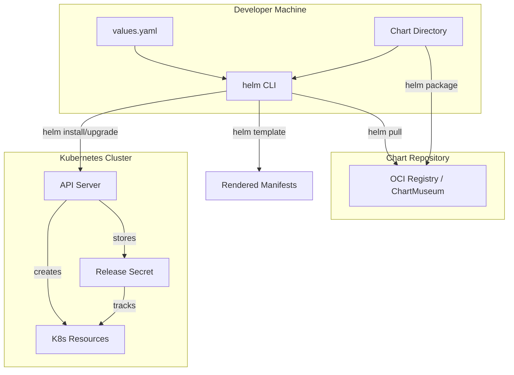
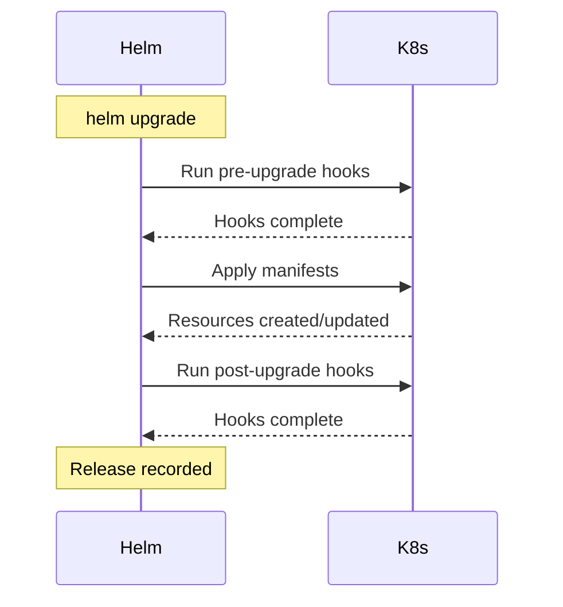

# Helm Charts

## Why It Exists

Deploying a single microservice to Kubernetes requires a minimum of 4-6 YAML manifests: Deployment, Service, ConfigMap, Secret, ServiceAccount, and often Ingress, HPA, PDB, and NetworkPolicy. For a system with 30 microservices, that is 150-200+ YAML files that share 80% of their structure but differ in details like image name, resource limits, and environment variables.

Before Helm, teams either:
- Copy-pasted YAML and manually edited values (error-prone, drift-prone)
- Used `sed`/`envsubst` templating (fragile, no dependency management)
- Wrote custom Go/Python scripts to generate manifests (unmaintainable)

Helm was introduced in 2016 as the "package manager for Kubernetes" — borrowing concepts from `apt`, `yum`, and `brew`. It provides:
1. **Templating** — parameterize YAML with Go templates
2. **Packaging** — bundle related manifests into versioned charts
3. **Release management** — track what is deployed, enable rollbacks
4. **Dependency management** — charts can depend on other charts
5. **Ecosystem** — thousands of community charts for databases, monitoring, etc.

Helm v3 (2019) removed the server-side Tiller component (a major security concern in v2) and stores release state as Kubernetes Secrets in the target namespace.

## First Principles

### The Helm Architecture



### Core Concepts

| Concept | Definition |
|---------|-----------|
| **Chart** | A package of templated K8s manifests + metadata |
| **Release** | A specific installation of a chart with values |
| **Values** | Configuration parameters that customize a chart |
| **Repository** | A collection of charts (HTTP server or OCI registry) |
| **Revision** | A version of a release (incremented on each upgrade) |
| **Hook** | A manifest that runs at specific lifecycle points |

### Release State Storage

Helm v3 stores release information as Kubernetes Secrets:

```bash
# View release secrets
kubectl get secrets -l owner=helm -n production
# NAME                           TYPE                 DATA
# sh.helm.release.v1.myapp.v1   helm.sh/release.v1   1
# sh.helm.release.v1.myapp.v2   helm.sh/release.v1   1
# sh.helm.release.v1.myapp.v3   helm.sh/release.v1   1
```

Each release secret contains a gzipped, base64-encoded JSON object with:
- The chart metadata and templates
- The values used for this revision
- The rendered manifests
- The release status (deployed, failed, superseded, etc.)

## Core Mechanics

### Chart Directory Structure

```
mychart/
├── Chart.yaml              # Chart metadata (name, version, dependencies)
├── Chart.lock              # Locked dependency versions
├── values.yaml             # Default configuration values
├── values.schema.json      # JSON Schema for values validation
├── .helmignore             # Files to exclude from packaging
├── templates/              # Kubernetes manifest templates
│   ├── _helpers.tpl        # Template helper functions
│   ├── NOTES.txt           # Post-install instructions
│   ├── deployment.yaml     # Deployment template
│   ├── service.yaml        # Service template
│   ├── configmap.yaml      # ConfigMap template
│   ├── secret.yaml         # Secret template
│   ├── ingress.yaml        # Ingress template
│   ├── hpa.yaml            # HorizontalPodAutoscaler
│   ├── pdb.yaml            # PodDisruptionBudget
│   ├── serviceaccount.yaml # ServiceAccount
│   ├── networkpolicy.yaml  # NetworkPolicy
│   └── tests/              # Helm test templates
│       └── test-connection.yaml
├── charts/                 # Dependency charts
│   └── redis-17.3.0.tgz   # Packaged dependency
└── crds/                   # Custom Resource Definitions
    └── my-crd.yaml
```

### Chart.yaml

```yaml
apiVersion: v2
name: myapp
description: A production-ready microservice chart
type: application  # or 'library'
version: 1.4.2     # Chart version (SemVer)
appVersion: "3.1.0" # Application version

keywords:
  - microservice
  - api
  - nodejs

home: https://github.com/company/myapp
sources:
  - https://github.com/company/myapp

maintainers:
  - name: Platform Team
    email: platform@company.com

dependencies:
  - name: redis
    version: "~17.3.0"
    repository: "https://charts.bitnami.com/bitnami"
    condition: redis.enabled
  - name: postgresql
    version: "^12.0.0"
    repository: "https://charts.bitnami.com/bitnami"
    condition: postgresql.enabled
  - name: common
    version: "2.x.x"
    repository: "https://charts.bitnami.com/bitnami"
    tags:
      - bitnami-common

annotations:
  artifacthub.io/changes: |
    - kind: added
      description: Support for network policies
    - kind: fixed
      description: Fixed HPA min replicas default
```

### Go Template Engine

Helm uses Go's `text/template` package with Sprig functions. Understanding the template engine is critical.

**Built-in objects:**

| Object | Description |
|--------|-------------|
| `.Values` | Values from values.yaml and --set flags |
| `.Release` | Release metadata (name, namespace, revision) |
| `.Chart` | Chart.yaml contents |
| `.Capabilities` | Cluster capabilities (API versions, K8s version) |
| `.Template` | Current template info |
| `.Files` | Access to non-template files in the chart |

**Template helpers (_helpers.tpl):**

```yaml
{​{- /*
Common labels for all resources
*/ -}}
{​{- define "myapp.labels" -}}
helm.sh/chart: {​{ include "myapp.chart" . }}
app.kubernetes.io/name: {​{ include "myapp.name" . }}
app.kubernetes.io/instance: {​{ .Release.Name }}
app.kubernetes.io/version: {​{ .Chart.AppVersion | quote }}
app.kubernetes.io/managed-by: {​{ .Release.Service }}
{​{- end }}

{​{- define "myapp.selectorLabels" -}}
app.kubernetes.io/name: {​{ include "myapp.name" . }}
app.kubernetes.io/instance: {​{ .Release.Name }}
{​{- end }}

{​{- define "myapp.name" -}}
{​{- default .Chart.Name .Values.nameOverride | trunc 63 | trimSuffix "-" }}
{​{- end }}

{​{- define "myapp.fullname" -}}
{​{- if .Values.fullnameOverride }}
{​{- .Values.fullnameOverride | trunc 63 | trimSuffix "-" }}
{​{- else }}
{​{- $name := default .Chart.Name .Values.nameOverride }}
{​{- if contains $name .Release.Name }}
{​{- .Release.Name | trunc 63 | trimSuffix "-" }}
{​{- else }}
{​{- printf "%s-%s" .Release.Name $name | trunc 63 | trimSuffix "-" }}
{​{- end }}
{​{- end }}
{​{- end }}

{​{- define "myapp.chart" -}}
{​{- printf "%s-%s" .Chart.Name .Chart.Version | replace "+" "_" | trunc 63 | trimSuffix "-" }}
{​{- end }}

{​{- define "myapp.serviceAccountName" -}}
{​{- if .Values.serviceAccount.create }}
{​{- default (include "myapp.fullname" .) .Values.serviceAccount.name }}
{​{- else }}
{​{- default "default" .Values.serviceAccount.name }}
{​{- end }}
{​{- end }}
```

### Production Deployment Template

```yaml
# templates/deployment.yaml
apiVersion: apps/v1
kind: Deployment
metadata:
  name: {​{ include "myapp.fullname" . }}
  namespace: {​{ .Release.Namespace }}
  labels:
    {​{- include "myapp.labels" . | nindent 4 }}
  {​{- with .Values.deploymentAnnotations }}
  annotations:
    {​{- toYaml . | nindent 4 }}
  {​{- end }}
spec:
  {​{- if not .Values.autoscaling.enabled }}
  replicas: {​{ .Values.replicaCount }}
  {​{- end }}
  revisionHistoryLimit: {​{ .Values.revisionHistoryLimit | default 5 }}
  strategy:
    {​{- toYaml .Values.strategy | nindent 4 }}
  selector:
    matchLabels:
      {​{- include "myapp.selectorLabels" . | nindent 6 }}
  template:
    metadata:
      annotations:
        checksum/config: {​{ include (print $.Template.BasePath "/configmap.yaml") . | sha256sum }}
        checksum/secret: {​{ include (print $.Template.BasePath "/secret.yaml") . | sha256sum }}
        {​{- with .Values.podAnnotations }}
        {​{- toYaml . | nindent 8 }}
        {​{- end }}
      labels:
        {​{- include "myapp.labels" . | nindent 8 }}
        {​{- with .Values.podLabels }}
        {​{- toYaml . | nindent 8 }}
        {​{- end }}
    spec:
      {​{- with .Values.imagePullSecrets }}
      imagePullSecrets:
        {​{- toYaml . | nindent 8 }}
      {​{- end }}
      serviceAccountName: {​{ include "myapp.serviceAccountName" . }}
      securityContext:
        {​{- toYaml .Values.podSecurityContext | nindent 8 }}
      {​{- if .Values.terminationGracePeriodSeconds }}
      terminationGracePeriodSeconds: {​{ .Values.terminationGracePeriodSeconds }}
      {​{- end }}
      {​{- with .Values.initContainers }}
      initContainers:
        {​{- toYaml . | nindent 8 }}
      {​{- end }}
      containers:
        - name: {​{ .Chart.Name }}
          securityContext:
            {​{- toYaml .Values.securityContext | nindent 12 }}
          image: "{​{ .Values.image.repository }}:{​{ .Values.image.tag | default .Chart.AppVersion }}"
          imagePullPolicy: {​{ .Values.image.pullPolicy }}
          ports:
            {​{- range .Values.ports }}
            - name: {​{ .name }}
              containerPort: {​{ .containerPort }}
              protocol: {​{ .protocol | default "TCP" }}
            {​{- end }}
          {​{- with .Values.env }}
          env:
            {​{- toYaml . | nindent 12 }}
          {​{- end }}
          {​{- with .Values.envFrom }}
          envFrom:
            {​{- toYaml . | nindent 12 }}
          {​{- end }}
          {​{- if .Values.healthCheck.enabled }}
          livenessProbe:
            {​{- toYaml .Values.healthCheck.liveness | nindent 12 }}
          readinessProbe:
            {​{- toYaml .Values.healthCheck.readiness | nindent 12 }}
          {​{- if .Values.healthCheck.startup }}
          startupProbe:
            {​{- toYaml .Values.healthCheck.startup | nindent 12 }}
          {​{- end }}
          {​{- end }}
          resources:
            {​{- toYaml .Values.resources | nindent 12 }}
          {​{- with .Values.volumeMounts }}
          volumeMounts:
            {​{- toYaml . | nindent 12 }}
          {​{- end }}
        {​{- with .Values.sidecars }}
        {​{- toYaml . | nindent 8 }}
        {​{- end }}
      {​{- with .Values.volumes }}
      volumes:
        {​{- toYaml . | nindent 8 }}
      {​{- end }}
      {​{- with .Values.nodeSelector }}
      nodeSelector:
        {​{- toYaml . | nindent 8 }}
      {​{- end }}
      {​{- with .Values.affinity }}
      affinity:
        {​{- toYaml . | nindent 8 }}
      {​{- end }}
      {​{- with .Values.tolerations }}
      tolerations:
        {​{- toYaml . | nindent 8 }}
      {​{- end }}
      {​{- with .Values.topologySpreadConstraints }}
      topologySpreadConstraints:
        {​{- toYaml . | nindent 8 }}
      {​{- end }}
```

### Production values.yaml

```yaml
# values.yaml — Default values for myapp chart
replicaCount: 2
revisionHistoryLimit: 5

image:
  repository: ghcr.io/company/myapp
  pullPolicy: IfNotPresent
  tag: ""  # Defaults to Chart.AppVersion

imagePullSecrets:
  - name: ghcr-credentials

nameOverride: ""
fullnameOverride: ""

serviceAccount:
  create: true
  annotations: {}
  name: ""

podAnnotations: {}
podLabels: {}
deploymentAnnotations: {}

podSecurityContext:
  runAsNonRoot: true
  runAsUser: 1000
  runAsGroup: 1000
  fsGroup: 1000
  seccompProfile:
    type: RuntimeDefault

securityContext:
  allowPrivilegeEscalation: false
  readOnlyRootFilesystem: true
  capabilities:
    drop:
      - ALL

ports:
  - name: http
    containerPort: 3000
    protocol: TCP
  - name: metrics
    containerPort: 9090
    protocol: TCP

strategy:
  type: RollingUpdate
  rollingUpdate:
    maxUnavailable: 0
    maxSurge: 1

healthCheck:
  enabled: true
  liveness:
    httpGet:
      path: /health/live
      port: http
    initialDelaySeconds: 10
    periodSeconds: 15
    timeoutSeconds: 5
    failureThreshold: 3
  readiness:
    httpGet:
      path: /health/ready
      port: http
    initialDelaySeconds: 5
    periodSeconds: 10
    timeoutSeconds: 5
    failureThreshold: 3
  startup:
    httpGet:
      path: /health/live
      port: http
    initialDelaySeconds: 0
    periodSeconds: 5
    timeoutSeconds: 5
    failureThreshold: 30

service:
  type: ClusterIP
  port: 80
  targetPort: http
  annotations: {}

ingress:
  enabled: false
  className: nginx
  annotations: {}
  hosts:
    - host: myapp.example.com
      paths:
        - path: /
          pathType: Prefix
  tls: []

resources:
  requests:
    cpu: 100m
    memory: 128Mi
  limits:
    cpu: 500m
    memory: 512Mi

autoscaling:
  enabled: true
  minReplicas: 2
  maxReplicas: 10
  targetCPUUtilizationPercentage: 70
  targetMemoryUtilizationPercentage: 80
  behavior:
    scaleDown:
      stabilizationWindowSeconds: 300
      policies:
        - type: Pods
          value: 1
          periodSeconds: 60
    scaleUp:
      stabilizationWindowSeconds: 0
      policies:
        - type: Percent
          value: 100
          periodSeconds: 15

pdb:
  enabled: true
  minAvailable: 1
  # maxUnavailable: 1

networkPolicy:
  enabled: true
  ingress:
    - from:
        - namespaceSelector:
            matchLabels:
              name: ingress-nginx
      ports:
        - port: http

env: []
envFrom: []
volumes: []
volumeMounts: []
sidecars: []
initContainers: []
nodeSelector: {}
tolerations: []
affinity: {}
topologySpreadConstraints: []

# Subchart values
redis:
  enabled: false
  architecture: standalone
  auth:
    enabled: true
    existingSecret: redis-credentials

postgresql:
  enabled: false
  auth:
    existingSecret: postgresql-credentials
```

### Helm Hooks

Hooks allow running actions at specific points in the release lifecycle:



**Available hook events:**

| Hook | When It Runs |
|------|-------------|
| `pre-install` | After templates rendered, before resources created |
| `post-install` | After all resources loaded into K8s |
| `pre-delete` | Before any resources deleted |
| `post-delete` | After all resources deleted |
| `pre-upgrade` | After templates rendered, before resources updated |
| `post-upgrade` | After all resources updated |
| `pre-rollback` | Before rollback |
| `post-rollback` | After rollback |
| `test` | When `helm test` is invoked |

**Database migration hook:**

```yaml
# templates/hooks/db-migrate.yaml
apiVersion: batch/v1
kind: Job
metadata:
  name: {​{ include "myapp.fullname" . }}-db-migrate
  labels:
    {​{- include "myapp.labels" . | nindent 4 }}
  annotations:
    "helm.sh/hook": pre-upgrade,pre-install
    "helm.sh/hook-weight": "-5"
    "helm.sh/hook-delete-policy": before-hook-creation
spec:
  backoffLimit: 3
  activeDeadlineSeconds: 300
  template:
    metadata:
      labels:
        {​{- include "myapp.selectorLabels" . | nindent 8 }}
    spec:
      restartPolicy: Never
      serviceAccountName: {​{ include "myapp.serviceAccountName" . }}
      securityContext:
        {​{- toYaml .Values.podSecurityContext | nindent 8 }}
      containers:
        - name: migrate
          image: "{​{ .Values.image.repository }}:{​{ .Values.image.tag | default .Chart.AppVersion }}"
          command: ["node", "dist/migrations/run.js"]
          envFrom:
            - secretRef:
                name: {​{ include "myapp.fullname" . }}-db-credentials
          resources:
            requests:
              cpu: 100m
              memory: 256Mi
            limits:
              cpu: 500m
              memory: 512Mi
```

**Hook delete policies:**

| Policy | Behavior |
|--------|----------|
| `before-hook-creation` | Delete previous hook resource before new one is created |
| `hook-succeeded` | Delete after hook succeeds |
| `hook-failed` | Delete after hook fails |

::: warning
Always set `helm.sh/hook-delete-policy: before-hook-creation` for Job hooks. Without it, the Job from a previous release will block the new hook from running (Job names must be unique).
:::

### Values Schema Validation

```json
{
  "$schema": "https://json-schema.org/draft-07/schema#",
  "type": "object",
  "required": ["image", "resources"],
  "properties": {
    "replicaCount": {
      "type": "integer",
      "minimum": 1,
      "maximum": 50
    },
    "image": {
      "type": "object",
      "required": ["repository"],
      "properties": {
        "repository": {
          "type": "string",
          "pattern": "^[a-z0-9._/-]+$"
        },
        "tag": {
          "type": "string"
        },
        "pullPolicy": {
          "type": "string",
          "enum": ["Always", "IfNotPresent", "Never"]
        }
      }
    },
    "resources": {
      "type": "object",
      "required": ["requests", "limits"],
      "properties": {
        "requests": {
          "type": "object",
          "required": ["cpu", "memory"],
          "properties": {
            "cpu": { "type": "string" },
            "memory": { "type": "string" }
          }
        },
        "limits": {
          "type": "object",
          "required": ["cpu", "memory"],
          "properties": {
            "cpu": { "type": "string" },
            "memory": { "type": "string" }
          }
        }
      }
    }
  }
}
```

## Implementation — Helmfile Orchestration

Helmfile manages multiple Helm releases declaratively, solving the "how do I deploy 30 charts consistently" problem.

```yaml
# helmfile.yaml
repositories:
  - name: bitnami
    url: https://charts.bitnami.com/bitnami
  - name: ingress-nginx
    url: https://kubernetes.github.io/ingress-nginx
  - name: prometheus
    url: https://prometheus-community.github.io/helm-charts

environments:
  staging:
    values:
      - environments/staging/values.yaml
    secrets:
      - environments/staging/secrets.yaml
    kubeContext: staging-cluster
  production:
    values:
      - environments/production/values.yaml
    secrets:
      - environments/production/secrets.yaml
    kubeContext: production-cluster

helmDefaults:
  createNamespace: true
  wait: true
  waitForJobs: true
  timeout: 600
  cleanupOnFail: true
  atomic: true

releases:
  # Infrastructure tier
  - name: ingress-nginx
    namespace: ingress-nginx
    chart: ingress-nginx/ingress-nginx
    version: 4.10.0
    values:
      - charts/ingress-nginx/values.yaml
      - charts/ingress-nginx/values.{​{ .Environment.Name }}.yaml

  - name: cert-manager
    namespace: cert-manager
    chart: jetstack/cert-manager
    version: 1.14.0
    values:
      - installCRDs: true

  # Monitoring tier
  - name: prometheus-stack
    namespace: monitoring
    chart: prometheus/kube-prometheus-stack
    version: 57.0.0
    needs:
      - ingress-nginx/ingress-nginx
    values:
      - charts/prometheus-stack/values.yaml
      - charts/prometheus-stack/values.{​{ .Environment.Name }}.yaml

  # Application tier
  - name: api-gateway
    namespace: production
    chart: ./charts/myapp
    needs:
      - ingress-nginx/ingress-nginx
      - monitoring/prometheus-stack
    values:
      - charts/api-gateway/values.yaml
      - charts/api-gateway/values.{​{ .Environment.Name }}.yaml
    set:
      - name: image.tag
        value: {​{ requiredEnv "API_GATEWAY_TAG" }}

  - name: user-service
    namespace: production
    chart: ./charts/myapp
    needs:
      - production/api-gateway
    values:
      - charts/user-service/values.yaml
      - charts/user-service/values.{​{ .Environment.Name }}.yaml
    set:
      - name: image.tag
        value: {​{ requiredEnv "USER_SERVICE_TAG" }}

  - name: order-service
    namespace: production
    chart: ./charts/myapp
    needs:
      - production/api-gateway
    values:
      - charts/order-service/values.yaml
      - charts/order-service/values.{​{ .Environment.Name }}.yaml
    set:
      - name: image.tag
        value: {​{ requiredEnv "ORDER_SERVICE_TAG" }}
```

**Helmfile commands:**

```bash
# Diff before applying (requires helm-diff plugin)
helmfile -e production diff

# Apply to production
helmfile -e production apply

# Sync specific releases
helmfile -e production -l name=api-gateway apply

# Destroy everything
helmfile -e staging destroy

# Template for debugging
helmfile -e production template > rendered.yaml
```

### Library Charts

Library charts provide reusable template helpers without rendering any resources themselves:

```yaml
# Chart.yaml for the library chart
apiVersion: v2
name: common-lib
type: library
version: 1.0.0
description: Common templates for all microservices
```

```yaml
# templates/_pod.tpl in the library chart
{​{- define "common-lib.pod" -}}
metadata:
  annotations:
    cluster-autoscaler.kubernetes.io/safe-to-evict: "true"
    {​{- with .Values.podAnnotations }}
    {​{- toYaml . | nindent 4 }}
    {​{- end }}
spec:
  serviceAccountName: {​{ include "common-lib.serviceAccountName" . }}
  automountServiceAccountToken: {​{ .Values.automountServiceAccountToken | default false }}
  securityContext:
    runAsNonRoot: true
    runAsUser: {​{ .Values.securityContext.runAsUser | default 65534 }}
    fsGroup: {​{ .Values.securityContext.fsGroup | default 65534 }}
    seccompProfile:
      type: RuntimeDefault
  terminationGracePeriodSeconds: {​{ .Values.terminationGracePeriodSeconds | default 30 }}
{​{- end }}
```

Consumer charts reference the library:

```yaml
# Chart.yaml in the consumer chart
dependencies:
  - name: common-lib
    version: "1.x.x"
    repository: "oci://ghcr.io/company/charts"
```

```yaml
# templates/deployment.yaml in the consumer chart
apiVersion: apps/v1
kind: Deployment
metadata:
  name: {​{ include "common-lib.fullname" . }}
spec:
  template:
    {​{- include "common-lib.pod" . | nindent 4 }}
```

## Edge Cases and Failure Modes

### 1. Template Rendering Failures

The most common Helm failure is template rendering errors. These are often caused by missing values, nil pointer dereferences, or type mismatches.

```bash
# Always validate before deploying
helm template myapp ./charts/myapp -f values.yaml --debug 2>&1 | head -50

# Lint for common issues
helm lint ./charts/myapp -f values.yaml --strict
```

**Common template errors and fixes:**

```yaml
# ERROR: nil pointer evaluating interface {}.enabled
# BAD:
{​{- if .Values.monitoring.enabled }}
# GOOD (nil-safe):
{​{- if ((.Values.monitoring).enabled) }}
# Or with default:
{​{- if .Values.monitoring | default dict | dig "enabled" false }}
```

### 2. Release Stuck in PENDING-UPGRADE

If a Helm upgrade is interrupted (timeout, network failure), the release gets stuck in `pending-upgrade` state. Subsequent upgrades fail.

```bash
# Check release status
helm history myapp -n production

# Fix: rollback to last successful revision
helm rollback myapp 3 -n production

# Nuclear option: delete the pending release secret
kubectl delete secret sh.helm.release.v1.myapp.v4 -n production
```

### 3. CRD Management Pitfalls

Helm does NOT update CRDs on upgrade — only installs them on first `helm install`. This is by design to prevent accidental CRD changes that could break existing CRs.

```bash
# Check if CRDs need manual update
helm template myapp ./charts/myapp --show-only crds/

# Manually apply CRD updates
kubectl apply -f crds/ --server-side --force-conflicts
```

### 4. Values Merge Behavior

Helm performs a deep merge of values files, which can lead to unexpected results:

```yaml
# values.yaml
resources:
  requests:
    cpu: 100m
    memory: 128Mi
  limits:
    cpu: 500m
    memory: 512Mi

# values.production.yaml — intending to only set limits
resources:
  limits:
    cpu: "2"
    memory: 2Gi

# Result: requests are PRESERVED from base values
# resources.requests.cpu = 100m (preserved)
# resources.limits.cpu = 2 (overridden)
```

To explicitly clear a value, set it to `null`:

```yaml
# Force removal
resources:
  requests: null
  limits:
    cpu: "2"
    memory: 2Gi
```

## Performance Characteristics

### Helm Operation Timings

| Operation | Small Chart (5 templates) | Large Chart (50 templates) | Helmfile (30 releases) |
|-----------|--------------------------|---------------------------|----------------------|
| `helm template` | 50-100ms | 200-500ms | N/A |
| `helm install` | 2-5s | 5-15s | 60-180s |
| `helm upgrade` | 2-5s | 5-15s | 30-120s |
| `helm rollback` | 1-3s | 3-8s | 20-60s |
| `helm list` | 100-500ms | 100-500ms | 1-3s |
| `helmfile diff` | N/A | N/A | 30-90s |

### Release Secret Size

Each release secret stores the complete chart + rendered manifests. For large charts:

$$
S_{release} = S_{chart} + S_{values} + S_{manifests} \approx 50\text{KB} - 500\text{KB (compressed)}
$$

With the default 10-revision history limit:

$$
S_{total} = 10 \times S_{release} \approx 500\text{KB} - 5\text{MB per release}
$$

For 30 microservices:

$$
S_{cluster} = 30 \times 5\text{MB} = 150\text{MB of Secrets in etcd}
$$

::: warning
Reduce `revisionHistoryLimit` for large charts or clusters with many releases. 5 revisions is usually sufficient.
:::

## Mathematical Foundations

### SemVer Constraint Resolution

Helm uses SemVer 2.0 for version constraints. The resolution algorithm:

Given a constraint $C$ and a set of available versions $V = \{v_1, v_2, ..., v_n\}$:

$$
\text{resolve}(C, V) = \max(\{v \in V \mid v \models C\})
$$

Constraint operators:

| Constraint | Meaning | Example |
|-----------|---------|---------|
| `=1.2.3` | Exact match | Only 1.2.3 |
| `>=1.2.3` | Greater or equal | 1.2.3, 1.3.0, 2.0.0 |
| `~1.2.0` | Patch-level range | >=1.2.0, <1.3.0 |
| `^1.2.0` | Minor-level range | >=1.2.0, <2.0.0 |
| `1.2.x` | Wildcard patch | Same as ~1.2.0 |
| `>=1.2.0, <2.0.0` | Range intersection | Between 1.2.0 and 2.0.0 |

### Dependency Resolution Order

Helmfile resolves the dependency graph as a Directed Acyclic Graph (DAG):

$$
G = (R, E) \text{ where } R = \text{releases}, E = \text{needs edges}
$$

The deployment order is a topological sort:

$$
\text{order} = \text{TopSort}(G) = [r_1, r_2, ..., r_n] \text{ where } \forall (r_i, r_j) \in E: i < j
$$

If the graph has a cycle, Helmfile will error out. The time complexity of the topological sort is $O(|R| + |E|)$.

## Real-World War Stories

::: info War Story — The Checksum Annotation That Saved the Day
A team was deploying a ConfigMap change but forgot that pods do not automatically restart when ConfigMaps change. The application continued serving stale configuration for 3 hours until a developer noticed.

The fix was the checksum annotation pattern:

```yaml
annotations:
  checksum/config: {​{ include (print $.Template.BasePath "/configmap.yaml") . | sha256sum }}
```

This forces a rolling restart whenever the ConfigMap content changes, because the annotation on the pod template changes, triggering a Deployment rollout. This pattern is now standard in all their charts.
:::

::: info War Story — Helmfile Parallel Apply Gone Wrong
A platform team enabled `--concurrency 10` on Helmfile to speed up deployments. During a release, the Redis chart and the application chart were deployed simultaneously. The application started before Redis was ready, hit connection timeouts, failed health checks, and was killed by Kubernetes. The new pods also failed, causing a cascading failure.

**Fix:** They added proper `needs:` dependencies in Helmfile and used startup probes with generous failure thresholds. They also reduced concurrency to 3 with explicit dependency ordering.
:::

::: info War Story — The 1GB Release Secret
A team included binary assets (ML model files) in their Helm chart templates as base64-encoded ConfigMaps. Each release secret stored the complete rendered manifests, which included the 100MB model. With 10 revisions, they had 1GB of release secrets in etcd. etcd performance degraded, affecting the entire cluster.

**Fix:** Moved model files to an init container that downloads from S3. Reduced release history to 3 revisions. Added a CI check that fails if rendered manifests exceed 5MB.
:::

## Decision Framework

### When to Use Helm vs. Alternatives

| Scenario | Helm | Kustomize | Raw YAML | cdk8s/Pulumi |
|----------|------|-----------|----------|--------------|
| Community charts (Prometheus, nginx) | Best | Possible (post-render) | Manual | Possible |
| Internal microservices | Good | Good | Tedious | Good |
| Complex templating logic | Good | Limited | N/A | Best |
| GitOps (ArgoCD/Flux) | Good | Best | Good | Limited |
| Learning curve | Medium | Low | Low | High |
| Rollback capability | Built-in | Manual | Manual | Provider-dependent |
| Multi-env management | Good (with Helmfile) | Good (overlays) | Bad | Good |

### Chart Design Principles

1. **Sensible defaults** — `values.yaml` should produce a working deployment without any overrides
2. **Opt-in complexity** — features like HPA, PDB, NetworkPolicy should be behind `.enabled` flags
3. **No hardcoded values** — every meaningful value should be configurable
4. **Schema validation** — always include `values.schema.json`
5. **Minimal templating** — if a template function exceeds 20 lines, it should be in `_helpers.tpl`

## Advanced Topics

### OCI-Based Chart Distribution

Helm 3.8+ supports OCI registries as chart repositories:

```bash
# Login to registry
helm registry login ghcr.io -u username -p token

# Package and push
helm package ./charts/myapp
helm push myapp-1.4.2.tgz oci://ghcr.io/company/charts

# Pull and install
helm install myapp oci://ghcr.io/company/charts/myapp --version 1.4.2
```

### Helm with ArgoCD

```yaml
# ArgoCD Application using Helm
apiVersion: argoproj.io/v1alpha1
kind: Application
metadata:
  name: myapp
  namespace: argocd
spec:
  project: default
  source:
    repoURL: https://github.com/company/k8s-deployments
    targetRevision: main
    path: charts/myapp
    helm:
      releaseName: myapp
      valueFiles:
        - values.yaml
        - values.production.yaml
      parameters:
        - name: image.tag
          value: "3.1.0"
  destination:
    server: https://kubernetes.default.svc
    namespace: production
  syncPolicy:
    automated:
      prune: true
      selfHeal: true
    syncOptions:
      - CreateNamespace=true
      - ServerSideApply=true
    retry:
      limit: 5
      backoff:
        duration: 5s
        factor: 2
        maxDuration: 3m
```

### Chart Testing with ct (chart-testing)

```yaml
# ct.yaml
target-branch: main
chart-dirs:
  - charts
chart-repos:
  - bitnami=https://charts.bitnami.com/bitnami
helm-extra-args: --timeout 600s
validate-maintainers: false
```

```bash
# Lint changed charts
ct lint --config ct.yaml

# Install and test changed charts (requires a cluster)
ct install --config ct.yaml --upgrade

# In CI (GitHub Actions)
# Uses kind cluster for testing
```

### Helm Post-Renderer with Kustomize

Combine Helm templating with Kustomize patches:

```bash
#!/bin/bash
# kustomize-post-render.sh
cat > /tmp/helm-output.yaml
kustomize build /tmp/kustomize-overlay
```

```yaml
# kustomization.yaml
resources:
  - helm-output.yaml
patches:
  - patch: |
      - op: add
        path: /metadata/annotations/custom.io~1managed
        value: "true"
    target:
      kind: Deployment
```

```bash
helm install myapp ./charts/myapp --post-renderer ./kustomize-post-render.sh
```

This is particularly useful when you need to apply organization-wide patches (labels, annotations, sidecars) to third-party charts without forking them.

---

*Next: [Operators](./operators.md) — The Operator pattern, CRDs, controller reconciliation loops, and building operators with the Operator SDK.*
